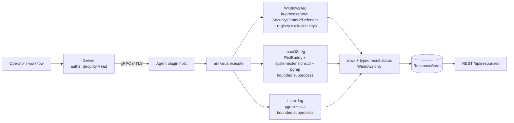

# antivirus

<!-- BEGIN GENERATED: plugin-doc-gen header -->
| | |
|---|---|
| **What it does** | Antivirus product detection, status, and Defender exclusions |
| **Version** | 0.3.0 |
| **Kind** | Collector · read-only · gathered (security.antivirus.products, security.antivirus.defender_status, security.antivirus.xprotect_status, security.antivirus.av_exclusions) |
| **Platforms** | Windows ✅ · macOS ✅ · Linux ✅ |
| **Actions** | `av_exclusions` (definition `security.antivirus.av_exclusions`) · `products` (definition `security.antivirus.products`) · `status` (definition `security.antivirus.defender_status`, `security.antivirus.xprotect_status`) |
| **Security** | `products`: securable `Security` · operation Read · risk Low · dispatch ReadOnly · approval gate None; `status`: securable `Security` · operation Read · risk Low · dispatch ReadOnly · approval gate None; `av_exclusions`: securable `Security` · operation Read · risk Medium · dispatch ReadOnly · approval gate None |
| **Roles** | execute: endpoint-admin, endpoint-operator, security-admin · author: content-author |
<!-- END GENERATED -->

## How it works

`products` enumerates installed/running AV products. Windows queries `root\SecurityCenter2` for `AntiVirusProduct` rows in-process via WMI and decodes each `productState` into enabled/snoozed/disabled plus a current/stale definitions field. Linux checks for `clamd`, `falcon-sensor`, and `sophos` via `pgrep`, falling back to an install-directory check for the latter two. macOS probes the XProtect definition bundle for identity, then enumerates endpoint-security system extensions for third-party EDR/AV, falling back to `pgrep` only for vendors the extension registry didn't already report.

`status` reports engine/definitions freshness. Windows queries `MSFT_MpComputerStatus` for real-time protection, signature version, and scan times. macOS reads the XProtect bundle's version and modification time plus the Remediator/MRT engine versions — no real-time-protection field, since macOS exposes no queryable equivalent. Linux checks ClamAV liveness plus its signature database's mtime, and reports CrowdStrike/Sophos presence only (no freshness data is reachable at this leg's rung).

`av_exclusions` is Windows-only: it reads Defender's Paths/Processes/Extensions exclusion keys from both the operator-editable local hive and the GPO/MDM policy hive, merges the two with per-entry provenance, and reports the worst of six subkey-read outcomes as the action's status. Linux and macOS have no equivalent exclusion store to read, so the action reports `unsupported` there rather than guessing.

The plugin deliberately stops at raw posture: a snoozed or disabled product is reported honestly, never normalized into a compliance verdict — that judgment belongs to a downstream policy engine.



## OS capability

<!-- BEGIN GENERATED: plugin-doc-gen capability -->
| Action | Windows | macOS | Linux |
|---|---|---|---|
| `av_exclusions` | ✅ supported · rung 1 · win32_registry | ⛔ unsupported | ⛔ unsupported |
| `products` | ✅ supported · rung 1 · wmi_securitycenter2 | ✅ supported · rung 2 · plistbuddy+systemextensionsctl+pgrep | ✅ supported · rung 2 · pgrep+filesystem_probe |
| `status` | ✅ supported · rung 1 · wmi_defender_status | ✅ supported · rung 2 · plistbuddy+stat | ✅ supported · rung 2 · pgrep+stat |

**Declared limits per leg** (descriptor fallback text, verbatim):

- **`av_exclusions` / Windows** — permission_denied sentinel on ACL'd key, never a silent empty list
- **`av_exclusions` / macOS** — Windows-only concept
- **`av_exclusions` / Linux** — Windows-only concept
- **`status` / Linux** — ClamAV liveness+definitions mtime; CrowdStrike/Sophos presence-only
<!-- END GENERATED -->

## Privileges and prerequisites

| OS | Runs as | Extra grant needed | Measured | If the read is refused |
|---|---|---|---|---|
| Windows | agent service account, captured as `SYSTEM` (LocalSystem today, #1442) | None observed. In-process WMI queries against SecurityCenter2/Defender and the Defender exclusion registry keys all succeeded under this identity. | 2026-09-07, bare-metal host, `SYSTEM` | `products`/`status`: `not_available\|<WMI error text>` row + `UNAVAILABLE`/`PARTIAL`. `av_exclusions`: a per-subkey `ERROR_ACCESS_DENIED` open renders `permission_denied\|exclusions <kind> access denied` and the action's status becomes `PERMISSION_DENIED`/`PARTIAL`. |
| macOS | agent daemon (docs describe default/unprivileged; sample was captured as an interactive user, euid 501, not the daemon identity) | None — `PlistBuddy`, `systemextensionsctl list`, and `pgrep` are all unprivileged reads. | 2026-09-07, bare-metal, euid 501 (jsmith) | An unreadable XProtect bundle renders `av\|XProtect\|unknown` (`products`) or `status\|unknown` (`status`) — never assumed active/healthy. |
| Linux | agent daemon (docs describe default/unprivileged; sample was captured as root in a container) | None — `pgrep` and the `/opt/*` existence checks need no capability. | 2026-09-06, container, euid 0 | A failed `pgrep` invocation is forwarded once via `forward_runner_failure`; the affected product renders as `not_running`/`not_detected` rather than crashing or fabricating a state. |

Binaries/subprocesses: macOS — `/usr/libexec/PlistBuddy`, `/usr/bin/systemextensionsctl`, `/usr/bin/pgrep` (bounded subprocess, 5s deadline). Linux — `/usr/bin/pgrep` or `/bin/pgrep` (bounded subprocess, 5s deadline). Windows — none; WMI and registry access are in-process. No network access on any OS.

## Data contract

### Inputs

<!-- BEGIN GENERATED: plugin-doc-gen inputs -->
No action takes parameters.
<!-- END GENERATED -->

### Outputs

Pipe-delimited rows, one per record, with the first field a literal row-type discriminator. `products` also emits ancillary single-purpose rows outside the `av|` shape: `av_count|0` when nothing was found, `xprotect_version|<n>` alongside `av|XProtect|active` on macOS, `edr|<bundle_id>|<version>` per detected macOS endpoint-security extension, and `not_available|<detail>` on Windows when the SecurityCenter2 query itself failed. `av_exclusions` likewise emits `exclusion_count|0` (clean empty read), or a typed `permission_denied|…` / `not_available|…` / `partial|…` row when a subkey read failed, or `unsupported|av_exclusions is Windows-only` on Linux/macOS. A missing WMI property is simply omitted from `status`'s Windows output, never fabricated.

<!-- BEGIN GENERATED: plugin-doc-gen outputs -->
**`security.antivirus.av_exclusions` — `kind|source|value`**

| Field | Type | Values | Available | Example | Description |
|---|---|---|---|---|---|
| `kind` | string | `path` `process` `extension` | Windows | `path` | Which Defender exclusion list the value belongs to. |
| `source` | string | `local` `policy` `both` | Windows | `local` | Which registry hive the exclusion came from; "both" means it is present in both. |
| `value` | string | - | Windows | `D:\yuzu-dev` | The excluded path, process, or extension, sanitized. Vendor/operator-controlled free text. |

**`security.antivirus.defender_status` — `realtime_protection|definition_version|last_update|last_quick_scan`**

| Field | Type | Values | Available | Example | Description |
|---|---|---|---|---|---|
| `realtime_protection` | string | `enabled` `disabled` | Windows | `enabled` | Whether Windows Defender real-time protection is on. Row is omitted entirely when the WMI property is absent — never fabricated. |
| `definition_version` | string | - | Windows | `1.459.88.0` | Antivirus signature version string as reported by MSFT_MpComputerStatus. Values: free text. |
| `last_update` | string | - | Windows | `20260906211522.000000+000` | Signature last-updated timestamp, WMI CIM datetime format (not ISO-8601). Values: free text. |
| `last_quick_scan` | string | - | Windows | `20260906150800.885000+000` | Last quick-scan completion timestamp, WMI CIM datetime format (not ISO-8601). Values: free text. |

**`security.antivirus.products` — `name|state|definitions`**

| Field | Type | Values | Available | Example | Description |
|---|---|---|---|---|---|
| `name` | string | - | Windows, Linux, macOS | `Windows Defender` | OS-supplied display name of the detected antivirus product or extension. Values: free text. |
| `state` | string | `enabled` `snoozed` `disabled` `running` `installed` `active` `unknown` | Windows, Linux, macOS | `snoozed` | Protection/liveness state of the product — decoded productState on Windows, presence/liveness token elsewhere. |
| `definitions` | string | `current` `stale` `unknown` | Windows | `current` | Definitions-freshness state decoded from productState's low byte. Windows only; absent (not blank) on Linux/macOS 3-field rows. |

**`security.antivirus.xprotect_status` — `definition_version|last_update|remediator_version|mrt_version`**

| Field | Type | Values | Available | Example | Description |
|---|---|---|---|---|---|
| `definition_version` | string | - | macOS | `5358` | XProtect definition bundle version token (CFBundleShortVersionString). Values: free text. |
| `last_update` | string | - | macOS | `2026-08-28T08:11:38` | XProtect bundle Info.plist modification time, ISO-8601 local time. Not the same format as the Windows defender_status last_update. Values: free text. |
| `remediator_version` | string | - | macOS | `157` | XProtect Remediator (XProtect.app) version token, omitted if unreadable. Values: free text. |
| `mrt_version` | string | - | macOS | `1.93` | Malware Removal Tool (MRT.app) version token, omitted if unreadable. Values: free text. |
<!-- END GENERATED -->

### Result status

| Status | Completeness | Provenance | When |
|---|---|---|---|
| `UNDECLARED` (agent-recorded default) | — | — | every macOS/Linux run (no leg calls `set_result_status`), and every Windows run that hits none of the paths below |
| `UNAVAILABLE` | partial | `antivirus:securitycenter2_unavailable` | Windows `products`: the SecurityCenter2 WMI query itself failed |
| `OK` | partial | `antivirus:securitycenter2_truncated` | Windows `products`: the WMI result set was truncated |
| `UNAVAILABLE` | partial | `antivirus:defender_namespace_unavailable` | Windows `status`: the Defender WMI namespace/query failed |
| `PERMISSION_DENIED` | partial | `antivirus:av_exclusions_access_denied` | Windows `av_exclusions`: any of the six subkey opens returned `ERROR_ACCESS_DENIED` (outranks the other two outcomes below) |
| `UNAVAILABLE` | partial | `antivirus:av_exclusions_open_failed` | Windows `av_exclusions`: a subkey open failed for a reason other than access-denied/not-found |
| `OK` | partial | `antivirus:av_exclusions_enumeration_incomplete` | Windows `av_exclusions`: a subkey opened but its value-name enumeration could not be confirmed complete |
| `UNAVAILABLE` | `PARTIAL` | `subprocess_runner:spawn_error` | macOS/Linux legs: the `pgrep`/`PlistBuddy`/`systemextensionsctl` child process could not be spawned at all |
| `CONSTRAINED` | `PARTIAL` | `subprocess_runner:deadline` | macOS/Linux legs: the runner's 5s deadline elapsed and the still-running child was killed |
| `CONSTRAINED` | `PARTIAL` | `subprocess_runner:cancelled` | macOS/Linux legs: the run was cancelled before it finished |
| `CONSTRAINED` | `PARTIAL` | `subprocess_runner:signaled` | macOS/Linux legs: the child was killed by a signal rather than exiting cleanly |
| `OK` | `PARTIAL` | `subprocess_runner:line_limit` | macOS/Linux legs: the runner deliberately capped output at its line limit and killed a still-producing child — a bounded stop, not a failure |

### Where the data goes

- **Instruction result only.** Rows travel over the agent's mTLS gRPC channel as the command response and land in the ResponseStore, queryable at `/api/responses/{id}`. `defender_status`'s real-time-protection field also drives a fleet-wide pie-chart visualization defined directly in the YAML.
- **Not consumed by** daily-sync inventory, the TAR warehouse, DEX, or metrics — no source under those subsystems references `antivirus` or any `security.antivirus.*` id. The plugin executes only when an operator or workflow dispatches one of its definitions.
- **Sensitivity.** `products`' `name` field is an installed-software inventory by another route — OS-supplied AV/EDR product or extension display names (e.g. `Windows Defender`, `CrowdStrike Falcon`). `av_exclusions`' `value` field is a free-text, operator/vendor-controlled path, process, or extension name that can embed a Windows username or other host-specific detail (the sample row itself is a filesystem path). `status` rows carry only version strings and timestamps — nothing that identifies a device or a person.
- **Siblings:** none — no other shipped plugin covers AV product/status/exclusion detection.
- **MCP / REST.** Discover: `discover_plugins` (summary) → `yuzu://plugin-docs` (this page as data) → `discover_instructions` / `get_definition("security.antivirus.products")`. Run: `execute_instruction {definition_id, parameters}`. Read: `/api/responses/{id}`.

## Sample output

<!-- BEGIN GENERATED: plugin-doc-gen samples -->
**Windows** — captured: windows Microsoft Windows NT 10.0.26200.0 x64 · bare-metal · 2026-09-07 · SYSTEM · leg-hash a4abf06e398d

```
== action=products
av|Windows Defender|snoozed|current
[result_status] UNDECLARED / UNKNOWN

== action=status
realtime_protection|enabled
definition_version|1.459.88.0
last_update|20260906211522.000000+000
last_quick_scan|20260906150800.885000+000
[result_status] UNDECLARED / UNKNOWN

== action=av_exclusions
exclusion|path|local|D:\yuzu-dev
[result_status] UNDECLARED / UNKNOWN
```

**macOS** — captured: macos macOS 26.6.2 arm64 · bare-metal · 2026-09-07 · euid 501 (jsmith) · leg-hash a4abf06e398d

```
== action=products
av|XProtect|active
xprotect_version|5358
[result_status] UNDECLARED / UNKNOWN

== action=status
definition_version|5358
last_update|2026-08-28T08:11:38
remediator_version|157
mrt_version|1.93
[result_status] UNDECLARED / UNKNOWN

== action=av_exclusions
unsupported|av_exclusions is Windows-only
[result_status] UNDECLARED / UNKNOWN
```

**Linux** — captured: linux Debian GNU/Linux 13 (trixie) aarch64 · container · 2026-09-06 · euid 0 · leg-hash a4abf06e398d

```
== action=products
av_count|0
[result_status] UNDECLARED / UNKNOWN

== action=status
av|ClamAV|not_running
av|CrowdStrike Falcon|not_detected
av|Sophos|not_detected
[result_status] UNDECLARED / UNKNOWN

== action=av_exclusions
unsupported|av_exclusions is Windows-only
[result_status] UNDECLARED / UNKNOWN
```
<!-- END GENERATED -->

## Caveats and known gaps

1. **The Windows `productState` decode is a reverse-engineered convention, not a documented API.** `decode_wsc_product_state` (`antivirus_parsers.hpp:217`) formats a widely-corroborated community convention going back to Vista — Microsoft has never published this layout, so the decode is MEDIUM confidence, not the HIGH confidence a header-published struct would carry.
2. **No content definition targets the Linux `status` leg.** `list_status_linux` is real, and the descriptor declares `status` supported on Linux at rung 2 (`antivirus_plugin.cpp:490-492`), but `security.antivirus.defender_status` is `platforms: [windows]` and `security.antivirus.xprotect_status` is `platforms: [darwin]` (`content/definitions/antivirus.yaml:104`, `:178`) — no definition in this file targets Linux for the `status` action.
3. **A single ACL'd exclusion subkey degrades the whole `av_exclusions` run.** The worst-of-six aggregation (`antivirus_plugin.cpp:211-247`) means one policy-hive key denied to the reading account reports `PERMISSION_DENIED` for the entire action, even if the other five subkey reads succeeded and returned real exclusions.
4. **`docs/agent-privilege-model.md`'s Windows cell now matches the code.** It describes in-process WMI/COM queries against `root\SecurityCenter2` and `root\Microsoft\Windows\Defender`, no PowerShell subprocess (`docs/agent-privilege-model.md:97`) — matching the plugin's actual mechanism since PR #3369 (2026-08-23). Earlier revisions of that row described a PowerShell `Get-MpComputerStatus` CIM query; treat any remaining reference to it elsewhere as stale.
5. **CrowdStrike and Sophos are presence-only outside Windows.** Linux and macOS report `detected`/`not_detected` or `installed`/`running` for these vendors with no definitions-freshness data — this plugin has no rung-1 or rung-2 mechanism to read their own signature state on those platforms (`antivirus_plugin.cpp:327-329`).

## Source and tests

<!-- BEGIN GENERATED: plugin-doc-gen source -->
- Plugin: `agents/plugins/antivirus/src/antivirus_parsers.hpp` · `agents/plugins/antivirus/src/antivirus_plugin.cpp`
- Definitions: `content/definitions/antivirus.yaml`
- Capability rows: `server/core/src/capability_decls/plugin_action_catalogue_d.hpp`
- Tests: `tests/unit/test_antivirus_local_dispatcher.cpp` · `tests/unit/test_antivirus_parsers.cpp`
- Privilege row: `docs/agent-privilege-model.md`
- Changelog: `changelog.d/20260716-macos-antivirus-xprotect.fixed.md` · `changelog.d/20260818-wave3-antivirus-av-exclusions.added.md` · `changelog.d/20260818-wave3-antivirus-native-wmi-registry.changed.md`
<!-- END GENERATED -->
