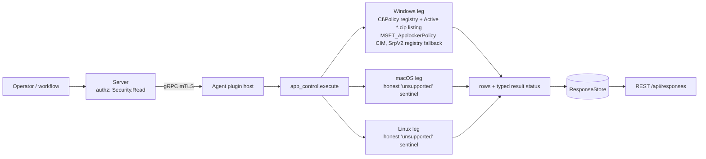

# app_control

<!-- BEGIN GENERATED: plugin-doc-gen header -->
| | |
|---|---|
| **What it does** | Read-only effective WDAC and AppLocker application-control policy posture (Windows-only) |
| **Version** | 1.0.0 |
| **Kind** | Collector · read-only · gathered (windows.app_control.wdac_policy, windows.app_control.applocker_policy) |
| **Platforms** | Windows ✅ · macOS ⛔ unsupported · Linux ⛔ unsupported |
| **Actions** | `applocker_policy` (definition `windows.app_control.applocker_policy`) · `wdac_policy` (definition `windows.app_control.wdac_policy`) |
| **Security** | securable `Security` · operation Read · risk Low · dispatch ReadOnly · approval gate None |
| **Roles** | execute: endpoint-admin, endpoint-operator, security-admin · author: content-author |
<!-- END GENERATED -->

## How it works

`wdac_policy` enumerates every value under `HKLM\SYSTEM\CurrentControlSet\Control\CI\Policy` (`RegEnumValueW`, bounded: 256 values, 4 KiB each), maps `VerifiedAndReputablePolicyState` to a named state (`disabled` / `audit` / `enforced`; any other value is `unmodelled`), then lists the `*.cip` files in `%SystemRoot%\System32\CodeIntegrity\CiPolicies\Active` (presence and file stem only, never contents). `applocker_policy` runs one bounded CIM query (`agents/shared/wmi_bounded.hpp`) against `MSFT_ApplockerPolicy` in `root\StandardCimv2\Security\ApplicationControl`; when the class is absent, returns no usable rows or fails it walks `HKLM\SOFTWARE\Policies\Microsoft\Windows\SrpV2` (one row per collection: `EnforcementMode` and rule-subkey count; a collection with no subkey reads `absent`).

**Why it exists.** `docs/capability-map.md` §9.10 (Application Whitelisting, graded partial by this plugin) and `docs/roadmap.md` Issue 12.11 (#282, Open) are the tracked demand; `docs/enterprise-parity-plan.md` Phase 12.11 names the full action set (`get_policy`, `add_rule`, `remove_rule`, `get_blocked_events`). This plugin delivers only the read-only posture; the rest is listed under Caveats.

**What it is NOT.** No policy change of any kind, no PowerShell (`Get-AppLockerPolicy` is not used), no raw COM, no subprocess. It is not EDR-class telemetry: `docs/roadmap.md` Phase 18 excludes agent-side EDR replication ("integrate via Phase 9 connectors to existing EDR ... do not re-implement at the agent"), and this plugin reads the state of an OS-native control rather than collecting endpoint detection data.



## OS capability

<!-- BEGIN GENERATED: plugin-doc-gen capability -->
| Action | Windows | macOS | Linux |
|---|---|---|---|
| `applocker_policy` | 🟡 constrained · rung 1 · wmi_bounded run_bounded_wmi_query root\\StandardCimv2\\Security\\ApplicationControl MSFT_ApplockerPolicy; registry walk of HKLM\\SOFTWARE\\Policies\\Microsoft\\Windows\\SrpV2\\<collection> when the class is absent, empty or failing | ⛔ unsupported | ⛔ unsupported |
| `wdac_policy` | ✅ supported · rung 1 · RegEnumValueW HKLM\\SYSTEM\\CurrentControlSet\\Control\\CI\\Policy + std::filesystem listing of %SystemRoot%\\System32\\CodeIntegrity\\CiPolicies\\Active\\*.cip | ⛔ unsupported | ⛔ unsupported |

**Declared limits per leg** (descriptor fallback text, verbatim):

- **`applocker_policy` / Windows** — Rig-verified 2026-09-21 (Windows 11 Pro 10.0.26200, LocalSystem): the CIM namespace root\\StandardCimv2\\Security\\ApplicationControl does NOT exist on this host (WBEM_E_INVALID_NAMESPACE 0x8004100e), so the SrpV2 registry walk runs and, with no AppLocker policy configured, reports 'none'. The CIM property names (Collection/EnforcementMode/RuleCount) and the SrpV2 rule-collection layout are UNVERIFIED on a host with AppLocker configured. The CIM namespace is caller-side allowlisted
- **`applocker_policy` / macOS** — Windows-only concept; macOS app-trust (Gatekeeper/SIP) is outside this plugin's scope
- **`applocker_policy` / Linux** — Windows-only concept; Linux fapolicyd is a separate, unimplemented leg of #282
- **`wdac_policy` / Windows** — Rig-verified 2026-09-21 (Windows 11 Pro 10.0.26200, LocalSystem): CI\\Policy holds EmodePolicyRequired, SkuPolicyRequired, VerifiedAndReputablePolicyState (0 reads 'disabled') and SAC_PreviousState (0xffffffff reads 'unmodelled'), and 8 default .cip policies are listed; only VerifiedAndReputablePolicyState=0 was observed, other values are mapped per documentation and unverified on hardware. An unmodelled value is reported 'unmodelled'; an unreadable key is constrained or permission_denied, never absent
- **`wdac_policy` / macOS** — Windows-only concept; macOS app-trust (Gatekeeper/SIP) is outside this plugin's scope
- **`wdac_policy` / Linux** — Windows-only concept; Linux fapolicyd is a separate, unimplemented leg of #282
<!-- END GENERATED -->

## Privileges and prerequisites

| OS | Runs as | Extra grant needed | Measured | If the read is refused |
|---|---|---|---|---|
| Windows | agent service account (LocalSystem today, #1442) | None expected: registry reads (`KEY_READ`), a directory listing and a WMI SELECT; no privilege is enabled | Measured under LocalSystem on 2026-09-21 on a host with no AppLocker policy configured; least-privilege service-account behaviour is still unverified (see the source banner in `app_control_win.cpp`) | a `constrained\|<reason>` row plus result status `PERMISSION_DENIED` (registry `ERROR_ACCESS_DENIED`, CIM `WBEM_E_ACCESS_DENIED`) or `CONSTRAINED` (any other failure) |
| macOS | agent daemon, unprivileged | n/a — action returns the honest-unsupported sentinel unconditionally | not applicable (Windows-only concept) | n/a — no OS call is attempted |
| Linux | agent daemon, unprivileged | n/a — action returns the honest-unsupported sentinel unconditionally | not applicable (Windows-only concept) | n/a — no OS call is attempted |

No subprocesses and no network access. The CIM namespace is caller-side allowlisted to `root\StandardCimv2\Security\ApplicationControl` (`wmi_bounded.hpp` does no allowlisting of its own).

## Data contract

### Inputs

<!-- BEGIN GENERATED: plugin-doc-gen inputs -->
Neither action takes parameters.
<!-- END GENERATED -->

### Outputs

Pipe-delimited rows via `write_output()`, the first field naming the row kind (`row_kind`, the first declared column). `wdac_policy` writes `wdac|<name>|<raw>|<state>` per registry value and `wdac_cip|<policy_stem>|present` per active policy file (three fields: `state` stays empty); `applocker_policy` writes `applocker|<collection>|<mode>|<rules>` per rule collection. Placeholders: `wdac|policy_key|-|absent` (the CI\Policy key does not exist), `wdac_cip|none|absent` (no active `.cip` files), `applocker|none|absent|0` (the SrpV2 key does not exist: no AppLocker policy configured) — each a genuine "nothing configured" reported by the OS; when the SrpV2 key exists every collection gets a row, and one that is not configured reads `applocker|<collection>|absent|0`. Any failed step instead writes `constrained|<reason>` beside a non-OK result status (the reason lands in the second column); a failure is never rendered as an absent policy. Non-Windows legs write the single row `<action>|unsupported|windows_only_concept`.

<!-- BEGIN GENERATED: plugin-doc-gen outputs -->
**`windows.app_control.applocker_policy` — `row_kind|collection|mode|rules`**

| Field | Type | Values | Available | Example | Description |
|---|---|---|---|---|---|
| `row_kind` | string | `applocker` `constrained` | Windows | `applocker` | Row family: `applocker` (one per rule collection, or the single `none` placeholder) or `constrained` (a failed step: the reason lands in `collection`, the rest are empty). |
| `collection` | string | `Appx` `Dll` `Exe` `Msi` `Script` `none` | Windows | `Exe` | AppLocker rule collection; `none` when no AppLocker policy is configured (on a constrained row, the failure reason). |
| `mode` | string | `audit` `enforced` `unmodelled` `absent` | Windows | `enforced` | Enforcement mode of the collection; `absent` when the collection is not configured (no rule-collection subkey) or has no EnforcementMode value. |
| `rules` | int32 | - | Windows | `12` | Number of rules in the collection (rule subkeys under the SrpV2 walk); 0 when none is configured. |

**`windows.app_control.wdac_policy` — `row_kind|name|raw|state`**

| Field | Type | Values | Available | Example | Description |
|---|---|---|---|---|---|
| `row_kind` | string | `wdac` `wdac_cip` `constrained` | Windows | `wdac` | Row family: `wdac` (a Control\CI\Policy value), `wdac_cip` (an active .cip policy file: the stem lands in `name`, `present` or `absent` in `raw`, and `state` is empty) or `constrained` (a failed step: the reason lands in `name`, the rest are empty). |
| `name` | string | - | Windows | `VerifiedAndReputablePolicyState` | Registry value name under Control\CI\Policy (or the policy file stem on a wdac_cip row, the failure reason on a constrained row). |
| `raw` | string | - | Windows | `1` | Raw value: a decimal for a DWORD, the text for a string value, opaque_<n>B for any other type; a dash on the key-absent row; `present` or `absent` on a wdac_cip row. |
| `state` | string | `disabled` `audit` `enforced` `unmodelled` `absent` | Windows | `enforced` | Named state of the value; empty on a wdac_cip or constrained row. |
<!-- END GENERATED -->

### Result status

| Status | Completeness | Provenance | When |
|---|---|---|---|
| `OK` | FULL | `registry_ci_policy` | `wdac_policy`: every read succeeded |
| `OK` | FULL | `cim_msft_applockerpolicy`, `registry_srpv2` | `applocker_policy`: every read succeeded; the token names the source that produced the rows (the CIM class, or the `SrpV2` registry walk when the class was absent or empty) |
| `UNAVAILABLE` | PARTIAL | `windows_only_concept` | Linux/macOS: application control is a Windows-only concept here |
| `CONSTRAINED` | PARTIAL | `row_cap`, `value_too_large`, `cim_row_unrecognised`, `ci_policy_open_<hex>`, `ci_policy_enum_<hex>`, `srpv2_open_<hex>`, `srpv2_collection_open_<hex>`, `enforcement_mode_read_<hex>`, `srpv2_rule_count_<hex>`, `cip_stat_failed_<n>`, `cip_dir_failed_<n>`, `system_directory_unresolved`, a `wmi_bounded` error token | a bounded read hit its cap, a value or CIM row could not be interpreted, or a registry / directory / CIM step failed with a non-access-denied error; the reasons are joined in one status string |
| `CONSTRAINED` | PARTIAL | `unhandled exception: <what>` | an exception was caught inside `execute()` |
| `PERMISSION_DENIED` | PARTIAL | `permission_denied` | a registry, directory or CIM read was refused (`ERROR_ACCESS_DENIED` / `WBEM_E_ACCESS_DENIED`) |

### Where the data goes

- **Instruction result only.** Rows travel over the agent's mTLS gRPC channel as the command response and land in the ResponseStore (`response_retention_days`, default 90 days), queryable at `/api/responses/{id}`.
- **Not consumed by** daily-sync inventory, the TAR warehouse, DEX, or metrics. nothing runs on a schedule.
- **Sensitivity.** Rows describe the device's application-control configuration (enforcement mode, rule counts, the file stem of each active policy). No username, hostname or rule content appears in any field; a `REG_SZ`/`REG_EXPAND_SZ` value under `CI\Policy` is reported verbatim (escaped, at most 4 KiB), so a string value could carry a path. The posture itself is security-relevant: it tells a reader which controls are not enforced.
- **Siblings:** `antivirus` (Defender and exclusion state, not application control), `windows_optional_features` (OS feature state), `registry` / `wmi` (general-purpose reads this plugin's narrow surface deliberately does not replace) — none join with this plugin's output.
- **MCP / REST.** Discover: `discover_plugins` (summary) → `yuzu://plugin-docs` (this page as data) → `discover_instructions` / `get_definition("windows.app_control.wdac_policy")`. Run: `execute_instruction {definition_id, parameters}`. Read: `/api/responses/{id}`.

## Sample output

<!-- BEGIN GENERATED: plugin-doc-gen samples -->
**Windows** — captured: windows Windows 10.0.26200 x86_64 · bare-metal · 2026-09-21 · LocalSystem (elevated) · leg-hash ea8979e16417

```
== action=wdac_policy
wdac|EmodePolicyRequired|0|unmodelled
wdac|SkuPolicyRequired|0|unmodelled
wdac|VerifiedAndReputablePolicyState|0|disabled
wdac|SAC_PreviousState|4294967295|unmodelled
wdac_cip|{0283AC0F-FFF1-49AE-ADA1-8A933130CAD6}|present
wdac_cip|{0939ED82-BFD5-4D32-B58E-D31D3C49715A}|present
wdac_cip|{1283AC0F-FFF1-49AE-ADA1-8A933130CAD6}|present
wdac_cip|{1678656C-05EF-481F-BC5B-EBD8C991502D}|present
wdac_cip|{1939ED82-BFD5-4D32-B58E-D31D3C49715A}|present
wdac_cip|{2678656C-05EF-481F-BC5B-EBD8C991502D}|present
wdac_cip|{60FD87F8-4593-44A0-91B0-2E0DA022F248}|present
wdac_cip|{784C4414-79F4-4C32-A6A5-F0FB42A51D0D}|present
[result_status] OK / FULL / registry_ci_policy

== action=applocker_policy
applocker|none|absent|0
[result_status] OK / FULL / registry_srpv2
```

**macOS** — captured: macos macOS 26.6.2 arm64 · bare-metal · 2026-09-21 · euid 501 · leg-hash ea8979e16417

```
== action=wdac_policy
wdac_policy|unsupported|windows_only_concept
[result_status] UNAVAILABLE / PARTIAL / windows_only_concept
[rc] 1

== action=applocker_policy
applocker_policy|unsupported|windows_only_concept
[result_status] UNAVAILABLE / PARTIAL / windows_only_concept
[rc] 1
```

**Linux** — captured: linux Debian GNU/Linux 13 (trixie) aarch64 · container · 2026-09-21 · euid 0 · leg-hash ea8979e16417

```
== action=wdac_policy
wdac_policy|unsupported|windows_only_concept
[result_status] UNAVAILABLE / PARTIAL / windows_only_concept
[rc] 1

== action=applocker_policy
applocker_policy|unsupported|windows_only_concept
[result_status] UNAVAILABLE / PARTIAL / windows_only_concept
[rc] 1
```
<!-- END GENERATED -->

## Caveats and known gaps

1. **Read-only posture only; #282 stays open.** The plugin refs #282 and does not close it: the issue also asks for `add_rule`, `remove_rule` and `get_blocked_events` (`docs/enterprise-parity-plan.md` Phase 12.11) and a Linux fapolicyd leg, none of which exist. Rule changes would be Destructive-class actions in a separate change.
2. **Not EDR-class telemetry.** `docs/roadmap.md` Phase 18 "Out of scope" excludes re-implementing EDR at the agent; this plugin configures nothing and collects no detection data, it reports the state of the OS's own control. The two are not the same thing and a reviewer should not conflate them.
3. **The CIM property names remain unverified on hardware.** The AppLocker provider namespace `root\StandardCimv2\Security\ApplicationControl` does not exist on the-rig (Windows 11 Pro 10.0.26200, no AppLocker policy configured): the plugin's own bounded WMI helper returned `wmi_connect_failed_0x8004100e` (WBEM_E_INVALID_NAMESPACE), so `applocker_policy` fell back to the `SrpV2` registry walk, which is also absent (`applocker|none|absent|0`, OK / FULL). `Collection`, `EnforcementMode` and `RuleCount` are still assumed by `parse_cim_applocker_row` (a row lacking any of them is reported `cim_row_unrecognised` rather than guessed) and the `SrpV2` rule-collection layout has never been read on an AppLocker-configured host, so both are untested against real data until such a host is probed. The class-absent outcome is a real capture (`tests/unit/fixtures/wave8/app_control/windows/applocker_wmi_probe.txt`); the probe text is in the banner of `agents/plugins/app_control/src/app_control_win.cpp`.
4. **Unmodelled values are reported, not coerced.** Only `VerifiedAndReputablePolicyState` (0 off, 1 on, 2 evaluation) and AppLocker `EnforcementMode` (0 audit, 1 enforce) are mapped; every other value reads `unmodelled`. Multiple-policy-format `.cip` files are listed by name only — their contents are never parsed. The legacy single-policy file `SiPolicy.p7b` is not listed, so `wdac_cip|none|absent` means "no multiple-policy-format files", not "no WDAC policy": a host that enforces only a single-format policy reads that row.
5. **Linux and macOS are placeholders by design.** Application control is a Windows-only concept here; macOS app-trust (Gatekeeper/SIP) is outside this plugin's scope, and both legs return the honest `unsupported` row unconditionally.

## Source and tests

<!-- BEGIN GENERATED: plugin-doc-gen source -->
- Plugin: `agents/plugins/app_control/src/app_control_parsers.hpp` · `agents/plugins/app_control/src/app_control_plugin.cpp` · `agents/plugins/app_control/src/app_control_win.cpp`
- Definitions: `content/definitions/app_control.yaml`
- Capability rows: `server/core/src/capability_decls/plugin_action_catalogue_app_control.hpp`
- Tests: `tests/unit/test_app_control_local_dispatcher.cpp` · `tests/unit/test_app_control_parsers.cpp`
- Privilege row: `docs/agent-privilege-model.md`
<!-- END GENERATED -->
