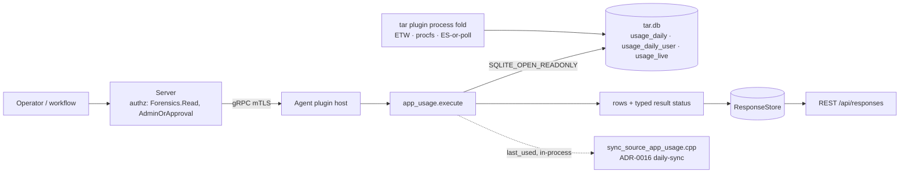

# app_usage

<!-- BEGIN GENERATED: plugin-doc-gen header -->
<!-- END GENERATED -->

## How it works

`summary` aggregates `usage_daily` over a trailing window (`days`, default 30, clamped 1-365; `top`, default 25, clamped 1-500; sorted `by` `run_time` or `run_count`), merges in a `usage_daily_user` `COUNT(DISTINCT user)` per executable, and is preceded by one `meta` row carrying the fold's own health counters (coverage window, open runs, unmatched stops, clock anomalies, capture gaps, feeder state). `last_used` reports per-`exe_key` first/last-seen within TAR's retained window plus a trailing-30-day `run_count`/`total_seconds`, optionally narrowed to one executable via `exe` (normalised with the identical rule TAR writes `exe_key` under). `foreground` always reports `CONSTRAINED`/`foreground_not_captured` with rc 0 — a permanent, by-design degraded outcome rather than a hard failure, since no per-session focus-time source exists on any platform yet. Every action first classifies `tar_config.usage_enabled`'s tri-state (Enabled/Disabled/Errored, mirroring TAR's own #560 `canonical_source_enabled` fix) and checks the `usage_daily` table exists, reporting a typed constrained reason rather than an empty result when the source is off, mis-set, or the schema predates this fold.

Deliberately not: never opens `tar.db` for write (`SQLITE_OPEN_READONLY | SQLITE_OPEN_NOMUTEX`, `PRAGMA query_only=1`); never selects a pid, command line, or user name — `usage_daily_user` contributes a distinct-user count only and `usage_live` contributes an open-run count only; never accepts an operator-supplied db path (would be an arbitrary-file read).

## OS capability

<!-- BEGIN GENERATED: plugin-doc-gen capability -->
<!-- END GENERATED -->

## Privileges and prerequisites

| OS | Runs as | Extra grant needed | Measured | If the read is refused |
|---|---|---|---|---|
| Windows | agent service account (LocalSystem today, `#1442`) | None — opening `tar.db` read-only needs only whatever access LocalSystem already has (the file is created and owned by the agent via the `tar` plugin) | captured 2026-09-15 as interactive user (elevated) (`docs/samples/windows.txt`) — the capture ran under the operator's own elevated session, not the agent's LocalSystem posture | result status `UNAVAILABLE`/`PARTIAL`, row `constrained\|tar_db_unavailable\|<path>\|<sqlite error>` |
| macOS | agent daemon, root — the shipped LaunchDaemon has no `UserName` key (`docs/agent-privilege-model.md` "macOS is the current exception", required today for TAR's Endpoint Security client) | None beyond that — the read-only open needs no additional entitlement of its own | captured 2026-09-15 at euid 501 (`docs/samples/macos.txt`) — a lower-privilege posture than the agent's actual root LaunchDaemon; no live `tar.db` at the default path on the capture host | result status `UNAVAILABLE`/`PARTIAL`, row `constrained\|tar_db_unavailable\|<path>\|<sqlite error>`; a schema-missing or disabled host instead reports `CONSTRAINED`/`PARTIAL`, row `constrained\|usage_schema_missing` / `constrained\|usage_source_disabled` |
| Linux | agent daemon, dedicated unprivileged `yuzu` account by design (`docs/agent-privilege-model.md` TL;DR) | None — same read-only open | captured 2026-09-15 (`docs/samples/linux.txt`) | same shape as Windows/macOS |

No external binaries, no subprocesses, no network access — every branch is a `sqlite3_*` call against an already-open handle; no `popen`/`CreateProcess`/socket call appears anywhere in `app_usage_plugin.cpp` or `app_usage_parsers.hpp`.

## Data contract

### Inputs

<!-- BEGIN GENERATED: plugin-doc-gen inputs -->
<!-- END GENERATED -->

### Outputs

Pipe-delimited rows via `write_output()`. `summary` emits exactly one `meta` row (fold health counters) followed by zero or more `usage` rows, most-active-first. `last_used` emits zero or more `last_used` rows, one per executable, ordered by `exe_key`. Every action's failure path instead emits a single row in the shared `<class>|<reason>[|<detail>]` shape (`constrained|...`, `unavailable|...`, `error|...`) — described row-by-row in Result status below — never mixed with a `meta`/`usage`/`last_used` row in the same call.

<!-- BEGIN GENERATED: plugin-doc-gen outputs -->
<!-- END GENERATED -->

### Result status

| Status | Completeness | Provenance | When |
|---|---|---|---|
| `OK` | full | — | `summary`/`last_used`: the query succeeded (rows may legitimately be empty on a quiet host). |
| `CONSTRAINED` | partial | `usage_source_disabled` | `tar_config.usage_enabled` reads `"false"` — the host has turned the fold off. |
| `CONSTRAINED` | partial | `usage_source_errored` | `tar_config.usage_enabled` holds a value that is neither `"true"` nor `"false"` (TAR itself is in an inconsistent tri-state, mirrors #560's `canonical_source_enabled`), or the `tar_config` read itself failed to prepare/step — a read failure maps here, fail-closed, and is never treated as an absent key (which falls through to `Enabled`, TAR's own default). |
| `CONSTRAINED` | partial | `usage_schema_missing` | The `usage_daily` table does not exist — the host's TAR schema predates this fold. |
| `UNAVAILABLE` | partial | `tar_db_unavailable` | `tar.db` failed to open read-only (missing file, lock contention, corruption) — every capture in this package hits this branch, since none of the capture hosts had a live `tar.db` with usage collection enabled at the default path. |
| `UNAVAILABLE` | partial | `bad_param` | `summary`'s `by` parameter is neither `run_time` nor `run_count`. |
| `UNAVAILABLE` | partial | `query_failed` | A prepared statement failed against an otherwise open, enabled, schema-correct db — `read_meta`'s accumulated `open_runs_query_failed`/`days_present_query_failed` reasons (`yuzu::shared::ConstraintAccumulator`), or a raw sqlite error surfaced from `run_summary`/`run_last_used`. |
| `CONSTRAINED` | partial | `foreground_not_captured` | `foreground`: always, rc 0 — a permanent degraded outcome, never a hard failure; this source has no per-session focus-time capture on any platform (see Caveats). |

### Where the data goes

- **Instruction result.** Every action's rows travel over the agent's mTLS gRPC channel as the command response and land in the ResponseStore, queryable at `/api/responses/{id}`.
- **Also consumed by daily-sync.** `last_used` is additionally invoked in-process (`LocalDispatcher`, no extra network hop) once per sync cycle by `sync_source_app_usage.cpp` (ADR-0016) — the companion server-side PR persists the projection in `AppUsageStore`. A `constrained` capture is parsed and skipped (`collect()` returns `std::nullopt`) rather than sent as an empty replace, so a disabled/errored/schema-missing host never overwrites a previously-good server view with "zero usage". `summary` and `foreground` are not sync sources — instruction-result only.
- **Not consumed by** TAR itself, DEX, or metrics — `app_usage` only reads `tar.db`; it emits no Prometheus series of its own.
- **Sensitivity.** Executable names and run times are a working-hours/presence proxy even with no user column at all — a host whose interactive tools (shell, editor, browser) cluster their `usage_daily` rows in a narrow daily window says something about when its operator is active, regardless of who that operator is. `distinct_users` is a `COUNT(DISTINCT user)` only; no user name, pid, or command line ever leaves the agent's SQLite database — enforced by a grep-based test over the plugin's own sources (`test_app_usage_parsers.cpp`) for the raw process-event table name and `cmdline`.
- **Siblings:** the `tar` plugin's own `usage`-source `query`/`export` actions read the identical tables through TAR's general-purpose action surface; `app_usage` is a narrower, purpose-built read with its own Forensics-gated approval posture and daily-sync integration.

## Sample output

<!-- BEGIN GENERATED: plugin-doc-gen samples -->
<!-- END GENERATED -->

## Caveats and known gaps

1. **Default-ON, diverging from most plugins.** `usage` ships `tar_config.usage_enabled = true` by default (`tar_schema_registry.cpp`'s `usage` source entry), per Alex's 2026-09-04 operator ruling (`docs/tar-implementer.md` "Amended (Wave 6, operator ruling 2026-09-04)") that extended the `power`/`removable` default-on precedent to further TAR sources as the roadmap brings each one in for change — this plugin is a read-only view over that already-default-on fold, not a separate opt-in decision of its own.
2. **`foreground` is always constrained, pending a user-context bridge.** Per-session focus-time and per-session attribution are not captured by any of the three platform legs today; the action exists in the descriptor and definition set so the roadmap can fill it in without a schema change once session-scope attribution lands, but every call to it reports `CONSTRAINED`/`foreground_not_captured` (rc 0) unconditionally.
3. **macOS granularity inherits the underlying TAR process source's ES-or-poll behaviour.** `usage_daily` is derived from TAR's `process` fold, not captured independently — when the Endpoint Security entitlement is present TAR observes real start/stop events; when it is absent TAR falls back to polling, which can miss short-lived processes and coarsens `first_seen`/`last_seen`/`run_count` accordingly. This plugin has no way to distinguish which regime produced a given row.
4. **Coverage is forward-only from source activation.** `usage_daily`/`usage_daily_user` only contain rows from the point the `usage` fold started running on a given host — a freshly enrolled agent, or one where `usage_enabled` was flipped on after a period off, has no history for the gap, and `summary`/`last_used` report exactly what is present, never a synthesized "since install" baseline.
5. **`first_seen`/`last_seen` are bounded by TAR's retention window, never all-time.** TAR prunes `usage_daily` on its own retention cadence (31-day default) — both timestamp fields are MIN/MAX over whatever rows are currently retained, not over every run this executable has ever had. Once a day's rows age out, this plugin has no way to see past them; do not read either field as a lifetime first/last-seen.

## Source and tests

<!-- BEGIN GENERATED: plugin-doc-gen source -->
<!-- END GENERATED -->
