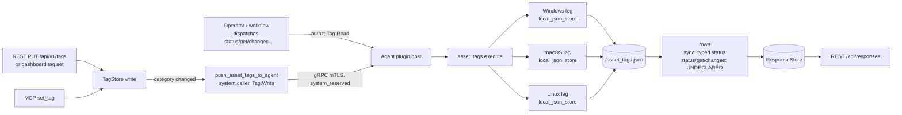

# asset_tags

<!-- BEGIN GENERATED: plugin-doc-gen header -->
| | |
|---|---|
| **What it does** | Structured asset tag awareness — syncs server-assigned tags locally and detects changes |
| **Version** | 0.1.0 |
| **Kind** | Action · mutating · gathered (device.asset_tags.sync, device.asset_tags.status, device.asset_tags.get, device.asset_tags.changes) |
| **Platforms** | Windows ✅ · macOS ✅ · Linux ✅ |
| **Actions** | `changes` (definition `device.asset_tags.changes`) · `get` (definition `device.asset_tags.get`) · `status` (definition `device.asset_tags.status`) · `sync` (definition `device.asset_tags.sync`) |
| **Security** | `sync`: securable `Tag` · operation Write · risk Medium · dispatch Mutating · approval gate None; `status`: securable `Tag` · operation Read · risk Low · dispatch ReadOnly · approval gate None; `get`: securable `Tag` · operation Read · risk Low · dispatch ReadOnly · approval gate None; `changes`: securable `Tag` · operation Read · risk Low · dispatch ReadOnly · approval gate None |
| **Roles** | execute: endpoint-admin, endpoint-operator · author: content-author |
<!-- END GENERATED -->

## How it works

`asset_tags` gives an agent awareness of the four structured tag categories the server treats as authoritative — `role`, `environment`, `location`, `service` (`asset_tags_parsers.hpp:46`). `sync` is the only mutating action: the server calls it, pushing all four category values as parameters; the plugin diffs them against its cached copy, appends any differences to a change log (bounded at the newest 50 entries in memory and on disk, evicting the oldest on every append), and — inside one critical section with the diff — writes the new state to `<data_dir>/asset_tags.json` via a randomly-named, exclusively-created temp file renamed into place (`asset_tags_plugin.cpp:207-266`, `asset_tags_parsers.hpp:113-137`, `asset_tags_store.hpp:149-244`). Values are capped at 448 bytes on a UTF-8 codepoint boundary (the server's own tag-value limit) and stored raw (`asset_tags_parsers.hpp:88`). `status` reports the cached tags plus sync metadata — last-sync epoch, a staleness flag, the configured check interval, and the change-log length (`asset_tags_plugin.cpp:260-272`). `get` returns a single category's cached value, rejecting any key outside the fixed four (`asset_tags_plugin.cpp:274-289`). `changes` lists the change log, each field escaped (`asset_tags_plugin.cpp:291-303`). A background thread wakes every `check_interval` seconds (default 300, floored at 30) purely to flip `stale` to `true` if no sync has landed in that window — it never re-requests a sync itself (`asset_tags_plugin.cpp:84-107`).

It deliberately is not the general-purpose tag store: arbitrary free-form key/value tags are the sibling `tags` plugin (`content/definitions/tags.yaml`). `asset_tags` only ever holds the four server-authoritative categories, and the agent never initiates a sync — it only reacts to one the server pushes.



## OS capability

<!-- BEGIN GENERATED: plugin-doc-gen capability -->
| Action | Windows | macOS | Linux |
|---|---|---|---|
| `changes` | ✅ supported · rung 1 · local_json_store | ✅ supported · rung 1 · local_json_store | ✅ supported · rung 1 · local_json_store |
| `get` | ✅ supported · rung 1 · local_json_store | ✅ supported · rung 1 · local_json_store | ✅ supported · rung 1 · local_json_store |
| `status` | ✅ supported · rung 1 · local_json_store | ✅ supported · rung 1 · local_json_store | ✅ supported · rung 1 · local_json_store |
| `sync` | ✅ supported · rung 1 · local_json_store | ✅ supported · rung 1 · local_json_store | ✅ supported · rung 1 · local_json_store |
<!-- END GENERATED -->

## Privileges and prerequisites

| OS | Runs as | Extra grant needed | Measured | If the read is refused |
|---|---|---|---|---|
| Windows | agent service account — LocalSystem today, not yet the intended `NT SERVICE\YuzuAgent` (#1442; `docs/agent-privilege-model.md:12`) | None — plain file I/O under `<data_dir>`, no OS API, no elevated right | 2026-09-07 on bare metal as SYSTEM | No refusal path exists; a write failure is logged and reported as `CONSTRAINED` / `persist_failed` on `sync` (see below); an unreadable or corrupt state file is logged and ignored |
| macOS | agent daemon, root — the shipped LaunchDaemon has no `UserName` key (`docs/agent-privilege-model.md:14`) | None | 2026-09-07 on bare metal at euid 501 (jsmith) — unprivileged, not the production root daemon | Same as Windows |
| Linux | dedicated unprivileged account (`_yuzu`/`yuzu`; `docs/agent-privilege-model.md:12`) | None | 2026-09-07 in a container at euid 0 — more privileged than the production account | Same as Windows |

No external binaries, no subprocesses, no network access — every action is an in-process read/write of a local JSON file (`popen`/`CreateProcess`/socket grep over `asset_tags_plugin.cpp` returns nothing). Persistence is checked end to end (`asset_tags_store.hpp:124-244`): `fs::create_directories`, the temp-file write (flushed and closed before anything else touches it) and the rename are each error-checked, the temp is removed on every failure, and the write happens under the same lock as the state change. A persistence failure (unwritable `data_dir`, disk full) is logged and surfaces on `sync` as `CONSTRAINED` / `PARTIAL` with provenance `persist_failed`; the in-memory state for that process stays authoritative and the rows are still truthful. The temp is a randomly-named sibling (`<dest>.tmp.<16 hex>`, unpredictable across processes) created EXCLUSIVELY, never a fixed name: on POSIX via `O_CREAT|O_EXCL|O_NOFOLLOW` at mode `0600` directly (no umask window — the mode is re-asserted once more before the rename purely for determinism under an unusual umask, and a re-assertion failure is logged but does not block persistence); on Windows via `std::ios::noreplace` (C++23 exclusive-create semantics), though the DACL is still inherited, not tightened. Either way, a file already at the temp path — planted or left over — fails the create instead of being followed or silently overwritten. A state file that is unreadable, not valid JSON, has a wrong-typed known field, or names an unrecognised tag category or change-record key is rejected whole — defaults (`stale=true`, no tags) are kept, one warning names the offending field, and the next `sync`'s write replaces the file; an unrecognised *top-level* field is ignored, so a file written by a newer version still loads (`asset_tags_parsers.hpp:190-283`); nothing is partially loaded.

## Data contract

### Inputs

<!-- BEGIN GENERATED: plugin-doc-gen inputs -->
| Definition | Parameter | Type | Required | Default | Constraints | Description |
|---|---|---|---|---|---|---|
| `device.asset_tags.get` | `key` | string | yes | - | enum: role, environment, location, service | One of the 4 structured tag categories (e.g. "role"). |
| `device.asset_tags.sync` | `role` | string | no | - | - | The device's operational role, free-form text (e.g. "db-primary"). |
| `device.asset_tags.sync` | `environment` | string | no | - | enum: Dev, UAT, Production | Deployment stage for this device — one of "Dev", "UAT", "Production". |
| `device.asset_tags.sync` | `location` | string | no | - | - | Physical or logical location of the device, free-form text (e.g. "us-east-dc2"). |
| `device.asset_tags.sync` | `service` | string | no | - | - | IT service this device belongs to, free-form text (e.g. "billing-api"). |
<!-- END GENERATED -->

### Outputs

Every action writes one or more pipe-delimited lines via `ctx.write_output`. There is no single row shape shared across an action's own output: `get` emits exactly one `tag|<key>|<value>` line per call, and `changes` emits one `change|<key>|<old_value>|<new_value>|<timestamp>` line per recorded change (or the sentinel line `changes|none` when the log is empty, with no trailing count on that path). `status` and `sync` each emit several *different* line shapes in one response — see Caveats. There is no shared empty-result placeholder convention: an unset tag reports as an empty string, never `-`. Every string field on every row — values, keys, and the echoed text of the two error rows (`unknown action: …`, `error|unknown category: …`) — is escaped with the shared `safe_output_field` (`|` becomes `\|`, CR/LF become a space, a literal backslash is folded to `/`), so a value such as `Rack A|3` renders as `Rack A\|3` in a stable row shape. The stored value is never rejected or stripped; the backslash fold is a limitation of the shared server decoder and applies on the wire only. Values are capped at 448 bytes on `sync` and again on load from disk.

<!-- BEGIN GENERATED: plugin-doc-gen outputs -->
**`device.asset_tags.changes` — `key|old_value|new_value|timestamp`**

| Field | Type | Values | Available | Example | Description |
|---|---|---|---|---|---|
| `key` | string | `role` `environment` `location` `service` | Windows, Linux, macOS | `-` | The tag category the change record is for. |
| `old_value` | string | - | Windows, Linux, macOS | `-` | The value before the change. Values: free text. |
| `new_value` | string | - | Windows, Linux, macOS | `-` | The value after the change. Values: free text. |
| `timestamp` | int64 | - | Windows, Linux, macOS | `-` | Epoch seconds when the change was recorded. Values: integer (unix epoch seconds). |

**`device.asset_tags.get` — `key|value`**

| Field | Type | Values | Available | Example | Description |
|---|---|---|---|---|---|
| `key` | string | `role` `environment` `location` `service` | Windows, Linux, macOS | `role` | The category key that was requested, echoed back. |
| `value` | string | - | Windows, Linux, macOS | - | The cached value for that category; empty string if never set. Values: free text or empty. |

**`device.asset_tags.status` — `key|value|last_sync|stale|check_interval|change_count`**

| Field | Type | Values | Available | Example | Description |
|---|---|---|---|---|---|
| `key` | string | `role` `environment` `location` `service` | Windows, Linux, macOS | `role` | The tag category named on a "tag\|key\|value" line. |
| `value` | string | - | Windows, Linux, macOS | - | The cached value for that category; empty string if the category has never been synced. Values: free text or empty. |
| `last_sync` | int64 | - | Windows, Linux, macOS | `0` | Epoch seconds of the last successful sync; 0 before any sync has landed. Values: integer (unix epoch seconds). |
| `stale` | bool | - | Windows, Linux, macOS | `true` | True when no sync has landed within check_interval seconds of the last one, or none has ever landed. |
| `check_interval` | int32 | - | Windows, Linux, macOS | `300` | The configured staleness-check interval in seconds, read from asset_tags.check_interval and floored at 30; default 300. Values: integer seconds, >= 30. |
| `change_count` | int32 | - | Windows, Linux, macOS | `0` | Number of entries currently in the change log (in memory and persisted, capped at the last 50). Values: integer 0-50. |

**`device.asset_tags.sync` — `event|key|old_value|new_value`**

| Field | Type | Values | Available | Example | Description |
|---|---|---|---|---|---|
| `event` | string | `no_changes` `tag_added` `tag_removed` `tag_changed` | Windows, Linux, macOS | `-` | What changed in this sync call, relative to the previously cached value. |
| `key` | string | `role` `environment` `location` `service` | Windows, Linux, macOS | `-` | The tag category this change applies to. Absent from the wire line when event is no_changes. |
| `old_value` | string | - | Windows, Linux, macOS | `-` | The category's value before this sync call. Omitted from the wire line (not merely empty) when event is tag_added or no_changes. Values: free text. |
| `new_value` | string | - | Windows, Linux, macOS | `-` | The category's value after this sync call. Omitted from the wire line when event is tag_removed or no_changes. Values: free text. |
<!-- END GENERATED -->

### Result status

`sync` declares a typed result status on every call (`asset_tags_plugin.cpp:252-256`): `OK` / `FULL` when the state file was written, or `CONSTRAINED` / `PARTIAL` with provenance `asset_tags:persist_failed` when the atomic write failed — the in-memory state still advanced and the rows are truthful, so the return code stays `0`. `status`, `get` and `changes` set none, so the agent records `UNDECLARED` for them — as every captured sample below shows. `sync` was never captured (mutator capture policy), so no sample reflects its typed status.

| Status | Completeness | Provenance | When |
|---|---|---|---|
| `OK` | full | (empty) | `sync`: the new state was written to `<data_dir>/asset_tags.json`, or no data dir is configured and there is nothing to write |
| `CONSTRAINED` | partial | `asset_tags:persist_failed` | `sync`: the temp-file write or the rename over `asset_tags.json` failed (data dir not creatable, not a directory, disk error, or on Windows another process holding the file open without `FILE_SHARE_DELETE`); the reason is in the agent log |

**Recovery.** Persistence and load are both self-healing — there is nothing to manually clean up.
A repeated `CONSTRAINED`/`persist_failed` means the underlying OS-level condition (disk full, a
permissions/ownership change on `data_dir`, an antivirus lock) needs fixing; once it is, the next
`sync` writes cleanly with no restart or file deletion required. A corrupt or unreadable state file
is similarly rejected and replaced automatically by the next successful `sync` (see "Where the data
goes" below) — deleting it by hand is never necessary and only loses the in-memory `changes` history
a moment sooner than the next write would anyway.

### Where the data goes

- **Instruction result only** for row data — reaches the ResponseStore via the standard command-response path, queryable at `/api/responses/{id}`, same as any other plugin.
- `sync`'s trigger additionally increments the Prometheus counter `yuzu_server_system_reserved_push_total{capability="asset_tags.sync"}` (`server.cpp:10771-10779`) — a delivery metric, not row data.
- `sync` is invoked by the server, never directly by an operator: a structured tag-category write via the dashboard `tag.set` handler (`server.cpp:15550-15574`), the REST API v1 tags route (`server.cpp:21177-21193`), or MCP `set_tag` (`server.cpp:21777-21785`) all call the same `push_asset_tags_to_agent` closure (`server.cpp:11456-11494`).
- **Not consumed by** daily-sync inventory, the TAR warehouse, or DEX.
- **Sensitivity.** `role`/`environment`/`location`/`service` are free-form organizational tags an operator assigns — they can reveal a device's physical site or business role. The values are not content-validated (only byte-capped, `asset_tags_parsers.hpp:88`): an operator can type anything into them, including a hostname, a serial, or a person's name, so classify by what is actually assigned, not by the category name. The on-disk copy is owner-only (`0600`) on POSIX (see above).
- **Siblings:** `tags` (`content/definitions/tags.yaml`) — the general-purpose, agent-authoritative free-form key/value tag store; `asset_tags` is deliberately narrower, holding only the 4 server-authoritative categories.
- **MCP / REST.** Discover: `discover_plugins` (summary) → `yuzu://plugin-docs` (this page as data) → `discover_instructions` / `get_definition("device.asset_tags.status")`. Run: `execute_instruction {definition_id, parameters}`. Read: `/api/responses/{id}`.

## Sample output

<!-- BEGIN GENERATED: plugin-doc-gen samples -->
**Windows** — captured: windows Microsoft Windows NT 10.0.26200.0 x64 · bare-metal · 2026-09-07 · SYSTEM · leg-hash d276d67e9d65

```
== action=sync
[not captured] Mutating/Reversible: not executed on a live host

== action=status
tag|role|
tag|environment|
tag|location|
tag|service|
last_sync|0
stale|true
check_interval|300
change_count|0
[result_status] UNDECLARED / UNKNOWN

== action=get key=role
tag|role|
[result_status] UNDECLARED / UNKNOWN

== action=changes
changes|none
[result_status] UNDECLARED / UNKNOWN
```

**macOS** — captured: macos macOS 26.6.2 arm64 · bare-metal · 2026-09-07 · euid 501 (jsmith) · leg-hash d276d67e9d65

```
== action=sync
[not captured] Mutating/Reversible: not executed on a live host

== action=status
tag|role|
tag|environment|
tag|location|
tag|service|
last_sync|0
stale|true
check_interval|300
change_count|0
[result_status] UNDECLARED / UNKNOWN

== action=get key=role
tag|role|
[result_status] UNDECLARED / UNKNOWN

== action=changes
changes|none
[result_status] UNDECLARED / UNKNOWN
```

**Linux** — captured: linux Debian GNU/Linux 13 (trixie) aarch64 · container · 2026-09-07 · euid 0 · leg-hash d276d67e9d65

```
== action=sync
[not captured] Mutating/Reversible: not executed on a live host

== action=status
tag|role|
tag|environment|
tag|location|
tag|service|
last_sync|0
stale|true
check_interval|300
change_count|0
[result_status] UNDECLARED / UNKNOWN

== action=get key=role
tag|role|
[result_status] UNDECLARED / UNKNOWN

== action=changes
changes|none
[result_status] UNDECLARED / UNKNOWN
```
<!-- END GENERATED -->

## Caveats and known gaps

1. **Typed result status on `sync` only.** `status`, `get` and `changes` never call `set_result_status`, so every captured sample shows `UNDECLARED / UNKNOWN /` for them.
2. **`sync`'s output is broader than its declared schema, and was never captured.** Beyond the 4-column `event`/`key`/`old_value`/`new_value` shape, every real `sync` call also emits 4 `tag|<key>|<value>` rows and a `last_sync|<epoch>` line that `content/definitions/asset_tags.yaml`'s `result.columns` (`asset_tags.yaml:51-60`) does not describe. All three samples show `[not captured]` for `sync` under the mutator capture policy.
3. **The capture harness never calls `init()`.** Every sample reflects the plugin's cold-boot default state (empty tags, `last_sync=0`, `stale=true`, `check_interval=300`) because `load_state()` and the config read only run from `init()` (`asset_tags_plugin.cpp:152-175`), which the capture driver's `PluginHandle::load` + `LocalDispatcher::run` path does not call. `get key=role`'s captured `tag|role|` is therefore an empty value from a never-loaded store, not evidence the category is unset in practice — the samples do not reflect any real on-disk `asset_tags.json`.
4. **The lock-ordering test is POSIX-only by mechanism, not by leg.** `tests/unit/test_asset_tags_actions.cpp` drives the real plugin through `LocalDispatcher` on every OS (cap, escaping, the bounded log, `init()` recovery, the typed `sync` status), and `tests/unit/test_asset_tags_sync_lock.cpp` proves the state file is written while the state mutex is held by parking the write on a pre-filled FIFO — there is no Windows twin of that parking trick, so the Windows leg relies on the code being identical (there is no per-OS branch in the write path).

## Source and tests

<!-- BEGIN GENERATED: plugin-doc-gen source -->
- Plugin: `agents/plugins/asset_tags/src/asset_tags_parsers.hpp` · `agents/plugins/asset_tags/src/asset_tags_plugin.cpp` · `agents/plugins/asset_tags/src/asset_tags_store.hpp`
- Definitions: `content/definitions/asset_tags.yaml`
- Capability rows: `server/core/src/capability_decls/core_dispatch_capabilities.hpp` · `server/core/src/capability_decls/plugin_action_catalogue_d.hpp`
- Tests: `tests/unit/test_asset_tags_actions.cpp` · `tests/unit/test_asset_tags_parsers.cpp` · `tests/unit/test_asset_tags_store.cpp` · `tests/unit/test_asset_tags_sync_lock.cpp`
- Privilege row: `docs/agent-privilege-model.md` (no row yet)
<!-- END GENERATED -->
