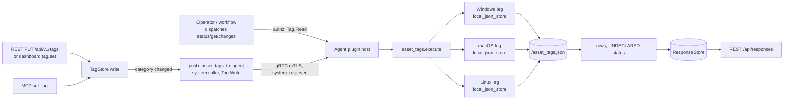

# asset_tags

<!-- BEGIN GENERATED: plugin-doc-gen header -->
| | |
|---|---|
| **What it does** | Structured asset tag awareness — syncs server-assigned tags locally and detects changes |
| **Version** | 0.1.0 |
| **Kind** | Action · mixed (mutating `sync` · read-only `status`/`get`/`changes`) · on-demand (`sync` also server-triggered on tag-category change) |
| **Platforms** | Windows ✅ · macOS ✅ · Linux ✅ |
| **Actions** | `sync` (definition `device.asset_tags.sync`) · `status` (definition `device.asset_tags.status`) · `get` (definition `device.asset_tags.get`) · `changes` (definition `device.asset_tags.changes`) |
| **Security** | securable `Tag` · operation Write (`sync`) / Read (`status`, `get`, `changes`) · risk Medium (`sync`) / Low (others) · dispatch Mutating/Reversible (`sync`) / ReadOnly/None (others) · approval gate none (all four) |
| **Roles** | execute: endpoint-admin, endpoint-operator · author: content-author |
<!-- END GENERATED -->

## How it works

`asset_tags` gives an agent awareness of the four structured tag categories the server treats as authoritative — `role`, `environment`, `location`, `service` (`asset_tags_plugin.cpp:43`). `sync` is the only mutating action: the server calls it, pushing all four category values as parameters; the plugin diffs them against its cached copy, appends any differences to an in-memory change log (persisted, capped at the last 50 entries), and writes the new state to `<data_dir>/asset_tags.json` (`asset_tags_plugin.cpp:260-325`, `112-144`). `status` reports the cached tags plus sync metadata — last-sync epoch, a staleness flag, the configured check interval, and the change-log length (`asset_tags_plugin.cpp:327-342`). `get` returns a single category's cached value, rejecting any key outside the fixed four (`asset_tags_plugin.cpp:344-371`). `changes` lists the change log verbatim (`asset_tags_plugin.cpp:373-387`). A background thread wakes every `check_interval` seconds (default 300, floored at 30) purely to flip `stale` to `true` if no sync has landed in that window — it never re-requests a sync itself (`asset_tags_plugin.cpp:146-169`).

It deliberately is not the general-purpose tag store: arbitrary free-form key/value tags are the sibling `tags` plugin (`content/definitions/tags.yaml`). `asset_tags` only ever holds the four server-authoritative categories, and the agent never initiates a sync — it only reacts to one the server pushes.



## OS capability

<!-- BEGIN GENERATED: plugin-doc-gen capability -->
| Action | Windows | macOS | Linux |
|---|---|---|---|
| `sync` | ✅ supported · rung 1 · `local_json_store` | ✅ supported · rung 1 · `local_json_store` | ✅ supported · rung 1 · `local_json_store` |
| `status` | ✅ supported · rung 1 · `local_json_store` | ✅ supported · rung 1 · `local_json_store` | ✅ supported · rung 1 · `local_json_store` |
| `get` | ✅ supported · rung 1 · `local_json_store` | ✅ supported · rung 1 · `local_json_store` | ✅ supported · rung 1 · `local_json_store` |
| `changes` | ✅ supported · rung 1 · `local_json_store` | ✅ supported · rung 1 · `local_json_store` | ✅ supported · rung 1 · `local_json_store` |

**Declared limits per leg** (the descriptor's fallback text, verbatim): none — every (action, OS) fallback field is `-` (`asset_tags_plugin.cpp:176-189`).
<!-- END GENERATED -->

## Privileges and prerequisites

| OS | Runs as | Extra grant needed | Measured | If the read is refused |
|---|---|---|---|---|
| Windows | agent service account — LocalSystem today, not yet the intended `NT SERVICE\YuzuAgent` (#1442; `docs/agent-privilege-model.md:12`) | None — plain file I/O under `<data_dir>`, no OS API, no elevated right | 2026-09-07 on bare metal as SYSTEM | No refusal path exists; a write failure is silently swallowed (see below) |
| macOS | agent daemon, root — the shipped LaunchDaemon has no `UserName` key (`docs/agent-privilege-model.md:14`) | None | 2026-09-07 on bare metal at euid 501 (alex) — unprivileged, not the production root daemon | Same as Windows |
| Linux | dedicated unprivileged account (`_yuzu`/`yuzu`; `docs/agent-privilege-model.md:12`) | None | 2026-09-07 in a container at euid 0 — more privileged than the production account | Same as Windows |

No external binaries, no subprocesses, no network access — every action is an in-process read/write of a local JSON file (`popen`/`CreateProcess`/socket grep over `asset_tags_plugin.cpp` returns nothing). `save_state()`'s `fs::create_directories` and `std::ofstream` open both leave their error state unchecked (`asset_tags_plugin.cpp:112-143`), so a persistence failure (unwritable `data_dir`, disk full) never surfaces to the caller — only the correct in-memory state for that process is reported.

## Data contract

### Inputs

<!-- BEGIN GENERATED: plugin-doc-gen inputs -->
| Action | Parameter | Type | Required | Default | Description |
|---|---|---|---|---|---|
| `sync` | `role` | string | no | (none) | The device's operational role, free-form text (e.g. `db-primary`). |
| `sync` | `environment` | string | no | (none) | Deployment stage for this device — one of `Dev`, `UAT`, `Production`. |
| `sync` | `location` | string | no | (none) | Physical or logical location of the device, free-form text (e.g. `us-east-dc2`). |
| `sync` | `service` | string | no | (none) | IT service this device belongs to, free-form text (e.g. `billing-api`). |
| `get` | `key` | string | yes | — | One of the 4 structured tag categories (e.g. `role`). |

`status` takes no parameters. `changes` takes no parameters.
<!-- END GENERATED -->

### Outputs

Every action writes one or more pipe-delimited lines via `ctx.write_output`. There is no single row shape shared across an action's own output: `get` emits exactly one `tag|<key>|<value>` line per call, and `changes` emits one `change|<key>|<old_value>|<new_value>|<timestamp>` line per recorded change (or the sentinel line `changes|none` when the log is empty, with no trailing count on that path). `status` and `sync` each emit several *different* line shapes in one response — see Caveats. There is no shared empty-result placeholder convention: an unset tag reports as an empty string, never `-`.

<!-- BEGIN GENERATED: plugin-doc-gen outputs -->
**`sync` — `sync|event|key|old_value|new_value`** (variable arity — `old_value`/`new_value` are omitted, not emptied, depending on `event`; see Caveats)

| Field | Type | Values | Available | Example |
|---|---|---|---|---|
| `event` | string | `no_changes` `tag_added` `tag_removed` `tag_changed` | W, M, L (declared; never captured) | `-` |
| `key` | string | `role` `environment` `location` `service`; absent when `event=no_changes` | W, M, L | `-` |
| `old_value` | string | free text; absent for `tag_added`/`no_changes` | W, M, L | `-` |
| `new_value` | string | free text; absent for `tag_removed`/`no_changes` | W, M, L | `-` |

`sync` additionally emits, on every call regardless of change, 4 `tag|<key>|<value>` lines (current state per category) and a trailing `last_sync|<epoch>` line — neither shape is declared in `content/definitions/asset_tags.yaml`'s `result.columns` for this definition (`asset_tags.yaml:51-60` vs `asset_tags_plugin.cpp:316-323`).

**`status` — `tag|key|value` (one line per category) then `last_sync|value`, `stale|value`, `check_interval|value`, `change_count|value` (one line each)**

| Field | Type | Values | Available | Example |
|---|---|---|---|---|
| `key` | string | `role` `environment` `location` `service` | W, M, L | `role` |
| `value` | string | free text or empty | W, M, L | *(empty — every sample shows unset tags)* |
| `last_sync` | int64 | unix epoch seconds, `0` before any sync | W, M, L | `0` |
| `stale` | bool | `true` `false` | W, M, L | `true` |
| `check_interval` | int32 | seconds, floor 30, default 300 | W, M, L | `300` |
| `change_count` | int32 | integer ≥ 0 | W, M, L | `0` |

**`get` — `tag|key|value`**

| Field | Type | Values | Available | Example |
|---|---|---|---|---|
| `key` | string | `role` `environment` `location` `service` | W, M, L | `role` |
| `value` | string | free text or empty | W, M, L | *(empty — captured on a cold store; see Caveats)* |

**`changes` — `change|key|old_value|new_value|timestamp`** (or the sentinel line `changes|none` when the log is empty)

| Field | Type | Values | Available | Example |
|---|---|---|---|---|
| `key` | string | `role` `environment` `location` `service` | W, M, L | `-` (every sample's log is empty) |
| `old_value` | string | free text | W, M, L | `-` |
| `new_value` | string | free text | W, M, L | `-` |
| `timestamp` | int64 | unix epoch seconds | W, M, L | `-` |
<!-- END GENERATED -->

### Result status

This plugin does not set a typed result status; the agent records `UNDECLARED` and every sample shows `UNDECLARED / UNKNOWN /` (no `set_result_status`/`yuzu_ctx_set_result_status` call anywhere in `asset_tags_plugin.cpp`).

### Where the data goes

- **Instruction result only** for row data — reaches the ResponseStore via the standard command-response path, queryable at `/api/responses/{id}`, same as any other plugin.
- `sync`'s trigger additionally increments the Prometheus counter `yuzu_server_system_reserved_push_total{capability="asset_tags.sync"}` (`server.cpp:10771-10779`) — a delivery metric, not row data.
- `sync` is invoked by the server, never directly by an operator: a structured tag-category write via the dashboard `tag.set` handler (`server.cpp:15550-15574`), the REST API v1 tags route (`server.cpp:21177-21193`), or MCP `set_tag` (`server.cpp:21777-21785`) all call the same `push_asset_tags_to_agent` closure (`server.cpp:11456-11494`).
- **Not consumed by** daily-sync inventory, the TAR warehouse, or DEX.
- **Siblings:** `tags` (`content/definitions/tags.yaml`) — the general-purpose, agent-authoritative free-form key/value tag store; `asset_tags` is deliberately narrower, holding only the 4 server-authoritative categories.
- **MCP / REST.** Discover: `discover_plugins` (summary) → `yuzu://plugin-docs` (this page as data) → `discover_instructions` / `get_definition("device.asset_tags.status")`. Run: `execute_instruction {definition_id, parameters}`. Read: `/api/responses/{id}`.

## Sample output

<!-- BEGIN GENERATED: plugin-doc-gen samples -->
**Windows** — captured: windows Microsoft Windows NT 10.0.26200.0 x64 · bare-metal · 2026-09-07 · SYSTEM · leg-hash pending

```
== action=sync
[not captured] Mutating/Reversible: not executed on a live host

== action=status
tag|role|
tag|environment|
tag|location|
tag|service|
last_sync|0
stale|true
check_interval|300
change_count|0
[result_status] UNDECLARED / UNKNOWN / 

== action=get key=role
tag|role|
[result_status] UNDECLARED / UNKNOWN / 

== action=changes
changes|none
[result_status] UNDECLARED / UNKNOWN / 
```

**macOS** — captured: macos macOS 26.6.2 arm64 · bare-metal · 2026-09-07 · euid 501 (alex) · leg-hash pending

```
== action=sync
[not captured] Mutating/Reversible: not executed on a live host

== action=status
tag|role|
tag|environment|
tag|location|
tag|service|
last_sync|0
stale|true
check_interval|300
change_count|0
[result_status] UNDECLARED / UNKNOWN / 

== action=get key=role
tag|role|
[result_status] UNDECLARED / UNKNOWN / 

== action=changes
changes|none
[result_status] UNDECLARED / UNKNOWN / 
```

**Linux** — captured: linux Debian GNU/Linux 13 (trixie) aarch64 · container · 2026-09-07 · euid 0 · leg-hash pending

```
== action=sync
[not captured] Mutating/Reversible: not executed on a live host

== action=status
tag|role|
tag|environment|
tag|location|
tag|service|
last_sync|0
stale|true
check_interval|300
change_count|0
[result_status] UNDECLARED / UNKNOWN / 

== action=get key=role
tag|role|
[result_status] UNDECLARED / UNKNOWN / 

== action=changes
changes|none
[result_status] UNDECLARED / UNKNOWN / 
```
<!-- END GENERATED -->

## Caveats and known gaps

1. **No typed result status anywhere.** Every sample shows `UNDECLARED / UNKNOWN /`; the plugin never calls `set_result_status`.
2. **`sync`'s output is broader than its declared schema, and was never captured.** Beyond the 4-column `event`/`key`/`old_value`/`new_value` shape, every real `sync` call also emits 4 `tag|<key>|<value>` rows and a `last_sync|<epoch>` line that `content/definitions/asset_tags.yaml`'s `result.columns` (`asset_tags.yaml:51-60`) does not describe. All three samples show `[not captured]` for `sync` under the mutator capture policy.
3. **The capture harness never calls `init()`.** Every sample reflects the plugin's cold-boot default state (empty tags, `last_sync=0`, `stale=true`, `check_interval=300`) because `load_state()` and the config read only run from `init()` (`asset_tags_plugin.cpp:214-237`), which the capture driver's `PluginHandle::load` + `LocalDispatcher::run` path does not call. `get key=role`'s captured `tag|role|` is therefore an empty value from a never-loaded store, not evidence the category is unset in practice — the samples do not reflect any real on-disk `asset_tags.json`.
4. **No dedicated unit test.** No `test_asset_tags_*.cpp` exists under `tests/unit`; only generic capability-catalogue (`test_capability_catalogue_complete.py`) and dispatch-chokepoint tests (`tests/unit/server/test_command_capability.cpp`, `test_dispatch_chokepoint.cpp`) reference the plugin by name, and none exercise `AssetTagsPlugin::execute`.

## Source and tests

<!-- BEGIN GENERATED: plugin-doc-gen source -->
- Plugin: `agents/plugins/asset_tags/src/asset_tags_plugin.cpp` (single file — descriptor and all 4 actions/legs together; `local_json_store` needs no OS-specific code)
- Definitions: `content/definitions/asset_tags.yaml`
- Capability rows: `server/core/src/capability_decls/core_dispatch_capabilities.hpp` (`sync`, system-reserved) · `server/core/src/capability_decls/plugin_action_catalogue_d.hpp` (`status`, `get`, `changes`)
- Tests: none dedicated — see Caveats
- Privilege row: no row in `docs/agent-privilege-model.md`; the generic per-OS agent-identity rows apply (`docs/agent-privilege-model.md:12,14`)
- Changelog: `changelog.d/1.9-command-capability-registry.added.md` · `changelog.d/2204-declarations-group-d.added.md`
<!-- END GENERATED -->
