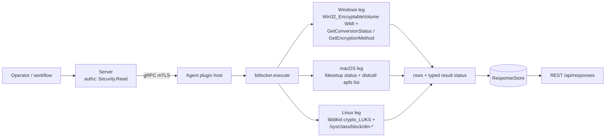

# bitlocker

<!-- BEGIN GENERATED: plugin-doc-gen header -->
| | |
|---|---|
| **What it does** | Disk encryption status — BitLocker, LUKS, FileVault |
| **Version** | 0.2.0 |
| **Kind** | Collector · read-only · gathered (security.encryption.state) |
| **Platforms** | Windows ✅ · macOS ✅ · Linux ✅ |
| **Actions** | `state` (definition `security.encryption.state`) |
| **Security** | securable `Security` · operation Read · risk Medium · dispatch ReadOnly · approval gate None |
| **Roles** | execute: endpoint-admin, endpoint-operator, security-admin · author: content-author |
<!-- END GENERATED -->

## How it works

The plugin has one action, `state`, which branches to a different acquisition path per OS behind `#ifdef` and always emits an honest "nothing found" row rather than silence. On Windows it queries `Win32_EncryptableVolume` in-process over WMI for every BitLocker-encryptable volume, then makes two further in-process WMI method calls per volume — `GetConversionStatus` and `GetEncryptionMethod`; either call failing degrades only that one field to `Unknown` rather than aborting the scan. On Linux it enumerates raw `crypto_LUKS` superblocks via libblkid and separately reads `/sys/class/block/dm-*/dm/uuid` to learn which of those devices are currently open (mapped) — no subprocess either way. On macOS it runs `fdesetup status` for a global on/off signal and `diskutil apfs list` for per-volume detail, both as direct argv through the bounded subprocess runner with a 20-second deadline, then parses the diskutil transcript with a pure text parser. It is deliberately not an encrypt/decrypt/enable action — every leg is a pure status read — and it never fabricates a value it can't verify: an unreadable field reports `unknown`/`Unknown` rather than a guess.



## OS capability

<!-- BEGIN GENERATED: plugin-doc-gen capability -->
| Action | Windows | macOS | Linux |
|---|---|---|---|
| `state` | ✅ supported · rung 1 · wmi_encryptable_volume | ✅ supported · rung 2 · fdesetup+diskutil | ✅ supported · rung 1 · libblkid+sysfs |
<!-- END GENERATED -->

## Privileges and prerequisites

| OS | Runs as | Extra grant needed | Measured | If the read is refused |
|---|---|---|---|---|
| Windows | LocalSystem today (#1442; intended target is the virtual service account `NT SERVICE\YuzuAgent`) | The WMI namespace `root\CIMV2\Security\MicrosoftVolumeEncryption` is admin-only per Microsoft's docs (`bitlocker_plugin.cpp:97-99`). `docs/agent-privilege-model.md` carries two different characterizations of the specific grant for `bitlocker.state` — `SeBackupPrivilege` (line 99) vs. plain `Administrators` group membership (line 122) — a doc inconsistency, moot in practice today since LocalSystem already holds both | 2026-09-07, bare-metal, `SYSTEM` (`docs/samples/windows.txt:1`) | typed sentinel row `error\|permission_denied: administrator privilege required to read BitLocker status` (`bitlocker_plugin.cpp:114-115`); `execute()` returns 1 |
| macOS | root — the shipped LaunchDaemon has no `UserName` key (`docs/agent-privilege-model.md:15`) | none observed in this plugin's code — both `fdesetup` and `diskutil` calls are unprivileged reads | 2026-09-07, bare-metal, euid 501 (alex) — unprivileged (`docs/samples/macos.txt:1`) | no distinct denial path: a timed-out or failed tool call still returns whatever text it produced, logged via `spdlog::warn` (`bitlocker_plugin.cpp:78-83`); the parser reports `filevault\|unknown\|<diagnostic>` rather than a typed permission error |
| Linux | `yuzu`, an unprivileged system account by design (`docs/agent-privilege-model.md:47-52`); the sample below was captured as root in a container, not the account's real identity | none — libblkid `TYPE` probing and `/sys/class/block/dm-*/dm/uuid` reads need no elevated capability (not listed in either `agent-privilege-model.md` table) | 2026-09-06, container, `euid 0` (`docs/samples/linux.txt:1`) — captured privileged, not representative of the production account | no distinct denial path: a `blkid_get_cache` failure or unreadable `/sys` entry silently yields fewer devices/mappings (`bitlocker_plugin.cpp:187-189, 253-256`), surfacing as `volume\|none\|no_encrypted_volumes` if nothing is found |

Binaries/subprocesses: macOS only — `/usr/bin/fdesetup status` and `/usr/bin/diskutil apfs list`, both invoked as direct argv through the bounded subprocess runner (`run_bounded_subprocess`) with a 20-second deadline (`bitlocker_plugin.cpp:68-77, 299, 317`). Windows and Linux use no subprocess at all — in-process WMI/COM and libblkid/`/sys` reads only. No network access on any OS.

## Data contract

### Inputs

<!-- BEGIN GENERATED: plugin-doc-gen inputs -->
The action takes no parameters.
<!-- END GENERATED -->

### Outputs

Rows are pipe-delimited, but the row shape is genuinely different per OS, not one schema with blanks. Windows emits `volume|<drive>|<conversion>|<pct>|<method>|<protection>` — six fields, one row per encryptable volume (`bitlocker_windows_wmi.hpp` `format_volume_row`). Linux emits `volume|<device>|crypto_LUKS|<active|inactive>` — four fields, one row per LUKS superblock (`bitlocker_linux_parsers.hpp` `format_volume_row`). macOS emits a single global `filevault|enabled` / `filevault|disabled` / `filevault|unknown|<diagnostic>` row, followed by zero or more `volume|<label>|<type>|<encrypted|not_encrypted|unknown>` rows, one per APFS volume `diskutil` reported (`bitlocker_plugin.cpp:300-333`). The YAML's five declared `result.columns` (`volume`, `conversion_status`, `percentage_encrypted`, `encryption_method`, `protection_status`) match the Windows row's five post-prefix fields exactly; Linux and macOS populate only the `volume` identifier field from that set — their other fields carry a type/role/state string, not a BitLocker-shaped value, so this table's `Platforms` column is genuinely narrow rather than a stylistic omission. A host that finds nothing still emits one row (`volume|none|no_encryptable_volumes` on Windows, `volume|none|no_encrypted_volumes` on Linux) rather than zero rows, so an empty result is never misread as "the query didn't run".

<!-- BEGIN GENERATED: plugin-doc-gen outputs -->
**`security.encryption.state` — `volume|conversion_status|percentage_encrypted|encryption_method|protection_status`**

| Field | Type | Values | Available | Example | Description |
|---|---|---|---|---|---|
| `volume` | string | - | Windows, Linux, macOS | `C:` | Per-OS volume identifier: drive letter on Windows, block-device basename on Linux, or the APFS volume's display label on macOS. Values: free text. |
| `conversion_status` | string | `Fully Decrypted` `Fully Encrypted` `Encryption In Progress` `Decryption In Progress` `Encryption Paused` `Decryption Paused` `Unknown` | Windows | `Fully Decrypted` | BitLocker's live conversion/encryption state for the volume, decoded from Win32_EncryptableVolume::GetConversionStatus(). Populated only on Windows; Linux and macOS rows do not carry this field. |
| `percentage_encrypted` | string | - | Windows | `0%` | Percentage of the volume currently encrypted, from BitLocker's EncryptionPercentage out-parameter. Populated only on Windows. Values: `<integer>%` or `unknown`. |
| `encryption_method` | string | `None` `AES 128 with Diffuser` `AES 256 with Diffuser` `AES 128` `AES 256` `Hardware Encryption` `XTS-AES 128` `XTS-AES 256` `Unknown` | Windows | `None` | The disk-encryption cipher/mode BitLocker is using for the volume, from GetEncryptionMethod(). Populated only on Windows. |
| `protection_status` | string | `Protection On` `Protection Off` `Protection Unknown` | Windows | `Protection Off` | Whether BitLocker protection is currently on or off for the volume, from Win32_EncryptableVolume::ProtectionStatus. Populated only on Windows. |
<!-- END GENERATED -->

### Result status

| Status | Completeness | Provenance | When |
|---|---|---|---|
| `OK` | PARTIAL | `bitlocker:volume_enumeration_truncated` | Windows only — the shared bounded-WMI-query row cap truncated the encryptable-volume list (`bitlocker_plugin.cpp:136-137`) |

This is the plugin's only `set_result_status` call. Every other run leaves the status unset: the agent records `UNDECLARED`, and all three sample captures show `UNDECLARED / UNKNOWN /` for a clean run.

### Where the data goes

- **Instruction result only.** Rows travel over the agent's mTLS gRPC channel as the command response and land in the ResponseStore at the DSL default 90-day retention (`docs/yaml-dsl-spec.md` `spec.response.retentionDays`, not overridden by this definition), queryable at `/api/responses/{id}` and chartable via the `pie` / `single_series` visualization declared in the YAML (`content/definitions/bitlocker.yaml:69-76`).
- **Visualization caveat.** `result_parsing.hpp` treats `bitlocker` as a key|value-schema plugin, and the chart filters on `whereField: 0, whereEquals: volume` (`content/definitions/bitlocker.yaml:72-73`). That filter matches every Windows and Linux row and every macOS per-volume `volume|` row, but macOS's global `filevault|...` row has `filevault`, not `volume`, in field 0 — it is silently excluded from the "BitLocker volumes seen across the fleet" pie chart.
- **Not consumed by** daily-sync inventory, the TAR warehouse, DEX, or metrics — `bitlocker`/`security.encryption.state` do not appear in `typed_inventory_sources.hpp`, `software_inventory_store.cpp`, or the TAR sources. (DEX's `security.bitlocker_error` observation type, `server/core/src/dex_routes.cpp:109`, is an unrelated tamper/health event taxonomy label, not a consumer of this plugin's rows.)
- **Sensitivity.** `volume` rows carry a drive letter, block-device basename, or APFS volume label — not a device serial, MAC, hostname, username, or installed-software name; `conversion_status`/`percentage_encrypted`/`encryption_method`/`protection_status` describe the encryption state only.
- **Bundled in** (not siblings — instruction-set references, not data producers): `core.security.endpoint-security` (`content/definitions/security_set.yaml:30`) and the visualization demo set `demo.visualization.fleet-posture` (`content/definitions/visualization_demo_set.yaml:48`).
- **MCP / REST.** Discover: `discover_plugins` (summary) → `yuzu://plugin-docs` (this page as data) → `discover_instructions` / `get_definition("security.encryption.state")`. Run: `execute_instruction {definition_id, parameters}`. Read: `/api/responses/{id}`.

## Sample output

<!-- BEGIN GENERATED: plugin-doc-gen samples -->
**Windows** — captured: windows Microsoft Windows NT 10.0.26200.0 x64 · bare-metal · 2026-09-07 · SYSTEM · leg-hash ba3cbe6a5b56

```
== action=state
volume|C:|Fully Decrypted|0%|None|Protection Off
volume|D:|Fully Decrypted|0%|None|Protection Off
[result_status] UNDECLARED / UNKNOWN
```

**macOS** — captured: macos macOS 26.6.2 arm64 · bare-metal · 2026-09-07 · euid 501 (alex) · leg-hash ba3cbe6a5b56

```
== action=state
filevault|enabled
[result_status] UNDECLARED / UNKNOWN
```

**Linux** — captured: linux Debian GNU/Linux 13 (trixie) aarch64 · container · 2026-09-06 · euid 0 · leg-hash ba3cbe6a5b56

```
== action=state
volume|none|no_encrypted_volumes
[result_status] UNDECLARED / UNKNOWN
```
<!-- END GENERATED -->

## Caveats and known gaps

1. **The Linux fixtures backing the parser are synthetic, not captured.** `bitlocker_linux_parsers.hpp`'s file header states a privileged Docker loopback-LUKS capture was attempted for this migration but no Docker daemon was reachable in the sandbox it was written in, so the dm-crypt `/sys/class/block/dm-*/dm/uuid` fixtures are built to the documented `CRYPT-<SUBSYS>-<uuid>-<name>` shape rather than a real capture. The live sample above (`docs/samples/linux.txt`) has zero LUKS volumes, so it does not exercise this code path either.
2. **The YAML's `result.columns` are Windows-shaped only.** `conversion_status`, `percentage_encrypted`, `encryption_method`, and `protection_status` are populated exclusively by the Windows leg; Linux and macOS rows carry a different field count and different (non-BitLocker) values in those positions. See the Outputs paragraph above.
3. **macOS's global FileVault row is invisible to the fleet chart.** The `whereField: 0, whereEquals: volume` visualization filter excludes the `filevault|...` row emitted once per macOS run, because that row's first field is `filevault`, not `volume` (tracked generally under issue #626, which covers the same plugin's coarser labelField limitation).
4. **The Windows grant is the `Administrators` group, not a privilege.** Both privilege-model rows (`docs/agent-privilege-model.md:99` and `:122`) name the `Administrators` group, matching the admin-ACL'd `root\CIMV2\Security\MicrosoftVolumeEncryption` namespace the plugin queries (`bitlocker_windows_wmi.hpp:270-278`); an unprivileged caller gets the typed `permission_denied` sentinel (`bitlocker_plugin.cpp:114-115`), not a raw WMI error.
5. **`DeviceIoControl`-style WMI calls have no explicit per-call timeout.** `run_bounded_wmi_query` / `exec_object_method` are the shared helper's responsibility, not this plugin's; a wedged WMI provider is bounded only by whatever deadline `wmi_bounded.hpp` applies, which this plugin's code does not override.

## Source and tests

<!-- BEGIN GENERATED: plugin-doc-gen source -->
- Plugin: `agents/plugins/bitlocker/src/bitlocker_linux_parsers.hpp` · `agents/plugins/bitlocker/src/bitlocker_macos_apfs.hpp` · `agents/plugins/bitlocker/src/bitlocker_plugin.cpp` · `agents/plugins/bitlocker/src/bitlocker_windows_wmi.hpp`
- Definitions: `content/definitions/bitlocker.yaml`
- Capability rows: `server/core/src/capability_decls/plugin_action_catalogue_d.hpp`
- Tests: `tests/unit/agent/test_bitlocker_macos.cpp` · `tests/unit/test_bitlocker_linux_parsers.cpp` · `tests/unit/test_bitlocker_local_dispatcher.cpp` · `tests/unit/test_bitlocker_windows_wmi.cpp`
- Privilege row: `docs/agent-privilege-model.md`
- Changelog: `changelog.d/20260818-wave3-bitlocker-native-acquisition.changed.md`
<!-- END GENERATED -->
