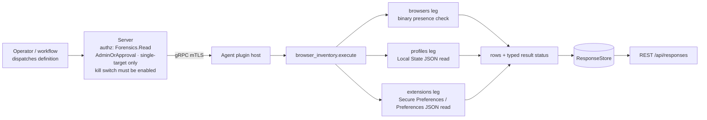

# browser_inventory

<!-- BEGIN GENERATED: plugin-doc-gen header -->
<!-- TODO(orchestrator): run `python3 tools/plugin-doc-gen/plugin_doc_gen.py --all` after docs/os-capability-matrix.md's generated block carries browser_inventory's rows (Linux capmatrix-gen regen against the compiled .so) -- this fence renders empty/undeclared until then. -->
<!-- END GENERATED -->

## How it works

`browsers`, `profiles` and `extensions` are three independent reads, dispatched and gated separately — a failure in one never blocks the others. On Linux this wave, `browsers` checks presence of the known Chromium-family system-wide binaries (`google-chrome`, `microsoft-edge`) and emits one row per candidate, present or not, with version always `-` (no version/channel probe in this package). `profiles` walks every discoverable OS user's `~/.config/{google-chrome,microsoft-edge}` directory and reads that browser's `Local State` JSON, emitting one row per profile directory listed in `profile.info_cache`. `extensions` walks the same profile set and reads each profile's `Default/Secure Preferences` (preferred) or `Default/Preferences` (fallback) — real-world Chromium keeps the per-extension install/enable state under `extensions.settings` in Secure Preferences only; Preferences carries an `extensions` key but never `.settings` under it (confirmed against a real Microsoft Edge capture, see Caveats). Every action's wire stream leads with a `status|<action>|<supported|constrained>|<reason>` row before any data row (the same CC-07 typed-status pairing `peripherals`/`autoruns` use), so a consumer never reads silence and infers "nothing checked." macOS and Windows legs — including Safari on macOS — are PLANNED and follow as their own PR; Firefox follows separately on every OS. Every row is Forensics-gated, single-target, and DEFAULT-OFF behind the server-side plugin-config kill switch until an operator explicitly enables it.

**PRIVACY CONTRACT.** No row this plugin emits, on any action or any OS leg, ever carries an account identifier, browsing history, cookies or bookmarks — no `user_name`, no `gaia_id`, no e-mail address. This is enforced structurally in `browser_inventory_parsers.hpp`: `BrowserProfileRow` and `ExtensionStateRow` simply have no such field, so there is no code path that could put one on the wire. The Secure Preferences `protection` tree (a MAC/HMAC over the profile) is never read, let alone validated, by any leg.

**WHY Forensics, not Inventory.** Unlike a plain installed-software inventory, this plugin reads per-user browser profile and extension state for a SINGLE named machine — the kind of evidence a rogue or compromised operator identity could otherwise use to fingerprint a target's activity undetected (which extensions a specific user runs, which browser profiles exist on their account). That is the same operator-triage rationale `execution_artifacts` and `app_usage` already carry, and this plugin shares their exact `Forensics:Read`/`AdminOrApproval` boundary — see `server/core/src/capability_decls/plugin_action_catalogue_browser_inventory.hpp` for the fuller rationale, copied field-for-field from `execution_artifacts`'.

## OS capability

<!-- BEGIN GENERATED: plugin-doc-gen capability -->
<!-- TODO(orchestrator): run `python3 tools/plugin-doc-gen/plugin_doc_gen.py --all` after docs/os-capability-matrix.md's generated block carries browser_inventory's rows (Linux capmatrix-gen regen against the compiled .so) -- this fence renders empty/undeclared until then. -->
<!-- END GENERATED -->

## Privileges and prerequisites

| OS | Runs as | Extra grant needed | Measured | If the read is refused |
|---|---|---|---|---|
| Windows | agent service account (LocalSystem today, #1442) | n/a this wave — the Windows leg is a FINAL placeholder; real implementation and its own privilege measurement follow as its own PR | not measured (no mechanism exists yet) | always the PLANNED sentinel row, `UNAVAILABLE`/`PARTIAL` |
| macOS | agent service account | n/a this wave — the macOS leg (including Safari) is a FINAL placeholder; real implementation and its own privilege measurement follow as its own PR | not measured (no mechanism exists yet) | always the PLANNED sentinel row, `UNAVAILABLE`/`PARTIAL` |
| Linux | agent service account | None — every read is an unprivileged filesystem read under a discoverable OS user's own home directory (`~/.config/{google-chrome,microsoft-edge}`); no elevation, no subprocess | not yet measured on real hardware this wave (Chrome fixtures are SYNTHETIC, sign-off 2026-09-21 — neither browser is installed on the build host; see Caveats) | `constrained` with a named reason (`ConstraintAccumulator`-sourced, e.g. a directory-open or file-read failure token) — a genuinely absent browser or user reports absent/zero rows, distinct from `constrained` |

No external binaries, no subprocesses, no network access on the Linux leg — every call is an in-process filesystem read and JSON parse. This plugin performs no authorization of its own: `Forensics:Read`/`AdminOrApproval`/single-target enforcement lives at the server dispatch layer (`server/core/src/dispatch_destructive_gate.hpp`), and every read is additionally gated behind the server-side plugin-config kill switch (`PluginConfigStore::seed_kill_switch_default_off`), which is OFF until an operator explicitly enables it.

## Data contract

### Inputs

<!-- BEGIN GENERATED: plugin-doc-gen inputs -->
<!-- TODO(orchestrator): run `python3 tools/plugin-doc-gen/plugin_doc_gen.py --all` after docs/os-capability-matrix.md's generated block carries browser_inventory's rows (Linux capmatrix-gen regen against the compiled .so) -- this fence renders empty/undeclared until then. -->
<!-- END GENERATED -->

### Outputs

Pipe-delimited rows. Every action's stream leads with a `status|<action>|<supported|constrained>|<reason>` row (CC-07 typed-status pairing), followed by zero or more data rows discriminated by their own leading tag (`browser|...`, `profile|...`, `extension|...`); every untrusted string field (usernames, profile display names, extension names/ids/versions) is escaped through `safe_output_field`. A directory or file that cannot be opened or read anywhere in the walk (`ConstraintAccumulator`) sets the action's `status` row to `constrained` with the accumulated reason — a genuinely absent browser install or user directory is never treated as a failure, only as fewer rows.

<!-- BEGIN GENERATED: plugin-doc-gen outputs -->
<!-- TODO(orchestrator): run `python3 tools/plugin-doc-gen/plugin_doc_gen.py --all` after docs/os-capability-matrix.md's generated block carries browser_inventory's rows (Linux capmatrix-gen regen against the compiled .so) -- this fence renders empty/undeclared until then. -->
<!-- END GENERATED -->

### Result status

| Status | Completeness | Provenance | When |
|---|---|---|---|
| `OK` | full | *(empty)* | The leg's walk completed with no unreadable directory or malformed file anywhere along the way (`status\|supported\|-`). |
| `CONSTRAINED` | partial | `linux:browser_inventory:local_state_malformed` · `linux:browser_inventory:extensions_prefs_malformed` · `linux:browser_inventory:busy` · `linux:browser_inventory:not_a_directory` · `linux:browser_inventory:not_regular` · `linux:browser_inventory:open_failed` · `linux:browser_inventory:permission_denied` · `linux:browser_inventory:readdir_error:home` · `linux:browser_inventory:row_cap:home` · `linux:browser_inventory:symlink_refused` | A `Local State`, `Secure Preferences` or `Preferences` file existed but failed to parse as valid JSON, or a directory in the walk (a user's config directory, a browser's data directory, a profile directory) could not be opened, read, or safely followed (symlink refusal, non-directory, non-regular file, busy/locked, permission denied, a `readdir` failure, or the per-user row cap) for a reason other than benign absence. |
| `UNAVAILABLE` | partial | `macos:planned` · `windows:planned` | macOS and Windows, every action, this wave — both legs are FINAL placeholders; the real implementation (including Safari on macOS) follows as its own PR. The row itself is `status\|<action>\|unsupported\|<os_tag>:planned`. |

### Where the data goes

- **Instruction result only.** Rows travel over the agent's mTLS gRPC channel as the command response, land in the ResponseStore, and are queryable at `/api/responses/{id}` — single-target only; fleet or scope targeting is refused at the server dispatch layer before this plugin ever runs.
- **Not consumed by** daily-sync inventory, the TAR warehouse, DEX, or metrics. Nothing here runs on a schedule; each action dispatches only when an operator or workflow explicitly requests it, and only once the plugin-config kill switch is enabled.
- **Sensitivity.** `profiles` and `extensions` rows name a real local OS username and real browser profile/extension identity for a single named machine — together they let a reader reconstruct which browsers and extensions a specific person on that machine uses, which is exactly the kind of per-user fingerprint an unauthorized reader could misuse, even though no account identifier, browsing history or cookie is ever included (see the PRIVACY CONTRACT above).
- **Siblings:** `execution_artifacts` and `app_usage` are the other Forensics-gated, default-off evidence sources in the catalogue; none share a store or a format with this plugin.
- **MCP / REST.** Discover: `discover_plugins` (summary) → `yuzu://plugin-docs` (this page as data) → `discover_instructions` / `get_definition("crossplatform.browser_inventory.profiles")`. Run: `execute_instruction {definition_id, parameters}` (single explicit `agent_id` required). Read: `/api/responses/{id}`.

## Sample output

<!-- BEGIN GENERATED: plugin-doc-gen samples -->
<!-- TODO(orchestrator): run `python3 tools/plugin-doc-gen/plugin_doc_gen.py --all` after docs/os-capability-matrix.md's generated block carries browser_inventory's rows (Linux capmatrix-gen regen against the compiled .so) -- this fence renders empty/undeclared until then. -->
<!-- END GENERATED -->

## Caveats and known gaps

1. **macOS and Windows legs — including Safari on macOS — are PLANNED, not implemented, this wave.** Every action on those two OSes returns the fixed `status|<action>|unsupported|<os_tag>:planned` sentinel and `UNAVAILABLE`/`PARTIAL`; the real per-OS reads (macOS: `/Applications/{Google Chrome,Microsoft Edge}.app` Info.plist + `~/Library/Application Support/{Google/Chrome,Microsoft Edge}` walk, plus the Safari bundle/`.appex` containers; Windows: `ProfileList` walk + `%LOCALAPPDATA%` User Data, plus `Program Files\Application\<semver>` dirs) each follow as their own PR. Firefox is out of scope for every leg in this package and follows separately.
2. **Chrome fixtures are SYNTHETIC; Microsoft Edge fixtures are a REAL CAPTURE (the-rig, reduced and redacted).** Neither Chrome nor Firefox is installed on the build host this wave, so Alex explicitly signed off SYNTHETIC Chrome fixtures on 2026-09-21 (run-context.md Phase-0 item 2) on condition they mirror the real Edge capture's on-disk shape (`tests/unit/fixtures/wave10/browser_inventory/chrome/`, every file's `_provenance` key states SYNTHETIC or RECONSTRUCTION). The Edge fixtures (`tests/unit/fixtures/wave10/browser_inventory/edge/`) are a real the-rig capture of `Local State`, `Default/Preferences`, `Default/Secure Preferences` and one extension's `manifest.json`, reduced (subtrees dropped) and redacted (account/host values replaced) before being committed — see that directory's `provenance.txt` for the full capture log and hash chain.
3. **`extensions.settings` lives in `Secure Preferences`, not `Preferences`, on the browsers captured so far.** The real Edge capture confirmed `Default/Secure Preferences` carries `.extensions.settings` (53 entries) while `Default/Preferences` carries an `extensions` key with no `.settings` under it at all — `extension_state_from_prefs()` therefore prefers Secure Preferences and falls back to Preferences only where the split doesn't hold; this has not been independently confirmed against a real Chrome or Firefox capture.
4. **DEFAULT-OFF behind the server-side plugin-config kill switch.** None of the three actions dispatch until an operator explicitly `PUT`s `/api/v1/plugin-config/browser_inventory/kill-switch {"enabled":true}` — on a fresh install or an unconfigured fleet, every dispatch attempt is refused at the server layer, not reported as a plugin-level failure.
5. **Linux `browsers` is presence-only this wave.** It detects whether the known system-wide binary paths exist; it does not probe the installed version or release channel (descriptor rung 1) — a distinct value-add over `installed_apps`' broader inventory that this plugin does not yet close.

## Source and tests

<!-- BEGIN GENERATED: plugin-doc-gen source -->
<!-- TODO(orchestrator): run `python3 tools/plugin-doc-gen/plugin_doc_gen.py --all` after docs/os-capability-matrix.md's generated block carries browser_inventory's rows (Linux capmatrix-gen regen against the compiled .so) -- this fence renders empty/undeclared until then. -->
<!-- END GENERATED -->
