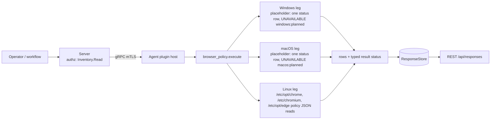

# browser_policy

<!-- BEGIN GENERATED: plugin-doc-gen header -->
| | |
|---|---|
| **What it does** | Enterprise-managed Chrome, Chromium and Edge browser policy inventory |
| **Version** | 1.0.0 |
| **Kind** | Collector · read-only · gathered (crossplatform.browser_policy.policies) |
| **Platforms** | Windows 🟡 planned · macOS 🟡 planned · Linux ✅ |
| **Actions** | `policies` (definition `crossplatform.browser_policy.policies`) |
| **Security** | securable `Inventory` · operation Read · risk Low · dispatch ReadOnly · approval gate None |
| **Roles** | execute: endpoint-admin, endpoint-operator · author: content-author |
<!-- END GENERATED -->

## How it works

`policies` reports which enterprise-managed browser policies an administrator has configured on the device, as facts only. One `policy` row is written per configured policy: the browser (Chrome, Chromium or Edge), whether the policy is mandatory or recommended, its scope, its name, its typed value and the file it was read from. On Linux the rows come from the JSON policy files under `/etc/opt/chrome/policies`, `/etc/chromium/policies` and `/etc/opt/edge/policies`, in their `managed` and `recommended` subdirectories. Every directory below the root is opened without following symlinks, every file is read with a 1 MiB cap (16 MiB parsed in total per run), and the parse is done with the vendored `nlohmann` JSON library. The plugin reads local configuration and nothing else: no subprocess, no network, no write. It enforces nothing and judges nothing; a policy is a row, not a verdict. When a read cannot be completed, or on a host whose leg is still a placeholder, one `status` row leads the output and repeats the typed result status, so the outcome is visible wherever rows are (see Result status). The Windows and macOS legs are placeholders (see Caveats).

The plugin seeds no default-off kill switch, on purpose: it reads operator/IT-authored config, not personal data, so it carries neither the default-off switch nor an execute gate (the operator-settable per-plugin kill switch still applies to it).



## OS capability

<!-- BEGIN GENERATED: plugin-doc-gen capability -->
| Action | Windows | macOS | Linux |
|---|---|---|---|
| `policies` | 🟡 planned · rung 1 · HKLM\\SOFTWARE\\Policies\\{Google\\Chrome,Microsoft\\Edge} registry reads (RegKey enumerate_value_names) | 🟡 planned · rung 1 · /Library/Managed Preferences/{,<user>/}{com.google.Chrome,com.microsoft.Edge}.plist (CFPropertyListCreateWithData) | ✅ supported · rung 1 · /etc/opt/{chrome,edge} and /etc/chromium policies/{managed,recommended}/*.json (nlohmann) |

**Declared limits per leg** (descriptor fallback text, verbatim):

- **`policies` / Windows** — follows as its own PR
- **`policies` / macOS** — follows as its own PR
<!-- END GENERATED -->

## Privileges and prerequisites

| OS | Runs as | Extra grant needed | Measured | If the read is refused |
|---|---|---|---|---|
| Windows | n/a - planned placeholder | n/a - planned placeholder | n/a - planned placeholder (the registry probe below is evidence, not a measurement of this plugin) | n/a - the placeholder reports `UNAVAILABLE` with `windows:planned` and reads nothing |
| macOS | n/a - planned placeholder | n/a - planned placeholder | n/a - planned placeholder | n/a - the placeholder reports `UNAVAILABLE` with `macos:planned` and reads nothing |
| Linux | agent daemon, dedicated unprivileged account (`yuzu`), never root by design (`docs/agent-privilege-model.md`) | None to read - the policy directories are root-owned but must be world-readable for the browser itself to load them | Measured 2026-09-23 in a Debian 13 container as euid 0 (`docs/samples/linux.txt`: the seeded policy files read with no extra grant); the refusal path (`permission_denied`) is proven by the unit suite as a non-root user, not by a service-account run on a real host | `CONSTRAINED` / partial with a `linux:<detail>` token (for example `linux:permission_denied` or `linux:symlink_refused`); the unreadable directory or file contributes no rows, one `status` row repeats the outcome, and the result never reads as "no policy configured" |

No external binaries, no subprocesses, no shell-out and no network use: the Linux leg is an in-process, bounded read of local files.

**Windows LocalSystem probe (evidence, not a measured outcome of this plugin).** The Windows leg is a planned placeholder that reads nothing, so the plugin has no LocalSystem outcome of its own yet. Separately, a registry probe on the-rig (2026-09-21) of `HKLM\SOFTWARE\Policies\Google\Chrome` and `HKLM\SOFTWARE\Policies\Microsoft\Edge` returned byte-identical output whether run as the interactive user or as SYSTEM: both roots were present with no values at the root and one subkey, `LocalNetworkAccessAllowedForUrls`, holding a value named `1` (`REG_SZ`), and the `Recommended` subkeys were absent (a real `reg query` exit 1).

## Data contract

### Inputs

<!-- BEGIN GENERATED: plugin-doc-gen inputs -->
The action takes no parameters.
<!-- END GENERATED -->

### Outputs

Every row is pipe-delimited and has nine fields; field 0 is `policy` for a policy row, or `status` for the one outcome row described under Result status. A host with no managed policy returns zero rows. Free text is escaped for the server's pipe grammar (`safe_output_field`, lossy on backslash by design), a field with an embedded NUL byte, or with a byte that is not valid UTF-8 (only a Linux file name can carry one, in `source`), has it replaced by U+FFFD and is flagged in `detail` (`nul_replaced`, `utf8_replaced`), a field longer than 64 KiB is cut and flagged `truncated`, and a value that cannot be represented is typed `unmodelled` (`detail` `json_type`) instead of being dropped. `browser_policy` is not in the server's key/value plugin set, so rows are decoded as pipe-separated fields, not as `key|rest`.

<!-- BEGIN GENERATED: plugin-doc-gen outputs -->
**`crossplatform.browser_policy.policies` — `row_kind|browser|level|scope|name|value_type|value|source|detail`**

| Field | Type | Values | Available | Example | Description |
|---|---|---|---|---|---|
| `row_kind` | string | `policy` `status` | Windows, Linux, macOS | `policy` | Row shape discriminator (field 0): policy (one per configured policy) or status (written first, and only when the read was not complete). A status row repeats the typed result status in band; its name field is the action, its value field the state and its detail field the reason tokens; its other fields are "-". |
| `browser` | string | `chrome` `chromium` `edge` | Linux | `chrome` | Browser the policy applies to. Values: chrome (Google Chrome), chromium (Chromium), edge (Microsoft Edge); "-" on a status row. |
| `level` | string | `mandatory` `recommended` | Linux | `mandatory` | Policy level. Values: mandatory (the user cannot override it), recommended (a default the user may change); "-" on a status row. |
| `scope` | string | - | Linux | `machine` | Where the policy applies. Values: machine, or user:<name> where a leg reads per-user policy (the Linux leg reads machine policy only, so it always reports machine). The user name is untrusted text. |
| `name` | string | - | Windows, Linux, macOS | `HomepageLocation` | Policy name exactly as the browser documents it. On a status row: the action name, policies. |
| `value_type` | string | `bool` `int` `real` `string` `list` `dict` `null` `unmodelled` | Linux | `string` | Type of the value. Values: bool, int, real, string, list, dict, null, unmodelled (the policy is present but its value could not be represented; see detail); "-" on a status row. |
| `value` | string | - | Windows, Linux, macOS | `https://intranet.example.com` | The policy value as text: true or false for a bool, decimal text for int and real, the string verbatim, compact JSON text for a list or dict, the literal null for null, and "-" for unmodelled. Reported verbatim: a value can carry a credential-bearing URL or an enrollment token an administrator put in the file. On a status row: the state, constrained or unavailable. |
| `source` | string | - | Linux | `/etc/opt/chrome/policies/managed/corp.json` | The logical absolute file the policy was read from, never an injected test root. Only the Linux leg reads policy today; the Windows and macOS legs will report the registry key or plist path. |
| `detail` | string | - | Windows, Linux, macOS | `-` | A short qualifier, or "-" when there is none. json_type marks an unmodelled value; nul_replaced and utf8_replaced (appended, comma-joined) mark a free-text field that held an embedded NUL byte or a byte that is not valid UTF-8 (possible in a Linux file name), each replaced by U+FFFD; truncated marks a field longer than 64 KiB, cut. On a status row: the comma-joined reason tokens, for example linux:permission_denied or macos:planned. |
<!-- END GENERATED -->

### Result status

`policies` sets `OK`/`FULL` when the Linux read completed, including a host with no policy files at all: an absent policy set is a complete answer, not a degradation, and it writes no row. Any directory, file or value that exists but could not be read or decoded makes the result `CONSTRAINED`/`PARTIAL` with the failure tokens as the reason; the rows that were read are still emitted. The Windows and macOS placeholders report `UNAVAILABLE`/`PARTIAL`: that host was not inspected, which is never the same as "no policy configured". No exception crosses the plugin boundary: a leg that throws is reported as `UNAVAILABLE`/`PARTIAL` with an exception token.

Every result other than a complete read is ALSO written as one `status` row, first in the output: `status|-|-|-|policies|-|<state>|-|<reason>`, where `<state>` is `constrained` or `unavailable` and `<reason>` is the same comma-joined token list the typed status carries as its provenance. The row exists because the server's response queries (REST, MCP and the dashboard) do not return the typed result status today, so without it a host that was not inspected, or a read that failed, would look exactly like a host with no policy. Zero rows and no `status` row means the read completed. The tokens name the kind of failure, not the file: to find the file, look in the three vendor directories (`managed` and `recommended`) for the unreadable, unparseable, oversized, non-regular or symlinked entry the token describes.

| Status | Completeness | Provenance | When |
|---|---|---|---|
| `OK` | `FULL` | (empty) | Linux: every read completed, populated or genuinely empty; no `status` row |
| `CONSTRAINED` | `PARTIAL` | `linux:<detail>` with `<detail>` one of `permission_denied`, `symlink_refused`, `not_a_directory`, `open_failed`, `stat_failed`, `not_regular`, `oversized`, `read_failed`, `readdir_error`; also `linux:row_cap` (more than 8192 rows in one run), `linux:entry_cap` (one policy directory holds more than 4096 entries), `linux:byte_cap` (more than 16 MiB of policy files read in one run), `linux:json_unparseable`, `linux:json_not_object`, `linux:json_too_deep` and `linux:json_too_complex` (more than 65536 containers in one file) (several tokens are comma-joined) | Linux: a policy directory or file exists but could not be read completely or decoded, or a bound (row cap, directory entry cap, 1 MiB file cap, 16 MiB total parse cap, nesting depth, container count) was hit; one `constrained` `status` row |
| `UNAVAILABLE` | `PARTIAL` | `windows:planned` | Windows: the leg is a placeholder; one `unavailable` `status` row, no policy rows |
| `UNAVAILABLE` | `PARTIAL` | `macos:planned` | macOS: the leg is a placeholder; one `unavailable` `status` row, no policy rows |
| `UNAVAILABLE` | `PARTIAL` | `windows:leg:exception` / `macos:leg:exception` / `linux:leg:exception` | a leg threw; reported (with one `unavailable` `status` row) instead of unwinding across the plugin boundary |

### Where the data goes

- **Instruction result.** Rows travel over the agent's mTLS gRPC channel as the command response and land in the ResponseStore, queryable at `/api/responses/{id}`. `policies` is also a gathered definition (`crossplatform.browser_policy.policies`, `gather.ttlSeconds` 300: informational, nothing re-dispatches on it).
- **Not consumed by** daily-sync, TAR, DEX, or metrics.
- **Sensitivity.** Rows are operator/IT-authored configuration: policy names and values such as homepage URLs, allowed or blocked extension ids and proxy settings can disclose part of an organisation's browser-management posture and internal hostnames. They carry no browsing history, bookmarks, cookies or per-user data, and on the Linux leg the `scope` column always reports `machine`, never a user (the macOS registry-style leg's descriptor already documents per-user Managed Preferences, so this is a Linux-only fact). Values are reported verbatim and are not screened: a value an administrator wrote can itself hold a credential-bearing URL or an enrollment token (for example a proxy address with embedded credentials), and the files are world-readable so the browser can load them, so treat the rows as sensitive. Stored responses are kept for the ResponseStore's retention period (90 days by default, `docs/user-manual/response-store.md`); with RBAC off, the default, any authenticated session can read a stored result, but dispatching still needs an admin session (the legacy fallback's rule for any non-read operation); with RBAC on, dispatch needs `Execution:Execute` plus `Inventory:Read` and reading needs `Response:Read`.
- **Sibling:** `installed_apps` (which browsers are installed, not how they are managed).

## Sample output

<!-- BEGIN GENERATED: plugin-doc-gen samples -->
**macOS** — captured: macos macOS 26.6.2 arm64 · bare-metal · 2026-09-23 · euid 501 · leg-hash 3349c5d2765b

```
== action=policies
status|-|-|-|policies|-|unavailable|-|macos:planned
[result_status] UNAVAILABLE / PARTIAL / macos:planned
```

**Linux** — captured: linux Debian GNU/Linux 13 (trixie) aarch64 · container · 2026-09-23 · euid 0 (container seeded with two synthetic Chrome policy files for this capture; see the note under the samples) · leg-hash 3349c5d2765b

```
== action=policies
policy|chrome|mandatory|machine|ExtensionInstallForcelist|list|["aaaabbbbccccddddeeeeffffgggghhhh;https://clients2.google.com/service/update2/crx"]|/etc/opt/chrome/policies/managed/seeded.json|-
policy|chrome|mandatory|machine|HomepageLocation|string|https://intranet.example.com/|/etc/opt/chrome/policies/managed/seeded.json|-
policy|chrome|mandatory|machine|RestoreOnStartup|int|4|/etc/opt/chrome/policies/managed/seeded.json|-
policy|chrome|recommended|machine|BookmarkBarEnabled|bool|true|/etc/opt/chrome/policies/recommended/seeded.json|-
[result_status] OK / FULL
```
<!-- END GENERATED -->

The Linux capture is taken from a real Debian container that was seeded, for the capture only, with two SYNTHETIC Chrome policy files (Alex sign-off 2026-09-21; the image ships no browser): `/etc/opt/chrome/policies/managed/seeded.json` holding `ExtensionInstallForcelist`, `HomepageLocation` and `RestoreOnStartup`, and `/etc/opt/chrome/policies/recommended/seeded.json` holding `BookmarkBarEnabled`, so the sample shows the shipping leg reading real files through the production root. The same container with no policy files reports zero rows with `OK`/`FULL`. The walk, the caps and every failure token the tests can provoke are covered by the fixture-driven unit tests over `tests/unit/fixtures/wave10/browser_policy/linux`; the kernel-error tokens (`stat_failed`, `readdir_error`, `open_failed`, `read_failed`) cannot be provoked without a syscall seam and are not. The planned legs are status-only: the macOS capture shows the one `status` row and the placeholder status (`UNAVAILABLE`/`PARTIAL`, `macos:planned`), and there is no Windows capture.

## Caveats and known gaps

1. **Configured policy, not effective policy.** Rows are what is written in the policy files, not what the browser enforces, and Chromium's own reader is more lenient than this leg: it accepts trailing commas and other non-strict JSON (this leg reports `linux:json_unparseable` for that file), it follows symlinks (this leg refuses them: a symlinked file is `linux:symlink_refused`, a symlinked directory too), and where two files set one policy it applies the last file in name order (this leg reports one row per file, each with its `source`). It also parses every file in a policy directory, not only `*.json`, so a valid policy file with another name is applied by the browser but skipped here with no constraint reported: the one direction in which this leg can read as complete while missing a policy.
2. **No default-off kill switch, by design.** `browser_policy` reads operator/IT-authored config, not personal data, so it seeds no default-off gate and the action is an ordinary `Inventory` read (`Inventory:Read`, no execute gate), unlike plugins that read per-user data. The operator-settable per-plugin kill switch applies to it like any other plugin.
3. **Windows and macOS legs planned.** Each follows as its own PR; until then `policies` on those hosts returns one `status` row (`unavailable`) with result status `UNAVAILABLE` and provenance `windows:planned` or `macos:planned`, so a host that was not inspected never reads as having no policy.
4. **Linux reads machine-level JSON policy files in three vendor directories only.** Only the `managed` and `recommended` `*.json` files under `/etc/opt/chrome`, `/etc/chromium` and `/etc/opt/edge` are read; per-user policy, snap and flatpak Chromium paths, other Chromium-based browsers and Firefox `policies.json` are not, and every row reports scope `machine`. `OK`/`FULL` therefore means those directories were read completely, not that no browser on the host has a policy.
5. **Values are reported, not validated.** A policy name is emitted as written and is not checked against the browser's policy schema, so a misspelt or unsupported policy still appears as a row; lists and dicts are emitted as compact JSON text, and an embedded backslash in a value is folded to `/` by the escaper, and a name, value or source longer than 64 KiB is cut and flagged `truncated`. `value_type` describes how the value is stored in its source, not the browser's schema: a future Windows registry DWORD holding a boolean policy will report `int` where the Linux JSON file reports `bool`.

## Source and tests

<!-- BEGIN GENERATED: plugin-doc-gen source -->
- Plugin: `agents/plugins/browser_policy/src/browser_policy_legs.hpp` · `agents/plugins/browser_policy/src/browser_policy_linux.cpp` · `agents/plugins/browser_policy/src/browser_policy_linux_parsers.hpp` · `agents/plugins/browser_policy/src/browser_policy_macos.cpp` · `agents/plugins/browser_policy/src/browser_policy_parsers.hpp` · `agents/plugins/browser_policy/src/browser_policy_plugin.cpp` · `agents/plugins/browser_policy/src/browser_policy_win.cpp`
- Definitions: `content/definitions/browser_policy.yaml`
- Capability rows: `server/core/src/capability_decls/plugin_action_catalogue_browser_policy.hpp`
- Tests: `tests/unit/test_browser_policy_local_dispatcher.cpp` · `tests/unit/test_browser_policy_parsers.cpp`
- Privilege row: `docs/agent-privilege-model.md`
<!-- END GENERATED -->
