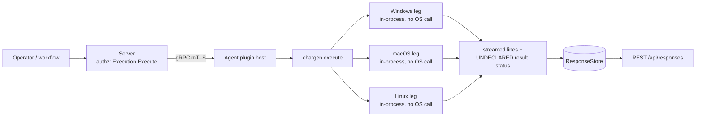

# chargen

<!-- BEGIN GENERATED: plugin-doc-gen header -->
| | |
|---|---|
| **What it does** | RFC 864 character generator — streams rotating ASCII lines |
| **Version** | 1.0.0 |
| **Kind** | Action · mutating · gathered (testing.chargen.start, testing.chargen.stop) |
| **Platforms** | Windows ✅ · macOS ✅ · Linux ✅ |
| **Actions** | `chargen_start` (definition `testing.chargen.start`) · `chargen_stop` (definition `testing.chargen.stop`) |
| **Security** | `chargen_start`: securable `Execution` · operation Execute · risk Medium · dispatch Mutating · approval gate AdminOrApproval; `chargen_stop`: securable `Execution` · operation Execute · risk Medium · dispatch Mutating · approval gate None |
| **Roles** | execute: endpoint-admin · author: content-author |
<!-- END GENERATED -->

## How it works

`chargen_start` first stops any session already running (`stop_all()`), parses `rate_ms` (default 100, floored at 1), then loops: emit one RFC 864 line via `write_output`, advance the offset by one character position, and wait on a condition variable for `rate_ms` or until told to stop. Because sessions are keyed under one fixed map key (`"active"`), the agent runs at most one chargen session at a time — a second `chargen_start` implicitly stops the first. `execute()` does not return while the loop runs; it only returns once `chargen_stop` (or plugin `shutdown()`) flips the session's `running` flag and wakes the condition variable, at which point the loop writes a final `"chargen session ended"` line and returns 0. `chargen_stop` signals and clears every session and writes back one confirmation line.

The plugin is deliberately not an OS collector: every leg is declared `in-process` at rung 1 with no OS-specific call at all — it exists to exercise the command/response pipeline (throughput, backpressure, long-running-command handling), not to read host state. An unrecognized action writes an error line and returns 1 rather than being silently ignored.



## OS capability

<!-- BEGIN GENERATED: plugin-doc-gen capability -->
| Action | Windows | macOS | Linux |
|---|---|---|---|
| `chargen_start` | ✅ supported · rung 1 · in-process | ✅ supported · rung 1 · in-process | ✅ supported · rung 1 · in-process |
| `chargen_stop` | ✅ supported · rung 1 · in-process | ✅ supported · rung 1 · in-process | ✅ supported · rung 1 · in-process |
<!-- END GENERATED -->

## Privileges and prerequisites

| OS | Runs as | Extra grant needed | Measured | If the read is refused |
|---|---|---|---|---|
| Windows | not documented — no row in `docs/agent-privilege-model.md`; the capture ran as `SYSTEM` | None. The loop touches no OS resource — no file, registry, or network handle is opened. | 2026-09-07, bare-metal | n/a — the plugin performs no privileged operation; the `AdminOrApproval` gate on `chargen_start` is an authorization check enforced server-side before dispatch, not a host permission |
| macOS | not documented; the capture ran unprivileged at euid 501 (jsmith) | None | 2026-09-07, bare-metal, euid 501 | n/a |
| Linux | not documented; the capture ran as euid 0 in a container | None | 2026-09-06, container, euid 0 | n/a |

No external binaries, no subprocesses, no network access. The generator is pure in-memory C++ (`generate_line`), and `stop_all()`/`shutdown()` only touch the plugin's own in-process session map.

## Data contract

### Inputs

<!-- BEGIN GENERATED: plugin-doc-gen inputs -->
| Definition | Parameter | Type | Required | Default | Constraints | Description |
|---|---|---|---|---|---|---|
| `testing.chargen.start` | `rate_ms` | int32 | no | 100 | - | Milliseconds between output lines. Default 100 (10 lines/sec). Minimum 1. |
<!-- END GENERATED -->

### Outputs

Output is not a pipe-delimited row set like most plugins — each action streams one `output` message per `write_output()` call. `chargen_start` sends one message per RFC 864 line for as long as the session runs, plus a final `"chargen session ended"` message when it stops; `chargen_stop` sends exactly one message, the literal `"chargen stopped"`. Neither action has an empty-result placeholder: zero output means `execute()` has not yet returned control to the caller (see Caveats).

<!-- BEGIN GENERATED: plugin-doc-gen outputs -->
**`testing.chargen.start` — `output`**

| Field | Type | Values | Available | Example | Description |
|---|---|---|---|---|---|
| `output` | string | - | Windows, Linux, macOS | ` !"#$%&'()*+,-./0123456789:;<=>?@ABCDEFGHIJKLMNOPQRSTUVWXYZ[\]^_`abcdefg` | One streamed line: an RFC 864 line (72 rotating printable ASCII characters, offset one position from the previous line), or the literal "chargen session ended" on the final line once the session stops. Values: free text — RFC 864 line, or the literal chargen session ended. |

**`testing.chargen.stop` — `output`**

| Field | Type | Values | Available | Example | Description |
|---|---|---|---|---|---|
| `output` | string | - | Windows, Linux, macOS | `chargen stopped` | Confirmation message sent once every running chargen session has been signalled to stop. Values: free text — the literal chargen stopped. |
<!-- END GENERATED -->

### Result status

This plugin does not set a typed result status; the agent records `UNDECLARED` and the sample shows `UNDECLARED / UNKNOWN /`.

### Where the data goes

- **Instruction result only.** Both actions dispatch through `execute_instruction` (definitions `testing.chargen.start` / `testing.chargen.stop`); output lines travel as CommandResponse messages and land in the ResponseStore, queryable at `/api/responses/{id}`.
- **Also reachable via a legacy REST sink.** `POST /api/chargen/start` and `POST /api/chargen/stop` forward straight to the same `chargen`/`chargen_start`/`chargen_stop` plugin-action pair through `forward_legacy_command`, bypassing the definition id; both routes are confined through the same dispatch chokepoint and RBAC gate as the definition-based path. `GET /chargen` (the old dashboard page) just redirects to `/`.
- **Not consumed by** daily-sync inventory, the TAR warehouse, DEX, or metrics. Nothing runs on a schedule (`gather.ttlSeconds: 0` on both definitions); the plugin only runs when explicitly dispatched.
- **Sensitivity.** `output` rows are a fixed, rotating ASCII pattern (RFC 864) with no reference to the host — nothing that could identify a device, a person, or installed software.
- **Siblings:** none — `chargen` is a standalone testing/benchmark plugin, not part of an inventory family.
- **MCP / REST.** Discover: `discover_plugins` (summary) → `yuzu://plugin-docs` (this page as data) → `discover_instructions` / `get_definition("testing.chargen.start")`. Run: `execute_instruction {definition_id, parameters}`. Read: `/api/responses/{id}`.

## Sample output

<!-- BEGIN GENERATED: plugin-doc-gen samples -->
**Windows** — captured: windows Microsoft Windows NT 10.0.26200.0 x64 · bare-metal · 2026-09-07 · SYSTEM · leg-hash 5789eff1c673

```
== action=chargen_start
[not captured] Mutating/Reversible: not executed on a live host

== action=chargen_stop
chargen stopped
[result_status] UNDECLARED / UNKNOWN
```

**macOS** — captured: macos macOS 26.6.2 arm64 · bare-metal · 2026-09-07 · euid 501 (jsmith) · leg-hash 5789eff1c673

```
== action=chargen_start
[not captured] Mutating/Reversible: not executed on a live host

== action=chargen_stop
chargen stopped
[result_status] UNDECLARED / UNKNOWN
```

**Linux** — captured: linux Debian GNU/Linux 13 (trixie) aarch64 · container · 2026-09-06 · euid 0 · leg-hash 5789eff1c673

```
== action=chargen_start
[not captured] Mutating/Reversible: not executed on a live host

== action=chargen_stop
chargen stopped
[result_status] UNDECLARED / UNKNOWN
```
<!-- END GENERATED -->

## Caveats and known gaps

1. **`chargen_start` cannot be captured by a bounded, single-shot driver.** `execute()` blocks the calling dispatch thread in a `while (session->running)` loop and only returns once a *separate* `chargen_stop` call flips that flag; a capture driver that runs one action to completion and exits has nothing to stop the session with, so it always hits its own timeout (15s on macOS/Windows, 60s on Linux) with zero rows. This is expected behavior of a long-running action, not a defect — a real capture needs a driver that issues `chargen_start` then `chargen_stop` concurrently.
2. **No typed result status, ever.** Neither branch of `execute()` calls `set_result_status`, so every run — success or not — reports `UNDECLARED / UNKNOWN` to the agent and the sample. The int return code (0 on both paths, 1 for an unrecognized action) is the only status signal.
3. **At most one session per agent.** `start_chargen` keys every session under the fixed map key `"active"` and calls `stop_all()` first, so a second `chargen_start` silently stops and replaces the first rather than running alongside it — there is no per-caller or per-`rate_ms` isolation.
4. **No deadline on the generation loop itself.** The `while` loop has no maximum duration or line count; it runs until an explicit `chargen_stop`, `shutdown()`, or the process exits.
5. **Reachable through two dispatch surfaces.** The definition-based path (`execute_instruction` / MCP) and the legacy `/api/chargen/start|stop` REST routes both resolve to the same plugin/action pair and the same RBAC gate, so `chargen_start` is `AdminOrApproval` and `chargen_stop` is `None` regardless of which surface issues the call.

## Source and tests

<!-- BEGIN GENERATED: plugin-doc-gen source -->
- Plugin: `agents/plugins/chargen/src/chargen_plugin.cpp`
- Definitions: `content/definitions/chargen.yaml`
- Capability rows: `server/core/src/capability_decls/plugin_action_catalogue_b.hpp`
- Tests: none found by name
- Privilege row: `docs/agent-privilege-model.md` (no row yet)
<!-- END GENERATED -->
