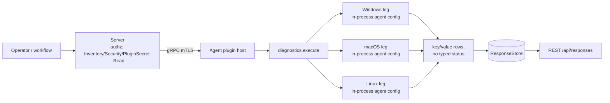

# diagnostics

<!-- BEGIN GENERATED: plugin-doc-gen header -->
| | |
|---|---|
| **What it does** | Agent diagnostics — log level, certificates, connection info |
| **Version** | 0.2.0 |
| **Kind** | Collector · read-only · on-demand (no scheduled gather) |
| **Platforms** | Windows ✅ · macOS ✅ · Linux ✅ |
| **Actions** | `log_level` (definition `device.diagnostics.log_level`) · `certificates` (`device.diagnostics.certificates`) · `connection_info` (`device.diagnostics.connection_info`) |
| **Security** | `log_level`: securable `Inventory` · operation Read · risk Low · dispatch ReadOnly · approval gate none — `certificates`: securable `Security` · operation Read · risk Medium · dispatch ReadOnly · approval gate none — `connection_info`: securable `PluginSecret` · operation Read · risk Medium · dispatch ReadOnly · approval gate none |
| **Roles** | `log_level` execute: endpoint-admin, endpoint-operator · `certificates`/`connection_info` execute: endpoint-admin · author (all three): content-author |
<!-- END GENERATED -->

## How it works

All three actions are pure reads against the agent's in-process config store (`yuzu_ctx_get_config`, wrapped by `PluginContext::get_config`); none of them makes an OS call, opens a socket, or spawns a process. `log_level` reads a single key, `agent.log_level`, defaulting to `"info"` when unset. `certificates` reads three configured paths (`tls.ca_cert`, `tls.client_cert`, `tls.client_key`) and stats each one with `std::filesystem::exists` — it reports path and existence only, never file contents. `connection_info` reads eight config keys covering server address, TLS-enabled flag, session ID, gRPC channel state, reconnect count, latency, and connection timestamps, and additionally computes `uptime_seconds` from `agent.start_time_epoch` at read time. Every config lookup that returns empty falls back to a fixed placeholder (`"info"`, `"(not configured)"`, `"(none)"`, `"unknown"`, `"0"`, `"false"`) rather than omitting the field.

The originating spec expected `diagnostics` to include a state-changing action; a full read of the shipped code found all three actions to be pure reports with no host, config, or filesystem write anywhere in the plugin, so every row is classified `ReadOnly`/`None` against the code as found, not the spec's expectation.



## OS capability

<!-- BEGIN GENERATED: plugin-doc-gen capability -->
| Action | Windows | macOS | Linux |
|---|---|---|---|
| `log_level` | ✅ supported · rung 1 · in-process agent config (`agent.log_level`) | ✅ supported · rung 1 · in-process agent config (`agent.log_level`) | ✅ supported · rung 1 · in-process agent config (`agent.log_level`) |
| `certificates` | ✅ supported · rung 1 · in-process agent config (`tls.*_cert`/`tls.client_key`) + `std::filesystem::exists` | ✅ supported · rung 1 · in-process agent config (`tls.*_cert`/`tls.client_key`) + `std::filesystem::exists` | ✅ supported · rung 1 · in-process agent config (`tls.*_cert`/`tls.client_key`) + `std::filesystem::exists` |
| `connection_info` | ✅ supported · rung 1 · in-process agent config (`agent.server_address`/`tls.enabled`/…) | ✅ supported · rung 1 · in-process agent config (`agent.server_address`/`tls.enabled`/…) | ✅ supported · rung 1 · in-process agent config (`agent.server_address`/`tls.enabled`/…) |

**Declared limits per leg** (the descriptor's fallback text, verbatim):

None declared — all nine legs report `nullptr` fallback text.
<!-- END GENERATED -->

## Privileges and prerequisites

| OS | Runs as | Extra grant needed | Measured | If the read is refused |
|---|---|---|---|---|
| Windows | agent service account (LocalSystem today, #1442) | None — no OS call; the config store is read in-process. | 2026-09-07, bare-metal, SYSTEM | n/a — an unset config key returns the plugin's fixed placeholder, not an error |
| macOS | agent daemon (root today per `docs/agent-privilege-model.md`) | None. | 2026-09-07, bare-metal, euid 501 (unprivileged — the capture ran outside the real daemon identity) | n/a — same placeholder fallback |
| Linux | agent daemon (`yuzu` user, unprivileged, per `docs/agent-privilege-model.md`) | None. | 2026-09-06, container, euid 0 | n/a — same placeholder fallback |

No external binaries, no subprocesses, no network access. The only filesystem touch is `certificates`' `std::filesystem::exists` stat of the three configured cert/key paths (`agents/plugins/diagnostics/src/diagnostics_plugin.cpp:144`); a stat failure is swallowed into `exists=false` via the discarded `std::error_code`, never surfaced as a distinct error.

## Data contract

### Inputs

<!-- BEGIN GENERATED: plugin-doc-gen inputs -->
`log_level` takes no parameters.
`certificates` takes no parameters.
`connection_info` takes no parameters.
<!-- END GENERATED -->

### Outputs

One `key|value` row per field via `write_output()` — not a fixed-width pipe schema like most plugins, but a variable-length sequence of labelled rows per call (`agents/plugins/diagnostics/src/diagnostics_plugin.cpp:10-12`). `certificates` additionally prefixes each row with the literal discriminator `cert`. There is no empty-result placeholder row: every action always emits its full fixed set of rows, substituting a fallback string (`"(not configured)"`, `"(none)"`, `"unknown"`, `"0"`, `"false"`, `"info"`) for any config key that is unset — `-` is never used as a placeholder in this plugin.

<!-- BEGIN GENERATED: plugin-doc-gen outputs -->
**`log_level` — `log_level|<value>`**

| Field | Type | Values | Available | Example |
|---|---|---|---|---|
| `log_level` | string | `trace` `debug` `info` `warn` `error` `critical` `off` (per the config store convention; not validated by the plugin) | windows, linux, darwin | `info` |

**`certificates` — `cert|<cert_type>|<path>|<exists>`**

| Field | Type | Values | Available | Example |
|---|---|---|---|---|
| `cert_type` | string | `ca_cert` `client_cert` `client_key` | windows, linux, darwin | `ca_cert` |
| `path` | string | free text (path) or `(not configured)` | windows, linux, darwin | `(not configured)` |
| `exists` | bool | `true` `false` | windows, linux, darwin | `false` |

**`connection_info` — `<key>|<value>` (8 rows, one per key)**

| Field | Type | Values | Available | Example |
|---|---|---|---|---|
| `server_address` | string | free text (`host:port`) or `(not configured)` | windows, linux, darwin | `(not configured)` |
| `tls_enabled` | bool | `true` `false` | windows, linux, darwin | `false` |
| `session_id` | string | free text (live session credential) or `(none)` | windows, linux, darwin | `(none)` |
| `grpc_channel_state` | string | free text (e.g. `READY`, `CONNECTING`, `TRANSIENT_FAILURE`) or `unknown` | windows, linux, darwin | `unknown` |
| `reconnect_count` | int32 | integer ≥ 0 | windows, linux, darwin | `0` |
| `latency_ms` | int32 | integer ≥ 0 | windows, linux, darwin | `0` |
| `uptime_seconds` | int64 | integer ≥ 0, computed from `start_time_epoch` at read time | windows, linux, darwin | `0` |
| `connected_since` | string | free text (epoch seconds) or `0` | windows, linux, darwin | `0` |
<!-- END GENERATED -->

### Result status

This plugin does not set a typed result status; the agent records `UNDECLARED` and every sample shows `UNDECLARED / UNKNOWN /`.

### Where the data goes

- **Instruction result only.** Rows travel over the agent's mTLS gRPC channel as the command response and land in the ResponseStore (90-day default retention, `server/core/src/response_store.hpp:153`), readable at `/api/responses/{id}`.
- **Not consumed by** daily-sync inventory, the TAR warehouse, DEX, or metrics — no server-side store or route reads `device.diagnostics.*` (grepped across `server/`); `server/core/src/agent_registry.cpp:922-925` only carries the action's one-line description for discovery/catalog display, not the result rows.
- **Siblings:** none in this plugin group — `agent_logging` is the closest neighbor (`get_key_files` reports TLS/key file paths under the same `Security` securable; `get_log`/`connection_info` both expose the live session credential under `PluginSecret`).
- **MCP / REST.** Discover: `discover_plugins` (summary) → `yuzu://plugin-docs` (this page as data) → `discover_instructions` / `get_definition("device.diagnostics.connection_info")`. Run: `execute_instruction {definition_id, parameters}`. Read: `/api/responses/{id}`.

## Sample output

<!-- BEGIN GENERATED: plugin-doc-gen samples -->
**Windows** — captured: windows Microsoft Windows NT 10.0.26200.0 x64 · bare-metal · 2026-09-07 · SYSTEM · leg-hash pending

```
== action=log_level
log_level|info
[result_status] UNDECLARED / UNKNOWN /

== action=certificates
cert|ca_cert|(not configured)|false
cert|client_cert|(not configured)|false
cert|client_key|(not configured)|false
[result_status] UNDECLARED / UNKNOWN /

== action=connection_info
server_address|(not configured)
tls_enabled|false
session_id|(none)
grpc_channel_state|unknown
reconnect_count|0
latency_ms|0
uptime_seconds|0
connected_since|0
[result_status] UNDECLARED / UNKNOWN /
```

**macOS** — captured: macos macOS 26.6.2 arm64 · bare-metal · 2026-09-07 · euid 501 (alex) · leg-hash pending

```
== action=log_level
log_level|info
[result_status] UNDECLARED / UNKNOWN /

== action=certificates
cert|ca_cert|(not configured)|false
cert|client_cert|(not configured)|false
cert|client_key|(not configured)|false
[result_status] UNDECLARED / UNKNOWN /

== action=connection_info
server_address|(not configured)
tls_enabled|false
session_id|(none)
grpc_channel_state|unknown
reconnect_count|0
latency_ms|0
uptime_seconds|0
connected_since|0
[result_status] UNDECLARED / UNKNOWN /
```

**Linux** — captured: linux Debian GNU/Linux 13 (trixie) aarch64 · container · 2026-09-06 · euid 0 · leg-hash pending

```
== action=log_level
log_level|info
[result_status] UNDECLARED / UNKNOWN /

== action=certificates
cert|ca_cert|(not configured)|false
cert|client_cert|(not configured)|false
cert|client_key|(not configured)|false
[result_status] UNDECLARED / UNKNOWN /

== action=connection_info
server_address|(not configured)
tls_enabled|false
session_id|(none)
grpc_channel_state|unknown
reconnect_count|0
latency_ms|0
uptime_seconds|0
connected_since|0
[result_status] UNDECLARED / UNKNOWN /
```
<!-- END GENERATED -->

## Caveats and known gaps

1. **All three captures are identical across every OS because none reflects a configured agent.** The capture driver loads the plugin via `PluginHandle::load` + `LocalDispatcher::run` without calling `init()` (per the capture methodology), so `g_ctx` stays `nullptr` for the whole run; `yuzu_ctx_get_config(nullptr, key)` returns `nullptr` unconditionally (`agents/core/src/agent.cpp:559-560`), and every field falls back to its hardcoded default. A real agent with a populated config store would show real values, not this placeholder set.
2. **No typed result status.** The plugin never calls `set_result_status`; every capture reads `UNDECLARED / UNKNOWN /` regardless of platform or outcome. There is no way to distinguish "config genuinely unset" from "no host config was reachable" from the status field alone.
3. **`certificates`' filesystem stat swallows its own error code.** `std::filesystem::exists(path_str, ec)` takes an `std::error_code` output parameter but the plugin never inspects it (`agents/plugins/diagnostics/src/diagnostics_plugin.cpp:144`), so a permission-denied stat and a genuinely-missing file both read as `exists=false`.
4. **`connection_info.session_id` carries the live agent session credential.** This is why the action is classified under the `PluginSecret` securable rather than `Inventory` (`server/core/src/capability_decls/plugin_action_catalogue_b.hpp:685-687`); do not relax its securable to match the other two actions.
5. **`log_level` is not validated against the spdlog enum.** The plugin returns whatever string sits at `agent.log_level` verbatim (or `"info"` if unset) — a misconfigured value would pass through unchanged rather than being rejected or normalized.

## Source and tests

<!-- BEGIN GENERATED: plugin-doc-gen source -->
- Plugin: `agents/plugins/diagnostics/src/diagnostics_plugin.cpp` · `agents/plugins/diagnostics/meson.build`
- Definitions: `content/definitions/diagnostics.yaml`
- Capability rows: `server/core/src/capability_decls/plugin_action_catalogue_b.hpp:656-698`
- Tests: no dedicated test file — `diagnostics` is not referenced in `tests/unit/test_new_plugins.cpp` or elsewhere under `tests/unit/`
- Privilege row: no row in `docs/agent-privilege-model.md` (general per-platform account rows apply)
- Changelog: `changelog.d/2204-declarations-group-b.added.md`
<!-- END GENERATED -->
