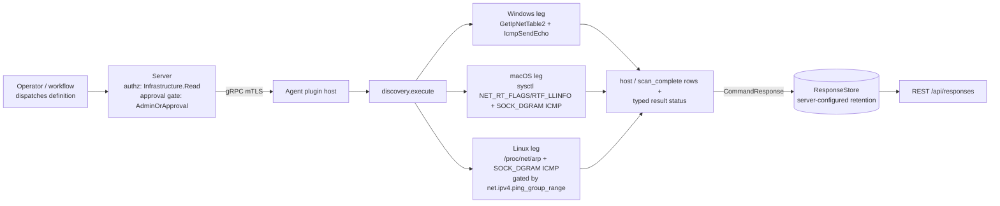

# discovery

<!-- BEGIN GENERATED: plugin-doc-gen header -->
| | |
|---|---|
| **What it does** | Network device discovery — ARP scan and ping sweep |
| **Version** | 0.1.0 |
| **Kind** | Collector · read-only · on-demand (gather TTL 600s) |
| **Platforms** | Windows ✅ · macOS ✅ · Linux 🟡 constrained |
| **Actions** | `scan_subnet` (definition `device.discovery.scan_subnet`) |
| **Security** | securable `Infrastructure` · operation Read · risk Low · dispatch ReadOnly · approval gate AdminOrApproval |
| **Roles** | execute: endpoint-admin · author: content-author |
<!-- END GENERATED -->

## How it works

`scan_subnet` combines two reads: the OS ARP/neighbour table (hosts the kernel already knows about) and an ICMP ping sweep of every host address in the requested subnet (hosts that answer but aren't yet cached). The ARP table is read twice — once before the sweep, once after — so hosts that only just replied to a probe still get a MAC address in the output. Input is validated as a CIDR block first (digits/dots/slash only), then parsed into octets and a prefix length; only /24 through /30 is accepted, a wider prefix is refused rather than scanned to bound the sweep to 254 hosts.

Every degrade condition the scan can hit — an ARP read that failed or was truncated, an ICMP socket denied or unavailable, probes that could not transmit, the scan's own 300-second deadline, or throttled reverse-DNS lookups — is accumulated by severity across the whole run and applied to the typed result status exactly once at the end, so an earlier and more specific reason is never silently overwritten by a later, less specific one. The plugin deliberately never reports an empty network as a clean success when a read simply didn't happen: a degraded read yields real ARP-table hosts with a `CONSTRAINED`/`UNAVAILABLE` status, not a fabricated empty result.

It is deliberately not a subprocess wrapper: Wave 2 removed the last `popen()`/`ping` spawn, so every leg is a native, in-process API call.



## OS capability

<!-- BEGIN GENERATED: plugin-doc-gen capability -->
| Action | Windows | macOS | Linux |
|---|---|---|---|
| `scan_subnet` | ✅ supported · rung 1 · `GetIpNetTable2` + `IcmpSendEcho` | ✅ supported · rung 1 · sysctl `NET_RT_FLAGS`/`RTF_LLINFO` + `SOCK_DGRAM` ICMP | 🟡 constrained · rung 1 · `/proc/net/arp` + unprivileged `SOCK_DGRAM` ICMP |

**Declared limits per leg** (the descriptor's fallback text, verbatim):

- **`scan_subnet` / Linux** — the ICMP sweep needs `net.ipv4.ping_group_range` to admit the agent's gid; ARP-only results with a CONSTRAINED/PARTIAL status otherwise, or UNAVAILABLE/PARTIAL when the ICMP socket cannot be created at all. netlink `RTM_GETNEIGH` is a recorded future promotion over `/proc/net/arp`.
<!-- END GENERATED -->

## Privileges and prerequisites

| OS | Runs as | Extra grant needed | Measured | If the read is refused |
|---|---|---|---|---|
| Windows | agent service account (captured as `SYSTEM`; no dedicated row in `docs/agent-privilege-model.md` for this plugin) | **None.** `GetIpNetTable2` and `IcmpSendEcho` (linked via `iphlpapi`/`ws2_32`) need no elevated handle open. | 2026-09-07, bare-metal, Windows 10.0.26200.0, `SYSTEM` | ARP failure → `UNAVAILABLE`/`PARTIAL` `arp:read_failed`; ICMP session unavailable → `UNAVAILABLE`/`PARTIAL` `icmp:socket_error` |
| macOS | agent daemon (captured unprivileged, euid 501) | **None.** The routing-socket sysctl read and an unprivileged `SOCK_DGRAM` ICMP socket need no elevated privilege. | 2026-09-07, bare-metal, macOS 26.6.2, euid 501 (alex) | ARP failure → `UNAVAILABLE`/`PARTIAL` `arp:read_failed`; ICMP session unavailable → `UNAVAILABLE`/`PARTIAL` `icmp:socket_error` |
| Linux | agent daemon (captured as euid 0 in a container; production identity not pinned by a row in `docs/agent-privilege-model.md`) | `net.ipv4.ping_group_range` must admit the agent's gid for the unprivileged ICMP socket, or the sweep falls back to ARP-only. | 2026-09-07, Debian GNU/Linux 13 (trixie) aarch64, container, euid 0 | ICMP denied → `CONSTRAINED`/`PARTIAL` `icmp:ping_group_range`; ICMP unavailable for any other reason → `UNAVAILABLE`/`PARTIAL` `icmp:socket_error`; `/proc/net/arp` unreadable → `UNAVAILABLE`/`PARTIAL` `arp:read_failed` |

No external binaries or subprocesses on any leg (the last `popen()`/`ping` spawn was removed in Wave 2). Network: yes — sends ICMP echo probes to every host address in the requested subnet, plus a reverse-DNS (PTR) query for each host found alive.

## Data contract

### Inputs

<!-- BEGIN GENERATED: plugin-doc-gen inputs -->
| Action | Parameter | Type | Required | Default | Description |
|---|---|---|---|---|---|
| `scan_subnet` | `subnet` | string | yes | — | Target subnet in CIDR notation (e.g., `192.168.1.0/24`). Only `/24` through `/30` is accepted — a wider or narrower prefix is refused rather than scanned. IPv4 only. |
| `scan_subnet` | `timeout_ms` | int32 | no | `1000` | Per-host ICMP probe timeout in milliseconds, validated to 100-10000. The effective per-host budget is separately clamped to 100-300ms regardless of the requested value. Not the overall scan deadline, which is a fixed 300 seconds. |
<!-- END GENERATED -->

### Outputs

The plugin writes four distinct pipe-delimited line shapes, only two of which are structured data: a `host` row per discovered host, and one `scan_complete` summary row per run. `status|` (error/warning) and `progress|` lines are free text used for operator-facing progress and degrade warnings; they are not represented in the definition's `result.columns` schema at all. A run that fails input validation emits only a `status|error|...` line and no `host`/`scan_complete` rows (not the case in any of the current captures, which all completed a real sweep).

<!-- BEGIN GENERATED: plugin-doc-gen outputs -->
**`scan_subnet` — `host|ip_address|mac_address|hostname|managed`**

| Field | Type | Values | Available | Example |
|---|---|---|---|---|
| `host` | string | literal `host` | W, M, L | `host` |
| `ip_address` | string | dotted-quad IPv4 | W, M, L | `127.0.0.1` |
| `mac_address` | string | colon-hex MAC48, or `unknown` | W, M, L | `unknown` |
| `hostname` | string | free text (PTR hostname), or `unknown` | W, M, L | `localhost` |
| `managed` | string | always `unknown` | W, M, L | `unknown` |

**`scan_subnet` — `scan_complete|found|total`**

| Field | Type | Values | Available | Example |
|---|---|---|---|---|
| `scan_complete` | string | literal `scan_complete`; the same line also carries `found` and `total` host counts as two further fields not enumerated as columns | W, M, L | `scan_complete` |
<!-- END GENERATED -->

### Result status

| Status | Completeness | Provenance | When |
|---|---|---|---|
| `OK` (derived from `UNDECLARED`) | — | — | a clean scan hit none of the conditions below |
| `CONSTRAINED` | `PARTIAL` | `icmp:ping_group_range` | Linux ICMP socket denied for a permissions reason — ARP-table hosts only |
| `UNAVAILABLE` | `PARTIAL` | `icmp:socket_error` | ICMP socket construction failed for a non-permissions reason — ARP-table hosts only |
| `CONSTRAINED` | `PARTIAL` | `icmp:transmit_blocked` | every ICMP probe was constructed but could not transmit |
| `UNAVAILABLE` | `PARTIAL` | `arp:read_failed` | the ARP/neighbour table read failed outright |
| `CONSTRAINED` | `PARTIAL` | `arp:table_truncated` | the ARP/neighbour table was only partially decodable |
| `CONSTRAINED` | `PARTIAL` | `scan:timeout` | the scan hit its 300-second deadline; wins ties against `arp:table_truncated`/`dns:hostname_lookup_degraded` |
| `CONSTRAINED` | `PARTIAL` | `dns:hostname_lookup_degraded` | one or more reverse-DNS lookups timed out or were throttled |

Multiple conditions can fire in one run; they are accumulated by severity (`UNAVAILABLE` > `CONSTRAINED`/`PERMISSION_DENIED` > none) and the worst one is applied to the result status exactly once, at the end of the run. Every condition still writes its own `status|warning` line regardless of which one wins the merge. `set_result_status` is called only inside `if (worst_degrade.has_report)` — a clean run that hits none of the conditions above never calls it at all, so even a fully successful scan reports `UNDECLARED`/`UNKNOWN` rather than an explicit `OK`. All three current samples are exactly this case: a real `127.0.0.0/30` sweep with no ARP/ICMP/timeout degrade, so every leg shows `UNDECLARED / UNKNOWN /`.

### Where the data goes

- **Instruction result.** Rows travel over the agent's mTLS gRPC channel as the command response and land in the ResponseStore (server-configured retention via `response_retention_days`, 90-day default), queryable at `/api/responses/{id}`.
- **Not automatically forwarded to `DiscoveryStore`.** `POST /api/discovery/scan` is a separate REST ingestion surface that upserts device rows (by `ip_address`) into the Postgres-backed `discovery_store` behind `GET /api/discovery/results` and the managed/unmanaged correlation it drives — but nothing in this plugin or the agent daemon calls that endpoint. Today the two are unwired: an operator or external automation must parse this action's rows and POST them to `/api/discovery/scan` separately for a scan to update the managed-device table.
- **Not consumed by** daily-sync inventory, the TAR warehouse, or DEX. Nothing runs on a schedule beyond the definition's 600-second gather TTL, which caches a repeat dispatch rather than re-triggering a background collection.
- **Siblings:** none — `scan_subnet` is this plugin's only action and only definition.
- **MCP / REST.** Discover: `discover_plugins` (summary) → `yuzu://plugin-docs` (this page as data) → `discover_instructions` / `get_definition("device.discovery.scan_subnet")`. Run: `execute_instruction {definition_id, parameters}`. Read: `/api/responses/{id}`.

## Sample output

<!-- BEGIN GENERATED: plugin-doc-gen samples -->
**Windows** — captured: windows Microsoft Windows NT 10.0.26200.0 x64 · bare-metal · 2026-09-07 · SYSTEM · leg-hash pending

```
== action=scan_subnet subnet=127.0.0.0/30
host|127.0.0.1|unknown|kubernetes.docker.internal|unknown
host|127.0.0.2|unknown|unknown|unknown
scan_complete|2|2
[result_status] UNDECLARED / UNKNOWN / 
```

**macOS** — captured: macos macOS 26.6.2 arm64 · bare-metal · 2026-09-07 · euid 501 (alex) · leg-hash pending

```
== action=scan_subnet subnet=127.0.0.0/30
host|127.0.0.1|unknown|localhost|unknown
scan_complete|1|2
[result_status] UNDECLARED / UNKNOWN / 
```

**Linux** — captured: linux Debian GNU/Linux 13 (trixie) aarch64 · container · 2026-09-07 · euid 0 · leg-hash pending

```
== action=scan_subnet subnet=127.0.0.0/30
host|127.0.0.1|unknown|localhost|unknown
host|127.0.0.2|unknown|unknown|unknown
scan_complete|2|2
[result_status] UNDECLARED / UNKNOWN / 
```
<!-- END GENERATED -->

## Caveats and known gaps

1. **A clean scan reports `UNDECLARED`, not `OK`.** All three legs completed a real `127.0.0.0/30` loopback sweep with no ARP/ICMP/timeout degrade, so `set_result_status` — which fires only inside `if (worst_degrade.has_report)` — is never called. The agent records `UNDECLARED`/`UNKNOWN` for what is otherwise a fully successful scan; this is not an error, but it means a machine consumer cannot distinguish "clean scan" from "no status was ever set" by result status alone. Also visible in the same captures: `127.0.0.1` resolved a hostname (`localhost` on macOS/Linux, `kubernetes.docker.internal` on Windows) while `127.0.0.2` did not (`unknown`) and, on macOS, was not found alive at all (`scan_complete|1|2` vs `2|2` on Linux/Windows) — loopback interface behaviour differs per OS, and `mac_address` is `unknown` on every leg because a loopback address has no ARP/neighbour-table entry.
2. **`scan_subnet`'s results are not wired into `DiscoveryStore`.** `POST /api/discovery/scan` is the only path that populates the managed/unmanaged device table, and nothing in this plugin or the agent daemon calls it — the instruction result is the only place a scan's rows land today.
3. **Linux ICMP is permission-gated.** An unprivileged `SOCK_DGRAM` ICMP socket needs `net.ipv4.ping_group_range` to admit the agent's gid; without it the scan falls back to ARP-only hosts with `CONSTRAINED`/`PARTIAL` `icmp:ping_group_range` rather than reporting a clean, smaller network.
4. **The definition's `result.columns` names one row shape but the plugin emits four.** Only `host` (5 pipe-fields) and `scan_complete` (3 pipe-fields, of which `found`/`total` are not separate columns) rows are structured; `status|` and `progress|` lines are free text and not represented in the schema.
5. **Was rung 3 (subprocess), now rung 1 (native).** The plugin previously shelled out via `popen()`/`ping` per host (declared rung 3 alongside `firewall`/`quarantine`/`network_actions`); Wave 2 replaced every leg with a native, in-process API and a single shared ICMP session per scan. Do not reintroduce a per-host process spawn.

## Source and tests

<!-- BEGIN GENERATED: plugin-doc-gen source -->
- Plugin: `agents/plugins/discovery/src/discovery_plugin.cpp` (descriptor + all three legs) · `discovery_scan_plan.hpp` (pure degrade/severity/bounds decisions) · `discovery_parsers.hpp` (ARP text parsing, MAC formatting, Windows row-state predicate)
- Definitions: `content/definitions/discovery.yaml`
- Capability rows: `server/core/src/capability_decls/plugin_action_catalogue_c.hpp`
- Tests: `tests/unit/test_discovery_scan_plan.cpp` (pure degrade/bounds logic, all legs) · `tests/unit/test_discovery_parsers.cpp` (ARP parsing/formatting, all legs) · `tests/unit/server/test_discovery_store.cpp` and `tests/unit/server/test_discovery_scan_route.cpp` (the separate `DiscoveryStore`/`POST /api/discovery/scan` ingestion surface this plugin does not call — see Caveat 2)
- Privilege row: no row in `docs/agent-privilege-model.md`
- Changelog: `changelog.d/20260817-wave2-discovery-native-arp-icmp.changed.md` · `changelog.d/2204-declarations-group-c.added.md` · `changelog.d/3064-discovery-scan-honest-failure.changed.md` · `changelog.d/3064-discovery-store-postgres.changed.md` · `changelog.d/3253-discovery-degrade-tie-break.fixed.md`
<!-- END GENERATED -->
