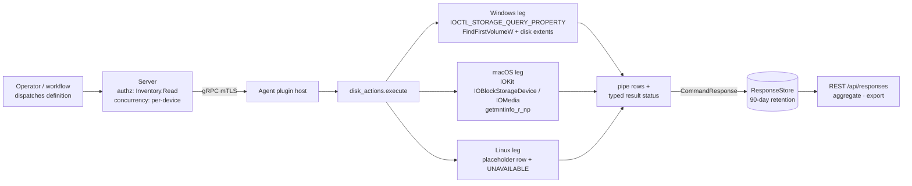

# disk_actions

<!-- BEGIN GENERATED: plugin-doc-gen header -->
| | |
|---|---|
| **What it does** | Reports physical drive health and the mapping between drives and the logical volumes they back |
| **Version** | 1.0.0 |
| **Kind** | Collector · read-only · on-demand |
| **Platforms** | Windows ✅ · macOS 🟡 constrained · Linux ⛔ unsupported |
| **Actions** | `smart` (definition `crossplatform.storage.smart`) · `volumes` (definition `crossplatform.storage.volumes`) |
| **Security** | securable `Inventory` · operation Read · risk Low · dispatch ReadOnly · approval gate None |
| **Roles** | execute: endpoint-admin, endpoint-operator · author: content-author |
<!-- END GENERATED -->

## How it works

Both actions are reads. `smart` enumerates the physical drives the OS knows about and asks each for identity (model, transport, SSD or HDD). On Windows, NVMe drives additionally answer with SMART log page 0x02, which the plugin decodes into a wear percentage, available spare and a health verdict. `volumes` enumerates logical volumes and resolves two things for each: the physical drive that backs it and the mount points it serves.

`volumes` is deliberately not a third volume inventory. `hardware.disks` already lists physical devices and `filesystem_posture.mounts` already lists mounts. This action carries only the join between them, which is what lets a failing-drive alert name the drive letters or mount points it affects.

Every mechanism was bound by a spike against real hardware before the leg was written. Where a mechanism could not be bound (Linux) or is only reachable through a private OS interface (macOS health), the leg says so in its result rather than guessing.



## OS capability

<!-- BEGIN GENERATED: plugin-doc-gen capability -->
| Action | Windows | macOS | Linux |
|---|---|---|---|
| `smart` | ✅ supported · rung 1 · IOCTL_STORAGE_QUERY_PROPERTY (StorageDeviceProperty + StorageDeviceSeekPenaltyProperty + StorageDeviceProtocolSpecificProperty, NVMe log page 0x02) | 🟡 constrained · rung 1 · IOKit IOBlockStorageDevice device characteristics | ⛔ unsupported |
| `volumes` | 🟡 constrained · rung 1 · FindFirstVolumeW + IOCTL_VOLUME_GET_VOLUME_DISK_EXTENTS + GetVolumePathNamesForVolumeNameW | 🟡 constrained · rung 1 · IOKit IOMedia provider walk + getmntinfo_r_np(3) MNT_NOWAIT | ⛔ unsupported |

**Declared limits per leg** (descriptor fallback text, verbatim):

- **`smart` / Windows** — the device handle is opened with zero access rights, which an unprivileged service account may do; wear and spare figures come from the NVMe SMART/Health log and are therefore reported only for NVMe devices, with SATA and USB drives reporting identity and media type but 'unknown' health
- **`smart` / macOS** — reports device identity (model, medium type) and whether the device advertises NVMe SMART, but NOT the health attributes themselves: wear, available spare and the critical-warning flag are reachable only through Apple's private IONVMeSMARTUserClient selector interface, which is undocumented and version-fragile, so health reports 'unknown' on this platform rather than a guess
- **`smart` / Linux** — not implemented in this change: no mechanism could be bound, because every Linux host available for the spike exposed virtualised disks only (WSL2 reports four 'Virtual Disk' SCSI nodes and no /dev/nvme* character devices), and shipping an NVME_IOCTL_ADMIN_CMD path written from documentation but never exercised is exactly how a dead leg reaches production. Binding it needs a Linux host with real storage, or a VM with disk passthrough; neither was reachable when this shipped
- **`volumes` / Windows** — maps volumes to the physical drives backing them; a volume spanning several drives (a spanned or striped dynamic volume) reports every drive it touches, and a volume with no assigned drive letter or mount point reports '-' for mount points rather than being omitted
- **`volumes` / macOS** — one row per IOMedia object, keyed on that object's BSD name, carrying the physical whole disk that backs it and any mount points it serves; the physical disk is resolved by walking the IOKit provider chain, so a volume inside a synthesized APFS container correctly reports the underlying drive rather than the container; a media object that maps nothing -- a whole disk serving no mount point -- is omitted, because this action carries only the physical-to-logical join and such a row has no join to carry
- **`volumes` / Linux** — not implemented in this change: the physical-to-logical join is only meaningful alongside a bound smart leg, and the Linux smart leg is deferred with it
<!-- END GENERATED -->

## Privileges and prerequisites

| OS | Runs as | Extra grant needed | Measured | If the read is refused |
|---|---|---|---|---|
| Windows | agent service account (LocalSystem today, #1442) | None. Device and volume handles are opened with zero access rights, not `GENERIC_READ`; both IOCTLs are `FILE_ANY_ACCESS`. Keeps working after #1442 moves the agent off LocalSystem. | 2026-09-03 on the-rig as `NT AUTHORITY\LOCAL SERVICE` | result status `PERMISSION_DENIED`, provenance names the device |
| macOS | agent daemon, unprivileged | None. IOKit property reads only; no user client is opened. | 2026-09-03 and 2026-09-06 at euid 501 | result status `PERMISSION_DENIED` |
| Linux | n/a | n/a, leg not implemented | — | always `UNAVAILABLE` |

No external binaries, no subprocesses, no network access. Do not "fix" the Windows open to `GENERIC_READ`; that is the change that breaks the leg under an unprivileged account.

## Data contract

### Inputs

<!-- BEGIN GENERATED: plugin-doc-gen inputs -->
Neither action takes parameters.
<!-- END GENERATED -->

### Outputs

Pipe-delimited rows, one per drive or volume. Field 0 is a literal discriminator (`smart` or `volume`) that precedes the columns below; every row of a kind has the same field count, with `-` where a value is inapplicable or was not read. `-` never means zero. A leg that finds nothing still emits one placeholder row so zero rows can never be misread as "no disks": a `smart` placeholder carries `health=unsupported`, a `volume` placeholder carries `volume=-`, and both are accompanied by a typed status, which is the authoritative signal.

<!-- BEGIN GENERATED: plugin-doc-gen outputs -->
**`crossplatform.storage.smart` — `device|model|bus|media|health|pct_used|spare_pct|detail`**

| Field | Type | Values | Available | Example | Description |
|---|---|---|---|---|---|
| `device` | string | - | Windows, macOS | `PhysicalDrive0` | OS device name of the physical drive |
| `model` | string | - | Windows, macOS | `Samsung SSD 970 EVO Plus 1TB` | Drive model string as reported by the OS, escaped |
| `bus` | string | `nvme` `sata` `usb` `sas` `virtual` `unknown` | Windows, macOS | `nvme` | Transport, a closed vocabulary |
| `media` | string | `ssd` `hdd` `unknown` | Windows, macOS | `ssd` | Media type, a closed vocabulary |
| `health` | string | `ok` `warning` `failing` `unknown` `unsupported` | Windows | `ok` | Health verdict. unknown means the device did not say; unsupported means this OS leg cannot ask. Windows reports a verdict for NVMe drives only; macOS always reports unknown; Linux always unsupported. |
| `pct_used` | string | - | Windows | `5` | NVMe "Percentage Used" (0-255 by specification, never clamped), or "-" when not read. |
| `spare_pct` | string | - | Windows | `100` | NVMe "Available Spare" (0-100), or "-" when not read. |
| `detail` | string | - | all | `-` | Free text, or "-". |

**`crossplatform.storage.volumes` — `volume|mount_points|device|fstype|total_bytes|detail`**

| Field | Type | Values | Available | Example | Description |
|---|---|---|---|---|---|
| `volume` | string | - | Windows, macOS | `disk3s1s1` | Volume GUID path (Windows) or BSD name (macOS); "-" only on the empty-result placeholder row. |
| `mount_points` | string | - | Windows, macOS | `/System/Volumes/Data` | Comma-separated mount points or drive letters, or "-" when the volume serves none. |
| `device` | string | - | Windows, macOS | `disk0` | Backing physical drive; several, comma-separated, on a spanned volume. |
| `fstype` | string | - | Windows, macOS | `apfs` | Filesystem of the volume (NTFS, FAT32, apfs, ...), or "-" when unmounted or unknown. |
| `total_bytes` | int64 | - | Windows, macOS | `494384795648` | Raw media capacity (sum of disk extents on Windows, IOMedia size on macOS), not filesystem capacity. Not comparable with crossplatform.storage.mounts.total_bytes. |
| `detail` | string | - | all | `-` | Free text, or "-". |
<!-- END GENERATED -->

### Result status

Surfaced as `plugin_result_status` on the command response.

| Status | Completeness | Provenance | When |
|---|---|---|---|
| `OK` (derived from `UNDECLARED`) | — | — | clean read: `volumes` on Windows and macOS, `smart` on Windows |
| `CONSTRAINED` | partial | `macos:iokit:health_unread` | every macOS `smart` run: identity read, health not |
| `UNAVAILABLE` | partial | `linux:smart` · `linux:volumes` | Linux, always |
| `PERMISSION_DENIED` | partial | device or volume name | a handle open was refused; outranks every other degradation |

### Where the data goes

- **Instruction result only.** Rows travel over the agent's mTLS gRPC channel as the command response, land in the ResponseStore (90-day default retention), and are queryable at `/api/responses/{id}`, aggregatable (`smart` by `health`, `volumes` by `device`) and exportable to ClickHouse or Splunk.
- **Not consumed by** daily-sync inventory, the TAR warehouse, DEX, or metrics. Nothing runs on a schedule.
- **MCP / REST.** Discover: `discover_plugins` (summary) → `yuzu://plugin-docs` (this page as data) → `discover_instructions` / `get_definition("crossplatform.storage.smart")`. Run: `execute_instruction {definition_id, parameters}`. Read: `/api/responses/{id}`.
- **Siblings:** `device.hardware.disks` (physical inventory), `crossplatform.storage.mounts` (logical mounts, true filesystem capacity), `crossplatform.storage.free`.

## Sample output

<!-- BEGIN GENERATED: plugin-doc-gen samples -->
**Windows** — captured: windows Windows 11 Pro 10.0.26200 · bare-metal · 2026-09-06 · Administrator (elevated SSH session) · leg-hash f062fb9a3dfd

```
== action=smart
smart|PhysicalDrive0|Samsung SSD 970 EVO Plus 250GB|nvme|ssd|ok|5|100|-
smart|PhysicalDrive1|Samsung SSD 970 EVO Plus 1TB|nvme|ssd|ok|1|100|-
[result_status] UNDECLARED / UNKNOWN

== action=volumes
volume|//?/Volume{0a35801e-3f40-4114-a073-3d7ea1dd7664}/|-|PhysicalDrive0|NTFS|524288000|-
volume|//?/Volume{c9a5f911-4689-41b2-b774-5b0e25b60e10}/|C:/|PhysicalDrive0|NTFS|248158093312|-
volume|//?/Volume{daa59534-884a-4ce4-8fc8-4244f7bbe7ae}/|-|PhysicalDrive0|NTFS|967835648|-
volume|//?/Volume{785383ef-b682-41d9-9b28-27c4b8882d65}/|D:/|PhysicalDrive1|NTFS|1000187363328|-
volume|//?/Volume{b188886e-39bb-4915-a893-d61a3ca3c707}/|-|PhysicalDrive0|FAT32|272629760|-
[result_status] UNDECLARED / UNKNOWN
```

**macOS** — captured: macos 26.5.1 · bare-metal · 2026-09-06 · euid 501 · leg-hash f062fb9a3dfd

```
== action=smart
smart|disk0|APPLE SSD AP0512Z|nvme|ssd|unknown|-|-|device advertises SMART; health attributes are not read on macOS (they require Apple's private IONVMeSMARTUserClient interface)
smart|disk4|Disk Image|virtual|unknown|unknown|-|-|device does not advertise SMART capability
[result_status] CONSTRAINED / PARTIAL / macos:iokit:health_unread

== action=volumes
volume|disk0s1|-|disk0|-|524288000|-
volume|disk0s2|-|disk0|-|494384795648|-
volume|disk0s3|-|disk0|-|5368664064|-
volume|disk1|-|disk0|-|524288000|-
volume|disk3|-|disk0|-|494384795648|-
volume|disk2|-|disk0|-|5368664064|-
volume|disk1s1|/System/Volumes/iSCPreboot|disk0|apfs|524288000|-
volume|disk1s3|/System/Volumes/Hardware|disk0|apfs|524288000|-
volume|disk1s4|-|disk0|-|524288000|-
volume|disk1s2|/System/Volumes/xarts|disk0|apfs|524288000|-
volume|disk2s1|-|disk0|-|5368664064|-
volume|disk2s2|-|disk0|-|5368664064|-
… 12 of 19 rows shown
[result_status] UNDECLARED / UNKNOWN
```

**Linux** — captured: linux Debian GNU/Linux 13 (trixie) aarch64 · container · 2026-09-06 · euid 0 · leg-hash f062fb9a3dfd

```
== action=smart
smart|-|-|unknown|unknown|unsupported|-|-|drive health is not implemented on Linux in this release; no mechanism was bound against real hardware
[result_status] UNAVAILABLE / PARTIAL / linux:smart

== action=volumes
volume|-|-|-|-|-|physical-to-logical volume mapping is not implemented on Linux in this release; it ships with the smart leg it exists to support
[result_status] UNAVAILABLE / PARTIAL / linux:volumes
```
<!-- END GENERATED -->

## Caveats and known gaps

1. **Health is NVMe-only on Windows.** SATA and USB drives report identity and media with `health=unknown`. `IOCTL_STORAGE_PREDICT_FAILURE` is deliberately not used as a fallback: it fails with `ERROR_INVALID_FUNCTION` on NVMe.
2. **macOS health is always `unknown`.** The attributes sit behind Apple's private `IONVMeSMARTUserClient`; ruled out as the same class of dependency as the dead `FSCTL_SRV_ENUMERATE_SNAPSHOTS` in `filesystem_posture`.
3. **Linux is declared, not implemented.** A future leg should bind `NVME_IOCTL_ADMIN_CMD` get-log-page (the Windows decoder is shareable), measure whether `SG_IO` ATA pass-through works without `CAP_SYS_RAWIO`, and take the cheap join from `/sys/block` plus `/proc/self/mountinfo`.
4. **No deadline on Windows device I/O.** `DeviceIoControl` is synchronous with no timeout; a wedged device parks the dispatch worker. Bounded only by `kMaxPhysicalDrives` and `ThreadErrorModeGuard`.
5. **`total_bytes` is media capacity.** On macOS every APFS volume in a container reports the container's size, and unmounted members and containers appear with `-` mount points. Use `crossplatform.storage.mounts` for real capacity.

## Source and tests

<!-- BEGIN GENERATED: plugin-doc-gen source -->
- Plugin: `agents/plugins/disk_actions/src/disk_actions_legs.hpp` · `agents/plugins/disk_actions/src/disk_actions_linux.cpp` · `agents/plugins/disk_actions/src/disk_actions_macos.cpp` · `agents/plugins/disk_actions/src/disk_actions_parsers.hpp` · `agents/plugins/disk_actions/src/disk_actions_plugin.cpp` · `agents/plugins/disk_actions/src/disk_actions_win.cpp`
- Definitions: `content/definitions/disk_actions.yaml`
- Capability rows: `server/core/src/capability_decls/plugin_action_catalogue_disk_actions.hpp`
- Tests: `tests/unit/test_disk_actions_local_dispatcher.cpp`
- Privilege row: `docs/agent-privilege-model.md`
<!-- END GENERATED -->
