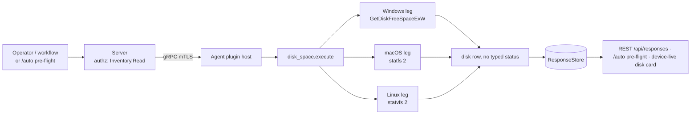

# disk_space

<!-- BEGIN GENERATED: plugin-doc-gen header -->
| | |
|---|---|
| **What it does** | Reports free / total disk space for a single volume |
| **Version** | 1.0.0 |
| **Kind** | Collector · read-only · gathered (crossplatform.storage.free) |
| **Platforms** | Windows ✅ · macOS ✅ · Linux ✅ |
| **Actions** | `free` (definition `crossplatform.storage.free`) |
| **Security** | securable `Inventory` · operation Read · risk Low · dispatch ReadOnly · approval gate None |
| **Roles** | execute: endpoint-admin, endpoint-operator · author: content-author |
<!-- END GENERATED -->

## How it works

`free` is the plugin's only action: it stats one volume and reports total bytes, caller-usable free bytes, and percent used. The volume is selected by the optional `path` parameter (default `C:\` on Windows, `/` on POSIX); the plugin never enumerates volumes itself, so a caller wanting every volume on a host must call it once per path. `free_bytes` is deliberately the quota-aware, caller-visible figure — `FreeBytesAvailableToCaller` on Windows, `f_bavail` on POSIX — not the raw free-block count, because the plugin exists to answer "does this installer have headroom," which is a per-caller question. Thresholds (how much free space is enough) are not the plugin's concern; they live with the caller, matching `os_info`'s convention. The whole action is one synchronous stat call — no subprocess, no retry, no caching inside the plugin.



## OS capability

<!-- BEGIN GENERATED: plugin-doc-gen capability -->
| Action | Windows | macOS | Linux |
|---|---|---|---|
| `free` | ✅ supported · rung 1 · GetDiskFreeSpaceExW | ✅ supported · rung 1 · statfs(2) | ✅ supported · rung 1 · statvfs(2) |
<!-- END GENERATED -->

## Privileges and prerequisites

| OS | Runs as | Extra grant needed | Measured | If the read is refused |
|---|---|---|---|---|
| Windows | agent service account (LocalSystem today, #1442) | None. `GetDiskFreeSpaceExW` needs no elevated access. | 2026-09-07, bare-metal, SYSTEM | `error\|failed to query disk space for path: <path>`, non-zero return |
| macOS | agent daemon (root today per `docs/agent-privilege-model.md`) | None. `statfs(2)` on an accessible path needs no privilege. | 2026-09-07, bare-metal, euid 501 (unprivileged — the capture ran outside the real daemon identity) | `error\|failed to stat path: <path>`, non-zero return |
| Linux | agent daemon (`yuzu` user, unprivileged, per `docs/agent-privilege-model.md`) | None. `statvfs(2)` needs no privilege. | 2026-09-06, container, euid 0 | `error\|failed to stat path: <path>`, non-zero return |

No external binaries, no subprocesses, no network access — one in-process OS call per platform (`agents/plugins/disk_space/src/disk_space_plugin.cpp:97-134`).

## Data contract

### Inputs

<!-- BEGIN GENERATED: plugin-doc-gen inputs -->
| Definition | Parameter | Type | Required | Default | Constraints | Description |
|---|---|---|---|---|---|---|
| `crossplatform.storage.free` | `path` | string | no | - | maxLength 4096 | Directory or volume root to measure (e.g. "C:\", "/", "/var"). Defaults to the platform root if omitted (C:\ on Windows, / on Linux and macOS); reported free space is the caller-usable figure, not raw free blocks. |
<!-- END GENERATED -->

### Outputs

One pipe-delimited row per call. Field 0 is the literal discriminator `disk`; the four columns below map to fields 1–4. On failure the plugin emits `error|<message>` instead and returns non-zero — there is no partial-success row.

<!-- BEGIN GENERATED: plugin-doc-gen outputs -->
**`crossplatform.storage.free` — `path|total_bytes|free_bytes|percent_used`**

| Field | Type | Values | Available | Example | Description |
|---|---|---|---|---|---|
| `path` | string | - | Windows, Linux, macOS | `/` | The resolved path that was measured, echoed back verbatim from the request. Values: free text. |
| `total_bytes` | int64 | - | Windows, Linux, macOS | `494384795648` | Raw volume capacity in bytes. Values: integer. |
| `free_bytes` | int64 | - | Windows, Linux, macOS | `313557938176` | Space usable by an ordinary caller, not raw free blocks (FreeBytesAvailableToCaller on Windows, f_bavail on POSIX). Values: integer. |
| `percent_used` | int32 | - | Windows, Linux, macOS | `36` | Percent of total_bytes currently used, truncated to an integer 0-100. |
<!-- END GENERATED -->

### Result status

This plugin does not set a typed result status; the agent records `UNDECLARED` and the sample shows `UNDECLARED / UNKNOWN /`.

### Where the data goes

- **Instruction result.** Rows travel over the agent's mTLS gRPC channel as the command response and land in the ResponseStore (default 90-day retention, `server/core/src/response_store.hpp:8`), readable at `/api/responses/{id}`.
- **`/auto` Pre-flight page.** `crossplatform.storage.free`'s raw `disk|<path>|<total>|<free>|<percent_used>` row is one of the five Slice-1 pre-flight checks (`server/core/src/preflight_parse.hpp:53`); the parser reads `free` at field[3] and applies the operator's `min_free_gib` threshold to produce a Pass/Fail/Warn/Unknown verdict per device (`server/core/src/preflight_parse.hpp:18-20`, `:60-67`).
- **Device-live "disk" card.** The `/device/live?kind=disk` route dispatches `disk_space.free` directly and renders the result as `LiveDiskVolume{path, total, free, percent_used}` (`server/core/src/device_routes.cpp:97`, `server/core/src/device_routes.hpp:164-165`), audited as `device.live.disk`.
- **Not consumed by** daily-sync inventory, the TAR warehouse, or the DEX performance store.
- **Sensitivity.** Rows carry only the caller-supplied volume `path` and byte/percentage counts — nothing that identifies a specific device, a person, or installed software.
- **Siblings:** `disk_actions` (`crossplatform.storage.smart`, `crossplatform.storage.volumes` — physical-drive health and the volume-to-drive join; `total_bytes` there is raw media capacity, not comparable field-for-field with this plugin's), `filesystem_posture` (`crossplatform.storage.mounts` — full mount inventory).
- **MCP / REST.** Discover: `discover_plugins` (summary) → `yuzu://plugin-docs` (this page as data) → `discover_instructions` / `get_definition("crossplatform.storage.free")`. Run: `execute_instruction {definition_id, parameters}`. Read: `/api/responses/{id}`; also drives `/auto` pre-flight verdicts and the device-live disk card.

## Sample output

<!-- BEGIN GENERATED: plugin-doc-gen samples -->
**Windows** — captured: windows Microsoft Windows NT 10.0.26200.0 x64 · bare-metal · 2026-09-07 · SYSTEM · leg-hash 16f60d46b82f

```
== action=free
disk|C:\|248158089216|20788936704|91
[result_status] UNDECLARED / UNKNOWN
```

**macOS** — captured: macos macOS 26.6.2 arm64 · bare-metal · 2026-09-07 · euid 501 (jsmith) · leg-hash 16f60d46b82f

```
== action=free
disk|/|494384795648|313557938176|36
[result_status] UNDECLARED / UNKNOWN
```

**Linux** — captured: linux Debian GNU/Linux 13 (trixie) aarch64 · container · 2026-09-06 · euid 0 · leg-hash 16f60d46b82f

```
== action=free
disk|/|485473984512|407729123328|16
[result_status] UNDECLARED / UNKNOWN
```
<!-- END GENERATED -->

## Caveats and known gaps

1. **No typed result status.** The plugin never calls `set_result_status`; every capture reads `UNDECLARED / UNKNOWN /` regardless of platform or outcome. A caller distinguishing success from failure must check for the leading `error|` row and the non-zero return, not the status field.
2. **`percent_used` is not directly comparable across OSes.** Linux's `f_bavail` excludes the root-reserved slack that Windows' `FreeBytesAvailableToCaller` does not withhold in the same way, so the same physical fill level reads a few points higher on Linux (`agents/plugins/disk_space/src/disk_space_plugin.cpp:130-131`).
3. **`total_bytes` is raw media capacity, not compared with `disk_actions`.** The two plugins measure independently; do not assume `disk_space.free`'s `total_bytes` and `disk_actions.volumes`' `total_bytes` for the same path are byte-identical without checking both mechanisms.
4. **Windows suppresses the session-0 hard-error dialog per call.** `ThreadErrorModeGuard` sets `SEM_FAILCRITICALERRORS` only for the duration of the `GetDiskFreeSpaceExW` call, thread-scoped rather than process-wide, specifically so a not-ready removable or BitLocker-locked volume degrades to an `error|` row instead of blocking a dispatch-pool worker on a hidden dialog (`agents/plugins/disk_space/src/disk_space_plugin.cpp:56-72`, `:96-97`).
5. **macOS uses `statfs`, not `statvfs`, on purpose.** `statvfs`'s block-count type is 32-bit on Darwin and would truncate a volume above roughly 16 TiB; `statfs`'s counters are 64-bit (`agents/plugins/disk_space/src/disk_space_plugin.cpp:29-32`, `:108-111`). Do not "simplify" this to `statvfs` for cross-platform symmetry with the Linux leg.

## Source and tests

<!-- BEGIN GENERATED: plugin-doc-gen source -->
- Plugin: `agents/plugins/disk_space/src/disk_space_plugin.cpp`
- Definitions: `content/definitions/disk_space.yaml`
- Capability rows: `server/core/src/capability_decls/plugin_action_catalogue_b.hpp`
- Tests: none found by name
- Privilege row: `docs/agent-privilege-model.md` (no row yet)
<!-- END GENERATED -->
