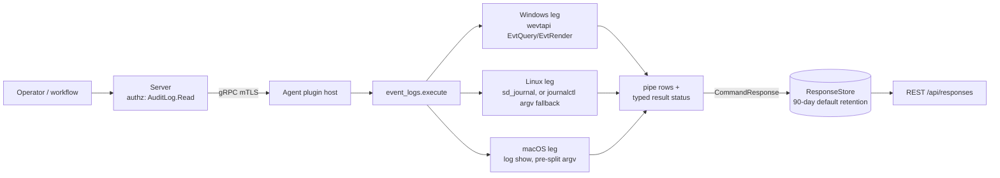

# event_logs

<!-- BEGIN GENERATED: plugin-doc-gen header -->
| | |
|---|---|
| **What it does** | Queries system event logs for errors and filtered events |
| **Version** | 1.1.0 · plugin ABI 4 · shipped in PR #3578 (2026-08-27) |
| **Kind** | Collector · read-only · on-demand (no scheduled gather) |
| **Platforms** | Windows ✅ · macOS ✅ · Linux ✅ |
| **Actions** | `errors` (definition `device.event_logs.errors`) · `query` (definition `device.event_logs.query`) |
| **Security** | securable `AuditLog` · operation Read · risk Medium · dispatch ReadOnly · approval gate none |
| **Roles** | execute: endpoint-admin, endpoint-operator · author: content-author |
<!-- END GENERATED -->

## How it works

`errors` reads Level=2/PRIORITY<=err events from the last `hours` hours (default 24, clamped 1–720) of a named log (Windows only; Linux/macOS always read the system journal/unified log). `query` requires `log` and `filter`, and keyword-matches messages case-insensitively; on Windows the match runs over the newest `count` events examined, while Linux and macOS return up to `count` matches. Both actions are pure reads — nothing is deleted, rotated, or acknowledged.

Each OS has its own acquisition path: Windows calls wevtapi in-process (`EvtQuery`/`EvtRender`, bounded `EvtNext`); Linux prefers an in-process bounded `sd_journal` walk and falls back to a bounded, pre-split `journalctl` argv invocation (no shell) when libsystemd is compiled out or the journal can't be opened; macOS always shells out to `/usr/bin/log show` through the bounded subprocess runner. A read that is denied, times out, or hits its scan bound reports a typed status rather than a confident empty result — except on macOS, which signals degradation only through the row content and a nonzero return code (see Caveats).

Every OS-facing raw field (message text, provider/unit name) is escaped via `safe_output_field` before joining a pipe-delimited row, so a hostile `|` or embedded newline in log content cannot forge extra columns or rows.



## OS capability

<!-- BEGIN GENERATED: plugin-doc-gen capability -->
| Action | Windows | macOS | Linux |
|---|---|---|---|
| `errors` | ✅ supported · rung 1 · `wevtapi (EvtQuery/EvtRender, Level=2, bounded EvtNext)` | ✅ supported · rung 2 · `log_show` | ✅ supported · rung 1 · `sd_journal (bounded local read, PRIORITY<=err)` |
| `query` | ✅ supported · rung 1 · `wevtapi (EvtQuery/EvtRender, bounded EvtNext)` | ✅ supported · rung 2 · `log_show` | ✅ supported · rung 1 · `sd_journal (bounded local read, keyword match)` |

**Declared limits per leg** (the descriptor's fallback text, verbatim):

- **`errors` / macOS** — requires root or a real login session to open the local unified-log data store -- a non-root headless process gets EX_NOPERM/77 regardless of Full Disk Access (docs/darwin-compat.md); no gap in production, which runs as a root LaunchDaemon.
- **`errors` / Linux** — falls back to a bounded journalctl argv invocation (rung 2) when libsystemd is compiled out (-Dsystemd_guard) or the journal is unreachable.
- **`query` / macOS** — requires root or a real login session to open the local unified-log data store -- a non-root headless process gets EX_NOPERM/77 regardless of Full Disk Access (docs/darwin-compat.md); no gap in production, which runs as a root LaunchDaemon.
- **`query` / Linux** — falls back to a bounded journalctl argv invocation (rung 2) when libsystemd is compiled out (-Dsystemd_guard) or the journal is unreachable.
<!-- END GENERATED -->

## Privileges and prerequisites

| OS | Runs as | Extra grant needed | Measured | If the read is refused |
|---|---|---|---|---|
| Windows | agent service account (LocalSystem today, #1442) | `Event Log Readers` group; the `Security` log additionally needs `SeSecurityPrivilege` | 2026-09-07 on bare-metal Windows 10.0.26200 as `SYSTEM` | `PERMISSION_DENIED`, message "Cannot access the event log channel (requires elevated privileges)" |
| macOS | agent daemon; production runs as a root LaunchDaemon | none for root; a non-root, non-login-session process cannot open the store at all | 2026-09-07 on bare-metal macOS 26.6.2, euid 501 (a real login session, not the production root daemon) | `log show` exits `EX_NOPERM` (77); row tagged `permission_denied`, rc 1 — **no typed result status is set** (see Caveats) |
| Linux | agent daemon (dedicated `_yuzu`/`yuzu` account) | `systemd-journal` group | 2026-09-06 in a container, euid 0 (root) | native leg: journal open/visibility check fails, falls through to the fallback; fallback: `UNAVAILABLE`, message names the reason (e.g. "journalctl did not run") |

Binaries/subprocesses/network: none on Windows (wevtapi is in-process) and none on the Linux native leg (sd_journal is in-process). The Linux rung-2 fallback spawns `/usr/bin/journalctl` via the bounded subprocess runner (pre-split argv, no shell). macOS always spawns `/usr/bin/log show` the same way. No network access on any leg.

## Data contract

### Inputs

<!-- BEGIN GENERATED: plugin-doc-gen inputs -->
| Action | Parameter | Type | Required | Default | Description |
|---|---|---|---|---|---|
| `errors` | `log` | string | no | `"System"` | The event log to query. Windows: `System`, `Application`, `Security`, etc.; ignored on Linux/macOS, which always read the system journal/unified log. Max 128 characters. |
| `errors` | `hours` | int32 | no | `24` | Hours to look back for error events, clamped 1–720 (30 days). |
| `query` | `log` | string | yes | — | The event log to search. Windows: `System`, `Application`, `Security`, etc.; on Linux/macOS the value is accepted but does not select a log. 1–128 characters. |
| `query` | `filter` | string | yes | — | Case-insensitive substring keyword to match against event messages. Allowlisted to alphanumerics, spaces, dots, hyphens, underscores, and slashes (`sanitize_input`, `sdk/include/yuzu/string_utils.hpp:116`), e.g. `error`, `disk-warning`. 1–256 characters. |
| `query` | `count` | int32 | no | `50` | Windows: number of newest events *examined* for a match (not the match count). Linux/macOS: maximum number of *matches* returned. Clamped 1–500. |
<!-- END GENERATED -->

### Outputs

Pipe-delimited rows, one per event; field 0 is a literal discriminator (`error` or `event`). **The row shape differs by OS**, not only by action: the Windows rows carry the full 5/6-field shape below, while Linux and macOS collapse the `event_id`/`source` fields into a single `unit` (Linux) or `process` (macOS) field and never emit `event_id`. A missing/inapplicable value renders `-`, never an empty field. The message field is capped at 200 bytes, backed off to a UTF-8 character boundary (`event_logs_parsers.hpp:66`), so a non-ASCII message can be shorter than 200 characters.

<!-- BEGIN GENERATED: plugin-doc-gen outputs -->
**`errors` — Windows: `error|timestamp|event_id|source|message`; Linux/macOS: `error|timestamp|unit|message`**

| Field | Type | Values | Available | Example |
|---|---|---|---|---|
| `timestamp` | string | Windows: full-precision UTC `SystemTime` ISO-8601. Linux: `short-iso` local time (`journal_format_short_iso`/`journalctl -o short-iso`). macOS: `log show --style compact` column timestamp | W, L, M | `2026-09-06T14:55:55.0521384Z` (W) · `2026-09-06 10:55:53.370 E` (M) |
| `event_id` | int, or `-` | Windows `<EventID>` text | W only | `6008` |
| `source` | string, or `-` | Windows `<Provider Name>` — on Linux/macOS this position instead holds `unit` (`SYSLOG_IDENTIFIER[pid]` or `_SYSTEMD_UNIT`, `-` if neither) or macOS `process`, which is a different field, not `source` | W: provider name · L/M: unit/process, not source | `EventLog` (W) |
| `message` | string, or `-` | Windows: space-joined `<Data>` parameter values (not the provider-formatted template). Linux: journal `MESSAGE`. macOS: `log show` message text | W, L, M | see Sample output |

**`query` — Windows: `event|timestamp|level|event_id|source|message`; Linux/macOS: `event|timestamp|unit|message`**

| Field | Type | Values | Available | Example |
|---|---|---|---|---|
| `timestamp` | string | same per-OS formats as `errors.timestamp` | W, L, M | `2026-09-06T14:55:55Z` (W) |
| `level` | enum, Windows only | `Critical` `Error` `Warning` `Information` `Verbose` `Level<n>` (unmapped numeric level) | W only | not observed in any capture — the Windows `query` run matched no rows; the `errors` row format carries no level field |
| `event_id` | int, or `-` | Windows `<EventID>` text | W only | `6008` (Windows `errors` sample; `query` matched no rows) |
| `source` | string, or `-` | Windows provider name; on Linux/macOS this position holds `unit`/`process` instead (see `errors` above) | W: provider · L/M: unit/process | `Kernel-General` (W) |
| `message` | string, or `-` | matched keyword filter applies here (case-insensitive substring) | W, L, M | see Sample output |
<!-- END GENERATED -->

### Result status

| Status | Completeness | Provenance | When |
|---|---|---|---|
| `PERMISSION_DENIED` | PARTIAL | `event_logs_win:access_denied` | Windows: `EvtQuery` fails `ERROR_ACCESS_DENIED` (`event_logs_plugin.cpp:136-139`) |
| `UNAVAILABLE` | PARTIAL | `event_logs_win:channel_not_found` | Windows: channel doesn't exist (`event_logs_plugin.cpp:140-142`) |
| `CONSTRAINED` | PARTIAL | `event_logs_win:evt_next_timeout` | Windows: `EvtNext` times out mid-query (`event_logs_plugin.cpp:143-146`) |
| `UNAVAILABLE` | PARTIAL | `event_logs_win:evt_query_failed` | Windows: any other query failure (`event_logs_plugin.cpp:147-151`) |
| `CONSTRAINED` | PARTIAL | `event_logs_win:count_window_full` | Windows `query`: the `count`-event examine window filled (`event_logs_plugin.cpp:548-550`) |
| `CONSTRAINED` | PARTIAL | `event_logs_journal:errors_truncated` / `event_logs_journal:query_truncated` | Linux native leg hits its wall-clock budget or scan cap before finishing (`event_logs_plugin.cpp:264-266`) |
| `UNAVAILABLE` | PARTIAL | `event_logs_journalctl:errors_unavailable` / `_query_unavailable` | Linux fallback: `journalctl` didn't run, was signaled, or exited nonzero (`event_logs_plugin.cpp:366-369`) |
| `CONSTRAINED` | PARTIAL | same provenance as above | Linux fallback: `journalctl`'s own output was truncated, or (query only) the scan window filled before a confident answer (`event_logs_plugin.cpp:374-377`, `398-401`) |
| *(none set)* | — | — | Windows/Linux clean success; **macOS never calls `set_result_status` on any path** — the agent records `UNDECLARED`/`UNKNOWN`, and degradation is signalled only via row content + return code (`event_logs_macos.hpp:187-233`; no `set_result_status` call in that file or its callers) |

### Where the data goes

- **Instruction result only.** Rows travel over the agent's mTLS gRPC channel as the command response and land in the ResponseStore (90-day default retention per `docs/yaml-dsl-spec.md:194`; the definitions carry no `response.retentionDays` override), queryable at `/api/responses/{id}` and aggregatable (`errors` groups by `source`; `query` groups by `level`,`source` — `content/definitions/event_logs.yaml:73-75,172-174`).
- **Not consumed by** daily-sync inventory, the TAR warehouse, or metrics. `event_logs` is one of `result_parsing.hpp`'s `kKeyValuePlugins` (`server/core/src/result_parsing.hpp:67`), so the server's legacy dashboard row renderer treats its output as generic `Agent|Key|Value` pairs rather than a fixed column set — a consequence of the same per-OS row-shape divergence documented above.
- **Siblings:** none — `event_logs` is the only plugin in the shipped catalogue reading OS event/journal/unified logs (`server/core/src/agent_registry.cpp:848-849`).
- **MCP / REST.** Discover: `discover_plugins` (summary) → `yuzu://plugin-docs` (this page as data) → `discover_instructions` / `get_definition("device.event_logs.errors")`. Run: `execute_instruction {definition_id, parameters}`. Read: `/api/responses/{id}`.

## Sample output

<!-- BEGIN GENERATED: plugin-doc-gen samples -->
**Windows** — captured: windows Microsoft Windows NT 10.0.26200.0 x64 · bare-metal · 2026-09-07 · SYSTEM · leg-hash pending

```
== action=errors
error|2026-09-06T14:55:55.0521384Z|6008|EventLog|16:11:31 ‎05/‎09/‎2026 105614
[result_status] UNDECLARED / UNKNOWN / 

== action=query log=System filter=error
event|none|-|-|-|No match within the newest events examined (count window full; older events not searched)
[result_status] CONSTRAINED / PARTIAL / event_logs_win:count_window_full
```

**macOS** — captured: macos macOS 26.6.2 arm64 · bare-metal · 2026-09-07 · euid 501 (alex) · leg-hash pending

```
== action=errors
error|Timestamp||           Ty Process[PID:TID]
error|2026-09-06 10:55:53.370 E|-|chronod[704:da8004] [com.apple.chrono:location] [ext:com.apple.weather::com.apple.weather.widget] failed to acquire new underlying visibility assertion
error|2026-09-06 10:55:53.370 E|-|chronod[704:da8004] [com.apple.chrono:location] [ext:com.apple.weather::com.apple.weather.widget] failed to acquire new underlying activity assertion
error|2026-09-06 10:55:53.668 E|-|chronod[704:da8004] [com.apple.chrono:location] [ext:com.apple.weather::com.apple.weather.widget] failed to acquire new underlying visibility assertion
error|2026-09-06 10:56:10.400 E|-|contactsd[85796:da8129] [com.apple.accounts:core] "Remote account store returned fatal error: Error Domain=NSCocoaErrorDomain Code=4099 "The connection to service named com.apple.accountsd.accountmana
error|2026-09-06 10:56:10.400 E|-|contactsd[85796:da8129] [com.apple.accounts:core] "Remote account store returned fatal error: Error Domain=NSCocoaErrorDomain Code=4099 "The connection to service named com.apple.accountsd.accountmana
error|2026-09-06 10:56:10.407 E|-|contactsd[85795:da812b] [com.apple.accounts:core] "Remote account store returned fatal error: Error Domain=NSCocoaErrorDomain Code=4099 "The connection to service named com.apple.accountsd.accountmana
error|2026-09-06 10:56:10.407 E|-|contactsd[85797:da8128] [com.apple.accounts:core] "Remote account store returned fatal error: Error Domain=NSCocoaErrorDomain Code=4099 "The connection to service named com.apple.accountsd.accountmana
error|2026-09-06 10:56:10.410 E|-|contactsd[85799:da812c] [com.apple.accounts:core] "Remote account store returned fatal error: Error Domain=NSCocoaErrorDomain Code=4099 "The connection to service named com.apple.accountsd.accountmana
error|2026-09-06 10:56:10.411 E|-|contactsd[85798:da812a] [com.apple.accounts:core] "Remote account store returned fatal error: Error Domain=NSCocoaErrorDomain Code=4099 "The connection to service named com.apple.accountsd.accountmana
error|2026-09-06 10:56:10.411 E|-|contactsd[85794:da8127] [com.apple.accounts:core] "Remote account store returned fatal error: Error Domain=NSCocoaErrorDomain Code=4099 "The connection to service named com.apple.accountsd.accountmana
error|2026-09-06 10:56:10.412 E|-|contactsd[85796:da812f] [com.apple.accounts:core] "Remote account store returned fatal error: Error Domain=NSCocoaErrorDomain Code=4099 "The connection to service named com.apple.accountsd.accountmana
error|2026-09-06 10:56:10.413 E|-|contactsd[85796:da812f] [com.apple.accounts:core] "Remote account store returned fatal error: Error Domain=NSCocoaErrorDomain Code=4099 "The connection to service named com.apple.accountsd.accountmana
error|2026-09-06 10:56:10.413 E|-|contactsd[85796:da812f] [com.apple.accounts:core] "Error connecting to remote account store!"
error|2026-09-06 10:56:10.413 E|-|contactsd[85796:da8130] [com.apple.AskTo:DaemonConnection] Daemon connection invalidated
error|2026-09-06 10:56:10.417 E|-|contactsd[85800:da812e] [com.apple.accounts:core] "Remote account store returned fatal error: Error Domain=NSCocoaErrorDomain Code=4099 "The connection to service named com.apple.accountsd.accountmana
error|2026-09-06 10:56:10.418 E|-|contactsd[85797:da8135] [com.apple.accounts:core] "Remote account store returned fatal error: Error Domain=NSCocoaErrorDomain Code=4099 "The connection to service named com.apple.accountsd.accountmana
error|2026-09-06 10:56:10.418 E|-|contactsd[85795:da8134] [com.apple.accounts:core] "Remote account store returned fatal error: Error Domain=NSCocoaErrorDomain Code=4099 "The connection to service named com.apple.accountsd.accountmana
error|2026-09-06 10:56:10.418 E|-|contactsd[85799:da8143] [com.apple.accounts:core] "Remote account store returned fatal error: Error Domain=NSCocoaErrorDomain Code=4099 "The connection to service named com.apple.accountsd.accountmana
error|2026-09-06 10:56:10.418 E|-|contactsd[85797:da8145] [com.apple.AskTo:DaemonConnection] Daemon connection invalidated
error|2026-09-06 10:56:10.419 E|-|contactsd[85799:da8143] [com.apple.accounts:core] "Remote account store returned fatal error: Error Domain=NSCocoaErrorDomain Code=4099 "The connection to service named com.apple.accountsd.accountmana
error|2026-09-06 10:56:10.419 E|-|contactsd[85799:da8143] [com.apple.accounts:core] "Error connecting to remote account store!"
error|2026-09-06 10:56:10.419 E|-|contactsd[85799:da8144] [com.apple.AskTo:DaemonConnection] Daemon connection invalidated
error|2026-09-06 10:56:10.419 E|-|contactsd[85795:da8133] [com.apple.AskTo:DaemonConnection] Daemon connection invalidated
… 25 of 100 rows
[result_status] UNDECLARED / UNKNOWN / 

== action=query log=system filter=error
event|Timestamp||           Ty Process[PID:TID]
event|2026-09-06 10:55:53.560 Df WeatherWidget[977:d9fa44] [com.apple.weather:WidgetRefresh] Location state is not fresh; returning error refresh policy; state=stale|-|2026-09-06 10:55:53.560 Df WeatherWidget[977:d9fa44] [com.apple.weather:WidgetRefresh] Location state is not fresh; returning error refresh policy; state=stale
event|2026-09-06 10:55:53.560 Df WeatherWidget[977:d9fa44] [com.apple.weather:WidgetRefresh] About to compute error refresh policy. (5 min to next refresh).|-|2026-09-06 10:55:53.560 Df WeatherWidget[977:d9fa44] [com.apple.weather:WidgetRefresh] About to compute error refresh policy. (5 min to next refresh).
event|2026-09-06 10:56:10.400 E|-|contactsd[85796:da8129] [com.apple.accounts:core] "Remote account store returned fatal error: Error Domain=NSCocoaErrorDomain Code=4099 "The connection to service named com.apple.accountsd.accountmana
event|2026-09-06 10:56:10.400 E|-|contactsd[85796:da8129] [com.apple.accounts:core] "Remote account store returned fatal error: Error Domain=NSCocoaErrorDomain Code=4099 "The connection to service named com.apple.accountsd.accountmana
event|2026-09-06 10:56:10.407 E|-|contactsd[85795:da812b] [com.apple.accounts:core] "Remote account store returned fatal error: Error Domain=NSCocoaErrorDomain Code=4099 "The connection to service named com.apple.accountsd.accountmana
event|2026-09-06 10:56:10.407 E|-|contactsd[85797:da8128] [com.apple.accounts:core] "Remote account store returned fatal error: Error Domain=NSCocoaErrorDomain Code=4099 "The connection to service named com.apple.accountsd.accountmana
event|2026-09-06 10:56:10.410 E|-|contactsd[85799:da812c] [com.apple.accounts:core] "Remote account store returned fatal error: Error Domain=NSCocoaErrorDomain Code=4099 "The connection to service named com.apple.accountsd.accountmana
event|2026-09-06 10:56:10.411 E|-|contactsd[85798:da812a] [com.apple.accounts:core] "Remote account store returned fatal error: Error Domain=NSCocoaErrorDomain Code=4099 "The connection to service named com.apple.accountsd.accountmana
event|2026-09-06 10:56:10.411 E|-|contactsd[85794:da8127] [com.apple.accounts:core] "Remote account store returned fatal error: Error Domain=NSCocoaErrorDomain Code=4099 "The connection to service named com.apple.accountsd.accountmana
event|2026-09-06 10:56:10.412 E|-|contactsd[85796:da812f] [com.apple.accounts:core] "Remote account store returned fatal error: Error Domain=NSCocoaErrorDomain Code=4099 "The connection to service named com.apple.accountsd.accountmana
event|2026-09-06 10:56:10.413 E|-|contactsd[85796:da812f] [com.apple.accounts:core] "Remote account store returned fatal error: Error Domain=NSCocoaErrorDomain Code=4099 "The connection to service named com.apple.accountsd.accountmana
event|2026-09-06 10:56:10.417 E|-|contactsd[85800:da812e] [com.apple.accounts:core] "Remote account store returned fatal error: Error Domain=NSCocoaErrorDomain Code=4099 "The connection to service named com.apple.accountsd.accountmana
event|2026-09-06 10:56:10.418 E|-|contactsd[85797:da8135] [com.apple.accounts:core] "Remote account store returned fatal error: Error Domain=NSCocoaErrorDomain Code=4099 "The connection to service named com.apple.accountsd.accountmana
event|2026-09-06 10:56:10.418 E|-|contactsd[85795:da8134] [com.apple.accounts:core] "Remote account store returned fatal error: Error Domain=NSCocoaErrorDomain Code=4099 "The connection to service named com.apple.accountsd.accountmana
event|2026-09-06 10:56:10.418 E|-|contactsd[85799:da8143] [com.apple.accounts:core] "Remote account store returned fatal error: Error Domain=NSCocoaErrorDomain Code=4099 "The connection to service named com.apple.accountsd.accountmana
event|2026-09-06 10:56:10.419 E|-|contactsd[85799:da8143] [com.apple.accounts:core] "Remote account store returned fatal error: Error Domain=NSCocoaErrorDomain Code=4099 "The connection to service named com.apple.accountsd.accountmana
event|2026-09-06 10:56:10.419 E|-|contactsd[85795:da8134] [com.apple.accounts:core] "Remote account store returned fatal error: Error Domain=NSCocoaErrorDomain Code=4099 "The connection to service named com.apple.accountsd.accountmana
event|2026-09-06 10:56:10.419 E|-|contactsd[85797:da8135] [com.apple.accounts:core] "Remote account store returned fatal error: Error Domain=NSCocoaErrorDomain Code=4099 "The connection to service named com.apple.accountsd.accountmana
event|2026-09-06 10:56:10.424 E|-|contactsd[85794:da8136] [com.apple.accounts:core] "Remote account store returned fatal error: Error Domain=NSCocoaErrorDomain Code=4099 "The connection to service named com.apple.accountsd.accountmana
event|2026-09-06 10:56:10.425 E|-|contactsd[85798:da8137] [com.apple.accounts:core] "Remote account store returned fatal error: Error Domain=NSCocoaErrorDomain Code=4099 "The connection to service named com.apple.accountsd.accountmana
event|2026-09-06 10:56:10.425 E|-|contactsd[85794:da8136] [com.apple.accounts:core] "Remote account store returned fatal error: Error Domain=NSCocoaErrorDomain Code=4099 "The connection to service named com.apple.accountsd.accountmana
event|2026-09-06 10:56:10.425 E|-|contactsd[85798:da8137] [com.apple.accounts:core] "Remote account store returned fatal error: Error Domain=NSCocoaErrorDomain Code=4099 "The connection to service named com.apple.accountsd.accountmana
event|2026-09-06 10:56:10.429 E|-|contactsd[85800:da8142] [com.apple.accounts:core] "Remote account store returned fatal error: Error Domain=NSCocoaErrorDomain Code=4099 "The connection to service named com.apple.accountsd.accountmana
event|2026-09-06 10:56:10.430 E|-|contactsd[85800:da8142] [com.apple.accounts:core] "Remote account store returned fatal error: Error Domain=NSCocoaErrorDomain Code=4099 "The connection to service named com.apple.accountsd.accountmana
event|2026-09-06 10:56:10.442 E|-|contactsd[85798:da8138] [com.apple.accounts:core] "Remote account store returned fatal error: Error Domain=NSCocoaErrorDomain Code=4099 "The connection to service named com.apple.accountsd.accountmana
event|2026-09-06 10:56:10.442 E|-|contactsd[85797:da8146] [com.apple.accounts:core] "Remote account store returned fatal error: Error Domain=NSCocoaErrorDomain Code=4099 "The connection to service named com.apple.accountsd.accountmana
… 25 of 50 rows
[result_status] UNDECLARED / UNKNOWN / 
```

**Linux** — captured: linux Debian GNU/Linux 13 (trixie) aarch64 · container · 2026-09-06 · euid 0 · leg-hash pending

```
== action=errors
error|none|-|journalctl did not run
[result_status] UNAVAILABLE / PARTIAL / event_logs_journalctl:errors_unavailable

== action=query log=system filter=error
event|none|-|journalctl did not run
[result_status] UNAVAILABLE / PARTIAL / event_logs_journalctl:query_unavailable
```
<!-- END GENERATED -->

## Caveats and known gaps

1. **macOS never sets a typed result status.** `decide_log_show_output` (`event_logs_macos.hpp:187-233`) decides rows and an rc but calls `set_result_status` nowhere; every macOS run — success, permission denial, timeout, or a truncated capture — reports `UNDECLARED`/`UNKNOWN` at the ABI4 status layer. An operator must parse the row's second field (`permission_denied`/`timeout`/`unavailable`/`none`) or check rc, not the typed status, to detect a degraded macOS read.
2. **The row shape is not the same across OSes for the same action.** The YAML `result.columns` for `errors` (`timestamp, event_id, source, message`) and `query` (adds `level`) describe the Windows row exactly; Linux and macOS instead emit `<prefix>|timestamp|unit|message` with no `event_id`/`level`/`source` fields at all. This is why `event_logs` is listed in the server's `kKeyValuePlugins` (`result_parsing.hpp:67`) rather than given a fixed dashboard column schema.
3. **The Linux capture sample shows the fallback failing, not the native leg.** In the 2026-09-06 container capture, both actions fell straight through to `UNAVAILABLE` with reason "journalctl did not run" — meaning the native `sd_journal` leg also declined (compiled out or the journal was unreadable/unopenable for this account) and the rung-2 binary itself was absent from the minimal container image. Neither Linux mechanism was exercised end-to-end by this capture.
4. **`sd_journal_open` succeeding proves nothing about read access.** A caller outside the `systemd-journal` group can open the journal and see zero entries; the native leg treats "no visible entries" as a denied read (`event_logs_journal.hpp:117-135`) and falls through to the argv fallback rather than reporting a confident empty log.
5. **`journalctl --grep` is deliberately not used.** It exits 1 on a genuine no-match result (verified against systemd 257), which the plugin's own honesty rule would otherwise misclassify as an acquisition failure; filtering instead happens in-process with the same case-insensitive substring predicate the native leg uses (`event_logs_plugin.cpp:333-346`).

## Source and tests

<!-- BEGIN GENERATED: plugin-doc-gen source -->
- Plugin: `agents/plugins/event_logs/src/event_logs_plugin.cpp` (descriptor, action shells) · `event_logs_parsers.hpp` (pure Windows XML + journal row parsing/formatting) · `event_logs_journal.hpp` (sd_journal I/O) · `event_logs_journalctl.hpp` (journalctl fallback outcome classifier) · `event_logs_macos.hpp` (log show outcome classifier + row/rc decision)
- Definitions: `content/definitions/event_logs.yaml`
- Capability rows: `server/core/src/capability_decls/plugin_action_catalogue_d.hpp`
- Tests: `tests/unit/test_event_logs_parsers.cpp` · `tests/unit/test_event_logs_journalctl.cpp` · `tests/unit/test_event_logs_macos.cpp` · `tests/unit/test_event_logs_posix_actions.cpp` · `tests/unit/test_event_logs_win_actions.cpp`
- Privilege row: `docs/agent-privilege-model.md:90`
- Changelog: `changelog.d/2204-declarations-group-d.added.md` · `changelog.d/wave4-pr42-event-logs-native.changed.md`
<!-- END GENERATED -->
