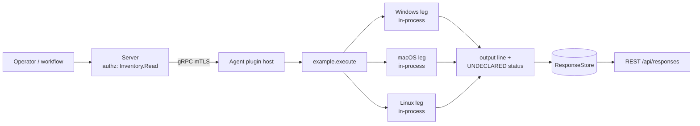

# example

<!-- BEGIN GENERATED: plugin-doc-gen header -->
| | |
|---|---|
| **What it does** | Reference example plugin — responds to 'ping' |
| **Version** | 0.1.0 |
| **Kind** | Collector · read-only · on-demand |
| **Platforms** | Windows ✅ · macOS ✅ · Linux ✅ |
| **Actions** | `echo` · `ping` |
| **Security** | securable `Inventory` · operation Read · risk Low · dispatch ReadOnly · approval gate None |
| **Roles** | execute: - · author: - |
<!-- END GENERATED -->

## How it works

`execute()` dispatches on the action name with no OS syscalls, subprocess, or file/network I/O (`example_plugin.cpp:63-77`). `ping` writes the literal string `pong` and returns 0 — no parameters, no host state read (`example_plugin.cpp:64-67`). `echo` reads one parameter, `message`, defaulting to `(no message)` when omitted, and writes it back prefixed with `echo: ` (`example_plugin.cpp:69-73`). Any other action name writes `unknown action: <name>` and returns 1 (`example_plugin.cpp:75-76`). `init()` and `shutdown()` are both no-ops — there is no state to set up or tear down (`example_plugin.cpp:56-61`). The plugin deliberately reads or changes no host state; its file header states its purpose is to be a starting point for writing real plugins (`example_plugin.cpp:1-6`), and its capability comment notes every leg is rung 1 "in-process" with no OS interaction at all (`example_plugin.cpp:15-17`). No file under `content/definitions/` declares `plugin: example`, so today the plugin cannot be dispatched through a definition id — only a direct plugin load (capture, tooling) reaches it.



## OS capability

<!-- BEGIN GENERATED: plugin-doc-gen capability -->
| Action | Windows | macOS | Linux |
|---|---|---|---|
| `echo` | ✅ supported · rung 1 · in-process | ✅ supported · rung 1 · in-process | ✅ supported · rung 1 · in-process |
| `ping` | ✅ supported · rung 1 · in-process | ✅ supported · rung 1 · in-process | ✅ supported · rung 1 · in-process |
<!-- END GENERATED -->

## Privileges and prerequisites

| OS | Runs as | Extra grant needed | Measured | If the read is refused |
|---|---|---|---|---|
| Windows | no `docs/agent-privilege-model.md` row; sample captured as `SYSTEM` | None — no OS call is made (`example_plugin.cpp:63-77`) | 2026-09-07, bare-metal, Windows NT 10.0.26200.0 x64 (`docs/samples/windows.txt:1`) | n/a — no external resource is read; both actions return rc 0 for a known action name |
| macOS | no privilege-model row; sample captured at euid 501 (alex), unprivileged | None | 2026-09-07, bare-metal, macOS 26.6.2 arm64 (`docs/samples/macos.txt:1`) | n/a |
| Linux | no privilege-model row; sample captured at euid 0, container | None | 2026-09-06, container, Debian GNU/Linux 13 aarch64 (`docs/samples/linux.txt:1`) | n/a |

No external binaries, no subprocesses, no network access — `example_plugin.cpp` (81 lines, read in full) contains no process spawn, socket, or file I/O call.

## Data contract

### Inputs

<!-- BEGIN GENERATED: plugin-doc-gen inputs -->
Neither action takes parameters.
<!-- END GENERATED -->

### Outputs

Each action writes exactly one line of plain text via `ctx.write_output()` (`example_plugin.cpp:65,71,75`) — there is no pipe-delimited row schema, discriminator field, or empty-row placeholder convention as used by the collector-style plugins. A call on a known action name always produces one output line and returns 0; an unrecognized action name writes `unknown action: <action>` and returns 1 (`example_plugin.cpp:75-76`).

<!-- BEGIN GENERATED: plugin-doc-gen outputs -->
No definition declares result columns.
<!-- END GENERATED -->

### Result status

This plugin does not set a typed result status; the agent records `UNDECLARED` and the sample shows `UNDECLARED / UNKNOWN /` for both actions on every OS (`docs/samples/windows.txt:4,8`, `macos.txt:4,8`, `linux.txt:4,8`).

### Where the data goes

- **MCP / REST.** No definition YAML exists for `example` (no file under `content/definitions/` sets `plugin: example`), so there is no `definition_id` to discover via `discover_instructions`/`get_definition` or run via `execute_instruction` today — `ping` and `echo` are unreachable from the MCP/REST surface until a definition is authored. The only paths that load this plugin today are the plugin-capture driver (`PluginHandle::load` + `LocalDispatcher::run`, used for the samples below) and direct test/tooling loads of the shared library.
- **Not consumed by** daily-sync, the TAR warehouse, DEX, or metrics — nothing schedules this plugin; it runs only when explicitly loaded.
- **Sensitivity.** Both actions carry no host state — `ping`'s row is a fixed literal and `echo`'s row is only the operator-supplied `message` parameter echoed back; nothing about the device, an account, or installed software is read or reported.
- **Siblings:** none — a standalone ABI/host reference plugin, not part of an inventory family (`example_plugin.cpp:1-6`).

## Sample output

<!-- BEGIN GENERATED: plugin-doc-gen samples -->
**Windows** — captured: windows Microsoft Windows NT 10.0.26200.0 x64 · bare-metal · 2026-09-07 · SYSTEM · leg-hash 23dda8161132

```
== action=ping
pong
[result_status] UNDECLARED / UNKNOWN

== action=echo
echo: (no message)
[result_status] UNDECLARED / UNKNOWN
```

**macOS** — captured: macos macOS 26.6.2 arm64 · bare-metal · 2026-09-07 · euid 501 (alex) · leg-hash 23dda8161132

```
== action=ping
pong
[result_status] UNDECLARED / UNKNOWN

== action=echo
echo: (no message)
[result_status] UNDECLARED / UNKNOWN
```

**Linux** — captured: linux Debian GNU/Linux 13 (trixie) aarch64 · container · 2026-09-06 · euid 0 · leg-hash 23dda8161132

```
== action=ping
pong
[result_status] UNDECLARED / UNKNOWN

== action=echo
echo: (no message)
[result_status] UNDECLARED / UNKNOWN
```
<!-- END GENERATED -->

## Caveats and known gaps

1. **No definition YAML — unreachable via MCP/REST.** No file under `content/definitions/` sets `plugin: example`; the capability rows exist (`server/core/src/capability_decls/plugin_action_catalogue_b.hpp:703,714`) but nothing wires `ping`/`echo` to a `definition_id`, so the two actions can only be exercised by loading the plugin directly.
2. **`echo` always shows the default in the samples.** All three captures show `echo: (no message)` because the capture driver calls `execute()` with no `message` parameter — the samples don't exercise the parameter-passing path they exist to demonstrate.
3. **No result status is ever set.** `execute()` never calls a result-status API; every sample reports `UNDECLARED / UNKNOWN /`.
4. **No tests.** No file under `tests/` references this plugin.
5. **Reference/template purpose only.** The file header states its purpose is to be a "starting point for writing real plugins" (`example_plugin.cpp:1-6`) — it deliberately does no OS interaction, matching its role as an ABI smoke/reference implementation rather than a functional collector.

## Source and tests

<!-- BEGIN GENERATED: plugin-doc-gen source -->
- Plugin: `agents/plugins/example/src/example_plugin.cpp`
- Capability rows: `server/core/src/capability_decls/plugin_action_catalogue_b.hpp`
- Tests: none found by name
- Privilege row: `docs/agent-privilege-model.md` (no row yet)
- Changelog: `changelog.d/1986-getting-started-import-examples.fixed.md`
<!-- END GENERATED -->
