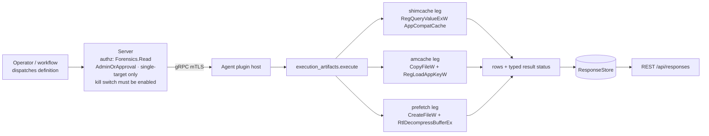

# execution_artifacts

<!-- BEGIN GENERATED: plugin-doc-gen header -->
| | |
|---|---|
| **What it does** | Windows execution-evidence sources: ShimCache, Amcache InventoryApplicationFile, and Prefetch. Forensics-gated, single-target, default-off |
| **Version** | 1.0.0 |
| **Kind** | Collector · read-only · gathered (windows.execution_artifacts.shimcache, windows.execution_artifacts.amcache, windows.execution_artifacts.prefetch) |
| **Platforms** | Windows ✅ · macOS ⛔ unsupported · Linux ⛔ unsupported |
| **Actions** | `amcache` (definition `windows.execution_artifacts.amcache`) · `prefetch` (definition `windows.execution_artifacts.prefetch`) · `shimcache` (definition `windows.execution_artifacts.shimcache`) |
| **Security** | securable `Forensics` · operation Read · risk High · dispatch ReadOnly · approval gate AdminOrApproval |
| **Roles** | execute: admin · author: content-author |
<!-- END GENERATED -->

## How it works

All three actions are independent Windows-only reads, dispatched and gated separately — a failure in one never blocks the other two. `shimcache` opens `HKLM\SYSTEM\CurrentControlSet\Control\Session Manager\AppCompatCache` and decodes the Windows 10/11 AppCompatCache blob into one row per cached executable path, last-modified time, and data size; this layout carries no execution-confirmation bit, so `insert_flag` is always `-`. `amcache` copies `Amcache.hve` (plain `CopyFileW` first, falling back to a `SeBackupPrivilege` + backup-semantics read only on a sharing violation), loads the copy privately and read-only via `RegLoadAppKeyW`, and enumerates every `Root\InventoryApplicationFile` subkey into a row of path, SHA-1, size, link date, publisher, binary type, and product identity. `prefetch` globs `C:\Windows\Prefetch\*.pf`, MAM-decompresses each file via `ntdll`'s `RtlDecompressBufferEx`, and parses the Windows 10/11 (version 31) file-information layout into exe name, hash, run count, up to eight last-run timestamps, and volume/file-reference counts. None of the three ever reads or emits file contents — only paths, hashes, and timestamps. Every action authorizes at `Forensics:Read`/`AdminOrApproval`, is refused for anything but a single explicit target, and is DEFAULT-OFF behind the server-side plugin-config kill switch until an operator explicitly enables it.

## OS capability

<!-- BEGIN GENERATED: plugin-doc-gen capability -->
| Action | Windows | macOS | Linux |
|---|---|---|---|
| `amcache` | 🟡 constrained · rung 1 · copy Amcache.hve(+.LOG1/.LOG2) then RegLoadAppKeyW; whole sequence serialised by offline_hive_mutex | ⛔ unsupported | ⛔ unsupported |
| `prefetch` | ✅ supported · rung 1 · CreateFileW read + ntdll RtlGetCompressionWorkSpaceSize/RtlDecompressBufferEx(COMPRESSION_FORMAT_XPRESS_HUFF) | ⛔ unsupported | ⛔ unsupported |
| `shimcache` | ✅ supported · rung 1 · RegQueryValueExW HKLM\\SYSTEM\\CurrentControlSet\\Control\\Session Manager\\AppCompatCache (local bounded reader, 16 MiB) | ⛔ unsupported | ⛔ unsupported |

**Declared limits per leg** (descriptor fallback text, verbatim):

- **`amcache` / Windows** — A1's the-rig probe (2026-09-06) found the copy succeeds as a PLAIN Copy-Item in every session tested (admin and LocalSystem) — the sharing violation that would require CreateFile(FILE_SHARE_READ|WRITE|DELETE, FILE_FLAG_BACKUP_SEMANTICS) + SeBackupPrivilege was never hit, so that fallback path is unexercised on this hardware. RegLoadAppKeyW does NOT require SeBackupPrivilege: it succeeded (LSTATUS 0x00000000) with the privilege explicitly disabled via AdjustTokenPrivileges, in both the admin session and under LocalSystem, against all 8889 real InventoryApplicationFile subkeys. Reported CONSTRAINED because the plain-copy path is a best-effort acquisition method not guaranteed on every host (a locked/exclusively-held hive on another machine could still need the backup-semantics fallback), not because anything failed on the probe host
- **`amcache` / macOS** — Windows-only artefact; no equivalent exists
- **`amcache` / Linux** — Windows-only artefact; no equivalent exists
- **`prefetch` / Windows** — A1's the-rig LocalSystem probe (2026-09-06): GetProcAddress resolved both ntdll entry points to non-null addresses in every session (admin and LocalSystem); all four decompression attempts across the three real MAM .pf captures returned NTSTATUS 0x00000000 (STATUS_SUCCESS) from both RtlGetCompressionWorkSpaceSize (workspace size 166495 bytes, format COMPRESSION_FORMAT_XPRESS_HUFF, engine standard) and RtlDecompressBufferEx, with every decompressed payload's bytes 4-7 reading 'SCCA'. Real captures parsed as prefetch format version 31 (Windows 10/11), not version 30 as originally planned — see execution_artifacts_parsers.hpp's file header
- **`prefetch` / macOS** — Windows-only artefact; no equivalent exists
- **`prefetch` / Linux** — Windows-only artefact; no equivalent exists
- **`shimcache` / Windows** — Windows 10/11 layout only ('win10' header scheme, DWORD 0x34 or 0x30); no exec-flag bit exists in this layout, so every row's insert_flag is '-'. A1's real capture (the-rig, 2026-09-06) was 7886 bytes, well under the 16 MiB bound, and parsed with the header-size DWORD reading 0x34
- **`shimcache` / macOS** — Windows-only artefact; no equivalent exists
- **`shimcache` / Linux** — Windows-only artefact; no equivalent exists
<!-- END GENERATED -->

## Privileges and prerequisites

| OS | Runs as | Extra grant needed | Measured | If the read is refused |
|---|---|---|---|---|
| Windows | agent service account (LocalSystem today, #1442) | None for `shimcache` (a bounded `HKLM` value read) or `prefetch` (a directory glob plus per-file reads under `C:\Windows\Prefetch`). `amcache` needs no elevation either: A1's the-rig probe found `RegLoadAppKeyW` succeeds without `SeBackupPrivilege`, in both an admin session and under LocalSystem; the `SeBackupPrivilege` + backup-semantics fallback (reached only on `ERROR_SHARING_VIOLATION`) exists for a host where the hive is exclusively locked elsewhere, but grants itself no new privilege beyond what the service account can already request. | A1's the-rig probe, 2026-09-06, admin session and LocalSystem (see this plugin's `execution_artifacts_win.cpp` file header for the full probe findings) | `constrained` with a named reason (`reg_<code>`, `hive_locked`, `regload_<code>`, `subkey_open_failed`, …) — this plugin does not distinguish "access denied" from "not found"/"vanished mid-walk" in its tokens; a refused open and a missing key report through the same per-source token family |
| macOS | n/a — plugin loads but every action is the fixed `windows_only_artefact` outcome | n/a | not measured (no macOS mechanism exists) | always `constrained` / `windows_only_artefact`, rc 1 |
| Linux | n/a — plugin loads but every action is the fixed `windows_only_artefact` outcome | n/a | not measured (no Linux mechanism exists) | always `constrained` / `windows_only_artefact`, rc 1 |

No external binaries, no subprocesses, no network access — every call is an in-process Win32 registry/file call or an in-process `ntdll` decompression call. This plugin performs no authorization of its own: `Forensics:Read`/`AdminOrApproval`/single-target enforcement lives at the server dispatch layer (`server/core/src/dispatch_destructive_gate.hpp`), and every read is additionally gated behind the server-side plugin-config kill switch (`PluginConfigStore::seed_kill_switch_default_off`), which is OFF until an operator explicitly enables it.

## Data contract

### Inputs

<!-- BEGIN GENERATED: plugin-doc-gen inputs -->
No action takes parameters.
<!-- END GENERATED -->

### Outputs

Pipe-delimited rows, one discriminator-prefixed row per artefact entry (`shimcache|...`, `amcache|...`, `prefetch|...`); every untrusted string field is escaped through `safe_output_field`. A source that fails outright never emits a row — it emits `constrained|<token>` instead and sets the matching typed status. A source that reads some entries and fails on others (Amcache's per-subkey walk, Prefetch's per-file walk) emits every row it could read, plus one `constrained|<reason>` line (Amcache, when the walk itself was truncated) or one `prefetch_error|<file>|<reason>` line per skipped file (Prefetch, when the walk completed but individual files failed), and folds every accumulated reason into the terminal typed status through the shared `ConstraintAccumulator`. Amcache additionally emits `note|malformed_fileid_count=<n>` when one or more `FileId` values could not be normalised to a 40-hex-character SHA-1, and either leg's temp-file cleanup emits `note|temp_cleanup_failed` on a (non-fatal) deletion failure — both `note|` lines are diagnostic, not data rows, and a consumer parsing `amcache|` rows skips any line that does not start with that discriminator. `shimcache`'s `insert_flag` is always `-` (no execution-confirmation bit exists in the Windows 10/11 AppCompatCache layout); every other field is either the artefact's real decoded value or absent (`-`) when that specific field could not be read.

<!-- BEGIN GENERATED: plugin-doc-gen outputs -->
**`windows.execution_artifacts.amcache` — `lower_case_long_path|sha1|size|link_date|publisher|binary_type|product_name|product_version`**

| Field | Type | Values | Available | Example | Description |
|---|---|---|---|---|---|
| `lower_case_long_path` | string | - | Windows | `c:/program files/app/app.exe` | Lower-cased full executable path from the InventoryApplicationFile subkey, escaped. |
| `sha1` | string | - | Windows | `da39a3ee5e6b4b0d3255bfef95601890afd80709` | Normalised 40-hex-character SHA-1 from the subkey's FileId; "-" when absent or malformed. |
| `size` | string | - | Windows | `2048576` | File size as recorded by Amcache (raw string form, not re-parsed). |
| `link_date` | string | - | Windows | `01/02/2026 03:04:05` | Linker timestamp as recorded by Amcache. |
| `publisher` | string | - | Windows | `Example Corp` | Publisher string as recorded by Amcache, escaped. |
| `binary_type` | string | - | Windows | `pe32_amd64` | Binary type as recorded by Amcache. |
| `product_name` | string | - | Windows | `Example App` | Product name as recorded by Amcache, escaped. |
| `product_version` | string | - | Windows | `1.2.3.4` | Product version as recorded by Amcache. |

**`windows.execution_artifacts.prefetch` — `exe_name|hash_hex|version|run_count|last_runs_epoch_ms|volume_count|file_ref_count`**

| Field | Type | Values | Available | Example | Description |
|---|---|---|---|---|---|
| `exe_name` | string | - | Windows | `NOTEPAD.EXE` | Executable name recorded in the Prefetch file's header, escaped. |
| `hash_hex` | string | - | Windows | `DDFD0A8D` | 8-uppercase-hex-digit Prefetch hash from the filename/header. |
| `version` | int32 | - | Windows | `31` | Prefetch format version; only 23, 26, 30 and 31 decode — see Caveats. |
| `run_count` | int64 | - | Windows | `42` | Recorded run count. |
| `last_runs_epoch_ms` | string | - | Windows | `1690000000000,1689999999000` | Comma-separated last-run timestamps (up to 8 on versions 26/30/31, 1 on version 23), epoch milliseconds. |
| `volume_count` | int64 | - | Windows | `1` | Number of volume entries in the file-information block. |
| `file_ref_count` | int64 | - | Windows | `12` | Number of file-reference entries in the file-information block. |

**`windows.execution_artifacts.shimcache` — `path|last_modified_epoch_ms|data_size|insert_flag`**

| Field | Type | Values | Available | Example | Description |
|---|---|---|---|---|---|
| `path` | string | - | Windows | `C:/Windows/System32/notepad.exe` | Executable path recorded in the AppCompatCache entry, escaped. |
| `last_modified_epoch_ms` | int64 | - | Windows | `1690000000000` | Cached last-modified timestamp from the entry, epoch milliseconds. |
| `data_size` | int64 | - | Windows | `175616` | Cached file size in bytes, from the entry. |
| `insert_flag` | string | `-` | Windows | `-` | Always "-": the Windows 10/11 AppCompatCache layout this plugin decodes carries no execution-confirmation bit. |
<!-- END GENERATED -->

### Result status

| Status | Completeness | Provenance | When |
|---|---|---|---|
| `OK` | full | *(empty)* | `shimcache`: the AppCompatCache value opened, read within the 16 MiB bound, and parsed to at least one row. `amcache`: every enumerated subkey and value read cleanly, no cap hit. `prefetch`: every `.pf` file was enumerated, read, decompressed and parsed with no per-file error and no cap hit. |
| `OK` | partial | `file_oversized` · `read_failed` · `ntdll_symbol_missing` · `bad_magic` · `truncated_header` · `unknown_version` · `truncated_entry` · `oversize_count` · `bad_path_length` (comma-joined when several fire) | `prefetch` only: the directory enumeration completed in full but one or more individual `.pf` files failed to open, read, decompress or parse; each failed file is already on the stream as its own `prefetch_error\|<file>\|<reason>` row, so the run is reported as a degraded success rather than a failure — one truncated file must never fail every other good row. |
| `CONSTRAINED` | partial | `shimcache`: `reg_<code>` · `oversized` · `reg_changed_during_read` · `shimcache_empty` · `bad_magic` · `truncated_header` · `unknown_version` · `truncated_entry` · `oversize_count` · `bad_path_length` · `internal_error`. `amcache`: `hive_missing` · `hive_oversized` · `hive_locked` · `win32_<code>` · `hive_short_write` · `regload_<code>` · `amcache_root_missing` · `subkey_cap` · `enum_<code>` · `subkey_open_failed` · `value_enum_incomplete` · `value_read_failed` · `amcache_empty` · `internal_error` (comma-joined; `amcache_empty` is always composed with any other accumulated reason via `reason_with`, never reported alone when a real cause is known). `prefetch`: `prefetch_disabled` · `prefetch_enum_<code>` · `file_cap` · `byte_cap` · `internal_error` (plus any of the `OK`/partial per-file tokens above, accumulated alongside a cap). | `shimcache`: the key/value could not be opened or read, the blob exceeded the 16 MiB cap, changed mid-read, parsed to zero rows, failed header parsing, or an unexpected exception was caught. `amcache`: the hive could not be found, copied, size-checked, loaded, or enumerated within `kAmcacheMaxSubkeys` (20000), or an unexpected exception was caught. `prefetch`: the Prefetch directory could not be enumerated, or the per-file-count (2048) or total-byte (256 MiB) cap truncated the walk before every file was seen, or an unexpected exception was caught. |
| `UNAVAILABLE` | partial | `windows_only_artefact` | All three actions, on every non-Windows build — this plugin has no macOS or Linux mechanism for ShimCache, Amcache, or Prefetch; the fixed fallback reports this token and rc 1 without attempting any OS call. |

### Where the data goes

- **Instruction result only.** Rows travel over the agent's mTLS gRPC channel as the command response, land in the ResponseStore, and are queryable at `/api/responses/{id}` — single-target only; fleet or scope targeting is refused at the server dispatch layer before this plugin ever runs.
- **Not consumed by** daily-sync inventory, the TAR warehouse, DEX, or metrics. Nothing here runs on a schedule; each action dispatches only when an operator or workflow explicitly requests it, and only once the plugin-config kill switch is enabled.
- **Sensitivity.** ShimCache/Amcache/Prefetch rows are forensic evidence: real executable paths (which may embed a Windows profile/username segment), Amcache's SHA-1 hashes and product/publisher identity, and Prefetch's precise run counts and last-run timestamps together let a reader reconstruct what software ran on a single named machine and when — the kind of evidence an incident responder pulls during an active investigation, and exactly what an unauthorized reader could use to fingerprint a target's activity. No row ever carries file contents.
- **Siblings:** `app_usage` (planned, same `Forensics:Read`/`AdminOrApproval` boundary) and `autoruns` (persistence-point evidence) are the other execution/activity-evidence sources in the catalogue; none share a store or a format with this plugin.
- **MCP / REST.** Discover: `discover_plugins` (summary) → `yuzu://plugin-docs` (this page as data) → `discover_instructions` / `get_definition("windows.execution_artifacts.shimcache")`. Run: `execute_instruction {definition_id, parameters}` (single explicit `agent_id` required). Read: `/api/responses/{id}`.

## Sample output

<!-- BEGIN GENERATED: plugin-doc-gen samples -->
No captures yet — run `plugin-capture` on each supported OS (docs/plugin-readme-standard.md rule 5).
<!-- END GENERATED -->

## Caveats and known gaps

1. **Prefetch v17 (Windows XP/2003) is deliberately rejected, not decoded.** Its magic/header shape resembles v23's (Vista/7) closely enough that treating it as "close enough" would silently misparse a real v17 file using the wrong field offsets — worse than reporting `unknown_version`. Re-adding it needs its own byte-level capture, the way v23/26/30/31 were bound against real fixtures.
2. **Amcache's `SeBackupPrivilege` + backup-semantics fallback is unexercised on real hardware.** A1's the-rig probe (2026-09-06) found a plain `CopyFileW` always sufficient — `RegLoadAppKeyW` never needed the privilege, in an admin session or under LocalSystem, against all 8889 real subkeys — so the `ERROR_SHARING_VIOLATION` fallback path exists only for a host where the hive is genuinely exclusively locked elsewhere, and that path itself has not been probed.
3. **ShimCache carries no execution-confirmation bit on Windows 10/11.** The AppCompatCache layout this plugin decodes ('win10' scheme, header DWORD 0x34/0x30) has no insert/execute flag field — `insert_flag` is therefore always the literal `-`, never a real per-entry value, on every capture this leg can produce.
4. **DEFAULT-OFF behind the server-side plugin-config kill switch.** None of the three actions dispatch until an operator explicitly `PUT`s `/api/v1/plugin-config/execution_artifacts/kill-switch {"enabled":true}` — on a fresh install or an unconfigured fleet, every dispatch attempt is refused at the server layer, not reported as a plugin-level failure.

## Source and tests

<!-- BEGIN GENERATED: plugin-doc-gen source -->
- Plugin: `agents/plugins/execution_artifacts/src/execution_artifacts_legs.hpp` · `agents/plugins/execution_artifacts/src/execution_artifacts_parsers.hpp` · `agents/plugins/execution_artifacts/src/execution_artifacts_plugin.cpp` · `agents/plugins/execution_artifacts/src/execution_artifacts_win.cpp`
- Definitions: `content/definitions/execution_artifacts.yaml`
- Capability rows: `server/core/src/capability_decls/plugin_action_catalogue_execution_artifacts.hpp`
- Tests: `tests/unit/test_execution_artifacts_local_dispatcher.cpp` · `tests/unit/test_execution_artifacts_parsers.cpp` · `tests/unit/test_execution_artifacts_win_local.cpp`
- Privilege row: `docs/agent-privilege-model.md` (no row yet)
<!-- END GENERATED -->
