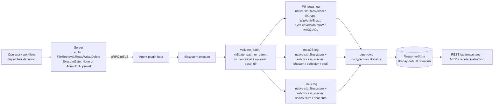

# filesystem

<!-- BEGIN GENERATED: plugin-doc-gen header -->
| | |
|---|---|
| **What it does** | Filesystem operations — exists, list_dir, file_hash, search_dir, text ops (admin-only) |
| **Version** | 0.4.0 |
| **Kind** | Action · mutating · gathered (device.filesystem.exists, device.filesystem.list_dir, device.filesystem.file_hash, device.filesystem.read, device.filesystem.create_temp, device.filesystem.create_temp_dir, device.filesystem.get_acl, device.filesystem.get_signature, device.filesystem.find_by_hash, device.filesystem.get_version_info, device.filesystem.search_dir, device.filesystem.search, device.filesystem.replace, device.filesystem.write_content, device.filesystem.append, device.filesystem.delete_lines, workflow.version_compliance_check) |
| **Platforms** | Windows ✅ · macOS ✅ · Linux ✅ |
| **Actions** | `append` (definition `device.filesystem.append`) · `create_temp` (definition `device.filesystem.create_temp`) · `create_temp_dir` (definition `device.filesystem.create_temp_dir`) · `delete_lines` (definition `device.filesystem.delete_lines`) · `exists` (definition `device.filesystem.exists`) · `file_hash` (definition `device.filesystem.file_hash`) · `find_by_hash` (definition `device.filesystem.find_by_hash`) · `get_acl` (definition `device.filesystem.get_acl`) · `get_signature` (definition `device.filesystem.get_signature`) · `get_version_info` (definition `device.filesystem.get_version_info`, `workflow.version_compliance_check`) · `list_dir` (definition `device.filesystem.list_dir`) · `read` (definition `device.filesystem.read`) · `replace` (definition `device.filesystem.replace`, `workflow.config_search_and_replace`) · `search` (definition `device.filesystem.search`) · `search_dir` (definition `device.filesystem.search_dir`) · `write_content` (definition `device.filesystem.write_content`) |
| **Security** | `exists`: securable `FileRetrieval` · operation Read · risk Low · dispatch ReadOnly · approval gate None; `list_dir`: securable `FileRetrieval` · operation Read · risk Low · dispatch ReadOnly · approval gate None; `file_hash`: securable `FileRetrieval` · operation Read · risk Low · dispatch ReadOnly · approval gate None; `create_temp`: securable `FileRetrieval` · operation Write · risk Medium · dispatch Mutating · approval gate AdminOrApproval; `create_temp_dir`: securable `FileRetrieval` · operation Write · risk Medium · dispatch Mutating · approval gate AdminOrApproval; `read`: securable `FileRetrieval` · operation Read · risk Low · dispatch ReadOnly · approval gate None; `get_acl`: securable `FileRetrieval` · operation Read · risk Low · dispatch ReadOnly · approval gate None; `get_signature`: securable `FileRetrieval` · operation Read · risk Low · dispatch ReadOnly · approval gate None; `find_by_hash`: securable `FileRetrieval` · operation Read · risk Low · dispatch ReadOnly · approval gate AdminOrApproval; `search_dir`: securable `FileRetrieval` · operation Read · risk Low · dispatch ReadOnly · approval gate None; `get_version_info`: securable `FileRetrieval` · operation Read · risk Low · dispatch ReadOnly · approval gate None; `search`: securable `FileRetrieval` · operation Read · risk Low · dispatch ReadOnly · approval gate None; `replace`: securable `FileRetrieval` · operation Write · risk Medium · dispatch Mutating · approval gate AdminOrApproval; `write_content`: securable `FileRetrieval` · operation Write · risk Medium · dispatch Mutating · approval gate AdminOrApproval; `append`: securable `FileRetrieval` · operation Write · risk Medium · dispatch Mutating · approval gate AdminOrApproval; `delete_lines`: securable `FileRetrieval` · operation Delete · risk High · dispatch Destructive · approval gate AdminOrApproval |
| **Roles** | execute: `exists`: endpoint-admin, endpoint-operator; `list_dir`: endpoint-admin, endpoint-operator; `file_hash`: endpoint-admin, endpoint-operator; `read`: endpoint-admin, endpoint-operator; `create_temp`: endpoint-admin; `create_temp_dir`: endpoint-admin; `get_acl`: endpoint-admin, endpoint-operator; `get_signature`: endpoint-admin, endpoint-operator; `find_by_hash`: endpoint-admin; `get_version_info`: endpoint-admin, endpoint-operator; `search_dir`: endpoint-admin, endpoint-operator; `search`: endpoint-admin, endpoint-operator; `replace`: endpoint-admin; `write_content`: endpoint-admin; `append`: endpoint-admin; `delete_lines`: endpoint-admin; `replace`: endpoint-admin; `get_version_info`: endpoint-admin, endpoint-operator · author: content-author |
<!-- END GENERATED -->

## How it works

Every action funnels its `path`/`root`/`directory` parameter through `validate_path` or `validate_path_or_parent`, which resolve symlinks via `fs::canonical` and, when `base_dir` is set, refuse anything that resolves outside it (`filesystem_plugin.cpp:101-184`). Reads never touch the target; the four write actions (`replace`, `write_content` on an existing file, `delete_lines`) go through `atomic_write_file` — write to a same-directory temp file, then rename (`filesystem_plugin.cpp:391-415`) — while `append`, `create_temp`, `create_temp_dir`, and a fresh `write_content` open the target directly. `file_hash`/`find_by_hash` hash in-process via BCrypt on Windows (`compute_hash_win`, `filesystem_plugin.cpp:188-245`) and by exec'ing an absolute-path `sha256sum`/`sha1sum`/`shasum` through the bounded subprocess runner on POSIX, never a shell (`compute_hash_unix`, `filesystem_plugin.cpp:249-316`). `get_signature`/`get_version_info` are Windows/macOS-only: native `WinVerifyTrust`/`GetFileVersionInfoW` calls on Windows (`filesystem_plugin.cpp:1154-1206`, `:1389-1453`), `/usr/bin/codesign`/`/usr/bin/plutil` exec'd through the same runner on macOS, each preceded by a BR-006 immediate re-validate-before-exec check that narrows (but does not eliminate) a TOCTOU window (`filesystem_plugin.cpp:1206-1223`, `:1463-1483`); both report an honest unsupported/`not_available` result on Linux (`filesystem_plugin.cpp:1262-1265`, `:1550-1553`). `search_dir`/`search`/`replace` share a ReDoS guard that rejects nested-quantifier regexes (`has_nested_quantifiers`, `filesystem_plugin.cpp:322-345`); `search_dir`'s glob mode uses a hand-rolled matcher (`glob_match`, `filesystem_plugin.cpp:349-387`).

The plugin deliberately never calls a typed result-status setter — no `set_result_status`/`yuzu_ctx_set_result_status` call exists anywhere in `filesystem_plugin.cpp` — so every action's outcome is carried entirely in its pipe-delimited rows and return code; see *Result status* below. It also deliberately stops at line-range deletion and ACL *reads*: there is no whole-file delete, no rename, and no ACL/DACL *write* action anywhere in the action list.



## OS capability

<!-- BEGIN GENERATED: plugin-doc-gen capability -->
| Action | Windows | macOS | Linux |
|---|---|---|---|
| `append` | ✅ supported · rung 1 · std::ofstream | ✅ supported · rung 1 · std::ofstream | ✅ supported · rung 1 · std::ofstream |
| `create_temp` | ✅ supported · rung 1 · yuzu_create_temp_file | ✅ supported · rung 1 · yuzu_create_temp_file | ✅ supported · rung 1 · yuzu_create_temp_file |
| `create_temp_dir` | ✅ supported · rung 1 · yuzu_create_temp_dir | ✅ supported · rung 1 · yuzu_create_temp_dir | ✅ supported · rung 1 · yuzu_create_temp_dir |
| `delete_lines` | ✅ supported · rung 1 · atomic_write_file | ✅ supported · rung 1 · atomic_write_file | ✅ supported · rung 1 · atomic_write_file |
| `exists` | ✅ supported · rung 1 · std::filesystem | ✅ supported · rung 1 · std::filesystem | ✅ supported · rung 1 · std::filesystem |
| `file_hash` | ✅ supported · rung 1 · bcrypt | ✅ supported · rung 2 · subprocess_runner:shasum | ✅ supported · rung 2 · subprocess_runner:sha256sum/sha1sum |
| `find_by_hash` | ✅ supported · rung 1 · std::filesystem+bcrypt | ✅ supported · rung 2 · std::filesystem+subprocess_runner:shasum | ✅ supported · rung 2 · std::filesystem+subprocess_runner:sha256sum |
| `get_acl` | ✅ supported · rung 1 · win32_acl | 🟡 constrained · rung 1 · posix_stat | 🟡 constrained · rung 1 · posix_stat |
| `get_signature` | ✅ supported · rung 1 · wintrust | ✅ supported · rung 2 · subprocess_runner:codesign | ⛔ unsupported |
| `get_version_info` | ✅ supported · rung 1 · win32_version_info | ✅ supported · rung 2 · subprocess_runner:plutil | ⛔ unsupported |
| `list_dir` | ✅ supported · rung 1 · std::filesystem | ✅ supported · rung 1 · std::filesystem | ✅ supported · rung 1 · std::filesystem |
| `read` | ✅ supported · rung 1 · std::ifstream | ✅ supported · rung 1 · std::ifstream | ✅ supported · rung 1 · std::ifstream |
| `replace` | ✅ supported · rung 1 · atomic_write_file | ✅ supported · rung 1 · atomic_write_file | ✅ supported · rung 1 · atomic_write_file |
| `search` | ✅ supported · rung 1 · std::ifstream+std::regex | ✅ supported · rung 1 · std::ifstream+std::regex | ✅ supported · rung 1 · std::ifstream+std::regex |
| `search_dir` | ✅ supported · rung 1 · std::filesystem+std::regex | ✅ supported · rung 1 · std::filesystem+std::regex | ✅ supported · rung 1 · std::filesystem+std::regex |
| `write_content` | ✅ supported · rung 1 · atomic_write_file | ✅ supported · rung 1 · atomic_write_file | ✅ supported · rung 1 · atomic_write_file |

**Declared limits per leg** (descriptor fallback text, verbatim):

- **`get_acl` / macOS** — stat()-only basic owner/group/permission bits; no ACL/ACE enumeration
- **`get_acl` / Linux** — stat()-only basic owner/group/permission bits; no ACL/ACE enumeration
<!-- END GENERATED -->

## Privileges and prerequisites

| OS | Runs as | Extra grant needed | Measured | If the read is refused |
|---|---|---|---|---|
| Windows | **LocalSystem today** (`docs/agent-privilege-model.md:70`, tracked #1442; target is the virtual service account `NT SERVICE\YuzuAgent`) | None for any read action. `write_content`/`replace`/`append`/`delete_lines` against a path the running account cannot already write need that account to be an `Administrators` member; default install grants nothing (`docs/agent-privilege-model.md:118`) | 2026-09-07, bare metal, as `SYSTEM` (`docs/samples/windows.txt:1`) | a single `error\|<message>` line + return code 1 (e.g. `error\|GetNamedSecurityInfo failed (error N)`) — no typed status is set |
| macOS | **root** — the shipped LaunchDaemon has no `UserName` key (`docs/agent-privilege-model.md:14`) | None for any read action. Write actions against a path with no operator-authored per-path sudo entry are refused by the OS itself at `open()`/`rename()`; default install grants nothing (`docs/agent-privilege-model.md:118`) | 2026-09-07, bare metal, **unprivileged** at euid 501 (jsmith) — the capture ran through `LocalDispatcher`/`PluginHandle::load`, not the real root daemon (`docs/samples/macos.txt:1`) | same `error\|<message>` + rc 1 shape |
| Linux | `yuzu` unprivileged system account (`docs/agent-privilege-model.md:12,52`) | None for any read action. Write actions against system paths need an operator-authored per-path sudo entry; default install grants nothing (`docs/agent-privilege-model.md:118`) | 2026-09-07, container, as euid 0 (root) (`docs/samples/linux.txt:1`) — also not the least-privilege `yuzu` account | same `error\|<message>` + rc 1 shape |

Subprocesses: `shasum` (macOS) / `sha256sum`, `sha1sum` (Linux) for `file_hash`/`find_by_hash` (`filesystem_plugin.cpp:265-294`); `/usr/bin/codesign` for macOS `get_signature` (`filesystem_plugin.cpp:1232-1234`); `/usr/bin/plutil` for macOS `get_version_info` (`filesystem_plugin.cpp:1487-1496`) — every one invoked by absolute path with no shell, through `yuzu::agent::run_bounded_subprocess`. No network access on any OS.

## Data contract

### Inputs

<!-- BEGIN GENERATED: plugin-doc-gen inputs -->
| Definition | Parameter | Type | Required | Default | Constraints | Description |
|---|---|---|---|---|---|---|
| `device.filesystem.append` | `path` | string | yes | - | maxLength 4096 | The existing file to append content to. |
| `device.filesystem.append` | `content` | string | no | - | - | The text content to append to the file. |
| `device.filesystem.append` | `newline` | string | no | true | enum: true, false | If "true" (default), adds a newline before appended content when the file does not end with a newline character. Prevents content from being joined to the last existing line. |
| `device.filesystem.append` | `base_dir` | string | no | - | maxLength 4096 | Optional. Restricts access to files within this directory. |
| `device.filesystem.create_temp` | `prefix` | string | no | yuzu- | maxLength 64 | Prefix for the temp file name. |
| `device.filesystem.create_temp` | `suffix` | string | no | .tmp | maxLength 32 | Suffix/extension for the temp file name. |
| `device.filesystem.create_temp` | `directory` | string | no | - | maxLength 4096 | Optional. Create the temp file in this directory instead of the system default temp directory. |
| `device.filesystem.create_temp` | `persist` | string | no | true | enum: true, false | If "true" (default), the file is kept. If "false", the file is deleted after creation (useful for generating unique paths). |
| `device.filesystem.create_temp_dir` | `prefix` | string | no | yuzu- | maxLength 64 | Prefix for the temp directory name. |
| `device.filesystem.create_temp_dir` | `directory` | string | no | - | maxLength 4096 | Optional. Create the temp directory inside this parent instead of the system default temp directory. |
| `device.filesystem.create_temp_dir` | `persist` | string | no | true | enum: true, false | If "true" (default), the directory is kept. If "false", deleted after creation. |
| `device.filesystem.delete_lines` | `path` | string | yes | - | maxLength 4096 | The text file to delete lines from. |
| `device.filesystem.delete_lines` | `start_line` | int32 | yes | - | minimum 1 | The first line to delete (1-based, inclusive). |
| `device.filesystem.delete_lines` | `end_line` | int32 | yes | - | minimum 1 | The last line to delete (1-based, inclusive). Clamped to total line count if it exceeds file length. |
| `device.filesystem.delete_lines` | `base_dir` | string | no | - | maxLength 4096 | Optional. Restricts access to files within this directory. |
| `device.filesystem.exists` | `path` | string | yes | - | maxLength 4096 | The filesystem path to check. |
| `device.filesystem.exists` | `base_dir` | string | no | - | maxLength 4096 | Optional. If set, the path must resolve within this directory. Prevents directory traversal outside the allowed subtree. |
| `device.filesystem.file_hash` | `path` | string | yes | - | maxLength 4096 | The file to hash. |
| `device.filesystem.file_hash` | `algorithm` | string | no | sha256 | enum: sha256, sha1 | The hash algorithm to use. |
| `device.filesystem.file_hash` | `base_dir` | string | no | - | maxLength 4096 | Optional. Restricts access to files within this directory. |
| `device.filesystem.find_by_hash` | `directory` | string | yes | - | maxLength 4096 | The root directory to search. |
| `device.filesystem.find_by_hash` | `sha256` | string | yes | - | minLength 64 · maxLength 64 | The SHA256 hex digest to search for (case-insensitive). |
| `device.filesystem.find_by_hash` | `max_depth` | int32 | no | 3 | minimum 1 · maximum 10 | Maximum directory recursion depth. Default: 3, max: 10. |
| `device.filesystem.get_acl` | `path` | string | yes | - | maxLength 4096 | The file or directory to inspect. |
| `device.filesystem.get_acl` | `base_dir` | string | no | - | maxLength 4096 | Optional. Restricts access to paths within this directory. |
| `device.filesystem.get_signature` | `path` | string | yes | - | maxLength 4096 | The executable, DLL, or app bundle to verify. |
| `device.filesystem.get_signature` | `base_dir` | string | no | - | maxLength 4096 | Optional. Restricts access to files within this directory. |
| `device.filesystem.get_version_info` | `path` | string | yes | - | maxLength 4096 | The executable, DLL, or app bundle to inspect. On macOS this may be a .app bundle directory or an Info.plist file directly. |
| `device.filesystem.get_version_info` | `base_dir` | string | no | - | maxLength 4096 | Optional. Restricts access to files within this directory. |
| `device.filesystem.list_dir` | `path` | string | yes | - | maxLength 4096 | The directory to list. |
| `device.filesystem.list_dir` | `base_dir` | string | no | - | maxLength 4096 | Optional. Restricts access to paths within this directory. |
| `device.filesystem.read` | `path` | string | yes | - | maxLength 4096 | The text file to read. |
| `device.filesystem.read` | `offset` | int32 | no | 1 | minimum 1 | 1-based line number to start reading from. Default: 1. |
| `device.filesystem.read` | `limit` | int32 | no | 100 | minimum 1 · maximum 10000 | Maximum number of lines to return. Default: 100, max: 10000. |
| `device.filesystem.read` | `base_dir` | string | no | - | maxLength 4096 | Optional. Restricts access to files within this directory. |
| `device.filesystem.replace` | `path` | string | yes | - | maxLength 4096 | The file to perform find/replace on. |
| `device.filesystem.replace` | `search` | string | yes | - | maxLength 256 | The literal string or regex to search for. |
| `device.filesystem.replace` | `replacement` | string | no |  | - | The text to replace matches with. Empty string removes matches. |
| `device.filesystem.replace` | `regex` | string | no | false | enum: true, false | If "true", interpret search as an ECMAScript regex. Default: "false". |
| `device.filesystem.replace` | `case_sensitive` | string | no | true | enum: true, false | If "true" (default), match is case-sensitive. |
| `device.filesystem.replace` | `dry_run` | string | no | false | enum: true, false | If "true", count replacements without modifying the file. Default: "false". |
| `device.filesystem.replace` | `max_replacements` | int32 | no | 0 | minimum 0 | Maximum number of replacements to perform. 0 = unlimited. Default: 0. |
| `device.filesystem.replace` | `base_dir` | string | no | - | maxLength 4096 | Optional. Restricts access to files within this directory. |
| `device.filesystem.search` | `path` | string | yes | - | maxLength 4096 | The text file to search. |
| `device.filesystem.search` | `pattern` | string | yes | - | maxLength 256 | The literal string or regex to search for in each line. |
| `device.filesystem.search` | `regex` | string | no | false | enum: true, false | If "true", interpret the pattern as an ECMAScript regex. Patterns with nested quantifiers are rejected to prevent catastrophic backtracking. Default: "false". |
| `device.filesystem.search` | `case_sensitive` | string | no | true | enum: true, false | If "true" (default), match is case-sensitive. If "false", performs case-insensitive matching. |
| `device.filesystem.search` | `max_matches` | int32 | no | 100 | minimum 1 · maximum 10000 | Maximum number of matching lines to return. Default: 100, max: 10000. |
| `device.filesystem.search` | `base_dir` | string | no | - | maxLength 4096 | Optional. Restricts access to files within this directory. |
| `device.filesystem.search_dir` | `root` | string | yes | - | maxLength 4096 | The root directory to search from. |
| `device.filesystem.search_dir` | `pattern` | string | yes | - | maxLength 256 | Glob pattern (default) or regex to match against entry names. Examples: "*.log", "config*", "^backup-\d+$" (with regex=true). |
| `device.filesystem.search_dir` | `regex` | string | no | false | enum: true, false | If "true", interpret the pattern as an ECMAScript regex instead of a glob. Default: "false". |
| `device.filesystem.search_dir` | `match_type` | string | no | directories | enum: directories, files, both | What to match: "directories" (default), "files", or "both". |
| `device.filesystem.search_dir` | `max_depth` | int32 | no | 5 | minimum 1 · maximum 20 | Maximum directory recursion depth. Default: 5, max: 20. |
| `device.filesystem.search_dir` | `max_results` | int32 | no | 100 | minimum 1 · maximum 1000 | Maximum number of matching entries to return. Default: 100, max: 1000. |
| `device.filesystem.search_dir` | `base_dir` | string | no | - | maxLength 4096 | Optional. Restricts the search root to paths within this directory. |
| `device.filesystem.write_content` | `path` | string | yes | - | maxLength 4096 | The file path to write to. If the file does not exist, it will be created if create=true. |
| `device.filesystem.write_content` | `content` | string | no | - | - | The text content to write to the file. |
| `device.filesystem.write_content` | `create` | string | no | false | enum: true, false | If "true", create the file if it does not exist. Default: "false". |
| `device.filesystem.write_content` | `overwrite` | string | no | false | enum: true, false | If "true", overwrite an existing file. Default: "false". |
| `device.filesystem.write_content` | `base_dir` | string | no | - | maxLength 4096 | Optional. Restricts access to files within this directory. |
| `workflow.config_search_and_replace` | `config_path` | string | yes | - | maxLength 4096 | Full path to the configuration file to update. Example: "/etc/myapp/config.ini" or "C:\ProgramData\MyApp\config.ini" |
| `workflow.config_search_and_replace` | `old_value` | string | yes | - | maxLength 256 | The current configuration value to search for. Matched literally (not regex) unless search_regex=true. |
| `workflow.config_search_and_replace` | `new_value` | string | yes | - | - | The new configuration value to replace matches with. |
| `workflow.config_search_and_replace` | `search_regex` | string | no | false | enum: true, false | If "true", interpret old_value as a regex pattern. Default: "false". |
| `workflow.config_search_and_replace` | `base_dir` | string | no | - | maxLength 4096 | Optional. Restricts access to files within this directory. |
| `workflow.version_compliance_check` | `executable_path` | string | yes | - | maxLength 4096 | Full path to the Windows executable to check. Example: "C:\Program Files\MyApp\myapp.exe" |
| `workflow.version_compliance_check` | `minimum_version` | string | no | - | maxLength 64 | The minimum acceptable product version string (e.g. "2.5.0.0"). Used by downstream PolicyFragment conditions for compliance evaluation. The check itself returns the raw version; the comparison happens in the policy layer using version_gte. |
| `workflow.version_compliance_check` | `base_dir` | string | no | - | maxLength 4096 | Optional. Restricts access to files within this directory. |
<!-- END GENERATED -->

### Outputs

Every action writes pipe-delimited `key|value` lines via `ctx.write_output()`. A *repeating* row (`list_dir`'s entries, Windows `get_acl`'s ACEs, `search`/`search_dir`/`find_by_hash`'s matches, `read`'s lines) is prefixed with a literal discriminator word naming the row's kind, then its fields; a single-value field is its own `key|value` line with no discriminator. There is no shared placeholder row for "found nothing" — a zero-hit action reports only its trailing count (`total_matches|0`, `matches_found|0`) with no rows above it. Failure is always a single `error|<message>` line plus a non-zero return code, never a placeholder success row (see *Result status*).

<!-- BEGIN GENERATED: plugin-doc-gen outputs -->
**`device.filesystem.append` — `status|bytes_appended|total_size`**

| Field | Type | Values | Available | Example | Description |
|---|---|---|---|---|---|
| `status` | string | `ok` | Windows, Linux, macOS | `ok` | Outcome of the append; the only value the plugin emits on success. |
| `bytes_appended` | int64 | - | Windows, Linux, macOS | `21` | Number of bytes appended, including an inserted newline separator when newline=true and the file did not already end with one. Values: integer (bytes). |
| `total_size` | int64 | - | Windows, Linux, macOS | `40` | Total file size in bytes after the append. Values: integer (bytes). |

**`device.filesystem.create_temp` — `path|persist`**

| Field | Type | Values | Available | Example | Description |
|---|---|---|---|---|---|
| `path` | string | - | Windows, Linux, macOS | `D:\yuzu-dev\tmp\yuzu-964a901bfe197402d93f51a7653b0697.tmp` | Full path to the created temporary file. Values: free text (path). |
| `persist` | bool | - | Windows, Linux, macOS | `true` | Echoes the persist parameter — whether the file was kept. |

**`device.filesystem.create_temp_dir` — `path|persist`**

| Field | Type | Values | Available | Example | Description |
|---|---|---|---|---|---|
| `path` | string | - | Windows, Linux, macOS | `D:\yuzu-dev\tmp\yuzu-3849a33da8fc555d407ac0f2c67356f9` | Full path to the created temporary directory. Values: free text (path). |
| `persist` | bool | - | Windows, Linux, macOS | `true` | Echoes the persist parameter — whether the directory was kept. |

**`device.filesystem.delete_lines` — `lines_deleted|lines_before|lines_after`**

| Field | Type | Values | Available | Example | Description |
|---|---|---|---|---|---|
| `lines_deleted` | int32 | - | Windows, Linux, macOS | `1` | Count of lines removed (end_line - start_line + 1, after end_line is clamped to the file's length). Values: integer. |
| `lines_before` | int32 | - | Windows, Linux, macOS | `2` | Declared here as lines_before, but the plugin's actual wire field is total_lines_before (filesystem_plugin.cpp:1998) — the file's total line count before the deletion. The emitted key does not match this column's declared name; see the filesystem plugin README Caveats. Values: integer. |
| `lines_after` | int32 | - | Windows, Linux, macOS | `1` | Declared here as lines_after, but the plugin's actual wire field is total_lines_after (filesystem_plugin.cpp:1999) — the file's total line count after the deletion. Same name mismatch as lines_before. Values: integer. |

**`device.filesystem.exists` — `exists|type|size`**

| Field | Type | Values | Available | Example | Description |
|---|---|---|---|---|---|
| `exists` | bool | - | Windows, Linux, macOS | `true` | Whether the path exists on the endpoint. |
| `type` | string | `file` `directory` `other` | Windows, Linux, macOS | `file` | The kind of filesystem entry found. Only emitted when exists is true. |
| `size` | int64 | - | Windows, Linux, macOS | `1405` | Size in bytes for a file entry; 0 for a directory or an "other" entry. Only emitted when exists is true. Values: integer (bytes). |

**`device.filesystem.file_hash` — `hash|algorithm|size`**

| Field | Type | Values | Available | Example | Description |
|---|---|---|---|---|---|
| `hash` | string | - | Windows, Linux, macOS | `9321feab332edbba521c7ea3eb978d9844cb4f62a4730dab9cf60fb79649037d` | Hex-encoded digest of the file's contents. Values: free text (hex digest). |
| `algorithm` | string | `sha256` `sha1` | Windows, Linux, macOS | `sha256` | The hash algorithm actually used. |
| `size` | int64 | - | Windows, Linux, macOS | `1405` | File size in bytes at the time of hashing. Values: integer (bytes). |

**`device.filesystem.find_by_hash` — `path|size|matches_found`**

| Field | Type | Values | Available | Example | Description |
|---|---|---|---|---|---|
| `path` | string | - | Windows, Linux, macOS | `C:\Windows\System32\drivers\etc\hosts` | Full path of a file whose SHA-256 matches the target hash. Values: free text (path). |
| `size` | int64 | - | Windows, Linux, macOS | `1405` | Matching file's size in bytes. Values: integer (bytes). |
| `matches_found` | int32 | - | Windows, Linux, macOS | `1` | Total number of matching files found, repeated on the trailing summary row. Values: integer. |

**`device.filesystem.get_acl` — `sddl|ace_type|account|access_mask|owner|group|permissions|mode`**

| Field | Type | Values | Available | Example | Description |
|---|---|---|---|---|---|
| `sddl` | string | - | Windows | `O:BAD:AI(A;;FA;;;SY)(A;ID;FA;;;SY)(A;ID;FA;;;BA)` | Windows-only. SDDL string encoding the owner and DACL. Absent on POSIX. Values: free text (SDDL). |
| `ace_type` | string | `allow` `deny` `other` | Windows | `allow` | Windows-only. One access-control-entry row's effect; the plugin emits one ace row per DACL entry. |
| `account` | string | - | Windows | `NT AUTHORITY\SYSTEM` | Windows-only. The DOMAIN\account the ACE names, or the SID string when the account cannot be resolved. Values: free text. |
| `access_mask` | string | - | Windows | `0x001f01ff` | Windows-only. The ACE's access mask, hex-formatted. Values: hex integer. |
| `owner` | string | - | Linux, macOS | `root` | POSIX-only. The file's owning user name, or the numeric uid when it cannot be resolved. Values: free text. |
| `group` | string | - | Linux, macOS | `wheel` | POSIX-only. The file's owning group name, or the numeric gid when it cannot be resolved. Values: free text. |
| `permissions` | string | - | Linux, macOS | `rw-r--r--` | POSIX-only. rwx permission string for owner/group/other. Values: 9-character rwx string. |
| `mode` | string | - | Linux, macOS | `0644` | POSIX-only. Octal permission bits. Values: 4-digit octal. |

**`device.filesystem.get_signature` — `signature_status`**

| Field | Type | Values | Available | Example | Description |
|---|---|---|---|---|---|
| `signature_status` | string | - | Windows, macOS | `unsigned` | Signature verdict. On Windows: valid/unsigned/distrusted/untrusted (Authenticode chain trust). On macOS: valid/unsigned/invalid/unknown — here `valid` means the code signature's seal is intact (INTEGRITY only: unmodified since signing), NOT that the code is trusted or notarized; an ad-hoc/self-signed binary reports `valid`. Values: windows: valid, unsigned, distrusted, untrusted, security_settings_blocked, error_0x<hex>; macos: valid, unsigned, invalid, unknown. |

**`device.filesystem.get_version_info` — `file_version|product_version|company_name|file_description|internal_name|original_filename|product_name|legal_copyright|version_status`**

| Field | Type | Values | Available | Example | Description |
|---|---|---|---|---|---|
| `file_version` | string | - | Windows, macOS | `6.2.26100.9278` | Windows: PE FileVersion (four-part). macOS: CFBundleVersion, the build number. Absent when not carried by the target. Values: free text (version string). |
| `product_version` | string | - | Windows, macOS | `10.0.26100.9278` | Windows: PE ProductVersion (four-part). macOS: CFBundleShortVersionString, the marketing version. Absent when not carried by the target. Values: free text (version string). |
| `company_name` | string | - | Windows | `Microsoft Corporation` | Windows-only. PE CompanyName string resource, when present. Values: free text. |
| `file_description` | string | - | Windows | `Notepad` | Windows-only. PE FileDescription string resource, when present. Values: free text. |
| `internal_name` | string | - | Windows | `Notepad` | Windows-only. PE InternalName string resource, when present. Values: free text. |
| `original_filename` | string | - | Windows | `NOTEPAD.EXE.MUI` | Windows-only. PE OriginalFilename string resource, when present. Values: free text. |
| `product_name` | string | - | Windows | `Microsoft® Windows® Operating System` | Windows-only. PE ProductName string resource, when present. Values: free text. |
| `legal_copyright` | string | - | Windows | `© Microsoft Corporation. All rights reserved.` | Windows-only. PE LegalCopyright string resource, when present. Values: free text. |
| `version_status` | string | `not_available` | macOS | `not_available` | macOS-only honest-empty marker: emitted as not_available when the target has no Info.plist or no version keys within it; absent otherwise (Windows never emits this field). |

**`device.filesystem.list_dir` — `entry_name|entry_type|entry_size`**

| Field | Type | Values | Available | Example | Description |
|---|---|---|---|---|---|
| `entry_name` | string | - | Windows, Linux, macOS | `hosts` | Filename of one directory entry (not a full path). Values: free text. |
| `entry_type` | string | `file` `directory` `symlink` `other` | Windows, Linux, macOS | `file` | The entry's kind. |
| `entry_size` | int64 | - | Windows, Linux, macOS | `1405` | Size in bytes; 0 for directories and symlinks. Values: integer (bytes). |

**`device.filesystem.read` — `line_number|content|total_lines|file_size`**

| Field | Type | Values | Available | Example | Description |
|---|---|---|---|---|---|
| `line_number` | int32 | - | Windows, Linux, macOS | `1` | 1-based line number of this returned line. Values: integer. |
| `content` | string | - | Windows, Linux, macOS | `# Copyright (c) 1993-2009 Microsoft Corp.` | The line's text, with a trailing CRLF's carriage return stripped. Values: free text. |
| `total_lines` | int32 | - | Windows, Linux, macOS | `37` | Total number of lines in the file, counted past the returned window. Values: integer. |
| `file_size` | int64 | - | Windows, Linux, macOS | `1405` | File size in bytes. Values: integer (bytes). |

**`device.filesystem.replace` — `replacements_made|file_size_before|file_size_after|dry_run`**

| Field | Type | Values | Available | Example | Description |
|---|---|---|---|---|---|
| `replacements_made` | int32 | - | Windows, Linux, macOS | `2` | Count of replacements performed (or that would be performed, when dry_run=true). Values: integer. |
| `file_size_before` | int64 | - | Windows, Linux, macOS | `42` | File size in bytes before the replace. Values: integer (bytes). |
| `file_size_after` | int64 | - | Windows, Linux, macOS | `18` | File size in bytes after the replace. Values: integer (bytes). |
| `dry_run` | bool | - | Windows, Linux, macOS | `not observed in any capture (every capture ran with dry_run=false)` | Present and true only when dry_run=true was requested; the plugin omits this line entirely otherwise. Values: true (field absent when dry_run=false). |

**`device.filesystem.search` — `line_number|content|total_matches`**

| Field | Type | Values | Available | Example | Description |
|---|---|---|---|---|---|
| `line_number` | int32 | - | Windows, Linux, macOS | `19` | 1-based line number of a matching line. Values: integer. |
| `content` | string | - | Windows, Linux, macOS | `# localhost name resolution is handled within DNS itself.` | Full text of the matching line, with a trailing carriage return stripped. Values: free text. |
| `total_matches` | int32 | - | Windows, Linux, macOS | `3` | Count of matching lines returned in this result, capped by max_matches. Values: integer. |

**`device.filesystem.search_dir` — `path|entry_type|total_matches`**

| Field | Type | Values | Available | Example | Description |
|---|---|---|---|---|---|
| `path` | string | - | Windows, Linux, macOS | `not observed in any capture (every platform's capture returned total_matches\|0 with no result rows)` | Absolute path of a matched file or directory. |
| `entry_type` | string | `file` `directory` | Windows, Linux, macOS | `not observed in any capture (every platform's capture returned total_matches\|0 with no result rows)` | Whether the matched entry is a file or a directory, as classified by match_type. |
| `total_matches` | int32 | - | Windows, Linux, macOS | `0` | Count of matching entries returned in this result, capped by max_results. Values: integer. |

**`device.filesystem.write_content` — `status|bytes_written|path`**

| Field | Type | Values | Available | Example | Description |
|---|---|---|---|---|---|
| `status` | string | `ok` | Windows, Linux, macOS | `ok` | Outcome of the write; the only value the plugin emits on success. |
| `bytes_written` | int64 | - | Windows, Linux, macOS | `20` | Number of bytes written to the file. Values: integer (bytes). |
| `path` | string | - | Windows, Linux, macOS | `C:\Windows\Temp\yuzu_capture_bs7ucomo\yuzu_capture_tmp.txt` | Canonicalized path that was written. |

**`workflow.config_search_and_replace` — `replacements_made|file_size_before|file_size_after`**

| Field | Type | Values | Available | Example | Description |
|---|---|---|---|---|---|
| `replacements_made` | int32 | - | all | - | - |
| `file_size_before` | int64 | - | all | - | - |
| `file_size_after` | int64 | - | all | - | - |

**`workflow.version_compliance_check` — `file_version|product_version|company_name|product_name|file_description`**

| Field | Type | Values | Available | Example | Description |
|---|---|---|---|---|---|
| `file_version` | string | - | all | - | - |
| `product_version` | string | - | all | - | - |
| `company_name` | string | - | all | - | - |
| `product_name` | string | - | all | - | - |
| `file_description` | string | - | all | - | - |
<!-- END GENERATED -->

### Result status

This plugin does not set a typed result status — no `set_result_status`/`yuzu_ctx_set_result_status` call exists in `filesystem_plugin.cpp` — so the agent records `UNDECLARED`, and every sample capture below shows `UNDECLARED / UNKNOWN /`. A refusal (bad path, missing parameter, wrong file type, tool failure) is instead reported as a single `error|<message>` output line with return code 1; a caller must parse that line, not a status field, to detect failure.

### Where the data goes

- **Instruction result only.** Rows travel over the agent's mTLS gRPC channel as the command response and land in the ResponseStore (90-day default retention, `server/core/src/response_store.hpp:8,152`), queryable at `/api/responses/{id}`.
- **Not consumed by** daily-sync inventory, the TAR warehouse, DEX, or metrics — grepping the server tree for `device.filesystem.` and for the plugin name outside the capability catalogue and generic result-parsing table (`server/core/src/result_parsing.hpp:66`) finds no sync-source, TAR, or DEX consumer. Nothing runs on a schedule; the plugin executes only when an operator or workflow dispatches one of its 16 definitions.
- **Sensitivity.** `get_acl` rows carry local account names (POSIX `owner`/`group`, Windows ACE `account` — potentially real usernames, not just built-in principals) and `get_version_info`/`get_signature` rows name specific installed software (`company_name`, `product_name`, `file_description`) — an installed-software inventory by another route; every action's `path`/`content` fields carry whatever the operator pointed at, which can include usernames embedded in home-directory paths or arbitrary personal data in file contents.
- **Siblings:** `filesystem_posture.mounts`/`.quotas`/`.snapshots` — a separate, similarly-named, read-only plugin (mount/quota/snapshot inventory only; no read-file, hash, or write actions) — do not confuse the two (see Caveats). Two shipped workflow definitions chain this plugin's actions: `workflow.config_search_and_replace` (`content/definitions/t2_chaining_examples.yaml:15`) searches a config file then dispatches `filesystem.replace`, and `workflow.version_compliance_check` (`content/definitions/t2_chaining_examples.yaml:206`) dispatches `filesystem.get_version_info` and compares the result against a minimum version.
- **MCP / REST.** Discover: `discover_plugins` (summary) → `yuzu://plugin-docs` (this page as data) → `discover_instructions` / `get_definition("device.filesystem.file_hash")`. Run: `execute_instruction {definition_id, parameters}`. Read: `/api/responses/{id}`.

## Sample output

<!-- BEGIN GENERATED: plugin-doc-gen samples -->
**Windows** — captured: windows Microsoft Windows NT 10.0.26200.0 x64 · bare-metal · 2026-09-07 · SYSTEM · leg-hash 4db605b6c689

```
== action=exists path=C:\Windows\System32\drivers\etc\hosts
exists|true
type|file
size|1432
[result_status] UNDECLARED / UNKNOWN

== action=list_dir path=C:\Windows\System32\drivers\etc
entry|hosts|file|1432
entry|hosts.ics|file|444
entry|lmhosts.sam|file|3683
entry|networks|file|407
entry|protocol|file|1358
entry|services|file|17635
[result_status] UNDECLARED / UNKNOWN

== action=file_hash path=C:\Windows\System32\drivers\etc\hosts
hash|904287aa347ca8218ad8b694c173b038ff2faf684e94deeb6094ce4b43e40d35
algorithm|sha256
size|1432
[result_status] UNDECLARED / UNKNOWN

== action=create_temp
path|D:\yuzu-dev\tmp\yuzu-14298277ed7220950c97d6a97a2e8180.tmp
persist|true
[result_status] UNDECLARED / UNKNOWN

== action=create_temp_dir
path|D:\yuzu-dev\tmp\yuzu-2342ff50ffda6cdc156dbde1418407c0
persist|true
[result_status] UNDECLARED / UNKNOWN

== action=read path=C:\Windows\System32\drivers\etc\hosts
line|1|# Copyright (c) 1993-2009 Microsoft Corp.
line|2|#
line|3|# This is a sample HOSTS file used by Microsoft TCP/IP for Windows.
line|4|#
line|5|# This file contains the mappings of IP addresses to host names. Each
line|6|# entry should be kept on an individual line. The IP address should
line|7|# be placed in the first column followed by the corresponding host name.
line|8|# The IP address and the host name should be separated by at least one
line|9|# space.
line|10|#
line|11|# Additionally, comments (such as these) may be inserted on individual
line|12|# lines or following the machine name denoted by a '#' symbol.
… 12 of 39 rows shown
[result_status] UNDECLARED / UNKNOWN

== action=get_acl path=C:\Windows\System32\drivers\etc\hosts
sddl|O:BAD:AI(A;;FA;;;SY)(A;ID;FA;;;SY)(A;ID;FA;;;BA)(A;ID;0x1200a9;;;BU)(A;ID;0x1200a9;;;AC)(A;ID;0x1200a9;;;S-1-15-2-2)
ace|allow|NT AUTHORITY\SYSTEM|0x001f01ff
ace|allow|NT AUTHORITY\SYSTEM|0x001f01ff
ace|allow|BUILTIN\Administrators|0x001f01ff
ace|allow|BUILTIN\Users|0x001200a9
ace|allow|APPLICATION PACKAGE AUTHORITY\ALL APPLICATION PACKAGES|0x001200a9
ace|allow|APPLICATION PACKAGE AUTHORITY\ALL RESTRICTED APP PACKAGES|0x001200a9
[result_status] UNDECLARED / UNKNOWN

== action=get_signature path=C:\Windows\System32\notepad.exe
signature_status|unsigned
[result_status] UNDECLARED / UNKNOWN

== action=find_by_hash directory=C:\Windows\System32\drivers\etc sha256=904287aa347ca8218ad8b694c173b038ff2faf684e94deeb6094ce4b43e40d35
match|C:\Windows\System32\drivers\etc\hosts|1432
matches_found|1
[result_status] UNDECLARED / UNKNOWN

== action=search_dir root=C:\Windows\System32\drivers\etc pattern=*hosts*
total_matches|0
[result_status] UNDECLARED / UNKNOWN

== action=get_version_info path=C:\Windows\System32\notepad.exe
file_version|6.2.26100.9278
product_version|10.0.26100.9278
company_name|Microsoft Corporation
file_description|Notepad
internal_name|Notepad
original_filename|NOTEPAD.EXE.MUI
product_name|Microsoft® Windows® Operating System
legal_copyright|© Microsoft Corporation. All rights reserved.
[result_status] UNDECLARED / UNKNOWN

== action=search path=C:\Windows\System32\drivers\etc\hosts pattern=localhost
match|19|# localhost name resolution is handled within DNS itself.
match|20|#	127.0.0.1       localhost
match|21|#	::1             localhost
total_matches|3
[result_status] UNDECLARED / UNKNOWN

== action=replace path=C:\WINDOWS\TEMP\yuzu_capture_bs7ucomo\yuzu_capture_tmp.txt search=yuzu-capture replace=yuzu-replaced
replacements_made|2
file_size_before|42
file_size_after|18
[result_status] UNDECLARED / UNKNOWN

== action=write_content path=C:\WINDOWS\TEMP\yuzu_capture_bs7ucomo\yuzu_capture_tmp.txt content="yuzu-capture written" overwrite=true
status|ok
bytes_written|20
path|C:\Windows\Temp\yuzu_capture_bs7ucomo\yuzu_capture_tmp.txt
[result_status] UNDECLARED / UNKNOWN

== action=append path=C:\WINDOWS\TEMP\yuzu_capture_bs7ucomo\yuzu_capture_tmp.txt content="yuzu-capture appended"
status|ok
bytes_appended|22
total_size|20
[result_status] UNDECLARED / UNKNOWN

== action=delete_lines path=C:\WINDOWS\TEMP\yuzu_capture_bs7ucomo\yuzu_capture_tmp.txt start_line=1 end_line=1
lines_deleted|1
total_lines_before|2
total_lines_after|1
[result_status] UNDECLARED / UNKNOWN
```

**macOS** — captured: macos macOS 26.6.2 arm64 · bare-metal · 2026-09-07 · euid 501 (jsmith) · leg-hash 4db605b6c689

```
== action=exists path=/etc/hosts
exists|true
type|file
size|213
[result_status] UNDECLARED / UNKNOWN

== action=list_dir path=/etc
entry|manpaths|file|36
entry|rc.common|file|1560
entry|auto_master|file|195
entry|csh.login|file|121
entry|syslog.conf|file|96
entry|krb5.keytab|file|1946
entry|sudoers.d|directory|0
entry|ssl|directory|0
entry|csh.logout|file|39
entry|aliases.db|file|16384
entry|bashrc_Apple_Terminal|file|9293
entry|yuzu|directory|0
… 12 of 76 rows shown
[result_status] UNDECLARED / UNKNOWN

== action=file_hash path=/etc/hosts
hash|c7dd0e2ed261ce76d76f852596c5b54026b9a894fa481381ffd399b556c0e2da
algorithm|sha256
size|213
[result_status] UNDECLARED / UNKNOWN

== action=create_temp
path|/var/folders/hq/lc3t_rsx2blfc8rhys6kzh4r0000gn/T//yuzu-ayE16A.tmp
persist|true
[result_status] UNDECLARED / UNKNOWN

== action=create_temp_dir
path|/var/folders/hq/lc3t_rsx2blfc8rhys6kzh4r0000gn/T//yuzu-R7qEuY
persist|true
[result_status] UNDECLARED / UNKNOWN

== action=read path=/etc/hosts
line|1|##
line|2|# Host Database
line|3|#
line|4|# localhost is used to configure the loopback interface
line|5|# when the system is booting.  Do not change this entry.
line|6|##
line|7|127.0.0.1	localhost
line|8|255.255.255.255	broadcasthost
line|9|::1             localhost
total_lines|9
file_size|213
[result_status] UNDECLARED / UNKNOWN

== action=get_acl path=/etc/hosts
owner|root
group|wheel
permissions|rw-r--r--
mode|0644
[result_status] UNDECLARED / UNKNOWN

== action=get_signature path=/bin/ls
signature_status|valid
[result_status] UNDECLARED / UNKNOWN

== action=find_by_hash directory=/etc sha256=c7dd0e2ed261ce76d76f852596c5b54026b9a894fa481381ffd399b556c0e2da
match|/private/etc/hosts|213
matches_found|1
[result_status] UNDECLARED / UNKNOWN

== action=search_dir root=/etc pattern=*hosts*
total_matches|0
[result_status] UNDECLARED / UNKNOWN

== action=get_version_info path=/bin/ls
version_status|not_available
[result_status] UNDECLARED / UNKNOWN

== action=search path=/etc/hosts pattern=localhost
match|4|# localhost is used to configure the loopback interface
match|7|127.0.0.1	localhost
match|9|::1             localhost
total_matches|3
[result_status] UNDECLARED / UNKNOWN

== action=replace path=/var/folders/hq/lc3t_rsx2blfc8rhys6kzh4r0000gn/T/yuzu_capture_8s9wf1vr/yuzu_capture_tmp.txt search=yuzu-capture replace=yuzu-replaced
replacements_made|2
file_size_before|40
file_size_after|16
[result_status] UNDECLARED / UNKNOWN

== action=write_content path=/var/folders/hq/lc3t_rsx2blfc8rhys6kzh4r0000gn/T/yuzu_capture_8s9wf1vr/yuzu_capture_tmp.txt content="yuzu-capture written" overwrite=true
status|ok
bytes_written|20
path|/private/var/folders/hq/lc3t_rsx2blfc8rhys6kzh4r0000gn/T/yuzu_capture_8s9wf1vr/yuzu_capture_tmp.txt
[result_status] UNDECLARED / UNKNOWN

== action=append path=/var/folders/hq/lc3t_rsx2blfc8rhys6kzh4r0000gn/T/yuzu_capture_8s9wf1vr/yuzu_capture_tmp.txt content="yuzu-capture appended"
status|ok
bytes_appended|22
total_size|20
[result_status] UNDECLARED / UNKNOWN

== action=delete_lines path=/var/folders/hq/lc3t_rsx2blfc8rhys6kzh4r0000gn/T/yuzu_capture_8s9wf1vr/yuzu_capture_tmp.txt start_line=1 end_line=1
lines_deleted|1
total_lines_before|2
total_lines_after|1
[result_status] UNDECLARED / UNKNOWN
```

**Linux** — captured: linux Debian GNU/Linux 13 (trixie) aarch64 · container · 2026-09-07 · euid 0 · leg-hash 4db605b6c689

```
== action=exists path=/etc/hosts
exists|true
type|file
size|172
[result_status] UNDECLARED / UNKNOWN

== action=list_dir path=/etc
entry|nsswitch.conf|file|494
entry|update-motd.d|directory|0
entry|dpkg|directory|0
entry|skel|directory|0
entry|rc1.d|directory|0
entry|xattr.conf|file|681
entry|fstab|file|37
entry|logrotate.d|directory|0
entry|libaudit.conf|file|191
entry|os-release|file|286
entry|pam.d|directory|0
entry|issue.net|file|20
… 12 of 82 rows shown
[result_status] UNDECLARED / UNKNOWN

== action=file_hash path=/etc/hosts
hash|60aae00e788a173131b105d5694045ac736b668be86396d4991d1dbe3d70ef38
algorithm|sha256
size|172
[result_status] UNDECLARED / UNKNOWN

== action=create_temp
path|/tmp/yuzu-UPhb03.tmp
persist|true
[result_status] UNDECLARED / UNKNOWN

== action=create_temp_dir
path|/tmp/yuzu-7OcS9w
persist|true
[result_status] UNDECLARED / UNKNOWN

== action=read path=/etc/hosts
line|1|127.0.0.1	localhost
line|2|::1	localhost ip6-localhost ip6-loopback
line|3|fe00::	ip6-localnet
line|4|ff00::	ip6-mcastprefix
line|5|ff02::1	ip6-allnodes
line|6|ff02::2	ip6-allrouters
line|7|172.17.0.3	5bd4336fc14e
total_lines|7
file_size|172
[result_status] UNDECLARED / UNKNOWN

== action=get_acl path=/etc/hosts
owner|root
group|root
permissions|rw-r--r--
mode|0644
[result_status] UNDECLARED / UNKNOWN

== action=get_signature path=/bin/ls
error|code signature verification is not supported on this platform
[result_status] UNDECLARED / UNKNOWN
[rc] 1

== action=find_by_hash directory=/etc sha256=c7dd0e2ed261ce76d76f852596c5b54026b9a894fa481381ffd399b556c0e2da
matches_found|0
[result_status] UNDECLARED / UNKNOWN

== action=search_dir root=/etc pattern=*hosts*
total_matches|0
[result_status] UNDECLARED / UNKNOWN

== action=get_version_info path=/bin/ls
error|version info extraction is not supported on this platform
[result_status] UNDECLARED / UNKNOWN
[rc] 1

== action=search path=/etc/hosts pattern=localhost
match|1|127.0.0.1	localhost
match|2|::1	localhost ip6-localhost ip6-loopback
total_matches|2
[result_status] UNDECLARED / UNKNOWN

== action=replace path=/tmp/yuzu_capture/yuzu_capture_tmp.txt search=yuzu-capture replace=yuzu-replaced
replacements_made|2
file_size_before|40
file_size_after|16
[result_status] UNDECLARED / UNKNOWN

== action=write_content path=/tmp/yuzu_capture/yuzu_capture_tmp.txt content="yuzu-capture written" overwrite=true
status|ok
bytes_written|20
path|/tmp/yuzu_capture/yuzu_capture_tmp.txt
[result_status] UNDECLARED / UNKNOWN

== action=append path=/tmp/yuzu_capture/yuzu_capture_tmp.txt content="yuzu-capture appended"
status|ok
bytes_appended|21
total_size|40
[result_status] UNDECLARED / UNKNOWN

== action=delete_lines path=/tmp/yuzu_capture/yuzu_capture_tmp.txt start_line=1 end_line=1
lines_deleted|1
total_lines_before|2
total_lines_after|1
[result_status] UNDECLARED / UNKNOWN
```
<!-- END GENERATED -->

## Caveats and known gaps

1. **`executeRoles` in the YAML is advisory, not enforced.** Since #1398, raw dispatch authorizes on the compiled `(plugin,action)` pair's securable/operation plus its `ExecuteGate` — `permissions.executeRoles` in `InstructionDefinition` YAML is retired to documentation only (`changelog.d/1398-dispatch-approval-gate.security.md`). Do not treat the Roles row above as an access-control guarantee; the real gate is the Security row.
2. **`delete_lines`'s output field names don't match its own YAML.** The plugin emits `lines_deleted|total_lines_before|total_lines_after` (`filesystem_plugin.cpp:1997-1999`), but `content/definitions/t2_capabilities.yaml:571-576` declares `lines_deleted`/`lines_before`/`lines_after` — a genuine drift between the shipped result and its own schema. This README's Outputs table uses the runtime field names; `t2_capabilities.yaml` is out of this PR's ownership scope, so the mismatch is flagged here rather than silently "corrected" in either direction.
3. **`filesystem` and `filesystem_posture` are two different plugins with confusingly similar names.** `filesystem_posture` (`changelog.d/wave6-pr61b-filesystem-posture.added.md`) is a separate, read-only plugin for `mounts`/`quotas`/`snapshots`; two of its test files (`test_filesystem_posture_local_dispatcher.cpp`, `test_filesystem_posture_parsers.cpp`) sit alongside this plugin's own tests in `tests/unit/` and are easy to mistake for filesystem's own coverage. They are not — see *Source and tests*.
4. **No test loads the real built plugin through `LocalDispatcher`.** Unlike `filesystem_posture`'s dispatcher test, `test_filesystem_actions.cpp` and `test_filesystem_read.cpp` both replicate the plugin's helper logic (`validate_path`, `glob_match`, `atomic_write_file`, etc.) in the test TU's own anonymous namespace rather than linking or loading `filesystem.dylib`/`.so`/`.dll` (`tests/unit/test_filesystem_actions.cpp:12-13`, `tests/unit/test_filesystem_read.cpp:5-6`) — a regression in the real `.cpp` that the replica doesn't share would not be caught by these suites.
5. **macOS/Linux `get_signature`/`get_version_info`'s TOCTOU re-check is a narrowing, not a fix.** The BR-006 comments in the code say so explicitly: an unprivileged writer inside `base_dir` can still win a race between the re-validate call and codesign's/plutil's own `open()`, because both are path-based external tools (`filesystem_plugin.cpp:1206-1223`, `:1469-1483`). `base_dir` must not be writable by lower-privileged principals.

## Source and tests

<!-- BEGIN GENERATED: plugin-doc-gen source -->
- Plugin: `agents/plugins/filesystem/src/filesystem_macos_sig.hpp` · `agents/plugins/filesystem/src/filesystem_plugin.cpp`
- Definitions: `content/definitions/filesystem.yaml` · `content/definitions/t2_capabilities.yaml` · `content/definitions/t2_chaining_examples.yaml`
- Capability rows: `server/core/src/capability_decls/plugin_action_catalogue_a.hpp`
- Tests: `tests/unit/test_filesystem_actions.cpp` · `tests/unit/test_filesystem_macos_sig.cpp` · `tests/unit/test_filesystem_posture_local_dispatcher.cpp` · `tests/unit/test_filesystem_posture_parsers.cpp` · `tests/unit/test_filesystem_read.cpp`
- Privilege row: `docs/agent-privilege-model.md`
- Changelog: `changelog.d/wave6-pr61b-filesystem-posture.added.md`
<!-- END GENERATED -->
