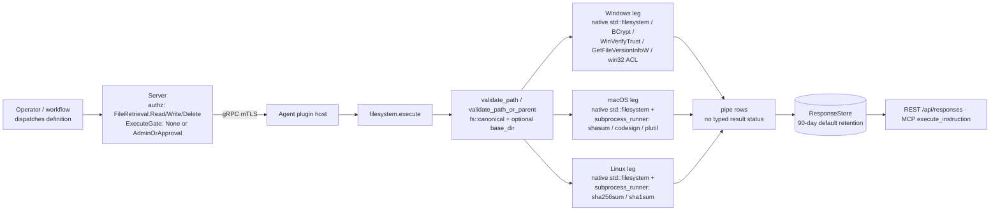

# filesystem

<!-- BEGIN GENERATED: plugin-doc-gen header -->
| | |
|---|---|
| **What it does** | Filesystem operations — exists, list_dir, file_hash, search_dir, text ops (admin-only) |
| **Version** | 0.4.0 |
| **Kind** | Action · read-only (10 actions) + mutating (6 actions: `create_temp`, `create_temp_dir`, `replace`, `write_content`, `append`, `delete_lines`) · on-demand (no scheduled gather) |
| **Platforms** | Windows ✅ · macOS 🟡 constrained (`get_acl`) · Linux 🟡 constrained/unsupported (`get_acl` constrained; `get_signature`, `get_version_info` unsupported) |
| **Actions** | `exists` (definition `device.filesystem.exists`) · `list_dir` (`device.filesystem.list_dir`) · `file_hash` (`device.filesystem.file_hash`) · `create_temp` (`device.filesystem.create_temp`) · `create_temp_dir` (`device.filesystem.create_temp_dir`) · `read` (`device.filesystem.read`) · `get_acl` (`device.filesystem.get_acl`) · `get_signature` (`device.filesystem.get_signature`) · `find_by_hash` (`device.filesystem.find_by_hash`) · `search_dir` (`device.filesystem.search_dir`) · `get_version_info` (`device.filesystem.get_version_info`) · `search` (`device.filesystem.search`) · `replace` (`device.filesystem.replace`) · `write_content` (`device.filesystem.write_content`) · `append` (`device.filesystem.append`) · `delete_lines` (`device.filesystem.delete_lines`) |
| **Security** | securable `FileRetrieval` · operation Read (`exists`, `list_dir`, `file_hash`, `read`, `get_acl`, `get_signature`, `search_dir`, `get_version_info`, `search` — auto-approved; `find_by_hash` — Read but admin-gated) / Write (`create_temp`, `create_temp_dir`, `append` — Reversible; `replace`, `write_content` — Irreversible) / Delete (`delete_lines` — Irreversible) · risk Low (reads) / Medium (writes) / High (`delete_lines`) · dispatch ReadOnly / Mutating / Destructive (`delete_lines`) · approval gate None (9 auto reads) / AdminOrApproval (`find_by_hash`, `create_temp`, `create_temp_dir`, `replace`, `write_content`, `append`, `delete_lines`) |
| **Roles** | execute: endpoint-admin, endpoint-operator (auto-approved reads) · endpoint-admin only (`create_temp`, `create_temp_dir`, `find_by_hash`, `replace`, `write_content`, `append`, `delete_lines`) · author: content-author |
<!-- END GENERATED -->

## How it works

Every action funnels its `path`/`root`/`directory` parameter through `validate_path` or `validate_path_or_parent`, which resolve symlinks via `fs::canonical` and, when `base_dir` is set, refuse anything that resolves outside it (`filesystem_plugin.cpp:101-184`). Reads never touch the target; the four write actions (`replace`, `write_content` on an existing file, `delete_lines`) go through `atomic_write_file` — write to a same-directory temp file, then rename (`filesystem_plugin.cpp:391-415`) — while `append`, `create_temp`, `create_temp_dir`, and a fresh `write_content` open the target directly. `file_hash`/`find_by_hash` hash in-process via BCrypt on Windows (`compute_hash_win`, `filesystem_plugin.cpp:188-245`) and by exec'ing an absolute-path `sha256sum`/`sha1sum`/`shasum` through the bounded subprocess runner on POSIX, never a shell (`compute_hash_unix`, `filesystem_plugin.cpp:249-316`). `get_signature`/`get_version_info` are Windows/macOS-only: native `WinVerifyTrust`/`GetFileVersionInfoW` calls on Windows (`filesystem_plugin.cpp:1154-1206`, `:1389-1453`), `/usr/bin/codesign`/`/usr/bin/plutil` exec'd through the same runner on macOS, each preceded by a BR-006 immediate re-validate-before-exec check that narrows (but does not eliminate) a TOCTOU window (`filesystem_plugin.cpp:1206-1223`, `:1463-1483`); both report an honest unsupported/`not_available` result on Linux (`filesystem_plugin.cpp:1262-1265`, `:1550-1553`). `search_dir`/`search`/`replace` share a ReDoS guard that rejects nested-quantifier regexes (`has_nested_quantifiers`, `filesystem_plugin.cpp:322-345`); `search_dir`'s glob mode uses a hand-rolled matcher (`glob_match`, `filesystem_plugin.cpp:349-387`).

The plugin deliberately never calls a typed result-status setter — no `set_result_status`/`yuzu_ctx_set_result_status` call exists anywhere in `filesystem_plugin.cpp` — so every action's outcome is carried entirely in its pipe-delimited rows and return code; see *Result status* below. It also deliberately stops at line-range deletion and ACL *reads*: there is no whole-file delete, no rename, and no ACL/DACL *write* action anywhere in the action list.



## OS capability

<!-- BEGIN GENERATED: plugin-doc-gen capability -->
| Action | Windows | macOS | Linux |
|---|---|---|---|
| `exists` | ✅ supported · rung 1 · `std::filesystem` | ✅ supported · rung 1 · `std::filesystem` | ✅ supported · rung 1 · `std::filesystem` |
| `list_dir` | ✅ supported · rung 1 · `std::filesystem` | ✅ supported · rung 1 · `std::filesystem` | ✅ supported · rung 1 · `std::filesystem` |
| `file_hash` | ✅ supported · rung 1 · `bcrypt` | ✅ supported · rung 2 · `subprocess_runner:shasum` | ✅ supported · rung 2 · `subprocess_runner:sha256sum/sha1sum` |
| `create_temp` | ✅ supported · rung 1 · `yuzu_create_temp_file` | ✅ supported · rung 1 · `yuzu_create_temp_file` | ✅ supported · rung 1 · `yuzu_create_temp_file` |
| `create_temp_dir` | ✅ supported · rung 1 · `yuzu_create_temp_dir` | ✅ supported · rung 1 · `yuzu_create_temp_dir` | ✅ supported · rung 1 · `yuzu_create_temp_dir` |
| `read` | ✅ supported · rung 1 · `std::ifstream` | ✅ supported · rung 1 · `std::ifstream` | ✅ supported · rung 1 · `std::ifstream` |
| `get_acl` | ✅ supported · rung 1 · `win32_acl` | 🟡 constrained · rung 1 · `posix_stat` | 🟡 constrained · rung 1 · `posix_stat` |
| `get_signature` | ✅ supported · rung 1 · `wintrust` | ✅ supported · rung 2 · `subprocess_runner:codesign` | ⛔ unsupported · no mechanism bound |
| `find_by_hash` | ✅ supported · rung 1 · `std::filesystem+bcrypt` | ✅ supported · rung 2 · `std::filesystem+subprocess_runner:shasum` | ✅ supported · rung 2 · `std::filesystem+subprocess_runner:sha256sum` |
| `search_dir` | ✅ supported · rung 1 · `std::filesystem+std::regex` | ✅ supported · rung 1 · `std::filesystem+std::regex` | ✅ supported · rung 1 · `std::filesystem+std::regex` |
| `get_version_info` | ✅ supported · rung 1 · `win32_version_info` | ✅ supported · rung 2 · `subprocess_runner:plutil` | ⛔ unsupported · no mechanism bound |
| `search` | ✅ supported · rung 1 · `std::ifstream+std::regex` | ✅ supported · rung 1 · `std::ifstream+std::regex` | ✅ supported · rung 1 · `std::ifstream+std::regex` |
| `replace` | ✅ supported · rung 1 · `atomic_write_file` | ✅ supported · rung 1 · `atomic_write_file` | ✅ supported · rung 1 · `atomic_write_file` |
| `write_content` | ✅ supported · rung 1 · `atomic_write_file` | ✅ supported · rung 1 · `atomic_write_file` | ✅ supported · rung 1 · `atomic_write_file` |
| `append` | ✅ supported · rung 1 · `std::ofstream` | ✅ supported · rung 1 · `std::ofstream` | ✅ supported · rung 1 · `std::ofstream` |
| `delete_lines` | ✅ supported · rung 1 · `atomic_write_file` | ✅ supported · rung 1 · `atomic_write_file` | ✅ supported · rung 1 · `atomic_write_file` |

**Declared limits per leg** (the descriptor's fallback text, verbatim):

None — every leg's `YuzuActionDescriptor` fallback field is `nullptr` (`filesystem_plugin.cpp:444-543`). The real per-OS constraints for `get_acl` (POSIX stat-only, no ACL/ACE enumeration), `get_signature`, and `get_version_info` (both unsupported on Linux) are carried in the definitions' own descriptions instead (`content/definitions/filesystem.yaml`) and are covered in *Caveats and known gaps* below.
<!-- END GENERATED -->

## Privileges and prerequisites

| OS | Runs as | Extra grant needed | Measured | If the read is refused |
|---|---|---|---|---|
| Windows | **LocalSystem today** (`docs/agent-privilege-model.md:70`, tracked #1442; target is the virtual service account `NT SERVICE\YuzuAgent`) | None for any read action. `write_content`/`replace`/`append`/`delete_lines` against a path the running account cannot already write need that account to be an `Administrators` member; default install grants nothing (`docs/agent-privilege-model.md:118`) | 2026-09-07, bare metal, as `SYSTEM` (`docs/samples/windows.txt:1`) | a single `error|<message>` line + return code 1 (e.g. `error|GetNamedSecurityInfo failed (error N)`) — no typed status is set |
| macOS | **root** — the shipped LaunchDaemon has no `UserName` key (`docs/agent-privilege-model.md:14`) | None for any read action. Write actions against a path with no operator-authored per-path sudo entry are refused by the OS itself at `open()`/`rename()`; default install grants nothing (`docs/agent-privilege-model.md:118`) | 2026-09-07, bare metal, **unprivileged** at euid 501 (alex) — the capture ran through `LocalDispatcher`/`PluginHandle::load`, not the real root daemon (`docs/samples/macos.txt:1`) | same `error|<message>` + rc 1 shape |
| Linux | `yuzu` unprivileged system account (`docs/agent-privilege-model.md:12,52`) | None for any read action. Write actions against system paths need an operator-authored per-path sudo entry; default install grants nothing (`docs/agent-privilege-model.md:118`) | 2026-09-07, container, as euid 0 (root) (`docs/samples/linux.txt:1`) — also not the least-privilege `yuzu` account | same `error|<message>` + rc 1 shape |

Subprocesses: `shasum` (macOS) / `sha256sum`, `sha1sum` (Linux) for `file_hash`/`find_by_hash` (`filesystem_plugin.cpp:265-294`); `/usr/bin/codesign` for macOS `get_signature` (`filesystem_plugin.cpp:1232-1234`); `/usr/bin/plutil` for macOS `get_version_info` (`filesystem_plugin.cpp:1487-1496`) — every one invoked by absolute path with no shell, through `yuzu::agent::run_bounded_subprocess`. No network access on any OS.

## Data contract

### Inputs

<!-- BEGIN GENERATED: plugin-doc-gen inputs -->
| Action | Parameter | Type | Required | Default | Description |
|---|---|---|---|---|---|
| `exists` | `path` | string | yes | — | The filesystem path to check. |
| `exists` | `base_dir` | string | no | — | Optional. If set, the path must resolve within this directory. |
| `list_dir` | `path` | string | yes | — | The directory to list. |
| `list_dir` | `base_dir` | string | no | — | Optional. Restricts access to paths within this directory. |
| `file_hash` | `path` | string | yes | — | The file to hash. |
| `file_hash` | `algorithm` | string | no | `sha256` | The hash algorithm to use (`sha256` or `sha1`). |
| `file_hash` | `base_dir` | string | no | — | Optional. Restricts access to files within this directory. |
| `create_temp` | `prefix` | string | no | `yuzu-` | Prefix for the temp file name. |
| `create_temp` | `suffix` | string | no | `.tmp` | Suffix/extension for the temp file name. |
| `create_temp` | `directory` | string | no | — | Optional. Create the temp file here instead of the system default temp dir. |
| `create_temp` | `persist` | string | no | `true` | If `true`, the file is kept; if `false`, deleted immediately after creation. |
| `create_temp_dir` | `prefix` | string | no | `yuzu-` | Prefix for the temp directory name. |
| `create_temp_dir` | `directory` | string | no | — | Optional. Create the temp directory inside this parent instead of the system default. |
| `create_temp_dir` | `persist` | string | no | `true` | If `true`, the directory is kept; if `false`, deleted immediately after creation. |
| `read` | `path` | string | yes | — | The text file to read. |
| `read` | `offset` | int32 | no | `1` | 1-based line number to start reading from. |
| `read` | `limit` | int32 | no | `100` | Maximum number of lines to return (max 10000). |
| `read` | `base_dir` | string | no | — | Optional. Restricts access to files within this directory. |
| `get_acl` | `path` | string | yes | — | The file or directory to inspect. |
| `get_acl` | `base_dir` | string | no | — | Optional. Restricts access to paths within this directory. |
| `get_signature` | `path` | string | yes | — | The executable, DLL, or app bundle to verify. |
| `get_signature` | `base_dir` | string | no | — | Optional. Restricts access to files within this directory. |
| `find_by_hash` | `directory` | string | yes | — | The root directory to search. |
| `find_by_hash` | `sha256` | string | yes | — | The SHA256 hex digest to search for (case-insensitive, exactly 64 chars). |
| `find_by_hash` | `max_depth` | int32 | no | `3` | Maximum directory recursion depth (max 10). |
| `search_dir` | `root` | string | yes | — | The root directory to search from. |
| `search_dir` | `pattern` | string | yes | — | Glob pattern (default) or regex to match against entry names. |
| `search_dir` | `regex` | string | no | `false` | If `true`, interpret `pattern` as an ECMAScript regex instead of a glob. |
| `search_dir` | `match_type` | string | no | `directories` | What to match: `directories`, `files`, or `both`. |
| `search_dir` | `max_depth` | int32 | no | `5` | Maximum directory recursion depth (max 20). |
| `search_dir` | `max_results` | int32 | no | `100` | Maximum number of matching entries to return (max 1000). |
| `search_dir` | `base_dir` | string | no | — | Optional. Restricts the search root to paths within this directory. |
| `get_version_info` | `path` | string | yes | — | The executable, DLL, or app bundle to inspect (macOS: `.app` dir or `Info.plist`). |
| `get_version_info` | `base_dir` | string | no | — | Optional. Restricts access to files within this directory. |
| `search` | `path` | string | yes | — | The text file to search. |
| `search` | `pattern` | string | yes | — | The literal string or regex to search for in each line. |
| `search` | `regex` | string | no | `false` | If `true`, interpret `pattern` as an ECMAScript regex. |
| `search` | `case_sensitive` | string | no | `true` | If `false`, performs case-insensitive matching. |
| `search` | `max_matches` | int32 | no | `100` | Maximum number of matching lines to return (max 10000). |
| `search` | `base_dir` | string | no | — | Optional. Restricts access to files within this directory. |
| `replace` | `path` | string | yes | — | The file to perform find/replace on. |
| `replace` | `search` | string | yes | — | The literal string or regex to search for. |
| `replace` | `replacement` | string | no | `""` | The text to replace matches with. Empty string removes matches. |
| `replace` | `regex` | string | no | `false` | If `true`, interpret `search` as an ECMAScript regex. |
| `replace` | `case_sensitive` | string | no | `true` | If `false`, performs case-insensitive matching. |
| `replace` | `dry_run` | string | no | `false` | If `true`, count replacements without modifying the file. |
| `replace` | `max_replacements` | int32 | no | `0` | Maximum number of replacements to perform. `0` = unlimited. |
| `replace` | `base_dir` | string | no | — | Optional. Restricts access to files within this directory. |
| `write_content` | `path` | string | yes | — | The file path to write to; created if `create=true`. |
| `write_content` | `content` | string | no | — | The text content to write to the file. |
| `write_content` | `create` | string | no | `false` | If `true`, create the file if it does not exist. |
| `write_content` | `overwrite` | string | no | `false` | If `true`, overwrite an existing file. |
| `write_content` | `base_dir` | string | no | — | Optional. Restricts access to files within this directory. |
| `append` | `path` | string | yes | — | The existing file to append content to. |
| `append` | `content` | string | no | — | The text content to append to the file. |
| `append` | `newline` | string | no | `true` | If `true`, adds a newline before appended content when the file lacks a trailing one. |
| `append` | `base_dir` | string | no | — | Optional. Restricts access to files within this directory. |
| `delete_lines` | `path` | string | yes | — | The text file to delete lines from. |
| `delete_lines` | `start_line` | int32 | yes | — | The first line to delete (1-based, inclusive). |
| `delete_lines` | `end_line` | int32 | yes | — | The last line to delete (1-based, inclusive; clamped to file length). |
| `delete_lines` | `base_dir` | string | no | — | Optional. Restricts access to files within this directory. |
<!-- END GENERATED -->

### Outputs

Every action writes pipe-delimited `key|value` lines via `ctx.write_output()`. A *repeating* row (`list_dir`'s entries, Windows `get_acl`'s ACEs, `search`/`search_dir`/`find_by_hash`'s matches, `read`'s lines) is prefixed with a literal discriminator word naming the row's kind, then its fields; a single-value field is its own `key|value` line with no discriminator. There is no shared placeholder row for "found nothing" — a zero-hit action reports only its trailing count (`total_matches|0`, `matches_found|0`) with no rows above it. Failure is always a single `error|<message>` line plus a non-zero return code, never a placeholder success row (see *Result status*).

<!-- BEGIN GENERATED: plugin-doc-gen outputs -->
**`exists` — `exists|type|size`** (`type`/`size` only appear when `exists` is `true`)

| Field | Type | Values | Available | Example |
|---|---|---|---|---|
| `exists` | bool | `true`/`false` | W, M, L | `true` |
| `type` | string | `file`/`directory`/`other` | W, M, L (only when exists) | `file` |
| `size` | int64 | integer (bytes) | W, M, L (only when exists) | `1405` |

**`list_dir` — `entry|entry_name|entry_type|entry_size`** (one row per directory entry)

| Field | Type | Values | Available | Example |
|---|---|---|---|---|
| `entry_name` | string | free text | W, M, L | `hosts` |
| `entry_type` | string | `file`/`directory`/`symlink`/`other` | W, M, L | `file` |
| `entry_size` | int64 | integer (bytes) | W, M, L | `1405` |

**`file_hash` — `hash|algorithm|size`**

| Field | Type | Values | Available | Example |
|---|---|---|---|---|
| `hash` | string | hex digest | W, M, L | `9321feab332edbba521c7ea3eb978d9844cb4f62a4730dab9cf60fb79649037d` |
| `algorithm` | string | `sha256`/`sha1` | W, M, L | `sha256` |
| `size` | int64 | integer (bytes) | W, M, L | `1405` |

**`create_temp` / `create_temp_dir` — `path|persist`** (plus an undeclared `cleanup|deleted` line when `persist=false`)

| Field | Type | Values | Available | Example |
|---|---|---|---|---|
| `path` | string | path | W, M, L | `D:\yuzu-dev\tmp\yuzu-964a901bfe197402d93f51a7653b0697.tmp` |
| `persist` | bool | `true`/`false` | W, M, L | `true` |

**`read` — `line|line_number|content`** (one row per returned line), then `total_lines|N`, `file_size|N`

| Field | Type | Values | Available | Example |
|---|---|---|---|---|
| `line_number` | int32 | integer | W, M, L | `1` |
| `content` | string | free text | W, M, L | `# Copyright (c) 1993-2009 Microsoft Corp.` |
| `total_lines` | int32 | integer | W, M, L | `37` |
| `file_size` | int64 | integer (bytes) | W, M, L | `1405` |

**`get_acl` — two shapes.** Windows: `sddl|<sddl>` (one line) then `ace|ace_type|account|access_mask` (one per DACL entry). POSIX: four independent `owner|`, `group|`, `permissions|`, `mode|` lines.

| Field | Type | Values | Available | Example |
|---|---|---|---|---|
| `sddl` | string | SDDL text | W only | `O:BAD:AI(A;;FA;;;SY)...` |
| `ace_type` | string | `allow`/`deny`/`other` | W only | `allow` |
| `account` | string | free text | W only | `NT AUTHORITY\SYSTEM` |
| `access_mask` | string | hex | W only | `0x001f01ff` |
| `owner` | string | free text | M, L only | `root` |
| `group` | string | free text | M, L only | `wheel` |
| `permissions` | string | 9-char rwx string | M, L only | `rw-r--r--` |
| `mode` | string | 4-digit octal | M, L only | `0644` |

**`get_signature` — `signature_status`**

| Field | Type | Values | Available | Example |
|---|---|---|---|---|
| `signature_status` | string | W: `valid`/`unsigned`/`distrusted`/`untrusted`/`security_settings_blocked`/`error_0x<hex>`; M: `valid`/`unsigned`/`invalid`/`unknown` | W, M | `unsigned` (W) / `valid` (M) |

**`find_by_hash` — `match|path|size`** (one per hit), then `matches_found|N`

| Field | Type | Values | Available | Example |
|---|---|---|---|---|
| `path` | string | path | W, M, L | `C:\Windows\System32\drivers\etc\hosts` |
| `size` | int64 | integer (bytes) | W, M, L | `1405` |
| `matches_found` | int32 | integer | W, M, L | `1` |

**`search_dir` — `result|path|entry_type`** (one per hit), then `total_matches|N`

| Field | Type | Values | Available | Example |
|---|---|---|---|---|
| `path` | string | path | W, M, L | (no hit in the capture; `total_matches\|0`) |
| `entry_type` | string | `file`/`directory` | W, M, L | `directory` |
| `total_matches` | int32 | integer | W, M, L | `0` |

**`get_version_info` — Windows: `file_version`, `product_version`, then optional `company_name`, `file_description`, `internal_name`, `original_filename`, `product_name`, `legal_copyright`. macOS: `version_status\|not_available`, or `product_version`/`file_version` (CFBundleShortVersionString/CFBundleVersion, respectively).**

| Field | Type | Values | Available | Example |
|---|---|---|---|---|
| `file_version` | string | version string | W, M | `6.2.26100.9278` |
| `product_version` | string | version string | W, M | `10.0.26100.9278` |
| `company_name` | string | free text | W only | `Microsoft Corporation` |
| `file_description` | string | free text | W only | `Notepad` |
| `internal_name` | string | free text | W only | `Notepad` |
| `original_filename` | string | free text | W only | `NOTEPAD.EXE.MUI` |
| `product_name` | string | free text | W only | `Microsoft® Windows® Operating System` |
| `legal_copyright` | string | free text | W only | `© Microsoft Corporation. All rights reserved.` |
| `version_status` | string | `not_available` | M only | `not_available` |

**`search` — `match|line_number|content`** (one per hit), then `total_matches|N`

| Field | Type | Values | Available | Example |
|---|---|---|---|---|
| `line_number` | int32 | integer | W, M, L | `1` |
| `content` | string | free text | W, M, L | `127.0.0.1	localhost` |
| `total_matches` | int32 | integer | W, M, L | `3` (W, M) / `2` (L — the container's `/etc/hosts` has fewer `localhost` lines) |

**`replace` — `replacements_made|file_size_before|file_size_after`** (plus `dry_run|true`, only present when `dry_run=true`)

| Field | Type | Values | Available | Example |
|---|---|---|---|---|
| `replacements_made` | int32 | integer | W, M, L | `2` |
| `file_size_before` | int64 | integer (bytes) | W, M, L | `42` |
| `file_size_after` | int64 | integer (bytes) | W, M, L | `18` |
| `dry_run` | bool | `true` (absent otherwise) | W, M, L | not present in any capture (all ran with `dry_run=false`) |

**`write_content` — `status|bytes_written|path`** on success; a single `error|<message>` line + rc 1 on refusal (e.g. `overwrite=false` against an existing file)

| Field | Type | Values | Available | Example |
|---|---|---|---|---|
| `status` | string | `ok` | W, M, L | `ok` |
| `bytes_written` | int64 | integer (bytes) | W, M, L | `20` |
| `path` | string | path | W, M, L | `C:\Windows\Temp\yuzu_capture_bs7ucomo\yuzu_capture_tmp.txt` |

**`append` — `status|bytes_appended|total_size`**

| Field | Type | Values | Available | Example |
|---|---|---|---|---|
| `status` | string | `ok` | W, M, L | `ok` |
| `bytes_appended` | int64 | integer (bytes) | W, M, L | `22` |
| `total_size` | int64 | integer (bytes) | W, M, L | `20` |

**`delete_lines` — `lines_deleted|total_lines_before|total_lines_after`** (see Caveats: the YAML declares `lines_before`/`lines_after`, but the plugin emits `total_lines_before`/`total_lines_after`)

| Field | Type | Values | Available | Example |
|---|---|---|---|---|
| `lines_deleted` | int32 | integer | W, M, L | `1` |
| `total_lines_before` | int32 | integer | W, M, L | `3` |
| `total_lines_after` | int32 | integer | W, M, L | `2` |
<!-- END GENERATED -->

### Result status

This plugin does not set a typed result status — no `set_result_status`/`yuzu_ctx_set_result_status` call exists in `filesystem_plugin.cpp` — so the agent records `UNDECLARED`, and every sample capture below shows `UNDECLARED / UNKNOWN /`. A refusal (bad path, missing parameter, wrong file type, tool failure) is instead reported as a single `error|<message>` output line with return code 1; a caller must parse that line, not a status field, to detect failure.

### Where the data goes

- **Instruction result only.** Rows travel over the agent's mTLS gRPC channel as the command response and land in the ResponseStore (90-day default retention, `server/core/src/response_store.hpp:8,152`), queryable at `/api/responses/{id}`.
- **Not consumed by** daily-sync inventory, the TAR warehouse, DEX, or metrics — grepping the server tree for `device.filesystem.` and for the plugin name outside the capability catalogue and generic result-parsing table (`server/core/src/result_parsing.hpp:66`) finds no sync-source, TAR, or DEX consumer. Nothing runs on a schedule; the plugin executes only when an operator or workflow dispatches one of its 16 definitions.
- **Siblings:** `filesystem_posture.mounts`/`.quotas`/`.snapshots` — a separate, similarly-named, read-only plugin (mount/quota/snapshot inventory only; no read-file, hash, or write actions) — do not confuse the two (see Caveats). Two shipped workflow definitions chain this plugin's actions: `workflow.config_search_and_replace` (`content/definitions/t2_chaining_examples.yaml:15`) searches a config file then dispatches `filesystem.replace`, and `workflow.version_compliance_check` (`content/definitions/t2_chaining_examples.yaml:206`) dispatches `filesystem.get_version_info` and compares the result against a minimum version.
- **MCP / REST.** Discover: `discover_plugins` (summary) → `yuzu://plugin-docs` (this page as data) → `discover_instructions` / `get_definition("device.filesystem.file_hash")`. Run: `execute_instruction {definition_id, parameters}`. Read: `/api/responses/{id}`.

## Sample output

<!-- BEGIN GENERATED: plugin-doc-gen samples -->
**Windows** — captured: windows Microsoft Windows NT 10.0.26200.0 x64 · bare-metal · 2026-09-07 · SYSTEM · leg-hash pending

```
== action=exists path=C:\Windows\System32\drivers\etc\hosts
exists|true
type|file
size|1405
[result_status] UNDECLARED / UNKNOWN / 

== action=list_dir path=C:\Windows\System32\drivers\etc
entry|hosts|file|1405
entry|hosts.ics|file|444
entry|lmhosts.sam|file|3683
entry|networks|file|407
entry|protocol|file|1358
entry|services|file|17635
[result_status] UNDECLARED / UNKNOWN / 

== action=file_hash path=C:\Windows\System32\drivers\etc\hosts
hash|9321feab332edbba521c7ea3eb978d9844cb4f62a4730dab9cf60fb79649037d
algorithm|sha256
size|1405
[result_status] UNDECLARED / UNKNOWN / 

== action=create_temp
path|D:\yuzu-dev\tmp\yuzu-14298277ed7220950c97d6a97a2e8180.tmp
persist|true
[result_status] UNDECLARED / UNKNOWN / 

== action=create_temp_dir
path|D:\yuzu-dev\tmp\yuzu-2342ff50ffda6cdc156dbde1418407c0
persist|true
[result_status] UNDECLARED / UNKNOWN / 

== action=read path=C:\Windows\System32\drivers\etc\hosts
line|1|# Copyright (c) 1993-2009 Microsoft Corp.
line|2|#
line|3|# This is a sample HOSTS file used by Microsoft TCP/IP for Windows.
line|4|#
line|5|# This file contains the mappings of IP addresses to host names. Each
line|6|# entry should be kept on an individual line. The IP address should
line|7|# be placed in the first column followed by the corresponding host name.
line|8|# The IP address and the host name should be separated by at least one
line|9|# space.
line|10|#
line|11|# Additionally, comments (such as these) may be inserted on individual
line|12|# lines or following the machine name denoted by a '#' symbol.
line|13|#
line|14|# For example:
line|15|#
line|16|#      102.54.94.97     rhino.acme.com          # source server
line|17|#       38.25.63.10     x.acme.com              # x client host
line|18|
line|19|# localhost name resolution is handled within DNS itself.
line|20|#	127.0.0.1       localhost
line|21|#	::1             localhost
line|22|# Added by Docker Desktop
line|23|192.168.0.131 host.docker.internal
line|24|192.168.0.131 gateway.docker.internal
line|25|# To allow the same kube context to work on the host and the container:
line|26|127.0.0.1 kubernetes.docker.internal
line|27|# End of section
line|28|# TailscaleHostsSectionStart
line|29|# This section contains MagicDNS entries for Tailscale.
line|30|# Do not edit this section manually.
line|31|
line|32|100.109.177.77 braga.tail128eb2.ts.net. braga
line|33|100.127.43.37 iphone.tail128eb2.ts.net. iphone
line|34|100.75.167.98 kyzi.tail128eb2.ts.net. kyzi
line|35|100.123.53.121 the-rig.tail128eb2.ts.net. the-rig
line|36|
line|37|# TailscaleHostsSectionEnd
total_lines|37
file_size|1405
[result_status] UNDECLARED / UNKNOWN / 

== action=get_acl path=C:\Windows\System32\drivers\etc\hosts
sddl|O:BAD:AI(A;;FA;;;SY)(A;ID;FA;;;SY)(A;ID;FA;;;BA)(A;ID;0x1200a9;;;BU)(A;ID;0x1200a9;;;AC)(A;ID;0x1200a9;;;S-1-15-2-2)
ace|allow|NT AUTHORITY\SYSTEM|0x001f01ff
ace|allow|NT AUTHORITY\SYSTEM|0x001f01ff
ace|allow|BUILTIN\Administrators|0x001f01ff
ace|allow|BUILTIN\Users|0x001200a9
ace|allow|APPLICATION PACKAGE AUTHORITY\ALL APPLICATION PACKAGES|0x001200a9
ace|allow|APPLICATION PACKAGE AUTHORITY\ALL RESTRICTED APP PACKAGES|0x001200a9
[result_status] UNDECLARED / UNKNOWN / 

== action=get_signature path=C:\Windows\System32\notepad.exe
signature_status|unsigned
[result_status] UNDECLARED / UNKNOWN / 

== action=find_by_hash directory=C:\Windows\System32\drivers\etc sha256=9321feab332edbba521c7ea3eb978d9844cb4f62a4730dab9cf60fb79649037d
match|C:\Windows\System32\drivers\etc\hosts|1405
matches_found|1
[result_status] UNDECLARED / UNKNOWN / 

== action=search_dir root=C:\Windows\System32\drivers\etc pattern=*hosts*
total_matches|0
[result_status] UNDECLARED / UNKNOWN / 

== action=get_version_info path=C:\Windows\System32\notepad.exe
file_version|6.2.26100.9278
product_version|10.0.26100.9278
company_name|Microsoft Corporation
file_description|Notepad
internal_name|Notepad
original_filename|NOTEPAD.EXE.MUI
product_name|Microsoft® Windows® Operating System
legal_copyright|© Microsoft Corporation. All rights reserved.
[result_status] UNDECLARED / UNKNOWN / 

== action=search path=C:\Windows\System32\drivers\etc\hosts pattern=localhost
match|19|# localhost name resolution is handled within DNS itself.
match|20|#	127.0.0.1       localhost
match|21|#	::1             localhost
total_matches|3
[result_status] UNDECLARED / UNKNOWN / 

== action=replace path=C:\WINDOWS\TEMP\yuzu_capture_bs7ucomo\yuzu_capture_tmp.txt search=yuzu-capture replace=yuzu-replaced
replacements_made|2
file_size_before|42
file_size_after|18
[result_status] UNDECLARED / UNKNOWN / 

== action=write_content path=C:\WINDOWS\TEMP\yuzu_capture_bs7ucomo\yuzu_capture_tmp.txt content="yuzu-capture written" overwrite=true
status|ok
bytes_written|20
path|C:\Windows\Temp\yuzu_capture_bs7ucomo\yuzu_capture_tmp.txt
[result_status] UNDECLARED / UNKNOWN / 

== action=append path=C:\WINDOWS\TEMP\yuzu_capture_bs7ucomo\yuzu_capture_tmp.txt content="yuzu-capture appended"
status|ok
bytes_appended|22
total_size|20
[result_status] UNDECLARED / UNKNOWN / 

== action=delete_lines path=C:\WINDOWS\TEMP\yuzu_capture_bs7ucomo\yuzu_capture_tmp.txt start_line=1 end_line=1
lines_deleted|1
total_lines_before|2
total_lines_after|1
[result_status] UNDECLARED / UNKNOWN / 
```

**macOS** — captured: macos macOS 26.6.2 arm64 · bare-metal · 2026-09-07 · euid 501 (alex) · leg-hash pending

```
== action=exists path=/etc/hosts
exists|true
type|file
size|213
[result_status] UNDECLARED / UNKNOWN / 

== action=list_dir path=/etc
entry|manpaths|file|36
entry|rc.common|file|1560
entry|auto_master|file|195
entry|csh.login|file|121
entry|syslog.conf|file|96
entry|krb5.keytab|file|1946
entry|sudoers.d|directory|0
entry|ssl|directory|0
entry|csh.logout|file|39
entry|aliases.db|file|16384
entry|bashrc_Apple_Terminal|file|9293
entry|yuzu|directory|0
entry|racoon|directory|0
entry|snmp|directory|0
entry|zshrc_Apple_Terminal|file|9335
entry|gettytab|file|5678
entry|kern_loader.conf|file|0
entry|paths.d|directory|0
entry|asl|directory|0
entry|rtadvd.conf|file|891
entry|security|directory|0
entry|group|file|3960
entry|auto_home|file|149
entry|manpaths.d|directory|0
entry|ppp|directory|0
… 25 of 76 rows
[result_status] UNDECLARED / UNKNOWN / 

== action=file_hash path=/etc/hosts
hash|c7dd0e2ed261ce76d76f852596c5b54026b9a894fa481381ffd399b556c0e2da
algorithm|sha256
size|213
[result_status] UNDECLARED / UNKNOWN / 

== action=create_temp
path|/var/folders/hq/lc3t_rsx2blfc8rhys6kzh4r0000gn/T//yuzu-ayE16A.tmp
persist|true
[result_status] UNDECLARED / UNKNOWN / 

== action=create_temp_dir
path|/var/folders/hq/lc3t_rsx2blfc8rhys6kzh4r0000gn/T//yuzu-R7qEuY
persist|true
[result_status] UNDECLARED / UNKNOWN / 

== action=read path=/etc/hosts
line|1|##
line|2|# Host Database
line|3|#
line|4|# localhost is used to configure the loopback interface
line|5|# when the system is booting.  Do not change this entry.
line|6|##
line|7|127.0.0.1	localhost
line|8|255.255.255.255	broadcasthost
line|9|::1             localhost
total_lines|9
file_size|213
[result_status] UNDECLARED / UNKNOWN / 

== action=get_acl path=/etc/hosts
owner|root
group|wheel
permissions|rw-r--r--
mode|0644
[result_status] UNDECLARED / UNKNOWN / 

== action=get_signature path=/bin/ls
signature_status|valid
[result_status] UNDECLARED / UNKNOWN / 

== action=find_by_hash directory=/etc sha256=c7dd0e2ed261ce76d76f852596c5b54026b9a894fa481381ffd399b556c0e2da
match|/private/etc/hosts|213
matches_found|1
[result_status] UNDECLARED / UNKNOWN / 

== action=search_dir root=/etc pattern=*hosts*
total_matches|0
[result_status] UNDECLARED / UNKNOWN / 

== action=get_version_info path=/bin/ls
version_status|not_available
[result_status] UNDECLARED / UNKNOWN / 

== action=search path=/etc/hosts pattern=localhost
match|4|# localhost is used to configure the loopback interface
match|7|127.0.0.1	localhost
match|9|::1             localhost
total_matches|3
[result_status] UNDECLARED / UNKNOWN / 

== action=replace path=/var/folders/hq/lc3t_rsx2blfc8rhys6kzh4r0000gn/T/yuzu_capture_8s9wf1vr/yuzu_capture_tmp.txt search=yuzu-capture replace=yuzu-replaced
replacements_made|2
file_size_before|40
file_size_after|16
[result_status] UNDECLARED / UNKNOWN / 

== action=write_content path=/var/folders/hq/lc3t_rsx2blfc8rhys6kzh4r0000gn/T/yuzu_capture_8s9wf1vr/yuzu_capture_tmp.txt content="yuzu-capture written" overwrite=true
status|ok
bytes_written|20
path|/private/var/folders/hq/lc3t_rsx2blfc8rhys6kzh4r0000gn/T/yuzu_capture_8s9wf1vr/yuzu_capture_tmp.txt
[result_status] UNDECLARED / UNKNOWN / 

== action=append path=/var/folders/hq/lc3t_rsx2blfc8rhys6kzh4r0000gn/T/yuzu_capture_8s9wf1vr/yuzu_capture_tmp.txt content="yuzu-capture appended"
status|ok
bytes_appended|22
total_size|20
[result_status] UNDECLARED / UNKNOWN / 

== action=delete_lines path=/var/folders/hq/lc3t_rsx2blfc8rhys6kzh4r0000gn/T/yuzu_capture_8s9wf1vr/yuzu_capture_tmp.txt start_line=1 end_line=1
lines_deleted|1
total_lines_before|2
total_lines_after|1
[result_status] UNDECLARED / UNKNOWN / 
```

**Linux** — captured: linux Debian GNU/Linux 13 (trixie) aarch64 · container · 2026-09-07 · euid 0 · leg-hash pending

```
== action=exists path=/etc/hosts
exists|true
type|file
size|172
[result_status] UNDECLARED / UNKNOWN / 

== action=list_dir path=/etc
entry|nsswitch.conf|file|494
entry|update-motd.d|directory|0
entry|dpkg|directory|0
entry|skel|directory|0
entry|rc1.d|directory|0
entry|xattr.conf|file|681
entry|fstab|file|37
entry|logrotate.d|directory|0
entry|libaudit.conf|file|191
entry|os-release|file|286
entry|pam.d|directory|0
entry|issue.net|file|20
entry|rc5.d|directory|0
entry|apt|directory|0
entry|passwd-|file|839
entry|resolv.conf|file|222
entry|default|directory|0
entry|group|file|434
entry|gshadow|file|364
entry|localtime|file|114
entry|debconf.conf|file|2967
entry|subuid|file|0
entry|shadow|file|474
entry|login.defs|file|5939
entry|security|directory|0
… 25 of 82 rows
[result_status] UNDECLARED / UNKNOWN / 

== action=file_hash path=/etc/hosts
hash|60aae00e788a173131b105d5694045ac736b668be86396d4991d1dbe3d70ef38
algorithm|sha256
size|172
[result_status] UNDECLARED / UNKNOWN / 

== action=create_temp
path|/tmp/yuzu-UPhb03.tmp
persist|true
[result_status] UNDECLARED / UNKNOWN / 

== action=create_temp_dir
path|/tmp/yuzu-7OcS9w
persist|true
[result_status] UNDECLARED / UNKNOWN / 

== action=read path=/etc/hosts
line|1|127.0.0.1	localhost
line|2|::1	localhost ip6-localhost ip6-loopback
line|3|fe00::	ip6-localnet
line|4|ff00::	ip6-mcastprefix
line|5|ff02::1	ip6-allnodes
line|6|ff02::2	ip6-allrouters
line|7|172.17.0.3	5bd4336fc14e
total_lines|7
file_size|172
[result_status] UNDECLARED / UNKNOWN / 

== action=get_acl path=/etc/hosts
owner|root
group|root
permissions|rw-r--r--
mode|0644
[result_status] UNDECLARED / UNKNOWN / 

== action=get_signature path=/bin/ls
error|code signature verification is not supported on this platform
[result_status] UNDECLARED / UNKNOWN / 
[rc] 1

== action=find_by_hash directory=/etc sha256=c7dd0e2ed261ce76d76f852596c5b54026b9a894fa481381ffd399b556c0e2da
matches_found|0
[result_status] UNDECLARED / UNKNOWN / 

== action=search_dir root=/etc pattern=*hosts*
total_matches|0
[result_status] UNDECLARED / UNKNOWN / 

== action=get_version_info path=/bin/ls
error|version info extraction is not supported on this platform
[result_status] UNDECLARED / UNKNOWN / 
[rc] 1

== action=search path=/etc/hosts pattern=localhost
match|1|127.0.0.1	localhost
match|2|::1	localhost ip6-localhost ip6-loopback
total_matches|2
[result_status] UNDECLARED / UNKNOWN / 

== action=replace path=/tmp/yuzu_capture/yuzu_capture_tmp.txt search=yuzu-capture replace=yuzu-replaced
replacements_made|2
file_size_before|40
file_size_after|16
[result_status] UNDECLARED / UNKNOWN / 

== action=write_content path=/tmp/yuzu_capture/yuzu_capture_tmp.txt content="yuzu-capture written" overwrite=true
status|ok
bytes_written|20
path|/tmp/yuzu_capture/yuzu_capture_tmp.txt
[result_status] UNDECLARED / UNKNOWN / 

== action=append path=/tmp/yuzu_capture/yuzu_capture_tmp.txt content="yuzu-capture appended"
status|ok
bytes_appended|21
total_size|40
[result_status] UNDECLARED / UNKNOWN / 

== action=delete_lines path=/tmp/yuzu_capture/yuzu_capture_tmp.txt start_line=1 end_line=1
lines_deleted|1
total_lines_before|2
total_lines_after|1
[result_status] UNDECLARED / UNKNOWN / 
```
<!-- END GENERATED -->

## Caveats and known gaps

1. **`executeRoles` in the YAML is advisory, not enforced.** Since #1398, raw dispatch authorizes on the compiled `(plugin,action)` pair's securable/operation plus its `ExecuteGate` — `permissions.executeRoles` in `InstructionDefinition` YAML is retired to documentation only (`changelog.d/1398-dispatch-approval-gate.security.md`). Do not treat the Roles row above as an access-control guarantee; the real gate is the Security row.
2. **`delete_lines`'s output field names don't match its own YAML.** The plugin emits `lines_deleted|total_lines_before|total_lines_after` (`filesystem_plugin.cpp:1997-1999`), but `content/definitions/t2_capabilities.yaml:571-576` declares `lines_deleted`/`lines_before`/`lines_after` — a genuine drift between the shipped result and its own schema. This README's Outputs table uses the runtime field names; `t2_capabilities.yaml` is out of this PR's ownership scope, so the mismatch is flagged here rather than silently "corrected" in either direction.
3. **`filesystem` and `filesystem_posture` are two different plugins with confusingly similar names.** `filesystem_posture` (`changelog.d/wave6-pr61b-filesystem-posture.added.md`) is a separate, read-only plugin for `mounts`/`quotas`/`snapshots`; two of its test files (`test_filesystem_posture_local_dispatcher.cpp`, `test_filesystem_posture_parsers.cpp`) sit alongside this plugin's own tests in `tests/unit/` and are easy to mistake for filesystem's own coverage. They are not — see *Source and tests*.
4. **No test loads the real built plugin through `LocalDispatcher`.** Unlike `filesystem_posture`'s dispatcher test, `test_filesystem_actions.cpp` and `test_filesystem_read.cpp` both replicate the plugin's helper logic (`validate_path`, `glob_match`, `atomic_write_file`, etc.) in the test TU's own anonymous namespace rather than linking or loading `filesystem.dylib`/`.so`/`.dll` (`tests/unit/test_filesystem_actions.cpp:12-13`, `tests/unit/test_filesystem_read.cpp:5-6`) — a regression in the real `.cpp` that the replica doesn't share would not be caught by these suites.
5. **macOS/Linux `get_signature`/`get_version_info`'s TOCTOU re-check is a narrowing, not a fix.** The BR-006 comments in the code say so explicitly: an unprivileged writer inside `base_dir` can still win a race between the re-validate call and codesign's/plutil's own `open()`, because both are path-based external tools (`filesystem_plugin.cpp:1206-1223`, `:1469-1483`). `base_dir` must not be writable by lower-privileged principals.

## Source and tests

<!-- BEGIN GENERATED: plugin-doc-gen source -->
- Plugin: `agents/plugins/filesystem/src/filesystem_plugin.cpp` (all 16 actions, descriptor legs) · `filesystem_macos_sig.hpp` (pure macOS codesign/plutil output classifiers)
- Definitions: `content/definitions/filesystem.yaml` (10 definitions) · `content/definitions/t2_capabilities.yaml` (6 definitions: `search_dir`, `search`, `replace`, `write_content`, `append`, `delete_lines`)
- Capability rows: `server/core/src/capability_decls/plugin_action_catalogue_a.hpp`
- Tests: `tests/unit/test_filesystem_actions.cpp` · `tests/unit/test_filesystem_read.cpp` · `tests/unit/test_filesystem_macos_sig.cpp`
- Privilege row: `docs/agent-privilege-model.md`
- Changelog: `changelog.d/2204-declarations-group-a.added.md` · `changelog.d/2321-macos-subproc-runner-certs.added.md` · `changelog.d/1398-dispatch-approval-gate.security.md` · `changelog.d/2437-mcp-execute-instruction-input-bounds.security.md` · `changelog.d/3885-dashboard-destructive-targeting.security.md` · `changelog.d/1.9-dispatch-chokepoint.security.md` · `changelog.d/2243-os-capability-matrix-sections.changed.md`
<!-- END GENERATED -->
