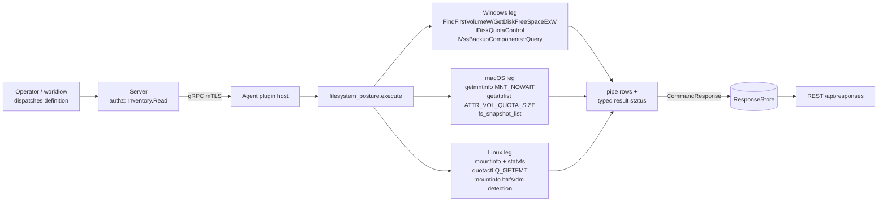

# filesystem_posture

<!-- BEGIN GENERATED: plugin-doc-gen header -->
| | |
|---|---|
| **What it does** | Reports mounted filesystems, per-mount quota-subsystem state, and snapshot-capable volumes |
| **Version** | 1.0.0 |
| **Kind** | Collector · read-only · gathered (crossplatform.storage.mounts, crossplatform.storage.quotas, crossplatform.storage.snapshots) |
| **Platforms** | Windows 🟡 constrained · macOS ✅ · Linux 🟡 constrained |
| **Actions** | `mounts` (definition `crossplatform.storage.mounts`) · `quotas` (definition `crossplatform.storage.quotas`) · `snapshots` (definition `crossplatform.storage.snapshots`) |
| **Security** | securable `Inventory` · operation Read · risk Low · dispatch ReadOnly · approval gate None |
| **Roles** | execute: endpoint-admin, endpoint-operator · author: content-author |
<!-- END GENERATED -->

## How it works

All three actions are reads; none can change host state (`Mutability::None`, `DispatchClass::ReadOnly` on every action). `mounts` enumerates mounted volumes and reports device, filesystem type, mount options, capacity, and a fixed flags vocabulary. `quotas` walks the same volume set and reports only *volume-level* quota-subsystem state — it is deliberately not a per-user or per-group quota inventory anywhere, because APFS has no such mechanism to report and the other legs read only the volume-scoped API. `snapshots` reports what each OS can actually enumerate: real VSS shadow copies on Windows and real APFS snapshots on macOS, but on Linux only snapshot-*capable* volume identity (mounted btrfs subvolume, or a device-mapper source that may or may not be a snapshot LV) — deliberately not a live snapshot inventory, since that needs privileged ioctls this read-only plugin does not issue. A single mountinfo read backs both the Linux `mounts` and `snapshots` legs. Every degraded or denied read is reported through a typed result status rather than folded into a clean row set.



## OS capability

<!-- BEGIN GENERATED: plugin-doc-gen capability -->
| Action | Windows | macOS | Linux |
|---|---|---|---|
| `mounts` | 🟡 constrained · rung 1 · FindFirstVolumeW + GetVolumeInformationW + GetDriveTypeW + GetDiskFreeSpaceExW | ✅ supported · rung 1 · getmntinfo(3) MNT_NOWAIT | 🟡 constrained · rung 1 · /proc/self/mountinfo + statvfs(3) |
| `quotas` | 🟡 constrained · rung 1 · IDiskQuotaControl (dskquota.h) | 🟡 constrained · rung 1 · getattrlist(2) ATTR_VOL_QUOTA_SIZE/ATTR_VOL_RESERVED_SIZE | 🟡 constrained · rung 1 · quotactl(2) Q_GETFMT |
| `snapshots` | 🟡 constrained · rung 1 · IVssBackupComponents::Query (VSS) | ✅ supported · rung 1 · fs_snapshot_list(2) | 🟡 constrained · rung 1 · /proc/self/mountinfo btrfs subvol + device-mapper source detection |

**Declared limits per leg** (descriptor fallback text, verbatim):

- **`mounts` / Windows** — enumerates local volumes only; a mapped network drive is not a volume and is not listed, and no per-mount option string exists so that column reads '-'
- **`mounts` / Linux** — capacity columns are omitted for network filesystems (nfs/cifs/smb/ceph/afs and network FUSE mounts) because a statvfs against an unreachable server blocks the dispatch worker indefinitely; the mount itself is still listed
- **`quotas` / Windows** — volume quota state and default limit/threshold only, opened read-only; per-user quota entries are not enumerated; a volume that denies the query reports permission_denied; a build whose SDK lacks dskquota.h reports unavailable; compiled and linked on a live Windows host but not asserted against one with quotas configured, so the populated-quota path is unexercised
- **`quotas` / macOS** — volume-level quota and reserved size only; per-user and per-group quotas do not exist on APFS (quotactl returns ENOTSUP on every APFS mount while succeeding on HFS+), so no per-identity rows are reported; a volume the agent may not read reports permission_denied
- **`quotas` / Linux** — reports per-mount quota-subsystem state only; per-user and per-group limits are not enumerated, and a mount whose source is not a block device (overlay, tmpfs, network) reports no_block_device; a walk in which every probed device returns EPERM/EACCES reports permission_denied rather than a generic degradation
- **`snapshots` / Windows** — enumerates VSS shadow copies machine-wide, one row per snapshot, reporting its snapshot ID and shadow-copy device path but no size or per-file content; REQUIRES ADMINISTRATIVE RIGHTS -- the agent runs as LocalSystem today so this succeeds; under an unprivileged service account CreateVssBackupComponents returns E_ACCESSDENIED and the action reports permission_denied rather than an empty snapshot set; any VSS failure is reported distinctly from a genuinely empty set and degrades the result status
- **`snapshots` / macOS** — one row per (mount point, snapshot): an APFS snapshot visible under two mount points of the same volume lineage is reported under each
- **`snapshots` / Linux** — reports snapshot-capable volumes and the mounted btrfs subvolume identity, not a snapshot inventory: a device-mapper source may be dm-crypt, dm-multipath or dm-integrity rather than a snapshot-capable LV, enumerating unmounted btrfs snapshots needs CAP_SYS_ADMIN via BTRFS_IOC_TREE_SEARCH, and telling an LVM snapshot LV from a linear LV needs a device-mapper DM_TABLE_STATUS ioctl -- none of which this read-only plugin performs
<!-- END GENERATED -->

## Privileges and prerequisites

| OS | Runs as | Extra grant needed | Measured | If the read is refused |
|---|---|---|---|---|
| Windows | agent service account (LocalSystem today, #1442) | `mounts`, `quotas`: **none** (default `FindFirstVolumeW`/`GetVolumeInformationW`/`GetDiskFreeSpaceExW`; `IDiskQuotaControl` opened read-only, `bReadWrite=FALSE`). `snapshots`: **Administrative rights** — `CreateVssBackupComponents`/`IVssBackupComponents::Query`; the agent runs as LocalSystem today, so this succeeds with no extra grant | 2026-09-03 on the-rig: `NT AUTHORITY\SYSTEM` succeeds (3 shadow copies found); `NT AUTHORITY\LOCAL SERVICE` and `NT AUTHORITY\NETWORK SERVICE` both fail `E_ACCESSDENIED`; `NT SERVICE\YuzuAgent` not measured. Sample capture 2026-09-07, `SYSTEM`, bare-metal | `quotas`: per-volume result status `permission_denied` (HRESULT `E_ACCESSDENIED`); `snapshots`: whole-run `permission_denied` with a `none` row naming the HRESULT — never an empty snapshot set |
| macOS | agent daemon, unprivileged | none — `getmntinfo`, `getattrlist`, `fs_snapshot_list` are all unprivileged reads | 2026-09-07 at euid 501 (jsmith), bare-metal | `quotas`: per-volume `permission_denied` (`getattrlist`/volume-root `open` returning `EPERM`/`EACCES`); `snapshots`: per-volume `permission_denied` when opening a volume root fails `EACCES`/`EPERM` |
| Linux | agent daemon (sample captured as euid 0 in a container) | none for `mounts`/`snapshots` (mountinfo read + `statvfs`); `quotas` needs `CAP_SYS_ADMIN` for a non-`EPERM` `quotactl` reply | 2026-09-06, Debian 13 aarch64, container, euid 0 | `quotas`: `permission_denied` when every probed device returns `EPERM`/`EACCES`; `mounts`/`snapshots` have no privileged call, so a read failure there degrades to `CONSTRAINED` rather than a denial |

No external binaries, no subprocesses. No network access is initiated by this plugin; the Linux `mounts` leg deliberately skips `statvfs` on network filesystem types (`is_network_fstype`) specifically to avoid blocking on one.

## Data contract

### Inputs

<!-- BEGIN GENERATED: plugin-doc-gen inputs -->
No action takes parameters.
<!-- END GENERATED -->

### Outputs

Pipe-delimited rows. Field 0 is a literal discriminator (`mount`, `quota`, or `snapshot`); a `std::nullopt` byte count and any inapplicable/unread text field render as the literal `-`, which never means zero. Fields carrying arbitrary OS-supplied text go through the shared `safe_output_field` escaper; fields drawn from a fixed vocabulary (`flags`, the quota `state` token, `scope`, `kind`) are emitted verbatim. A leg that finds nothing for `snapshots` still emits one `kind=none` row rather than zero rows, so an empty result can never be misread as "action did not run".

<!-- BEGIN GENERATED: plugin-doc-gen outputs -->
**`crossplatform.storage.mounts` — `mount_point|device|fstype|options|total_bytes|free_bytes|available_bytes|flags`**

| Field | Type | Values | Available | Example | Description |
|---|---|---|---|---|---|
| `mount_point` | string | - | Windows, Linux, macOS | `/` | Filesystem path (Linux, macOS) or drive/volume path (Windows) the volume is mounted at. Values: free text. |
| `device` | string | - | Windows, Linux, macOS | `/dev/vda1` | OS-reported mount source or volume identifier backing this mount point. Values: free text. |
| `fstype` | string | - | Windows, Linux, macOS | `ext4` | OS-supplied filesystem type name. Values: free text. |
| `options` | string | - | Linux | `rw,relatime` | Comma-separated mount options as reported by the OS, or "-" when no per-mount option string exists. Values: free text or "-". |
| `total_bytes` | int64 | - | Windows, Linux, macOS | `485473984512` | Raw filesystem capacity in bytes, or "-" when not read (omitted for network filesystems on Linux to avoid a blocking statvfs call). Values: integer or "-". |
| `free_bytes` | int64 | - | Windows, Linux, macOS | `432465076224` | Free space in bytes, or "-" under the same conditions as total_bytes. Values: integer or "-". |
| `available_bytes` | int64 | - | Windows, Linux, macOS | `407729119232` | Space available to an unprivileged caller in bytes, or "-" under the same conditions as total_bytes. Values: integer or "-". |
| `flags` | string | - | Windows, Linux, macOS | `rw,relatime` | Comma-joined mount flags drawn from a fixed vocabulary; any option outside the vocabulary is dropped rather than passed through. Values: ro, rw, nosuid, nodev, noexec, noatime, relatime, removable, remote, cdrom. |

**`crossplatform.storage.quotas` — `mount_point|scope|state|limit_bytes|reserved_bytes|detail`**

| Field | Type | Values | Available | Example | Description |
|---|---|---|---|---|---|
| `mount_point` | string | - | Windows, Linux, macOS | `/` | Filesystem path or volume path the quota state applies to, or "-" on the aggregate Linux no_block_device row. Values: free text or "-". |
| `scope` | string | - | Windows, Linux, macOS | `volume` | Fixed literal identifying the quota scope; this plugin never reports a narrower scope. Values: volume. |
| `state` | string | - | Windows, Linux, macOS | `not_enabled` | Classified quota-subsystem state for this volume. Values: configured, none, not_enabled, unsupported_fs, no_block_device, permission_denied, unavailable. |
| `limit_bytes` | int64 | - | Windows, macOS | `-` | Default quota limit in bytes; only populated when state is configured. Values: integer or "-". |
| `reserved_bytes` | int64 | - | Windows, macOS | `-` | Reserved/threshold size in bytes; only populated when state is configured. Values: integer or "-". |
| `detail` | string | - | Windows, Linux, macOS | `ESRCH` | Free-text reason or errno/HRESULT name explaining the state, or "-" when nothing further applies. Values: free text or "-". |

**`crossplatform.storage.snapshots` — `mount_point|name|kind|detail`**

| Field | Type | Values | Available | Example | Description |
|---|---|---|---|---|---|
| `mount_point` | string | - | Windows, Linux, macOS | `C:/` | Filesystem path or volume path the snapshot (or snapshot-capable volume) belongs to, or "-" on a kind=none sentinel row. Values: free text or "-". |
| `name` | string | - | Windows, Linux, macOS | `{9F2F924B-2DD2-46D5-A779-709B2F6FFB9B}` | Snapshot identifier — a GUID on Windows, an APFS snapshot name on macOS, a btrfs subvolume path/id or device-mapper source on Linux — or "-" on a none row. Values: free text or "-". |
| `kind` | string | - | Windows, Linux, macOS | `vss` | Fixed-vocabulary classification of what this row represents. Values: apfs, btrfs_subvolume, device_mapper, vss, none. |
| `detail` | string | - | Windows, Linux, macOS | `//?/GLOBALROOT/Device/HarddiskVolumeShadowCopy1` | Free-text detail — a device path, an operator-actionable reason on a none row, or "-". Values: free text or "-". |
<!-- END GENERATED -->

### Result status

Surfaced as `plugin_result_status` on the command response. `mark_result_partial` sets `CONSTRAINED`/`PARTIAL`; `mark_result_denied` sets `PERMISSION_DENIED`/`PARTIAL`. `set_result_status` assigns rather than accumulates, so when several degradations occur inside one `execute()` call, the last call's provenance is what the server sees — every degradation still reaches the agent log regardless.

| Status | Completeness | Provenance (examples) | When |
|---|---|---|---|
| `UNDECLARED` (agent-derived `OK`) | — | — | clean read on every action; both captured Unix samples for all three actions, and the Windows `snapshots` sample |
| `CONSTRAINED` | partial | `linux:mountinfo`, `linux:mountinfo:malformed`, `macos:getmntinfo`, `macos:getattrlist`, `macos:fs_snapshot_list`, `windows:volume_enum`, `windows:dskquota`, `windows:vss` | an OS call failed, a malformed/truncated mountinfo, an unrecognized quota state, or a VSS step (`SetContext`, a non-snapshot object) narrowed but did not stop the walk |
| `CONSTRAINED` | partial | `linux:mountinfo:unreadable`, `linux:mountinfo:entry_cap`, `linux:mountinfo:quotas`, `linux:mountinfo:entry_cap:quotas`, `linux:mountinfo:malformed:quotas`, `linux:mountinfo:snapshots`, `linux:mountinfo:entry_cap:snapshots`, `linux:mountinfo:malformed:snapshots`, `linux:statvfs` | Linux, per action: the `/proc/self/mountinfo` read for `mounts` (`:unreadable`/`:entry_cap`) or for `quotas`/`snapshots` (action-suffixed `:quotas`/`:snapshots` variants) failed outright, hit its entry-count cap, or contained a malformed line; or a per-mount `statvfs(3)` call failed (`linux:statvfs`, `mounts` only) |
| `PERMISSION_DENIED` | partial | `linux:quotactl` (every probed device `EPERM`/`EACCES`), `macos:getattrlist`, `macos:fs_snapshot_list` (`EACCES`/`EPERM` on a volume root), `windows:dskquota` (`E_ACCESSDENIED`), `windows:vss` (`E_ACCESSDENIED`) | a privilege denial specifically, reported distinctly from every other degradation so a status-keyed consumer can tell "not allowed to read this" from a generic failure |

### Where the data goes

- **Instruction result only.** Rows travel over the agent's mTLS gRPC channel as the command response and land in the ResponseStore, queryable at `/api/responses/{id}` and aggregatable (`mounts` groups by `fstype`, `quotas` by `state`, `snapshots` by `kind`).
- **Not consumed by** daily-sync inventory, the TAR warehouse, DEX, or metrics — the plugin's only server-side reference is its `capability_decls` registration; nothing runs on a schedule beyond the per-execution `gather.ttlSeconds` response deadline.
- **Sensitivity.** Rows carry filesystem and volume metadata only — mount points, device/volume
  paths (`/dev/vda1`, a Windows volume GUID), capacity figures, quota state, and snapshot
  GUIDs/names — nothing that names a specific person, a specific installed software product, or a
  device beyond its id (no hostname, MAC, or username in any column).
- **Siblings:** `crossplatform.storage.smart`, `crossplatform.storage.volumes` (`disk_actions` — physical drive health and the drive/volume join), `crossplatform.storage.free` (`disk_space`).
- **MCP / REST.** Discover: `discover_plugins` (summary) → `yuzu://plugin-docs` (this page as data) → `discover_instructions` / `get_definition("crossplatform.storage.mounts")`. Run: `execute_instruction {definition_id, parameters}`. Read: `/api/responses/{id}`.

## Sample output

<!-- BEGIN GENERATED: plugin-doc-gen samples -->
**Windows** — captured: windows Microsoft Windows NT 10.0.26200.0 x64 · bare-metal · 2026-09-07 · SYSTEM · leg-hash 6094b93f5b9d

```
== action=mounts
mount|//?/Volume{0a35801e-3f40-4114-a073-3d7ea1dd7664}/|//?/Volume{0a35801e-3f40-4114-a073-3d7ea1dd7664}/|NTFS|-|524283904|509657088|509657088|rw
mount|C:/|//?/Volume{c9a5f911-4689-41b2-b774-5b0e25b60e10}/|NTFS|-|248158089216|20788932608|20788932608|rw
mount|//?/Volume{daa59534-884a-4ce4-8fc8-4244f7bbe7ae}/|//?/Volume{daa59534-884a-4ce4-8fc8-4244f7bbe7ae}/|NTFS|-|967831552|63561728|63561728|rw
mount|D:/|//?/Volume{785383ef-b682-41d9-9b28-27c4b8882d65}/|NTFS|-|1000187359232|66670665728|66670665728|rw
mount|//?/Volume{b188886e-39bb-4915-a893-d61a3ca3c707}/|//?/Volume{b188886e-39bb-4915-a893-d61a3ca3c707}/|FAT32|-|268435456|231624704|231624704|rw
[result_status] CONSTRAINED / PARTIAL / windows:volume_enum

== action=quotas
quota|//?/Volume{0a35801e-3f40-4114-a073-3d7ea1dd7664}/|volume|unavailable|-|-|volume has no drive letter
quota|C:/|volume|not_enabled|-|-|-
quota|//?/Volume{daa59534-884a-4ce4-8fc8-4244f7bbe7ae}/|volume|unavailable|-|-|volume has no drive letter
quota|D:/|volume|not_enabled|-|-|-
quota|//?/Volume{b188886e-39bb-4915-a893-d61a3ca3c707}/|volume|unsupported_fs|-|-|-
[result_status] CONSTRAINED / PARTIAL / windows:dskquota

== action=snapshots
snapshot|C:/|{9F2F924B-2DD2-46D5-A779-709B2F6FFB9B}|vss|//?/GLOBALROOT/Device/HarddiskVolumeShadowCopy1
snapshot|C:/|{E6484C8F-1467-4FC8-8577-85677F599D41}|vss|//?/GLOBALROOT/Device/HarddiskVolumeShadowCopy2
snapshot|C:/|{671203BF-A8FA-4ED5-9360-4CBB9B65272E}|vss|//?/GLOBALROOT/Device/HarddiskVolumeShadowCopy3
snapshot|C:/|{21E68FE4-CB60-454D-A893-9420AD8EE750}|vss|//?/GLOBALROOT/Device/HarddiskVolumeShadowCopy4
[result_status] UNDECLARED / UNKNOWN
```

**macOS** — captured: macos macOS 26.6.2 arm64 · bare-metal · 2026-09-07 · euid 501 (jsmith) · leg-hash 6094b93f5b9d

```
== action=mounts
mount|/|/dev/disk3s1s1|apfs|-|494384795648|313557540864|313557540864|ro
mount|/dev|devfs|devfs|-|201728|0|0|rw
mount|/System/Volumes/VM|/dev/disk3s6|apfs|-|494384795648|313795141632|313795141632|rw,noexec,noatime
mount|/System/Volumes/Preboot|/dev/disk3s2|apfs|-|494384795648|313549758464|313549758464|rw
mount|/System/Volumes/Update|/dev/disk3s4|apfs|-|494384795648|313795141632|313795141632|rw
mount|/System/Volumes/xarts|/dev/disk1s2|apfs|-|524288000|506204160|506204160|rw,noexec,noatime
mount|/System/Volumes/iSCPreboot|/dev/disk1s1|apfs|-|524288000|506204160|506204160|rw
mount|/System/Volumes/Hardware|/dev/disk1s3|apfs|-|524288000|506204160|506204160|rw
mount|/System/Volumes/Data|/dev/disk3s5|apfs|-|494384795648|313557196800|313557196800|rw
mount|/System/Volumes/Data/home|map auto_home|autofs|-|0|0|0|rw
[result_status] UNDECLARED / UNKNOWN

== action=quotas
quota|/|volume|none|-|-|volume-level only; per-user/group quotas are unsupported on APFS (quotactl returns ENOTSUP on every APFS mount, though it succeeds on HFS+)
quota|/dev|volume|unsupported_fs|-|-|volume-level only; per-user/group quotas are unsupported on APFS (quotactl returns ENOTSUP on every APFS mount, though it succeeds on HFS+)
quota|/System/Volumes/VM|volume|none|-|-|volume-level only; per-user/group quotas are unsupported on APFS (quotactl returns ENOTSUP on every APFS mount, though it succeeds on HFS+)
quota|/System/Volumes/Preboot|volume|none|-|-|volume-level only; per-user/group quotas are unsupported on APFS (quotactl returns ENOTSUP on every APFS mount, though it succeeds on HFS+)
quota|/System/Volumes/Update|volume|none|-|-|volume-level only; per-user/group quotas are unsupported on APFS (quotactl returns ENOTSUP on every APFS mount, though it succeeds on HFS+)
quota|/System/Volumes/xarts|volume|none|-|-|volume-level only; per-user/group quotas are unsupported on APFS (quotactl returns ENOTSUP on every APFS mount, though it succeeds on HFS+)
quota|/System/Volumes/iSCPreboot|volume|none|-|-|volume-level only; per-user/group quotas are unsupported on APFS (quotactl returns ENOTSUP on every APFS mount, though it succeeds on HFS+)
quota|/System/Volumes/Hardware|volume|none|-|-|volume-level only; per-user/group quotas are unsupported on APFS (quotactl returns ENOTSUP on every APFS mount, though it succeeds on HFS+)
quota|/System/Volumes/Data|volume|none|-|-|volume-level only; per-user/group quotas are unsupported on APFS (quotactl returns ENOTSUP on every APFS mount, though it succeeds on HFS+)
quota|/System/Volumes/Data/home|volume|unsupported_fs|-|-|volume-level only; per-user/group quotas are unsupported on APFS (quotactl returns ENOTSUP on every APFS mount, though it succeeds on HFS+)
[result_status] UNDECLARED / UNKNOWN

== action=snapshots
snapshot|/|com.apple.os.update-60587424F5399FC05D957DF05B4D2F65543462495C77AEF520F790FBB57CB212|apfs|-
[result_status] UNDECLARED / UNKNOWN
```

**Linux** — captured: linux Debian GNU/Linux 13 (trixie) aarch64 · container · 2026-09-06 · euid 0 · leg-hash 6094b93f5b9d

```
== action=mounts
mount|/|overlay|overlay|rw,relatime|485473984512|432465076224|407729119232|rw,relatime
mount|/proc|proc|proc|rw,nosuid,nodev,noexec,relatime|0|0|0|rw,nosuid,nodev,noexec,relatime
mount|/dev|tmpfs|tmpfs|rw,nosuid|67108864|67108864|67108864|rw,nosuid
mount|/dev/pts|devpts|devpts|rw,nosuid,noexec,relatime|0|0|0|rw,nosuid,noexec,relatime
mount|/sys|sysfs|sysfs|rw,nosuid,nodev,noexec,relatime|0|0|0|rw,nosuid,nodev,noexec,relatime
mount|/sys/fs/cgroup|cgroup|cgroup2|rw,nosuid,nodev,noexec,relatime|0|0|0|rw,nosuid,nodev,noexec,relatime
mount|/dev/mqueue|mqueue|mqueue|rw,nosuid,nodev,noexec,relatime|0|0|0|rw,nosuid,nodev,noexec,relatime
mount|/dev/shm|shm|tmpfs|rw,nosuid,nodev,noexec,relatime|67108864|67108864|67108864|rw,nosuid,nodev,noexec,relatime
mount|/etc/resolv.conf|/dev/vda1|ext4|rw,relatime|485473984512|432465076224|407729119232|rw,relatime
mount|/etc/hostname|/dev/vda1|ext4|rw,relatime|485473984512|432465076224|407729119232|rw,relatime
mount|/etc/hosts|/dev/vda1|ext4|rw,relatime|485473984512|432465076224|407729119232|rw,relatime
[result_status] UNDECLARED / UNKNOWN

== action=quotas
quota|/etc/resolv.conf|volume|not_enabled|-|-|ESRCH
quota|/etc/hostname|volume|not_enabled|-|-|ESRCH
quota|/etc/hosts|volume|not_enabled|-|-|ESRCH
quota|-|volume|no_block_device|-|-|8 non-block-device mounts (overlay/tmpfs/virtual/network) not quota-capable
[result_status] UNDECLARED / UNKNOWN

== action=snapshots
snapshot|-|-|none|no btrfs or device-mapper mount found
[result_status] UNDECLARED / UNKNOWN
```
<!-- END GENERATED -->

## Caveats and known gaps

1. **Quota reporting is volume-level everywhere, never per-identity.** No platform enumerates per-user or per-group limits; on APFS the gap is structural, not a missing read — `quotactl` returns `ENOTSUP` on every APFS mount while succeeding on HFS+, so there is nothing per-identity to enumerate there at all.
2. **Linux `snapshots` reports capability, not inventory.** It cannot enumerate unmounted btrfs snapshots (needs `CAP_SYS_ADMIN` via `BTRFS_IOC_TREE_SEARCH`) or distinguish an LVM snapshot LV from a plain dm-crypt/multipath/integrity target (needs a `DM_TABLE_STATUS` ioctl) — this read-only plugin performs neither.
3. **Windows VSS enumeration has no deadline.** `CreateVssBackupComponents`/`Query`/`Next` are synchronous COM calls with no timeout, run on a bounded agent dispatch-pool worker shared with quarantine/containment dispatch. A wedged VSS service or a hung third-party backup provider parks that worker permanently; prefer on-demand invocation over a frequent schedule on hosts running third-party backup software.
4. **Linux `mounts` omits capacity for network filesystems.** `nfs*`, `cifs`, `smb3`, `afs`, `ceph`, `glusterfs`, `9p`, `virtiofs`, `lustre`, `beegfs`, `gfs2`, `ocfs2`, `autofs`, and network-backed `fuse.*` mounts are still listed, but their capacity columns read `-` — a `statvfs` against an unreachable server blocks the dispatch worker indefinitely.
5. **`FSCTL_SRV_ENUMERATE_SNAPSHOTS` was deliberately rejected as the Windows snapshots mechanism; do not reintroduce it.** No header in SDK 10.0.26100.0 declares it — a direct probe fails `C2065: undeclared identifier`, and an earlier shipped DLL carried a "built without FSCTL_SRV_ENUMERATE_SNAPSHOTS" sentinel, proving the guard had compiled the real path out. It is also the wrong question: an SMB *server*-side control listing previous versions a share exposes, not a volume's shadow copies.

## Source and tests

<!-- BEGIN GENERATED: plugin-doc-gen source -->
- Plugin: `agents/plugins/filesystem_posture/src/filesystem_posture_legs.hpp` · `agents/plugins/filesystem_posture/src/filesystem_posture_linux.cpp` · `agents/plugins/filesystem_posture/src/filesystem_posture_macos.cpp` · `agents/plugins/filesystem_posture/src/filesystem_posture_parsers.hpp` · `agents/plugins/filesystem_posture/src/filesystem_posture_plugin.cpp` · `agents/plugins/filesystem_posture/src/filesystem_posture_win.cpp`
- Definitions: `content/definitions/filesystem_posture.yaml`
- Capability rows: `server/core/src/capability_decls/plugin_action_catalogue_filesystem_posture.hpp`
- Tests: `tests/unit/test_filesystem_posture_local_dispatcher.cpp` · `tests/unit/test_filesystem_posture_parsers.cpp`
- Privilege row: `docs/agent-privilege-model.md`
<!-- END GENERATED -->
