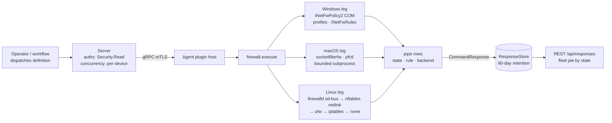

# firewall

<!-- BEGIN GENERATED: plugin-doc-gen header -->
| | |
|---|---|
| **What it does** | Firewall status and rule listing |
| **Version** | 0.4.0 · first commit 2026-06-24 |
| **Kind** | Collector · read-only · gathered (security.firewall.state, security.firewall.rules) |
| **Platforms** | Windows ✅ · macOS ✅ · Linux ✅ |
| **Actions** | `rules` (definition `security.firewall.rules`) · `state` (definition `security.firewall.state`) |
| **Security** | securable `Security` · operation Read · risk Low · dispatch ReadOnly · approval gate None |
| **Roles** | execute: endpoint-admin, endpoint-operator, security-admin · author: content-author |
<!-- END GENERATED -->

## How it works

Both actions are reads; the plugin has no rule-mutation surface despite its name. `state` reports whether the host firewall is on, per profile or per backend. `rules` lists the rule set the same backend exposes. On Windows both go through the `INetFwPolicy2` COM interface: `state` asks each of the Domain, Private and Public profiles for `FirewallEnabled`; `rules` enumerates `INetFwRules` and stops after 100 rules with a `truncated|true` marker row. On macOS `state` reads the Application Firewall global state through `socketfilterfw --getglobalstate` (the firewall a Mac administrator means), adds a `mode|block_all` row when block-all is set, then reads the pf packet-filter status through `pfctl -s info` as a secondary row; `rules` lists pf rules through `pfctl -s rules`. On Linux the plugin probes backends in a fixed order and stops at the first that answers: firewalld over sd-bus, then nftables over `NETLINK_NETFILTER` dumps, then `ufw status numbered`, then `iptables -S`, else `backend|none`.

Every subprocess runs through the bounded runner with a fixed deadline; every parse is a pure function in `firewall_parsers.hpp`. The honest-status invariant holds on every leg: empty, truncated or unrecognised output parses to `unknown` (state) or no rows (rules), never to a false-safe "disabled" or a fabricated rule. Once nftables has answered the table dump, a later chain or rule dump failure reports `unknown` and stops rather than falling through to a different backend's answer.



## OS capability

<!-- BEGIN GENERATED: plugin-doc-gen capability -->
| Action | Windows | macOS | Linux |
|---|---|---|---|
| `rules` | ✅ supported · rung 1 · INetFwPolicy2 COM (INetFwRules enumeration) | ✅ supported · rung 2 · pfctl via run_bounded_subprocess | ✅ supported · rung 1 · firewalld sd-bus, else nftables NETLINK_NETFILTER (both rung 1), else ufw/iptables via run_bounded_subprocess (rung 2) |
| `state` | ✅ supported · rung 1 · INetFwPolicy2 COM (per-profile FirewallEnabled) | ✅ supported · rung 2 · socketfilterfw/pfctl via run_bounded_subprocess | ✅ supported · rung 1 · firewalld sd-bus, else nftables NETLINK_NETFILTER (both rung 1), else ufw/iptables via run_bounded_subprocess (rung 2) |
<!-- END GENERATED -->

## Privileges and prerequisites

| OS | Runs as | Extra grant needed | Measured | If the read is refused |
|---|---|---|---|---|
| Windows | agent service account (LocalSystem today, #1442) | None. `INetFwPolicy2` profile and rule reads need no elevation. | COM path shipped with the rung-1 migration; CI exercises the Windows leg on every MSVC run | `error|com_init` or `error|policy2_create:<hresult>` row; profile rows read `error:<hresult>` |
| macOS | LaunchDaemon (root today) | None for the primary Application Firewall read (`socketfilterfw --getglobalstate` is unprivileged). The secondary pf read opens `/dev/pf` and needs root; the plugin deliberately does not ride the quarantine plugin's `pfctl` sudoers grant. | 2026-09-06 at euid 501 on this host: `state|disabled`, `pf|unknown`, no pf rule rows | `pf|unknown` (state), no rows (rules), never a false-safe value |
| Linux | agent service account | `firewall-cmd --state` is an unprivileged D-Bus query. The nftables netlink dump conventionally needs `CAP_NET_ADMIN` (verified 2026-08-23 with the capability present); `ufw status` and `iptables -S` need root. No sudoers entry is granted for any of them. | nftables verified 2026-08-23 in an Ubuntu 26.04 container with `CAP_NET_ADMIN`; the unprivileged denial path is reasoned from the `chains_ok && rules_ok` gate, not measured | a refused table dump falls through to the next backend; a refused chain or rule dump after a successful table dump reports `state|unknown` / `rules|unknown`; a host with no readable backend reports `backend|none` |

Subprocesses: `socketfilterfw`, `pfctl` (macOS), `ufw`, `iptables` (Linux), each as an argv vector through the bounded runner (rung 2), never a shell. Windows and the firewalld and nftables legs are native (rung 1). No network access.

## Data contract

### Inputs

<!-- BEGIN GENERATED: plugin-doc-gen inputs -->
Neither action takes parameters.
<!-- END GENERATED -->

### Outputs

Pipe-delimited key rows; the first field is the row kind. `state` emits `profile|<Domain|Private|Public>|<enabled|disabled|unknown|error:0x…>` on Windows, and `backend|<name>`, `state|<value>`, optional `mode|block_all` and `pf|<value>` rows on macOS and Linux. `rules` emits `rule|<name>|<enabled|disabled>|<in|out|unknown>|<allow|block|unknown>|<profile mask>` on Windows (plus `truncated|true` after 100 rules), `rule|<raw pf line>` on macOS, and per backend on Linux: `rule|firewalld|<zone>|service|<service>`, `rule|nftables|<family>|<table>|<chain>|<hook>|<policy>` and `rule|nftables|<family>|<table>|<chain>|handle|<n>`, or `rule|<index>|<to>|<action>|<from>` for ufw. The server parses this plugin as key/value rows (`profile_or_backend`, `state`), so the value column carries the remainder of each row verbatim. A run that reads nothing emits no `rule` rows and, for state, `unknown` values; it never fabricates a row.

<!-- BEGIN GENERATED: plugin-doc-gen outputs -->
**`security.firewall.rules` — `rule_name|enabled|direction|action|profiles`**

| Field | Type | Values | Available | Example | Description |
|---|---|---|---|---|---|
| `rule_name` | string | - | all | `Core Networking - DNS (UDP-Out)` | Windows: the rule's display name. Linux ufw: the numbered index; firewalld: the zone; nftables: the chain or rule handle row; macOS: the raw pf rule line. |
| `enabled` | string | `enabled` `disabled` | Windows | `enabled` | Windows only; enabled or disabled. |
| `direction` | string | `in` `out` `unknown` | Windows | `out` | Windows only; in, out or unknown. |
| `action` | string | `allow` `block` `unknown` | Windows | `allow` | Windows only; allow, block or unknown. |
| `profiles` | string | - | Windows | `2147483647` | Windows only; the NET_FW_PROFILE_TYPE2 bitmask as an integer (1 domain, 2 private, 4 public, 2147483647 all). |

**`security.firewall.state` — `profile_or_backend|state`**

| Field | Type | Values | Available | Example | Description |
|---|---|---|---|---|---|
| `profile_or_backend` | string | `profile` `backend` `state` `mode` `pf` `error` | all | `profile` | Row key. Windows: "profile" rows carry the profile name in the next field (Domain, Private, Public). Linux and macOS: "backend", "state", "mode" and "pf" rows, one key each. |
| `state` | string | - | all | `enabled` | Windows profile rows: enabled, disabled, unknown or error:<hresult>. Linux "state" rows: running (firewalld), active, inactive or unknown. macOS "state" rows: enabled, disabled or unknown; "pf" rows the same; "mode" row is block_all. "backend" rows name the backend (appfirewall, firewalld, nftables, ufw, iptables, none). |
<!-- END GENERATED -->

### Result status

The plugin does not call `set_result_status`; every run reports `UNDECLARED`, from which the agent derives `OK` when `execute` returns 0. Degradation is carried in the rows themselves (`unknown`, `error|…`, `backend|none`, `truncated|true`), not in the typed status.

| Status | Completeness | Provenance | When |
|---|---|---|---|
| `OK` (derived from `UNDECLARED`) | — | — | every run that returns 0, including degraded reads |

### Where the data goes

- **Instruction result only.** Rows land in the ResponseStore (90-day default retention), queryable at `/api/responses/{id}`; `security.firewall.state` aggregates by `state` and drives the fleet pie "Firewall profile state across the fleet" (profile rows, labelled by value).
- **Not consumed by** daily-sync inventory, the TAR warehouse, DEX, or metrics. Both definitions carry a gather TTL (120 s and 300 s) but no schedule; they run when dispatched.
- **MCP / REST.** Discover: `discover_plugins` (summary) → `yuzu://plugin-docs` (this page as data) → `discover_instructions` / `get_definition("security.firewall.state")`. Run: `execute_instruction {definition_id, parameters}`. Read: `/api/responses/{id}`.
- **Siblings:** `quarantine` (the only plugin that mutates firewall state, through its own sudoers-granted `pfctl` anchor and Windows firewall rules), `network_config`.

## Sample output

<!-- BEGIN GENERATED: plugin-doc-gen samples -->
**macOS** — captured: macos 26.5.1 · bare-metal · 2026-09-06 · euid 501 · leg-hash 8ef7b004fc8a

```
== action=state
backend|appfirewall
state|disabled
pf|unknown
[result_status] UNDECLARED / UNKNOWN

== action=rules
[result_status] UNDECLARED / UNKNOWN
```
<!-- END GENERATED -->

## Caveats and known gaps

1. **Row shape is a key/value contract, not the YAML column list.** `result_parsing.hpp` clamps this plugin to two fields, so a `profile|Domain|enabled` row reaches the dashboard as key `profile`, value `Domain|enabled`. Splitting the value into its own axes is tracked under #626.
2. **macOS rules are the raw pf lines** and the pf reads need root; under the least-privilege model both `pf|` state and the rules list degrade to unknown or empty on purpose.
3. **The Linux unprivileged denial path is reasoned, not measured.** The nftables leg was verified with `CAP_NET_ADMIN` present; a non-firewalld host without that capability and with root-only ufw or iptables can report `backend|none`. Tracked for the Linux parity sweep.
4. **Windows rules stop at 100.** The `truncated|true` row is emitted only when a genuine 101st rule exists, so a host with exactly 100 rules is not marked truncated.
5. **A mixed fleet shows two macOS shapes.** Agents older than the Application Firewall change report pf as the sole state source (`backend|pf`); current agents report `backend|appfirewall` plus a `pf|` row.

## Source and tests

<!-- BEGIN GENERATED: plugin-doc-gen source -->
- Plugin: `agents/plugins/firewall/src/firewall_parsers.hpp` · `agents/plugins/firewall/src/firewall_plugin.cpp`
- Definitions: `content/definitions/firewall.yaml`
- Capability rows: `server/core/src/capability_decls/plugin_action_catalogue_c.hpp`
- Tests: `tests/unit/test_firewall_local_dispatcher.cpp` · `tests/unit/test_firewall_parsers.cpp`
- Privilege row: `docs/agent-privilege-model.md`
- Changelog: `changelog.d/20260716-macos-firewall-alf-primary.fixed.md` · `changelog.d/20260818-wave3-firewall-native-acquisition.changed.md` · `changelog.d/20260818-wave3-firewall-ufw-inactive-misreport.fixed.md` · `changelog.d/20260823-firewall-nftables-netlink.added.md` · `changelog.d/2237-guardian-reconcile-exception-firewall.fixed.md` · `changelog.d/2298-guardian-convergence-lane-firewall.fixed.md`
<!-- END GENERATED -->
