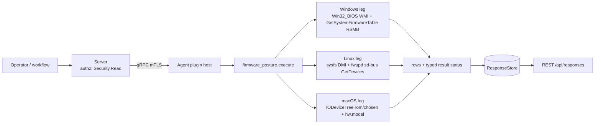

# firmware_posture

<!-- BEGIN GENERATED: plugin-doc-gen header -->
| | |
|---|---|
| **What it does** | Reports firmware/BIOS vendor, version, release date and update-pending posture |
| **Version** | 1.0.0 |
| **Kind** | Collector · read-only · gathered (crossplatform.firmware_posture.firmware) |
| **Platforms** | Windows ✅ · macOS 🟡 constrained · Linux 🟡 constrained |
| **Actions** | `firmware` (definition `crossplatform.firmware_posture.firmware`) |
| **Security** | securable `Security` · operation Read · risk Low · dispatch ReadOnly · approval gate None |
| **Roles** | execute: endpoint-admin, endpoint-operator, security-admin · author: content-author |
<!-- END GENERATED -->

## How it works

One action, `firmware` (`firmware_posture_plugin.cpp`), reports firmware/BIOS vendor, version, release date and update-pending posture as rows `firmware|<field>|<value>|<source>`. The action takes no parameters. Every leg is rung 1 and never spawns a process.

- **Windows** reads two sources. `wmi` is a bounded `Win32_BIOS` query (`run_bounded_wmi_query`) for exactly three columns: `Manufacturer`, `SMBIOSBIOSVersion` and `ReleaseDate`. `smbios` calls `GetSystemFirmwareTable('RSMB')` and hands the bytes to a bounds-checked type-0 parser (vendor, version, release date, ROM size, BIOS and embedded-controller release). `BIOSVersion` is a string array that the shared WMI helper drops, so Windows never emits a `bios_version_list` row.
- **Linux** reads two sources. `dmi` is the four `/sys/class/dmi/id/bios_*` files, each read once with a 4 KiB bound. `fwupd` calls `GetDevices` on `org.freedesktop.fwupd` over the sd-bus system bus, then `GetUpgrades` for each updatable device, and reports one `fwupd_device` row per device plus an aggregate `update_pending` verdict. sd-bus is a system package (`libsystemd`, found through pkg-config), never a `vcpkg.json` entry.
- **macOS** reads the IODeviceTree plane through IOKit: `/rom` (Intel: version, release date, vendor) is preferred, then `/chosen` `system-firmware-version` (Apple Silicon), with the vendor from the tree root `manufacturer`; plus `hw.model` through `sysctlbyname`. Every IOKit object and CoreFoundation property is held by `ScopedIOObject` and `ScopedCFRef`.

Every fact reads as exactly one of a **value**, **`absent`** (the OS definitively reports nothing: no DMI in a container, a missing property), **`unavailable`** (`update_pending` only: the system bus answered and fwupd is not on it) or **`unreadable`** (the read failed). Absent and unavailable are states, not failures: they add no reason token and the result stays `OK`. A failed read is never rendered as absent: it is an `unreadable` row with a `<source>:<cause>` reason and a non-OK status. On macOS Apple Silicon `release_date` reads `absent` and no `update_pending` row is reported.

**Why this plugin exists (stated plainly, not inflated).** There is no standalone documented driver for it. It shares only the weak, unscheduled `docs/roadmap.md` Issue 18.6 "Hardware Attestation" sourcing, whose own justification is a generic "commonly demanded" line with no named customer, control or CVE. It reports a device-inventory and patch-compliance fact, distinct from boot-integrity posture. The priority is asserted from a capability-gap reading, not evidenced by tracked demand.



## OS capability

<!-- BEGIN GENERATED: plugin-doc-gen capability -->
| Action | Windows | macOS | Linux |
|---|---|---|---|
| `firmware` | ✅ supported · rung 1 · WMI Win32_BIOS via wmi_bounded run_bounded_wmi_query + GetSystemFirmwareTable('RSMB') SMBIOS type 0 | 🟡 constrained · rung 1 · IOKit IORegistryEntryFromPath IODeviceTree:/rom then IODeviceTree:/chosen, IORegistryEntryCreateCFProperty under ScopedIOObject/ScopedCFRef, plus sysctlbyname hw.model | 🟡 constrained · rung 1 · /sys/class/dmi/id/{bios_vendor,bios_version,bios_date,bios_release} + fwupd org.freedesktop.fwupd GetDevices/GetUpgrades over the sd-bus system bus |

**Declared limits per leg** (descriptor fallback text, verbatim):

- **`firmware` / macOS** — verified on Apple Silicon only (Mac16,10, macOS 26.6.2): there IODeviceTree:/rom does not exist and the version is IODeviceTree:/chosen system-firmware-version (an iBoot tag such as mBoot-18000.161.10, not a BIOS date); the Intel /rom version/release-date/vendor keys are UNVERIFIED on hardware. release_date reads absent on Apple Silicon and update_pending is not reported
- **`firmware` / Linux** — the fwupd leg needs libsystemd at build time (a system dependency, never vcpkg); without it update_pending reads unreadable with the fwupd:not_built token and the sysfs rows remain. Hosts without DMI (containers, some VMs) report the DMI fields absent and hosts without the fwupd daemon report update_pending unavailable: neither is a failure. The populated-DMI shape is not captured from a physical Linux host
<!-- END GENERATED -->

## Privileges and prerequisites

| OS | Runs as | Extra grant needed | Measured | If the read is refused |
|---|---|---|---|---|
| Windows | agent service account (LocalSystem today, #1442) | None documented for this plugin (`docs/agent-privilege-model.md`) | the-rig capture as `NT AUTHORITY\SYSTEM` of `Win32_BIOS`, the `GetSystemFirmwareTable('RSMB')` size and the type-0 rows (`docs/samples/windows.txt`, and the probe record in the `firmware_posture_win.cpp` banner); `GetSystemFirmwareTable` had no in-tree precedent before this plugin. Not measured: a non-SYSTEM identity. | `ERROR_ACCESS_DENIED` or a WBEM access-denied HRESULT reports the row `unreadable` and the action `PERMISSION_DENIED`/`PARTIAL`; any other failure reports `<source>:<cause>` (`smbios:win32_<n>`, `wmi:<token>`) |
| macOS | agent daemon, root today (LaunchDaemon carries no `UserName` key, see `docs/agent-privilege-model.md` TL;DR); the IODeviceTree plane is world-readable | None: no read needed a privilege | 2026-09-21, bare-metal, this Mac (`braga`, Mac16,10, macOS 26.6.2), unprivileged (euid 501), real capture (`docs/samples/macos.txt`). No root run was captured, so root is the documented production default, not a measured one. The Intel `/rom` keys are unverified on hardware. | A key that exists but is not text reads `unreadable` on that field; a failed IOKit node lookup reads `unreadable` with an `iokit:<path>:lookup_failed` token, except `/rom` on Apple Silicon, which does not exist there and reads `absent` |
| Linux | agent daemon, default | None for the `bios_*` DMI attributes (kernel mode 0444; not measured, the Docker VM used for capture has no `/sys/class/dmi`). The fwupd calls are unauthenticated read methods on the system bus. | fwupd 1.9.28 replies captured as root (euid 0) in a fedora:40 container and the no-daemon `ServiceUnknown` path in a debian:12 container (`tests/unit/fixtures/wave8/firmware_posture/linux/`); the built `.so` run against a no-DMI, no-fwupd container is captured (`docs/samples/linux.txt`). A non-root caller and a populated-DMI host are unverified. | `EACCES`/`EPERM` on a DMI file reports it `unreadable` with `dmi:<file>:eacces` and the action `PERMISSION_DENIED`; a D-Bus `AccessDenied` reports `fwupd:<call>:permission_denied`; an absent file or a daemon the bus reports as not installed is a state, never a failure; a bus that cannot be opened is a failure |

Binaries/subprocesses: none. Every leg is an in-process read (WMI and the firmware table API, sysfs and sd-bus, IOKit and `sysctlbyname`); no `wmic`, `dmidecode`, `fwupdmgr` or `ioreg` is ever run. Network: none (the fwupd call is a local D-Bus method call; the daemon may itself reach a remote metadata service, which this plugin neither triggers nor observes).

## Data contract

### Inputs

<!-- BEGIN GENERATED: plugin-doc-gen inputs -->
The action takes no parameters.
<!-- END GENERATED -->

### Outputs

Pipe-delimited rows written via `write_output()`. The first field is the fixed tag `firmware` (or `constrained` for the single catch-all row `constrained|internal_error`, which has only a reason after the tag). Then `<field>`, `<value>` and `<source>`. Every field goes through the shared untrusted-output escaper. `vendor`, `version` and `release_date` are emitted on every source that ran AND read cleanly, as data or `absent`. A Windows source (`wmi`, `smbios`) whose read itself failed (not merely absent) reports a single `vendor` row `unreadable`, a non-OK typed status and a `<source>:<cause>` reason -- `version`/`release_date` are not separately restated, since one API call covers the whole source. Linux `dmi` reads each of `vendor`, `version` and `release_date` from its own sysfs file, so a single file's failure marks only that field `unreadable`; the other two still report their own value or `absent`. `release_date` is normalised to `YYYY-MM-DD` when the source used a recognised date shape and otherwise passes through unchanged. Windows adds `rom_size_bytes`, `bios_release` and `ec_release` from SMBIOS when the table specifies them. Linux adds `bios_release` from DMI when well formed, one `fwupd_device` row per fwupd device (`id=..;name=..;version=..;updatable=..;needs_reboot=..;update_pending=..;unmodelled=..`, where `unmodelled=yes` means a device flag bit the plugin does not name) and one `update_pending` row (`yes`, `no`, `unknown`, `unavailable` or `unreadable`). macOS adds `version_source` (the node and key that carried the version) and `model`. On Windows both `wmi` and `smbios` rows can appear for the same field. A host with several fwupd devices past the 256-device cap reports `fwupd:row_cap`.

<!-- BEGIN GENERATED: plugin-doc-gen outputs -->
**`crossplatform.firmware_posture.firmware` — `row_kind|field|value|source`**

| Field | Type | Values | Available | Example | Description |
|---|---|---|---|---|---|
| `row_kind` | string | `firmware` `constrained` | Windows, Linux, macOS | `firmware` | Fixed leading tag of the row: `firmware` for a data row; `constrained` only for the single catch-all `constrained\|internal_error` row emitted when the action hit an unexpected exception (the next column then carries the reason and the last two are empty). |
| `field` | string | `vendor` `version` `release_date` `rom_size_bytes` `bios_release` `ec_release` `update_pending` `fwupd_device` `version_source` `model` `internal_error` | Windows, Linux, macOS | `version` | The firmware fact. Every OS: vendor, version, release_date. Windows raw SMBIOS: rom_size_bytes, bios_release, ec_release (each only when the table specifies it). Linux: bios_release (DMI, only when present and well formed), update_pending (the aggregate fwupd verdict), fwupd_device (one row per fwupd device). macOS: version_source (which device-tree node and key carried the version), model. For a `constrained` row: the reason (internal_error). |
| `value` | string | - | Windows, Linux, macOS | `A1.2.3` | The value. vendor, version, release_date: the text read, else `absent` (the OS reports nothing) or `unreadable` (the read failed). release_date is `YYYY-MM-DD` when the source used a recognised date shape, otherwise the source text unchanged. update_pending: `yes`, `no` or `unknown` (aggregate over updatable fwupd devices), `unavailable` (no fwupd daemon on this host: a state, not a failure) or `unreadable` (the fwupd read failed, or this build has no libsystemd and reports the fwupd:not_built reason). fwupd_device: `id=<id>;name=<name>;version=<version>;updatable=<yes\|no>;needs_reboot=<yes\|no>;update_pending=<yes\|no\|unknown>;unmodelled=<yes\|no>`, where unmodelled=yes means a device flag bit above those the plugin names was set. Other fields: a decimal number, an `<major>.<minor>` release, a device-tree `<node>#<key>` reference or the hardware model. Empty on a `constrained` row. |
| `source` | string | `smbios` `wmi` `dmi` `fwupd` `iokit` `sysctl` | Windows, Linux, macOS | `dmi` | The mechanism that produced the row: smbios (Windows raw SMBIOS type 0), wmi (Windows Win32_BIOS), dmi (Linux sysfs), fwupd (Linux D-Bus), iokit (macOS device tree), sysctl (macOS hw.model). Empty on a `constrained` row. |
<!-- END GENERATED -->

### Result status

| Status | Completeness | Provenance | When |
|---|---|---|---|
| `OK` | `FULL` | none | No failure token was recorded. Absent DMI or firmware properties and an uninstalled fwupd daemon are states and do not lower the status. |
| `CONSTRAINED` | `PARTIAL` | `smbios:truncated`, `smbios:malformed`, `smbios:no_type0`, `smbios:oversized`, `smbios:size_race`, `smbios:win32_<n>`, `wmi:<token>`, `wmi:row_cap`, `dmi:<file>:oversized`, `dmi:<file>:<errno>`, `dmi:bios_release`, `fwupd:<call>:<errno>`, `fwupd:get_upgrades:<errno>`, `fwupd:shape`, `fwupd:row_cap`, `fwupd:budget`, `fwupd:not_built` | At least one read failed for a reason other than a refusal; the status reason lists one `<source>:<cause>` token per failure and the matching row reads `unreadable` where it has one. `fwupd:not_built` means this agent build has no libsystemd (`-Dsystemd_guard=auto`): a build limitation, not a statement about the host. |
| `PERMISSION_DENIED` | `PARTIAL` | `dmi:<file>:eacces`, `dmi:<file>:eperm`, `fwupd:<call>:permission_denied`, `fwupd:get_upgrades:permission_denied`, `wmi:<token>`, `smbios:win32_5` | At least one read was refused (`EACCES`/`EPERM`, `ERROR_ACCESS_DENIED`, WBEM access denied, D-Bus `AccessDenied`); a refusal on any leg outranks other failures. |
| `CONSTRAINED` | `PARTIAL` | `internal_error` | An unexpected exception was caught by the action's single handler; the action returns 1 with the row `constrained\|internal_error`. |

### Where the data goes

- **Instruction result.** Rows travel over the agent's mTLS gRPC channel as the command response and land in the ResponseStore, queryable at `/api/responses/{id}`. `firmware` is also a gathered definition (`crossplatform.firmware_posture.firmware`, 300s TTL).
- **Not consumed by** daily-sync, TAR, DEX, or metrics.
- **Sensitivity.** Rows carry firmware vendor, version, release date, ROM size and, on Linux, fwupd device names and versions (for example a laptop's embedded controller or an NVMe drive firmware). No username, path or process name. Firmware versions identify a specific hardware model and revision, and an out-of-date one tells an attacker which known firmware flaw applies, so treat the rows like other `Security` posture data.
- **Siblings:** `hardware` (its `bios` action reads the same DMI and WMI fields as an inventory fact without the update-pending verdict) and `bitlocker` (disk encryption posture).

## Sample output

<!-- BEGIN GENERATED: plugin-doc-gen samples -->
**Windows** — captured: windows Windows 10.0.26200 x86_64 · bare-metal · 2026-09-21 · LocalSystem (elevated) · leg-hash e3b945e9e6db

```
== action=firmware
firmware|vendor|American Megatrends Inc.|wmi
firmware|version|3801|wmi
firmware|release_date|2021-07-30|wmi
firmware|vendor|American Megatrends Inc.|smbios
firmware|version|3801|smbios
firmware|release_date|2021-07-30|smbios
firmware|rom_size_bytes|16777216|smbios
firmware|bios_release|5.17|smbios
[result_status] OK / FULL
```

**macOS** — captured: macos macOS 26.6.2 arm64 · bare-metal · 2026-09-21 · euid 501 · leg-hash e3b945e9e6db

```
== action=firmware
firmware|vendor|Apple Inc.|iokit
firmware|version|mBoot-18000.161.10|iokit
firmware|release_date|absent|iokit
firmware|version_source|IODeviceTree:/chosen#system-firmware-version|iokit
firmware|model|Mac16,10|sysctl
[result_status] OK / FULL
```

**Linux** — captured: linux Debian GNU/Linux 13 (trixie) aarch64 · container · 2026-09-24 · euid 0 · leg-hash e3b945e9e6db

```
== action=firmware
firmware|vendor|absent|dmi
firmware|version|absent|dmi
firmware|release_date|absent|dmi
firmware|update_pending|unreadable|fwupd
[result_status] CONSTRAINED / PARTIAL / fwupd:bus_open:enoent
[rc] 1
```
<!-- END GENERATED -->

## Caveats and known gaps

1. **No documented business driver.** The priority for this plugin is asserted from a capability-gap reading, not evidenced by any tracked demand (see "How it works"); there is no named customer, control or CVE behind it.
2. **Only Apple Silicon is verified on macOS.** The capture host has no `IODeviceTree:/rom`, so the Intel `version`, `release-date` and `vendor` keys are unverified on hardware. On Apple Silicon the version is an iBoot tag such as `mBoot-18000.161.10`, not a BIOS date, `release_date` reads `absent` and no `update_pending` row is reported. Separately, `IORegistryEntryFromPath` (Apple's `IOKitLib.h`) returns one value — the entry, or `MACH_PORT_NULL` on failure — with no separate error code, so a node that truly doesn't exist and a transient IOKit-level failure (sandboxing, mach-port exhaustion) are indistinguishable at that call alone. This leg resolves the ambiguity everywhere it can using `hw.model` as a second signal (`/chosen` and `/` are never legitimately absent on any Mac, so a failed lookup there is always reported `unreadable` plus an `iokit:<path>:lookup_failed` token, on any architecture) — the one case it still can't resolve is a *transient* `/rom` failure on Apple Silicon itself, where `/rom`'s legitimate, architecturally-expected absence and a genuine but transient IOKit-level failure remain indistinguishable and both read as `absent`.
3. **Update-pending is Linux-only and needs fwupd.** Windows and macOS report no update verdict. On Linux the verdict covers only devices fwupd knows about and only their updatable ones; a host with a reachable bus but no daemon reports `update_pending|unavailable`, a host whose bus cannot be opened reports `update_pending|unreadable` with `fwupd:bus_open:enoent`, and an agent built without libsystemd reports `update_pending|unreadable` with `fwupd:not_built`.
4. **Windows and Linux live captures are recorded, but not every shape.** The Windows `GetSystemFirmwareTable` path was probed as LocalSystem (`docs/samples/windows.txt`) and the Linux sample is a real run of the built `.so` (`docs/samples/linux.txt`), but that container has no `/sys/class/dmi` and no fwupd daemon, so the populated-DMI shape has not been captured from a physical Linux host.
5. **Read-only by design.** The plugin lists devices and upgrades and never installs, verifies or activates firmware, and does not read the UEFI Secure Boot state or the TPM: those belong to boot-integrity posture, not this plugin.

## Source and tests

<!-- BEGIN GENERATED: plugin-doc-gen source -->
- Plugin: `agents/plugins/firmware_posture/src/firmware_posture_legs.hpp` · `agents/plugins/firmware_posture/src/firmware_posture_linux.cpp` · `agents/plugins/firmware_posture/src/firmware_posture_macos.cpp` · `agents/plugins/firmware_posture/src/firmware_posture_parsers.hpp` · `agents/plugins/firmware_posture/src/firmware_posture_plugin.cpp` · `agents/plugins/firmware_posture/src/firmware_posture_win.cpp`
- Definitions: `content/definitions/firmware_posture.yaml`
- Capability rows: `server/core/src/capability_decls/plugin_action_catalogue_firmware_posture.hpp`
- Tests: `tests/test_firmware_posture_definition.py` · `tests/unit/test_firmware_posture_local_dispatcher.cpp` · `tests/unit/test_firmware_posture_parsers.cpp`
- Privilege row: `docs/agent-privilege-model.md`
- Changelog: `changelog.d/wave8-pr84-firmware_posture.added.md`
<!-- END GENERATED -->
