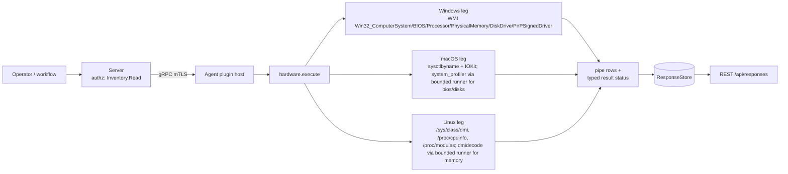

# hardware

<!-- BEGIN GENERATED: plugin-doc-gen header -->
| | |
|---|---|
| **What it does** | Reports hardware inventory: manufacturer, model, BIOS, CPU, memory, disks, drivers |
| **Version** | 1.0.0 · plugin ABI 4 · shipped in PR #3473 (2026-08-24) |
| **Kind** | Collector · read-only · on-demand (no scheduled trigger; each definition caches its last result for `gather.ttlSeconds` — 3600s for six actions, 86400s for `drivers`/`system`) |
| **Platforms** | Windows ✅ · macOS 🟡 constrained (`memory`, and `drivers` unsupported) · Linux 🟡 constrained (`memory`) |
| **Actions** | `manufacturer` (definition `device.hardware.manufacturer`) · `model` (`device.hardware.model`) · `bios` (`device.hardware.bios`) · `processors` (`device.hardware.processors`) · `memory` (`device.hardware.memory`) · `disks` (`device.hardware.disks`) · `drivers` (`device.hardware.drivers`) · `system` (`device.hardware.system`) |
| **Security** | securable `Inventory` · operation Read · risk Low · dispatch ReadOnly · approval gate none |
| **Roles** | execute: endpoint-admin, endpoint-operator · author: content-author |
<!-- END GENERATED -->

## How it works

Eight independent reads, dispatched by action name (`hardware_plugin.cpp:897`). `manufacturer`/`model`/`processors`/`system` are single native calls per OS (WMI, `sysctlbyname`/IOKit, or a `/sys`/`/proc` file read) with no subprocess. `bios` and `disks` need data no native API on macOS exposes, so those two legs shell out through the agent's bounded subprocess runner (`run_bounded_subprocess`, fixed deadline, no shell) to `system_profiler` and parse its output with a pure header-only parser (`hardware_macos_bios.hpp`, `hardware_disks_macos.hpp`). `memory` tries `dmidecode` on Linux (also via the bounded runner) and falls back to `/proc/meminfo`'s aggregate total when `dmidecode` is missing or fails. `drivers` enumerates `Win32_PnPSignedDriver` on Windows or reads `/proc/modules` on Linux; it is not implemented on macOS (no public per-driver/kext enumeration API).

Every action that can find nothing still emits one row carrying the literal `unknown` in place of an unread value (`hardware_plugin.cpp:236`, `:250`, `:335-337` and equivalents) — never a silent zero-row output — so a consumer can tell "the probe ran and found nothing" from "this action produced no output for an unrelated reason." This plugin is deliberately not a live-monitoring feed: every action is a point-in-time read with no polling, no event stream, and (except `drivers`, whose WMI query can take several seconds) no expectation of taking more than a few milliseconds.



## OS capability

<!-- BEGIN GENERATED: plugin-doc-gen capability -->
| Action | Windows | macOS | Linux |
|---|---|---|---|
| `manufacturer` | ✅ supported · rung 1 · `WMI Win32_ComputerSystem.Manufacturer` | ✅ supported · rung 1 · `sysctlbyname(hw.manufacturer)` | ✅ supported · rung 1 · `/sys/class/dmi/id/sys_vendor` |
| `model` | ✅ supported · rung 1 · `WMI Win32_ComputerSystem.Model` | ✅ supported · rung 1 · `sysctlbyname(hw.model)` | ✅ supported · rung 1 · `/sys/class/dmi/id/product_name` |
| `bios` | ✅ supported · rung 1 · `WMI Win32_BIOS` | ✅ supported · rung 2 · `run_bounded_subprocess(system_profiler SPHardwareDataType)` + native parser (`hardware_macos_bios.hpp`) | ✅ supported · rung 1 · `/sys/class/dmi/id/bios_vendor` + `bios_version` + `bios_date` |
| `processors` | ✅ supported · rung 1 · `WMI Win32_Processor` | ✅ supported · rung 1 · `sysctlbyname(machdep.cpu.*, hw.*cpu*)` | ✅ supported · rung 1 · `/proc/cpuinfo` |
| `memory` | ✅ supported · rung 1 · `WMI Win32_PhysicalMemory` | 🟡 constrained · rung 1 · `sysctlbyname(hw.memsize)` | 🟡 constrained · rung 2 · `run_bounded_subprocess(dmidecode -t memory)` |
| `disks` | ✅ supported · rung 1 · `WMI Win32_DiskDrive` | ✅ supported · rung 2 · `run_bounded_subprocess(system_profiler SPStorageDataType SPNVMeDataType SPSerialATADataType -json)` + native parser (`hardware_disks_macos.hpp`) | ✅ supported · rung 1 · `/sys/block/*/{size,device/model}` native walk |
| `drivers` | ✅ supported · rung 1 · `WMI Win32_PnPSignedDriver` | ⛔ unsupported · no mechanism bound | ✅ supported · rung 1 · `/proc/modules` |
| `system` | ✅ supported · rung 1 · `WMI Win32_BIOS.SerialNumber` + `Win32_ComputerSystemProduct.UUID` | ✅ supported · rung 1 · `IOServiceGetMatchingService(IOPlatformExpertDevice)` + `IORegistryEntryCreateCFProperty(kIOPlatformSerialNumberKey/kIOPlatformUUIDKey)` | ✅ supported · rung 1 · `/sys/class/dmi/id/product_serial` + `product_uuid` |

**Declared limits per leg** (the descriptor's fallback text, verbatim):

- **`memory` / Linux** — falls back to the aggregate `MemTotal` from `/proc/meminfo` (no per-DIMM detail) when dmidecode is unavailable or unprivileged.
- **`memory` / macOS** — aggregate total only, no per-DIMM breakdown (macOS has no public per-DIMM API).
<!-- END GENERATED -->

## Privileges and prerequisites

| OS | Runs as | Extra grant needed | Measured | If the read is refused |
|---|---|---|---|---|
| Windows | agent service account (LocalSystem today, #1442) | None documented for this plugin (`docs/agent-privilege-model.md:88`) | 2026-09-07, bare-metal, `SYSTEM` (sample stamp) | WMI query returns `error`, action falls back to its `unknown` sentinel row (`wmi_query`, `hardware_plugin.cpp:209-228`) |
| macOS | agent daemon, default (no extra entitlement) | None (`docs/agent-privilege-model.md:88`) | 2026-09-07, bare-metal, euid 501 (unprivileged, sample stamp) | native call/subprocess fails, action emits `unknown`/sentinel row |
| Linux | agent daemon, default, except `system` needs `cap_dac_read_search` (`docs/agent-privilege-model.md:89`) | `system` reads `/sys/class/dmi/id/product_serial` + `product_uuid` (mode `0400`); the agent binary carries `cap_dac_read_search+eip` by default install (`hardware_plugin.cpp:358-364`). Without it, or with `--no-setcap`, both fields read back `unknown`. `memory`'s `dmidecode` branch typically needs root and fails EPERM unprivileged, silently falling through to the `/proc/meminfo` total (`hardware_plugin.cpp:499-502`). | 2026-09-06, container, euid 0 (sample stamp — root, so the `cap_dac_read_search` gate is not exercised by this capture) | file read fails, action emits `unknown` |

Binaries/subprocesses: `/usr/sbin/system_profiler` (macOS `bios`, `disks`, via `run_bounded_subprocess`) and `dmidecode` (Linux `memory`, resolved via `probe_tool_path`, also via `run_bounded_subprocess`) — both bounded, no shell. No network access. Windows uses in-process WMI (COM), no child process.

## Data contract

### Inputs

<!-- BEGIN GENERATED: plugin-doc-gen inputs -->
`manufacturer`, `model`, `bios`, `processors`, `memory`, `disks`, `drivers`, and `system` all take no parameters (`spec.parameters.properties: {}` in each definition).
<!-- END GENERATED -->

### Outputs

Pipe-delimited rows, one per record via `write_output()`. Scalar actions (`manufacturer`, `model`) emit `key|value`; the rest emit one or more `key|field1|field2|...` rows. A field the underlying probe could not read is the literal string `unknown` rather than an omitted field or an empty row — this applies to every action's identity/value fields (`manufacturer`, `model`, `bios`, `processors`, `memory`, `disks`, `system`); `drivers` additionally emits `__truncated__` in the name field when the Windows WMI row cap (512, `agents/shared/wmi_bounded.hpp`) is hit (`hardware_plugin.cpp:739-746`).

<!-- BEGIN GENERATED: plugin-doc-gen outputs -->
**`manufacturer` — `manufacturer|value`**

| Field | Type | Values | Available | Example |
|---|---|---|---|---|
| `manufacturer` | string | OS-supplied text, or `unknown` | W, M, L | `PCSpecialist` · `Apple Inc.` |

**`model` — `model|value`**

| Field | Type | Values | Available | Example |
|---|---|---|---|---|
| `model` | string | OS-supplied text, or `unknown` | W, M, L | `Amd Am4 Gen3` · `Mac16,10` |

**`bios` — `bios_vendor|value` / `bios_version|value` / `bios_date|value`** (three separate rows)

| Field | Type | Values | Available | Example |
|---|---|---|---|---|
| `bios_vendor` | string | OS-supplied text, `Apple` on macOS (fixed literal), or `unknown` | W, M, L | `American Megatrends Inc.` |
| `bios_version` | string | OS/firmware version string, or `unknown` | W, M, L | `3801` |
| `bios_date` | string | `YYYY-MM-DD` on Windows/Linux, literal `N/A` on macOS (no BIOS date concept), or `unknown` | W, L (M always `N/A`) | `2021-07-30` |

**`processors` — `cpu|index|model|cores|threads|clock_mhz`** (one row per physical socket)

| Field | Type | Values | Available | Example |
|---|---|---|---|---|
| `index` | int | physical socket id (Linux: DMI `physical id`; macOS: always `0`; Windows: enumeration order) | W, M, L | `0` |
| `model` | string | CPU brand string, or `unknown` when no CPU rows were found | W, M, L | `AMD Ryzen 9 5900X 12-Core Processor` |
| `cores` | int | physical core count | W, M, L | `12` |
| `threads` | int | logical thread count | W, M, L | `24` |
| `clock_mhz` | int | max/reported clock in MHz; `0` when unreadable (e.g. Apple Silicon has no `hw.cpufrequency`) | W, M, L | `4200` |

**`memory` — `dimm|slot|size_mb|type|speed_mhz`** (one row per DIMM, or one aggregate row)

| Field | Type | Values | Available | Example |
|---|---|---|---|---|
| `slot` | string | DIMM locator (Windows/Linux dmidecode), or the literal `total` (macOS, Linux `/proc/meminfo` fallback) | W, L (per-DIMM); M, L-fallback (aggregate `total`) | `DIMM_A2` · `total` |
| `size_mb` | int64 | module or aggregate size in MB | W, M, L | `8192` · `32768` |
| `type` | string | `DDR2`/`DDR3`/`DDR4`/`DDR5` (Windows SMBIOS type, Linux dmidecode `Type:`), or `unknown` (macOS and the `/proc/meminfo` fallback never populate this) | W, L (per-DIMM only) | `DDR4` |
| `speed_mhz` | int | module speed in MHz, or `0` (macOS and the aggregate-total fallbacks) | W, L (per-DIMM only) | `3600` |

**`disks` — `disk|index|model|size_gb|media_type|interface`** (one row per physical disk)

| Field | Type | Values | Available | Example |
|---|---|---|---|---|
| `index` | int | enumeration index (Windows `Win32_DiskDrive.Index`; macOS/Linux assigned during enumeration, not guaranteed stable) | W, M, L | `0` |
| `model` | string | device model string, or `unknown` when nothing was found | W, M, L | `Samsung SSD 970 EVO Plus 1TB` |
| `size_gb` | int64 | capacity in GB, integer-divided from bytes/sectors | W, M, L | `931` |
| `media_type` | string | `SSD`/`HDD`/`Removable`/`unknown` (Windows: `MediaType` string match; macOS: NVMe is always `SSD`, SATA looked up from `SPStorageDataType`; Linux: `removable`/`rotational` sysfs attributes) | W, M, L | `SSD` |
| `interface` | string | Windows: `Win32_DiskDrive.InterfaceType` (e.g. `SCSI` — Windows reports NVMe/SATA disks as `SCSI` at this WMI layer, not the physical bus); macOS: `NVMe`/`SATA`; Linux: `nvme`/`usb`/`virtio`/`mmc`/`sata`/`scsi`/`unknown`, inferred from the `/sys/block/<n>` symlink target | W, M, L | `SCSI` · `NVMe` · `virtio` |

**`drivers` — `driver|index|name|version|date|provider|device_class`** (one row per driver/module)

| Field | Type | Values | Available | Example |
|---|---|---|---|---|
| `index` | int | enumeration order; on the truncation marker row, carries the reached row count instead | W, L | `0` |
| `name` | string | driver/module display name, `unknown` on an empty result, or the literal `__truncated__` sentinel marking a Windows WMI row-cap hit (512 rows) | W, L | `Realtek Audio Universal Service` · `__truncated__` |
| `version` | string | Windows: `DriverVersion`; Linux: always empty (`/proc/modules` carries no version) | W only | `6.0.9977.1` |
| `date` | string | Windows: `YYYY-MM-DD` parsed from the WMI CIM datetime, or empty if malformed; Linux: always empty | W only | `2026-04-14` |
| `provider` | string | Windows: `DriverProviderName`; Linux: always the literal `kernel` | W, L | `Realtek Semiconductor Corp.` · `kernel` |
| `device_class` | string | Windows: `DeviceClass` (e.g. `NET`, `SYSTEM`, `MEDIA`); Linux: always the literal `module` | W, L | `MEDIA` · `module` |

**`system` — `serial|value` / `system_uuid|value`** (two separate rows)

| Field | Type | Values | Available | Example |
|---|---|---|---|---|
| `serial` | string | hardware serial number, or `unknown` (e.g. a VM with no SMBIOS serial) | W, M, L | `2188270001` · `J6RYL9MKMJ` |
| `system_uuid` | string | SMBIOS/firmware UUID, or `unknown` | W, M, L | `DD8078E2-34FC-6597-1E0B-FC3497651E0A` |
<!-- END GENERATED -->

### Result status

This plugin does not set a typed result status; the agent records `UNDECLARED` and the sample shows `UNDECLARED / UNKNOWN /` for every action on every OS.

### Where the data goes

- **Instruction result, plus a daily-sync consumer for seven of the eight actions.** Rows travel over the agent's mTLS gRPC channel as the command response and land in the ResponseStore, queryable at `/api/responses/{id}`. The `device_ci` daily-sync source (ADR-0016) additionally invokes `manufacturer`, `model`, `system`, `bios`, `processors`, `memory`, and `disks` in-process via `LocalDispatcher` and folds their output into its canonical CI record (`agents/core/src/sync_source_device_ci.hpp:62-68`), which the server reconstructs field-for-field (`server/core/src/device_ci_ingestion.cpp:94-115`). `drivers` is the only action not part of that record. `content/definitions/hardware.yaml:517-518` documents this for the `system` action specifically.
- **Not consumed by** TAR, DEX, or metrics. `manufacturer`/`model`/`bios`/`processors`/`memory`/`disks` gather on a 3600s TTL; `drivers` and `system` on an 86400s TTL (`content/definitions/hardware.yaml`); nothing polls continuously.
- **Siblings:** `device_identity` (domain/OU join state, same Wave 3 native-acquisition migration), `disk_actions` (SMART health and volume-to-drive mapping — `hardware.disks` reports the drive inventory, `disk_actions` reports its health and logical mounts).
- **MCP / REST.** Discover: `discover_plugins` (summary) → `yuzu://plugin-docs` (this page as data) → `discover_instructions` / `get_definition("device.hardware.system")`. Run: `execute_instruction {definition_id, parameters}`. Read: `/api/responses/{id}`.

## Sample output

<!-- BEGIN GENERATED: plugin-doc-gen samples -->
**Windows** — captured: windows Microsoft Windows NT 10.0.26200.0 x64 · bare-metal · 2026-09-07 · SYSTEM · leg-hash pending

```
== action=manufacturer
manufacturer|PCSpecialist
[result_status] UNDECLARED / UNKNOWN /

== action=model
model|Amd Am4 Gen3
[result_status] UNDECLARED / UNKNOWN /

== action=bios
bios_vendor|American Megatrends Inc.
bios_version|3801
bios_date|2021-07-30
[result_status] UNDECLARED / UNKNOWN /

== action=processors
cpu|0|AMD Ryzen 9 5900X 12-Core Processor            |12|24|4200
[result_status] UNDECLARED / UNKNOWN /

== action=memory
dimm|DIMM_A2|8192|DDR4|3600
dimm|DIMM_B2|8192|DDR4|3600
[result_status] UNDECLARED / UNKNOWN /

== action=disks
disk|1|Samsung SSD 970 EVO Plus 1TB|931|HDD|SCSI
disk|0|Samsung SSD 970 EVO Plus 250GB|232|HDD|SCSI
[result_status] UNDECLARED / UNKNOWN /

== action=drivers
driver|0|Tailscale Tunnel|0.14.0.0|2021-10-13|WireGuard LLC|NET
driver|1|Xvdd SCSI Miniport|10.0.22029.3|2026-07-16|Xbox|SCSIADAPTER
driver|2|Generic software device|10.0.26100.1|2006-06-21|Microsoft|SOFTWAREDEVICE
driver|3|Local Print Queue|10.0.26100.1|2006-06-21|Microsoft|PRINTQUEUE
driver|4|Local Print Queue|10.0.26100.1|2006-06-21|Microsoft|PRINTQUEUE
driver|5|Local Print Queue|10.0.26100.1|2006-06-21|Microsoft|PRINTQUEUE
driver|6|Local Print Queue|10.0.26100.1|2006-06-21|Microsoft|PRINTQUEUE
driver|7|Local Print Queue|10.0.26100.1|2006-06-21|Microsoft|PRINTQUEUE
driver|8|WAN Miniport (Network Monitor)|10.0.26100.1|2006-06-21|Microsoft|NET
driver|9|WAN Miniport (IPv6)|10.0.26100.1|2006-06-21|Microsoft|NET
driver|10|WAN Miniport (IP)|10.0.26100.1|2006-06-21|Microsoft|NET
driver|11|WAN Miniport (PPPOE)|10.0.26100.1|2006-06-21|Microsoft|NET
driver|12|WAN Miniport (PPTP)|10.0.26100.1|2006-06-21|Microsoft|NET
driver|13|WAN Miniport (L2TP)|10.0.26100.1|2006-06-21|Microsoft|NET
driver|14|WAN Miniport (IKEv2)|10.0.26100.1|2006-06-21|Microsoft|NET
driver|15|WAN Miniport (SSTP)|10.0.26100.1|2006-06-21|Microsoft|NET
driver|16|Generic software device|10.0.26100.1|2006-06-21|Microsoft|SOFTWAREDEVICE
driver|17|Generic software device|10.0.26100.1|2006-06-21|Microsoft|SOFTWAREDEVICE
driver|18|Generic software device|10.0.26100.1|2006-06-21|Microsoft|SOFTWAREDEVICE
driver|19|Generic software device|10.0.26100.1|2006-06-21|Microsoft|SOFTWAREDEVICE
driver|20|Generic software device|10.0.26100.1|2006-06-21|Microsoft|SOFTWAREDEVICE
driver|21|Voice Clarity|1.0.4.7057|2026-06-16|Microsoft Corporation|AUDIOPROCESSINGOBJECT
driver|22|Computer Device|10.0.26100.1|2006-06-21|Microsoft|COMPUTER
driver|23|Remote Desktop Device Redirector Bus|10.0.26100.8972|2006-06-21|Microsoft|SYSTEM
driver|24|Plug and Play Software Device Enumerator|10.0.26100.4202|2025-05-23|Microsoft|SYSTEM
… 25 of 252 rows
[result_status] UNDECLARED / UNKNOWN /

== action=system
serial|2188270001
system_uuid|DD8078E2-34FC-6597-1E0B-FC3497651E0A
[result_status] UNDECLARED / UNKNOWN /
```

**macOS** — captured: macos macOS 26.6.2 arm64 · bare-metal · 2026-09-07 · euid 501 (alex) · leg-hash pending

```
== action=manufacturer
manufacturer|Apple Inc.
[result_status] UNDECLARED / UNKNOWN /

== action=model
model|Mac16,10
[result_status] UNDECLARED / UNKNOWN /

== action=bios
bios_vendor|Apple
bios_version|18000.161.10
bios_date|N/A
[result_status] UNDECLARED / UNKNOWN /

== action=processors
cpu|0|Apple M4|10|10|0
[result_status] UNDECLARED / UNKNOWN /

== action=memory
dimm|total|32768|unknown|0
[result_status] UNDECLARED / UNKNOWN /

== action=disks
disk|0|APPLE SSD AP0512Z|465|SSD|NVMe
[result_status] UNDECLARED / UNKNOWN /

== action=drivers
driver|0|unknown||||
[result_status] UNDECLARED / UNKNOWN /

== action=system
serial|J6RYL9MKMJ
system_uuid|EC27F833-3739-5416-A744-E97433A27C90
[result_status] UNDECLARED / UNKNOWN /
```

**Linux** — captured: linux Debian GNU/Linux 13 (trixie) aarch64 · container · 2026-09-06 · euid 0 · leg-hash pending

```
== action=manufacturer
manufacturer|unknown
[result_status] UNDECLARED / UNKNOWN /

== action=model
model|unknown
[result_status] UNDECLARED / UNKNOWN /

== action=bios
bios_vendor|unknown
bios_version|unknown
bios_date|unknown
[result_status] UNDECLARED / UNKNOWN /

== action=processors
cpu|0|unknown|0|0|0
[result_status] UNDECLARED / UNKNOWN /

== action=memory
dimm|total|7934|unknown|0
[result_status] UNDECLARED / UNKNOWN /

== action=disks
disk|0|vdb|0|HDD|virtio
disk|1|vda|460|HDD|virtio
[result_status] UNDECLARED / UNKNOWN /

== action=drivers
driver|0|selfowner|||kernel|module
driver|1|shiftfs|||kernel|module
driver|2|rosetta|||kernel|module
driver|3|grpcfuse|||kernel|module
driver|4|fakeowner|||kernel|module
[result_status] UNDECLARED / UNKNOWN /

== action=system
serial|unknown
system_uuid|unknown
[result_status] UNDECLARED / UNKNOWN /
```
<!-- END GENERATED -->

## Caveats and known gaps

1. **This plugin never sets a typed result status.** Every sample line reads `UNDECLARED / UNKNOWN /` regardless of whether the underlying probe succeeded, partially failed, or hit an unsupported leg (e.g. Linux `manufacturer`/`model`/`bios`/`system` all read `unknown` in the sample, and get the same `UNDECLARED` status as a clean Windows read). A consumer must inspect the row content (`unknown` fields, the `drivers` action's `__truncated__` marker), not the status, to tell success from degradation.
2. **`drivers` is not implemented on macOS.** No public per-driver/kext enumeration API exists; the descriptor declares it `YUZU_SUPPORT_UNSUPPORTED` (`hardware_plugin.cpp:849`) and the macOS sample shows the house `unknown` row rather than a capture.
3. **`memory` is aggregate-only on Linux and macOS.** Linux needs `dmidecode` (typically root) for per-DIMM detail and falls back to `/proc/meminfo`'s total when unavailable or unprivileged; the Linux sample (captured as root/euid 0 in a container) still shows the aggregate `total` row, meaning `dmidecode` itself found nothing usable in that environment even with root. macOS has no public per-DIMM API at all and always reports the aggregate.
4. **A connected-but-empty WMI query now emits an explicit `unknown` row instead of silently emitting nothing** — a deliberate divergence from the plugin's pre-#3404 behavior, made so a consumer can distinguish "the probe ran and found nothing" from an unrelated dispatch failure (`hardware_plugin.cpp:183-198`). Do not revert this to match the old silent-gap behavior.
5. **Windows `disks.interface` reports the WMI-layer bus (`SCSI`), not the physical bus** — both drives in the Windows sample are NVMe/SATA but report `SCSI`, because `Win32_DiskDrive.InterfaceType` reports the storage stack layer WMI actually asks, not the physical connector. `disk_actions.smart` decodes the true bus (`nvme`/`sata`/`usb`) via a lower-level IOCTL and is the more accurate source when that distinction matters.

## Source and tests

<!-- BEGIN GENERATED: plugin-doc-gen source -->
- Plugin: `agents/plugins/hardware/src/hardware_plugin.cpp` (descriptor + all eight actions) · `hardware_disks_macos.hpp` (macOS disk JSON parser) · `hardware_linux_parsers.hpp` (Linux dmidecode + `/sys/block` parsers) · `hardware_macos_bios.hpp` (macOS Boot ROM/firmware version parser)
- Definitions: `content/definitions/hardware.yaml`
- Capability rows: `server/core/src/capability_decls/plugin_action_catalogue_b.hpp`
- Tests: `tests/unit/test_hardware_device_identity_posix_actions.cpp` · `tests/unit/test_hardware_disks_macos.cpp` · `tests/unit/test_hardware_linux_parsers.cpp` · `tests/unit/test_hardware_macos_bios.cpp`
- Privilege row: `docs/agent-privilege-model.md`
- Changelog: `changelog.d/2204-declarations-group-b.added.md` · `changelog.d/2380-hardware-device-identity-native-acquisition.changed.md` · `changelog.d/3404-hardware-wmi-bounded.fixed.md`
<!-- END GENERATED -->
