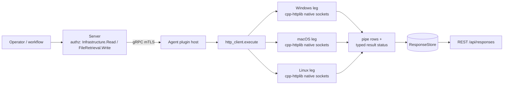

# http_client

<!-- BEGIN GENERATED: plugin-doc-gen header -->
| | |
|---|---|
| **What it does** | HTTP client — download files, GET/HEAD requests with hash verification (no shell-out) |
| **Version** | 1.1.0 |
| **Kind** | Action · mutating · on-demand |
| **Platforms** | Windows ✅ · macOS ✅ · Linux ✅ |
| **Actions** | `download` (definition `agent.http_client.download`) · `get` (definition `agent.http_client.get`) · `head` (definition `agent.http_client.head`) |
| **Security** | `download`: securable `FileRetrieval` · operation Write · risk High · dispatch Destructive · approval gate AdminOrApproval; `get`: securable `Infrastructure` · operation Read · risk Low · dispatch ReadOnly · approval gate None; `head`: securable `Infrastructure` · operation Read · risk Low · dispatch ReadOnly · approval gate None |
| **Roles** | execute: endpoint-admin, endpoint-operator · author: content-author |
<!-- END GENERATED -->

## How it works

All three actions parse the operator-supplied URL, reject anything but `http://`/`https://`, and run it through an SSRF filter before opening a connection: `hostname_resolves_to_private` resolves the hostname and rejects any IPv4/IPv6 result in a private, loopback, link-local, CGN, benchmarking, or unique-local range, and fails closed — blocking the request — if resolution itself fails. `get` and `head` then issue a single `httplib::Client`/`SSLClient` GET or HEAD and return the status plus body/headers as-is. `download` additionally canonicalizes the destination's parent directory and rejects any path containing a `..` component before streaming the response to disk, capping the transfer at 100 MiB by aborting mid-stream; it then SHA-256-hashes the file (BCrypt on Windows, OpenSSL EVP elsewhere) and, if `expected_hash` was supplied, deletes the file and fails on a mismatch. Every request goes through cpp-httplib's native in-process socket client — no shell invocation on any platform. The plugin deliberately does not follow HTTP redirects, does not accept custom headers/methods/auth, and does not retry a failed request.



## OS capability

<!-- BEGIN GENERATED: plugin-doc-gen capability -->
| Action | Windows | macOS | Linux |
|---|---|---|---|
| `download` | ✅ supported · rung 1 · cpp-httplib (native sockets) | ✅ supported · rung 1 · cpp-httplib (native sockets) | ✅ supported · rung 1 · cpp-httplib (native sockets) |
| `get` | ✅ supported · rung 1 · cpp-httplib (native sockets) | ✅ supported · rung 1 · cpp-httplib (native sockets) | ✅ supported · rung 1 · cpp-httplib (native sockets) |
| `head` | ✅ supported · rung 1 · cpp-httplib (native sockets) | ✅ supported · rung 1 · cpp-httplib (native sockets) | ✅ supported · rung 1 · cpp-httplib (native sockets) |
<!-- END GENERATED -->

## Privileges and prerequisites

| OS | Runs as | Extra grant needed | Measured | If the read is refused |
|---|---|---|---|---|
| Windows | agent service account (LocalSystem today, #1442) | None — outbound sockets and a write to an operator-chosen path need no elevated grant | 2026-09-07 as `SYSTEM` | `download`: `error\|failed to open destination file for writing` if the destination directory isn't writable |
| macOS | agent daemon | None | 2026-09-07 at euid 501 (alex, unprivileged) | same as above |
| Linux | agent daemon | None | 2026-09-06 at euid 0 (container) | same as above |

No subprocess execution on any platform — cpp-httplib's native socket client (`getaddrinfo`/`socket`/`connect`) runs in-process everywhere. Outbound network access to the operator-supplied URL's resolved address is required, subject to the SSRF filter above; on Windows, HTTPS additionally requires OpenSSL to have been found at build time (`CPPHTTPLIB_OPENSSL_SUPPORT`) — if it wasn't, every `https://` request on that build returns `status|0` / an `HTTPS not supported (OpenSSL not available)` message instead of connecting.

## Data contract

### Inputs

<!-- BEGIN GENERATED: plugin-doc-gen inputs -->
| Definition | Parameter | Type | Required | Default | Constraints | Description |
|---|---|---|---|---|---|---|
| `agent.http_client.download` | `url` | string | yes | - | - | HTTP or HTTPS URL to download. |
| `agent.http_client.download` | `path` | string | yes | - | - | Local file path to save the download. |
| `agent.http_client.download` | `expected_hash` | string | no | - | - | Optional SHA256 hash for verification. |
| `agent.http_client.get` | `url` | string | yes | - | - | HTTP or HTTPS URL to request. |
| `agent.http_client.head` | `url` | string | yes | - | - | HTTP or HTTPS URL to request. |
<!-- END GENERATED -->

### Outputs

Rows are pipe-delimited `field|value` lines written one at a time via `ctx.write_output()`; there is no multi-row output for any of these three actions, and a validation or transport failure emits a single `error|<message>` line in place of the normal fields rather than a row with an error status. `download`'s four fields (`status|path|size|hash`) and `get`'s two fields (`status|body`) match their declared result columns exactly. `head`'s declared columns do **not** match what the code emits: the leg writes only `status` and a single `headers` field holding the full raw response header block (one `Name: value` pair per line, newline-joined) — `content_length` and `content_type` are declared in the definition YAML but never populated by `do_head` (`http_client_plugin.cpp:535-545`); see Caveats.

<!-- BEGIN GENERATED: plugin-doc-gen outputs -->
**`agent.http_client.download` — `status|path|size|hash`**

| Field | Type | Values | Available | Example | Description |
|---|---|---|---|---|---|
| `status` | string | - | Windows, Linux, macOS | `ok` | Literal "ok" on success; a failed download emits a separate error output instead of a non-ok status row. |
| `path` | string | - | Windows, Linux, macOS | `/tmp/yuzu_capture/yuzu_capture_download.html` | Absolute path the file was written to, after canonicalizing the parent directory and rejecting any ".." component. Values: absolute filesystem path. |
| `size` | int64 | - | Windows, Linux, macOS | `559` | Size in bytes of the downloaded file on disk, read back with std::filesystem::file_size after the write completes. Values: non-negative integer, bytes. |
| `hash` | string | - | Windows, Linux, macOS | `ff67a9d764d6a2367a187734e697f6a53217db9a21c101d410a113ca871a299d` | Lowercase hex SHA-256 digest of the downloaded file, computed via BCrypt on Windows and OpenSSL EVP on Linux/macOS. Values: 64-character lowercase hex string. |

**`agent.http_client.get` — `status|body`**

| Field | Type | Values | Available | Example | Description |
|---|---|---|---|---|---|
| `status` | int32 | - | Windows, Linux, macOS | `200` | HTTP status code returned by the GET request, or 0 if the request could not be made (invalid URL, SSRF block, or connection failure). Values: HTTP status code, or 0 on request failure. |
| `body` | string | - | Windows, Linux, macOS | `<!doctype html><html lang="en"><head><title>Example Domain</title>...` | Response body text; a body over the 100 MiB cap is replaced with an error string, though the full response is already received over the wire before that check runs. Values: free text, or an error string on failure. |

**`agent.http_client.head` — `status|content_length|content_type`**

| Field | Type | Values | Available | Example | Description |
|---|---|---|---|---|---|
| `status` | int32 | - | Windows, Linux, macOS | `200` | HTTP status code returned by the HEAD request, or 0 if the request could not be made (invalid URL, SSRF block, or connection failure). Values: HTTP status code, or 0 on request failure. |
| `content_length` | int64 | - | all | `-` | Declared here but not populated by the current head leg, which writes one combined "headers" field (the full raw response header block) instead of parsed content_length/content_type fields — see the plugin README's Caveats section. Values: not emitted by current code. |
| `content_type` | string | - | all | `-` | Declared here but not populated by the current head leg, which writes one combined "headers" field (the full raw response header block) instead of parsed content_length/content_type fields — see the plugin README's Caveats section. Values: not emitted by current code. |
<!-- END GENERATED -->

### Result status

This plugin does not set a typed result status; the agent records `UNDECLARED` and the sample shows `UNDECLARED / UNKNOWN /` for every action on every OS.

### Where the data goes

- **Instruction result only.** Rows travel over the agent's mTLS gRPC channel as the command response and land in the ResponseStore (90-day default retention, `response_store.hpp:153`), queryable at `/api/responses/{id}`.
- **Not consumed by** daily-sync inventory, the TAR warehouse, DEX, or metrics — no server-side code references `agent.http_client.*` or `http_client` outside `agent_registry.cpp`'s instruction-catalogue description strings (`agent_registry.cpp:860-863`) and the capability declarations.
- **Sensitivity.** `get`/`download` rows carry the fetched URL's response body verbatim, and `head`'s `headers` field carries the full raw response header block — whatever the remote endpoint returns rides through unfiltered, so a URL pointed at an internal system could surface usernames, credentials, or other personal data in the body/headers; the `path`/`hash` fields otherwise carry nothing beyond the operator-chosen destination.
- **Siblings:** none — no other plugin performs outbound HTTP.
- **MCP / REST.** Discover: `discover_plugins` (summary) → `yuzu://plugin-docs` (this page as data) → `discover_instructions` / `get_definition("agent.http_client.get")`. Run: `execute_instruction {definition_id, parameters}`. Read: `/api/responses/{id}`.

## Sample output

<!-- BEGIN GENERATED: plugin-doc-gen samples -->
**Windows** — captured: windows Microsoft Windows NT 10.0.26200.0 x64 · bare-metal · 2026-09-07 · SYSTEM · leg-hash 6e02e2f89c34

```
== action=download url=https://www.example.com/ path=C:\WINDOWS\TEMP\yuzu_capture_87gld9cd/yuzu_capture_download.html
status|ok
path|C:\Windows\Temp\yuzu_capture_87gld9cd\yuzu_capture_download.html
size|559
hash|ff67a9d764d6a2367a187734e697f6a53217db9a21c101d410a113ca871a299d
[result_status] UNDECLARED / UNKNOWN

== action=get url=https://www.example.com/
status|200
body|<!doctype html><html lang="en"><head><title>Example Domain</title><link rel="icon" href="data:,"><meta name="viewport" content="width=device-width, initial-scale=1"><style>body{background:#eee;width:60vw;margin:15vh auto;font-family:system-ui,sans-serif}h1{font-size:1.5em}div{opacity:0.8}a:link,a:visited{color:#348}</style></head><body><div><h1>Example Domain</h1><p>This domain is for use in documentation examples without needing permission. Avoid use in operations.</p><p><a href="https://iana.org/domains/example">Learn more</a></p></div></body></html>
[result_status] UNDECLARED / UNKNOWN

== action=head url=https://www.example.com/
status|200
headers|Content-Type: text/html
Date: Mon, 07 Sep 2026 10:08:23 GMT
last-modified: Sun, 30 Aug 2026 04:11:49 GMT
Connection: close
cf-cache-status: HIT
Server: cloudflare
allow: GET, HEAD
Age: 4804
Content-Encoding: br
CF-RAY: a374e971bb806aad-MAN
[result_status] UNDECLARED / UNKNOWN
```

**macOS** — captured: macos macOS 26.6.2 arm64 · bare-metal · 2026-09-07 · euid 501 (alex) · leg-hash 6e02e2f89c34

```
== action=download url=https://www.example.com/ path=/var/folders/hq/lc3t_rsx2blfc8rhys6kzh4r0000gn/T/yuzu_capture_h8zzfku8/yuzu_capture_download.html
status|ok
path|/private/var/folders/hq/lc3t_rsx2blfc8rhys6kzh4r0000gn/T/yuzu_capture_h8zzfku8/yuzu_capture_download.html
size|559
hash|ff67a9d764d6a2367a187734e697f6a53217db9a21c101d410a113ca871a299d
[result_status] UNDECLARED / UNKNOWN

== action=get url=https://www.example.com/
status|200
body|<!doctype html><html lang="en"><head><title>Example Domain</title><link rel="icon" href="data:,"><meta name="viewport" content="width=device-width, initial-scale=1"><style>body{background:#eee;width:60vw;margin:15vh auto;font-family:system-ui,sans-serif}h1{font-size:1.5em}div{opacity:0.8}a:link,a:visited{color:#348}</style></head><body><div><h1>Example Domain</h1><p>This domain is for use in documentation examples without needing permission. Avoid use in operations.</p><p><a href="https://iana.org/domains/example">Learn more</a></p></div></body></html>
[result_status] UNDECLARED / UNKNOWN

== action=head url=https://www.example.com/
status|200
headers|CF-RAY: a374d6c43e292214-MAN
cf-cache-status: HIT
Age: 4039
Content-Encoding: br
last-modified: Sun, 30 Aug 2026 04:11:49 GMT
Server: cloudflare
Content-Type: text/html
Connection: close
allow: GET, HEAD
Date: Mon, 07 Sep 2026 09:55:38 GMT
[result_status] UNDECLARED / UNKNOWN
```

**Linux** — captured: linux Debian GNU/Linux 13 (trixie) aarch64 · container · 2026-09-06 · euid 0 · leg-hash 6e02e2f89c34

```
== action=download url=https://www.example.com/ path=/tmp/yuzu_capture/yuzu_capture_download.html
status|ok
path|/tmp/yuzu_capture/yuzu_capture_download.html
size|559
hash|ff67a9d764d6a2367a187734e697f6a53217db9a21c101d410a113ca871a299d
[result_status] UNDECLARED / UNKNOWN

== action=get url=https://www.example.com/
status|200
body|<!doctype html><html lang="en"><head><title>Example Domain</title><link rel="icon" href="data:,"><meta name="viewport" content="width=device-width, initial-scale=1"><style>body{background:#eee;width:60vw;margin:15vh auto;font-family:system-ui,sans-serif}h1{font-size:1.5em}div{opacity:0.8}a:link,a:visited{color:#348}</style></head><body><div><h1>Example Domain</h1><p>This domain is for use in documentation examples without needing permission. Avoid use in operations.</p><p><a href="https://iana.org/domains/example">Learn more</a></p></div></body></html>
[result_status] UNDECLARED / UNKNOWN

== action=head url=https://www.example.com/
status|200
headers|Content-Encoding: br
cf-cache-status: HIT
CF-RAY: a36fd1781c3488d3-MAN
Age: 8996
allow: GET, HEAD
last-modified: Sun, 30 Aug 2026 04:11:49 GMT
Server: cloudflare
Connection: close
Content-Type: text/html
Date: Sun, 06 Sep 2026 19:18:12 GMT
[result_status] UNDECLARED / UNKNOWN
```
<!-- END GENERATED -->

## Caveats and known gaps

1. **`head`'s declared result columns don't match what the code emits.** The definition YAML declares `status|content_length|content_type`; `do_head` (`http_client_plugin.cpp:535-545`) actually writes `status|headers`, where `headers` is the full raw header block. A consumer parsing by the declared schema will not find `content_length`/`content_type`.
2. **`get`'s size cap doesn't stop the transfer.** `download` streams to disk and aborts mid-transfer past 100 MiB (`content_receiver`, lines 265-273). `get` calls `cli.Get(parsed.path)` with no content receiver, so the full body is already downloaded in memory before the `res->body.size() > kMaxDownloadSize` check (line 350) replaces it with an error string — the cap limits what's returned, not what's fetched.
3. **No redirect following.** Neither `set_follow_location` nor any equivalent is called on any `httplib::Client`/`SSLClient` instance, so a 3xx response is returned as-is (status + whatever body/headers the redirect response itself carries), not followed.
4. **HTTPS on Windows depends on a build-time OpenSSL find.** Windows OpenSSL discovery is `required: false` (`meson.build`); when it isn't found, `CPPHTTPLIB_OPENSSL_SUPPORT` is undefined and every `https://` call on that build returns `status|0` with an "HTTPS not supported" message instead of connecting (lines 283-287, 334-337, 378-381). Linux/macOS require OpenSSL at configure time and always have it.
5. **This plugin does not set a typed result status.** Every sample shows `UNDECLARED / UNKNOWN /` regardless of outcome — a caller must parse the `status`/`error` output fields, not the result-status envelope, to detect failure.

## Source and tests

<!-- BEGIN GENERATED: plugin-doc-gen source -->
- Plugin: `agents/plugins/http_client/src/http_client_plugin.cpp`
- Definitions: `content/definitions/http_client.yaml`
- Capability rows: `server/core/src/capability_decls/plugin_action_catalogue_c.hpp`
- Tests: none found by name
- Privilege row: `docs/agent-privilege-model.md` (no row yet)
<!-- END GENERATED -->
