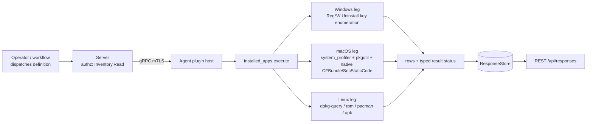

# installed_apps

<!-- BEGIN GENERATED: plugin-doc-gen header -->
| | |
|---|---|
| **What it does** | Inventories installed applications and queries by name |
| **Version** | 1.1.0 |
| **Kind** | Collector · read-only · on-demand (`list`, `query`, `list_per_user`; gather TTL 300s/300s/600s) · `list_inventory` has no definition and runs only via the agent's own 24h daily-sync scheduler, never the Instruction Engine's gather/TTL cache |
| **Platforms** | Windows ✅ · macOS ✅ · Linux ✅ |
| **Actions** | `list` (definition `crossplatform.software.inventory`) · `query` (definition `crossplatform.software.query`) · `list_per_user` (definition `crossplatform.software.per_user_inventory`) · `list_inventory` (no definition) |
| **Security** | securable `Inventory` · operation Read · risk Low · dispatch ReadOnly · approval gate none (`list`, `query`, `list_inventory`) · `AdminOrApproval` (`list_per_user`) |
| **Roles** | execute: endpoint-admin, endpoint-operator (`list`, `query`) · endpoint-admin only (`list_per_user`) · author: content-author · `list_inventory` carries no roles — it is never dispatched through RBAC |
<!-- END GENERATED -->

## How it works

`list`/`query` read the OS's native application registry: Windows enumerates the Uninstall keys (64-bit HKLM, WoW64 HKLM, and the agent's own HKCU) natively via `Reg*W`; Linux auto-detects dpkg/rpm/pacman; macOS shells out to `system_profiler SPApplicationsDataType`. `query` never re-acquires — it filters the same collection with a case-insensitive substring match and emits a `found|true`/`found|false` discriminator. `list_per_user` is the real per-user surface: on Windows it walks every local profile's registry hive via the shared `win_profiles.hpp` ladder, mounting `NTUSER.DAT` offline when a profile isn't already loaded; Linux/macOS instead report the same system-wide set tagged `username=system`, and macOS additionally runs `brew list --versions` under the calling account. `list_inventory` is a separate acquisition — the ADR-0016 daily-sync collector — emitting an extended 12-field row where a field an ecosystem doesn't store stays honestly empty (never a `-` placeholder), and on macOS it additionally performs a native, budget-capped CFBundle/SecStaticCode enrichment per app for publisher and signature *presence*. The plugin is read-only throughout: it never installs, removes, or verifies a package's cryptographic validity.



## OS capability

<!-- BEGIN GENERATED: plugin-doc-gen capability -->
| Action | Windows | macOS | Linux |
|---|---|---|---|
| `list` | ✅ supported · rung 1 · `Reg*W` enumeration of the Uninstall key(s) | ✅ supported · rung 2 · `system_profiler` via bounded argv runner | ✅ supported · rung 2 · `dpkg-query`/`rpm`/`pacman` via bounded argv runner |
| `query` | ✅ supported · rung 1 · `Reg*W` enumeration of the Uninstall key(s) | ✅ supported · rung 2 · `system_profiler` via bounded argv runner | ✅ supported · rung 2 · `dpkg-query`/`rpm`/`pacman` via bounded argv runner |
| `list_per_user` | ✅ supported · rung 1 · `Reg*W` enumeration of `HKU\<SID>`'s Uninstall key, mounting `NTUSER.DAT` via `RegLoadKeyW` when not already loaded | ✅ supported · rung 2 · `system_profiler` + `brew` via bounded argv runner | ✅ supported · rung 2 · `dpkg-query`/`rpm`/`pacman` via bounded argv runner |
| `list_inventory` | ✅ supported · rung 1 · `Reg*W` enumeration of the Uninstall key(s) | ✅ supported · rung 2 · `system_profiler` + `pkgutil` via bounded argv runner + native SecCode/CFBundle enrichment | ✅ supported · rung 2 · `dpkg-query`/`rpm`/`pacman`/`apk` via bounded argv runner |

**Declared limits per leg** (the descriptor's fallback text, verbatim):

None — every leg's `fallback` field in `kActionDescriptors` is `nullptr` (`installed_apps_plugin.cpp:959-1002`); no per-leg fallback text is declared for this plugin.
<!-- END GENERATED -->

## Privileges and prerequisites

| OS | Runs as | Extra grant needed | Measured | If the read is refused |
|---|---|---|---|---|
| Windows | agent service account — LocalSystem today, not the intended virtual service account (`docs/agent-privilege-model.md` Correction, #1442) | **None** for `list`/`query`/`list_inventory` — `Reg*W` reads only. `list_per_user`'s offline `NTUSER.DAT` mount fallback rides `SeBackupPrivilege` + `SeRestorePrivilege`, already held by the agent account (`docs/agent-privilege-model.md:87`) — no new privilege is introduced. | 2026-09-07, bare-metal, as `SYSTEM` (`windows.txt:1`) | `warning\|privilege_missing: SeBackupPrivilege/SeRestorePrivilege could not be enabled for N logged-out profile(s); their per-user apps are not listed` (`installed_apps_plugin.cpp:1123-1128`); machine-scope actions still report |
| macOS | agent daemon — root today (LaunchDaemon carries no `UserName` key; not yet narrowed to the unprivileged `_yuzu` account, #1455) | **None** — `docs/agent-privilege-model.md:86` lists `list`/`query`/`list_inventory` as `default`; no keychain/TCC/Location Services grant is touched | 2026-09-07, bare-metal, euid 501 (`alex`) (`macos.txt:1`) — captured unprivileged, not the daemon's real root identity | n/a — no privilege is required; a Security framework absent at build time silently no-ops the `#2273` enrichment (empty `publisher`/`signature_status`) rather than refusing (`meson.build:15-23`) |
| Linux | agent daemon, intended dedicated unprivileged account (`_yuzu`/`yuzu`) | **None** — `docs/agent-privilege-model.md:86` lists all four actions as `default`; the dpkg/rpm/pacman/apk databases are world-readable | 2026-09-06, container, euid 0 (`linux.txt:1`) — captured as root, not the intended unprivileged account | n/a — no privilege is required; a missing package-manager binary falls through the ladder and `probe_tool_path` returns empty, yielding an empty (not degraded) collection (`installed_apps_plugin.cpp:400-446`) |

Binaries/subprocesses: Linux — `dpkg-query`, `rpm`, `pacman`, `apk` (`list_inventory` only), probed by fixed absolute path (`installed_apps_plugin.cpp:404-441`, `:532-574`) and exec'd directly via `yuzu::agent::run_bounded_subprocess` (no shell, ADR-3002 rung 2). macOS — `system_profiler`, `pkgutil`, `brew` (`list_per_user` only), same bounded runner. Windows — no subprocess; native `Reg*W` calls only. No network access on any OS.

## Data contract

### Inputs

<!-- BEGIN GENERATED: plugin-doc-gen inputs -->
| Definition | Parameter | Type | Required | Default | Values | Description |
|---|---|---|---|---|---|---|
| `crossplatform.software.query` | `name` | string | yes | – | – | Case-insensitive substring matched against installed application names, 1–256 characters (`installed_apps.yaml:108-117`). |

`list` (`crossplatform.software.inventory`) takes no parameters (`installed_apps.yaml:42-43`).
`list_per_user` (`crossplatform.software.per_user_inventory`) takes no parameters (`installed_apps.yaml:182-183`).
`list_inventory` takes no parameters and has no definition — it is invoked directly by the agent's daily-sync scheduler, not through the Instruction Engine's parameter contract (`sync_source_installed_software.cpp:198-199`).
<!-- END GENERATED -->

### Outputs

Pipe-delimited rows, one per application, written via `write_output()`. `list`/`query`/`list_per_user` emit the stable `app`/`app`/`user_app`-tagged wire format `content/definitions/installed_apps.yaml` documents; `-` marks a field the OS reported empty. `list_inventory` emits a separate, extended `inv`-tagged 12-field row (blob contract v2, ADR-0016) where a field an ecosystem does not store stays *honestly empty* — never a `-` placeholder (`installed_apps_inventory.hpp:6-11`).

<!-- BEGIN GENERATED: plugin-doc-gen outputs -->
**`list` — `app|name|version|publisher|install_date`**

| Field | Type | Values | Available | Example |
|---|---|---|---|---|
| `name` | string | free text | W, M, L | `7-Zip 26.02 (x64)` |
| `version` | string | free text or `-` | W, M, L | `26.02` |
| `publisher` | string | free text or `-`; always `-` on macOS | W, L | `Igor Pavlov` |
| `install_date` | string | free text or `-`; dpkg-based Linux hosts always report `-` | W, M | `20260617` |

Empty (non-degraded) result: a literal sentinel row `app|No applications found|-|-|-`, rc 0 (`installed_apps_plugin.cpp:893-896`).

**`query` — `found|true`/`found|false` discriminator, then `app|name|version|publisher` per match**

| Field | Type | Values | Available | Example |
|---|---|---|---|---|
| `found` | bool | `true`, `false` | W, M, L | `true` |
| `name` | string | free text | W, M, L | `Microsoft Edge` |
| `version` | string | free text or `-` | W, M, L | `152.0.4191.66` |
| `publisher` | string | free text or `-`; always `-` on macOS | W, L | `Microsoft Corporation` |

`install_date` is not part of this row (`installed_apps_plugin.cpp:938-940`), unlike `list`.

**`list_per_user` — `user_app|username|name|version|publisher|install_date`**

| Field | Type | Values | Available | Example |
|---|---|---|---|---|
| `username` | string | resolved profile name, `system`, `brew`, or `-` (never a raw SID) | W, M, L | `Alex` |
| `name` | string | free text | W, M, L | `Signal 8.18.0` |
| `version` | string | free text or `-` | W, M, L | `8.18.0` |
| `publisher` | string | free text or `-`; always `-` on macOS and for Homebrew rows | W, L | `Signal Messenger, LLC` |
| `install_date` | string | free text or `-`; dpkg-based Linux hosts and Homebrew rows always report `-` | W, M | `20260714` |

**`list_inventory` — `inv|name|version|publisher|install_date|kind|ecosystem|epoch|release|arch|signature_status|distro_id|distro_version`** (no definition; not YAML-driven — table hand-built from `installed_apps_inventory.hpp:26-51`)

| Field | Type | Values | Available | Example |
|---|---|---|---|---|
| `name` | string | free text | W, M, L | `apt` |
| `version` | string | upstream version, release/revision stripped | W, M, L | `3.0.3` |
| `publisher` | string | rpm PACKAGER / deb Maintainer / Windows Publisher / macOS signer CN | W, M, L | `APT Development Team <deity@lists.debian.org>` |
| `install_date` | string | human-readable per ecosystem, or a raw UNIX-epoch string for `macos_pkgutil`; empty when unstored | W, M | `13/08/2026, 03:51` |
| `kind` | enum | `package`, `app`, `pkg` | W, M, L | `app` |
| `ecosystem` | enum | `rpm`, `deb`, `apk`, `pacman`, `windows`, `macos`, `macos_pkgutil` | W, M, L | `deb` |
| `epoch` | string | empty unless a numeric epoch prefix was present (deb/rpm/pacman) | L | `1` |
| `release` | string | empty when the source has no release/revision segment | L | `3.1` |
| `arch` | string | empty on Windows/macOS; deb/rpm/omitted-on-pacman on Linux | L | `arm64` |
| `signature_status` | enum | `signed`, `unsigned`, or empty (unknown/no Security framework at build time) | M, L (rpm only) | `signed` |
| `distro_id` | string | `/etc/os-release` `ID`; empty on non-Linux | L | `debian` |
| `distro_version` | string | `/etc/os-release` `VERSION_ID`; empty on non-Linux | L | `13` |
<!-- END GENERATED -->

**Empty-result convention.** `list_inventory` drops a row outright if `name` is empty (`installed_apps_plugin.cpp:845-847`); there is no sentinel row, so an empty collection is empty output at rc 0. A *degraded* collection instead returns rc 1 (`installed_apps_plugin.cpp:834-841`) and the daily sync skips the whole cycle rather than committing a partial inventory as authoritative.

### Result status

This plugin does not set a typed result status; the agent records `UNDECLARED` and the sample shows `UNDECLARED / UNKNOWN /` for every action (verified: no `set_result_status`/`yuzu_ctx_set_result_status` call exists anywhere in `installed_apps_plugin.cpp`).

### Where the data goes

- **Instruction result.** `list`/`query`/`list_per_user` rows travel over the agent's mTLS gRPC channel as the command response and land in the ResponseStore (operator-configurable retention, 90-day default — `server.hpp:222`), queryable at `/api/responses/{id}`.
- **Daily-sync typed store.** `list_inventory` is never dispatched through `execute_instruction` — it has no definition. The agent's own `SyncSource` (`make_installed_software_source`, `sync_source_installed_software.cpp:181-199`) runs it every 24 hours, canonicalizes the parsed rows into a hash-skip blob, and pushes it to the server's typed `SoftwareInventoryStore` (ADR-0016), served fleet-wide at `GET /api/v1/inventory/software` (`rest_api_v1.cpp:6800`), gated on `Inventory:Read`.
- **Not consumed by** TAR, DEX, or metrics — no reference to `installed_apps`/`crossplatform.software.*` was found in the TAR or DEX collector sources.
- **Siblings:** `msi_packages.*` (Windows-only MSI package detail) and `license_scan.list` (software-licence/entitlement detection) — grouped alongside `installed_apps` in the privilege matrix's read-only row (`docs/agent-privilege-model.md:86`).
- **MCP / REST.** Discover: `discover_plugins` (summary) → `yuzu://plugin-docs` (this page as data) → `discover_instructions` / `get_definition("crossplatform.software.inventory")`. Run: `execute_instruction {definition_id, parameters}`. Read: `/api/responses/{id}` for `list`/`query`/`list_per_user`; `list_inventory`'s daily-sync output instead lands at `GET /api/v1/inventory/software`, since it carries no definition and is never dispatched through `execute_instruction`.

## Sample output

<!-- BEGIN GENERATED: plugin-doc-gen samples -->
**Windows** — captured: windows Microsoft Windows NT 10.0.26200.0 x64 · bare-metal · 2026-09-07 · SYSTEM · leg-hash pending

```
== action=list
app|7-Zip 26.02 (x64)|26.02|Igor Pavlov|-
app|Age of Empires II: Definitive Edition|-|Forgotten Empires|-
app|Application Verifier x64 External Package (DesktopEditions)|10.1.26100.7705|Microsoft|20260617
app|Application Verifier x64 External Package (OnecoreUAP)|10.1.26100.7705|Microsoft|20260617
app|Baldur's Gate 3|-|Larian Studios|-
app|Battle.net|-|Blizzard Entertainment|-
app|CCleaner 7|7.10.1464.1889|Piriform|-
app|CMake|4.3.3|Kitware|20260617
app|Cities: Skylines II|-|Colossal Order Ltd.|-
app|Crusader Kings III|-|Paradox Development Studio|-
app|DayZ|-|Bohemia Interactive|-
app|Defraggler|2.22|Piriform|-
app|Diablo IV|-|Blizzard Entertainment|-
app|DiagnosticsHub_CollectionService|17.14.36412|Microsoft Corporation|20260617
app|Docker Desktop|4.84.0|Docker Inc.|-
app|Erlang OTP 28.5.0.1 (16.4.0.1)|28.5.0.1|Ericsson AB|-
app|Flawless Widescreen version 1.0.15|1.0.15|Flawless Widescreen|20220919
app|Football Manager 2024|-|Sports Interactive|-
app|Git|2.54.0|The Git Development Community|20260715
app|GitHub CLI|2.89.0|GitHub, Inc.|20260403
app|Google Chrome|149.0.7827.201|Google LLC|20260629
app|Google Update Helper|1.3.101.0|Google LLC|20211018
app|HELLDIVERS™ 2|-|Arrowhead Game Studios|-
app|Kits Configuration Installer|10.1.26100.7705|Microsoft|20260617
app|Logi Options+|2.6.944893|Logitech|-
… 25 of 226 rows
[result_status] UNDECLARED / UNKNOWN / 

== action=query name=Microsoft
found|true
app|Microsoft .NET Host - 6.0.11 (x64)|48.47.50420|Microsoft Corporation
app|Microsoft .NET Host - 6.0.20 (x86)|48.83.63169|Microsoft Corporation
app|Microsoft .NET Host - 8.0.28 (x64)|64.112.53549|Microsoft Corporation
app|Microsoft .NET Host - 8.0.28 (x86)|64.112.53549|Microsoft Corporation
app|Microsoft .NET Host FX Resolver - 6.0.11 (x64)|48.47.50420|Microsoft Corporation
app|Microsoft .NET Host FX Resolver - 6.0.20 (x86)|48.83.63169|Microsoft Corporation
app|Microsoft .NET Host FX Resolver - 8.0.28 (x64)|64.112.53549|Microsoft Corporation
app|Microsoft .NET Host FX Resolver - 8.0.28 (x86)|64.112.53549|Microsoft Corporation
app|Microsoft .NET Runtime - 6.0.11 (x64)|48.47.50420|Microsoft Corporation
app|Microsoft .NET Runtime - 6.0.20 (x86)|48.83.63169|Microsoft Corporation
app|Microsoft .NET Runtime - 8.0.28 (x64)|64.112.53549|Microsoft Corporation
app|Microsoft .NET Runtime - 8.0.28 (x86)|64.112.53549|Microsoft Corporation
app|Microsoft 365 Apps for enterprise - en-us|16.0.19822.20114|Microsoft Corporation
app|Microsoft Edge|152.0.4191.66|Microsoft Corporation
app|Microsoft Edge WebView2 Runtime|152.0.4191.66|Microsoft Corporation
app|Microsoft GameInput|3.3.221.0|Microsoft Corporation
app|Microsoft Teams Meeting Add-in for Microsoft Office|1.25.28902|Microsoft
app|Microsoft Update Health Tools|5.72.0.0|Microsoft Corporation
app|Microsoft Visual C++ 2005 Redistributable|8.0.61001|Microsoft Corporation
app|Microsoft Visual C++ 2005 Redistributable (x64)|8.0.61000|Microsoft Corporation
app|Microsoft Visual C++ 2010  x64 Redistributable - 10.0.40219|10.0.40219|Microsoft Corporation
app|Microsoft Visual C++ 2010  x86 Redistributable - 10.0.40219|10.0.40219|Microsoft Corporation
app|Microsoft Visual C++ 2012 Redistributable (x64) - 11.0.61030|11.0.61030.0|Microsoft Corporation
app|Microsoft Visual C++ 2012 Redistributable (x86) - 11.0.61030|11.0.61030.0|Microsoft Corporation
… 25 of 57 rows
[result_status] UNDECLARED / UNKNOWN / 

== action=list_per_user
user_app|Alex|Signal 8.18.0|8.18.0|Signal Messenger, LLC|-
user_app|Alex|Discord|1.0.9255|Discord Inc.|20212118
user_app|Alex|NordPass|7.9.5|NordPass Team|-
user_app|Alex|Inno Setup version 6.7.3|6.7.3|jrsoftware.org|20260714
user_app|Alex|ninja|1.13.2|ninja-build|20260617
user_app|Alex|Node.js (LTS)|24.16.0|Node.js Foundation|20260617
user_app|Alex|Microsoft Visual Studio Code (User)|1.128.1|Microsoft Corporation|20260715
user_app|Alex|Python 3.12.10 (64-bit)|3.12.10150.0|Python Software Foundation|-
user_app|Alex|MSYS2|20260611|The MSYS2 Developers|Wed Jun 17 17:28:18 2026
user_app|Alex|Paradox Launcher v2|1.0.0.0|Paradox Interactive|-
[result_status] UNDECLARED / UNKNOWN / 

== action=list_inventory
inv|7-Zip 26.02 (x64)|26.02|Igor Pavlov||app|windows||||||
inv|Age of Empires II: Definitive Edition||Forgotten Empires||app|windows||||||
inv|Application Verifier x64 External Package (DesktopEditions)|10.1.26100.7705|Microsoft|20260617|app|windows||||||
inv|Application Verifier x64 External Package (OnecoreUAP)|10.1.26100.7705|Microsoft|20260617|app|windows||||||
inv|Baldur's Gate 3||Larian Studios||app|windows||||||
inv|Battle.net||Blizzard Entertainment||app|windows||||||
inv|CCleaner 7|7.10.1464.1889|Piriform||app|windows||||||
inv|CMake|4.3.3|Kitware|20260617|app|windows||||||
inv|Cities: Skylines II||Colossal Order Ltd.||app|windows||||||
inv|Crusader Kings III||Paradox Development Studio||app|windows||||||
inv|DayZ||Bohemia Interactive||app|windows||||||
inv|Defraggler|2.22|Piriform||app|windows||||||
inv|Diablo IV||Blizzard Entertainment||app|windows||||||
inv|DiagnosticsHub_CollectionService|17.14.36412|Microsoft Corporation|20260617|app|windows||||||
inv|Docker Desktop|4.84.0|Docker Inc.||app|windows||||||
inv|Erlang OTP 28.5.0.1 (16.4.0.1)|28.5.0.1|Ericsson AB||app|windows||||||
inv|Flawless Widescreen version 1.0.15|1.0.15|Flawless Widescreen|20220919|app|windows||||||
inv|Football Manager 2024||Sports Interactive||app|windows||||||
inv|Git|2.54.0|The Git Development Community|20260715|app|windows||||||
inv|GitHub CLI|2.89.0|GitHub, Inc.|20260403|app|windows||||||
inv|Google Chrome|149.0.7827.201|Google LLC|20260629|app|windows||||||
inv|Google Update Helper|1.3.101.0|Google LLC|20211018|app|windows||||||
inv|HELLDIVERS™ 2||Arrowhead Game Studios||app|windows||||||
inv|Kits Configuration Installer|10.1.26100.7705|Microsoft|20260617|app|windows||||||
inv|Logi Options+|2.6.944893|Logitech||app|windows||||||
… 25 of 226 rows
[result_status] UNDECLARED / UNKNOWN / 
```

**macOS** — captured: macos macOS 26.6.2 arm64 · bare-metal · 2026-09-07 · euid 501 (alex) · leg-hash pending

```
== action=list
app|50onPaletteServer|1.1.0|-|13/08/2026, 03:51
app|ABAssistantService|14.0|-|13/08/2026, 03:51
app|AMSEngagementViewService|1.0|-|13/08/2026, 03:51
app|AOSAlertManager|1.07|-|13/08/2026, 03:51
app|AOSHeartbeat|1.07|-|13/08/2026, 03:51
app|AOSPushRelay|1.07|-|13/08/2026, 03:51
app|AOSUIPrefPaneLauncher|1.0|-|13/08/2026, 03:51
app|ARDAgent|3.9.8|-|13/08/2026, 03:51
app|AVB Configuration|1440.7|-|13/08/2026, 03:51
app|AXVisualSupportAgent|1.0|-|13/08/2026, 03:51
app|About This Mac|1.0|-|13/08/2026, 03:51
app|Accessibility Reader|1.0|-|13/08/2026, 03:51
app|Accessibility Tutorial|1.0|-|13/08/2026, 03:51
app|AccessibilityUIServer|1.0|-|13/08/2026, 03:51
app|AccessibilityVisualsAgent|1.0|-|13/08/2026, 03:51
app|Activity Monitor|10.14|-|13/08/2026, 03:51
app|AddPrinter|607|-|13/08/2026, 03:51
app|AddressBookManager|14.0|-|13/08/2026, 03:51
app|AddressBookSourceSync|14.0|-|13/08/2026, 03:51
app|AddressBookSync|14.0|-|13/08/2026, 03:51
app|AddressBookUrlForwarder|14.0|-|13/08/2026, 03:51
app|AinuIM|1.0|-|13/08/2026, 03:51
app|AirDrop|26.4|-|13/08/2026, 03:51
app|AirPlayUIAgent|2.0|-|13/08/2026, 03:51
app|AirPort Base Station Agent|2.2.1|-|13/08/2026, 03:51
… 25 of 322 rows
[result_status] UNDECLARED / UNKNOWN / 

== action=query name=bash
found|false
[result_status] UNDECLARED / UNKNOWN / 

== action=list_per_user
user_app|system|50onPaletteServer|1.1.0|-|13/08/2026, 03:51
user_app|system|ABAssistantService|14.0|-|13/08/2026, 03:51
user_app|system|AMSEngagementViewService|1.0|-|13/08/2026, 03:51
user_app|system|AOSAlertManager|1.07|-|13/08/2026, 03:51
user_app|system|AOSHeartbeat|1.07|-|13/08/2026, 03:51
user_app|system|AOSPushRelay|1.07|-|13/08/2026, 03:51
user_app|system|AOSUIPrefPaneLauncher|1.0|-|13/08/2026, 03:51
user_app|system|ARDAgent|3.9.8|-|13/08/2026, 03:51
user_app|system|AVB Configuration|1440.7|-|13/08/2026, 03:51
user_app|system|AXVisualSupportAgent|1.0|-|13/08/2026, 03:51
user_app|system|About This Mac|1.0|-|13/08/2026, 03:51
user_app|system|Accessibility Reader|1.0|-|13/08/2026, 03:51
user_app|system|Accessibility Tutorial|1.0|-|13/08/2026, 03:51
user_app|system|AccessibilityUIServer|1.0|-|13/08/2026, 03:51
user_app|system|AccessibilityVisualsAgent|1.0|-|13/08/2026, 03:51
user_app|system|Activity Monitor|10.14|-|13/08/2026, 03:51
user_app|system|AddPrinter|607|-|13/08/2026, 03:51
user_app|system|AddressBookManager|14.0|-|13/08/2026, 03:51
user_app|system|AddressBookSourceSync|14.0|-|13/08/2026, 03:51
user_app|system|AddressBookSync|14.0|-|13/08/2026, 03:51
user_app|system|AddressBookUrlForwarder|14.0|-|13/08/2026, 03:51
user_app|system|AinuIM|1.0|-|13/08/2026, 03:51
user_app|system|AirDrop|26.4|-|13/08/2026, 03:51
user_app|system|AirPlayUIAgent|2.0|-|13/08/2026, 03:51
user_app|system|AirPort Base Station Agent|2.2.1|-|13/08/2026, 03:51
… 25 of 323 rows
[result_status] UNDECLARED / UNKNOWN / 
[rc] 1

== action=list_inventory
inv|App Store|3.0|macOS Software Signing|13/08/2026, 03:51|app|macos||||signed||
inv|Apps|1.0|macOS Software Signing|13/08/2026, 03:51|app|macos||||signed||
inv|Automator|2.10|macOS Software Signing|13/08/2026, 03:51|app|macos||||signed||
inv|Books|8.5|macOS Software Signing|13/08/2026, 03:51|app|macos||||signed||
inv|Calculator|12.0|macOS Software Signing|13/08/2026, 03:51|app|macos||||signed||
inv|Calendar|16.0|macOS Software Signing|13/08/2026, 03:51|app|macos||||signed||
inv|Chess|3.18|macOS Software Signing|13/08/2026, 03:51|app|macos||||signed||
inv|Clock|1.1|macOS Software Signing|13/08/2026, 03:51|app|macos||||signed||
inv|Contacts|14.0|macOS Software Signing|13/08/2026, 03:51|app|macos||||signed||
inv|Dictionary|2.3.0|macOS Software Signing|13/08/2026, 03:51|app|macos||||signed||
inv|FaceTime|36|macOS Software Signing|13/08/2026, 03:51|app|macos||||signed||
inv|Find My|4.0|macOS Software Signing|13/08/2026, 03:51|app|macos||||signed||
inv|Font Book|11.0|macOS Software Signing|13/08/2026, 03:51|app|macos||||signed||
inv|Freeform|4.5|macOS Software Signing|13/08/2026, 03:51|app|macos||||signed||
inv|Games|1.0|macOS Software Signing|13/08/2026, 03:51|app|macos||||signed||
inv|Home|10.0|macOS Software Signing|13/08/2026, 03:51|app|macos||||signed||
inv|Image Capture|8.0|macOS Software Signing|13/08/2026, 03:51|app|macos||||signed||
inv|Image Playground|1.0|macOS Software Signing|13/08/2026, 03:51|app|macos||||signed||
inv|Journal|2.0|macOS Software Signing|13/08/2026, 03:51|app|macos||||signed||
inv|Mail|16.0|macOS Software Signing|13/08/2026, 03:51|app|macos||||signed||
inv|Maps|3.0|macOS Software Signing|13/08/2026, 03:51|app|macos||||signed||
inv|Messages|26.0|macOS Software Signing|13/08/2026, 03:51|app|macos||||signed||
inv|Mission Control|1.2|macOS Software Signing|13/08/2026, 03:51|app|macos||||signed||
inv|Music|1.6.6|macOS Software Signing|13/08/2026, 03:51|app|macos||||signed||
inv|ShortcutsActions||macOS Software Signing|13/08/2026, 03:51|app|macos||||signed||
… 25 of 390 rows
[result_status] UNDECLARED / UNKNOWN / 
```

**Linux** — captured: linux Debian GNU/Linux 13 (trixie) aarch64 · container · 2026-09-06 · euid 0 · leg-hash pending

```
== action=list
app|apt|3.0.3|APT Development Team <deity@lists.debian.org>|-
app|autoconf|2.72-3.1|Alex Myczko <tar@debian.org>|-
app|automake|1:1.17-4|Eric Dorland <eric@debian.org>|-
app|autotools-dev|20240727.1|Henrique de Moraes Holschuh <hmh@debian.org>|-
app|base-files|13.8+deb13u6|Santiago Vila <sanvila@debian.org>|-
app|base-passwd|3.6.7|Shadow package maintainers <pkg-shadow-devel@lists.alioth.debian.org>|-
app|bash|5.2.37-2+b9|Matthias Klose <doko@debian.org>|-
app|binutils|2.44-3|Matthias Klose <doko@debian.org>|-
app|binutils-aarch64-linux-gnu|2.44-3|Matthias Klose <doko@debian.org>|-
app|binutils-common|2.44-3|Matthias Klose <doko@debian.org>|-
app|bison|2:3.8.2+dfsg-1+b2|Chuan-kai Lin <cklin@debian.org>|-
app|bsdutils|1:2.41.5-0+deb13u1|Chris Hofstaedtler <zeha@debian.org>|-
app|ca-certificates|20250419|Julien Cristau <jcristau@debian.org>|-
app|cmake|3.31.6-2|Debian CMake Team <pkg-cmake-team@lists.alioth.debian.org>|-
app|cmake-data|3.31.6-2|Debian CMake Team <pkg-cmake-team@lists.alioth.debian.org>|-
app|coreutils|9.7-3|Michael Stone <mstone@debian.org>|-
app|cpp|4:14.2.0-1|Debian GCC Maintainers <debian-gcc@lists.debian.org>|-
app|cpp-13|13.3.0-16|Debian GCC Maintainers <debian-gcc@lists.debian.org>|-
app|cpp-13-aarch64-linux-gnu|13.3.0-16|Debian GCC Maintainers <debian-gcc@lists.debian.org>|-
app|cpp-14|14.2.0-19|Debian GCC Maintainers <debian-gcc@lists.debian.org>|-
app|cpp-14-aarch64-linux-gnu|14.2.0-19|Debian GCC Maintainers <debian-gcc@lists.debian.org>|-
app|cpp-aarch64-linux-gnu|4:14.2.0-1|Debian GCC Maintainers <debian-gcc@lists.debian.org>|-
app|curl|8.14.1-2+deb13u4|Debian Curl Maintainers <team+curl@tracker.debian.org>|-
app|dash|0.5.12-12|Andrej Shadura <andrewsh@debian.org>|-
app|debconf|1.5.91|Debconf Developers <debconf-devel@lists.alioth.debian.org>|-
… 25 of 206 rows
[result_status] UNDECLARED / UNKNOWN / 

== action=query name=bash
found|true
app|bash|5.2.37-2+b9|Matthias Klose <doko@debian.org>
[result_status] UNDECLARED / UNKNOWN / 

== action=list_per_user
user_app|system|apt|3.0.3|APT Development Team <deity@lists.debian.org>|-
user_app|system|autoconf|2.72-3.1|Alex Myczko <tar@debian.org>|-
user_app|system|automake|1:1.17-4|Eric Dorland <eric@debian.org>|-
user_app|system|autotools-dev|20240727.1|Henrique de Moraes Holschuh <hmh@debian.org>|-
user_app|system|base-files|13.8+deb13u6|Santiago Vila <sanvila@debian.org>|-
user_app|system|base-passwd|3.6.7|Shadow package maintainers <pkg-shadow-devel@lists.alioth.debian.org>|-
user_app|system|bash|5.2.37-2+b9|Matthias Klose <doko@debian.org>|-
user_app|system|binutils|2.44-3|Matthias Klose <doko@debian.org>|-
user_app|system|binutils-aarch64-linux-gnu|2.44-3|Matthias Klose <doko@debian.org>|-
user_app|system|binutils-common|2.44-3|Matthias Klose <doko@debian.org>|-
user_app|system|bison|2:3.8.2+dfsg-1+b2|Chuan-kai Lin <cklin@debian.org>|-
user_app|system|bsdutils|1:2.41.5-0+deb13u1|Chris Hofstaedtler <zeha@debian.org>|-
user_app|system|ca-certificates|20250419|Julien Cristau <jcristau@debian.org>|-
user_app|system|cmake|3.31.6-2|Debian CMake Team <pkg-cmake-team@lists.alioth.debian.org>|-
user_app|system|cmake-data|3.31.6-2|Debian CMake Team <pkg-cmake-team@lists.alioth.debian.org>|-
user_app|system|coreutils|9.7-3|Michael Stone <mstone@debian.org>|-
user_app|system|cpp|4:14.2.0-1|Debian GCC Maintainers <debian-gcc@lists.debian.org>|-
user_app|system|cpp-13|13.3.0-16|Debian GCC Maintainers <debian-gcc@lists.debian.org>|-
user_app|system|cpp-13-aarch64-linux-gnu|13.3.0-16|Debian GCC Maintainers <debian-gcc@lists.debian.org>|-
user_app|system|cpp-14|14.2.0-19|Debian GCC Maintainers <debian-gcc@lists.debian.org>|-
user_app|system|cpp-14-aarch64-linux-gnu|14.2.0-19|Debian GCC Maintainers <debian-gcc@lists.debian.org>|-
user_app|system|cpp-aarch64-linux-gnu|4:14.2.0-1|Debian GCC Maintainers <debian-gcc@lists.debian.org>|-
user_app|system|curl|8.14.1-2+deb13u4|Debian Curl Maintainers <team+curl@tracker.debian.org>|-
user_app|system|dash|0.5.12-12|Andrej Shadura <andrewsh@debian.org>|-
user_app|system|debconf|1.5.91|Debconf Developers <debconf-devel@lists.alioth.debian.org>|-
… 25 of 206 rows
[result_status] UNDECLARED / UNKNOWN / 

== action=list_inventory
inv|apt|3.0.3|APT Development Team <deity@lists.debian.org>||package|deb|||arm64||debian|13
inv|autoconf|2.72|Alex Myczko <tar@debian.org>||package|deb||3.1|all||debian|13
inv|automake|1.17|Eric Dorland <eric@debian.org>||package|deb|1|4|all||debian|13
inv|autotools-dev|20240727.1|Henrique de Moraes Holschuh <hmh@debian.org>||package|deb|||all||debian|13
inv|base-files|13.8+deb13u6|Santiago Vila <sanvila@debian.org>||package|deb|||arm64||debian|13
inv|base-passwd|3.6.7|Shadow package maintainers <pkg-shadow-devel@lists.alioth.debian.org>||package|deb|||arm64||debian|13
inv|bash|5.2.37|Matthias Klose <doko@debian.org>||package|deb||2+b9|arm64||debian|13
inv|binutils|2.44|Matthias Klose <doko@debian.org>||package|deb||3|arm64||debian|13
inv|binutils-aarch64-linux-gnu|2.44|Matthias Klose <doko@debian.org>||package|deb||3|arm64||debian|13
inv|binutils-common|2.44|Matthias Klose <doko@debian.org>||package|deb||3|arm64||debian|13
inv|bison|3.8.2+dfsg|Chuan-kai Lin <cklin@debian.org>||package|deb|2|1+b2|arm64||debian|13
inv|bsdutils|2.41.5|Chris Hofstaedtler <zeha@debian.org>||package|deb|1|0+deb13u1|arm64||debian|13
inv|ca-certificates|20250419|Julien Cristau <jcristau@debian.org>||package|deb|||all||debian|13
inv|cmake|3.31.6|Debian CMake Team <pkg-cmake-team@lists.alioth.debian.org>||package|deb||2|arm64||debian|13
inv|cmake-data|3.31.6|Debian CMake Team <pkg-cmake-team@lists.alioth.debian.org>||package|deb||2|all||debian|13
inv|coreutils|9.7|Michael Stone <mstone@debian.org>||package|deb||3|arm64||debian|13
inv|cpp|14.2.0|Debian GCC Maintainers <debian-gcc@lists.debian.org>||package|deb|4|1|arm64||debian|13
inv|cpp-13|13.3.0|Debian GCC Maintainers <debian-gcc@lists.debian.org>||package|deb||16|arm64||debian|13
inv|cpp-13-aarch64-linux-gnu|13.3.0|Debian GCC Maintainers <debian-gcc@lists.debian.org>||package|deb||16|arm64||debian|13
inv|cpp-14|14.2.0|Debian GCC Maintainers <debian-gcc@lists.debian.org>||package|deb||19|arm64||debian|13
inv|cpp-14-aarch64-linux-gnu|14.2.0|Debian GCC Maintainers <debian-gcc@lists.debian.org>||package|deb||19|arm64||debian|13
inv|cpp-aarch64-linux-gnu|14.2.0|Debian GCC Maintainers <debian-gcc@lists.debian.org>||package|deb|4|1|arm64||debian|13
inv|curl|8.14.1|Debian Curl Maintainers <team+curl@tracker.debian.org>||package|deb||2+deb13u4|arm64||debian|13
inv|dash|0.5.12|Andrej Shadura <andrewsh@debian.org>||package|deb||12|arm64||debian|13
inv|debconf|1.5.91|Debconf Developers <debconf-devel@lists.alioth.debian.org>||package|deb|||all||debian|13
… 25 of 206 rows
[result_status] UNDECLARED / UNKNOWN / 
```
<!-- END GENERATED -->

## Caveats and known gaps

1. **Windows `list`/`query` machine scope is invisible to a partial failure.** `enumerate_uninstall_key` returns silently if `RegOpenKeyExW` fails and stops at the first non-`ERROR_SUCCESS` from `RegEnumKeyExW` (`installed_apps_plugin.cpp:312-330`); a partial registry walk still reports success today. `do_list_inventory`'s own comment (`installed_apps_plugin.cpp:817-824`) flags this as pre-existing and needing its own change to close, not something this plugin currently detects.
2. **macOS `signature_status` is presence, not validity.** The `#2273` enrichment calls `SecCodeCopySigningInformation` only, never `SecStaticCodeCheckValidity` — a bundle with `Contents/_CodeSignature` deleted, or with bytes appended to its Mach-O, both still read `signed` (`installed_apps_macos_enrich.hpp:13-30`). Deep verification was deliberately left an open decision, not shipped.
3. **`list`/`query`/`list_per_user` degrade loudly only on Linux/macOS.** A subprocess that is killed, times out, is truncated, or exits nonzero (outside the tolerated per-ID `pkgutil` lookup) makes these three emit `error|installed_apps: acquisition degraded (...)` and return rc 1 rather than a false-empty/partial list (`installed_apps_plugin.cpp:857-870`). The Windows registry path has no equivalent signal — see caveat 1.
4. **`query`'s row omits `install_date`.** `do_query` emits `app|name|version|publisher` (`installed_apps_plugin.cpp:938-940`), one field short of `list`'s `app|name|version|publisher|install_date` (`installed_apps_plugin.cpp:899-902`) — intentional per the YAML contract (`installed_apps.yaml:119-128`), not a truncation bug.
5. **The `list_inventory`/`list_per_user` samples were captured under the wrong identity on two of three OSes, and the macOS `list_per_user` `[rc] 1` traces to that.** macOS ran unprivileged (`euid 501`) and Linux ran as root inside a container (`euid 0`); neither matches the agent's actual production identity (root today on macOS, the intended `_yuzu` account on Linux) — see *Privileges and prerequisites*. On macOS, `do_list_per_user` first lists system apps via `system_profiler` (succeeds), then probes for Homebrew and, if found, runs `brew list --versions` (`installed_apps_plugin.cpp:1162-1165`); under the euid-501 capture identity that `brew` invocation exits nonzero, `run_tool` marks it `degraded` on any nonzero exit (`installed_apps_plugin.cpp:186-188`), and `report_if_degraded` then emits the `error|...` row and returns rc 1 (`installed_apps_plugin.cpp:857-870`, called at `:1166-1167`) — the traced cause of the sample's `[rc] 1`, not an unrelated fault.

## Source and tests

<!-- BEGIN GENERATED: plugin-doc-gen source -->
- Plugin: `agents/plugins/installed_apps/src/installed_apps_plugin.cpp` (descriptor + actions) · `installed_apps_inventory.hpp` (`list_inventory` v2 row parse/format) · `installed_apps_parsers.hpp` (`list`/`query`/`list_per_user` acquisition parsers) · `installed_apps_macos_enrich.hpp` (macOS CFBundle/SecStaticCode enrichment) · `installed_apps_registry_utf8.hpp` (Windows UTF-16↔UTF-8 registry conversion)
- Definitions: `content/definitions/installed_apps.yaml`
- Capability rows: `server/core/src/capability_decls/plugin_action_catalogue_b.hpp:456-500`
- Tests: `tests/unit/test_installed_apps_actions.cpp` · `tests/unit/test_installed_apps_inventory.cpp` · `tests/unit/test_installed_apps_macos_enrich.cpp` · `tests/unit/test_installed_apps_parsers.cpp` · `tests/unit/test_installed_apps_registry_utf8.cpp`
- Privilege row: `docs/agent-privilege-model.md:86-87`
- Changelog: `changelog.d/2204-declarations-group-b.added.md` · `changelog.d/2771-per-user-hive-ladder-consolidation.changed.md` · `changelog.d/2771-privilegescope-token-adjust-bug.fixed.md` · `changelog.d/wave4-pr43a-installed-apps-msi-argv.changed.md` · `changelog.d/wave4-pr43a-macos-inventory-enrichment.added.md` · `changelog.d/wave4-pr43b-software-actions-license.fixed.md`
<!-- END GENERATED -->
