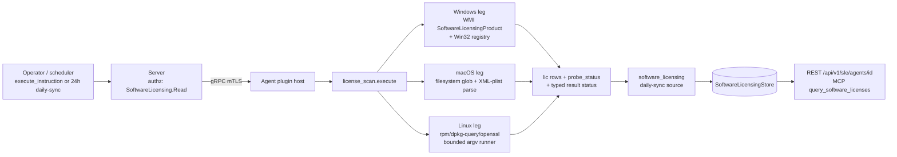

# license_scan

<!-- BEGIN GENERATED: plugin-doc-gen header -->
| | |
|---|---|
| **What it does** | Detects software licences across OS, vendor and per-user surfaces |
| **Version** | 1.0.0 |
| **Kind** | Collector · read-only · on-demand |
| **Platforms** | Windows ✅ · macOS 🟡 constrained · Linux 🟡 constrained |
| **Actions** | `list` · `surfaces` |
| **Security** | securable `SoftwareLicensing` · operation Read · risk Low · dispatch ReadOnly · approval gate None |
| **Roles** | execute: - · author: - |
<!-- END GENERATED -->

## How it works

Both actions call the same `collect_surfaces()` → `run_platform_surfaces()` per-OS entry point. `list` emits every detected `lic|` record first, then one `probe_status|<surface>|ok|<rows>` (or `|error|<message>`) diagnostic line per surface attempted, then returns rc 0 unconditionally — "success" is structural (the enumeration sweep completed), not a claim that every surface answered. `surfaces` runs the identical sweep but suppresses the `lic|` records, emitting only the `probe_status|` diagnostics; it is the live-diagnostics counterpart to `list`, not a cheaper version of it.

Per OS, surfaces run in a fixed order, most-authoritative first: Windows queries WMI `SoftwareLicensingProduct` (`slp_wmi`, authoritative licence state), then Office ClickToRun config, then the machine-scope `ProbeSpec` table rows (SQL Server, Exchange, VMware, WinRAR, OSS presence, …), then per-user registry hives and profile files. Linux runs `pkg_metadata` (rpm, falling back to dpkg-query), then RHEL `entitlement_certs` (openssl-parsed, authoritative expiry), then FlexLM `.lic` files. macOS runs the Mac App Store receipt scan, then vendor-plist presence rows.

The plugin is deliberately not an entitlement tracker: FlexLM seat counts and KMS activation counts (`ent|` records) are explicit PR2 scope and are never emitted here. It is also not a general plist parser — a binary (`bplist00`) `Info.plist` on macOS falls back to the bundle name with an empty version rather than being decoded.



## OS capability

<!-- BEGIN GENERATED: plugin-doc-gen capability -->
| Action | Windows | macOS | Linux |
|---|---|---|---|
| `list` | ✅ supported · rung 1 · wmi+win32_registry | 🟡 constrained · rung 1 · filesystem_probe(glob+plist) | 🟡 constrained · rung 2 · rpm/dpkg-query/openssl via bounded argv runner |
| `surfaces` | ✅ supported · rung 1 · wmi+win32_registry | 🟡 constrained · rung 1 · filesystem_probe(glob+plist) | 🟡 constrained · rung 2 · rpm/dpkg-query/openssl via bounded argv runner |

**Declared limits per leg** (descriptor fallback text, verbatim):

- **`list` / macOS** — binary (bplist00) Info.plist files are not parsed; falls back to the bundle name with an empty version
- **`list` / Linux** — declared-licence classification only (no lapse detection) for pkg_metadata; entitlement_certs' authoritative expiry still depends on the openssl CLI being present
- **`surfaces` / macOS** — binary (bplist00) Info.plist files are not parsed; falls back to the bundle name with an empty version
- **`surfaces` / Linux** — declared-licence classification only (no lapse detection) for pkg_metadata; entitlement_certs' authoritative expiry still depends on the openssl CLI being present
<!-- END GENERATED -->

## Privileges and prerequisites

| OS | Runs as | Extra grant needed | Measured | If the read is refused |
|---|---|---|---|---|
| Windows | agent service account (LocalSystem today, #1442) | **None.** Machine-scope surfaces need only the agent account's existing registry-read access. The per-user offline-hive fallback rides `SeBackupPrivilege` + `SeRestorePrivilege`, already held by the agent account for `tar.*`/certificate-store writes — no new privilege is introduced. | 2026-09-07, bare-metal, as `SYSTEM` | `slp_wmi` (authoritative) errors block the daily-sync cycle; `per_user_hives` degrades to `privilege_missing`/`hive_unload_failed`/`profile_list_unreadable` without blocking `list`, since per-user hives are never a primary surface |
| macOS | agent LaunchDaemon, runs as **root** today (no `UserName` key; required for TAR's Endpoint Security client, unrelated to this plugin) | **None.** `mas_receipt`/`vendor_plists` are unprivileged filesystem glob + plist reads. | 2026-09-07, bare-metal, at euid 501 (unprivileged) — this plugin needs none of the daemon's root grant | no coded refusal path: an unreadable file or absent glob match reports a structural zero-row success, never an error |
| Linux | agent daemon, designed to run unprivileged as `yuzu` | **None.** `pkg_metadata` (rpm/dpkg-query) and FlexLM `.lic` files are world-readable; RHEL entitlement certs under `/etc/pki/entitlement/*.pem` are world-readable. | 2026-09-06, container, at euid 0 (root) — not representative of the unprivileged production account, but no privilege is required either way | `entitlement_certs` reports `openssl_unavailable` when certs exist but the CLI is missing; `pkg_metadata` reports `dpkg_query_failed`/`output_truncated` on a query failure |

Binaries/subprocesses: Linux only — `rpm`, `dpkg-query`, `openssl` via the bounded argv runner (no shell, 20 s per-call deadline, 60 s aggregate budget for the entitlement-certs loop). Windows and macOS: none — WMI/registry and filesystem/plist reads only, no subprocess. No network access on any OS.

## Data contract

### Inputs

<!-- BEGIN GENERATED: plugin-doc-gen inputs -->
Neither action takes parameters.
<!-- END GENERATED -->

### Outputs

No definition YAML ships for this plugin, so these tables are derived from the plugin source and the sample captures rather than `spec.result.columns`. `list` emits two distinct row shapes on the same stream: `lic|` records (one per detected licence) followed by `probe_status|` diagnostics (one per surface attempted); `surfaces` emits only the `probe_status|` diagnostics. Every `lic` field is drawn from a closed vocabulary and is "unknown-preserving" — the plugin never fabricates a value it cannot justify; absence is empty, not a guess.

<!-- BEGIN GENERATED: plugin-doc-gen outputs -->
No definition declares result columns.
<!-- END GENERATED -->

### Result status

| Status | Completeness | Provenance | When |
|---|---|---|---|
| `UNDECLARED` (never explicitly set) | UNKNOWN | — | every probe outcome in the run was `ok` — the case in all three sample captures |
| `CONSTRAINED` | PARTIAL | `license_scan:surface_error` | at least one probe surface outcome has `ok=false`, set identically after both `list` and `surfaces` |

### Where the data goes

- **Daily-sync (`software_licensing` source).** `list` output feeds a 24 h scheduled sync: the empty-vs-error structural guard skips a cycle (keeps last good state) if a primary/authoritative surface (`slp_wmi`, `entitlement_certs`, `flexlm_lic`) errored, and caps at 10,000 records / 1 MiB blob / 2 MiB raw capture — an over-cap or over-budget cycle is skipped rather than sent truncated.
- **Server store.** The blob is parsed and ingested into `SoftwareLicensingStore`.
- **REST.** `GET /api/v1/sle/agents/{agent_id}` — per-device detected licences (product, type, channel, state, expiry, confidence, exe_hints, and the per-user `user_scope`/`user_ref` fields), gated `SoftwareLicensing:Read` scoped to the device, audited per open. `DELETE /api/v1/sle/agents/{agent_id}` — decommission erasure, requiring `SoftwareLicensing:Delete` AND `Inventory:Delete` AND `GuaranteedState:Delete`.
- **MCP.** The `query_software_licenses` tool, gated `SoftwareLicensing:Read`, confined scope — reads the same store, not a live dispatch.
- **Not consumed by** the TAR warehouse or DEX/metrics pipelines — no reference to `license_scan` or `SoftwareLicensing` was found in those paths in this sweep.
- **Sensitivity.** `lic` rows are an installed-software/licence inventory: `product`/`vendor`/`version` name specific installed software and versions, `exe_hints` names installed executables, and `key_hint` carries a partial OS-provided key or key-derived hash (never raw key material); `user_scope`/`user_ref` can carry a local profile name for a user-scoped licence (empty in every sample capture here). `probe_status` rows carry nothing beyond a surface name and row count.
- **Siblings:** none shipped. `ent|` entitlement records (FlexLM seat counts, KMS activation counts) are explicitly out of scope for this plugin (PR2, ADR-0024 D12) — see Caveats.
- **MCP / REST.** Discover: `discover_plugins` (summary) → `yuzu://plugin-docs` (this page as data) → `discover_instructions` finds no definition for this plugin today — no `content/definitions/license_scan.yaml` exists, so `get_definition(...)` has no id to resolve. Run: once an `InstructionDefinition` is authored against `license_scan.list`/`license_scan.surfaces`, `execute_instruction {definition_id, parameters}`. Read: `GET /api/v1/sle/agents/{agent_id}` or the MCP `query_software_licenses` tool.

## Sample output

<!-- BEGIN GENERATED: plugin-doc-gen samples -->
**Windows** — captured: windows Microsoft Windows NT 10.0.26200.0 x64 · bare-metal · 2026-09-07 · SYSTEM · leg-hash 93534d76a8aa

```
== action=list
lic|Office 16, Office16O365ProPlusR_Grace edition|Microsoft||retail|retail|unlicensed||os_licensing_api|authoritative|VMFTK||machine|
lic|Windows(R), Professional edition|Microsoft||retail|retail|licensed||os_licensing_api|authoritative|3V66T||machine|
lic|Microsoft Office (O365ProPlusRetail)|Microsoft|16.0.19822.20114|subscription||unknown||registry_probe|probable||winword.exe,excel.exe,outlook.exe,powerpnt.exe|machine|
lic|Microsoft Visual Studio|Microsoft||unknown||unknown||registry_probe|heuristic||devenv.exe|machine|
lic|7-Zip|Igor Pavlov||open_source||unknown||registry_probe|heuristic||7zfm.exe|machine|
lic|Notepad++|Notepad++ Team||open_source||unknown||registry_probe|heuristic||notepad++.exe|machine|
lic|Git for Windows|The Git Development Community||open_source||unknown||registry_probe|heuristic||git.exe|machine|
probe_status|slp_wmi|ok|2
probe_status|office_c2r|ok|1
probe_status|sql_server|ok|0
probe_status|exchange|ok|0
probe_status|visual_studio|ok|1
… 12 of 21 rows shown
[result_status] UNDECLARED / UNKNOWN

== action=surfaces
probe_status|slp_wmi|ok|2
probe_status|office_c2r|ok|1
probe_status|sql_server|ok|0
probe_status|exchange|ok|0
probe_status|visual_studio|ok|1
probe_status|autodesk_adsklicensing|ok|0
probe_status|veeam|ok|0
probe_status|acronis|ok|0
probe_status|av_suites|ok|0
probe_status|vmware_workstation|ok|0
probe_status|winrar|ok|0
probe_status|open_source_classification|ok|3
… 12 of 14 rows shown
[result_status] UNDECLARED / UNKNOWN
```

**macOS** — captured: macos macOS 26.6.2 arm64 · bare-metal · 2026-09-07 · euid 501 (alex) · leg-hash 93534d76a8aa

```
== action=list
lic|Pages Creator Studio|||retail||licensed||app_receipt|probable|||machine|
lic|iMovie|||retail||licensed||app_receipt|probable|||machine|
lic|Numbers Creator Studio|||retail||licensed||app_receipt|probable|||machine|
lic|Keynote Creator Studio|||retail||licensed||app_receipt|probable|||machine|
lic|uBlock Origin Lite||2026.901.1442|retail||licensed||app_receipt|probable|||machine|
lic|GarageBand|||retail||licensed||app_receipt|probable|||machine|
lic|Hush||1.0.19|retail||licensed||app_receipt|probable|||machine|
probe_status|mas_receipt|ok|7
probe_status|vendor_plists|ok|0
[result_status] UNDECLARED / UNKNOWN

== action=surfaces
probe_status|mas_receipt|ok|7
probe_status|vendor_plists|ok|0
[result_status] UNDECLARED / UNKNOWN
```

**Linux** — captured: linux Debian GNU/Linux 13 (trixie) aarch64 · container · 2026-09-06 · euid 0 · leg-hash 93534d76a8aa

```
== action=list
lic|apt||3.0.3|open_source||unknown||package_metadata|heuristic|||machine|
lic|autoconf||2.72-3.1|open_source||unknown||package_metadata|heuristic|||machine|
lic|automake||1:1.17-4|open_source||unknown||package_metadata|heuristic|||machine|
lic|base-files||13.8+deb13u6|open_source||unknown||package_metadata|heuristic|||machine|
lic|base-passwd||3.6.7|open_source||unknown||package_metadata|heuristic|||machine|
lic|bash||5.2.37-2+b9|open_source||unknown||package_metadata|heuristic|||machine|
lic|bison||2:3.8.2+dfsg-1+b2|open_source||unknown||package_metadata|heuristic|||machine|
lic|bsdutils||1:2.41.5-0+deb13u1|open_source||unknown||package_metadata|heuristic|||machine|
lic|ca-certificates||20250419|open_source||unknown||package_metadata|heuristic|||machine|
lic|cmake||3.31.6-2|open_source||unknown||package_metadata|heuristic|||machine|
lic|cmake-data||3.31.6-2|open_source||unknown||package_metadata|heuristic|||machine|
lic|coreutils||9.7-3|open_source||unknown||package_metadata|heuristic|||machine|
… 12 of 149 rows shown
[result_status] UNDECLARED / UNKNOWN

== action=surfaces
probe_status|pkg_metadata|ok|146
probe_status|entitlement_certs|ok|0
probe_status|flexlm_lic|ok|0
[result_status] UNDECLARED / UNKNOWN
```
<!-- END GENERATED -->

## Caveats and known gaps

1. **Linux legs are declared CONSTRAINED, not SUPPORTED, by deliberate decision.** `pkg_metadata` is a declared-licence classification only (no lapse detection); `entitlement_certs`' authoritative expiry still depends on the `openssl` CLI being present. Not a regression — the migration off `popen` to the bounded argv runner is what made the demotion visible, not what caused the gap.
2. **A binary macOS Info.plist is never decoded.** `bplist00` bundles fall back to the bundle name with an empty version, deliberately, because parsing binary plists without a Mac to verify against was ruled too risky to ship.
3. **Per-user Windows probes are never a primary surface.** A missing `SeBackup`/`SeRestore` privilege or a hive-unload failure degrades the `per_user_hives` probe status honestly but never blocks `list` or the daily-sync cycle — per-user licence state is additive, not authoritative.
4. **`ent|` entitlement records are explicitly out of scope.** FlexLM seat counts and KMS activation counts are PR2 scope (ADR-0024 D12); do not add seat-count emission here without that decision being revisited.
5. **An `rpm` execution failure — not absence — falls through to `dpkg-query`.** A stray/leftover `rpm` binary with an uninitialized database (seen live on a self-hosted CI runner) failed every query while `dpkg-query` worked fine as the host's real package manager; only rpm's *absence* is treated as "try the next tool" the same way, execution failure is now handled identically rather than reported as a terminal error. A truncated capture (`output_truncated`) is kept as a distinct, honest failure mode, never folded into a silent partial success.

## Source and tests

<!-- BEGIN GENERATED: plugin-doc-gen source -->
- Plugin: `agents/plugins/license_scan/src/license_scan_plugin.cpp` · `agents/plugins/license_scan/src/licensing_linux.cpp` · `agents/plugins/license_scan/src/licensing_macos.cpp` · `agents/plugins/license_scan/src/licensing_parsers.hpp` · `agents/plugins/license_scan/src/licensing_probes.cpp` · `agents/plugins/license_scan/src/licensing_probes.hpp` · `agents/plugins/license_scan/src/licensing_record.hpp` · `agents/plugins/license_scan/src/licensing_win.cpp`
- Capability rows: `server/core/src/capability_decls/plugin_action_catalogue_a.hpp`
- Tests: `tests/unit/test_license_scan_actions.cpp`
- Privilege row: `docs/agent-privilege-model.md`
<!-- END GENERATED -->
