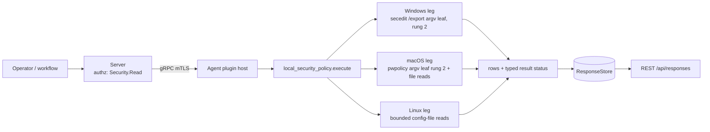

# local_security_policy

<!-- BEGIN GENERATED: plugin-doc-gen header -->
| | |
|---|---|
| **What it does** | Reports local password, lockout and audit policy posture and sudoers content |
| **Version** | 1.0.0 |
| **Kind** | Collector · read-only · gathered (crossplatform.local_security_policy.password_policy, crossplatform.local_security_policy.lockout_policy, crossplatform.local_security_policy.audit_policy, crossplatform.local_security_policy.sudoers) |
| **Platforms** | Windows 🟡 constrained · macOS 🟡 constrained · Linux 🟡 constrained |
| **Actions** | `audit_policy` (definition `crossplatform.local_security_policy.audit_policy`) · `lockout_policy` (definition `crossplatform.local_security_policy.lockout_policy`) · `password_policy` (definition `crossplatform.local_security_policy.password_policy`) · `sudoers` (definition `crossplatform.local_security_policy.sudoers`) |
| **Security** | securable `Security` · operation Read · risk Low · dispatch ReadOnly · approval gate None |
| **Roles** | execute: endpoint-admin, endpoint-operator, security-admin · author: content-author |
<!-- END GENERATED -->

## How it works

Four read-only actions (`local_security_policy_plugin.cpp`) report a host's local security policy: `password_policy`, `lockout_policy`, `audit_policy` and `sudoers`. Each writes pipe-delimited rows, the first field being the action name, then `<key>|<value>|<source>` (`sudoers` rows carry `<file>|<kind>|<subject>|<runas>|<nopasswd>|<commands>`). No action takes parameters, so no request text reaches a path or an argv. Nothing is ever written, configured or imported.

- **Linux (rung 1, bounded file reads):** `/etc/login.defs`, `/etc/security/pwquality.conf`, `/etc/security/faillock.conf`, the password and auth/account stacks under `/etc/pam.d` (`pam_pwquality`, `pam_pwhistory`, `pam_cracklib`, `pam_unix`, `pam_faillock`, `pam_tally2`, `pam_tally`), `/etc/audit/audit.rules` (rule, watch-rule and syscall-rule counts and the `-e` state), and `/etc/sudoers` plus `/etc/sudoers.d`.
- **macOS:** `password_policy` and `lockout_policy` come from `pwpolicy -getaccountpolicies`, a **rung-2** argv leaf (one spawn per action, sink `local_security_policy/do_password_policy#1`), because no public OpenDirectory global-policy API exists; the plist is parsed with `CFPropertyListCreateWithData`, never a hand-rolled scanner. `audit_policy` reads `/etc/security/audit_control` (absent by default on current macOS) and `sudoers` reads `/etc/sudoers` and `/etc/sudoers.d`.
- **Windows (rung 2, not rung 1):** `password_policy`, `lockout_policy` and `audit_policy` share one `secedit.exe /export /areas SECURITYPOLICY` argv leaf (sink `local_security_policy/do_export#1`), parsed from its UTF-16LE INI (`[System Access]` and `[Event Audit]`). The roadmap first drafted this leg as `NetUserModalsGet`/`LsaQueryInformationPolicy` at rung 1; the tree has no LSA policy-query precedent, `NetUserModalsGet` was passed over, and `docs/agent-privilege-model.md` names `secedit /export` the authoritative source on a running box, so the leg is declared rung 2 and the descriptor, the capability matrix and this page all say so. `sudoers` has no Windows leg.

**Scratch directory and stale sweep (Windows).** `secedit` writes the export itself, so each dispatch creates its own directory `local_security_policy-<32 hex>` under `agent.data_dir` (random 128-bit name, created with `CREATE_NEW`, owner-only DACL), holds it open, checks it is the agent's own, and removes it on every path the process survives. With `agent.data_dir` unset the action reports `constrained|data_dir_unset`: there is no fallback location. A crash or service stop between the export and the delete would orphan a copy of the machine's policy, so every dispatch first sweeps `local_security_policy-<32 hex>` directories older than one hour under `agent.data_dir`, ownership-verified (a same-named directory owned by another SID is skipped; a non-flat one is left intact). The sweep outcome is logged only, never a row or a token.

Every source reads as exactly one of three things: a **value**, **`absent`** (the OS definitively reports the file, key or directory is not there) or **`unreadable`** (the read failed). A failed read never reads as absent, and absence is not a failure: an `absent` row adds no reason token and does not lower the status. A refused read reports `PERMISSION_DENIED`; any other failure reports `CONSTRAINED` with one `<source>:<cause>` token. A value the tables cannot interpret is named `unmodelled`, never dropped.

**Why this plugin exists (stated plainly, not inflated).** Zero documented driver anywhere: not even a tangential mention across capability-map, enterprise-parity, the SOC 2 doc or `docs/roadmap.md` (the capability-map plugin-inventory row is added by this change as a listing, not a driver). The SOC 2 doc's Workstream B (Identity/Access/Admin Security) covers RBAC/SSO/MFA for **Yuzu's own** admin accounts, with zero overlap with a managed endpoint's local security policy. This is pure capability-gap reasoning, not evidenced demand.



## OS capability

<!-- BEGIN GENERATED: plugin-doc-gen capability -->
| Action | Windows | macOS | Linux |
|---|---|---|---|
| `audit_policy` | 🟡 constrained · rung 2 · secedit.exe /export /areas SECURITYPOLICY | 🟡 constrained · rung 1 · /etc/security/audit_control (bounded file read) | 🟡 constrained · rung 1 · /etc/audit/audit.rules (bounded file read) |
| `lockout_policy` | 🟡 constrained · rung 2 · secedit.exe /export /areas SECURITYPOLICY | 🟡 constrained · rung 2 · pwpolicy -getaccountpolicies (CFPropertyList) | 🟡 constrained · rung 1 · /etc/security/faillock.conf + /etc/login.defs + /etc/pam.d auth/account stacks (bounded file reads) |
| `password_policy` | 🟡 constrained · rung 2 · secedit.exe /export /areas SECURITYPOLICY | 🟡 constrained · rung 2 · pwpolicy -getaccountpolicies (CFPropertyList) | 🟡 constrained · rung 1 · /etc/login.defs + /etc/security/pwquality.conf + /etc/pam.d password stacks (bounded file reads) |
| `sudoers` | ⛔ unsupported · no sudoers on Windows | 🟡 constrained · rung 1 · /etc/sudoers + /etc/sudoers.d (bounded file reads) | 🟡 constrained · rung 1 · /etc/sudoers + /etc/sudoers.d (bounded file reads) |

**Declared limits per leg** (descriptor fallback text, verbatim):

- **`audit_policy` / Windows** — [Event Audit] categories only; see the Windows leg banner
- **`audit_policy` / macOS** — absent by default on current macOS (only audit_control.example ships), reported as absent; a present file is root-readable only
- **`audit_policy` / Linux** — rule counts and -e state of the rule file only, not the live kernel rules (auditctl -l); the file is 0640 root, so an unprivileged agent reports permission_denied
- **`lockout_policy` / Windows** — argv leaf parsed from the exported UTF-16LE INI; see the Windows leg banner
- **`lockout_policy` / macOS** — global account policies only; no authentication policy reports policies|none (the default)
- **`lockout_policy` / Linux** — reports configuration, not live lockout counters
- **`password_policy` / Windows** — argv leaf parsed from the exported UTF-16LE INI; see the Windows leg banner
- **`password_policy` / macOS** — global account policies only; rung 2 because no public OpenDirectory global-policy API exists; policy expressions are verbatim and only policyAttribute* parameters carry a value
- **`password_policy` / Linux** — reports what the config files state, not the live PAM decision; pwquality.conf.d fragments are not read; a missing file is reported as absent, an unreadable one as permission_denied/constrained
- **`sudoers` / macOS** — /etc/sudoers is root:wheel 0440: reading it needs root or group wheel, otherwise permission_denied (kind unreadable)
- **`sudoers` / Linux** — parsed content, not sudo's evaluation: include directives are listed, not followed; unrecognised lines are kind unmodelled; needs read access to the 0440 root files
<!-- END GENERATED -->

## Privileges and prerequisites

| OS | Runs as | Extra grant needed | Measured | If the read is refused |
|---|---|---|---|---|
| Windows | agent service account (LocalSystem today, #1442) | `secedit /export` needs an elevated token. The agent already holds `SeSecurityPrivilege` (`scripts/install-agent-user.ps1`, granted for the Security event log); measured on the-rig as LocalSystem: `SeSecurityPrivilege` suffices with the privilege in its default **Disabled** state, nothing else was granted or needed (the `RIG PROBE` banner in `local_security_policy_win.cpp`, `docs/samples/windows.txt`) | Yes: a real `secedit` export from the-rig is committed as `tests/unit/fixtures/wave8/local_security_policy/windows/secedit_export.inf` (1,274 bytes, UTF-16LE — a trim of the full 12,828-byte export down to the `[Unicode]`/`[System Access]`/`[Event Audit]` sections the plugin actually reads; see the fixture's own `.provenance.txt`) | `ERROR_ACCESS_DENIED` reading the export reports `PERMISSION_DENIED` with `secedit:access_denied`; a non-zero `secedit` exit reports `CONSTRAINED` with `secedit:exit_<n>`; the action returns 1 with the row `constrained\|<token>` |
| macOS | agent daemon, root today (LaunchDaemon carries no `UserName` key, `docs/agent-privilege-model.md` TL;DR) | None for `pwpolicy -getaccountpolicies`; `/etc/sudoers` is `root:wheel` `0440`, so reading it needs root or group wheel | 2026-09-21, bare-metal, this Mac (`braga`), unprivileged (euid 501): real capture (`docs/samples/macos.txt`); no root-privileged run has been captured | `EACCES` on `/etc/sudoers` reports the row kind `unreadable` with `permission_denied` and the action reports `PERMISSION_DENIED`/`PARTIAL`; a failed `pwpolicy` run reports `CONSTRAINED` with `pwpolicy:<cause>` |
| Linux | agent daemon, default | None for the world-readable config; `/etc/audit/audit.rules` (`0640`) and `/etc/sudoers` plus `/etc/sudoers.d/*` (`0440`) need root or a read-override capability | Fixtures are real captures from a default and a hardened container (`tests/unit/fixtures/wave8/local_security_policy/linux/`); the live sample under `docs/samples/linux.txt` is a container run of the built `.so` as root | `EACCES`/`EPERM` reports the source `unreadable` with `<path>:permission_denied`; the action reports `PERMISSION_DENIED` when nothing else was readable, otherwise `CONSTRAINED`; a missing file (`ENOENT`) reports `absent` with no token |

Binaries/subprocesses: Windows runs `C:\Windows\System32\secedit.exe /export /cfg <scratch>\policy.inf /areas SECURITYPOLICY /quiet` (absolute path, no shell, no PowerShell, read-only, no `/configure`); macOS runs `/usr/bin/pwpolicy -getaccountpolicies` (absolute path, no shell); Linux runs nothing. Network: none.

## Data contract

### Inputs

<!-- BEGIN GENERATED: plugin-doc-gen inputs -->
No action takes parameters.
<!-- END GENERATED -->

### Outputs

Pipe-delimited rows via `write_output()`. The first field is the fixed literal action name (`password_policy`, `lockout_policy`, `audit_policy` or `sudoers`), then `<key>`, `<value>` and `<source>` (for `sudoers`: `<file>`, `<kind>`, `<subject>`, `<runas>`, `<nopasswd>`, `<commands>`). Every field passes through the shared untrusted-output escaper. A key present with no value reads `present`. A source that is missing or unreadable is one `source_state` row (`absent`, or `unreadable:<token>`). Windows keys the export does not carry read `absent`. macOS reports `policies|none` when no matching policy is set, which is the default. Row output is capped at 4096 rows (`row_cap`). File-backed and `pwpolicy` failures are data-level outcomes and the action returns 0; a Windows failure and an internal exception return 1 with the single row `constrained|<token>`; `sudoers` on Windows returns 1 with the row `sudoers|-|unsupported|-|-|-|windows_has_no_sudoers` and status `UNAVAILABLE`.

<!-- BEGIN GENERATED: plugin-doc-gen outputs -->
**`crossplatform.local_security_policy.audit_policy` — `row_kind|key|value|source`**

| Field | Type | Values | Available | Example | Description |
|---|---|---|---|---|---|
| `row_kind` | string | `audit_policy` `constrained` | Windows, Linux, macOS | `audit_policy` | Fixed row tag, always the action name. A failed dispatch instead writes a two-field constrained\|<reason> row, whose second field is the reason. |
| `key` | string | - | Windows, Linux, macOS | `watch_rules` | Setting name: rules, watch_rules, syscall_rules, unmodelled_lines or enabled (Linux), an audit_control key (macOS), an [Event Audit] category name (Windows), or source_state when the source is absent or unreadable. |
| `value` | string | - | Windows, Linux, macOS | `12` | The setting value: a count (Linux), the audit_control value (macOS), none/success/failure/success_failure or unmodelled:<raw> (Windows), or enabled/disabled/immutable/unset for the Linux enabled row. For source_state, absent or unreadable:<reason>. |
| `source` | string | - | Windows, Linux, macOS | `/etc/audit/audit.rules` | Where the row was read: /etc/audit/audit.rules (Linux), /etc/security/audit_control (macOS) or secedit (Windows). |

**`crossplatform.local_security_policy.lockout_policy` — `row_kind|key|value|source`**

| Field | Type | Values | Available | Example | Description |
|---|---|---|---|---|---|
| `row_kind` | string | `lockout_policy` `constrained` | Windows, Linux, macOS | `lockout_policy` | Fixed row tag, always the action name. A failed dispatch instead writes a two-field constrained\|<reason> row, whose second field is the reason. |
| `key` | string | - | Windows, Linux, macOS | `LOGIN_RETRIES` | Setting name: a login.defs / faillock.conf key or a pam.<type>.<module> stack line (Linux), a pwpolicy item (macOS: policy_content, a policyAttribute* name, unmodelled_category, unmodelled_parameter, policies), a secedit key (Windows), or source_state when a whole source is absent or unreadable. |
| `value` | string | - | Windows, Linux, macOS | `5` | The setting value; present when a key has no value; absent for a Windows key the export does not carry. For source_state, absent or unreadable:<reason>. |
| `source` | string | - | Windows, Linux, macOS | `/etc/login.defs` | Where the row was read: a file path (Linux), pwpolicy:<policy identifier> or pwpolicy (macOS) or secedit (Windows). |

**`crossplatform.local_security_policy.password_policy` — `row_kind|key|value|source`**

| Field | Type | Values | Available | Example | Description |
|---|---|---|---|---|---|
| `row_kind` | string | `password_policy` `constrained` | Windows, Linux, macOS | `password_policy` | Fixed row tag, always the action name. A failed dispatch instead writes a two-field constrained\|<reason> row, whose second field is the reason. |
| `key` | string | - | Windows, Linux, macOS | `PASS_MAX_DAYS` | Setting name: a login.defs / pwquality key, a pam.<type>.<module> stack line (Linux), a pwpolicy item (macOS: policy_content, minimum_length, a policyAttribute* name, unmodelled_category, unmodelled_parameter, policies), a secedit key (Windows), or source_state when a whole source is absent or unreadable. |
| `value` | string | - | Windows, Linux, macOS | `99999` | The setting value; present when a key has no value; absent for a Windows key the export does not carry. For source_state, absent or unreadable:<reason>. |
| `source` | string | - | Windows, Linux, macOS | `/etc/login.defs` | Where the row was read: a file path (Linux), pwpolicy:<policy identifier> (macOS) or secedit (Windows). |

**`crossplatform.local_security_policy.sudoers` — `row_kind|file|kind|subject|runas|nopasswd|commands`**

| Field | Type | Values | Available | Example | Description |
|---|---|---|---|---|---|
| `row_kind` | string | `sudoers` `constrained` | Linux, macOS | `sudoers` | Fixed row tag, always sudoers. A failed dispatch instead writes a two-field constrained\|<reason> row, whose second field is the reason. |
| `file` | string | - | Linux, macOS | `/etc/sudoers` | The file the entry was read from. |
| `kind` | string | `defaults` `alias` `include` `includedir` `user_spec` `unmodelled` `ignored` `absent` `unreadable` | Linux, macOS | `user_spec` | Entry kind. defaults, alias, include, includedir, user_spec: a recognised line. unmodelled: a line the parser has no interpretation for (raw line in commands). ignored: a sudoers.d file sudo skips by name. absent: the file does not exist. unreadable: the read failed (reason in commands). |
| `subject` | string | - | Linux, macOS | `%sudo` | User, group or alias the entry applies to; the Defaults scope (user:, host:, cmnd:, runas:) for a scoped Defaults line; a dash when not applicable. |
| `runas` | string | - | Linux, macOS | `ALL` | Run-as user/group of a user spec; a dash when not applicable. |
| `nopasswd` | string | `true` `false` | Linux, macOS | `false` | Whether a user spec carries NOPASSWD: true or false; a dash on a row that is not a user spec. |
| `commands` | string | - | Linux, macOS | `ALL` | The command list of a user spec, the Defaults or alias body, an include path, the raw text of an unmodelled line, or the reason on an ignored or unreadable row. |
<!-- END GENERATED -->

### Result status

| Status | Completeness | Provenance | When |
|---|---|---|---|
| `OK` | `FULL` | - | Every source was read or definitively `absent`. An absent source adds no token, so a default macOS host with no `audit_control` reports `OK`. |
| `CONSTRAINED` | `PARTIAL` | `<path>:symlink_loop`, `<path>:io_error`, `<path>:oversized`, `<path>:not_regular`, `<path>:errno_<n>`, `sudoers.d:truncated`, `row_cap` | Linux and macOS file reads: at least one source failed for a reason other than a refusal (or a refusal while something else was readable); the reason lists one `<source>:<cause>` token per failure. |
| `CONSTRAINED` | `PARTIAL` | `pwpolicy:spawn_error`, `pwpolicy:deadline`, `pwpolicy:output_truncated`, `pwpolicy:exit_<n>`, `pwpolicy:no_plist`, `pwpolicy:plist_unparseable` | macOS `password_policy` and `lockout_policy`: the `pwpolicy` run or its plist failed. |
| `CONSTRAINED` | `PARTIAL` | `data_dir_unset`, `dest_dir_create_<n>`, `dest_dir_open_<n>`, `dest_dir_acl`, `secedit:spawn_error`, `secedit:timeout`, `secedit:cancelled`, `secedit:signaled`, `secedit:unexpected_termination`, `secedit:exit_<n>`, `secedit:output_missing`, `secedit:read_<n>`, `secedit:output_not_regular`, `secedit:output_oversized`, `secedit:decode_failed`, `secedit:section_missing_system_access`, `secedit:section_missing_event_audit`, `secedit:unsupported_action` | Windows: the scratch directory or the `secedit` run or export failed; the action returns 1 with the row `constrained\|<token>`. |
| `CONSTRAINED` | `PARTIAL` | `internal_error` | Any leg: an unexpected exception was contained in `execute()`; the action returns 1 with the row `constrained\|internal_error`. |
| `PERMISSION_DENIED` | `PARTIAL` | `<path>:permission_denied`, `secedit:access_denied` | A read was refused and nothing else was readable (file legs), or the Windows export could not be read (`ERROR_ACCESS_DENIED`). |
| `UNAVAILABLE` | `PARTIAL` | `windows_has_no_sudoers` | `sudoers` dispatched on Windows. |

### Where the data goes

- **Instruction result.** Rows travel over the agent's mTLS gRPC channel as the command response and land in the ResponseStore, queryable at `/api/responses/{id}`. Each action is a gathered definition (`crossplatform.local_security_policy.<action>`, 300s TTL).
- **Not consumed by** daily-sync, TAR, DEX, or metrics.
- **Sensitivity.** Password, lockout and audit rows are a compliance baseline of the host (a short minimum length, no lockout, auditing off), which is useful to an attacker choosing a target. `sudoers` rows carry account and group names, run-as targets, `NOPASSWD` flags and command paths, i.e. exactly who may become root. Treat all four like other `Security` data.
- **Siblings:** `firewall`, `bitlocker` and `antivirus` (other `Security` posture plugins) and `users` (account and group membership; this plugin reports policy, not accounts).

## Sample output

<!-- BEGIN GENERATED: plugin-doc-gen samples -->
**Windows** — captured: windows Windows 10.0.26200 x86_64 · bare-metal · 2026-09-21 · LocalSystem (elevated) · leg-hash e80eb38b7439

```
== action=password_policy
password_policy|MinimumPasswordAge|0|secedit
password_policy|MaximumPasswordAge|42|secedit
password_policy|MinimumPasswordLength|0|secedit
password_policy|PasswordComplexity|0|secedit
password_policy|PasswordHistorySize|0|secedit
password_policy|ClearTextPassword|0|secedit
[result_status] OK / FULL

== action=lockout_policy
lockout_policy|LockoutBadCount|0|secedit
lockout_policy|ResetLockoutCount|absent|secedit
lockout_policy|LockoutDuration|absent|secedit
[result_status] OK / FULL

== action=audit_policy
audit_policy|AuditAccountLogon|none|secedit
audit_policy|AuditAccountManage|none|secedit
audit_policy|AuditDSAccess|none|secedit
audit_policy|AuditLogonEvents|none|secedit
audit_policy|AuditObjectAccess|none|secedit
audit_policy|AuditPolicyChange|none|secedit
audit_policy|AuditPrivilegeUse|none|secedit
audit_policy|AuditProcessTracking|none|secedit
audit_policy|AuditSystemEvents|none|secedit
[result_status] OK / FULL

== action=sudoers
sudoers|-|unsupported|-|-|-|windows_has_no_sudoers
[result_status] UNAVAILABLE / PARTIAL / windows_has_no_sudoers
[rc] 1
```

**macOS** — captured: macos macOS 26.6.2 arm64 · bare-metal · 2026-09-21 · euid 501 · leg-hash e80eb38b7439

```
== action=password_policy
password_policy|policy_content|policyAttributePassword matches '.{4,}+'|pwpolicy:com.apple.defaultpasswordpolicy.fde
password_policy|minimum_length|4|pwpolicy:com.apple.defaultpasswordpolicy.fde
[result_status] OK / FULL

== action=lockout_policy
lockout_policy|policies|none|pwpolicy
[result_status] OK / FULL

== action=audit_policy
audit_policy|source_state|absent|/etc/security/audit_control
[result_status] OK / FULL

== action=sudoers
sudoers|/etc/sudoers|unreadable|-|-|-|permission_denied
[result_status] PERMISSION_DENIED / PARTIAL / /etc/sudoers:permission_denied
```

**Linux** — captured: linux Debian GNU/Linux 13 (trixie) aarch64 · container · 2026-09-21 · euid 0 · leg-hash e80eb38b7439

```
== action=password_policy
password_policy|PASS_MAX_DAYS|99999|/etc/login.defs
password_policy|PASS_MIN_DAYS|0|/etc/login.defs
password_policy|PASS_WARN_AGE|7|/etc/login.defs
password_policy|ENCRYPT_METHOD|YESCRYPT|/etc/login.defs
password_policy|source_state|absent|/etc/security/pwquality.conf
password_policy|pam.password.pam_unix.so|[success=1 default=ignore] obscure yescrypt|/etc/pam.d/common-password
[result_status] OK / FULL

== action=lockout_policy
lockout_policy|LOGIN_RETRIES|5|/etc/login.defs
lockout_policy|LOGIN_TIMEOUT|60|/etc/login.defs
[result_status] OK / FULL

== action=audit_policy
audit_policy|source_state|absent|/etc/audit/audit.rules
[result_status] OK / FULL

== action=sudoers
sudoers|/etc/sudoers|absent|-|-|-|-
sudoers|/etc/sudoers.d|absent|-|-|-|-
[result_status] OK / FULL
```
<!-- END GENERATED -->

## Caveats and known gaps

1. **No documented business driver.** The priority for this plugin is asserted from a capability-gap reading, not evidenced by any tracked demand (see "How it works"); there is no capability-map requirement, named customer, SOC 2 control or CVE behind it.
2. **Configuration, not evaluation.** Linux and macOS report what the files state, not what PAM or sudo would decide: `pwquality.conf.d` and `faillock` drop-ins are not read, `sudoers` include directives are listed and not followed, `audit.rules` counts are of the file and not the live kernel rules, and a `pwpolicy` expression is reported verbatim (only `minimum_length` is derived from it).
3. **The Windows leg is measured on real hardware.** It is rung 2 by design; a rig session captured a real `secedit /export` as LocalSystem, confirming `SeSecurityPrivilege` suffices with the privilege in its default Disabled state (fixture, sample and the `RIG PROBE` banner in `local_security_policy_win.cpp` all reflect this).
4. **Privileged files read as `unreadable` for an unprivileged agent.** `/etc/sudoers` (`0440`), `/etc/sudoers.d/*` and Linux `/etc/audit/audit.rules` (`0640`) need root or a read-override capability; without it the action reports `PERMISSION_DENIED`, never an empty list. macOS `audit_control` is absent by default and reads `absent`.
5. **Global scope only.** macOS `pwpolicy` is queried for the global account policies, not per-user policies, and the Windows export covers the local security policy area only (no domain policy resultant set, no `auditpol` subcategories beyond `[Event Audit]`).

## Source and tests

<!-- BEGIN GENERATED: plugin-doc-gen source -->
- Plugin: `agents/plugins/local_security_policy/src/local_security_policy_legs.hpp` · `agents/plugins/local_security_policy/src/local_security_policy_linux.cpp` · `agents/plugins/local_security_policy/src/local_security_policy_macos.cpp` · `agents/plugins/local_security_policy/src/local_security_policy_parsers.hpp` · `agents/plugins/local_security_policy/src/local_security_policy_plugin.cpp` · `agents/plugins/local_security_policy/src/local_security_policy_scratch_identity.hpp` · `agents/plugins/local_security_policy/src/local_security_policy_scratch_sweep.hpp` · `agents/plugins/local_security_policy/src/local_security_policy_win.cpp`
- Definitions: `content/definitions/local_security_policy.yaml`
- Capability rows: `server/core/src/capability_decls/plugin_action_catalogue_local_security_policy.hpp`
- Tests: `tests/unit/test_local_security_policy_local_dispatcher.cpp` · `tests/unit/test_local_security_policy_parsers.cpp` · `tests/unit/test_local_security_policy_scratch_sweep.cpp` · `tests/unit/test_local_security_policy_win_local.cpp`
- Privilege row: `docs/agent-privilege-model.md`
<!-- END GENERATED -->
