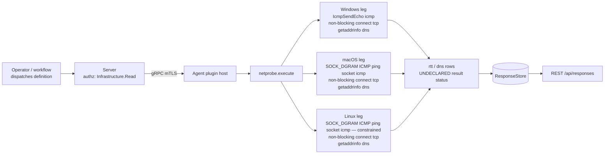

# netprobe

<!-- BEGIN GENERATED: plugin-doc-gen header -->
| | |
|---|---|
| **What it does** | Active network measurement: ICMP/TCP round-trip time, jitter, loss, and DNS resolution timing to operator-chosen targets |
| **Version** | 1.0.0 |
| **Kind** | Collector · read-only · on-demand |
| **Platforms** | Windows ✅ · macOS ✅ · Linux ✅ |
| **Actions** | `dns` (definition `network.probe.dns`) · `icmp` (definition `network.probe.icmp`) · `tcp` (definition `network.probe.tcp`) |
| **Security** | securable `Infrastructure` · operation Read · risk Low · dispatch ReadOnly · approval gate None |
| **Roles** | execute: endpoint-admin · author: content-author |
<!-- END GENERATED -->

## How it works

All three actions are native in-process socket work — no shell-out, no subprocess (`netprobe_plugin.cpp:1-65`). `icmp` opens one ICMP session for the whole run, resolves each target to its first IPv4 address only (`netprobe_plugin.cpp:340`), and sends `count` echo requests spaced 200 ms apart (`netprobe_plugin.cpp:79`, `:346-348`); on Windows via `IcmpSendEcho`, on macOS/Linux via an unprivileged `SOCK_DGRAM` ICMP ping socket, which Linux additionally gates on `net.ipv4.ping_group_range` (`netprobe_plugin.cpp:6-11`, `matrix.md`). `tcp` resolves each target to any address family (`AF_UNSPEC`, `netprobe_plugin.cpp:381`) and times a non-blocking `connect()` per sample on the chosen port (default 443). `dns` times one `getaddrinfo` call per name and reports the resolved address count and status. Every action validates and caps the `targets` CSV first (max 4 — `netprobe_plugin.cpp:75`, `netprobe_stats.hpp:118-136`) and rejects each invalid entry individually rather than failing the whole call (`netprobe_plugin.cpp:308-313`).

The plugin deliberately does not schedule its own recurrence or keep history — that is the server scheduler's job against the response store (`content/definitions/netprobe.yaml:1-4`); nor does it shell out to the OS `ping` binary the way the sibling `device.network_actions.ping` does (`content/definitions/network_actions.yaml:74-82`).



## OS capability

<!-- BEGIN GENERATED: plugin-doc-gen capability -->
| Action | Windows | macOS | Linux |
|---|---|---|---|
| `dns` | ✅ supported · rung 1 · getaddrinfo | ✅ supported · rung 1 · getaddrinfo | ✅ supported · rung 1 · getaddrinfo |
| `icmp` | ✅ supported · rung 1 · IcmpSendEcho | ✅ supported · rung 1 · SOCK_DGRAM ICMP ping socket | 🟡 constrained · rung 1 · SOCK_DGRAM ICMP ping socket |
| `tcp` | ✅ supported · rung 1 · non-blocking connect() timing | ✅ supported · rung 1 · non-blocking connect() timing | ✅ supported · rung 1 · non-blocking connect() timing |

**Declared limits per leg** (descriptor fallback text, verbatim):

- **`icmp` / Linux** — requires net.ipv4.ping_group_range to admit the process group; reports not-permitted otherwise
<!-- END GENERATED -->

## Privileges and prerequisites

| OS | Runs as | Extra grant needed | Measured | If the read is refused |
|---|---|---|---|---|
| Windows | agent service account (LocalSystem today, `docs/agent-privilege-model.md:70`, #1442) | None — `IcmpSendEcho`, `connect()`, and `getaddrinfo` need no elevation | 2026-09-07 as `SYSTEM` (`docs/samples/windows.txt:1`) | n/a — no netprobe action is privilege-gated on Windows |
| macOS | agent daemon, intended unprivileged `_yuzu` account (`docs/agent-privilege-model.md:12`) | None — the ICMP ping socket, `connect()`, and `getaddrinfo` all work unprivileged | 2026-09-07 at euid 501, `alex` (`docs/samples/macos.txt:1`) | n/a — no netprobe action is privilege-gated on macOS |
| Linux | agent daemon, intended unprivileged `yuzu` account (`docs/agent-privilege-model.md:12`) | `icmp` only: the kernel sysctl `net.ipv4.ping_group_range` must admit the agent's process group, or the ping-socket open fails (`matrix.md`, `netprobe_plugin.cpp:229-230`) | 2026-09-07 at euid 0, root, container (`docs/samples/linux.txt:1`) — privileged, so this gate was not exercised | `icmp` row reports `status: not-permitted`, `sent: 0`, `ok: 0`, `loss_pct: 100.0` — never a fabricated loss figure (`netprobe_plugin.cpp:9-11`, `:332-337`); `tcp`/`dns` are unaffected |

No netprobe-specific row exists in `docs/agent-privilege-model.md` (per `privilege.md`); the identities above are the agent's general per-OS account model, cited at the lines shown.

No external binaries or subprocesses (the whole plugin is native socket calls — `::socket`/`::connect`/`::sendto`/`::recv` at `netprobe_plugin.cpp:126,157,228,256,271`; `IcmpSendEcho`/`IcmpCreateFile` on Windows). Network access: outbound ICMP echo, outbound TCP connect, and DNS resolution to the operator-supplied targets only.

## Data contract

### Inputs

<!-- BEGIN GENERATED: plugin-doc-gen inputs -->
| Definition | Parameter | Type | Required | Default | Constraints | Description |
|---|---|---|---|---|---|---|
| `network.probe.dns` | `targets` | string | yes | - | - | Comma-separated DNS names to resolve (max 4), e.g. "example.com,internal.corp.local". |
| `network.probe.icmp` | `targets` | string | yes | - | - | Comma-separated hostnames or IPv4 literals (max 4), e.g. "10.0.0.1,gateway.corp.example.com". |
| `network.probe.icmp` | `count` | int32 | no | 5 | - | Echo samples per target (1-10, default 5), e.g. 5. |
| `network.probe.icmp` | `timeout_ms` | int32 | no | 1000 | - | Per-sample timeout in milliseconds (100-3000, default 1000), e.g. 1000. |
| `network.probe.tcp` | `targets` | string | yes | - | - | Comma-separated hostnames or IP literals (max 4), e.g. "10.0.0.1,vpn-gw.corp.example.com". The port is a separate parameter — do not embed it in a target. |
| `network.probe.tcp` | `port` | int32 | no | 443 | - | TCP port to connect to (default 443; clamped 1-65535). |
| `network.probe.tcp` | `count` | int32 | no | 5 | - | Connect samples per target (1-10, default 5), e.g. 5. |
| `network.probe.tcp` | `timeout_ms` | int32 | no | 1000 | - | Per-sample timeout in milliseconds (100-3000, default 1000), e.g. 1000. |
<!-- END GENERATED -->

### Outputs

Pipe-delimited rows. `icmp` and `tcp` share one row shape with a literal `rtt` discriminator (the `proto` field, not the row prefix, tells them apart); `dns` uses its own `dns`-prefixed row. An invalid target still emits one row (never dropped silently) with the sanitized target string, zeroed timing fields, and a `status` naming why (`netprobe_plugin.cpp:294-306`).

<!-- BEGIN GENERATED: plugin-doc-gen outputs -->
**`network.probe.dns` — `name|resolve_ms|status|addresses`**

| Field | Type | Values | Available | Example | Description |
|---|---|---|---|---|---|
| `name` | string | - | Windows, Linux, macOS | `localhost` | The DNS name as supplied in targets, or the sanitized value when it failed validation. Values: free text DNS name. |
| `resolve_ms` | string | - | Windows, Linux, macOS | `2.9` | Wall-clock time for the getaddrinfo call, one decimal place. Values: 1-decimal milliseconds. |
| `status` | string | - | Windows, Linux, macOS | `ok` | Outcome of the resolution. Values: ok, invalid-target, error:<getaddrinfo return code>. |
| `addresses` | int32 | - | Windows, Linux, macOS | `2` | Number of addresses getaddrinfo returned; 0 on failure or invalid target. Values: integer, 0 or more. |

**`network.probe.icmp` — `target|proto|sent|ok|min_ms|avg_ms|max_ms|jitter_ms|loss_pct|status`**

| Field | Type | Values | Available | Example | Description |
|---|---|---|---|---|---|
| `target` | string | - | Windows, Linux, macOS | `127.0.0.1` | The probe target as supplied in targets, or the sanitized value when it failed validation. Values: free text (hostname or IPv4 literal). |
| `proto` | string | - | Windows, Linux, macOS | `icmp` | Literal protocol tag for this row; always "icmp". |
| `sent` | int32 | - | Windows, Linux, macOS | `5` | Number of echo samples attempted (the clamped count parameter), or 0 when the target was invalid or no ICMP session could be opened. Values: integer 0-10. |
| `ok` | int32 | - | Windows, Linux, macOS | `5` | Number of echo samples that received a reply within timeout_ms. Values: integer 0-sent. |
| `min_ms` | string | - | Windows, Linux, macOS | `0.1` | Fastest successful sample's round-trip time, one decimal place; 0.0 when no sample succeeded. Values: 1-decimal milliseconds. |
| `avg_ms` | string | - | Windows, Linux, macOS | `0.1` | Mean round-trip time of the successful samples, one decimal place. Values: 1-decimal milliseconds. |
| `max_ms` | string | - | Windows, Linux, macOS | `0.2` | Slowest successful sample's round-trip time, one decimal place; 0.0 when no sample succeeded. Values: 1-decimal milliseconds. |
| `jitter_ms` | string | - | Windows, Linux, macOS | `0.0` | Population standard deviation of the successful samples' RTT in milliseconds; 0.0 with fewer than two successful samples. Values: 1-decimal milliseconds. |
| `loss_pct` | string | - | Windows, Linux, macOS | `0.0` | Percentage of samples that did not receive a reply within timeout, one decimal place; 100.0 when the session could not be opened or the target failed validation. Values: 1-decimal percentage, 0.0-100.0. |
| `status` | string | - | Windows, Linux, macOS | `ok` | Outcome of this target's probe. Values: ok, invalid-target, resolve-failed, error, not-permitted (Linux only, ping socket refused). |

**`network.probe.tcp` — `target|proto|sent|ok|min_ms|avg_ms|max_ms|jitter_ms|loss_pct|status`**

| Field | Type | Values | Available | Example | Description |
|---|---|---|---|---|---|
| `target` | string | - | Windows, Linux, macOS | `127.0.0.1` | The probe target as supplied in targets, or the sanitized value when it failed validation. Values: free text (hostname or IP literal). |
| `proto` | string | - | Windows, Linux, macOS | `tcp:22` | Literal protocol tag including the connect port. Values: tcp:<port>. |
| `sent` | int32 | - | Windows, Linux, macOS | `5` | Number of connect samples attempted (the clamped count parameter), or 0 when the target was invalid or resolution failed. Values: integer 0-10. |
| `ok` | int32 | - | Windows, Linux, macOS | `5` | Number of connect samples that succeeded within timeout_ms. Values: integer 0-sent. |
| `min_ms` | string | - | Windows, Linux, macOS | `0.3` | Fastest successful connect time, one decimal place; 0.0 when no sample succeeded. Values: 1-decimal milliseconds. |
| `avg_ms` | string | - | Windows, Linux, macOS | `0.3` | Mean connect time of the successful samples, one decimal place. Values: 1-decimal milliseconds. |
| `max_ms` | string | - | Windows, Linux, macOS | `0.4` | Slowest successful connect time, one decimal place; 0.0 when no sample succeeded. Values: 1-decimal milliseconds. |
| `jitter_ms` | string | - | Windows, Linux, macOS | `0.0` | Population standard deviation of the successful samples' connect time in milliseconds; 0.0 with fewer than two successful samples. Values: 1-decimal milliseconds. |
| `loss_pct` | string | - | Windows, Linux, macOS | `0.0` | Percentage of samples that did not connect within timeout, one decimal place; 100.0 when resolution failed or the target failed validation. Values: 1-decimal percentage, 0.0-100.0. |
| `status` | string | - | Windows, Linux, macOS | `ok` | Outcome of this target's probe. "ok" means the probe ran to completion, not that every sample connected — check loss_pct too. Values: ok, invalid-target, resolve-failed. |
<!-- END GENERATED -->

### Result status

This plugin does not set a typed result status; the agent records `UNDECLARED` and every sample shows `UNDECLARED / UNKNOWN /` for every action on every OS (see Sample output).

### Where the data goes

- **Instruction result only.** Rows travel over the agent's mTLS gRPC channel as the command response and land in the ResponseStore, queryable at `/api/responses/{id}`.
- **Not consumed by** daily-sync inventory, the TAR warehouse, DEX, or metrics (no reference to `netprobe` or `network.probe.*` anywhere under `server/` outside the plugin catalogue and descriptor summary map, `server/core/src/agent_registry.cpp:830-833`). Recurrence/trending is the server scheduler's job, not this plugin's (`content/definitions/netprobe.yaml:1-4`).
- **Sensitivity.** Rows carry only the operator-supplied `target` (a hostname or IP literal the caller chose, not read from the probing host) plus timing/loss statistics; no field names the probing device, a person, or installed software.
- **Siblings:** `device.network_actions.ping` — a one-shot ICMP reachability check that shells out to the OS `ping` binary and streams its raw text output (`content/definitions/network_actions.yaml:74-82`), unlike netprobe's native, structured, no-shell-out RTT/jitter/loss rows. Both ship in the same #2204 network/security plugin declaration group alongside `netstat`, `discovery`, `wifi`, `wol`, `http_client`, `certificates`, `firewall`, and `quarantine` (`changelog.d/2204-declarations-group-c.added.md`).
- **MCP / REST.** Discover: `discover_plugins` (summary) → `yuzu://plugin-docs` (this page as data) → `discover_instructions` / `get_definition("network.probe.icmp")`. Run: `execute_instruction {definition_id, parameters}`. Read: `/api/responses/{id}`.

## Sample output

<!-- BEGIN GENERATED: plugin-doc-gen samples -->
**Windows** — captured: windows Microsoft Windows NT 10.0.26200.0 x64 · bare-metal · 2026-09-07 · SYSTEM · leg-hash e635d1fd4823

```
== action=icmp targets=127.0.0.1
rtt|127.0.0.1|icmp|5|5|0.0|0.0|0.0|0.0|0.0|ok
[result_status] UNDECLARED / UNKNOWN

== action=tcp targets=127.0.0.1 port=22
rtt|127.0.0.1|tcp:22|5|5|0.3|0.3|0.4|0.0|0.0|ok
[result_status] UNDECLARED / UNKNOWN

== action=dns targets=localhost
dns|localhost|2.8|ok|2
[result_status] UNDECLARED / UNKNOWN
```

**macOS** — captured: macos macOS 26.6.2 arm64 · bare-metal · 2026-09-07 · euid 501 (alex) · leg-hash e635d1fd4823

```
== action=icmp targets=127.0.0.1
rtt|127.0.0.1|icmp|5|5|0.0|0.1|0.1|0.0|0.0|ok
[result_status] UNDECLARED / UNKNOWN

== action=tcp targets=127.0.0.1 port=22
rtt|127.0.0.1|tcp:22|5|5|0.0|0.1|0.1|0.0|0.0|ok
[result_status] UNDECLARED / UNKNOWN

== action=dns targets=localhost
dns|localhost|0.9|ok|2
[result_status] UNDECLARED / UNKNOWN
```

**Linux** — captured: linux Debian GNU/Linux 13 (trixie) aarch64 · container · 2026-09-07 · euid 0 · leg-hash e635d1fd4823

```
== action=icmp targets=127.0.0.1
rtt|127.0.0.1|icmp|5|5|0.0|0.1|0.2|0.0|0.0|ok
[result_status] UNDECLARED / UNKNOWN

== action=tcp targets=127.0.0.1 port=22
rtt|127.0.0.1|tcp:22|5|0|0.0|0.0|0.0|0.0|100.0|ok
[result_status] UNDECLARED / UNKNOWN

== action=dns targets=localhost
dns|localhost|0.4|ok|2
[result_status] UNDECLARED / UNKNOWN
```
<!-- END GENERATED -->

## Caveats and known gaps

1. **`status: ok` means the probe ran to completion, not that every sample connected — read it together with `loss_pct`.** `tcp` (and `icmp`) write `status: ok` unconditionally once a session opened and the target resolved (`netprobe_plugin.cpp:359`, `:394`), regardless of how many samples actually succeeded. The Linux `tcp` capture against `127.0.0.1 port=22` (no sshd in the capture container) shows this directly: `rtt|127.0.0.1|tcp:22|5|0|0.0|0.0|0.0|0.0|100.0|ok` — all 5 connect attempts failed fast (`ok: 0`, `loss_pct: 100.0`), yet `status` still reads `ok`. Windows and macOS, which do have something listening on 22, show `ok: 5`/`loss_pct: 0.0` for the same capture (`rtt|127.0.0.1|tcp:22|5|5|0.3|0.3|0.4|0.0|0.0|ok` and `…|0.0|0.1|0.1|0.0|0.0|ok`). The `targets` grammar itself is comma-separated hostnames/IPv4 literals only — no embedded port (`valid_probe_target`, `netprobe_stats.hpp:83-93`, rejects `:`); the port is the separate `port` parameter (default 443), as all three samples now correctly demonstrate.
2. **The Linux `icmp` leg is honestly gated, never fakes loss.** When the kernel refuses the unprivileged `SOCK_DGRAM` ICMP socket (`net.ipv4.ping_group_range` doesn't admit the process group), the row reports `status: not-permitted` with `sent: 0`/`loss_pct: 100.0` rather than a fabricated 100% loss figure (`netprobe_plugin.cpp:9-11`, `:229-230`, `:332-337`). The Linux sample was captured as root (euid 0) and so did not exercise this path.
3. **`icmp` is IPv4-only; `tcp`/`dns` resolve any family.** `icmp` forces `AF_INET` (`netprobe_plugin.cpp:340`, comment "IPv4 only this slice"); `tcp` resolves `AF_UNSPEC` (`netprobe_plugin.cpp:381`). A target with only an IPv6 address succeeds on `tcp`/`dns` but fails `icmp` with `resolve-failed`. IPv6 for `icmp` is a tracked follow-up (`netprobe_plugin.cpp:11`).
4. **Windows ICMP RTT is whole-millisecond only.** `IcmpSendEcho`'s `RoundTripTime` is a whole-ms value by API design (`netprobe_plugin.cpp:184-186`) — a sub-millisecond LAN hop reads `0.0`; use `tcp` for sub-ms fidelity on Windows.
5. **No action-level deadline, only per-sample.** Each sample is bounded by `timeout_ms` (100-3000 ms) plus a fixed 200 ms inter-sample gap, run strictly sequentially (`netprobe_plugin.cpp:79`, `:346-348`, `:388-390`); worst case is about 2 minutes at maximum targets/samples/timeout (`netprobe_plugin.cpp:16-18`), but nothing bounds the sum beyond that arithmetic.

## Source and tests

<!-- BEGIN GENERATED: plugin-doc-gen source -->
- Plugin: `agents/plugins/netprobe/src/netprobe_plugin.cpp` · `agents/plugins/netprobe/src/netprobe_stats.hpp`
- Definitions: `content/definitions/netprobe.yaml`
- Capability rows: `server/core/src/capability_decls/plugin_action_catalogue_c.hpp`
- Tests: `tests/unit/test_netprobe_stats.cpp`
- Privilege row: `docs/agent-privilege-model.md` (no row yet)
<!-- END GENERATED -->
