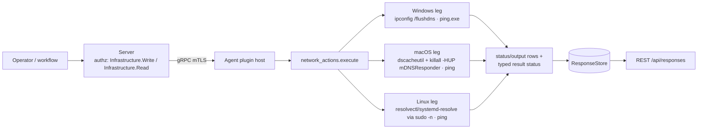

# network_actions

<!-- BEGIN GENERATED: plugin-doc-gen header -->
| | |
|---|---|
| **What it does** | Network actions — DNS flush and ping |
| **Version** | 0.1.0 |
| **Kind** | Action · mutating · gathered (device.network_actions.flush_dns, device.network_actions.ping) |
| **Platforms** | Windows ✅ · macOS ✅ · Linux ✅ |
| **Actions** | `flush_dns` (definition `device.network_actions.flush_dns`) · `ping` (definition `device.network_actions.ping`) |
| **Security** | `flush_dns`: securable `Infrastructure` · operation Write · risk Medium · dispatch Mutating · approval gate AdminOrApproval; `ping`: securable `Infrastructure` · operation Read · risk Low · dispatch ReadOnly · approval gate AdminOrApproval |
| **Roles** | execute: `flush_dns`: endpoint-admin; `ping`: endpoint-admin, endpoint-operator · author: content-author |
<!-- END GENERATED -->

## How it works

`flush_dns` clears the OS DNS resolver cache: Windows runs `ipconfig /flushdns`; Linux tries `resolvectl flush-caches` and falls back to `systemd-resolve --flush-caches` on ANY failure of the first attempt (absent, or found but failing at runtime), both wrapped in `sudo -n`; macOS runs `dscacheutil -flushcache` then `killall -HUP mDNSResponder` under `sudo -n`, because the SIGHUP is the step that actually resets the resolver — a flush without it is incomplete. Every leg reports the real exit code(s) of the command(s) it ran, never a blind `status|ok`. `ping` validates the operator-supplied `host` against a tight charset and validates `count` as digits-only before running the platform's system `ping`/`ping.exe` tool and forwarding its raw output line by line; it deliberately uses the system tool rather than the shared `IcmpSession`, because system ping is typically setuid/cap-blessed and unconstrained by `net.ipv4.ping_group_range`. Both actions run through the bounded argv runner under a fixed 10-second deadline and report a runner failure (spawn error, deadline, cancellation, signal, or line-limit truncation) honestly via `forward_runner_failure`, never as a silent success. Neither action touches persistent agent state — `init()` is a no-op.



## OS capability

<!-- BEGIN GENERATED: plugin-doc-gen capability -->
| Action | Windows | macOS | Linux |
|---|---|---|---|
| `flush_dns` | ✅ supported · rung 2 · ipconfig via bounded argv runner | ✅ supported · rung 2 · dscacheutil + killall via bounded argv runner (sudo -n) | 🟡 constrained · rung 2 · resolvectl/systemd-resolve via bounded argv runner (sudo -n) |
| `ping` | ✅ supported · rung 2 · system ping.exe via bounded argv runner | ✅ supported · rung 2 · system ping via bounded argv runner | ✅ supported · rung 2 · system ping via bounded argv runner |

**Declared limits per leg** (descriptor fallback text, verbatim):

- **`flush_dns` / Linux** — requires resolvectl (systemd-resolved) or the legacy systemd-resolve CLI; an honest failure is reported if neither is present
<!-- END GENERATED -->

## Privileges and prerequisites

| OS | Runs as | Extra grant needed | Measured | If the read is refused |
|---|---|---|---|---|
| Windows | agent service account (LocalSystem today, #1442) | **None.** `ipconfig.exe` and `PING.EXE` are probed at their fixed `System32` paths and run unprivileged; no elevated cmdlet is used. | 2026-09-07, bare-metal Windows 10.0.26200, SYSTEM | a spawn/deadline/signal failure reports `CONSTRAINED`/`UNAVAILABLE` via `forward_runner_failure`; a nonzero exit reports `status\|error` |
| macOS | agent daemon (measured unprivileged) | **`sudo -n` NOPASSWD grants** for `/usr/bin/dscacheutil -flushcache` and `/usr/bin/killall -HUP mDNSResponder`, installed by `install-agent-user.sh`; skipped only when the agent is already root. | 2026-09-07, bare-metal macOS 26.6.2, euid 501 (jsmith) | a missing/refused sudo grant reports `status\|error` plus a `detail\|dscacheutil: ...` / `detail\|mDNSResponder: ...` line carrying the captured command output |
| Linux | agent daemon | **`sudo -n` NOPASSWD grants** for `/usr/bin/systemd-resolve --flush-caches` and `/usr/bin/resolvectl flush-caches`, installed by `install-agent-user.sh`; skipped only when the agent is already root. | 2026-09-06, container Debian GNU/Linux 13 (trixie), euid 0 | neither tool found, or both found and fail: `status\|error`, `output\|neither resolvectl nor systemd-resolve found` |

Subprocesses: `ipconfig.exe` / `PING.EXE` (Windows), `dscacheutil` / `killall` / `ping` (macOS), `resolvectl` / `systemd-resolve` / `ping` (Linux) — all spawned through the shared bounded argv runner (`run_bounded_subprocess`). Network: `ping` / `ping.exe` sends ICMP echo requests to the operator-supplied `host`. No direct socket or file-store access.

## Data contract

### Inputs

<!-- BEGIN GENERATED: plugin-doc-gen inputs -->
| Definition | Parameter | Type | Required | Default | Constraints | Description |
|---|---|---|---|---|---|---|
| `device.network_actions.ping` | `host` | string | yes | - | pattern: ^[a-zA-Z0-9.:\-]+$ · minLength 1 · maxLength 253 | Hostname or IP address to ping. Must contain only alphanumeric characters, dots, hyphens, and colons. Maximum length 253 characters. |
| `device.network_actions.ping` | `count` | string | no | 4 | pattern: ^[0-9]+$ | Number of ICMP echo requests to send. Must be a positive integer. Defaults to 4 if not specified. |
<!-- END GENERATED -->

### Outputs

Each output is one `write_output()` call, one field per line as `<field>|<value>` — not a single multi-field pipe row per record. `flush_dns` emits a `status|ok`/`status|error` line and an `output|<captured text>` line, and on a failed macOS run adds a `detail|dscacheutil: ...` and/or `detail|mDNSResponder: ...` line carrying the raw command output for diagnosis. `ping` emits one `output|<line>` row per line of the system ping tool's stdout; a validation failure (missing/invalid `host`, non-numeric `count`) short-circuits before any subprocess runs and instead emits a single `error|<message>` line that is outside the declared result schema.

<!-- BEGIN GENERATED: plugin-doc-gen outputs -->
**`device.network_actions.flush_dns` — `status|output`**

| Field | Type | Values | Available | Example | Description |
|---|---|---|---|---|---|
| `status` | string | - | Windows, Linux, macOS | `ok` | Whether the flush succeeded ("ok") or failed ("error"); reflects the real exit code(s) of the underlying command(s), never a blind success. Values: ok, error. |
| `output` | string | - | Windows, Linux, macOS | `dscacheutil rc={} mDNSResponder rc={}` | Captured stdout+stderr of the underlying flush command(s), merged. On macOS this is a fixed "dscacheutil rc={} mDNSResponder rc={}" summary; on Windows and Linux it is the raw captured command output. Values: free text. |

**`device.network_actions.ping` — `output`**

| Field | Type | Values | Available | Example | Description |
|---|---|---|---|---|---|
| `output` | string | - | Windows, Linux, macOS | `PING 127.0.0.1 (127.0.0.1): 56 data bytes` | One raw line of the system ping tool's stdout, emitted per line of output. Not present when host/count validation fails — that path emits a single "error\|<message>" line instead, outside this schema. Values: free text (raw ping-tool output). |
<!-- END GENERATED -->

### Result status

| Status | Completeness | Provenance | When |
|---|---|---|---|
| `OK` | — | — | subprocess exited normally (success or nonzero exit) — `execute()` owns exit-code semantics and never calls `set_result_status`; both `ping` samples show this as the agent's default `UNDECLARED / UNKNOWN` |
| `UNAVAILABLE` | PARTIAL | `subprocess_runner:spawn_error` | the tool binary was not found or the runner failed to spawn it — the Linux `ping` sample hit this: `UNAVAILABLE / PARTIAL / subprocess_runner:spawn_error`, `[rc] 1` |
| `CONSTRAINED` | PARTIAL | `subprocess_runner:deadline` / `subprocess_runner:cancelled` / `subprocess_runner:signaled` | the 10-second per-call deadline elapsed, the runner was cancelled, or the child was signaled |
| `OK` | PARTIAL | `subprocess_runner:line_limit` | the runner SIGKILLed a still-producing child once its output line cap was reached |

On a normal subprocess exit, `classify_runner_failure` returns `nullopt` and `execute()` never calls `set_result_status` at all — the agent then records the default `UNDECLARED`/`UNKNOWN`, exactly what both `ping` samples show.

### Where the data goes

- **Instruction result only.** Rows travel over the agent's mTLS gRPC channel as the command response and land in the ResponseStore, queryable at `/api/responses/{id}`. The dashboard renders `network_actions` as a generic key-value table (Agent/Key/Value), and a legacy static action-description registry names both actions for that rendering.
- **Not consumed by** daily-sync inventory, the TAR warehouse, DEX, or metrics. Nothing runs on a schedule; the plugin executes only when an operator or workflow dispatches one of its two definitions.
- **Sensitivity.** `ping`'s `output` rows echo the operator-supplied `host` back verbatim in the tool's own text (an IP or hostname the operator chose, not one discovered from the device); `flush_dns`'s `output`/`detail` rows carry only command exit codes and generic tool diagnostics. Neither action's rows name a person, an account, or installed software.
- **Siblings:** `network.probe.icmp` (netprobe's read-only ICMP probe, an alternative mechanism to `ping`), `device.wol.check` (also performs ICMP as part of wake verification), `device.network_config.dns_cache` (the macOS DNS-honesty sibling that reports the resolver cache contents `flush_dns` clears).
- **MCP / REST.** Discover: `discover_plugins` (summary) → `yuzu://plugin-docs` (this page as data) → `discover_instructions` / `get_definition("device.network_actions.ping")`. Run: `execute_instruction {definition_id, parameters}`. Read: `/api/responses/{id}`.

## Sample output

<!-- BEGIN GENERATED: plugin-doc-gen samples -->
**Windows** — captured: windows Microsoft Windows NT 10.0.26200.0 x64 · bare-metal · 2026-09-07 · SYSTEM · leg-hash a44c8631e3c1

```
== action=flush_dns
[not captured] Mutating/Reversible: not executed on a live host

== action=ping host=127.0.0.1
output|Pinging 127.0.0.1 with 32 bytes of data:
output|Reply from 127.0.0.1: bytes=32 time<1ms TTL=128
output|Reply from 127.0.0.1: bytes=32 time<1ms TTL=128
output|Reply from 127.0.0.1: bytes=32 time<1ms TTL=128
output|Reply from 127.0.0.1: bytes=32 time<1ms TTL=128
output|Ping statistics for 127.0.0.1:
output|    Packets: Sent = 4, Received = 4, Lost = 0 (0% loss),
output|Approximate round trip times in milli-seconds:
output|    Minimum = 0ms, Maximum = 0ms, Average = 0ms
[result_status] UNDECLARED / UNKNOWN
```

**macOS** — captured: macos macOS 26.6.2 arm64 · bare-metal · 2026-09-07 · euid 501 (jsmith) · leg-hash a44c8631e3c1

```
== action=flush_dns
[not captured] Mutating/Reversible: not executed on a live host

== action=ping host=127.0.0.1
output|PING 127.0.0.1 (127.0.0.1): 56 data bytes
output|64 bytes from 127.0.0.1: icmp_seq=0 ttl=64 time=0.063 ms
output|64 bytes from 127.0.0.1: icmp_seq=1 ttl=64 time=0.146 ms
output|64 bytes from 127.0.0.1: icmp_seq=2 ttl=64 time=0.126 ms
output|64 bytes from 127.0.0.1: icmp_seq=3 ttl=64 time=0.137 ms
output|--- 127.0.0.1 ping statistics ---
output|4 packets transmitted, 4 packets received, 0.0% packet loss
output|round-trip min/avg/max/stddev = 0.063/0.118/0.146/0.033 ms
[result_status] UNDECLARED / UNKNOWN
```

**Linux** — captured: linux Debian GNU/Linux 13 (trixie) aarch64 · container · 2026-09-06 · euid 0 · leg-hash a44c8631e3c1

```
== action=flush_dns
[not captured] Mutating/Reversible: not executed on a live host

== action=ping host=127.0.0.1
[result_status] UNAVAILABLE / PARTIAL / subprocess_runner:spawn_error
[rc] 1
```
<!-- END GENERATED -->

## Caveats and known gaps

1. **`flush_dns` was never exercised live for these captures.** It is a `Mutating`/`Reversible` action, so the capture driver deliberately did not run it on any of the three hosts; every sample shows `[not captured] Mutating/Reversible: not executed on a live host` in its place.
2. **The Linux `ping` sample failed to spawn.** The capture container hit `subprocess_runner:spawn_error` (`[rc] 1`) rather than producing a working ping leg — this reflects the capture environment (no reachable `ping` binary or a blocked spawn), not a declared code defect; Linux `ping` is declared `supported` in the descriptor.
3. **The privilege-model doc names a different Windows mechanism than the code runs.** `docs/agent-privilege-model.md`'s `network_actions.flush_dns` row says Windows "uses `Clear-DnsClientCache` cmdlet"; the current implementation runs `ipconfig /flushdns` via the bounded argv runner. The code is authoritative; the doc row is stale.
4. **`ping` deliberately uses the system ping tool, not the shared `IcmpSession`.** System ping is typically setuid/cap-blessed and unconstrained by `net.ipv4.ping_group_range`; this is a confirmed design decision, not something to "fix" toward the shared mechanism.
5. **Linux `flush_dns`'s retry is on ANY failure, not just absence.** A `resolvectl` that is present but fails at runtime (service masked, dbus unreachable) still falls through to `systemd-resolve`, restoring the old `|| true` shell chain's retry semantics; this is pinned by `test_network_actions_parsers.cpp` and should not be narrowed back to a presence-only probe.

## Source and tests

<!-- BEGIN GENERATED: plugin-doc-gen source -->
- Plugin: `agents/plugins/network_actions/src/network_actions_parsers.hpp` · `agents/plugins/network_actions/src/network_actions_plugin.cpp`
- Definitions: `content/definitions/network_actions.yaml`
- Capability rows: `server/core/src/capability_decls/plugin_action_catalogue_c.hpp`
- Tests: `tests/unit/test_network_actions_parsers.cpp`
- Privilege row: `docs/agent-privilege-model.md`
<!-- END GENERATED -->
