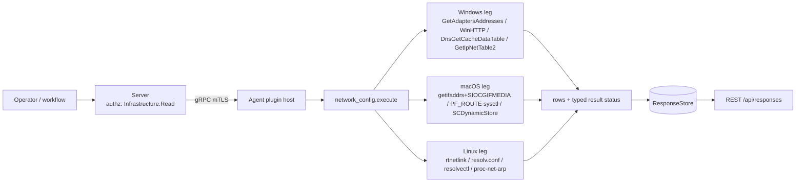

# network_config

<!-- BEGIN GENERATED: plugin-doc-gen header -->
| | |
|---|---|
| **What it does** | Reports network adapter configuration, IP addresses, DNS servers, and proxy settings |
| **Version** | 1.0.0 |
| **Kind** | Collector · read-only · on-demand (no scheduled gather) |
| **Platforms** | Windows ✅ · macOS 🟡 constrained/unsupported mix · Linux 🟡 constrained |
| **Actions** | `adapters` (definition `device.network_config.adapters`) · `ip_addresses` (`device.network_config.ip_addresses`) · `dns_servers` (`device.network_config.dns_servers`) · `proxy` (`device.network_config.proxy`) · `dns_cache` (`device.network_config.dns_cache`) · `arp` (`device.network_config.arp`) |
| **Security** | securable `Infrastructure` · operation Read · risk Low · dispatch ReadOnly · approval gate none |
| **Roles** | execute: endpoint-admin, endpoint-operator · author: content-author |
<!-- END GENERATED -->

## How it works

`adapters` enumerates NICs (name, MAC, link speed, up/down). `ip_addresses` enumerates unicast
addresses per adapter plus the default gateway. `dns_servers` reads the configured resolvers.
`proxy` reads the system HTTP/PAC proxy and bypass list. `dns_cache` dumps the resolver cache —
Windows and Linux only; macOS has no OS-level access to cache contents and returns an honest
`unsupported` sentinel rather than attempting a doomed read. `arp` reads the host ARP/neighbour
table, capped at 20,000 rows on every OS to bound a large or forged table.

Every action is a single read with no state and no scheduled trigger; `gather.ttlSeconds` (30–120s
per action) only caches a result for that long, it does not fire a background collection. The
plugin deliberately does not attempt a live packet capture, does not resolve non-default routes,
and (Linux/macOS) reports only the primary default route, not every routing table.



## OS capability

<!-- BEGIN GENERATED: plugin-doc-gen capability -->
| Action | Windows | macOS | Linux |
|---|---|---|---|
| `adapters` | ✅ supported · rung 1 · `GetAdaptersAddresses` | ✅ supported · rung 1 · `getifaddrs + SIOCGIFMEDIA` | ✅ supported · rung 1 · `rtnetlink (RTM_GETLINK)` |
| `ip_addresses` | ✅ supported · rung 1 · `GetAdaptersAddresses` | ✅ supported · rung 1 · `getifaddrs + PF_ROUTE sysctl` | ✅ supported · rung 1 · `rtnetlink (RTM_GETADDR/RTM_GETROUTE)` |
| `dns_servers` | ✅ supported · rung 1 · `GetAdaptersAddresses` | ✅ supported · rung 1 · `SCDynamicStore` | ✅ supported · rung 1 · `/etc/resolv.conf read` |
| `proxy` | ✅ supported · rung 1 · `WinHttpGetIEProxyConfigForCurrentUser` | 🟡 constrained · rung 1 · `SCDynamicStoreCopyProxies` | 🟡 constrained · rung 1 · `environment variables` |
| `dns_cache` | ✅ supported · rung 1 · `DnsGetCacheDataTable (dnsapi.dll)` | ⛔ unsupported · no mechanism | 🟡 constrained · rung 2 · `resolvectl via direct-argv runner` |
| `arp` | ✅ supported · rung 1 · `GetIpNetTable2` | 🟡 constrained · rung 1 · `PF_ROUTE sysctl RTF_LLINFO` | 🟡 constrained · rung 1 · `/proc/net/arp` |

**Declared limits per leg** (the descriptor's fallback text, verbatim):

- **`proxy` / Linux** — reads the *_proxy variables from the agent process's own environment only; a system-wide, desktop-session or package-manager proxy the agent did not inherit is not reported
- **`proxy` / macOS** — reports the HTTP proxy and PAC URL, checking the primary network service first and then each scoped per-interface service; HTTPS/SOCKS/FTP proxies are not reported, so a host configured with only those reads as none
- **`dns_cache` / Linux** — falls back to systemd-resolve statistics, or reports unavailable, when resolvectl is absent
- **`arp` / Linux** — IPv4 ARP entries only; /proc/net/arp carries no IPv6 neighbours (they live in the RTM_GETNEIGH table), and non-Ethernet or incomplete entries are not reported
- **`arp` / macOS** — ip and mac only; the interface name and static/dynamic type are not carried by the RTF_LLINFO dump and are emitted as '-'
<!-- END GENERATED -->

## Privileges and prerequisites

| OS | Runs as | Extra grant needed | Measured | If the read is refused |
|---|---|---|---|---|
| Windows | agent service account (LocalSystem today, #1442) | **None.** Every leg is a native Win32 read API; none requires elevation. | 2026-09-07 on bare metal as `SYSTEM` | no dedicated `PERMISSION_DENIED` path — a failed API call returns `rc=1` with an in-band error row (adapters/ip_addresses/dns_servers) or `GetIpNetTable2 failed (rc=N)` (arp) |
| macOS | agent daemon, root (no `_yuzu` account yet, #1455) | **None.** `getifaddrs`/`ioctl(SIOCGIFMEDIA)`/PF_ROUTE sysctl reads and `SCDynamicStore` reads all work unprivileged. | 2026-09-07 at euid 501 (`alex`) — captured **unprivileged**, below the agent's actual root runtime | `UNAVAILABLE`/`PARTIAL` with a named provenance (e.g. `network_config:getifaddrs_failed`, `network_config:pf_route_arp_sysctl_failed`) |
| Linux | agent's own unprivileged account (`yuzu`) | **None** for adapters/ip_addresses/dns_servers/proxy/arp (native reads only). `dns_cache` shells out to `resolvectl`/`systemd-resolve` via the bounded direct-argv runner (ADR-3002 rung 2) — no elevation required, but the tool must be present. | 2026-09-06 in a container as `euid 0` (root) — more privileged than the agent's real unprivileged runtime | `UNAVAILABLE`/`PARTIAL` with a named provenance (e.g. `network_config:resolv_conf_unreadable`, `network_config:proc_net_arp_unreadable`) |

Binaries/subprocesses: only the Linux `dns_cache` leg spawns a subprocess — `resolvectl cache`, falling
back to `systemd-resolve --statistics`, both via the bounded direct-argv runner (no `/bin/sh`)
(`network_config_plugin.cpp:1775-1823`). No other action on any OS spawns a process. Sockets used:
a raw `AF_NETLINK` socket (Linux adapters/ip_addresses), a throwaway `AF_INET` datagram socket for
`ioctl(SIOCGIFMEDIA)` and a `PF_ROUTE` sysctl (macOS adapters/ip_addresses/arp). No outbound network
traffic on any leg — every read is local to the host.

## Data contract

### Inputs

<!-- BEGIN GENERATED: plugin-doc-gen inputs -->
`adapters` takes no parameters.
`ip_addresses` takes no parameters.
`dns_servers` takes no parameters.
`proxy` takes no parameters.
`dns_cache` takes no parameters.
`arp` takes no parameters.
<!-- END GENERATED -->

### Outputs

Pipe-delimited rows via `write_output()`. `adapters`/`ip_addresses`/`dns_servers`/`arp` each emit one
row per record under a single literal-prefix discriminator. `proxy` and `dns_cache` do **not** — see
their own notes below the field tables. `-` marks a value the leg could not resolve; it never means
zero, and it is not used as a "no rows" sentinel (a leg that finds nothing on `adapters`/
`ip_addresses`/`dns_servers`/`arp` simply emits zero rows, which is itself a legitimate host state
distinguished from failure by the typed result status).

<!-- BEGIN GENERATED: plugin-doc-gen outputs -->
**`adapters` — `adapter|name|mac|speed_mbps|status`**

| Field | Type | Values | Available | Example |
|---|---|---|---|---|
| `name` | string | free text | W, M, L | `en0` |
| `mac` | string | colon-separated hex, or `-` | W, M, L | `d0:11:e5:c0:a0:99` |
| `speed_mbps` | int64 | integer Mbps, `0` unknown/inactive (L, M); Windows emits an unclamped sentinel instead of `0` — see Caveats | W, M, L | `1000` |
| `status` | string | `up` `down` (W: OperStatus; M: IFF_UP — administrative, not operational); `up` `down` `unknown` (L: IFLA_OPERSTATE) | W, M, L | `up` |

**`ip_addresses` — `ip|adapter|address|prefix_length|gateway`**

| Field | Type | Values | Available | Example |
|---|---|---|---|---|
| `adapter` | string | free text | W, M, L | `en0` |
| `address` | string | IPv4 or IPv6 literal | W, M, L | `192.168.0.131` |
| `prefix_length` | int | 0–32 (IPv4) or 0–128 (IPv6) | W, M, L | `24` |
| `gateway` | string | IPv4 literal, or `-`; per-adapter on Windows, one system-wide value repeated on every row on macOS/Linux | W, M, L | `192.168.0.1` |

**`dns_servers` — `dns|adapter|server|type`**

| Field | Type | Values | Available | Example |
|---|---|---|---|---|
| `adapter` | string | adapter name (W); the literal `system` (M, L) | W, M, L | `system` |
| `server` | string | IPv4 or IPv6 literal | W, M, L | `194.168.4.100` |
| `type` | enum | `IPv4` `IPv6` | W, M, L | `IPv4` |

**`arp` — `arp|iface|ip|mac|type`**

| Field | Type | Values | Available | Example |
|---|---|---|---|---|
| `iface` | string | interface name, or `-` (M, always) | W, L; `-` on M | `Ethernet` |
| `ip` | string | IPv4 or IPv6 literal | W, M, L | `192.168.0.61` |
| `mac` | string | colon-separated hex, or `-` (W incomplete entries only) | W, M, L | `1c:53:f9:73:22:6c` |
| `type` | enum | `static` `dynamic` `incomplete` (W); `static` `dynamic` (L); `-` (M, always) | W, L; `-` on M | `dynamic` |
<!-- END GENERATED -->

**`proxy` — not one row per record.** Each configured value is its own row: `proxy_type|<value>`,
`proxy_address|<value>` (omitted when there is no proxy), and `bypass|<value>` (omitted when the
list is empty). Windows/macOS emit at most one `proxy_type`/`proxy_address` pair; Linux can emit
several — see Caveats.

| Field | Type | Values | Available | Example |
|---|---|---|---|---|
| `proxy_type` | string | `none` `http` `pac` `auto_detect` (W); `none` `http` `pac` (M); `none`, or a literal `*_proxy`/`ALL_PROXY` variable name (L) | W, M, L | `auto_detect` |
| `proxy_address` | string | `host:port`, a PAC URL, or the raw env-var value (L) | W, M, L | not observed in the captured samples — omitted whenever `proxy_type` is `none`/`auto_detect` |
| `bypass` | string | comma-separated free text | W, M, L | `*.local,169.254/16` |

**`dns_cache` — no shared row shape across platforms.** Windows: `cache_entry|name|record_type|0|`
(the literal `0` is a hardcoded placeholder, not a real TTL, and the trailing field is always empty
— `network_config_plugin.cpp:1759`). Linux (`resolvectl` path): `cache_entry|<raw resolvectl line>`
— one opaque field, not split into name/type/ttl (`network_config_plugin.cpp:1787`). Linux
(`systemd-resolve` fallback): `dns_stats|<raw statistics line>` — a different discriminator entirely
(`network_config_plugin.cpp:1819`). Every platform also has sentinel rows: `dns_cache|empty` (W, zero
entries), `dns_cache|not_available|<reason>` (W/L, tool missing or query failed), `dns_cache|unsupported|<reason>`
(M, always). The three schema-mapped fields below apply to the Windows structured row only.

| Field | Type | Values | Available | Example |
|---|---|---|---|---|
| `name` | string | free text (FQDN or reverse-lookup name) | W only | `windowsupdate.microsoft.com` |
| `record_type` | enum | `A` `AAAA` `CNAME` `PTR` `MX` `SRV` `unknown` | W only | `PTR` |
| `ttl` | int | literal `0` | W only | `0` |

### Result status

| Status | Completeness | Provenance | When |
|---|---|---|---|
| `OK` (derived from `UNDECLARED`) | — | — | clean read on any action/OS not listed below |
| `CONSTRAINED` / `PARTIAL` | partial | `network_config:rtnetlink_link_dump_incomplete` | Linux `adapters`, rtnetlink dump incomplete |
| `UNAVAILABLE` / `PARTIAL` | partial | `network_config:getifaddrs_failed` | macOS `adapters`/`ip_addresses`, `getifaddrs()` failed |
| `CONSTRAINED` / `PARTIAL` | partial | `network_config:rtnetlink_dump_incomplete` / `network_config:default_gateway_unresolved_nexthop` | Linux `ip_addresses`, link/addr/route dump incomplete, or a main-table default route in an unresolvable nexthop form |
| `CONSTRAINED` / `PARTIAL` | partial | `network_config:pf_route_default_dump_incomplete` | macOS `ip_addresses`, PF_ROUTE default-route sysctl truncated or failed |
| `UNAVAILABLE` / `PARTIAL` | partial | `network_config:resolv_conf_unreadable` | Linux `dns_servers`, `/etc/resolv.conf` unreadable |
| `UNAVAILABLE` / `PARTIAL` | partial | `network_config:dynamic_store_unavailable` / `network_config:no_systemconfiguration` | macOS `dns_servers`, SCDynamicStore session failed, or built without the SystemConfiguration framework |
| `UNAVAILABLE` / `PARTIAL` | partial | `network_config:proxy_copy_failed` / `network_config:no_systemconfiguration` | macOS `proxy`, `SCDynamicStoreCopyProxies` failed, or built without SystemConfiguration |
| `UNAVAILABLE` / `PARTIAL` | partial | `network_config:no_resolver_cache_tool` | Linux `dns_cache`, neither `resolvectl` nor `systemd-resolve` available/usable |
| — (forwarded) | — | — | Linux `dns_cache`, a `resolvectl`/`systemd-resolve` subprocess failure is forwarded via `yuzu::agent::forward_runner_failure` (its own CONSTRAINED/UNAVAILABLE classification; not independently verified here — see Caveats) |
| `CONSTRAINED`/`UNAVAILABLE` / `PARTIAL` | partial | `network_config:arp_row_cap_reached`, `network_config:proc_net_arp_unreadable`, `network_config:proc_net_arp_read_error` | Linux `arp`, 20k-row cap hit, or `/proc/net/arp` unreadable/errored |
| `CONSTRAINED`/`UNAVAILABLE` / `PARTIAL` | partial | `network_config:pf_route_arp_sysctl_failed`, `network_config:pf_route_arp_truncated`, `network_config:arp_row_cap_reached` | macOS `arp`, PF_ROUTE ARP sysctl failed/truncated, or 20k-row cap hit |
| `CONSTRAINED` / `PARTIAL` | partial | `network_config:arp_row_cap_reached` | Windows `arp`, 20k-row cap hit |

Windows never sets a typed status on `adapters`/`ip_addresses`/`dns_servers`/`proxy`/`dns_cache` — a
failed API call there returns `rc=1` with an in-band error row instead (see Privileges above); `arp`
is the one Windows action that does (row-cap `CONSTRAINED`). No action on any OS ever sets
`PERMISSION_DENIED` — grep for it in `network_config_plugin.cpp` returns nothing.

### Where the data goes

- **Instruction result.** Rows travel over the agent's mTLS gRPC channel as the command response and
  land in the ResponseStore, queryable at `/api/responses/{id}`.
- **Device page "Get live info".** `ip_addresses`, `arp`, and `dns_cache` back three of the device
  page's live-snapshot cards (`device.live.netconfig` "Adapters & IP", `device.live.arp` "ARP",
  `device.live.dns_cache` "DNS cache" — `server/core/src/device_routes.cpp:84,86,88`), dispatched
  through the shared "Get live info" chokepoint. This dispatch is deliberately **untracked**
  (`execution_id=""`, no ExecutionTracker row, not in the executions drawer) because it auto-fires
  one query per card on every click (`server/core/src/server.cpp:19698-19708`).
- **Daily-sync device_ci source (ADR-0016).** `adapters` is one of the four plugin reads
  (`hardware`/`device_identity`/`os_info`/`network_config`) the `device_ci` daily-sync source
  invokes in-process to build the device's CI (config-item) record — its MAC addresses are deduped,
  sorted, and the first becomes the record's primary MAC (`agents/core/src/sync_source_device_ci.hpp:7-8,76`,
  `agents/core/src/sync_source_device_ci.cpp:197-209`, `agents/core/src/agent.cpp:2076,2095`). MAC
  address is device-identifying data, so this source is GDPR-personal-data/behavioural-PII tier per
  the daily-sync routed concern. A failed `adapters` read aborts the whole CI sync cycle rather than
  syncing a partial record (`sync_source_device_ci.cpp:268-277`).
- **Not consumed by** TAR, DEX, or Prometheus metrics.
- **Siblings:** `tar/status` and `tar`'s own ARP collector (`agents/plugins/tar/src/tar_arp_collector.cpp`)
  perform an independent Windows ARP enumeration for the TAR capture surface — it duplicates similar
  RAII-guard logic for `GetIpNetTable2` but is not a consumer of this plugin's `arp` action
  (`tar_arp_collector.cpp:130-131`). `network_diag` covers listening ports and active connections,
  a distinct surface from this plugin's adapter/address/DNS/ARP inventory.
- **MCP / REST.** Discover: `discover_plugins` (summary) → `yuzu://plugin-docs` (this page as data) →
  `discover_instructions` / `get_definition("device.network_config.arp")`. Run:
  `execute_instruction {definition_id, parameters}`. Read: `/api/responses/{id}`, or the device page's
  "Get live info" snapshot for `ip_addresses`/`arp`/`dns_cache`.

## Sample output

<!-- BEGIN GENERATED: plugin-doc-gen samples -->
**Windows** — captured: windows Microsoft Windows NT 10.0.26200.0 x64 · bare-metal · 2026-09-07 · SYSTEM · leg-hash pending

```
== action=adapters
adapter|Ethernet 2|FC:34:97:65:1E:0B|18446744073709|down
adapter|Tailscale|-|100000|up
adapter|Ethernet|FC:34:97:65:1E:0A|1000|up
adapter|OpenVPN Data Channel Offload for NordVPN|-|1000|down
adapter|Local Area Connection|00:FF:C1:08:92:E3|1000|down
adapter|WiFi|84:1B:77:2B:DC:FC|18446744073709|down
adapter|Local Area Connection* 1|84:1B:77:2B:DC:FD|18446744073709|down
adapter|Local Area Connection* 2|86:1B:77:2B:DC:FC|18446744073709|down
adapter|Bluetooth Network Connection|84:1B:77:2B:DD:00|3|down
[result_status] UNDECLARED / UNKNOWN /

== action=ip_addresses
ip|Ethernet 2|fe80::24d2:a5ae:f55b:9132|64|-
ip|Ethernet 2|169.254.54.245|16|-
ip|Tailscale|fd7a:115c:a1e0::1c32:357a|128|-
ip|Tailscale|fe80::c5b0:bd45:79bc:bd97|64|-
ip|Tailscale|100.123.53.121|32|-
ip|Ethernet|fe80::d459:2883:492c:f3fc|64|192.168.0.1
ip|Ethernet|192.168.0.131|24|192.168.0.1
ip|OpenVPN Data Channel Offload for NordVPN|fe80::c5b0:bd45:79bc:bd97|64|-
ip|OpenVPN Data Channel Offload for NordVPN|169.254.133.126|16|-
ip|Local Area Connection|fe80::669f:e4fb:4130:c7de|64|-
ip|Local Area Connection|169.254.70.46|16|-
ip|WiFi|fe80::72f7:7266:9da0:e23c|64|-
ip|WiFi|169.254.225.27|16|-
ip|Local Area Connection* 1|fe80::a60d:9224:f8d0:abf7|64|-
ip|Local Area Connection* 1|169.254.64.8|16|-
ip|Local Area Connection* 2|fe80::81cf:c175:d2f7:359e|64|-
ip|Local Area Connection* 2|169.254.218.5|16|-
ip|Bluetooth Network Connection|fe80::4551:9b1a:5ad9:83a|64|-
ip|Bluetooth Network Connection|169.254.75.142|16|-
[result_status] UNDECLARED / UNKNOWN /

== action=dns_servers
dns|Ethernet 2|194.168.4.100|IPv4
dns|Ethernet 2|194.168.8.100|IPv4
dns|Tailscale|fec0:0:0:ffff::1|IPv6
dns|Tailscale|fec0:0:0:ffff::2|IPv6
dns|Tailscale|fec0:0:0:ffff::3|IPv6
dns|Ethernet|194.168.4.100|IPv4
dns|Ethernet|194.168.8.100|IPv4
dns|OpenVPN Data Channel Offload for NordVPN|fec0:0:0:ffff::1|IPv6
dns|OpenVPN Data Channel Offload for NordVPN|fec0:0:0:ffff::2|IPv6
dns|OpenVPN Data Channel Offload for NordVPN|fec0:0:0:ffff::3|IPv6
dns|Local Area Connection|fec0:0:0:ffff::1|IPv6
dns|Local Area Connection|fec0:0:0:ffff::2|IPv6
dns|Local Area Connection|fec0:0:0:ffff::3|IPv6
dns|WiFi|194.168.4.100|IPv4
dns|WiFi|194.168.8.100|IPv4
dns|Local Area Connection* 1|fec0:0:0:ffff::1|IPv6
dns|Local Area Connection* 1|fec0:0:0:ffff::2|IPv6
dns|Local Area Connection* 1|fec0:0:0:ffff::3|IPv6
dns|Local Area Connection* 2|fec0:0:0:ffff::1|IPv6
dns|Local Area Connection* 2|fec0:0:0:ffff::2|IPv6
dns|Local Area Connection* 2|fec0:0:0:ffff::3|IPv6
dns|Bluetooth Network Connection|fec0:0:0:ffff::1|IPv6
dns|Bluetooth Network Connection|fec0:0:0:ffff::2|IPv6
dns|Bluetooth Network Connection|fec0:0:0:ffff::3|IPv6
[result_status] UNDECLARED / UNKNOWN /

== action=proxy
proxy_type|auto_detect
[result_status] UNDECLARED / UNKNOWN /

== action=dns_cache
cache_entry|66.24.104.213.in-addr.arpa|PTR|0|
cache_entry|array514.prod.do.dsp.mp.microsoft.com|A|0|
cache_entry|37.43.127.100.in-addr.arpa|PTR|0|
cache_entry|121.53.123.100.in-addr.arpa|PTR|0|
cache_entry|desktop-04dnsig.mshome.net|A|0|
cache_entry|desktop-04dnsig.mshome.net|AAAA|0|
cache_entry|77.177.109.100.in-addr.arpa|PTR|0|
cache_entry|kubernetes.docker.internal|A|0|
cache_entry|kubernetes.docker.internal|AAAA|0|
cache_entry|ocsp.comodoca.com|A|0|
cache_entry|the-rig.tail128eb2.ts.net|A|0|
cache_entry|the-rig.tail128eb2.ts.net|AAAA|0|
cache_entry|65.14.106.213.in-addr.arpa|PTR|0|
cache_entry|48.14.106.213.in-addr.arpa|PTR|0|
cache_entry|iphone|CNAME|0|
cache_entry|the-rig|CNAME|0|
cache_entry|windowsupdate.microsoft.com|A|0|
cache_entry|254.92.58.176.in-addr.arpa|PTR|0|
cache_entry|200.188.252.62.in-addr.arpa|PTR|0|
cache_entry|www.example.com|A|0|
cache_entry|9.168.252.62.in-addr.arpa|PTR|0|
cache_entry|100.136.165.199.in-addr.arpa|PTR|0|
cache_entry|100.136.165.199.in-addr.arpa|PTR|0|
cache_entry|ocsp.sectigo.com|A|0|
… 25 of 52 rows
[result_status] UNDECLARED / UNKNOWN /

== action=arp
arp|Loopback Pseudo-Interface 1|224.0.0.22|-|static
arp|Loopback Pseudo-Interface 1|239.255.255.250|-|static
arp|OpenVPN Data Channel Offload for NordVPN|224.0.0.22|-|static
arp|WiFi|224.0.0.22|01:00:5e:00:00:16|static
arp|Local Area Connection|224.0.0.22|01:00:5e:00:00:16|static
arp|Tailscale|100.75.167.98|-|incomplete
arp|Tailscale|100.100.100.100|-|incomplete
arp|Tailscale|100.109.177.77|-|dynamic
arp|Tailscale|224.0.0.22|-|static
arp|Tailscale|224.0.0.251|-|static
arp|Tailscale|239.255.255.250|-|static
arp|Local Area Connection* 1|224.0.0.22|01:00:5e:00:00:16|static
arp|Local Area Connection* 2|224.0.0.22|01:00:5e:00:00:16|static
arp|Bluetooth Network Connection|224.0.0.22|01:00:5e:00:00:16|static
arp|Ethernet|192.168.0.1|b0:5b:99:ee:d0:32|dynamic
arp|Ethernet|192.168.0.61|1c:53:f9:73:22:6c|dynamic
arp|Ethernet|192.168.0.66|d0:11:e5:c0:a0:99|dynamic
arp|Ethernet|192.168.0.71|00:17:88:a6:b2:13|dynamic
arp|Ethernet|192.168.0.222|de:75:77:1a:d2:d9|incomplete
arp|Ethernet|192.168.0.223|94:e2:3c:98:aa:08|dynamic
arp|Ethernet|192.168.0.237|64:d8:1b:f5:f7:58|dynamic
arp|Ethernet|192.168.0.246|d8:8c:79:47:1d:43|dynamic
arp|Ethernet|192.168.0.255|ff:ff:ff:ff:ff:ff|static
arp|Ethernet|224.0.0.22|01:00:5e:00:00:16|static
arp|Ethernet|224.0.0.251|01:00:5e:00:00:fb|static
… 25 of 67 rows
[result_status] UNDECLARED / UNKNOWN /
```

**macOS** — captured: macos macOS 26.6.2 arm64 · bare-metal · 2026-09-07 · euid 501 (alex) · leg-hash pending

```
== action=adapters
adapter|lo0|-|0|up
adapter|gif0|-|0|down
adapter|stf0|-|0|down
adapter|anpi0|ca:36:a7:b0:f6:23|0|up
adapter|anpi1|ca:36:a7:b0:f6:24|0|up
adapter|anpi3|ca:36:a7:b0:f6:26|0|up
adapter|en0|d0:11:e5:c0:a0:99|1000|up
adapter|en5|ca:36:a7:b0:f6:03|0|up
adapter|en6|ca:36:a7:b0:f6:04|0|up
adapter|en7|ca:36:a7:b0:f6:06|0|up
adapter|en2|36:d8:fb:d2:52:c0|0|up
adapter|en3|36:d8:fb:d2:52:c4|0|up
adapter|en4|36:d8:fb:d2:52:cc|0|up
adapter|bridge0|36:d8:fb:d2:52:c0|0|up
adapter|ap1|3a:e1:c4:86:68:d4|0|up
adapter|en1|f2:1d:69:00:6f:ee|0|up
adapter|awdl0|5a:a0:84:32:a9:a3|0|down
adapter|llw0|5a:a0:84:32:a9:a3|0|up
adapter|utun0|-|0|up
adapter|utun1|-|0|up
adapter|utun2|-|0|up
adapter|utun3|-|0|up
adapter|utun4|-|0|up
adapter|utun5|-|0|up
adapter|utun6|-|0|up
[result_status] UNDECLARED / UNKNOWN /

== action=ip_addresses
ip|en0|fe80::9e:c46b:750c:b2eb|64|192.168.0.1
ip|en0|192.168.0.66|24|192.168.0.1
ip|llw0|fe80::58a0:84ff:fe32:a9a3|64|192.168.0.1
ip|utun0|fe80::93eb:5451:9abf:3695|64|192.168.0.1
ip|utun1|fe80::313e:505c:4e40:16c8|64|192.168.0.1
ip|utun2|fe80::fa0e:b15e:9046:683d|64|192.168.0.1
ip|utun3|fe80::ce81:b1c:bd2c:69e|64|192.168.0.1
ip|utun4|fe80::d211:e5ff:fec0:a099|64|192.168.0.1
ip|utun4|100.109.177.77|32|192.168.0.1
ip|utun4|fd7a:115c:a1e0::e032:b14f|48|192.168.0.1
ip|utun5|fe80::b145:6483:7c96:77fa|64|192.168.0.1
ip|utun6|fe80::68ce:f640:7c7a:bb05|64|192.168.0.1
[result_status] UNDECLARED / UNKNOWN /

== action=dns_servers
dns|system|100.100.100.100|IPv4
dns|system|fd7a:115c:a1e0::53|IPv6
dns|system|194.168.4.100|IPv4
dns|system|194.168.8.100|IPv4
[result_status] UNDECLARED / UNKNOWN /

== action=proxy
bypass|*.local,169.254/16
proxy_type|none
[result_status] UNDECLARED / UNKNOWN /

== action=dns_cache
dns_cache|unsupported|macOS does not expose DNS resolver cache contents
[result_status] UNDECLARED / UNKNOWN /

== action=arp
arp|-|192.168.0.1|b0:5b:99:ee:d0:32|-
arp|-|192.168.0.61|1c:53:f9:73:22:6c|-
arp|-|192.168.0.71|00:17:88:a6:b2:13|-
arp|-|192.168.0.131|fc:34:97:65:1e:0a|-
arp|-|192.168.0.138|c2:4e:eb:d7:1f:62|-
arp|-|192.168.0.140|ce:e1:48:d3:04:97|-
arp|-|192.168.0.179|b6:08:a0:6a:2d:de|-
arp|-|192.168.0.197|8e:6e:21:3a:d8:1f|-
arp|-|192.168.0.210|5c:3e:1b:ef:97:02|-
arp|-|192.168.0.222|de:75:77:1a:d2:d9|-
arp|-|192.168.0.238|34:cd:b0:ad:8a:b4|-
arp|-|192.168.0.246|d8:8c:79:47:1d:43|-
arp|-|192.168.0.255|ff:ff:ff:ff:ff:ff|-
arp|-|224.0.0.251|01:00:5e:00:00:fb|-
arp|-|239.255.255.250|01:00:5e:7f:ff:fa|-
[result_status] UNDECLARED / UNKNOWN /
```

**Linux** — captured: linux Debian GNU/Linux 13 (trixie) aarch64 · container · 2026-09-06 · euid 0 · leg-hash pending

```
== action=adapters
adapter|tunl0|-|0|down
adapter|gre0|-|0|down
adapter|gretap0|00:00:00:00:00:00|0|down
adapter|erspan0|00:00:00:00:00:00|0|down
adapter|ip_vti0|-|0|down
adapter|ip6_vti0|-|0|down
adapter|sit0|-|0|down
adapter|ip6tnl0|-|0|down
adapter|ip6gre0|-|0|down
adapter|eth0|8e:8c:e7:4b:5d:b5|10000|up
[result_status] UNDECLARED / UNKNOWN /

== action=ip_addresses
ip|eth0|172.17.0.4|16|172.17.0.1
[result_status] UNDECLARED / UNKNOWN /

== action=dns_servers
dns|system|192.168.65.7|IPv4
[result_status] UNDECLARED / UNKNOWN /

== action=proxy
proxy_type|none
[result_status] UNDECLARED / UNKNOWN /

== action=dns_cache
dns_cache|not_available|no systemd-resolved
[result_status] UNAVAILABLE / PARTIAL / network_config:no_resolver_cache_tool

== action=arp
[result_status] UNDECLARED / UNKNOWN /
```
<!-- END GENERATED -->

The Linux `arp` block shows zero rows with no `[not captured]`/`[rc]` marker — a genuinely empty
`/proc/net/arp` table on this container host, not a capture failure (the unit tests deliberately do
not assert row count for the same reason: `tests/unit/test_network_config_local_dispatcher.cpp:14-18`).

## Caveats and known gaps

1. **Windows `speed_mbps` is not clamped for an unknown-speed adapter.** `TransmitLinkSpeed` is
   divided by 1,000,000 with no sentinel check (`network_config_plugin.cpp:761`); when the API
   reports its "unknown speed" sentinel (`ULONG64_MAX`), the row emits `18446744073709` instead of
   `0` — visible on four of nine adapters in the real Windows capture above (`Ethernet 2`, `WiFi`,
   `Local Area Connection* 1`, `Local Area Connection* 2`). Any consumer treating `speed_mbps` as a
   real Mbps figure must guard against this value.
2. **`dns_cache` has no shared row shape across platforms.** Windows emits a structured
   `name|type|0|` row (`network_config_plugin.cpp:1759`); Linux's `resolvectl` path emits one raw,
   unparsed line under the same `cache_entry|` prefix (`network_config_plugin.cpp:1787`); Linux's
   `systemd-resolve` fallback uses a different discriminator, `dns_stats|` (`network_config_plugin.cpp:1819`);
   macOS never populates the three schema columns at all. A consumer that parses `cache_entry|` as
   `name|record_type|ttl` on every platform will misparse Linux's output.
3. **Linux `proxy_type` is the raw environment-variable name, not a normalized type.** Windows and
   macOS emit `none`/`http`/`pac`/`auto_detect`; Linux instead emits the literal variable it read
   (`http_proxy`, `HTTPS_PROXY`, …) and can emit several `proxy_type`/`proxy_address` pairs in one
   response if more than one is set (`network_config_plugin.cpp:1210-1229`), unlike Windows/macOS
   which always resolve to at most one via `select_proxy()`.
4. **`ip_addresses.gateway` is per-adapter on Windows, host-wide on macOS/Linux.** Windows reads
   each adapter's own `FirstGatewayAddress` (`network_config_plugin.cpp:893-901`); macOS and Linux
   each resolve a single system-wide default gateway once and repeat it on every row
   (`network_config_plugin.cpp:920-931`, `967-976`). A multi-homed Windows host can show different
   gateways per adapter; macOS/Linux never do.
5. **The `adapters` loopback asymmetry is deliberate — do not "align" it.** Linux filters `lo`
   (matching the pre-migration `ip -o link show` parse); macOS reports `lo0` as a real adapter
   (matching the pre-migration `ifconfig -a` parse). The predates-this-migration asymmetry is
   called out explicitly in-code and verified against both legacy legs
   (`network_config_plugin.cpp:812-818`) — changing either side silently alters what the fleet
   reports.

## Source and tests

<!-- BEGIN GENERATED: plugin-doc-gen source -->
- Plugin: `agents/plugins/network_config/src/network_config_plugin.cpp` (descriptor legs, all six actions) · `network_config_parsers.hpp` (pure decoders — /proc/net/arp, resolvectl/systemd-resolve line filters, rtnetlink + PF_ROUTE binary decoders, proxy/DNS union+select helpers)
- Definitions: `content/definitions/network_config.yaml`
- Capability rows: `server/core/src/capability_decls/plugin_action_catalogue_c.hpp`
- Tests: `tests/unit/test_network_config_local_dispatcher.cpp` (2 cases, loads the real `.dylib`/`.so` on macOS/Linux) · `tests/unit/test_network_config_parsers.cpp` (47 cases, pure parser fixtures)
- Privilege row: `docs/agent-privilege-model.md` (`network_config.*` — default/default/default, no extra grant on any OS)
- Changelog: `changelog.d/2204-declarations-group-c.added.md` · `changelog.d/2211-macos-dns-honesty.added.md` · `changelog.d/2277-macos-plugin-parity.added.md`
<!-- END GENERATED -->
