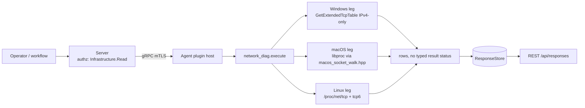

# network_diag

<!-- BEGIN GENERATED: plugin-doc-gen header -->
| | |
|---|---|
| **What it does** | Network diagnostics — listening ports and established connections |
| **Version** | 0.1.0 |
| **Kind** | Collector · read-only · on-demand (no scheduled gather) |
| **Platforms** | Windows ✅ · macOS ✅ · Linux ✅ |
| **Actions** | `listening` (definition `device.network_diag.listening`) · `connections` (definition `device.network_diag.connections`) |
| **Security** | securable `Infrastructure` · operation Read · risk Low · dispatch ReadOnly · approval gate none |
| **Roles** | execute: endpoint-admin, endpoint-operator · author: content-author |
<!-- END GENERATED -->

## How it works

Both actions read the local TCP table and emit one pipe-delimited row per socket; neither takes parameters. `listening` walks the table filtered to the listen state; `connections` walks it filtered to established. Windows reads `GetExtendedTcpTable` twice (once per action, IPv4 only); Linux reads `/proc/net/tcp` and `/proc/net/tcp6` for each action, matching on the state hex code; macOS shares `agents/shared/macos_socket_walk.hpp`'s libproc walk with `netstat` and `ioc`, filtering the returned rows by protocol and state client-side. No leg calls a subprocess.

A leg that finds nothing emits zero rows — there is no placeholder row convention here, unlike `disk_actions`. The plugin deliberately does not resolve owning-process identity beyond a bare PID (or, on Linux, a socket inode — see Caveats): naming and path resolution is `netstat`'s `attribution` action, not this plugin's job.



## OS capability

<!-- BEGIN GENERATED: plugin-doc-gen capability -->
| Action | Windows | macOS | Linux |
|---|---|---|---|
| `listening` | ✅ supported · rung 1 · `GetExtendedTcpTable` | ✅ supported · rung 1 · libproc | ✅ supported · rung 1 · `/proc/net/tcp[6]` |
| `connections` | ✅ supported · rung 1 · `GetExtendedTcpTable` | ✅ supported · rung 1 · libproc | ✅ supported · rung 1 · `/proc/net/tcp[6]` |

**Declared limits per leg** (the descriptor's fallback text, verbatim):

- **`listening` / macOS** — a socket shared by more than one process (SO_REUSEPORT, prefork) surfaces under one arbitrarily-chosen owning PID, not one row per owner.
- **`connections` / macOS** — a socket shared by more than one process (SO_REUSEPORT, prefork) surfaces under one arbitrarily-chosen owning PID, not one row per owner.
<!-- END GENERATED -->

## Privileges and prerequisites

| OS | Runs as | Extra grant needed | Measured | If the read is refused |
|---|---|---|---|---|
| Windows | agent service account (LocalSystem today, #1442) | None — `GetExtendedTcpTable` needs no elevated handle | 2026-09-07, bare metal, as SYSTEM | returns silently: zero rows, no error signalled (`network_diag_plugin.cpp:56,61-62,79,84-85`) |
| macOS | agent daemon — runs as root today, no unprivileged `_yuzu` account yet (`docs/agent-privilege-model.md`, #1455) | None — the libproc fd walk needs no entitlement | 2026-09-07, bare metal, at euid 501 (unprivileged — below the daemon's real root identity) | `walk_sockets` returns an empty vector on any per-PID enumeration failure, no error surfaced (`agents/shared/macos_socket_walk.hpp:104-121`) |
| Linux | agent daemon — dedicated unprivileged `yuzu` account (`docs/agent-privilege-model.md`) | None — `/proc/net/tcp[6]` is world-readable | 2026-09-06, container, at euid 0 (root — above the daemon's real unprivileged identity) | `ifstream` open failure returns silently, zero rows (`network_diag_plugin.cpp:121-123`) |

No external binaries or subprocesses on any leg (rung 1 native APIs everywhere, per `changelog.d/20260819-wave3-pr31-syscall-promotion.changed.md`); no outbound network — every read is local kernel/OS state.

## Data contract

### Inputs

<!-- BEGIN GENERATED: plugin-doc-gen inputs -->
`listening` takes no parameters.

`connections` takes no parameters.
<!-- END GENERATED -->

### Outputs

Pipe-delimited rows, one per socket. Field 0 is a literal discriminator (`listen` or `conn`); a leg that finds nothing emits zero rows, never a placeholder.

<!-- BEGIN GENERATED: plugin-doc-gen outputs -->
**`listening` — `listen|proto|local_addr|local_port|pid`**

| Field | Type | Values | Available | Example |
|---|---|---|---|---|
| `proto` | string | always the literal `tcp`, even for an IPv6 socket | W, M, L | `tcp` |
| `local_addr` | string | dotted IPv4, `*` for an unbound wildcard (macOS), raw hex for IPv6 on Linux | W, M, L | `127.0.0.1` · `*` |
| `local_port` | int32 | decimal port number | W, M, L | `5432` |
| `pid` | int32 | real owning PID on Windows/macOS; the socket's `/proc/net/tcp[6]` inode number on Linux, not a PID | W, M, L | `1533` (macOS PID) · `10` (Linux inode) |

**`connections` — `conn|proto|local_addr|local_port|remote_addr|remote_port|pid`**

| Field | Type | Values | Available | Example |
|---|---|---|---|---|
| `proto` | string | always the literal `tcp`, even for an IPv6 socket | W, M, L | `tcp` |
| `local_addr` | string | dotted IPv4; raw hex for IPv6 on Linux | W, M, L | `192.168.0.66` |
| `local_port` | int32 | decimal port number | W, M, L | `52882` |
| `remote_addr` | string | dotted IPv4; raw hex for IPv6 on Linux | W, M, L | `160.79.104.10` |
| `remote_port` | int32 | decimal port number | W, M, L | `443` |
| `pid` | int32 | real owning PID on Windows/macOS; the socket's `/proc/net/tcp[6]` inode number on Linux, not a PID | W, M, L | `9039` (macOS PID) |
<!-- END GENERATED -->

### Result status

This plugin does not set a typed result status; the agent records `UNDECLARED` and the sample shows `UNDECLARED / UNKNOWN /`.

### Where the data goes

- **Instruction result, plus the device-page "Get live info" panel.** `device_routes.cpp` dispatches `network_diag.listening`/`network_diag.connections` for the dashboard's Listening ports and Active connections cards, and dispatches `connections` a second time (joined by PID) to annotate the Process tree card (`device_routes.cpp:74-93`, `live_kinds.hpp:33-35`, `device_routes.hpp:147-148`). These live-info dispatches are deliberately untracked (`execution_id=""`, no executions-drawer row — `server.cpp:19699-19710`).
- **Not consumed by** daily-sync inventory, the TAR warehouse, or DEX. Nothing runs on a schedule.
- **Siblings.** `netstat`'s `netstat_list` action covers the same TCP table plus UDP, every connection state (not just LISTEN/ESTABLISHED), and always emits a real `state` field; its `attribution` action adds the owning process's name and executable path. `network_diag` is the narrower, faster read the dashboard's live-info cards actually dispatch; `netstat` is the fuller diagnostic table. Both share the macOS libproc walk (`agents/shared/macos_socket_walk.hpp`) to avoid a third hand-rolled copy.
- **MCP / REST.** Discover: `discover_plugins` (summary) → `yuzu://plugin-docs` (this page as data) → `discover_instructions` / `get_definition("device.network_diag.listening")`. Run: `execute_instruction {definition_id, parameters}`. Read: `/api/responses/{id}`.

## Sample output

<!-- BEGIN GENERATED: plugin-doc-gen samples -->
**Windows** — captured: windows Microsoft Windows NT 10.0.26200.0 x64 · bare-metal · 2026-09-07 · SYSTEM · leg-hash pending

```
== action=listening
listen|tcp|0.0.0.0|22|5148
listen|tcp|0.0.0.0|135|1008
listen|tcp|192.168.0.131|139|4
listen|tcp|0.0.0.0|3389|9048
listen|tcp|0.0.0.0|5040|14216
listen|tcp|127.0.0.1|5432|6436
listen|tcp|0.0.0.0|8080|13676
listen|tcp|0.0.0.0|8099|13800
listen|tcp|0.0.0.0|49664|1740
listen|tcp|0.0.0.0|49665|1596
listen|tcp|0.0.0.0|49666|2448
listen|tcp|0.0.0.0|49667|3352
listen|tcp|0.0.0.0|49668|4512
listen|tcp|0.0.0.0|49676|10096
listen|tcp|0.0.0.0|49706|1676
listen|tcp|100.123.53.121|54669|12984
listen|tcp|0.0.0.0|445|4
listen|tcp|0.0.0.0|5357|4
listen|tcp|0.0.0.0|5426|4
listen|tcp|0.0.0.0|7680|8948
listen|tcp|0.0.0.0|50051|13676
listen|tcp|0.0.0.0|50052|13676
[result_status] UNDECLARED / UNKNOWN /

== action=connections
conn|tcp|100.123.53.121|22|100.109.177.77|53137|5148
conn|tcp|127.0.0.1|5432|127.0.0.1|49748|6436
conn|tcp|127.0.0.1|5432|127.0.0.1|49749|6436
conn|tcp|127.0.0.1|5432|127.0.0.1|50169|6436
conn|tcp|127.0.0.1|8080|127.0.0.1|49754|13676
conn|tcp|192.168.0.131|49673|34.141.96.57|7500|5036
conn|tcp|192.168.0.131|49708|199.165.136.100|443|5808
conn|tcp|127.0.0.1|49748|127.0.0.1|5432|13676
conn|tcp|127.0.0.1|49749|127.0.0.1|5432|13676
conn|tcp|127.0.0.1|49750|127.0.0.1|49751|13800
conn|tcp|127.0.0.1|49751|127.0.0.1|49750|13800
conn|tcp|127.0.0.1|49754|127.0.0.1|8080|13800
conn|tcp|127.0.0.1|49759|127.0.0.1|50051|13496
conn|tcp|192.168.0.131|49794|172.187.86.73|443|5132
conn|tcp|127.0.0.1|50051|127.0.0.1|49759|13676
conn|tcp|127.0.0.1|50169|127.0.0.1|5432|13676
conn|tcp|192.168.0.131|50525|192.200.0.106|443|12984
conn|tcp|192.168.0.131|50526|176.58.92.254|443|12984
conn|tcp|192.168.0.131|50710|20.42.73.25|443|5672
[result_status] UNDECLARED / UNKNOWN /
```

**macOS** — captured: macos macOS 26.6.2 arm64 · bare-metal · 2026-09-07 · euid 501 (alex) · leg-hash pending

```
== action=listening
listen|tcp|::1|5432|1533
listen|tcp|127.0.0.1|5432|1533
listen|tcp|127.0.0.1|7768|1440
listen|tcp|*|57621|1440
listen|tcp|*|49582|1440
listen|tcp|127.0.0.1|22636|1302
listen|tcp|127.0.0.1|49293|1301
listen|tcp|*|7000|973
listen|tcp|*|7000|973
listen|tcp|*|5000|973
listen|tcp|*|5000|973
listen|tcp|*|3283|898
listen|tcp|*|49429|872
listen|tcp|*|49429|872
[result_status] UNDECLARED / UNKNOWN /

== action=connections
conn|tcp|100.109.177.77|52882|100.123.53.121|22|9653
conn|tcp|192.168.0.66|52771|160.79.104.10|443|9039
conn|tcp|192.168.0.66|52775|160.79.104.10|443|9039
conn|tcp|192.168.0.66|52773|160.79.104.10|443|9039
conn|tcp|192.168.0.66|52789|160.79.104.10|443|9039
conn|tcp|192.168.0.66|52801|34.149.66.165|443|9039
conn|tcp|192.168.0.66|52777|160.79.104.10|443|9039
conn|tcp|192.168.0.66|52779|160.79.104.10|443|9039
conn|tcp|192.168.0.66|52781|160.79.104.10|443|9039
conn|tcp|192.168.0.66|52856|160.79.104.10|443|9039
conn|tcp|192.168.0.66|52783|160.79.104.10|443|9039
conn|tcp|192.168.0.66|52785|160.79.104.10|443|9039
conn|tcp|192.168.0.66|52744|160.79.104.10|443|9001
conn|tcp|192.168.0.66|52748|160.79.104.10|443|9001
conn|tcp|192.168.0.66|52746|160.79.104.10|443|9001
conn|tcp|192.168.0.66|52760|160.79.104.10|443|9001
conn|tcp|192.168.0.66|52791|160.79.104.10|443|9001
conn|tcp|192.168.0.66|52887|160.79.104.10|443|9001
conn|tcp|192.168.0.66|52750|160.79.104.10|443|9001
conn|tcp|192.168.0.66|52890|160.79.104.10|443|9001
conn|tcp|192.168.0.66|52754|160.79.104.10|443|9001
conn|tcp|192.168.0.66|52892|160.79.104.10|443|9001
conn|tcp|192.168.0.66|52756|160.79.104.10|443|9001
conn|tcp|192.168.0.66|52758|160.79.104.10|443|9001
conn|tcp|192.168.0.66|52721|160.79.104.10|443|8979
… 25 of 68 rows
[result_status] UNDECLARED / UNKNOWN /
```

**Linux** — captured: linux Debian GNU/Linux 13 (trixie) aarch64 · container · 2026-09-06 · euid 0 · leg-hash pending

```
== action=listening
[result_status] UNDECLARED / UNKNOWN /

== action=connections
[result_status] UNDECLARED / UNKNOWN /
```
<!-- END GENERATED -->

## Caveats and known gaps

1. **Linux's `pid` field is a socket inode, not a process id.** `parse_proc_tcp` never resolves `/proc/[pid]/fd` back to an owning process (`network_diag_plugin.cpp:143-157`); it writes the raw `/proc/net/tcp[6]` inode number in the field's place. Windows and macOS legs write a real PID (`row.dwOwningPid` at `network_diag_plugin.cpp:72,102`; `s.pid` at `:231,247`). Sibling `netstat` does the inode-to-PID walk on Linux.
2. **The `proto` field never says `tcp6`.** Every leg hardcodes the literal `"tcp"` in `write_output` (`network_diag_plugin.cpp:72,102,152,155,231,247`), even for a row sourced from `/proc/net/tcp6` (Linux) or a `tcp6`-tagged `SocketInfo` (macOS) — only the address format hints at IPv6.
3. **Linux IPv6 addresses are raw hex, not text.** `hex_to_ip` only decodes IPv4; its IPv6 branch returns the undecoded hex string (`network_diag_plugin.cpp:108-117`, comment: "IPv6 — simplified: return hex representation").
4. **Windows never queries IPv6.** `list_listening_win`/`list_connections_win` call `GetExtendedTcpTable` with `AF_INET` only (`network_diag_plugin.cpp:55,60,78,83`); an IPv6-only listener or connection on Windows is invisible to either action, unlike Linux (`/proc/net/tcp6`) or macOS (`tcp6` via libproc).
5. **A read failure and "nothing found" are indistinguishable.** Every leg returns silently on failure — Windows on `size == 0` or a non-`NO_ERROR` return (`:56,61-62,79,84-85`), Linux on `!f.is_open()` (`:121-123`), macOS via `walk_sockets`' empty-vector-on-failure convention (`agents/shared/macos_socket_walk.hpp:104-121`) — and the plugin never calls a result-status setter, so the agent always records `UNDECLARED`/`UNKNOWN`. The Linux sample above (zero rows both actions) cannot be read as proof the container had nothing listening.

## Source and tests

<!-- BEGIN GENERATED: plugin-doc-gen source -->
- Plugin: `agents/plugins/network_diag/src/network_diag_plugin.cpp`
- Definitions: `content/definitions/network_diag.yaml`
- Capability rows: `server/core/src/capability_decls/plugin_action_catalogue_c.hpp`
- Tests: `tests/unit/agent/test_wave3_pr31_macos_actions.cpp` (Darwin-only; drives the built `.dylib` through `LocalDispatcher` for `listening` and `connections`)
- Privilege row: no row in `docs/agent-privilege-model.md`
- Changelog: `changelog.d/20260819-wave3-pr31-syscall-promotion.changed.md` · `changelog.d/2204-declarations-group-c.added.md`
<!-- END GENERATED -->
