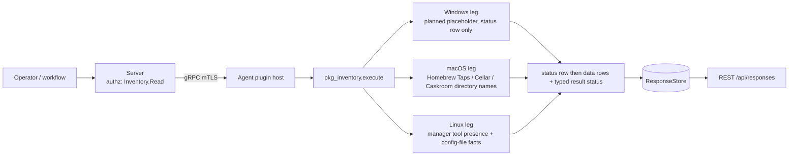

# pkg_inventory

<!-- BEGIN GENERATED: plugin-doc-gen header -->
| | |
|---|---|
| **What it does** | Machine-scope package-manager inventory (managers and packages); per-user package stores are out of scope, deferred to the user-context bridge |
| **Version** | 1.0.0 |
| **Kind** | Collector · read-only · gathered (crossplatform.software.package_managers, crossplatform.software.package_manager_packages) |
| **Platforms** | Windows 🟡 planned · macOS ✅ · Linux ✅ |
| **Actions** | `managers` (definition `crossplatform.software.package_managers`) · `packages` (definition `crossplatform.software.package_manager_packages`) |
| **Security** | securable `Inventory` · operation Read · risk Low · dispatch ReadOnly · approval gate None |
| **Roles** | execute: endpoint-admin, endpoint-operator · author: content-author |
<!-- END GENERATED -->

## How it works

`managers` reports which package managers are present on the host and their manager-level configuration facts; `packages` lists the macOS Homebrew formulae and casks. Both are pure filesystem reads (`open`/`openat`/`readdir` with `O_NOFOLLOW`): no `brew`, `dpkg`, `rpm`, `pacman`, `apk` or `winget` is ever spawned, and `/var/lib/dpkg/status` is never opened. Every action writes a `status` row first, then data rows. On Linux, `managers` checks for the dpkg, apt, rpm, dnf, pacman and apk tools and reads config identity only: the dpkg architecture list, apt and dnf source-file counts, pacman.conf and mirrorlist line counts, apk repository counts. On macOS, both actions probe both Homebrew prefixes (`/opt/homebrew` on Apple silicon, `/usr/local` on Intel) and read directory names under `Library/Taps`, `Cellar` and `Caskroom`. Machine scope only: per-user package stores are out of scope, deferred to the user-context bridge. Linux `packages` is deliberately unsupported (`installed_apps` owns the Linux package roster), and both Windows legs are planned placeholders. Every walk takes an injected root (production passes `/`) so the unit suite drives it over a committed fixture tree.



## OS capability

<!-- BEGIN GENERATED: plugin-doc-gen capability -->
| Action | Windows | macOS | Linux |
|---|---|---|---|
| `managers` | 🟡 planned · rung 1 · ProgramData\\chocolatey lib/ walk + Program Files\\WindowsApps DesktopAppInstaller folder presence for winget; follows as its own PR | ✅ supported · rung 1 · Homebrew prefix layout: Library/Taps, Cellar, Caskroom | ✅ supported · rung 1 · tool presence + /var/lib/dpkg/arch, /etc/apt/sources.list.d count, /etc/yum.repos.d count, /etc/dnf/dnf.conf, /etc/pacman.conf + pacman.d/mirrorlist, /etc/apk/repositories + /etc/apk/arch |
| `packages` | 🟡 planned · rung 1 · chocolatey lib/<id>/<id>.nuspec via libxml2; follows as its own PR | ✅ supported · rung 1 · Cellar/<formula>/<version>, Caskroom/<cask>/<version> directory names | ⛔ unsupported · rung 1 · none by design |

**Declared limits per leg** (descriptor fallback text, verbatim):

- **`packages` / Linux** — installed_apps.get_inventory_linux owns the Linux package roster
<!-- END GENERATED -->

The capability-matrix rows for this plugin in `docs/os-capability-matrix.md` are rendered from the plugin's own `kActionDescriptors` (`pkg_inventory_plugin.cpp`); the Windows legs are declared `planned`, not `supported`.

## Privileges and prerequisites

| OS | Runs as | Extra grant needed | Measured | If the read is refused |
|---|---|---|---|---|
| Windows | agent service account (LocalSystem today, #1442) | None — the leg reads nothing yet | Not measured — the leg is a planned placeholder that emits only a status row | n/a — no read is attempted; every action reports `status\|<action>\|unsupported\|windows:planned` |
| macOS | agent daemon, root today (LaunchDaemon carries no `UserName` key — `docs/agent-privilege-model.md` TL;DR); this plugin's own reads need no elevation beyond that default | None documented — Homebrew's `Cellar`, `Caskroom` and `Library/Taps` are ordinary directories | Not yet measured under the agent identity; the walk was exercised over a real formulae-only capture of this Mac's `/opt/homebrew/Cellar` (`tests/unit/fixtures/wave10/pkg_inventory/macos/provenance.txt`) | A location that exists but cannot be opened or listed makes the status row `constrained` with `macos:<source>:permission_denied` (or another detail token); a missing prefix is zero rows and `supported`, never a failure |
| Linux | agent daemon, default | None documented — the config files and directories read are world-readable on stock distributions | Not yet measured under the agent identity; the walk was exercised over a fixture tree built from real debian:bookworm, rockylinux:9 and alpine container listings (`tests/unit/fixtures/wave10/pkg_inventory/linux/provenance.txt`) | An unreadable file or directory makes the status row `constrained` with `linux:<source>:permission_denied` (or another detail token) and omits that fact rather than reporting a false count; an absent manager is no row and `supported` |

Binaries/subprocesses: none — every read is an in-process filesystem read. Network: none.

## Data contract

### Inputs

<!-- BEGIN GENERATED: plugin-doc-gen inputs -->
Neither action takes parameters.
<!-- END GENERATED -->

### Outputs

Pipe-delimited rows written via `write_output()`, two shapes per stream discriminated by field 0: exactly one `status|<action>|<supported\|constrained\|unsupported>|<failure tokens or ->` row first, then zero or more data rows — `manager|<name>|<present\|unavailable>|<version or ->|<root_path or ->|<facts k=v;... or ->|<reason or ->` for `managers`, `package|homebrew|<id>|<version>|<formula\|cask>` for `packages`. A genuinely absent manager or prefix is `supported` with zero data rows; an unreadable location is `constrained` with a token, never an empty success. `root_path` is the logical path (`/etc/apt`, `/opt/homebrew`), never an injected test root, and `version` is always `-` in this release. Every OS-supplied field goes through the shared escaper `yuzu::util::safe_output_field`, so a pipe or trailing backslash in a directory name cannot shift a column. This plugin is not in the server's `kKeyValuePlugins` set, so the server does not decode its rows as two-cell `key|rest`; the columns below are the definition's own.

<!-- BEGIN GENERATED: plugin-doc-gen outputs -->
**`crossplatform.software.package_manager_packages` — `row_kind|manager|id|version|kind`**

| Field | Type | Values | Available | Example | Description |
|---|---|---|---|---|---|
| `row_kind` | string | `status` `package` | Windows, Linux, macOS | `package` | Row shape discriminator. Values: status (exactly one per result, always first), package (one per installed formula or cask version directory). |
| `manager` | string | - | Windows, Linux, macOS | `homebrew` | Package rows: the owning package manager, always homebrew in this release. Status rows: the action name, always packages. |
| `id` | string | - | Windows, Linux, macOS | `openssl@3` | Package rows: the formula or cask directory name (e.g. openssl@3). Status rows: the completeness level. Values: supported, constrained (at least one read failed or the row cap was hit), unsupported (Linux by design, Windows planned). |
| `version` | string | - | Windows, Linux, macOS | `3.4.1` | Package rows: the version directory name under the formula or cask (cask versions may carry commas or colons). Status rows: the comma-joined failure tokens, or "-" when none. Tokens read <os>:<source>:<detail> (e.g. macos:homebrew_cellar:row_cap), linux:owned_by_installed_apps or windows:planned. |
| `kind` | string | `formula` `cask` | macOS | `formula` | Package rows only: whether the directory came from the Cellar or the Caskroom. Values: formula, cask. |

**`crossplatform.software.package_managers` — `row_kind|name|state|version|root_path|facts|reason`**

| Field | Type | Values | Available | Example | Description |
|---|---|---|---|---|---|
| `row_kind` | string | `status` `manager` | Windows, Linux, macOS | `manager` | Row shape discriminator. Values: status (exactly one per result, always first), manager (one per package manager detected). |
| `name` | string | - | Windows, Linux, macOS | `dpkg` | Manager rows: the package manager. Values: dpkg, apt, rpm, dnf, pacman, apk, homebrew. Status rows: the action name, always managers. |
| `state` | string | `present` `unavailable` `supported` `constrained` `unsupported` | Windows, Linux, macOS | `present` | Manager rows: whether the manager was readable. Values: present, unavailable (detected but nothing could be read; see reason). Status rows: the completeness level. Values: supported, constrained (at least one read failed), unsupported (Windows planned leg). |
| `version` | string | - | Windows, Linux, macOS | `-` | Manager rows: the manager version, or "-" (versions are not read in this release, so always "-"). Status rows: the comma-joined failure tokens, or "-" when none. Tokens read <os>:<source>:<detail> (e.g. linux:apt_sources_d:permission_denied) or windows:planned. |
| `root_path` | string | - | Linux, macOS | `/etc/apt` | Manager rows only: the logical root the facts were read from (e.g. /etc/apt, /opt/homebrew), never an injected test root; "-" when the manager has no single root (rpm). |
| `facts` | string | - | Linux, macOS | `sources_list_lines=0;sources_d_files=1` | Manager rows only: semicolon-separated key=value manager-level facts, or "-". Keys by manager: dpkg architectures=<a,b>; apt sources_list_lines, sources_d_files; dnf repo_files, dnf_conf_lines; pacman pacman_conf_lines, mirrors; apk repositories, tagged, arch; homebrew taps, formulae, casks. A key is omitted when its source could not be read. |
| `reason` | string | - | Linux, macOS | `-` | Manager rows only: failure tokens for an unavailable manager, or "-". |
<!-- END GENERATED -->

### Result status

| Status | Completeness | Provenance | When |
|---|---|---|---|
| `OK` | `FULL` | — | The read completed: managers or packages were found, or none were (an absent manager or prefix is a complete answer, not a degradation). |
| `CONSTRAINED` | `PARTIAL` | `<os>:<source>:<detail>` | At least one location could not be read completely. `<os>` is `linux` or `macos`; `<source>` names the location (`dpkg_tool`, `dpkg_arch`, `apt_tool`, `apt_sources_list`, `apt_sources_d`, `rpm_tool`, `dnf_tool`, `dnf_repos_d`, `dnf_conf`, `pacman_tool`, `pacman_conf`, `pacman_mirrorlist`, `apk_tool`, `apk_repositories`, `apk_arch`, `homebrew_taps`, `homebrew_cellar`, `homebrew_caskroom`); `<detail>` is `permission_denied`, `symlink_refused`, `not_a_directory`, `io_error`, `oversized` (file over 256 KiB, count is a lower bound), `malformed` (an architecture line that is not a valid token), `entry_cap` or `enumeration_error` (directory listing truncated or errored), or `row_cap` (Homebrew package-row cap reached). Several tokens are comma-joined. |
| `UNAVAILABLE` | `PARTIAL` | `linux:owned_by_installed_apps` | Linux `packages`: unsupported by design; `installed_apps` owns the Linux package roster. |
| `UNAVAILABLE` | `PARTIAL` | `windows:planned` | Windows, either action: the leg is a planned placeholder and emits only `status\|<action>\|unsupported\|windows:planned`. |

### Where the data goes

- **Instruction result.** Rows travel over the agent's mTLS gRPC channel as the command response and land in the ResponseStore, queryable at `/api/responses/{id}`. Both actions are gathered definitions (`crossplatform.software.package_managers` and `crossplatform.software.package_manager_packages`, 300s TTL).
- **Not consumed by** daily-sync, TAR, DEX, or metrics.
- **Sensitivity.** Rows name installed software (Homebrew formula and cask names and versions) and the package managers and source counts configured on the host — a software inventory by another route. Apk repository URLs are never emitted, only counts. No row carries a username, account name or user-profile path.
- **Siblings:** `installed_apps` (owns the Linux package roster and the macOS application list; see caveat 4 for the overlap) and `software_actions` (installs and removes software; this plugin only reads).

## Sample output

<!-- BEGIN GENERATED: plugin-doc-gen samples -->
**macOS** — captured: macos placeholder · container · 2026-09-21 · placeholder · leg-hash pending

```
== action=managers
[not captured] agent-context: PLACEHOLDER, no real capture yet; the orchestrator replaces this file with a plugin-capture run on a real macOS host after integration

== action=packages
[not captured] agent-context: PLACEHOLDER, no real capture yet; the orchestrator replaces this file with a plugin-capture run on a real macOS host after integration
```

**Linux** — captured: linux placeholder · container · 2026-09-21 · placeholder · leg-hash pending

```
== action=managers
[not captured] agent-context: PLACEHOLDER, no real capture yet; the orchestrator replaces this file with a plugin-capture run on a real linux host after integration

== action=packages
[not captured] agent-context: PLACEHOLDER, no real capture yet; the orchestrator replaces this file with a plugin-capture run on a real linux host after integration
```
<!-- END GENERATED -->

## Caveats and known gaps

1. **No documented business driver.** The roadmap verification of 2026-09-19 found zero documented business driver anywhere in the four planning docs for this plugin; it ships as a read-only inventory fact source, not a response to a stated customer requirement.
2. **Machine scope only.** Machine scope only: per-user package stores are out of scope, deferred to the user-context bridge. Per-user Homebrew, npm global-versus-user, pip user installs and cargo are not read.
3. **Linux is identity and config only.** The Linux leg reports which package managers are present and their configuration facts, never a package roster: installed_apps owns the roster, so Linux `packages` is unsupported by design and never emits a `package|` row.
4. **Casks overlap `installed_apps` on macOS, and cask and tap rows are unexercised against real data.** Homebrew casks install `.app` bundles that `installed_apps`' macOS `list` also reports via `system_profiler`; this plugin adds the manager identity and the cask version and does not claim to be disjoint from it. The real-capture host had a populated `Cellar` only (no `Library/Taps`, empty `Caskroom`), so the tap and cask counting is covered only by programmatic test layouts, not by a real capture.
5. **Windows leg planned — follows as its own PR.** Both Windows actions report `status|<action>|unsupported|windows:planned` and no data rows. The Chocolatey `lib\` directory walk with `.nuspec` metadata and winget presence follow as their own PR; nothing for them is built here.

## Source and tests

<!-- BEGIN GENERATED: plugin-doc-gen source -->
- Plugin: `agents/plugins/pkg_inventory/src/pkg_inventory_legs.hpp` · `agents/plugins/pkg_inventory/src/pkg_inventory_linux.cpp` · `agents/plugins/pkg_inventory/src/pkg_inventory_linux_parsers.hpp` · `agents/plugins/pkg_inventory/src/pkg_inventory_macos.cpp` · `agents/plugins/pkg_inventory/src/pkg_inventory_macos_parsers.hpp` · `agents/plugins/pkg_inventory/src/pkg_inventory_parsers.hpp` · `agents/plugins/pkg_inventory/src/pkg_inventory_plugin.cpp` · `agents/plugins/pkg_inventory/src/pkg_inventory_win.cpp`
- Definitions: `content/definitions/pkg_inventory.yaml`
- Capability rows: `server/core/src/capability_decls/plugin_action_catalogue_pkg_inventory.hpp`
- Tests: `tests/unit/test_pkg_inventory_linux_parsers.cpp` · `tests/unit/test_pkg_inventory_local_dispatcher.cpp` · `tests/unit/test_pkg_inventory_macos_parsers.cpp` · `tests/unit/test_pkg_inventory_parsers.cpp`
- Privilege row: `docs/agent-privilege-model.md`
<!-- END GENERATED -->
