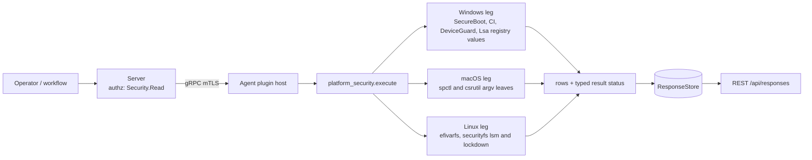

# platform_security

<!-- BEGIN GENERATED: plugin-doc-gen header -->
| | |
|---|---|
| **What it does** | Secure Boot and code-integrity enforcement posture (read-only) |
| **Version** | 1.0.0 |
| **Kind** | Collector · read-only · gathered (crossplatform.platform_security.secure_boot, crossplatform.platform_security.code_integrity) |
| **Platforms** | Windows ✅ · macOS ✅ · Linux ✅ |
| **Actions** | `code_integrity` (definition `crossplatform.platform_security.code_integrity`) · `secure_boot` (definition `crossplatform.platform_security.secure_boot`) |
| **Security** | securable `Security` · operation Read · risk Low · dispatch ReadOnly · approval gate None |
| **Roles** | execute: endpoint-admin, endpoint-operator, security-admin · author: content-author |
<!-- END GENERATED -->

## How it works

Two read-only actions, `secure_boot` and `code_integrity` (`platform_security_plugin.cpp`), each writing rows of the form `<action>|<os>|<key>|<raw>|<state>`. Neither takes parameters, so no request text reaches a path, a registry name or an argv.

- **Linux** (rung 1, `open`/`read` with the errno classified): `secure_boot` reads the efivarfs `SecureBoot-*` and `SetupMode-*` variables (4-byte attribute word plus one data byte); `code_integrity` reads `/sys/kernel/security/lsm` (the active LSM list) and `/sys/kernel/security/lockdown` (the bracketed active mode).
- **macOS**: `secure_boot` is unsupported and reports one `unsupported` row (no public API; SIP is reported under `code_integrity`). `code_integrity` runs `spctl --status` (Gatekeeper) and `csrutil status` (SIP) as declared rung-2 argv leaves through the bounded runner: an absolute literal argv, no shell, a deadline and an output cap. There is no library API for either state.
- **Windows** (rung 1, `RegQueryValueExW`, 64-bit view) under `HKLM\SYSTEM\CurrentControlSet\Control`: `SecureBoot\State` (`UEFISecureBootEnabled`); `CI\Policy` (every value, name-only enumeration then one read each), `DeviceGuard` (`EnableVirtualizationBasedSecurity`, `RequirePlatformSecurityFeatures`, `HypervisorEnforcedCodeIntegrity`), `DeviceGuard\Scenarios\HypervisorEnforcedCodeIntegrity` (`Enabled`) and `Lsa` (`LsaCfgFlags`). `LsaCfgFlags` is the Credential Guard setting and lives under `Control\Lsa`, not `Control\DeviceGuard` (Microsoft Learn, "Configure Credential Guard"): 1 is enabled with a UEFI lock (`enabled_locked`), 2 is enabled without one. These rows report configured policy, not proof of what is running.

Every read is exactly one of a **value** (with a state), **`absent`** (the OS definitively says it is not there) or **`unreadable`** (the read failed); a failed read never reads as absent, and absence is never a failure. A BIOS or CSM boot has no efivars, many kernels have no lockdown LSM and a default Windows install has no DeviceGuard values, so each of these is an `absent` row that adds no reason token and leaves the status `OK`. `enabled`, `disabled` and `partial` describe the protection, not the raw number; `unmodelled` means a value was read that the table cannot interpret (the raw value is kept). The macOS tool rows trust text that parses, whatever the exit status; a tool that cannot be spawned -- including a missing binary -- reads `unreadable`, never `absent`: `spctl`/`csrutil` are sealed-system-volume binaries with no legitimate "not there" case on a real Mac, so a missing binary means a compromised or non-standard host, not a clean answer. The Windows leg makes the same call per key, not uniformly: `SecureBoot\State`, `CI\Policy` and both `DeviceGuard` keys can genuinely be a not-found key on a real host and read `absent`; `Lsa` is foundational NT infrastructure with no evidenced not-found case, so a not-found `Lsa` key reads `unreadable` (a `LsaCfgFlags` VALUE missing from an opened `Lsa` key is unaffected and still legitimately `absent` -- see the samples below).

**Why this plugin exists (stated plainly, not inflated).** Zero documented business driver anywhere — a full-document grep of `docs/capability-map.md`, `docs/enterprise-parity-plan.md`, the SOC 2 workstream doc, and `docs/roadmap.md` found no row, no gap entry, no named control for `platform_security`. This row's priority is asserted (a capability-gap read), not evidenced by any tracked demand; the capability-map row added with this change lists the plugin, it does not drive it. Measured boot ships as a separate plugin, measured_boot.



## OS capability

<!-- BEGIN GENERATED: plugin-doc-gen capability -->
| Action | Windows | macOS | Linux |
|---|---|---|---|
| `code_integrity` | ✅ supported · rung 1 · HKLM\SYSTEM\CurrentControlSet\Control\CI\Policy and Control\DeviceGuard registry values | ✅ supported · rung 2 · spctl --status + csrutil status via run_bounded_subprocess | ✅ supported · rung 1 · securityfs reads of /sys/kernel/security/lsm and /sys/kernel/security/lockdown (errno-classified absent/unreadable) |
| `secure_boot` | ✅ supported · rung 1 · HKLM\SYSTEM\CurrentControlSet\Control\SecureBoot\State registry (UEFISecureBootEnabled) | ⛔ unsupported | ✅ supported · rung 1 · efivarfs reads of /sys/firmware/efi/efivars/SecureBoot-* and SetupMode-* (4-byte attributes + 1 data byte; errno-classified absent/unreadable) |

**Declared limits per leg** (descriptor fallback text, verbatim):

- **`secure_boot` / macOS** — no public API; SIP reported under code_integrity
<!-- END GENERATED -->

## Privileges and prerequisites

| OS | Runs as | Extra grant needed | Measured | If the read is refused |
|---|---|---|---|---|
| Windows | agent service account (LocalSystem today, #1442) | None documented for this plugin (`docs/agent-privilege-model.md`); HKLM `Control` reads are not expected to need elevation | the-rig (Windows 11 Pro 10.0.26200), `NT AUTHORITY\SYSTEM`, 2026-09-21: the per-key probe results are recorded verbatim in the `platform_security_win.cpp` banner (`docs/samples/windows.txt`) | For a per-VALUE read: `ERROR_FILE_NOT_FOUND`/`ERROR_PATH_NOT_FOUND` reports the row `absent` with no token (a value the OS says is not there is always legitimate). For a KEY OPEN, the same two codes report `absent` only for `SecureBoot\State`, `CI\Policy`, `DeviceGuard` and its HVCI scenario subkey -- each can genuinely be a not-found key on a real host; `Lsa` is foundational and has no evidenced not-found case, so the identical codes there report `unreadable` with `lsa:key_missing` instead. `ERROR_ACCESS_DENIED` reports `unreadable` with `<name>:access_denied` and the action reports `PERMISSION_DENIED`/`PARTIAL`; any other Win32 error reports `unreadable` with `<name>:win32_<n>` |
| macOS | agent daemon, root today (LaunchDaemon carries no `UserName` key, see the `docs/agent-privilege-model.md` TL;DR); both tools need no elevation to report | None, `spctl --status` and `csrutil status` are unprivileged | this Mac (`braga`), bare-metal, unprivileged (euid 501), 2026-09-21: real capture (`docs/samples/macos.txt`); no root-privileged run has been captured | a tool that cannot be started reports `unreadable` with `<key>:spawn_failed` (no errno) or `<key>:eacces` / `<key>:errno_<n>` (from the spawn errno, including a missing binary -- `errno_2`/ENOENT -- since spctl/csrutil are sealed-system-volume binaries with no legitimate absent case); the other rung-2 failures are `<key>:timeout`, `<key>:output_truncated`, `<key>:exit_<n>` and `<key>:exit_signal` |
| Linux | agent daemon, default | None documented for this plugin (`docs/agent-privilege-model.md`) | container (Docker VM on this Mac), root, 2026-09-21: real capture of the built `.so` (`docs/samples/linux.txt`); a container has no efivars, so it exercises the `absent` path, not a Secure Boot value | `EACCES`/`EPERM` reports the row `unreadable` with `<key>:eacces` and the action reports `PERMISSION_DENIED`/`PARTIAL`; `ENOENT` reports it `absent` with no token; any other errno reports `unreadable` with `<key>:errno_<n>` |

Binaries and subprocesses: macOS `code_integrity` runs exactly two, `/usr/sbin/spctl --status` and `/usr/bin/csrutil status` (sink-manifest sites `platform_security/do_code_integrity#1` and `#2`, rung 2); every other leg is an in-process read and spawns nothing. Network: none.

## Data contract

### Inputs

<!-- BEGIN GENERATED: plugin-doc-gen inputs -->
Neither action takes parameters.
<!-- END GENERATED -->

### Outputs

Pipe-delimited rows written via `write_output()`, in read order. The first field is the fixed action literal (`secure_boot` or `code_integrity`), then `<os>`, `<key>`, `<raw>` and `<state>`. `<raw>` is `-` when nothing was read (`absent`, `unreadable`, `unsupported`); a raw value that was read passes through the shared untrusted-output escaper, which turns a backslash into `/` and escapes a pipe. Linux `secure_boot` writes `secure_boot` then `setup_mode`, `code_integrity` writes `lsm` then `lockdown`; macOS writes `gatekeeper` then `sip`. Windows rows can outnumber the named values because every `CI\Policy` value is listed, sorted by name, with the one modelled value mapped and the rest `unmodelled`. The action returns 0 for every data-level outcome; only an internal exception returns 1, with the single two-field row `constrained|internal_error`.

<!-- BEGIN GENERATED: plugin-doc-gen outputs -->
**`crossplatform.platform_security.code_integrity` — `row_kind|os|key|raw|state`**

| Field | Type | Values | Available | Example | Description |
|---|---|---|---|---|---|
| `row_kind` | string | `code_integrity` `constrained` | Windows, Linux, macOS | `code_integrity` | Row family: `code_integrity` (one per key read) or `constrained` (an internal-error row: the two-field row `constrained\|internal_error`, which carries no os, key, raw or state). |
| `os` | string | `linux` `macos` `windows` | Windows, Linux, macOS | `linux` | The leg that produced the row. |
| `key` | string | - | Windows, Linux, macOS | `lsm` | Value read: lsm and lockdown (Linux); gatekeeper and sip (macOS); ci_policy.<value name> for every value under CI\Policy, deviceguard.EnableVirtualizationBasedSecurity, deviceguard.RequirePlatformSecurityFeatures, deviceguard.HypervisorEnforcedCodeIntegrity, deviceguard.hvci_scenario_enabled and lsa.LsaCfgFlags (Windows; LsaCfgFlags lives under Control\Lsa, not DeviceGuard). |
| `raw` | string | - | Windows, Linux, macOS | `capability,landlock,yama,apparmor` | The raw text or number read (the LSM list, the lockdown line with its bracketed active mode, the first line of tool output, or the registry value); "-" when nothing was read (absent or unreadable). |
| `state` | string | `enabled` `disabled` `partial` `evaluation` `enabled_locked` `unmodelled` `absent` `unreadable` | Windows, Linux, macOS | `enabled` | enabled, disabled and partial describe the PROTECTION, not the raw value (Linux lockdown integrity is partial, confidentiality is enabled; macOS SIP with a custom configuration is partial). evaluation (Smart App Control in evaluation mode) and enabled_locked (Credential Guard with a UEFI lock) are Windows-only. unmodelled = a value was read that this table has no interpretation for (raw keeps it). absent = the OS definitively says it is not there (no lockdown LSM, no DeviceGuard values on a default Windows install), a normal answer and not a failure. unreadable = the read failed. |

**`crossplatform.platform_security.secure_boot` — `row_kind|os|key|raw|state`**

| Field | Type | Values | Available | Example | Description |
|---|---|---|---|---|---|
| `row_kind` | string | `secure_boot` `constrained` | Windows, Linux, macOS | `secure_boot` | Row family: `secure_boot` (one per key read) or `constrained` (an internal-error row: the two-field row `constrained\|internal_error`, which carries no os, key, raw or state). |
| `os` | string | `linux` `macos` `windows` | Windows, Linux, macOS | `linux` | The leg that produced the row. |
| `key` | string | - | Windows, Linux, macOS | `secure_boot` | Value read: secure_boot and setup_mode (Linux efivars), secure_boot (macOS, unsupported row), UEFISecureBootEnabled (Windows). |
| `raw` | string | - | Windows, Linux, macOS | `1` | The raw value read (the efivar data byte, or the registry DWORD as a number); "-" when nothing was read (absent, unreadable or unsupported). |
| `state` | string | `enabled` `disabled` `unmodelled` `absent` `unreadable` `unsupported` | Windows, Linux, macOS | `enabled` | enabled = Secure Boot enforcing (for setup_mode: User Mode, a Platform Key is enrolled); disabled = Secure Boot off (for setup_mode: Setup Mode, no Platform Key, any image may load). The state describes the protection, not the raw number. unmodelled = a value was read that this table has no interpretation for (raw keeps it). absent = the OS definitively says it is not there (a BIOS/CSM boot has no efivars or SecureBoot\State), a normal answer and not a failure. unreadable = the read failed. unsupported = no mechanism on this OS (macOS). |
<!-- END GENERATED -->

### Result status

| Status | Completeness | Provenance | When |
|---|---|---|---|
| `OK` | `FULL` | — | No row was `unreadable`: every key was either read or `absent`. An `absent` row adds no reason token, so a BIOS host, a kernel without lockdown or a default Windows install still reports `OK`. |
| `UNAVAILABLE` | `FULL` | `no public API; SIP reported under code_integrity` | macOS `secure_boot`: the leg is unsupported by design and reports its `unsupported` row. |
| `CONSTRAINED` | `PARTIAL` | `<key>:errno_<n>`, `<key>:efivars:shape`, `<key>:timeout`, `<key>:output_truncated`, `<key>:spawn_failed`, `<key>:exit_<n>`, `<key>:exit_signal`, `<name>:win32_<n>`, `<name>:type_<n>`, `<name>:size_<n>`, `<name>:oversized`, `ci_policy:enumeration_incomplete`, `lsa:key_missing` | At least one row was `unreadable` and none was refused; one `<key>:<cause>` token per unreadable row, and `<key>:efivars:shape` is an efivar that is not 4 + 1 bytes. An `absent` row never appears here. |
| `CONSTRAINED` | `PARTIAL` | `internal_error` | Any leg: an unexpected exception was contained in `execute()`; the action returns 1 with the row `constrained\|internal_error`. |
| `PERMISSION_DENIED` | `PARTIAL` | `<key>:eacces`, `<name>:access_denied` | Any leg: a read was refused, `EACCES`/`EPERM` on Linux and for a macOS spawn, `ERROR_ACCESS_DENIED` on Windows. A refusal outranks every other unreadable cause in the same run; the reason still lists every unreadable row's token. |

### Where the data goes

- **Instruction result.** Rows travel over the agent's mTLS gRPC channel as the command response and land in the ResponseStore, queryable at `/api/responses/{id}`. Both actions are gathered definitions (`crossplatform.platform_security.secure_boot`, `crossplatform.platform_security.code_integrity`, 300s TTL).
- **Not consumed by** daily-sync, TAR, DEX, or metrics.
- **Sensitivity.** Rows carry boot-integrity and code-signing settings only: no username, path, process name or installed-software name. The values are a security-posture baseline of the host (for example Secure Boot off, Gatekeeper off, lockdown none), which tells an attacker where enforcement is weak, so the rows warrant the same handling as other `Security` data.
- **Siblings:** `vuln_scan` (its configuration checks run `spctl --status` and `csrutil status` through `popen` as pass/fail findings; this plugin reports the raw text and a state over the bounded runner) and `bitlocker` (disk encryption posture).

## Sample output

<!-- BEGIN GENERATED: plugin-doc-gen samples -->
**Windows** — captured: windows Windows 10.0.26200 x86_64 · bare-metal · 2026-09-21 · LocalSystem (elevated) · leg-hash 98358aa6dbaf

```
== action=secure_boot
secure_boot|windows|UEFISecureBootEnabled|1|enabled
[result_status] OK / FULL

== action=code_integrity
code_integrity|windows|ci_policy.EmodePolicyRequired|0|unmodelled
code_integrity|windows|ci_policy.SAC_PreviousState|4294967295|unmodelled
code_integrity|windows|ci_policy.SkuPolicyRequired|0|unmodelled
code_integrity|windows|ci_policy.VerifiedAndReputablePolicyState|0|disabled
code_integrity|windows|deviceguard.EnableVirtualizationBasedSecurity|-|absent
code_integrity|windows|deviceguard.HypervisorEnforcedCodeIntegrity|-|absent
code_integrity|windows|deviceguard.RequirePlatformSecurityFeatures|-|absent
code_integrity|windows|deviceguard.hvci_scenario_enabled|-|absent
code_integrity|windows|lsa.LsaCfgFlags|-|absent
[result_status] OK / FULL
```

**macOS** — captured: macos macOS 26.6.2 arm64 · bare-metal · 2026-09-21 · euid 501 · leg-hash 98358aa6dbaf

```
== action=secure_boot
secure_boot|macos|secure_boot|-|unsupported
[result_status] UNAVAILABLE / FULL / no public API; SIP reported under code_integrity

== action=code_integrity
code_integrity|macos|gatekeeper|assessments enabled|enabled
code_integrity|macos|sip|System Integrity Protection status: enabled.|enabled
[result_status] OK / FULL
```

**Linux** — captured: linux Debian GNU/Linux 13 (trixie) aarch64 · container · 2026-09-21 · euid 0 · leg-hash 98358aa6dbaf

```
== action=secure_boot
secure_boot|linux|secure_boot|-|absent
secure_boot|linux|setup_mode|-|absent
[result_status] OK / FULL

== action=code_integrity
code_integrity|linux|lsm|-|absent
code_integrity|linux|lockdown|-|absent
[result_status] OK / FULL
```
<!-- END GENERATED -->

## Caveats and known gaps

1. **No documented business driver.** The priority for this plugin is asserted from a capability-gap reading, not evidenced by any tracked demand (see "How it works"); there is no capability-map requirement, named customer, SOC 2 control or CVE behind it.
2. **Configured policy, not runtime proof.** The Windows rows read registry values, which say what is configured; whether Device Guard, HVCI or Credential Guard is actually running is a separate runtime fact (`Win32_DeviceGuard`) that this plugin does not query, and it does not call WLDP.
3. **macOS `secure_boot` is unsupported.** There is no public API for the boot-security policy and `bputil` is a recovery-environment tool that is not run; SIP is reported under `code_integrity`. On a Mac the `secure_boot` action therefore always reports `UNAVAILABLE`.
4. **Two rung-2 argv leaves on macOS.** Gatekeeper and SIP have no library API, so both are read from a tool's text; the parsers match an exact line and report `unmodelled` for anything else (SIP's `enabled (Custom Configuration).` reads `partial`). `vuln_scan` runs the same two commands through `popen` at rung 3; folding it onto this reader is a follow-up, not part of this change. Security.framework `SecStaticCode*` is not used: every call in that family validates one named code object's own signature, not a machine-wide code-signing-enforcement toggle, so it cannot answer this action's question.
5. **Fixed reads, no discovery.** The plugin reads only the keys named above; it does not walk securityfs or the registry (apart from listing the names under `CI\Policy`), and it does not report TPM or measured-boot state.

## Source and tests

<!-- BEGIN GENERATED: plugin-doc-gen source -->
- Plugin: `agents/plugins/platform_security/src/platform_security_legs.hpp` · `agents/plugins/platform_security/src/platform_security_linux.cpp` · `agents/plugins/platform_security/src/platform_security_macos.cpp` · `agents/plugins/platform_security/src/platform_security_parsers.hpp` · `agents/plugins/platform_security/src/platform_security_plugin.cpp` · `agents/plugins/platform_security/src/platform_security_win.cpp` · `agents/plugins/platform_security/src/platform_security_win_parsers.hpp`
- Definitions: `content/definitions/platform_security.yaml`
- Capability rows: `server/core/src/capability_decls/plugin_action_catalogue_platform_security.hpp`
- Tests: `tests/unit/test_platform_security_local_dispatcher.cpp` · `tests/unit/test_platform_security_parsers.cpp` · `tests/unit/test_platform_security_win_parsers.cpp`
- Privilege row: `docs/agent-privilege-model.md`
- Changelog: `changelog.d/wave8-pr81a1-platform_security.added.md`
<!-- END GENERATED -->
