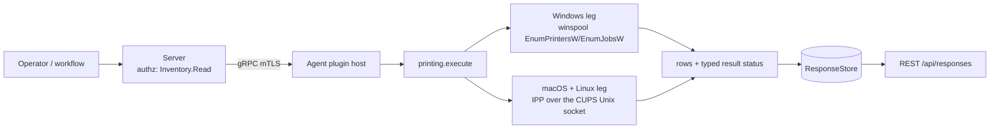

# printing

<!-- BEGIN GENERATED: plugin-doc-gen header -->
| | |
|---|---|
| **What it does** | Printer/job inventory plus a single narrowly-scoped clear_queue cancellation |
| **Version** | 1.0.0 |
| **Kind** | Action · mutating · gathered (crossplatform.printing.printers, crossplatform.printing.jobs, crossplatform.printing.clear_queue) |
| **Platforms** | Windows ✅ · macOS ✅ · Linux ✅ |
| **Actions** | `clear_queue` (definition `crossplatform.printing.clear_queue`) · `jobs` (definition `crossplatform.printing.jobs`) · `printers` (definition `crossplatform.printing.printers`) |
| **Security** | `printers`: securable `Inventory` · operation Read · risk Low · dispatch ReadOnly · approval gate None; `jobs`: securable `Inventory` · operation Read · risk Low · dispatch ReadOnly · approval gate None; `clear_queue`: securable `Infrastructure` · operation Write · risk Medium · dispatch Destructive · approval gate AdminOrApproval |
| **Roles** | execute: `printers`: endpoint-admin, endpoint-operator; `jobs`: endpoint-admin, endpoint-operator; `clear_queue`: endpoint-admin · author: content-author |
<!-- END GENERATED -->

## How it works

`printers` and `jobs` are plain IPP reads: encode a request (RFC 8010, no libcups — `printing_ipp.hpp` is a from-scratch minimal codec), send it over the CUPS Unix domain socket (falling back to `localhost:631` over TCP when no socket is found), decode the response, and format the rows. On Windows the same two actions go through winspool (`EnumPrintersW`/`EnumJobsW`) instead of IPP; there is no libcups dependency on any platform. The plugin keeps no history: `jobs` only ever reports not-completed jobs, and nothing here retains a record of a job once it leaves the queue. `clear_queue` is the plugin's only mutation — it cancels exactly one job id (`SetJobW(JOB_CONTROL_CANCEL)` on Windows, IPP `Cancel-Job` over the same CUPS Unix socket on macOS/Linux), never a purge-all; a human resubmitting the document from their own application is the real-world path back, not a Yuzu dispatch.



## OS capability

<!-- BEGIN GENERATED: plugin-doc-gen capability -->
| Action | Windows | macOS | Linux |
|---|---|---|---|
| `clear_queue` | ✅ supported · rung 1 · winspool SetJobW JOB_CONTROL_CANCEL on one job id | 🟡 constrained · rung 1 · IPP Cancel-Job on one job id over the CUPS Unix socket with Authorization: PeerCred | 🟡 constrained · rung 1 · IPP Cancel-Job on one job id over the CUPS Unix socket with Authorization: PeerCred |
| `jobs` | ✅ supported · rung 1 · winspool EnumJobsW level 2 | ✅ supported · rung 1 · IPP Get-Jobs (which-jobs=not-completed) over the CUPS Unix socket | ✅ supported · rung 1 · IPP Get-Jobs (which-jobs=not-completed) over the CUPS Unix socket |
| `printers` | ✅ supported · rung 1 · winspool EnumPrintersW level 2 | ✅ supported · rung 1 · IPP CUPS-Get-Printers over the CUPS Unix socket (cpp-httplib) | ✅ supported · rung 1 · IPP CUPS-Get-Printers over the CUPS Unix socket (cpp-httplib) |

**Declared limits per leg** (descriptor fallback text, verbatim):

- **`clear_queue` / Windows** — cancel measured only under Administrators and SYSTEM (SYSTEM is today's agent identity, #1442); a least-privileged identity cancelling a job it does not own is unmeasured (PRINTER_ACCESS_USE is a projection) - see docs/agent-privilege-model.md
- **`clear_queue` / macOS** — PROVISIONAL — cupsd.conf Cancel-Job policy requires @OWNER/@AUTHKEY(system.print.operator)/@admin/@lpadmin (no @SYSTEM); header accepted by cupsd, authorisation outcome for a non-owned job UNMEASURED
- **`clear_queue` / Linux** — measured in a Debian/Ubuntu cupsd container: container root/@SYSTEM (SystemGroup root lpadmin) cancelling another user's job succeeds (status 0x0000, I93-7) — but the production Linux agent runs unprivileged (docs/agent-privilege-model.md), never root or @SYSTEM, so an ordinary non-owning cancel is correctly refused (403) before Cancel-Job is ever reached; reliable only for a job the agent's own identity owns
- **`jobs` / macOS** — localhost:631 fallback for reads when no socket is found
- **`jobs` / Linux** — localhost:631 fallback for reads when no socket is found
- **`printers` / macOS** — localhost:631 fallback for reads when no socket is found
- **`printers` / Linux** — localhost:631 fallback for reads when no socket is found
<!-- END GENERATED -->

## Privileges and prerequisites

| OS | Runs as | Extra grant needed | Measured | If the read is refused |
|---|---|---|---|---|
| Windows | agent service account | None for reads — `EnumPrintersW`/`EnumJobsW`/`OpenPrinterW` need no elevated right (measured under `SYSTEM` only). `clear_queue` opens the printer with `PRINTER_ACCESS_USE`; cancel was measured only under Administrators and `SYSTEM` (both already elevated), and a least-privileged identity cancelling a job it does not own is **not** measured — see `docs/agent-privilege-model.md`. `EnumPrintersW` (the only call at risk of blocking against an unreachable network print server — `PRINTER_ENUM_CONNECTIONS`) is bounded (`yuzu::shared::bounded_call`, 5s); the per-printer `OpenPrinterW`/`EnumJobsW` pair is deliberately NOT — bounding a call holding a live `HANDLE` the caller closes on return would race a timed-out detached thread against that close (see `enum_jobs_raw`'s own comment) — `EnumJobsW` instead caps at 5000 rows, not wall-clock time; a genuinely unreachable per-printer RPC can still hang (tracked as a follow-up, not closed here) | the-rig, `SYSTEM`, 2026-09-08 (`docs/samples/windows.txt`); `clear_queue` cancel also under the admin SSH identity | n/a — reads do not fail closed; a win32 failure or bounded-call timeout on `EnumPrintersW` reports `CONSTRAINED`, never a permission error. `clear_queue` is different: `ERROR_ACCESS_DENIED` from `OpenPrinterW` or `SetJobW` reports `PERMISSION_DENIED` (`refused`) |
| macOS | agent daemon — **root** by documented exception (`docs/agent-privilege-model.md:14`: launchd's LaunchDaemon has no `UserName` key; the `_yuzu` unprivileged-account model is not yet applied on macOS), not the dedicated-unprivileged-account design line 12 describes for the other two platforms | None to read | this Mac, euid 501, 2026-09-14 (`docs/samples/macos.txt`) | n/a — reads do not fail closed |
| Linux | agent daemon, dedicated unprivileged account (`yuzu`), never root by design (`docs/agent-privilege-model.md:12`) | None to read | container, euid 0, 2026-09-14 (`docs/samples/linux.txt`) | n/a — reads do not fail closed |

No external binaries, no subprocesses, no shell-out — the IPP codec talks to cupsd's Unix socket (or `localhost:631` TCP, reads only) through `cpp-httplib` directly; Windows uses in-process winspool calls only. No network use beyond that local loopback/socket traffic — the CUPS socket carries no TLS by design (a local IPC channel, same trust boundary as any other local Unix socket).

## Data contract

### Inputs

<!-- BEGIN GENERATED: plugin-doc-gen inputs -->
| Definition | Parameter | Type | Required | Default | Constraints | Description |
|---|---|---|---|---|---|---|
| `crossplatform.printing.clear_queue` | `printer` | string | yes | - | minLength 1 · maxLength 256 | The printer the job is queued on. |
| `crossplatform.printing.clear_queue` | `job_id` | string | yes | - | pattern: ^[1-9][0-9]{0,8}$ | The job identifier to cancel, from the jobs action's job_id column. |
| `crossplatform.printing.jobs` | `printer` | string | no | - | maxLength 256 | Optional printer name to filter to. When omitted, jobs across every printer are listed. |
<!-- END GENERATED -->

### Outputs

Every row is pipe-delimited, one row per printer/job. `printers`/`jobs` report `<kind>|none` when the read succeeded but nothing was found (an honest empty result, never conflated with a read failure). A field the platform mechanism did not report is `-` for a string field or `-1` for a count/size the mechanism could not determine.

<!-- BEGIN GENERATED: plugin-doc-gen outputs -->
**`crossplatform.printing.clear_queue` — `printer|job_id|outcome|detail`**

| Field | Type | Values | Available | Example | Description |
|---|---|---|---|---|---|
| `printer` | string | - | Windows, Linux, macOS | `Office-LaserJet` | The printer the target job was on (as given), or "-" when the param itself was missing. |
| `job_id` | int64 | - | Windows, Linux, macOS | `42` | The job id targeted, or 0 when the param itself was missing/invalid. |
| `outcome` | string | - | Windows, Linux, macOS | `canceled` | Values: canceled, not_found, refused, error. |
| `detail` | string | - | Windows, Linux, macOS | `-` | "-" on a successful cancel; otherwise a <os>:<source>:<detail> failure token, or missing_printer/invalid_job_id for a parameter validation failure. |

**`crossplatform.printing.jobs` — `printer|job_id|owner|document|status|submitted_at|size_bytes`**

| Field | Type | Values | Available | Example | Description |
|---|---|---|---|---|---|
| `printer` | string | - | Windows, Linux, macOS | `ipp://localhost/printers/Office-LaserJet` | The printer this job is queued on (URI on the IPP leg, printer name on Windows), or "-" when unavailable. |
| `job_id` | int64 | - | Windows, Linux, macOS | `42` | Job identifier — the value clear_queue's job_id parameter targets. Values: 1 or greater. |
| `owner` | string | - | Windows, Linux, macOS | `alex` | The submitting user, or "-" when unavailable. |
| `document` | string | - | Windows, Linux, macOS | `hosts` | The job's document name/title, or "-" when unavailable. User content — see this definition's retention note above. |
| `status` | string | - | Windows, Linux, macOS | `processing` | Job status. Values: pending, held, processing, stopped, canceled, aborted, completed, unknown. |
| `submitted_at` | string | - | Windows, Linux, macOS | `2026-09-08T12:00:00Z` | ISO-8601 UTC submission timestamp, or "-" when unavailable. |
| `size_bytes` | int64 | - | Windows, Linux, macOS | `1024` | Job size in bytes, or -1 (unknown). |

**`crossplatform.printing.printers` — `name|state|state_reasons|is_default|make_model|uri|queued_jobs`**

| Field | Type | Values | Available | Example | Description |
|---|---|---|---|---|---|
| `name` | string | - | Windows, Linux, macOS | `Office-LaserJet` | Printer name/identifier as reported by the platform mechanism. |
| `state` | string | - | Windows, Linux, macOS | `idle` | Reported printer state. Values: idle, processing, stopped, unknown. |
| `state_reasons` | string | - | Windows, Linux, macOS | `-` | Comma-joined printer-state-reasons keywords, or "-" when none reported. winspool has no equivalent vocabulary and always reports "-". |
| `is_default` | boolean | - | Windows, Linux, macOS | `1` | Whether this is the system default printer. Values: 1, 0 — a digit, never true/false. |
| `make_model` | string | - | Windows, Linux, macOS | `Local Raw Printer` | Make/model string (IPP printer-make-and-model, or the winspool driver name), or "-" when unavailable. |
| `uri` | string | - | Windows, Linux, macOS | `ipp://localhost/printers/Office-LaserJet` | Printer URI (IPP printer-uri-supported, or the winspool port name), or "-" when unavailable. |
| `queued_jobs` | int64 | - | Windows, Linux, macOS | `0` | Number of jobs currently queued on this printer. Values: 0 or greater, or -1 (unknown — the mechanism did not report a count). |
<!-- END GENERATED -->

### Result status

`printers`/`jobs` set `OK`/`FULL` on every successful read, including a genuinely empty result (`printer|none`/`job|none`) — a read is never left `UNDECLARED`. Windows reports success or failure directly from the Win32 calls themselves (`EnumPrintersW`/`EnumJobsW`/`OpenPrinterW` — see Privileges and prerequisites for which of the three is actually bounded against a hang, and which is not); macOS/Linux additionally check the IPP response's own status code before trusting a zero-row result as "genuinely empty" — a request CUPS itself refuses (e.g. an unrecognised printer-uri) is `CONSTRAINED`, never reported as an empty queue. `clear_queue` never leaves `UNDECLARED` either: every exit path — parameter validation, transport, authorization, and the terminal cancel outcome — sets an explicit status.

| Status | Completeness | Provenance | When |
|---|---|---|---|
| `OK` | full | (empty) | every platform: a successful read, or `clear_queue` cancelling the job |
| `CONSTRAINED` | partial | `windows:winspool:enum_printers_failed` / `windows:winspool:open_printer_failed` / `windows:winspool:enum_jobs_failed` — `"CUPS-Get-Printers: transport failed"` / `linux:cups:connect_failed` / `macos:cups:connect_failed` — `"CUPS-Get-Printers: response did not decode"` / `linux:cups:decode_failed` / `macos:cups:decode_failed` — `"Get-Jobs: transport failed"` / `"Get-Jobs: response did not decode"` — `"CUPS-Get-Printers: unexpected status 0x⟨hex⟩"` / `"Get-Jobs: unexpected status 0x⟨hex⟩"` / `linux:cups:unexpected_status` / `macos:cups:unexpected_status` | Windows `printers`: `EnumPrintersW` failed or timed out (a bounded call — see Privileges and prerequisites). Windows `jobs`: the same `EnumPrintersW` failure, OR a specific printer's queue could not be opened (`OpenPrinterW` denied — NOT a bounded call), or its `EnumJobsW` read failed or was truncated at the row cap (also NOT a bounded call — see Privileges and prerequisites for why) — each is a per-printer skip, surfaced as `CONSTRAINED`/`PARTIAL` alongside whatever rows did succeed, never silently. macOS/Linux `printers`/`jobs`: the IPP round trip failed at the transport/decode step, or cupsd returned a status outside the successful range (RFC 8010 `0x0000`–`0x00FF`) — e.g. an unrecognised printer-uri, never silently read as zero rows |
| `UNAVAILABLE` | partial | `missing_printer` / `invalid_job_id` — `windows:winspool:open_printer_failed` / `windows:winspool:printer_not_found` (UNC names only) / `windows:winspool:job_not_found` / `windows:winspool:set_job_failed` — `linux:cups:connect_failed` / `macos:cups:connect_failed` — `linux:cups:decode_failed` / `macos:cups:decode_failed` — `"Cancel-Job: unexpected status 0x⟨hex⟩"` / `linux:cups:unexpected_status` / `macos:cups:unexpected_status` | `clear_queue` parameter validation failed (`printer` empty or `job_id` unparseable — a fully-refused request, no OS call made), or the cancel itself could not complete: Windows `OpenPrinterW` failed for a reason other than not-found or access-denied (spooler stopped, RPC unavailable — the Win32 error is in the status detail); Windows reported a nonexistent job (`GetJobW`, or `SetJobW` if the job finished in between — `ERROR_INVALID_PARAMETER`), which is `PARTIAL` rather than `FULL` because that code was measured only under elevated identities; Windows `OpenPrinterW` returned `ERROR_INVALID_PRINTER_NAME` for a UNC-shaped name (`\\server\queue` or the `//server/queue` form the `printers`/`jobs` rows render), which the OS also returns for an unreachable server, so it is reported as `printer_not_found` but not as definitive; or `SetJobW` failed for another reason other than access (the Win32 error is in the status detail); macOS/Linux the IPP Cancel-Job round trip failed at the transport/decode step, or cupsd returned a status this plugin doesn't otherwise classify |
| `UNAVAILABLE` | full | `windows:winspool:printer_not_found` (local names) — `linux:cups:not_found` / `macos:cups:not_found` | `clear_queue`: the target printer or job no longer exists — Windows `OpenPrinterW` (`ERROR_INVALID_PRINTER_NAME`) for a local, non-UNC printer name; macOS/Linux cupsd's own `client-error-not-found` (IPP `0x0406`) response |
| `PERMISSION_DENIED` | full | `linux:cups:socket_unavailable` / `macos:cups:socket_unavailable` — `linux:cups:no_identity` / `macos:cups:no_identity` — `windows:winspool:access_denied` — `linux:cups:access_denied` / `macos:cups:access_denied` | `clear_queue` refused before or after attempting the cancel: macOS/Linux found no CUPS Unix socket at all (refuses outright rather than falling back to the `localhost:631` TCP path `printers`/`jobs` use for reads — a mutating action never takes that fallback), or could not resolve the agent's effective-user identity (refused locally, no request sent); or the cancel was authorized-denied — Windows `OpenPrinterW` or `SetJobW` returned `ERROR_ACCESS_DENIED`, macOS/Linux cupsd's HTTP layer (401/403) or IPP response (`client-error-forbidden`/`not-authenticated`/`not-authorized`, `0x0401`/`0x0402`/`0x0403`) refused the caller. A `client-error-bad-request` (`0x0400`) is a protocol fault, not an authorization decision, and surfaces as `unexpected_status` — see Privileges and prerequisites for who is actually authorized to cancel whose job on each platform |

### Where the data goes

- **Instruction result.** Every row is server instruction-result data — the standard retention policy, served over REST `/api/responses`. Nothing here is a durable server-side table of its own.
- **Not consumed by** daily-sync, TAR, DEX, or metrics — the plugin never runs on a schedule outside an explicit instruction dispatch, and there is no agent daily-sync source for print queues.
- **Sensitivity.** `jobs.document` is the job's user-supplied document title/filename — it is treated as user content: instruction-result retention only, never forwarded to daily-sync, TAR, or DEX. `jobs.owner` is a local account name on the target device.
- **Siblings:** `crossplatform.printing.printers`, `crossplatform.printing.jobs`.

## Sample output

<!-- BEGIN GENERATED: plugin-doc-gen samples -->
**Windows** — captured: windows Windows 10.0.26200 x86_64 · bare-metal · 2026-09-08 · LocalSystem (elevated) · leg-hash a6ac30dd4945

```
== action=printers
printer|OneNote (Desktop)|idle|-|0|Send to Microsoft OneNote 16 Driver|nul:|0
printer|Microsoft XPS Document Writer|idle|-|0|Microsoft XPS Document Writer v4|PORTPROMPT:|0
printer|Microsoft Print to PDF|idle|-|1|Microsoft Print To PDF|PORTPROMPT:|0
printer|Fax|idle|-|0|Microsoft Shared Fax Driver|SHRFAX:|0
[result_status] UNDECLARED / UNKNOWN

== action=jobs
job|none
[result_status] UNDECLARED / UNKNOWN

== action=clear_queue
[not captured] Destructive/Irreversible: mutating action, not executed in a docs capture
```

**macOS** — captured: macos macOS 26.6.2 arm64 · bare-metal · 2026-09-14 · euid 501 · leg-hash a6ac30dd4945

```
== action=printers
printer|none
[result_status] OK / FULL

== action=jobs
job|none
[result_status] OK / FULL

== action=clear_queue
[not captured] Destructive/Irreversible: mutating action, not executed in a docs capture
```

**Linux** — captured: linux Debian GNU/Linux 13 (trixie) aarch64 · container · 2026-09-14 · euid 0 · leg-hash a6ac30dd4945

```
== action=printers
printer|yuzu_test|stopped|paused|0|Local Raw Printer|ipp://localhost:631/printers/yuzu_test|1
[result_status] OK / FULL

== action=jobs
job|ipp://localhost:631/printers/yuzu_test|1|-|-|pending|2026-09-14T17:27:40Z|1024
[result_status] OK / FULL

== action=clear_queue
[not captured] Destructive/Irreversible: mutating action, not executed in a docs capture
```
<!-- END GENERATED -->

## Caveats and known gaps

1. **`jobs` reports only not-completed jobs; there is no completed-job history.** A job that has finished, failed, or was already cancelled by a previous call simply stops appearing — there is no lookup for it.

## Source and tests

<!-- BEGIN GENERATED: plugin-doc-gen source -->
- Plugin: `agents/plugins/printing/src/printing_ipp.hpp` · `agents/plugins/printing/src/printing_parsers.hpp` · `agents/plugins/printing/src/printing_plugin.cpp`
- Definitions: `content/definitions/printing.yaml`
- Capability rows: `server/core/src/capability_decls/plugin_action_catalogue_printing.hpp`
- Tests: `tests/unit/server/test_printing_clear_queue_gate.cpp` · `tests/unit/test_printing_local_dispatcher.cpp` · `tests/unit/test_printing_parsers.cpp`
- Privilege row: `docs/agent-privilege-model.md`
- Changelog: `changelog.d/wave9-pr91b-printing.added.md` · `changelog.d/wave9-pr91b2-printing-clear-queue.added.md`
<!-- END GENERATED -->
