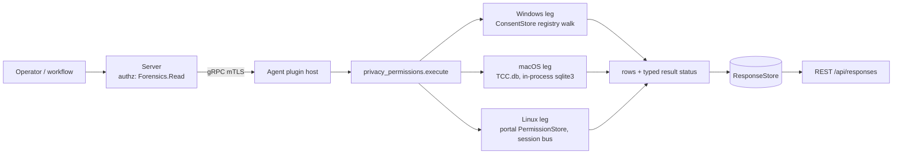

# privacy_permissions

<!-- BEGIN GENERATED: plugin-doc-gen header -->
| | |
|---|---|
| **What it does** | Per-app sensitive-permission grants -- camera, microphone, location, full-disk-access equivalents (read-only) |
| **Version** | 1.0.0 |
| **Kind** | Collector · read-only · gathered (crossplatform.privacy_permissions.permissions) |
| **Platforms** | Windows ✅ · macOS 🟡 constrained · Linux 🟡 constrained |
| **Actions** | `permissions` (definition `crossplatform.privacy_permissions.permissions`) |
| **Security** | securable `Forensics` · operation Read · risk High · dispatch ReadOnly · approval gate AdminOrApproval |
| **Roles** | execute: admin · author: content-author |
<!-- END GENERATED -->

## How it works

One action, `permissions` (`privacy_permissions_plugin.cpp`), reports per-app sensitive-permission grants for four categories -- camera, microphone, location, full-disk-access -- as rows `permissions|<os>|<app_id>|<category>|<state>|<raw>|<last_used_start>|<last_used_stop>` (the leading field is the definition's `row_kind` column). The action takes no parameters. Every leg is rung 1: no PowerShell, no subprocess on Windows or macOS, and Linux's session-bus D-Bus call is the only process boundary crossed anywhere in the plugin.

- **macOS** reads `TCC.db` read-only, in-process (`sqlite3_open_v2`, never a `sqlite3` CLI shellout), querying the `access` table for the three TCC-governed categories (camera, microphone, full-disk-access) in two kinds of source: the **system** `/Library/Application Support/com.apple.TCC/TCC.db` (rows unqualified) and **each user's own** `~/Library/Application Support/com.apple.TCC/TCC.db` for every real home directly under `/Users` (a directory, not a symlink, owned by uid 500 or above -- the `autoruns` rule), rows qualified `<user>/<app_id>`. Camera and microphone grants live only in the per-user databases. `location` is administered by `locationd` outside TCC entirely (ADR-3003) and ships as its own explicit `unsupported` row on every collection.
- **Windows** enumerates real profiles from `HKLM\...\ProfileList` (the agent runs as LocalSystem, so its own `HKEY_CURRENT_USER` is not any user's) and walks each profile's `...\CapabilityAccessManager\ConsentStore` through the shared live-hive-first ladder (`with_user_hive`: the loaded `HKU\<SID>`, else an offline `RegLoadKeyW` mount of the profile's `NTUSER.DAT` under SeBackup/SeRestore), plus the machine-wide `HKLM` mirror, for the four mapped `CapabilityName` keys -- each one's own `Value` plus its `NonPackaged` and packaged-app children. An `HKLM` value overrides a profile's entry for the same app+category **only when that HKLM value was successfully read** (an MDM/GPO-locked policy); an absent, unreadable or refused HKLM value never displaces a profile's real grant, and a profile's own failed read is never hidden behind an HKLM value. `app_id` is qualified with the owning profile's name. An applied HKLM grant is emitted once per reachable profile, under that profile's qualifier -- a consumer counting rows per app should key on `(app_id, category)`; HKLM's own failures and entries are emitted once, unqualified. Any refused read -- a profile hive, a ConsentStore root, a capability or app key, a `Value` -- is a `denied` row and escalates the action to `PERMISSION_DENIED`.
- **Linux** calls `org.freedesktop.impl.portal.PermissionStore.Lookup` over the agent process's **own** session D-Bus (`sd_bus_open_user`) -- it never reaches another user's session. No session bus or no portal daemon is the honest, expected outcome for a system-service agent (`unsupported`, `UNAVAILABLE`), not a failure -- and says nothing about interactive users' grants.



## OS capability

<!-- BEGIN GENERATED: plugin-doc-gen capability -->
| Action | Windows | macOS | Linux |
|---|---|---|---|
| `permissions` | ✅ supported · rung 1 · per-profile (with_user_hive, LocalSystem's own HKCU is not a real user's) + HKLM SOFTWARE\\Microsoft\\Windows\\CurrentVersion\\CapabilityAccessManager\\ConsentStore registry walk | 🟡 constrained · rung 1 · TCC.db read-only, in-process sqlite3; SIP-protected, an unentitled agent is expected to read denied | 🟡 constrained · rung 1 · xdg-desktop-portal org.freedesktop.impl.portal.PermissionStore.Lookup over the session bus; unavailable (no daemon/no session) on most non-sandboxed desktops |
<!-- END GENERATED -->

## Privileges and prerequisites

| OS | Runs as | Extra grant needed | Measured | If the read is refused |
|---|---|---|---|---|
| Windows | agent service account (LocalSystem today, #1442) -- `HKEY_CURRENT_USER` would resolve to LocalSystem's own profile, not any interactive user's, so this leg reads each real profile's ConsentStore via the shared live-hive-first/offline-NTUSER.DAT-fallback ladder (`with_user_hive`, the `license_scan`/`registry` precedent), never the process's own HKCU | SeBackupPrivilege + SeRestorePrivilege for the offline-mount fallback -- already held by the agent account (no new grant) | Not yet measured on the-rig | Any refused read is a `denied` row whose `raw` names it -- a profile (`<profile>:access_denied`), the HKLM root (`hklm:access_denied`), a capability/app key or container, or a `Value` (`<profile>\<app_id>:<category>:<cause>`) -- and the action reports `PERMISSION_DENIED`/`PARTIAL`; any other Win32 error is an `unreadable` row (`...:win32_<n>`), `CONSTRAINED`/`PARTIAL` |
| macOS | agent daemon, root today (LaunchDaemon carries no `UserName` key -- `docs/agent-privilege-model.md` TL;DR) | Every `TCC.db` -- the system one and each per-user one -- is TCC-protected regardless of privilege level; a separate Full Disk Access (FDA) grant is needed | 2026-09-23, this Mac (`braga`), euid 501 with ambient FDA (NOT the production agent identity): the system db and the per-user db both read (per-user microphone grants visible). The same run with both TCC directories read-denied (a `sandbox-exec` deny profile, standing in for a non-FDA identity) reported both sources `denied`, `PERMISSION_DENIED`/`PARTIAL`. Whether the production LaunchDaemon identity holds FDA is a still-open acceptance item | A refused `lstat`/open (`EPERM`/`EACCES`, or `SQLITE_CANTOPEN`/`SQLITE_AUTH`/`SQLITE_PERM` on a file that is there) reports that source's whole-source row `denied` (`tcc_db:access_denied`, `<user>:tcc_db:access_denied`, `...:open_failed:<msg>`), `PERMISSION_DENIED`/`PARTIAL`. An agent without FDA sees this for every source |
| Linux | agent daemon, default | None -- the portal call is an ordinary session-bus D-Bus method call | Not yet measured against a real running `xdg-desktop-portal` | A refused session-bus socket (`session_bus:access_denied`) or an `AccessDenied`-shaped D-Bus error (`<category>:access_denied`, on that category's own row) reports `denied`, `PERMISSION_DENIED`/`PARTIAL`; a malformed reply reports `unreadable` with `<category>:shape` |

Binaries/subprocesses: none -- every leg is an in-process read (SQLite, the Windows registry API, sd-bus). Network: the Linux leg's D-Bus call is local-machine IPC only, never a network socket.

## Data contract

### Inputs

<!-- BEGIN GENERATED: plugin-doc-gen inputs -->
The action takes no parameters.
<!-- END GENERATED -->

### Outputs

One row per app per category. Every category of every source gets a row: its decoded grants, an `absent` row when the source cleanly holds none, an `unsupported` row when no mechanism reaches it (macOS `location`, Linux `full_disk_access`), or a failure row. A whole-source row (`category` `-`) stands for every category of a source that could not be read at all (a `TCC.db`, a Windows profile hive or ConsentStore root, the session bus) or that holds no file (a macOS user with no per-user `TCC.db`, `absent`). A **failure row** -- `denied` from a refused read, or `unreadable` -- carries its own failure token in `raw` (the same token is in the result provenance), so it is never mistaken for a decoded grant or for `absent`.

`app_id` `-` means "no specific app" (a Windows capability-level default, a per-category `absent`/`unsupported` row, or a failure row). A row from a per-user source is qualified with the user's name -- `<user>/<app_id>`, `<user>/-` (each Windows profile, each macOS per-user `TCC.db`; the row sanitizer writes the `\` separator as `/`). An unqualified `app_id` comes from a machine-wide source: the macOS system `TCC.db`, the Windows HKLM mirror, the Linux portal. On Windows, `last_used_start`/`last_used_stop` read `unreadable` (plus a `...:last_used_start_<cause>` token) when the value exists but is not an 8-byte `REG_QWORD` or could not be read.

The one internal-error row keeps the same field count: `constrained|<os>|-|-|unreadable|internal_error|-|-`, result `CONSTRAINED`/`PARTIAL`, provenance `internal_error`.

<!-- BEGIN GENERATED: plugin-doc-gen outputs -->
**`crossplatform.privacy_permissions.permissions` — `os|app_id|category|state|raw|last_used_start|last_used_stop`**

| Field | Type | Values | Available | Example | Description |
|---|---|---|---|---|---|
| `os` | string | `macos` `windows` `linux` | Windows, Linux, macOS | `macos` | The reporting OS. |
| `app_id` | string | - | Windows, Linux, macOS | `com.example.App` | Per-app identifier: a TCC client id (bundle id or path, macOS), an executable path or Package Family Name (Windows), a portal-reported app id (Linux). On Windows, non-"-" identifiers AND the "-" capability-level default are both qualified with the owning profile's name (`<profile>\<app_id>` / `<profile>\-`) -- the agent runs as LocalSystem and reads every real profile's ConsentStore, so a bare "-" default would be ambiguous between two profiles with different defaults for the same category. Bare "-" (no qualifier) means the whole read failed before any app-level row could be produced, or (Windows only, no reachable profile) a machine-wide HKLM default with no profile to attribute it to. |
| `category` | string | `camera` `microphone` `location` `full_disk_access` | Windows, Linux, macOS | `camera` | The fixed cross-OS permission category. "-" only on a whole-read-failed row. |
| `state` | string | `allowed` `denied` `prompt_undetermined` `absent` `unreadable` `unsupported` | Windows, Linux, macOS | `allowed` | allowed/denied: a real, decoded grant. prompt_undetermined: the mechanism reported a value this plugin doesn't map to allowed/denied (never guessed). absent: no record for this app+category -- the app never asked, not a failure. unreadable: the read itself failed. unsupported: no mechanism reaches this category on this OS/host (e.g. no portal daemon running). |
| `raw` | string | - | Windows, Linux, macOS | `2` | The mechanism-native value behind `state` (a TCC auth_value integer, a ConsentStore Value string, a joined portal permission list) -- "-" when nothing meaningful beyond the state itself. |
| `last_used_start` | string | - | Windows | `1700000000000` | Windows ConsentStore LastUsedTimeStart, epoch milliseconds. "-" elsewhere. |
| `last_used_stop` | string | - | Windows | `1700000100000` | Windows ConsentStore LastUsedTimeStop, epoch milliseconds. "-" elsewhere. |
<!-- END GENERATED -->

### Result status

| Status | Completeness | Provenance | When |
|---|---|---|---|
| `OK` | `FULL` | — | No read was refused and no failure token exists: every category was read or is `absent`/`unsupported`. A host with no grants recorded for any mapped category still reports `OK`. |
| `UNAVAILABLE` | `FULL` | — | Linux only: the agent's own account has no session bus, or no portal backend answered any lookup (`ServiceUnknown` on every table). One whole-source row, state `unsupported` (`app_id` and `category` both `-`). Says nothing about interactive users' grants. |
| `CONSTRAINED` | `PARTIAL` | see below | A read failed for a reason other than a refusal; each failed read is its own `unreadable` row naming the token. |
| `PERMISSION_DENIED` | `PARTIAL` | see below | At least one read was refused -- a TCC-protected `TCC.db` without Full Disk Access, `ERROR_ACCESS_DENIED` anywhere in a Windows walk, a refused session-bus socket or a portal `AccessDenied`. Wins over `CONSTRAINED` when both occur. |

Every token is `<subject>:<cause>`; on a failure row the same token is the row's `raw`. The complete set this plugin emits, by leg:

- **macOS, whole source** -- `tcc_db:<cause>` (system db) or `<user>:tcc_db:<cause>` (per-user db). `denied`: `access_denied`, `open_failed:<sqlite msg>`, `prepare_failed:<sqlite msg>` (SQLITE_CANTOPEN/AUTH/PERM on a file that is there). `unreadable`: `missing` (system db only), `not_regular_file`, `lstat_errno_<n>`, `open_failed:<sqlite msg>`, `prepare_failed:<sqlite msg>` (any other SQLite code).
- **macOS, per category** (`unreadable`) -- `<source>:<category>:query_step_failed`, `<source>:<category>:auth_value_unreadable`, where `<source>` is `tcc_db` or `<user>:tcc_db`.
- **macOS, home enumeration** -- `users:open_errno_<n>` and `<user>:home_stat_errno_<n>` (`denied` for EPERM/EACCES, else `unreadable`); `users:fdopendir_errno_<n>`, `users:truncated`, `users:readdir_error` (`unreadable`).
- **Windows, profiles** -- `profiles:truncated`, `profiles:profile_list_unreadable` (`unreadable`); `<profile>:access_denied` (`denied`); `<profile>:privilege_missing`, `<profile>:hive_not_found`, `<profile>:profile_path_unreadable`, `<profile>:hive_mount_failed`, `<profile>:win32_<n>` (`unreadable`); `<profile>:hive_unload_failed` (token only -- the read completed, the offline mount could not be unloaded).
- **Windows, HKLM root** -- `hklm:access_denied` (`denied`), `hklm:win32_<n>` (`unreadable`).
- **Windows, per row** -- `<profile>\<app_id>:<category>:<cause>` (`hklm\<app_id>:...` on HKLM's own rows). `denied`: `value_access_denied`, `capability:access_denied`, `packaged_app:access_denied`, `nonpackaged_app:access_denied`, `nonpackaged_container:access_denied`, `packaged_enum_5`, `nonpackaged_enum_5`. `unreadable`: `value_oversized`, `value_empty`, `value_type_<n>`, `value_win32_<n>`, `capability:win32_<n>`, `packaged_app:win32_<n>`, `nonpackaged_app:win32_<n>`, `nonpackaged_container:win32_<n>`, `packaged_enum_<n>`, `packaged_enum_truncated`, `nonpackaged_enum_<n>`, `nonpackaged_enum_truncated`.
- **Windows, last-used fields** -- `<subject>:last_used_start_<cause>`, `<subject>:last_used_stop_<cause>`, `<cause>` one of `access_denied` (promotes `PERMISSION_DENIED`), `win32_<n>`, `type_<n>`, `size_<n>`; the row keeps its decoded state and the field reads `unreadable`.
- **Linux** -- `session_bus:access_denied` (`denied`), `session_bus:open_errno_<n>` (`unreadable`); `<category>:access_denied` (`denied`); `<category>:lookup_failed`, `<category>:shape`, `<category>:entry_shape`, `<category>:service_unknown`, `portal:not_built` (`unreadable`).
- **All** -- `internal_error` (the `constrained` row).

### Where the data goes

- **Instruction result.** Rows go to the standard `ResponseStore`, retained and served the same as every other read-only instruction, over `GET /api/responses` and the equivalent MCP result-poll tools.
- **Not consumed by** daily-sync, TAR, DEX, or metrics.
- **Sensitivity.** Names, per app on a specific machine, whether that app currently holds live audio/video/location/filesystem-access capability -- gated behind `Forensics:Read` + `AdminOrApproval` (Administrator-only) for exactly this reason, same posture as `execution_artifacts`.
- **Siblings:** `execution_artifacts` (the other Forensics-class Windows-evidence plugin).

## Sample output

<!-- BEGIN GENERATED: plugin-doc-gen samples -->
**macOS** — captured: macos macOS 26.6.2 arm64 · bare-metal · 2026-09-22 · euid 501 (ambient FDA, NOT the production agent identity -- see leg banner) · leg-hash 3ae8f69c8f94

```
== action=permissions
permissions|macos|/usr/libexec/sshd-keygen-wrapper|full_disk_access|allowed|2|-|-
permissions|macos|com.microsoft.VSCode|full_disk_access|allowed|2|-|-
permissions|macos|com.nordvpn.macos|full_disk_access|denied|0|-|-
permissions|macos|com.spotify.client|full_disk_access|denied|0|-|-
permissions|macos|net.whatsapp.WhatsApp|full_disk_access|denied|0|-|-
permissions|macos|-|location|unsupported|-|-|-
[result_status] OK / FULL
```

**Linux** — captured: linux Debian GNU/Linux 13 (trixie) aarch64 · container · 2026-09-22 · euid 0 · leg-hash 3ae8f69c8f94

```
== action=permissions
permissions|linux|-|-|unsupported|-|-|-
[result_status] UNAVAILABLE / FULL
```
<!-- END GENERATED -->

## Caveats and known gaps

1. **No documented business driver.** The roadmap's own research found zero documented business/compliance driver anywhere in the four planning docs for this row -- the weakest-justified plugin in Wave 8. Built anyway as fleet-visibility completeness: every competitor EDR/MDM already reports per-app sensitive-permission grants.
2. **All three legs are genuinely first-of-kind in this codebase.** Zero prior `TCC.db`, `ConsentStore`/`CapabilityAccessManager`, or `sd_bus_open_user` usage anywhere in this tree before this plugin -- lower confidence than a typical plugin; several real unknowns (the exact `TCC.db` `access` schema and `auth_value` mapping on a given macOS version, the real Windows `Value` literal vocabulary and `NonPackaged` path-escaping scheme, whether the Windows HKLM ConsentStore mirror exists on a non-MDM host and what shape it takes -- no Windows evidence yet, so it is read with the profile walk and applied only where a value was successfully read, with no further gate assumed -- and the exact xdg-desktop-portal `Lookup` reply shape and table/id vocabulary) are named in each leg's own file banner and are pending a real-hardware probe, not assumed.
3. **macOS: proven only under an ambient FDA identity, and per-user coverage is `/Users` only.** The 2026-09-22/23 probes on this Mac read the system and per-user `TCC.db` through a Terminal-launched process holding Full Disk Access. The production LaunchDaemon runs as root without a separately-granted FDA entitlement today, and every `TCC.db` is TCC-protected regardless of root -- so an agent without FDA is expected to report every macOS source `denied` (`PERMISSION_DENIED`); whether the production identity can read `TCC.db` at all remains open. Homes are found the `autoruns` way (directories directly under `/Users`, not symlinks, uid 500 or above): a relocated or network home is not read. The lstat check and `SQLITE_OPEN_NOFOLLOW` refuse a symlinked final `TCC.db` only; intermediate components under a user's home are path-resolved, so a user who controls their home can make their own rows come from a different file -- per-user attribution is best-effort against that user, and the read itself stays read-only.
4. **Linux: the agent's own session bus only, and no full-disk-access equivalent.** Each user's portal permission store lives in that user's session; this leg never reaches another user's. A system-service agent normally has no session bus, so the expected result is `UNAVAILABLE`, which says nothing about interactive users' grants. Flatpak's `filesystem` portal permission is a per-directory grant, not a single boolean, so `full_disk_access` reports `unsupported` on Linux.
5. **Read-only by design.** The plugin only ever reads permission grants and never requests, revokes, or modifies one on any platform.

## Source and tests

<!-- BEGIN GENERATED: plugin-doc-gen source -->
- Plugin: `agents/plugins/privacy_permissions/src/privacy_permissions_legs.hpp` · `agents/plugins/privacy_permissions/src/privacy_permissions_linux.cpp` · `agents/plugins/privacy_permissions/src/privacy_permissions_macos.cpp` · `agents/plugins/privacy_permissions/src/privacy_permissions_parsers.hpp` · `agents/plugins/privacy_permissions/src/privacy_permissions_plugin.cpp` · `agents/plugins/privacy_permissions/src/privacy_permissions_win.cpp` · `agents/plugins/privacy_permissions/src/privacy_permissions_win_parsers.hpp`
- Definitions: `content/definitions/privacy_permissions.yaml`
- Capability rows: `server/core/src/capability_decls/plugin_action_catalogue_privacy_permissions.hpp`
- Tests: `tests/unit/test_privacy_permissions_local_dispatcher.cpp` · `tests/unit/test_privacy_permissions_macos_internals.cpp` · `tests/unit/test_privacy_permissions_parsers.cpp`
- Privilege row: `docs/agent-privilege-model.md`
- Changelog: `changelog.d/wave8-pr85-privacy_permissions.added.md`
<!-- END GENERATED -->
