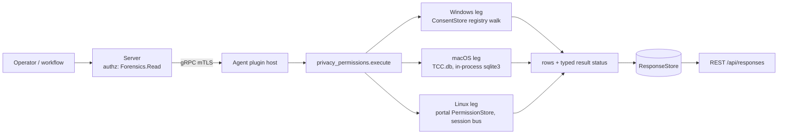

# privacy_permissions

<!-- BEGIN GENERATED: plugin-doc-gen header -->
<!-- END GENERATED -->

## How it works

One action, `permissions` (`privacy_permissions_plugin.cpp`), reports per-app sensitive-permission grants for four categories -- camera, microphone, location, full-disk-access -- as rows `permissions|<os>|<app_id>|<category>|<state>|<raw>|<last_used_start>|<last_used_stop>`. The action takes no parameters. Every leg is rung 1: no PowerShell, no subprocess on Windows or macOS, and Linux's session-bus D-Bus call is the only process boundary crossed anywhere in the plugin.

- **macOS** reads `TCC.db` read-only, in-process (`sqlite3_open_v2`, never a `sqlite3` CLI shellout), querying the `access` table for the four mapped TCC service identifiers.
- **Windows** walks the `HKCU`/`HKLM` `...\CapabilityAccessManager\ConsentStore` registry subtree for the four mapped `CapabilityName` keys, enumerating each one's own `Value` plus its `NonPackaged` and packaged-app children; `HKLM` wins over `HKCU` for the same app+category when both are present (an MDM/GPO-locked policy).
- **Linux** calls `org.freedesktop.impl.portal.PermissionStore.Lookup` over the **session** D-Bus (`sd_bus_open_user`) -- no daemon or no session is the honest, expected outcome on most non-sandboxed desktops, not a failure.

## OS capability

<!-- BEGIN GENERATED: plugin-doc-gen capability -->
<!-- END GENERATED -->

## Privileges and prerequisites

| OS | Runs as | Extra grant needed | Measured | If the read is refused |
|---|---|---|---|---|
| Windows | agent service account (LocalSystem today, #1442) | None documented for this plugin (`docs/agent-privilege-model.md`) | Not yet measured on the-rig | `ERROR_ACCESS_DENIED` reports the app-level row `unreadable` and the action reports `PERMISSION_DENIED`/`PARTIAL`; any other Win32 error reports `unreadable` with `<key>:win32_<n>` |
| macOS | agent daemon, root today (LaunchDaemon carries no `UserName` key -- `docs/agent-privilege-model.md` TL;DR) | TCC.db is SIP-protected regardless of privilege level; a separate Full Disk Access (FDA) grant is needed | 2026-09-22, this Mac (`braga`), via the unit test binary's own ambient identity (a Terminal/VSCode-launched process, NOT the production agent identity) -- proves the read mechanism works end to end when FDA is present; whether the production LaunchDaemon identity holds FDA is a still-open acceptance item | `SQLITE_CANTOPEN`/`SQLITE_AUTH`/`SQLITE_PERM` on open reports the whole read `denied`, `PERMISSION_DENIED`/`PARTIAL` |
| Linux | agent daemon, default | None -- the portal call is an ordinary session-bus D-Bus method call | Not yet measured against a real running `xdg-desktop-portal` | An `AccessDenied`-shaped D-Bus error reports the category `denied`, `PERMISSION_DENIED`/`PARTIAL`; a shape mismatch reports `unreadable` with `<category>:shape` |

Binaries/subprocesses: none -- every leg is an in-process read (SQLite, the Windows registry API, sd-bus). Network: the Linux leg's D-Bus call is local-machine IPC only, never a network socket.

## Data contract

### Inputs

<!-- BEGIN GENERATED: plugin-doc-gen inputs -->
<!-- END GENERATED -->

### Outputs

One row per app per category, or one whole-read-failure row (`app_id`/`category` both `-`) when the mechanism itself couldn't be reached at all (TCC.db wouldn't open, ConsentStore's root key is missing for a reason other than "not there", the portal bus call failed outright). A category absent from a host's mechanism entirely (e.g. `full_disk_access` on Linux, which has no single-boolean portal equivalent) is `unsupported`, never silently omitted or misreported as `absent`.

<!-- BEGIN GENERATED: plugin-doc-gen outputs -->
<!-- END GENERATED -->

### Result status

| Status | Completeness | Provenance | When |
|---|---|---|---|
| `OK` | `FULL` | — | No read was refused and no failure token exists: every category was either read or `absent`/`unsupported`. A host with no grants recorded for any mapped category still reports `OK`. |
| `CONSTRAINED` | `PARTIAL` | `<category>:query_step_failed`, `<category>:shape`, `<app_id>:<category>:value_unreadable`, `consent_store:win32_<n>`, `tcc_db:prepare_failed:<msg>`, `internal_error` | A read failed for a reason other than a refusal; the reason names the mechanism-specific cause. |
| `PERMISSION_DENIED` | `PARTIAL` | `tcc_db:open_failed:<msg>`, `consent_store:access_denied`, `<category>:access_denied` | The read was refused outright -- SIP/TCC denying `TCC.db`, `ERROR_ACCESS_DENIED` on the registry, or an `AccessDenied`-shaped D-Bus error. |

### Where the data goes

- **Instruction result.** Rows go to the standard `ResponseStore`, retained and served the same as every other read-only instruction, over `GET /api/responses` and the equivalent MCP result-poll tools.
- **Not consumed by** daily-sync, TAR, DEX, or metrics.
- **Sensitivity.** Names, per app on a specific machine, whether that app currently holds live audio/video/location/filesystem-access capability -- gated behind `Forensics:Read` + `AdminOrApproval` (Administrator-only) for exactly this reason, same posture as `execution_artifacts`.
- **Siblings:** `execution_artifacts` (the other Forensics-class Windows-evidence plugin), `platform_security` (adjacent OS-security-posture reporting, `Security:Read` not `Forensics:Read`).

## Sample output

<!-- BEGIN GENERATED: plugin-doc-gen samples -->
<!-- END GENERATED -->

## Caveats and known gaps

1. **No documented business driver.** The roadmap's own research found zero documented business/compliance driver anywhere in the four planning docs for this row -- the weakest-justified plugin in Wave 8. Built anyway as fleet-visibility completeness: every competitor EDR/MDM already reports per-app sensitive-permission grants.
2. **All three legs are genuinely first-of-kind in this codebase.** Zero prior `TCC.db`, `ConsentStore`/`CapabilityAccessManager`, or `sd_bus_open_user` usage anywhere in this tree before this plugin -- lower confidence than a typical plugin; several real unknowns (the exact `TCC.db` `access` schema and `auth_value` mapping on a given macOS version, the real Windows `Value` literal vocabulary and `NonPackaged` path-escaping scheme, the exact xdg-desktop-portal `Lookup` reply shape and table/id vocabulary) are named in each leg's own file banner and are pending a real-hardware probe, not assumed.
3. **The macOS TCC.db read has only been proven to work under an ambient, already-FDA-granted identity, not the production agent identity.** The 2026-09-22 real probe on this Mac successfully opened and queried `TCC.db` through the unit test binary's own Terminal/VSCode-launched process, proving the read mechanism is correct end to end -- but that process is not the production LaunchDaemon, which runs as root without a separately-granted Full Disk Access entitlement today. Whether the production identity can open `TCC.db` at all remains an open acceptance item.
4. **No meaningful Linux full-disk-access equivalent is known to exist via the portal mechanism.** Flatpak's `filesystem` portal permission is a per-directory grant, not a single boolean, so `full_disk_access` is expected to report `unsupported` on Linux permanently pending further investigation.
5. **Read-only by design.** The plugin only ever reads permission grants and never requests, revokes, or modifies one on any platform.

## Source and tests

<!-- BEGIN GENERATED: plugin-doc-gen source -->
<!-- END GENERATED -->
