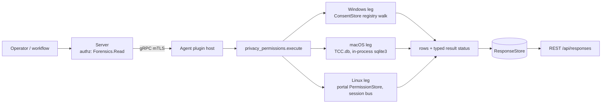

# privacy_permissions

<!-- BEGIN GENERATED: plugin-doc-gen header -->
| | |
|---|---|
| **What it does** | Per-app sensitive-permission grants -- camera, microphone, location, full-disk-access equivalents (read-only) |
| **Version** | 1.0.0 |
| **Kind** | Collector · read-only · gathered (crossplatform.privacy_permissions.permissions) |
| **Platforms** | Windows ✅ · macOS 🟡 constrained · Linux 🟡 constrained |
| **Actions** | `permissions` (definition `crossplatform.privacy_permissions.permissions`) |
| **Security** | securable `Forensics` · operation Read · risk High · dispatch ReadOnly · approval gate AdminOrApproval |
| **Roles** | execute: admin · author: content-author |
<!-- END GENERATED -->

## How it works

One action, `permissions` (`privacy_permissions_plugin.cpp`), reports per-app sensitive-permission grants for four categories -- camera, microphone, location, full-disk-access -- as rows `permissions|<os>|<app_id>|<category>|<state>|<raw>|<last_used_start>|<last_used_stop>` (the leading field is the definition's `row_kind` column). The action takes no parameters. Every leg is rung 1: no PowerShell, no subprocess on Windows or macOS, and Linux's session-bus D-Bus call is the only process boundary crossed anywhere in the plugin.

- **macOS** reads `TCC.db` read-only, in-process (`sqlite3_open_v2`, never a `sqlite3` CLI shellout), querying the `access` table for the three TCC-governed categories (camera, microphone, full-disk-access) in two kinds of source: the **system** `/Library/Application Support/com.apple.TCC/TCC.db` (rows unqualified) and **each user's own** `~/Library/Application Support/com.apple.TCC/TCC.db` for every real home directly under `/Users` (a directory, not a symlink, owned by uid 500 or above -- the `autoruns` rule), rows qualified `<user>/<app_id>`. Camera and microphone grants live only in the per-user databases. `location` is administered by `locationd` outside TCC entirely (ADR-3003) and ships as its own explicit `unsupported` row on every collection.
- **Windows** enumerates real profiles from `HKLM\...\ProfileList` (the agent runs as LocalSystem, so its own `HKEY_CURRENT_USER` is not any user's) and walks each profile's `...\CapabilityAccessManager\ConsentStore` through the shared live-hive-first ladder (`with_user_hive`: the loaded `HKU\<SID>`, else an offline `RegLoadKeyW` mount of the profile's `NTUSER.DAT` under SeBackup/SeRestore), plus the machine-wide `HKLM` mirror, for the four mapped `CapabilityName` keys. Each capability has three levels, each reported as its own row: the capability's own `Value` (`app_id` `-`), the `NonPackaged` key's own `Value` -- the "let desktop apps access" toggle (`app_id` `NonPackaged`) -- and each packaged or `NonPackaged` app key. A `NonPackaged` app key carries no `Value`, only its last-used times, so it reads `absent`: no per-app decision, governed by the `NonPackaged` toggle row (`NonPackaged\Executables`, a container of per-program prompt flags, is skipped). Precedence follows Microsoft's documented Settings model, confirmed on the-rig, in which the machine-wide `HKLM` `Value` is the device toggle (a non-MDM host carries `Allow` on every capability): a **successfully read HKLM `Deny`** overrides the profile's entry at the same level (most restrictive wins), an HKLM `Allow` defers to each user's own value, and an absent, unreadable or refused HKLM value never displaces anything; a profile's own failed read is never hidden behind an HKLM value. Rows below a toggle are reported as stored; the plugin does not compute an effective state. `app_id` is qualified with the owning profile's name. An applied HKLM `Deny` is emitted once per reachable profile, under that profile's qualifier -- a consumer counting rows per app should key on `(app_id, category)`; every other HKLM entry and failure -- a definitive capability-level `absent` included -- is emitted once, unqualified. A capability with no `NonPackaged` key reads its `NonPackaged` toggle row `absent`; two registry keys that decode to the same app id both stay, beside a `duplicate_app_id` row. Profile discovery never passes a partial `ProfileList` walk off as complete: a refused, failed or capped walk is a whole-source row, and the profiles it did enumerate are still read. Any refused read -- `ProfileList` discovery, a profile hive, a ConsentStore root, a capability or app key, a `Value` -- is a `denied` row and escalates the action to `PERMISSION_DENIED`. The ConsentStore is writable by its owning user, so one run-wide retention budget (65,536 grants, 16 MiB of app-id/value text) bounds the whole walk and a `Value` over 64 bytes is `value_oversized` (the real literals are `Allow`/`Deny`/`Prompt`); crossing the budget stops the walk, keeps every row already read and adds `collection:budget_exceeded` (`CONSTRAINED`).
- **Linux** calls `org.freedesktop.impl.portal.PermissionStore.Lookup` over the agent process's **own** session D-Bus (`sd_bus_open_user`) -- it never reaches another user's session. Each table is decoded on its own terms: a `devices` record (`camera`, `microphone`) is one of `yes`/`no`/`ask`, a `location` record is `[accuracy, timestamp]` where `NONE` is a refusal and `COUNTRY`/`CITY`/`NEIGHBORHOOD`/`STREET`/`EXACT` a grant; any other value is `prompt_undetermined` with the list kept in `raw`. No session bus or no portal daemon is the honest, expected outcome for a system-service agent (`unsupported`, `UNAVAILABLE`), not a failure -- and says nothing about interactive users' grants. The three lookups share one 5-second total deadline; a lookup that runs out of it reads `<category>:timeout`.



## OS capability

<!-- BEGIN GENERATED: plugin-doc-gen capability -->
| Action | Windows | macOS | Linux |
|---|---|---|---|
| `permissions` | ✅ supported · rung 1 · HKLM ProfileList enumeration, then each real profile's SOFTWARE\\Microsoft\\Windows\\CurrentVersion\\CapabilityAccessManager\\ConsentStore via its loaded HKU\\<SID> hive or an offline NTUSER.DAT mount (RegLoadKeyW, SeBackup/SeRestore), plus the same HKLM ConsentStore path | 🟡 constrained · rung 1 · TCC.db read-only, in-process sqlite3: the system /Library/Application Support/com.apple.TCC/TCC.db plus each /Users/<home> (uid >= 500) per-user Library/Application Support/com.apple.TCC/TCC.db | 🟡 constrained · rung 1 · xdg-desktop-portal org.freedesktop.impl.portal.PermissionStore.Lookup over the agent process's own session bus (sd_bus_open_user) |

**Declared limits per leg** (descriptor fallback text, verbatim):

- **`permissions` / Windows** — measured on the-rig (Windows 11, LocalSystem) 2026-09-23; LocalSystem's own HKCU is not read; only a successfully read HKLM Deny (the device toggle) overrides a profile
- **`permissions` / macOS** — every TCC.db is TCC-protected: without Full Disk Access each read is denied; camera and microphone grants live only in the per-user dbs; location is unsupported (locationd, outside TCC)
- **`permissions` / Linux** — never another user's session: a system-service agent normally has no session bus and reports unavailable, which says nothing about interactive users' grants; full_disk_access is unsupported (no portal equivalent)
<!-- END GENERATED -->

## Privileges and prerequisites

| OS | Runs as | Extra grant needed | Measured | If the read is refused |
|---|---|---|---|---|
| Windows | agent service account (LocalSystem today, #1442) -- `HKEY_CURRENT_USER` would resolve to LocalSystem's own profile, not any interactive user's, so this leg reads each real profile's ConsentStore via the shared live-hive-first/offline-NTUSER.DAT-fallback ladder (`with_user_hive`, the `license_scan`/`registry` precedent), never the process's own HKCU | SeBackupPrivilege + SeRestorePrivilege for the offline-mount fallback -- already held by the agent account (no new grant) | 2026-09-23, the-rig (Windows 11 Pro 10.0.26200), LocalSystem via a scheduled task: the one interactive profile's live `HKU\<SID>` hive and HKLM read, packaged `Allow`/`Deny`/`Prompt` decoded, `NonPackaged` paths unescaped, last-used times decoded. Not measured: the offline `NTUSER.DAT` arm, an HKLM `Deny`, a refused read | Any refused read is a `denied` row whose `raw` names it -- a profile (`<profile>:access_denied`), the HKLM root (`hklm:access_denied`), a capability/app key or container, or a `Value` (`<profile>\<app_id>:<category>:<cause>`) -- and the action reports `PERMISSION_DENIED`/`PARTIAL`; any other Win32 error is an `unreadable` row (`...:win32_<n>`), `CONSTRAINED`/`PARTIAL` |
| macOS | agent daemon, root today (LaunchDaemon carries no `UserName` key -- `docs/agent-privilege-model.md` TL;DR) | Every `TCC.db` -- the system one and each per-user one -- is TCC-protected regardless of privilege level; a separate Full Disk Access (FDA) grant is needed | 2026-09-23, this Mac (`braga`), euid 501 with ambient FDA (NOT the production agent identity): the system db and the per-user db both read (per-user microphone grants visible). The same run with both TCC directories read-denied (a `sandbox-exec` deny profile, standing in for a non-FDA identity) reported both sources `denied`, `PERMISSION_DENIED`/`PARTIAL`. Not measured: the production root LaunchDaemon's own outcome, and the verbatim `sqlite3_errmsg` a real TCC refusal produces | A refused `lstat` (`EPERM`/`EACCES`), `SQLITE_AUTH`/`SQLITE_PERM`, or `SQLITE_CANTOPEN` whose underlying syscall failed `EPERM`/`EACCES` on a file that is there, reports that source's whole-source row `denied` (`tcc_db:access_denied`, `<user>:tcc_db:access_denied`, `...:open_failed:<msg>`), `PERMISSION_DENIED`/`PARTIAL`. An agent without FDA sees this for every source |
| Linux | agent daemon, default | None -- the portal call is an ordinary session-bus D-Bus method call | 2026-09-23, Debian 13 container, `xdg-desktop-portal` 1.20.3's permission store seeded with test records: the `devices` and `location` Lookups decoded as above. Not measured on a desktop user's real session | A refused session-bus socket (`session_bus:access_denied`) or an `AccessDenied`-shaped D-Bus error (`<category>:access_denied`, on that category's own row) reports `denied`, `PERMISSION_DENIED`/`PARTIAL`; a malformed reply reports `unreadable` with `<category>:shape` |

Binaries/subprocesses: none -- every leg is an in-process read (SQLite, the Windows registry API, sd-bus). Network: the Linux leg's D-Bus call is local-machine IPC only, never a network socket.

## Data contract

### Inputs

<!-- BEGIN GENERATED: plugin-doc-gen inputs -->
The action takes no parameters.
<!-- END GENERATED -->

### Outputs

One row per app per category, led by `row_kind` `permissions` (`constrained` only on the one internal-error row, `constrained|<os>|-|-|unreadable|internal_error|-|-`, which keeps the same field count). Every category of every source is a row -- its decoded grants, `absent` when the source cleanly holds none, `unsupported` when no mechanism reaches it (macOS `location`, Linux `full_disk_access`), or a failure row -- or is covered by a whole-source row (`category` `-`) for a source that could not be read at all, or that holds no file (a macOS user with no per-user `TCC.db`, `absent`). `denied` covers two facts, kept as one state: a decoded refusal, whose `raw` is the native value (`Deny`, `0`, `no`, `NONE,<timestamp>`), and a refused read, whose `raw` is a `<subject>:<cause>` failure token (also in the result provenance) and whose `category` is `-` when the whole source was refused; `unreadable` always carries a token. `app_id` `-` means no specific app (on Windows, the capability's own toggle; `NonPackaged` is the desktop-apps toggle); a row from a per-user source is qualified `<user>/<app_id>` (each Windows profile, each macOS per-user `TCC.db`); an unqualified `app_id` comes from a machine-wide source (the macOS system `TCC.db`, the Windows HKLM mirror) or, on Linux, from the agent's own session's portal store -- that one session's grants, never machine-wide. On Windows, `last_used_start`/`last_used_stop` read `unreadable` (plus a `...:last_used_start_<cause>` token) when the value exists but is not an 8-byte `REG_QWORD` or could not be read.

<!-- BEGIN GENERATED: plugin-doc-gen outputs -->
**`crossplatform.privacy_permissions.permissions` — `row_kind|os|app_id|category|state|raw|last_used_start|last_used_stop`**

| Field | Type | Values | Available | Example | Description |
|---|---|---|---|---|---|
| `row_kind` | string | `permissions` `constrained` | Windows, Linux, macOS | `permissions` | Row family: `permissions` (every data row) or `constrained` (the one row the plugin writes when it fails internally: `raw` is `internal_error`, the result is CONSTRAINED). |
| `os` | string | `macos` `windows` `linux` | Windows, Linux, macOS | `macos` | The reporting OS. |
| `app_id` | string | - | Windows, Linux, macOS | `com.example.App` | Per-app identifier: a TCC client id (bundle id or path, macOS), an executable path or Package Family Name (Windows), a portal-reported app id (Linux). "-" means no specific app: a Windows capability-level toggle, a per-category `absent`/ `unsupported` row, or a failure row. On Windows `NonPackaged` is the capability's "let desktop apps access" toggle; a desktop app's own row reads `absent` (it stores no decision) and is governed by that toggle. A row read from a PER-USER source is qualified with that user's name -- `<user>/<app_id>` or `<user>/-` on the wire (the row sanitizer writes the separator `\` as `/`, as it does inside every path): each Windows profile's ConsentStore and each macOS per-user TCC.db. An unqualified app_id comes from a machine-wide source (the macOS system TCC.db, the Windows HKLM ConsentStore mirror) or, on Linux, from the portal store of the agent's OWN session -- that one session's grants, never machine-wide. |
| `category` | string | `camera` `microphone` `location` `full_disk_access` `-` | Windows, Linux, macOS | `camera` | The fixed cross-OS permission category. "-" only on a whole-source row -- one row standing for every category of a source that could not be read at all (a TCC.db, a Windows profile hive, ConsentStore root or ProfileList discovery, the session bus/portal, or what a Windows run left unwalked once its retention budget was spent), or that holds no file (a macOS user with no per-user TCC.db). |
| `state` | string | `allowed` `denied` `prompt_undetermined` `absent` `unreadable` `unsupported` | Windows, Linux, macOS | `allowed` | allowed/denied: a real, decoded grant. `denied` also covers a READ that was refused -- one state for both, told apart by `raw`: a decoded refusal carries the native value (Deny, 0, no, NONE,<timestamp>), a refused read a `<subject>:<cause>` token (and category "-" when the whole source was refused). prompt_undetermined: the mechanism reported a value this plugin doesn't map to allowed/denied (never guessed). absent: no record for this app+category (or this source) -- not a failure. unreadable: the read itself failed; `raw` names why. unsupported: no mechanism reaches this category on this OS/host (macOS location; Linux full_disk_access; Linux with no session bus or portal daemon). |
| `raw` | string | - | Windows, Linux, macOS | `2` | The mechanism-native value behind `state` (a TCC auth_value integer, a ConsentStore Value string, a joined portal permission list); on a failure row (`denied` from a refused read, or `unreadable`) the failure token that also appears in the result provenance; "-" when nothing meaningful beyond the state itself. |
| `last_used_start` | string | - | Windows | `1700000000000` | Windows ConsentStore LastUsedTimeStart, epoch milliseconds; "-" when never set or on any other OS; `unreadable` when the value exists but is not an 8-byte REG_QWORD or could not be read (a `...:last_used_start_<cause>` token names it). |
| `last_used_stop` | string | - | Windows | `1700000100000` | Windows ConsentStore LastUsedTimeStop, epoch milliseconds; "-" when never set or on any other OS; `unreadable` when the value exists but is not an 8-byte REG_QWORD or could not be read (a `...:last_used_stop_<cause>` token names it). |
<!-- END GENERATED -->

### Result status

| Status | Completeness | Provenance | When |
|---|---|---|---|
| `OK` | `FULL` | — | No read was refused and no failure token exists: every category was read or is `absent`/`unsupported`. A host with no grants recorded for any mapped category still reports `OK`. |
| `UNAVAILABLE` | `FULL` | — | Linux only: the agent's own account has no session bus, or no portal backend answered any lookup (`ServiceUnknown` on every table). One whole-source row, state `unsupported` (`app_id` and `category` both `-`). Says nothing about interactive users' grants. |
| `CONSTRAINED` | `PARTIAL` | see below | A read failed for a reason other than a refusal; each failed read is its own `unreadable` row naming the token. |
| `PERMISSION_DENIED` | `PARTIAL` | see below | At least one read was refused -- a TCC-protected `TCC.db` without Full Disk Access, `ERROR_ACCESS_DENIED` anywhere in a Windows walk, a refused session-bus socket or a portal `AccessDenied`. Wins over `CONSTRAINED` when both occur. |

Every token is `<subject>:<cause>`; on a failure row the same token is the row's `raw`. The complete set this plugin emits, by leg:

- **macOS, whole source** -- `tcc_db:<cause>` (system db) or `<user>:tcc_db:<cause>` (per-user db). `denied`: `access_denied`, `open_failed:<sqlite msg>`, `prepare_failed:<sqlite msg>` (SQLITE_AUTH/PERM, or SQLITE_CANTOPEN with an `EPERM`/`EACCES` syscall, on a file that is there). `unreadable`: `missing` (system db only), `not_regular_file`, `lstat_errno_<n>`, `open_failed:<sqlite msg>`, `prepare_failed:<sqlite msg>` (any other SQLite code or errno, including a symlink anywhere in the path, SQLITE_CANTOPEN_SYMLINK), `query_only_failed:<sqlite msg>` (the read-only pragma failed; the source is not read).
- **macOS, per category** (`unreadable`) -- `<source>:<category>:query_bind_failed`, `<source>:<category>:query_step_failed`, `<source>:<category>:auth_value_unreadable`, where `<source>` is `tcc_db` or `<user>:tcc_db`.
- **macOS, home enumeration** -- `users:open_errno_<n>` and `<user>:home_stat_errno_<n>` (`denied` for EPERM/EACCES, else `unreadable`); `users:fdopendir_errno_<n>`, `users:truncated`, `users:readdir_error` (`unreadable`).
- **Windows, profile discovery** (whole-source, `category` `-`) -- `profiles:profile_list_access_denied`, `profiles:enum_5`, `profiles:profile_key_access_denied`, `profiles:profile_image_path_access_denied` (`denied`); `profiles:profile_list_unreadable`, `profiles:truncated`, `profiles:enum_<n>` (the walk ended on an error, not the end of the list), `profiles:profile_key_win32_<n>`, `profiles:profile_image_path_win32_<n>` (`unreadable`).
- **Windows, profiles** -- `<profile>:access_denied` (`denied`); `<profile>:invalid_sid` (the SID is not an `S-1-...` string, so its hive is never opened), `<profile>:privilege_missing`, `<profile>:hive_not_found`, `<profile>:profile_path_unreadable`, `<profile>:hive_mount_failed`, `<profile>:win32_<n>` (`unreadable`); `<profile>:hive_unload_failed` (token only -- the read completed, the offline mount could not be unloaded).
- **Windows, HKLM root** -- `hklm:access_denied` (`denied`), `hklm:win32_<n>` (`unreadable`).
- **Windows, per row** -- `<profile>\<app_id>:<category>:<cause>` (`hklm\<app_id>:...` on HKLM's own rows). `denied`: `value_access_denied`, `capability:access_denied`, `packaged_app:access_denied`, `nonpackaged_app:access_denied`, `nonpackaged_container:access_denied`, `packaged_enum_5`, `nonpackaged_enum_5`. `unreadable`: `value_oversized`, `value_empty`, `value_type_<n>`, `value_win32_<n>`, `capability:win32_<n>`, `packaged_app:win32_<n>`, `nonpackaged_app:win32_<n>`, `nonpackaged_container:win32_<n>`, `packaged_enum_<n>`, `packaged_enum_truncated`, `nonpackaged_enum_<n>`, `nonpackaged_enum_truncated`, `duplicate_app_id` (two keys decoded to this app id; both rows are kept).
- **Windows, whole collection** -- `collection:budget_exceeded` (`unreadable`; the run-wide retention budget stopped the walk).
- **Windows, last-used fields** -- `<subject>:last_used_start_<cause>`, `<subject>:last_used_stop_<cause>`, `<cause>` one of `access_denied` (promotes `PERMISSION_DENIED`), `win32_<n>`, `type_<n>`, `size_<n>`; the row keeps its decoded state and the field reads `unreadable`.
- **Linux** -- `session_bus:access_denied` (`denied`), `session_bus:open_errno_<n>` (`unreadable`); `<category>:access_denied` (`denied`); `<category>:lookup_failed`, `<category>:timeout` (the shared deadline ran out), `<category>:shape`, `<category>:entry_shape`, `<category>:service_unknown`, `<app_id>:<category>:empty_permissions` (the portal returned an app with no permission value -- no decision, never `denied`), `portal:not_built` (`unreadable`).
- **All** -- `internal_error` (the `constrained` row).

### Where the data goes

- **Instruction result.** Rows go to the standard `ResponseStore`, retained and served the same as every other read-only instruction, over `GET /api/responses` and the equivalent MCP result-poll tools.
- **Not consumed by** daily-sync, TAR, DEX, or metrics.
- **Sensitivity.** Names, per app on a specific machine, whether that app currently holds live audio/video/location/filesystem-access capability -- gated behind `Forensics:Read` + `AdminOrApproval` (Administrator-only) for exactly this reason, same posture as `execution_artifacts`.
- **Siblings:** `execution_artifacts` (the other Forensics-class Windows-evidence plugin).

## Sample output

<!-- BEGIN GENERATED: plugin-doc-gen samples -->
**Windows** — captured: windows Windows 10.0.26200 x86_64 · bare-metal · 2026-09-24 · LocalSystem (elevated) · leg-hash 3e5b5b08ee49

```
== action=permissions
permissions|windows|jsmith/-|camera|allowed|Allow|-|-
permissions|windows|jsmith/-|full_disk_access|allowed|Allow|-|-
permissions|windows|jsmith/-|location|allowed|Allow|-|-
permissions|windows|jsmith/-|microphone|allowed|Allow|-|-
permissions|windows|jsmith/5319275A.WhatsAppDesktop_cv1g1gvanyjgm|camera|denied|Deny|-|-
permissions|windows|jsmith/5319275A.WhatsAppDesktop_cv1g1gvanyjgm|location|allowed|Allow|-|-
permissions|windows|jsmith/C:/PROGRA~2/Citrix/ICACLI~1/HdxRtcEngine.exe|camera|absent|-|1699446591317|1699448586363
permissions|windows|jsmith/C:/PROGRA~2/Citrix/ICACLI~1/HdxRtcEngine.exe|microphone|absent|-|1699446611274|1699448585475
permissions|windows|jsmith/C:/PROGRA~2/Citrix/ICACLI~1/wfica32.exe|microphone|absent|-|1727429693627|1727429699770
permissions|windows|jsmith/C:/Program Files (x86)/Steam/bin/cef/cef.win7x64/steamwebhelper.exe|microphone|absent|-|1672318772321|1672318774367
permissions|windows|jsmith/C:/Program Files (x86)/Steam/steam.exe|microphone|absent|-|1737300284911|1737312589346
permissions|windows|jsmith/C:/Program Files (x86)/ZoomCitrixHDXMediaPlugin/Zoom.exe|camera|absent|-|1732527131754|1732528329384
… 12 of 121 rows shown
[result_status] OK / FULL
```

**macOS** — captured: macos macOS 26.6.2 arm64 · bare-metal · 2026-09-23 · euid 501 (ambient FDA, NOT the production agent identity -- see leg banner) · leg-hash 3e5b5b08ee49

```
== action=permissions
permissions|macos|-|camera|absent|-|-|-
permissions|macos|-|microphone|absent|-|-|-
permissions|macos|/Library/PrivilegedHelperTools/com.microsoft.autoupdate.helper|full_disk_access|denied|0|-|-
permissions|macos|/usr/libexec/sshd-keygen-wrapper|full_disk_access|allowed|2|-|-
permissions|macos|com.microsoft.VSCode|full_disk_access|allowed|2|-|-
permissions|macos|com.nordvpn.macos|full_disk_access|denied|0|-|-
permissions|macos|com.spotify.client|full_disk_access|denied|0|-|-
permissions|macos|net.whatsapp.WhatsApp|full_disk_access|denied|0|-|-
permissions|macos|jsmith/-|camera|absent|-|-|-
permissions|macos|jsmith/com.microsoft.teams2|microphone|allowed|2|-|-
permissions|macos|jsmith/org.whispersystems.signal-desktop|microphone|allowed|2|-|-
permissions|macos|jsmith/-|full_disk_access|absent|-|-|-
… 12 of 13 rows shown
[result_status] OK / FULL
```

**Linux** — captured: linux Debian GNU/Linux 13 (trixie) aarch64 · container · 2026-09-23 · euid 0 · leg-hash 3e5b5b08ee49

```
== action=permissions
permissions|linux|org.example.CamApp|camera|allowed|yes|-|-
permissions|linux|org.example.MicApp|microphone|denied|no|-|-
permissions|linux|org.example.MapApp|location|allowed|EXACT,0|-|-
permissions|linux|org.example.NoLocApp|location|denied|NONE,0|-|-
permissions|linux|-|full_disk_access|unsupported|-|-|-
[result_status] OK / FULL
```
<!-- END GENERATED -->

## Caveats and known gaps

1. **No documented business driver.** The roadmap's research found no business or compliance driver for this row; it ships as fleet-visibility completeness, since competitor EDR/MDM products already report these grants.
2. **macOS is unmeasured under the production identity.** Every `TCC.db` is TCC-protected, so the root LaunchDaemon without Full Disk Access is expected to read every source `denied`; neither that identity's real outcome nor the verbatim `sqlite3_errmsg` of a real TCC refusal has been measured.
3. **macOS per-user coverage is `/Users` only and best-effort.** A relocated or network home is not read, and a symlink anywhere in a `TCC.db` path is refused (`unreadable`), but by a check-then-open a user who controls their home can race to make their own rows come from a different file; the read itself stays read-only.
4. **Windows is measured on one host only.** The-rig (Windows 11, LocalSystem) confirmed the three ConsentStore levels and HKLM as the device toggle; the offline `NTUSER.DAT` arm, an HKLM `Deny` and a refused read are not yet measured, and an unrecognised `Value` literal reads `prompt_undetermined`.
5. **Linux reads only the agent's own session.** Each user's portal store lives in that user's session, so a system-service agent reports `UNAVAILABLE`, which says nothing about interactive users; `full_disk_access` has no portal equivalent and reports `unsupported`.

## Source and tests

<!-- BEGIN GENERATED: plugin-doc-gen source -->
- Plugin: `agents/plugins/privacy_permissions/src/privacy_permissions_legs.hpp` · `agents/plugins/privacy_permissions/src/privacy_permissions_linux.cpp` · `agents/plugins/privacy_permissions/src/privacy_permissions_linux_parsers.hpp` · `agents/plugins/privacy_permissions/src/privacy_permissions_macos.cpp` · `agents/plugins/privacy_permissions/src/privacy_permissions_macos_parsers.hpp` · `agents/plugins/privacy_permissions/src/privacy_permissions_parsers.hpp` · `agents/plugins/privacy_permissions/src/privacy_permissions_plugin.cpp` · `agents/plugins/privacy_permissions/src/privacy_permissions_win.cpp` · `agents/plugins/privacy_permissions/src/privacy_permissions_win_parsers.hpp`
- Definitions: `content/definitions/privacy_permissions.yaml`
- Capability rows: `server/core/src/capability_decls/plugin_action_catalogue_privacy_permissions.hpp`
- Tests: `tests/unit/test_privacy_permissions_local_dispatcher.cpp` · `tests/unit/test_privacy_permissions_macos_internals.cpp` · `tests/unit/test_privacy_permissions_parsers.cpp`
- Privilege row: `docs/agent-privilege-model.md`
- Changelog: `changelog.d/wave8-pr85-privacy_permissions.added.md`
<!-- END GENERATED -->
