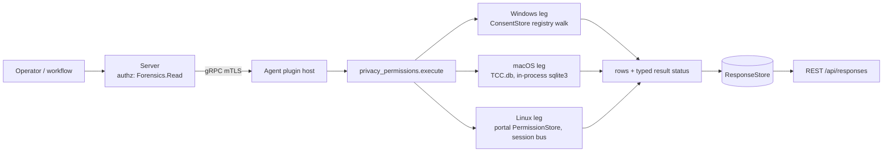

# privacy_permissions

<!-- BEGIN GENERATED: plugin-doc-gen header -->
| | |
|---|---|
| **What it does** | Per-app sensitive-permission grants -- camera, microphone, location, full-disk-access equivalents (read-only) |
| **Version** | 1.0.0 |
| **Kind** | Collector · read-only · gathered (crossplatform.privacy_permissions.permissions) |
| **Platforms** | Windows ✅ · macOS 🟡 constrained · Linux 🟡 constrained |
| **Actions** | `permissions` (definition `crossplatform.privacy_permissions.permissions`) |
| **Security** | securable `Forensics` · operation Read · risk High · dispatch ReadOnly · approval gate AdminOrApproval |
| **Roles** | execute: admin · author: content-author |
<!-- END GENERATED -->

## How it works

One action, `permissions` (`privacy_permissions_plugin.cpp`), reports per-app sensitive-permission grants for four categories -- camera, microphone, location, full-disk-access -- as rows `permissions|<os>|<app_id>|<category>|<state>|<raw>|<last_used_start>|<last_used_stop>`. The action takes no parameters. Every leg is rung 1: no PowerShell, no subprocess on Windows or macOS, and Linux's session-bus D-Bus call is the only process boundary crossed anywhere in the plugin.

- **macOS** reads `TCC.db` read-only, in-process (`sqlite3_open_v2`, never a `sqlite3` CLI shellout), querying the `access` table for the three TCC-governed categories (camera, microphone, full-disk-access); `location` is administered by `locationd` outside TCC entirely (ADR-3003) and ships as its own explicit `unsupported` row instead of a query.
- **Windows** walks the `...\CapabilityAccessManager\ConsentStore` registry subtree, once per real interactive profile (the agent runs as LocalSystem, so its own `HKEY_CURRENT_USER` is not any user's -- each profile's hive is reached via the shared live-hive-first/offline-NTUSER.DAT-fallback ladder, `with_user_hive`) plus once for the machine-wide `HKLM` mirror, for the four mapped `CapabilityName` keys, enumerating each one's own `Value` plus its `NonPackaged` and packaged-app children; `HKLM` wins over a profile's own entry for the same app+category when both are present (an MDM/GPO-locked policy), and `app_id` is qualified with the owning profile's name so the same app across two profiles never collides. An HKLM-only (no per-profile override) grant is therefore emitted once per reachable profile, each copy under that profile's own qualifier -- a consumer counting rows per app should key on `(app_id, category)`, not assume one row per machine-wide fact. A denied `Value` read (root, or the specific value under a root that DID open) escalates the whole action's status to `PERMISSION_DENIED`; a denied capability/app-key open or enumeration below an opened root stays `CONSTRAINED` (the rest of that root's tree still read) -- a deliberate severity split, not an inconsistency (see the result-status table below).
- **Linux** calls `org.freedesktop.impl.portal.PermissionStore.Lookup` over the **session** D-Bus (`sd_bus_open_user`) -- no daemon or no session is the honest, expected outcome on most non-sandboxed desktops, not a failure.



## OS capability

<!-- BEGIN GENERATED: plugin-doc-gen capability -->
| Action | Windows | macOS | Linux |
|---|---|---|---|
| `permissions` | ✅ supported · rung 1 · per-profile (with_user_hive, LocalSystem's own HKCU is not a real user's) + HKLM SOFTWARE\\Microsoft\\Windows\\CurrentVersion\\CapabilityAccessManager\\ConsentStore registry walk | 🟡 constrained · rung 1 · TCC.db read-only, in-process sqlite3; SIP-protected, an unentitled agent is expected to read denied | 🟡 constrained · rung 1 · xdg-desktop-portal org.freedesktop.impl.portal.PermissionStore.Lookup over the session bus; unavailable (no daemon/no session) on most non-sandboxed desktops |
<!-- END GENERATED -->

## Privileges and prerequisites

| OS | Runs as | Extra grant needed | Measured | If the read is refused |
|---|---|---|---|---|
| Windows | agent service account (LocalSystem today, #1442) -- HKEY_CURRENT_USER would resolve to LocalSystem's own profile, not any interactive user's, so this leg reads each real profile's ConsentStore via the shared live-hive-first/offline-NTUSER.DAT-fallback ladder (`with_user_hive`, the `license_scan`/`registry` precedent), never the process's own HKCU | SeBackupPrivilege + SeRestorePrivilege for the offline-mount fallback -- already held by the agent account (no new grant; same privileges `tar.*`/certificate-store writes use) | Not yet measured on the-rig | A denied `Value` read reports the row `denied` and the action `PERMISSION_DENIED`/`PARTIAL`; a denied profile root or the HKLM root reports the same, named `<profile>:access_denied` / `hklm:access_denied`; a capability/app-key/enumeration-level denial below a root that DID open is named in provenance (`<category>:capability:access_denied` etc.) and reports `CONSTRAINED`/`PARTIAL`, since the rest of that profile's tree still read; any other Win32 error reports `unreadable` with `<key>:win32_<n>` |
| macOS | agent daemon, root today (LaunchDaemon carries no `UserName` key -- `docs/agent-privilege-model.md` TL;DR) | TCC.db is SIP-protected regardless of privilege level; a separate Full Disk Access (FDA) grant is needed | 2026-09-22, this Mac (`braga`), via the unit test binary's own ambient identity (a Terminal/VSCode-launched process, NOT the production agent identity) -- proves the read mechanism works end to end when FDA is present; whether the production LaunchDaemon identity holds FDA is a still-open acceptance item | `SQLITE_CANTOPEN`/`SQLITE_AUTH`/`SQLITE_PERM` on open reports the whole read `denied`, `PERMISSION_DENIED`/`PARTIAL` |
| Linux | agent daemon, default | None -- the portal call is an ordinary session-bus D-Bus method call | Not yet measured against a real running `xdg-desktop-portal` | An `AccessDenied`-shaped D-Bus error reports the category `denied`, `PERMISSION_DENIED`/`PARTIAL`; a shape mismatch reports `unreadable` with `<category>:shape` |

Binaries/subprocesses: none -- every leg is an in-process read (SQLite, the Windows registry API, sd-bus). Network: the Linux leg's D-Bus call is local-machine IPC only, never a network socket.

## Data contract

### Inputs

<!-- BEGIN GENERATED: plugin-doc-gen inputs -->
The action takes no parameters.
<!-- END GENERATED -->

### Outputs

One row per app per category, or one whole-read-failure row (`app_id`/`category` both `-`) when the mechanism itself couldn't be reached at all (TCC.db wouldn't open, ConsentStore's root key is missing for a reason other than "not there", the portal bus call failed outright). A category absent from a host's mechanism entirely (e.g. `full_disk_access` on Linux, which has no single-boolean portal equivalent) is `unsupported`, never silently omitted or misreported as `absent`.

<!-- BEGIN GENERATED: plugin-doc-gen outputs -->
**`crossplatform.privacy_permissions.permissions` — `os|app_id|category|state|raw|last_used_start|last_used_stop`**

| Field | Type | Values | Available | Example | Description |
|---|---|---|---|---|---|
| `os` | string | `macos` `windows` `linux` | Windows, Linux, macOS | `macos` | The reporting OS. |
| `app_id` | string | - | Windows, Linux, macOS | `com.example.App` | Per-app identifier: a TCC client id (bundle id or path, macOS), an executable path or Package Family Name (Windows), a portal-reported app id (Linux). On Windows, non-"-" identifiers AND the "-" capability-level default are both qualified with the owning profile's name (`<profile>\<app_id>` / `<profile>\-`) -- the agent runs as LocalSystem and reads every real profile's ConsentStore, so a bare "-" default would be ambiguous between two profiles with different defaults for the same category. Bare "-" (no qualifier) means the whole read failed before any app-level row could be produced, or (Windows only, no reachable profile) a machine-wide HKLM default with no profile to attribute it to. |
| `category` | string | `camera` `microphone` `location` `full_disk_access` | Windows, Linux, macOS | `camera` | The fixed cross-OS permission category. "-" only on a whole-read-failed row. |
| `state` | string | `allowed` `denied` `prompt_undetermined` `absent` `unreadable` `unsupported` | Windows, Linux, macOS | `allowed` | allowed/denied: a real, decoded grant. prompt_undetermined: the mechanism reported a value this plugin doesn't map to allowed/denied (never guessed). absent: no record for this app+category -- the app never asked, not a failure. unreadable: the read itself failed. unsupported: no mechanism reaches this category on this OS/host (e.g. no portal daemon running). |
| `raw` | string | - | Windows, Linux, macOS | `2` | The mechanism-native value behind `state` (a TCC auth_value integer, a ConsentStore Value string, a joined portal permission list) -- "-" when nothing meaningful beyond the state itself. |
| `last_used_start` | string | - | Windows | `1700000000000` | Windows ConsentStore LastUsedTimeStart, epoch milliseconds. "-" elsewhere. |
| `last_used_stop` | string | - | Windows | `1700000100000` | Windows ConsentStore LastUsedTimeStop, epoch milliseconds. "-" elsewhere. |
<!-- END GENERATED -->

### Result status

| Status | Completeness | Provenance | When |
|---|---|---|---|
| `OK` | `FULL` | — | No read was refused and no failure token exists: every category was either read or `absent`/`unsupported`. A host with no grants recorded for any mapped category still reports `OK`. |
| `CONSTRAINED` | `PARTIAL` | `<category>:query_step_failed`, `<category>:shape`, `<category>:entry_shape`, `<app_id>:<category>:value_unreadable`, `<app_id>:<category>:value_oversized`, `<category>:capability:access_denied`, `<category>:packaged_app:access_denied`, `<category>:nonpackaged_container:access_denied`, `<category>:nonpackaged_app:access_denied`, `<category>:packaged_enum_<n>`, `<category>:packaged_enum_truncated`, `<category>:nonpackaged_enum_<n>`, `<category>:nonpackaged_enum_truncated`, `hklm:win32_<n>`, `<profile>:win32_<n>`, `<profile>:privilege_missing`, `<profile>:hive_not_found`, `<profile>:profile_path_unreadable`, `<profile>:hive_mount_failed`, `<profile>:hive_unload_failed`, `profiles:truncated`, `profiles:profile_list_unreadable`, `tcc_db:prepare_failed:<msg>`, `<category>:lookup_failed`, `portal:not_built` | A read failed for a reason other than a refusal, or a below-root Windows denial that left the rest of that root's tree readable; the reason names the mechanism-specific cause. This list is illustrative, not exhaustive -- every token is `<subject>:<cause>` shaped and self-describing. |
| `PERMISSION_DENIED` | `PARTIAL` | `tcc_db:open_failed:<msg>`, `hklm:access_denied`, `<profile>:access_denied`, `<app_id>:<category>:value_access_denied`, `<category>:access_denied` | The read was refused outright -- SIP/TCC denying `TCC.db`, `ERROR_ACCESS_DENIED` on a Windows root (HKLM, or a user profile's own hive) or a specific `Value`, or an `AccessDenied`-shaped D-Bus error. |

### Where the data goes

- **Instruction result.** Rows go to the standard `ResponseStore`, retained and served the same as every other read-only instruction, over `GET /api/responses` and the equivalent MCP result-poll tools.
- **Not consumed by** daily-sync, TAR, DEX, or metrics.
- **Sensitivity.** Names, per app on a specific machine, whether that app currently holds live audio/video/location/filesystem-access capability -- gated behind `Forensics:Read` + `AdminOrApproval` (Administrator-only) for exactly this reason, same posture as `execution_artifacts`.
- **Siblings:** `execution_artifacts` (the other Forensics-class Windows-evidence plugin).

## Sample output

<!-- BEGIN GENERATED: plugin-doc-gen samples -->
**macOS** — captured: macos macOS 26.6.2 arm64 · bare-metal · 2026-09-22 · euid 501 (ambient FDA, NOT the production agent identity -- see leg banner) · leg-hash 3ae8f69c8f94

```
== action=permissions
permissions|macos|/usr/libexec/sshd-keygen-wrapper|full_disk_access|allowed|2|-|-
permissions|macos|com.microsoft.VSCode|full_disk_access|allowed|2|-|-
permissions|macos|com.nordvpn.macos|full_disk_access|denied|0|-|-
permissions|macos|com.spotify.client|full_disk_access|denied|0|-|-
permissions|macos|net.whatsapp.WhatsApp|full_disk_access|denied|0|-|-
permissions|macos|-|location|unsupported|-|-|-
[result_status] OK / FULL
```

**Linux** — captured: linux Debian GNU/Linux 13 (trixie) aarch64 · container · 2026-09-22 · euid 0 · leg-hash 3ae8f69c8f94

```
== action=permissions
permissions|linux|-|-|unsupported|-|-|-
[result_status] UNAVAILABLE / FULL
```
<!-- END GENERATED -->

## Caveats and known gaps

1. **No documented business driver.** The roadmap's own research found zero documented business/compliance driver anywhere in the four planning docs for this row -- the weakest-justified plugin in Wave 8. Built anyway as fleet-visibility completeness: every competitor EDR/MDM already reports per-app sensitive-permission grants.
2. **All three legs are genuinely first-of-kind in this codebase.** Zero prior `TCC.db`, `ConsentStore`/`CapabilityAccessManager`, or `sd_bus_open_user` usage anywhere in this tree before this plugin -- lower confidence than a typical plugin; several real unknowns (the exact `TCC.db` `access` schema and `auth_value` mapping on a given macOS version, the real Windows `Value` literal vocabulary and `NonPackaged` path-escaping scheme, the exact xdg-desktop-portal `Lookup` reply shape and table/id vocabulary) are named in each leg's own file banner and are pending a real-hardware probe, not assumed.
3. **The macOS TCC.db read has only been proven to work under an ambient, already-FDA-granted identity, not the production agent identity.** The 2026-09-22 real probe on this Mac successfully opened and queried `TCC.db` through the unit test binary's own Terminal/VSCode-launched process, proving the read mechanism is correct end to end -- but that process is not the production LaunchDaemon, which runs as root without a separately-granted Full Disk Access entitlement today. Whether the production identity can open `TCC.db` at all remains an open acceptance item.
4. **No meaningful Linux full-disk-access equivalent is known to exist via the portal mechanism.** Flatpak's `filesystem` portal permission is a per-directory grant, not a single boolean, so `full_disk_access` is expected to report `unsupported` on Linux permanently pending further investigation.
5. **Read-only by design.** The plugin only ever reads permission grants and never requests, revokes, or modifies one on any platform.

## Source and tests

<!-- BEGIN GENERATED: plugin-doc-gen source -->
- Plugin: `agents/plugins/privacy_permissions/src/privacy_permissions_legs.hpp` · `agents/plugins/privacy_permissions/src/privacy_permissions_linux.cpp` · `agents/plugins/privacy_permissions/src/privacy_permissions_macos.cpp` · `agents/plugins/privacy_permissions/src/privacy_permissions_parsers.hpp` · `agents/plugins/privacy_permissions/src/privacy_permissions_plugin.cpp` · `agents/plugins/privacy_permissions/src/privacy_permissions_win.cpp` · `agents/plugins/privacy_permissions/src/privacy_permissions_win_parsers.hpp`
- Definitions: `content/definitions/privacy_permissions.yaml`
- Capability rows: `server/core/src/capability_decls/plugin_action_catalogue_privacy_permissions.hpp`
- Tests: `tests/unit/test_privacy_permissions_local_dispatcher.cpp` · `tests/unit/test_privacy_permissions_macos_internals.cpp` · `tests/unit/test_privacy_permissions_parsers.cpp`
- Privilege row: `docs/agent-privilege-model.md`
- Changelog: `changelog.d/wave8-pr85-privacy_permissions.added.md`
<!-- END GENERATED -->
