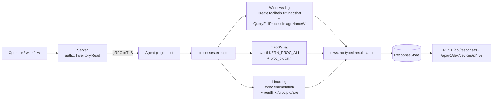

# processes

<!-- BEGIN GENERATED: plugin-doc-gen header -->
| | |
|---|---|
| **What it does** | Process listing — enumerate and query running processes |
| **Version** | 0.1.0 |
| **Kind** | Collector · read-only · on-demand (no scheduled gather) |
| **Platforms** | Windows ✅ · macOS ✅ · Linux ✅ |
| **Actions** | `list` (definition `crossplatform.process.list`) · `list_hashed` (no definition) · `list_tree` (no definition) · `query` (definition `crossplatform.process.query`) |
| **Security** | securable `Inventory` · operation Read · risk Low · dispatch ReadOnly · approval gate none |
| **Roles** | execute: endpoint-admin, endpoint-operator · author: content-author |
<!-- END GENERATED -->

## How it works

All four actions share one native, in-process enumerator (`enumerate_processes()`): `CreateToolhelp32Snapshot`/`Process32NextW` on Windows, an `/proc/<pid>/status` walk on Linux, and the agent-core `sysctl(KERN_PROC_ALL)` wrapper on macOS — no subprocess is ever spawned. `list` emits PID + name only. `query` filters that same list by a case-insensitive substring match on name and prefixes the rows with a `found|true`/`found|false` indicator; a missing `name` parameter is rejected before enumeration runs. `list_hashed` additionally resolves each process's true on-disk executable path (`QueryFullProcessImageNameW` / `readlink(/proc/<pid>/exe)` / `proc_pidpath` — never argv[0], which is spoofable) and SHA-256-hashes the image, bounded to 512 MiB and cached per unique path so processes sharing one binary hash it once. `list_tree` is `list_hashed` plus the parent PID, for server-side tree reconstruction. The plugin deliberately does NOT build the tree itself — it emits flat parent-PID edges and leaves reconstruction to the caller — and does not resolve or hash anything for `list`/`query`, keeping the cheap paths cheap.



## OS capability

<!-- BEGIN GENERATED: plugin-doc-gen capability -->
| Action | Windows | macOS | Linux |
|---|---|---|---|
| `list` | ✅ supported · rung 1 · `CreateToolhelp32Snapshot` | ✅ supported · rung 1 · `sysctl(KERN_PROC_ALL)` | ✅ supported · rung 1 · `/proc` enumeration |
| `list_hashed` | ✅ supported · rung 1 · `CreateToolhelp32Snapshot` + `QueryFullProcessImageNameW` + SHA-256 | ✅ supported · rung 1 · `sysctl(KERN_PROC_ALL)` + `proc_pidpath` + SHA-256 | ✅ supported · rung 1 · `/proc` enumeration + `readlink(/proc/<pid>/exe)` + SHA-256 |
| `list_tree` | ✅ supported · rung 1 · `CreateToolhelp32Snapshot` + `QueryFullProcessImageNameW` + SHA-256 | ✅ supported · rung 1 · `sysctl(KERN_PROC_ALL)` + `proc_pidpath` + SHA-256 | ✅ supported · rung 1 · `/proc` enumeration + `readlink(/proc/<pid>/exe)` + SHA-256 |
| `query` | ✅ supported · rung 1 · `CreateToolhelp32Snapshot` | ✅ supported · rung 1 · `sysctl(KERN_PROC_ALL)` | ✅ supported · rung 1 · `/proc` enumeration |

**Declared limits per leg** (the descriptor's fallback text, verbatim):

- None. Every leg's `fallback` field is `nullptr`/`-` (`agents/plugins/processes/src/processes_plugin.cpp:251-288`) — the descriptor declares no per-leg caveat text; the constraints that exist (hash byte cap, path unresolvability) are runtime behavior, not descriptor fallback strings, and are covered under Data contract and Caveats below.
<!-- END GENERATED -->

## Privileges and prerequisites

| OS | Runs as | Extra grant needed | Measured | If the read is refused |
|---|---|---|---|---|
| Windows | agent service account (LocalSystem today, #1442 — `docs/agent-privilege-model.md:70`) | **None** for `list`/`query` (`docs/agent-privilege-model.md:82`). `list_hashed`/`list_tree` open each process with `PROCESS_QUERY_LIMITED_INFORMATION` (`processes_plugin.cpp:204`) — no explicit privilege-model row covers this pair; see Caveats. | 2026-09-07 on the-rig as `SYSTEM` | no typed status; the OS pseudo-processes (PID 0, 4, "Secure System", "Registry", "Memory Compression") return empty hash/path — 5 of 184 rows in the capture — because they cannot be opened by any account, not because of a permission refusal |
| macOS | agent daemon, root by default (`docs/agent-privilege-model.md:14`) — this capture ran unprivileged at euid 501 | **None** for `list`/`query` (`docs/agent-privilege-model.md:82`); `list_hashed`/`list_tree`'s `proc_pidpath` resolved every one of 817 processes in the unprivileged capture, including root-owned system daemons | 2026-09-07 on macOS 26.6.2, Apple silicon, unprivileged (euid 501, alex) | no typed status; PID 0 (`kernel_task`) is skipped by the enumerator itself (`processes_plugin.cpp:168`), never emitted as a row |
| Linux | agent daemon, dedicated unprivileged `yuzu` account by design (`docs/agent-privilege-model.md:12`) — this capture ran as container root (euid 0) | **None** for `list`/`query` (`docs/agent-privilege-model.md:82`); `readlink(/proc/<pid>/exe)` needs same-UID or `CAP_SYS_PTRACE`/root to resolve another user's process — untested at the production unprivileged account | 2026-09-06, Debian 13 container, euid 0 | no typed status; both processes in the (2-process container) capture resolved cleanly under root — an unprivileged production capture has not been taken |

No external binaries, no subprocesses, no network access — every leg is an in-process OS call.

## Data contract

### Inputs

<!-- BEGIN GENERATED: plugin-doc-gen inputs -->
`list` takes no parameters.

`list_hashed` takes no parameters.

`list_tree` takes no parameters.

| Definition | Parameter | Type | Required | Default | Values | Description |
|---|---|---|---|---|---|---|
| `crossplatform.process.query` | `name` | string | yes | — | minLength 1, maxLength 256 | Case-insensitive substring to match against process names, 1-256 characters, e.g. "svchost" or "launchd" |
<!-- END GENERATED -->

`list_hashed` and `list_tree` have no definition YAML (no MCP/REST-discoverable parameter shape); they are dispatched with an empty parameter object by the two server callers that use them (see *Where the data goes*).

### Outputs

Pipe-delimited rows via `write_output()`, one line per process (or, for `query`, one `found|` line plus zero or more matching rows). A field is never omitted for width — `list_hashed`/`list_tree` always carry the full field count, with an empty (not `-`) string where the executable path or hash could not be resolved. A process name containing `|`, CR, or LF has those bytes replaced with a space before emission, so the pipe format can never desync (`processes_plugin.cpp:71-76`).

<!-- BEGIN GENERATED: plugin-doc-gen outputs -->
**`list` — `proc|pid|name`**

| Field | Type | Values | Available | Example |
|---|---|---|---|---|
| `pid` | int64 | integer | W, M, L | `1936` |
| `name` | string | free text; `\|`/CR/LF sanitized to space | W, M, L | `svchost.exe` |

**`list_hashed` — `proc|pid|name|sha256|path`**

| Field | Type | Values | Available | Example |
|---|---|---|---|---|
| `pid` | int64 | integer | W, M, L | `1052` |
| `name` | string | free text; `\|`/CR/LF sanitized to space | W, M, L | `smss.exe` |
| `sha256` | string | lowercase hex SHA-256, or empty | W, M, L | `f87219d8e2b4a890dc81c52a089ebd9eac660d7ea7c3e0c13082e0c6a3137e3c` |
| `path` | string | resolved on-disk executable path, or empty | W, M, L | `C:\Windows\System32\smss.exe` |

**`list_tree` — `proc|pid|ppid|name|sha256|path`**

| Field | Type | Values | Available | Example |
|---|---|---|---|---|
| `pid` | int64 | integer | W, M, L | `1052` |
| `ppid` | int64 | integer; `0` = root or unresolved parent | W, M, L | `4` |
| `name` | string | free text; `\|`/CR/LF sanitized to space | W, M, L | `smss.exe` |
| `sha256` | string | lowercase hex SHA-256, or empty | W, M, L | `f87219d8e2b4a890dc81c52a089ebd9eac660d7ea7c3e0c13082e0c6a3137e3c` |
| `path` | string | resolved on-disk executable path, or empty | W, M, L | `C:\Windows\System32\smss.exe` |

**`query` — `found|<bool>` then `proc|pid|name` per match**

| Field | Type | Values | Available | Example |
|---|---|---|---|---|
| `found` | bool | `true`, `false` | W, M, L | `true` |
| `pid` | int64 | integer | W, M, L | `1936` |
| `name` | string | free text (query rows are NOT sanitized — `processes_plugin.cpp:419` uses `p->name` directly, unlike `list`/`list_hashed`/`list_tree`) | W, M, L | `svchost.exe` |
<!-- END GENERATED -->

**Empty-field convention.** `sha256`/`path` on `list_hashed`/`list_tree` are an empty string, never `-`, when the path can't be resolved (kernel/pseudo-process, access denied) or `sha256_file()` refuses the read — including a file over the 512 MiB cap, which is refused outright (empty hash) rather than hashed as a truncated prefix (`agents/core/src/plugin_loader.cpp:79-113`). A `query` row set can legitimately be empty (`found|false`, no `proc|` lines) — that is a real "no match", not a read failure, since the plugin sets no typed result status to distinguish the two.

### Result status

This plugin does not set a typed result status; the agent records `UNDECLARED` and every sample shows `UNDECLARED / UNKNOWN / ` for all four actions on all three OSes (grep confirms no `set_result_status`/`yuzu_ctx_set_result_status` call anywhere in `processes_plugin.cpp`). A failed `enumerate_processes()` (e.g. `CreateToolhelp32Snapshot` or `opendir("/proc")` failing) silently returns zero rows with no distinguishing status — indistinguishable, on the wire, from a host with no processes.

### Where the data goes

- **Instruction result (`list`/`query`).** Dispatched via `execute_instruction`/`/api/instructions/{id}/execute`, rows land in the ResponseStore (90-day default retention, `server/core/src/response_store.hpp:152`), queryable at `/api/responses/{id}`.
- **Device "Get live info" (`list_hashed`/`list_tree`).** `POST /api/v1/dex/devices/{id}/live?kind=processes` dispatches `list_hashed` synchronously (`server/core/src/live_kinds.hpp:44`); the dashboard's Processes card dispatches `list_tree` (joined with `network_diag/connections` by PID) via `server/core/src/device_routes.cpp:77`. Both are usage-class behavioral-PII reads, audited under their own verbs (`device.live.processes`, `device.live.process_tree`) through the fail-closed `emit_behavioral_audit` chokepoint (`rest_audit.hpp`) *before* dispatch — a 503 `Sec-Audit-Failed` blocks the command if the audit row can't persist.
- **Not consumed by** daily-sync inventory, TAR, or metrics. Nothing runs on a schedule.
- **Siblings:** `procfetch` (the scheduled fleet-wide hash collector, SHA-1, distinct from this plugin's on-demand SHA-256).
- **MCP / REST.** Discover: `discover_plugins` (summary) → `yuzu://plugin-docs` (this page as data) → `discover_instructions` / `get_definition("crossplatform.process.list")`. Run: `execute_instruction {definition_id, parameters}`. Read: `/api/responses/{id}` (list/query) or `/api/v1/dex/devices/{id}/live?kind=processes` (list_hashed via the live-read surface).

## Sample output

<!-- BEGIN GENERATED: plugin-doc-gen samples -->
**Windows** — captured: windows Microsoft Windows NT 10.0.26200.0 x64 · bare-metal · 2026-09-07 · SYSTEM · leg-hash pending

```
== action=list
proc|0|[System Process]
proc|4|System
proc|332|Secure System
proc|376|Registry
proc|1052|smss.exe
proc|1504|csrss.exe
proc|1596|wininit.exe
proc|1604|csrss.exe
proc|1676|services.exe
proc|1716|winlogon.exe
proc|1724|LsaIso.exe
proc|1740|lsass.exe
proc|1936|svchost.exe
proc|1968|fontdrvhost.exe
proc|1976|fontdrvhost.exe
proc|2016|WUDFHost.exe
proc|1008|svchost.exe
proc|1500|svchost.exe
proc|2060|LogonUI.exe
proc|2068|dwm.exe
proc|2128|svchost.exe
proc|2136|svchost.exe
proc|2176|svchost.exe
proc|2192|svchost.exe
proc|2212|svchost.exe
… 25 of 184 rows
[result_status] UNDECLARED / UNKNOWN / 

== action=list_hashed
proc|0|[System Process]||
proc|4|System||
proc|332|Secure System||
proc|376|Registry||
proc|1052|smss.exe|f87219d8e2b4a890dc81c52a089ebd9eac660d7ea7c3e0c13082e0c6a3137e3c|C:\Windows\System32\smss.exe
proc|1504|csrss.exe|a958083fd4982697973d1f4a05a8f51b1f5d551a558cfa0097cfb6867fdce3ba|C:\Windows\System32\csrss.exe
proc|1596|wininit.exe|e368636ad52479e832cf51902b520215a5326bc6e4151097a3bd668a02750bed|C:\Windows\System32\wininit.exe
proc|1604|csrss.exe|a958083fd4982697973d1f4a05a8f51b1f5d551a558cfa0097cfb6867fdce3ba|C:\Windows\System32\csrss.exe
proc|1676|services.exe|ea75ad4d7c72a25d7284311e33b8f31a89aa35a779e1ad9b2c81af4fde45af5b|C:\Windows\System32\services.exe
proc|1716|winlogon.exe|8d0719298efb3289c8df3987ff21933a56617a6c6bbbcee392e80b3b56816838|C:\Windows\System32\winlogon.exe
proc|1724|LsaIso.exe|324b4d8c93c46033c24c240cae5c325d4fd12aab2d6e528eb53d4cdd76ddb679|C:\Windows\System32\LsaIso.exe
proc|1740|lsass.exe|b112d00d1b4db2d49d971dbb04484917c673ed747f8811c7d257a81878c7be2a|C:\Windows\System32\lsass.exe
proc|1936|svchost.exe|1222a44a5fdb4efde4dfcb41093648627950e7ec02d8667f1c26ccae31d922e2|C:\Windows\System32\svchost.exe
proc|1968|fontdrvhost.exe|953a875bfb2fc970dba06fb2cce6cbedec839c9478c4a159f39267e5b08ef460|C:\Windows\System32\fontdrvhost.exe
proc|1976|fontdrvhost.exe|953a875bfb2fc970dba06fb2cce6cbedec839c9478c4a159f39267e5b08ef460|C:\Windows\System32\fontdrvhost.exe
proc|2016|WUDFHost.exe|ce5ccbb7806fa3ba2075d736812833d6e0d25cb4f3346f0b205f126d30e3e1c2|C:\Windows\System32\WUDFHost.exe
proc|1008|svchost.exe|1222a44a5fdb4efde4dfcb41093648627950e7ec02d8667f1c26ccae31d922e2|C:\Windows\System32\svchost.exe
proc|1500|svchost.exe|1222a44a5fdb4efde4dfcb41093648627950e7ec02d8667f1c26ccae31d922e2|C:\Windows\System32\svchost.exe
proc|2060|LogonUI.exe|56346443a0d60b793c9a15b49dc12b885d21aa835e4b22e3d66d30158b70c1ab|C:\Windows\System32\LogonUI.exe
proc|2068|dwm.exe|00eb3d5e6092e1246bd0956ff0a341c2afa6f96bb805b93d36a7192a9c29e475|C:\Windows\System32\dwm.exe
proc|2128|svchost.exe|1222a44a5fdb4efde4dfcb41093648627950e7ec02d8667f1c26ccae31d922e2|C:\Windows\System32\svchost.exe
proc|2136|svchost.exe|1222a44a5fdb4efde4dfcb41093648627950e7ec02d8667f1c26ccae31d922e2|C:\Windows\System32\svchost.exe
proc|2176|svchost.exe|1222a44a5fdb4efde4dfcb41093648627950e7ec02d8667f1c26ccae31d922e2|C:\Windows\System32\svchost.exe
proc|2192|svchost.exe|1222a44a5fdb4efde4dfcb41093648627950e7ec02d8667f1c26ccae31d922e2|C:\Windows\System32\svchost.exe
proc|2212|svchost.exe|1222a44a5fdb4efde4dfcb41093648627950e7ec02d8667f1c26ccae31d922e2|C:\Windows\System32\svchost.exe
… 25 of 184 rows
[result_status] UNDECLARED / UNKNOWN / 

== action=list_tree
proc|0|0|[System Process]||
proc|4|0|System||
proc|332|4|Secure System||
proc|376|4|Registry||
proc|1052|4|smss.exe|f87219d8e2b4a890dc81c52a089ebd9eac660d7ea7c3e0c13082e0c6a3137e3c|C:\Windows\System32\smss.exe
proc|1504|1496|csrss.exe|a958083fd4982697973d1f4a05a8f51b1f5d551a558cfa0097cfb6867fdce3ba|C:\Windows\System32\csrss.exe
proc|1596|1496|wininit.exe|e368636ad52479e832cf51902b520215a5326bc6e4151097a3bd668a02750bed|C:\Windows\System32\wininit.exe
proc|1604|1588|csrss.exe|a958083fd4982697973d1f4a05a8f51b1f5d551a558cfa0097cfb6867fdce3ba|C:\Windows\System32\csrss.exe
proc|1676|1596|services.exe|ea75ad4d7c72a25d7284311e33b8f31a89aa35a779e1ad9b2c81af4fde45af5b|C:\Windows\System32\services.exe
proc|1716|1588|winlogon.exe|8d0719298efb3289c8df3987ff21933a56617a6c6bbbcee392e80b3b56816838|C:\Windows\System32\winlogon.exe
proc|1724|1596|LsaIso.exe|324b4d8c93c46033c24c240cae5c325d4fd12aab2d6e528eb53d4cdd76ddb679|C:\Windows\System32\LsaIso.exe
proc|1740|1596|lsass.exe|b112d00d1b4db2d49d971dbb04484917c673ed747f8811c7d257a81878c7be2a|C:\Windows\System32\lsass.exe
proc|1936|1676|svchost.exe|1222a44a5fdb4efde4dfcb41093648627950e7ec02d8667f1c26ccae31d922e2|C:\Windows\System32\svchost.exe
proc|1968|1596|fontdrvhost.exe|953a875bfb2fc970dba06fb2cce6cbedec839c9478c4a159f39267e5b08ef460|C:\Windows\System32\fontdrvhost.exe
proc|1976|1716|fontdrvhost.exe|953a875bfb2fc970dba06fb2cce6cbedec839c9478c4a159f39267e5b08ef460|C:\Windows\System32\fontdrvhost.exe
proc|2016|1676|WUDFHost.exe|ce5ccbb7806fa3ba2075d736812833d6e0d25cb4f3346f0b205f126d30e3e1c2|C:\Windows\System32\WUDFHost.exe
proc|1008|1676|svchost.exe|1222a44a5fdb4efde4dfcb41093648627950e7ec02d8667f1c26ccae31d922e2|C:\Windows\System32\svchost.exe
proc|1500|1676|svchost.exe|1222a44a5fdb4efde4dfcb41093648627950e7ec02d8667f1c26ccae31d922e2|C:\Windows\System32\svchost.exe
proc|2060|1716|LogonUI.exe|56346443a0d60b793c9a15b49dc12b885d21aa835e4b22e3d66d30158b70c1ab|C:\Windows\System32\LogonUI.exe
proc|2068|1716|dwm.exe|00eb3d5e6092e1246bd0956ff0a341c2afa6f96bb805b93d36a7192a9c29e475|C:\Windows\System32\dwm.exe
proc|2128|1676|svchost.exe|1222a44a5fdb4efde4dfcb41093648627950e7ec02d8667f1c26ccae31d922e2|C:\Windows\System32\svchost.exe
proc|2136|1676|svchost.exe|1222a44a5fdb4efde4dfcb41093648627950e7ec02d8667f1c26ccae31d922e2|C:\Windows\System32\svchost.exe
proc|2176|1676|svchost.exe|1222a44a5fdb4efde4dfcb41093648627950e7ec02d8667f1c26ccae31d922e2|C:\Windows\System32\svchost.exe
proc|2192|1676|svchost.exe|1222a44a5fdb4efde4dfcb41093648627950e7ec02d8667f1c26ccae31d922e2|C:\Windows\System32\svchost.exe
proc|2212|1676|svchost.exe|1222a44a5fdb4efde4dfcb41093648627950e7ec02d8667f1c26ccae31d922e2|C:\Windows\System32\svchost.exe
… 25 of 184 rows
[result_status] UNDECLARED / UNKNOWN / 

== action=query name=svchost.exe
found|true
proc|1936|svchost.exe
proc|1008|svchost.exe
proc|1500|svchost.exe
proc|2128|svchost.exe
proc|2136|svchost.exe
proc|2176|svchost.exe
proc|2192|svchost.exe
proc|2212|svchost.exe
proc|2232|svchost.exe
proc|2448|svchost.exe
proc|2456|svchost.exe
proc|2464|svchost.exe
proc|2472|svchost.exe
proc|2644|svchost.exe
proc|2652|svchost.exe
proc|2704|svchost.exe
proc|2812|svchost.exe
proc|2904|svchost.exe
proc|3184|svchost.exe
proc|3192|svchost.exe
proc|3304|svchost.exe
proc|3352|svchost.exe
proc|3416|svchost.exe
proc|3424|svchost.exe
… 24 of 83 rows
[result_status] UNDECLARED / UNKNOWN / 
```

**macOS** — captured: macos macOS 26.6.2 arm64 · bare-metal · 2026-09-07 · euid 501 (alex) · leg-hash pending

```
== action=list
proc|1|/sbin/launchd
proc|399|/usr/libexec/logd
proc|400|/usr/libexec/smd
proc|401|/usr/libexec/UserEventAgent
proc|403|/System/Library/Frameworks/CoreServices.framework/Versions/A/Frameworks/FSEvents.framework/Versions/A/Support/fseventsd
proc|404|/System/Library/PrivateFrameworks/MediaRemote.framework/Support/mediaremoted
proc|407|/usr/sbin/systemstats
proc|409|/System/Library/PrivateFrameworks/MobileAccessoryUpdater.framework/Support/accessoryupdaterd
proc|410|/usr/libexec/uarpassetmanagerd
proc|411|/usr/libexec/configd
proc|412|/usr/libexec/endpointsecurityd
proc|413|/System/Library/CoreServices/powerd.bundle/powerd
proc|414|/usr/libexec/IOMFB_bics_daemon
proc|416|/usr/libexec/amfid
proc|418|/usr/libexec/remoted
proc|420|/usr/libexec/keybagd
proc|421|/System/Library/PrivateFrameworks/MobileSoftwareUpdate.framework/Support/softwareupdated
proc|422|/System/Library/PrivateFrameworks/CoreSpeech.framework/corespeechd_system
proc|424|/usr/libexec/watchdogd
proc|428|/System/Library/Frameworks/CoreServices.framework/Versions/A/Frameworks/Metadata.framework/Versions/A/Support/mds
proc|429|/System/Library/CoreServices/iconservicesd
proc|430|/usr/libexec/kernelmanagerd
proc|431|/usr/libexec/diskarbitrationd
proc|434|/usr/libexec/coreduetd
proc|435|/usr/sbin/syslogd
… 25 of 817 rows
[result_status] UNDECLARED / UNKNOWN / 

== action=list_hashed
proc|1|/sbin/launchd|7b636e967e77705d88aad9ad9ea9af627852d83686cd19ab4d94c6010cd67b09|/sbin/launchd
proc|399|/usr/libexec/logd|8723d187c209d5c40aea1ebb72eb8a77d4d50dc56a339e7c60984be24005fc76|/usr/libexec/logd
proc|400|/usr/libexec/smd|24ce0696b087f04087bb7a5a4eb4c0c05d9b1751267592e8c61fa6b25614173e|/usr/libexec/smd
proc|401|/usr/libexec/UserEventAgent|c07598cce87ff688aeb358aa36bf721357459743d9a3b26f83ef020bcf4c5c83|/usr/libexec/UserEventAgent
proc|403|/System/Library/Frameworks/CoreServices.framework/Versions/A/Frameworks/FSEvents.framework/Versions/A/Support/fseventsd|e2a35e8f8ac3af16ebc5efd97ef61796b67ee6ca8f58d6d8931c0180cf6b1db7|/System/Library/Frameworks/CoreServices.framework/Versions/A/Frameworks/FSEvents.framework/Versions/A/Support/fseventsd
proc|404|/System/Library/PrivateFrameworks/MediaRemote.framework/Support/mediaremoted|7da659f83dfcfd32e578a475fbadf5539114fd30c66686006b888e7ef76d1b50|/System/Library/PrivateFrameworks/MediaRemote.framework/Support/mediaremoted
proc|407|/usr/sbin/systemstats|d45e873be9e5516f8433f71cba4200ebfae063fe144ea8a35bc632bb720658d0|/usr/sbin/systemstats
proc|409|/System/Library/PrivateFrameworks/MobileAccessoryUpdater.framework/Support/accessoryupdaterd|b78ced86ea4124b1f5b8106061e9f3d4e2c0b54a95d67fefd25b3ac5b5bd2c2a|/System/Library/PrivateFrameworks/MobileAccessoryUpdater.framework/Support/accessoryupdaterd
proc|410|/usr/libexec/uarpassetmanagerd|d4adb14c3e59f036fab7b2ccea9ed0109b293369e250c0c66e299385544e7e2d|/usr/libexec/uarpassetmanagerd
proc|411|/usr/libexec/configd|35329b490f724f46bd1a5324c91d76af8416b498e772fe4ed8b0f99fa1760367|/usr/libexec/configd
proc|412|/usr/libexec/endpointsecurityd|3227a07deef4a6970046995557c93fc00e89e4ddc59427ee4d36e82d1daaa53a|/usr/libexec/endpointsecurityd
proc|413|/System/Library/CoreServices/powerd.bundle/powerd|a27da6756b7d513bace5890b0c1a7fd55a18827c8ea30a6bd1cd3b5c5761da72|/System/Library/CoreServices/powerd.bundle/powerd
proc|414|/usr/libexec/IOMFB_bics_daemon|ac193fdc9576848a5375c97396abb1ba990b92b10db0269d3654d35b0ac0eda2|/usr/libexec/IOMFB_bics_daemon
proc|416|/usr/libexec/amfid|71ca97a157a9aa39cb70d5ae2184cab6d4f9e61970a4130f6302c2fbc0f317a0|/usr/libexec/amfid
proc|418|/usr/libexec/remoted|345bdb3e5444bf5bbaab2f29c514198eed763be5e165e809116f57c877e844f5|/usr/libexec/remoted
proc|420|/usr/libexec/keybagd|6f1541ba11ee5a97d958119146fa20430dcbd0c9c3db66c021b68085c59b8bab|/usr/libexec/keybagd
proc|421|/System/Library/PrivateFrameworks/MobileSoftwareUpdate.framework/Support/softwareupdated|ff8fc4960a50f470e4f21ee990a1f7ae41c68a5e2408e6109dd90911ffb30594|/System/Library/PrivateFrameworks/MobileSoftwareUpdate.framework/Support/softwareupdated
proc|422|/System/Library/PrivateFrameworks/CoreSpeech.framework/corespeechd_system|8c926bad456c8582608328e827ff3380933b4b1b75a91e0d8cceedb3d8988745|/System/Library/PrivateFrameworks/CoreSpeech.framework/corespeechd_system
proc|424|/usr/libexec/watchdogd|72c2b0a82e39e0cc708e7b3c4fe1801fbccfb1bcb2d7f5080c9d526535cba65d|/usr/libexec/watchdogd
proc|428|/System/Library/Frameworks/CoreServices.framework/Versions/A/Frameworks/Metadata.framework/Versions/A/Support/mds|cb283c61a6a5bea8bb3615eaa7eb05f52dacb2eee41c522c75f9857d05f8c5b7|/System/Library/Frameworks/CoreServices.framework/Versions/A/Frameworks/Metadata.framework/Versions/A/Support/mds
proc|429|/System/Library/CoreServices/iconservicesd|c1014a088b8ff32009ec69931bb8710bec3e0a00698c48da8ff672daab8a9869|/System/Library/CoreServices/iconservicesd
proc|430|/usr/libexec/kernelmanagerd|24a4fe0623cca5b99d0a092191744a8611fd5342d1c5d3feb4e369e2395c8718|/usr/libexec/kernelmanagerd
proc|431|/usr/libexec/diskarbitrationd|e55f28b76066b9fa896275f3cebdf0e439d04e13c5ab4bdcd5dcb9cd35089648|/usr/libexec/diskarbitrationd
proc|434|/usr/libexec/coreduetd|aff0f7ea1f21b7718afc5eac40757ad74fcb80f2537a94d24409924268aa118d|/usr/libexec/coreduetd
proc|435|/usr/sbin/syslogd|dbfbd04b21b549b9c2cad3baf61ad2b652a161483ac6579ff9c3c602dd924c23|/usr/sbin/syslogd
… 25 of 817 rows
[result_status] UNDECLARED / UNKNOWN / 

== action=list_tree
proc|1|0|/sbin/launchd|7b636e967e77705d88aad9ad9ea9af627852d83686cd19ab4d94c6010cd67b09|/sbin/launchd
proc|399|1|/usr/libexec/logd|8723d187c209d5c40aea1ebb72eb8a77d4d50dc56a339e7c60984be24005fc76|/usr/libexec/logd
proc|400|1|/usr/libexec/smd|24ce0696b087f04087bb7a5a4eb4c0c05d9b1751267592e8c61fa6b25614173e|/usr/libexec/smd
proc|401|1|/usr/libexec/UserEventAgent|c07598cce87ff688aeb358aa36bf721357459743d9a3b26f83ef020bcf4c5c83|/usr/libexec/UserEventAgent
proc|403|1|/System/Library/Frameworks/CoreServices.framework/Versions/A/Frameworks/FSEvents.framework/Versions/A/Support/fseventsd|e2a35e8f8ac3af16ebc5efd97ef61796b67ee6ca8f58d6d8931c0180cf6b1db7|/System/Library/Frameworks/CoreServices.framework/Versions/A/Frameworks/FSEvents.framework/Versions/A/Support/fseventsd
proc|404|1|/System/Library/PrivateFrameworks/MediaRemote.framework/Support/mediaremoted|7da659f83dfcfd32e578a475fbadf5539114fd30c66686006b888e7ef76d1b50|/System/Library/PrivateFrameworks/MediaRemote.framework/Support/mediaremoted
proc|407|1|/usr/sbin/systemstats|d45e873be9e5516f8433f71cba4200ebfae063fe144ea8a35bc632bb720658d0|/usr/sbin/systemstats
proc|409|1|/System/Library/PrivateFrameworks/MobileAccessoryUpdater.framework/Support/accessoryupdaterd|b78ced86ea4124b1f5b8106061e9f3d4e2c0b54a95d67fefd25b3ac5b5bd2c2a|/System/Library/PrivateFrameworks/MobileAccessoryUpdater.framework/Support/accessoryupdaterd
proc|410|1|/usr/libexec/uarpassetmanagerd|d4adb14c3e59f036fab7b2ccea9ed0109b293369e250c0c66e299385544e7e2d|/usr/libexec/uarpassetmanagerd
proc|411|1|/usr/libexec/configd|35329b490f724f46bd1a5324c91d76af8416b498e772fe4ed8b0f99fa1760367|/usr/libexec/configd
proc|412|1|/usr/libexec/endpointsecurityd|3227a07deef4a6970046995557c93fc00e89e4ddc59427ee4d36e82d1daaa53a|/usr/libexec/endpointsecurityd
proc|413|1|/System/Library/CoreServices/powerd.bundle/powerd|a27da6756b7d513bace5890b0c1a7fd55a18827c8ea30a6bd1cd3b5c5761da72|/System/Library/CoreServices/powerd.bundle/powerd
proc|414|1|/usr/libexec/IOMFB_bics_daemon|ac193fdc9576848a5375c97396abb1ba990b92b10db0269d3654d35b0ac0eda2|/usr/libexec/IOMFB_bics_daemon
proc|416|1|/usr/libexec/amfid|71ca97a157a9aa39cb70d5ae2184cab6d4f9e61970a4130f6302c2fbc0f317a0|/usr/libexec/amfid
proc|418|1|/usr/libexec/remoted|345bdb3e5444bf5bbaab2f29c514198eed763be5e165e809116f57c877e844f5|/usr/libexec/remoted
proc|420|1|/usr/libexec/keybagd|6f1541ba11ee5a97d958119146fa20430dcbd0c9c3db66c021b68085c59b8bab|/usr/libexec/keybagd
proc|421|1|/System/Library/PrivateFrameworks/MobileSoftwareUpdate.framework/Support/softwareupdated|ff8fc4960a50f470e4f21ee990a1f7ae41c68a5e2408e6109dd90911ffb30594|/System/Library/PrivateFrameworks/MobileSoftwareUpdate.framework/Support/softwareupdated
proc|422|1|/System/Library/PrivateFrameworks/CoreSpeech.framework/corespeechd_system|8c926bad456c8582608328e827ff3380933b4b1b75a91e0d8cceedb3d8988745|/System/Library/PrivateFrameworks/CoreSpeech.framework/corespeechd_system
proc|424|1|/usr/libexec/watchdogd|72c2b0a82e39e0cc708e7b3c4fe1801fbccfb1bcb2d7f5080c9d526535cba65d|/usr/libexec/watchdogd
proc|428|1|/System/Library/Frameworks/CoreServices.framework/Versions/A/Frameworks/Metadata.framework/Versions/A/Support/mds|cb283c61a6a5bea8bb3615eaa7eb05f52dacb2eee41c522c75f9857d05f8c5b7|/System/Library/Frameworks/CoreServices.framework/Versions/A/Frameworks/Metadata.framework/Versions/A/Support/mds
proc|429|1|/System/Library/CoreServices/iconservicesd|c1014a088b8ff32009ec69931bb8710bec3e0a00698c48da8ff672daab8a9869|/System/Library/CoreServices/iconservicesd
proc|430|1|/usr/libexec/kernelmanagerd|24a4fe0623cca5b99d0a092191744a8611fd5342d1c5d3feb4e369e2395c8718|/usr/libexec/kernelmanagerd
proc|431|1|/usr/libexec/diskarbitrationd|e55f28b76066b9fa896275f3cebdf0e439d04e13c5ab4bdcd5dcb9cd35089648|/usr/libexec/diskarbitrationd
proc|434|1|/usr/libexec/coreduetd|aff0f7ea1f21b7718afc5eac40757ad74fcb80f2537a94d24409924268aa118d|/usr/libexec/coreduetd
proc|435|1|/usr/sbin/syslogd|dbfbd04b21b549b9c2cad3baf61ad2b652a161483ac6579ff9c3c602dd924c23|/usr/sbin/syslogd
… 25 of 818 rows
[result_status] UNDECLARED / UNKNOWN / 

== action=query name=launchd
found|true
proc|1|/sbin/launchd
[result_status] UNDECLARED / UNKNOWN / 
```

**Linux** — captured: linux Debian GNU/Linux 13 (trixie) aarch64 · container · 2026-09-06 · euid 0 · leg-hash pending

```
== action=list
proc|1|sh
proc|8|plugin-capture
[result_status] UNDECLARED / UNKNOWN / 

== action=list_hashed
proc|1|sh|367967c823a0c391e5049b15a67c6a0a629c88b9b6dcdca75ef13ac9d65334b1|/usr/bin/dash
proc|8|plugin-capture|e4afbc5e655b3942d6ee315b307eb4449358d82f0c86fe127bdd5312107cf889|/src/builddir/tools/plugin-capture/plugin-capture
[result_status] UNDECLARED / UNKNOWN / 

== action=list_tree
proc|1|0|sh|367967c823a0c391e5049b15a67c6a0a629c88b9b6dcdca75ef13ac9d65334b1|/usr/bin/dash
proc|8|1|plugin-capture|e4afbc5e655b3942d6ee315b307eb4449358d82f0c86fe127bdd5312107cf889|/src/builddir/tools/plugin-capture/plugin-capture
[result_status] UNDECLARED / UNKNOWN / 

== action=query name=sh
found|true
proc|1|sh
[result_status] UNDECLARED / UNKNOWN / 
```
<!-- END GENERATED -->

## Caveats and known gaps

1. **No typed result status, ever.** Every action on every OS reports `UNDECLARED / UNKNOWN /` in every capture — the plugin has no `set_result_status` call at all, so an enumeration failure (a failed `CreateToolhelp32Snapshot` or `opendir("/proc")`) and "this host genuinely has zero processes" are indistinguishable on the wire.
2. **`list_hashed`/`list_tree` have no privilege-model row.** `docs/agent-privilege-model.md:83` covers `processes.fetch`/`tar.process_tree` (needing `cap_sys_ptrace` on Linux to inspect non-child processes) — that is a different action id, not present in this plugin's descriptor, so it must not be read as documenting `list_hashed`/`list_tree`. Both were captured only as root/SYSTEM/unprivileged-but-same-user, so a production unprivileged Linux capture (where `readlink(/proc/<pid>/exe)` on another user's process would be denied) has not been taken; add the row when it is.
3. **512 MiB hash cap refuses, not truncates.** `sha256_file()` returns an empty hash for any image over the cap rather than hashing a truncated prefix (`agents/core/src/plugin_loader.cpp:79-95`) — an empty `sha256` on a real, resolved `path` can mean "oversized," not just "unreadable."
4. **`query` output is not sanitized.** `do_query` writes `p->name` directly (`processes_plugin.cpp:419`), unlike `list`/`list_hashed`/`list_tree`, which run every name through `sanitize_field()`. A process name containing `|`/CR/LF would desync a `query` row's fields; none of the three captures exercised this.
5. **macOS name field is dual-shaped.** `list`/`list_hashed`/`list_tree` report the full resolved executable path as `name` when one was found, else the 16-byte-truncated `p_comm` (`processes_plugin.cpp:173-174`) — a consumer joining on `name` across OSes gets a path on macOS and a bare filename on Windows/Linux.

## Source and tests

<!-- BEGIN GENERATED: plugin-doc-gen source -->
- Plugin: `agents/plugins/processes/src/processes_plugin.cpp`
- Definitions: `content/definitions/processes.yaml` (`list`, `query` only — `list_hashed`/`list_tree` have no definition)
- Capability rows: `server/core/src/capability_decls/plugin_action_catalogue_b.hpp:504` (`list`) · `:515` (`list_hashed`) · `:526` (`list_tree`) · `:537` (`query`)
- Tests: `tests/unit/agent/test_wave3_pr31_macos_actions.cpp:301` (loads the real library, asserts `list` enumerates this process, skips PID 0, sorts ascending by PID)
- Privilege row: `docs/agent-privilege-model.md:82` (`list`/`query` only — see Caveat 2)
- Changelog: `changelog.d/2204-declarations-group-b.added.md` (ABI4 descriptors) · `changelog.d/20260819-wave3-pr31-syscall-promotion.changed.md` (macOS moved off `ps` onto `sysctl(KERN_PROC_ALL)`)
<!-- END GENERATED -->
