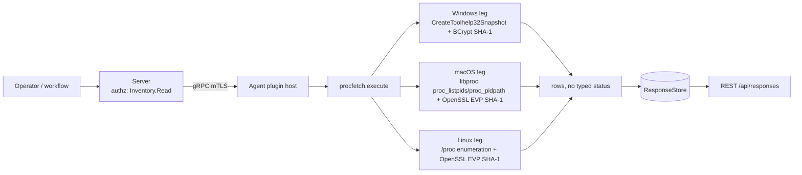

# procfetch

<!-- BEGIN GENERATED: plugin-doc-gen header -->
| | |
|---|---|
| **What it does** | Enumerates running processes with SHA-1 hashes of executables |
| **Version** | 1.0.0 |
| **Kind** | Collector · read-only · on-demand (no scheduled gather) |
| **Platforms** | Windows ✅ · macOS ✅ · Linux ✅ |
| **Actions** | `procfetch_fetch` (definition `crossplatform.process.fetch`) |
| **Security** | securable `Inventory` · operation Read · risk Low · dispatch ReadOnly · approval gate none |
| **Roles** | execute: endpoint-admin, endpoint-operator · author: content-author |
<!-- END GENERATED -->

## How it works

`procfetch_fetch` is the plugin's only action. Each leg enumerates every process the OS exposes, resolves the executable image path, and SHA-1-hashes the file at that path, streaming one pipe-delimited row per process via `write_output()` as it goes rather than collecting the whole list first. Hashes are cached by path within a single run so a binary loaded by many processes (`svchost.exe`, `cfprefsd`, `MTLCompilerService`) is only read and hashed once. The three legs are native, in-process enumeration — `/proc` on Linux, `libproc` on macOS, `CreateToolhelp32Snapshot` on Windows — with OpenSSL EVP (POSIX) or BCrypt (Windows) doing the hashing; no subprocess is spawned anywhere in the plugin. It is deliberately not a general process inventory: `processes` (`crossplatform.process.list`/`.query`) already lists PID and name only, cheaply and without touching disk; `procfetch` exists specifically to add the executable path and a file hash, which costs one file read and one hash per unique binary.



## OS capability

<!-- BEGIN GENERATED: plugin-doc-gen capability -->
| Action | Windows | macOS | Linux |
|---|---|---|---|
| `procfetch_fetch` | ✅ supported · rung 1 · `CreateToolhelp32Snapshot` + BCrypt SHA-1 | ✅ supported · rung 1 · libproc (`proc_listpids`/`proc_pidpath`) + OpenSSL EVP SHA-1 | ✅ supported · rung 1 · `/proc` enumeration + OpenSSL EVP SHA-1 |

**Declared limits per leg** (the descriptor's fallback text, verbatim):

- None declared — every leg's Fallback field is `-` (`agents/plugins/procfetch/src/procfetch_plugin.cpp:356-367`).
<!-- END GENERATED -->

## Privileges and prerequisites

| OS | Runs as | Extra grant needed | Measured | If the read is refused |
|---|---|---|---|---|
| Windows | SYSTEM (measured; no row in `docs/agent-privilege-model.md` for this plugin) | None observed at SYSTEM. Even as SYSTEM, `OpenProcess(PROCESS_QUERY_LIMITED_INFORMATION, ...)` is refused for a handful of protected/system processes — the sample's `[System Process]`, `System`, `Secure System`, `Registry` rows carry no path or hash. | 2026-09-07, bare-metal, `SYSTEM` | that row's `path` and `sha1` fields are empty; no error is surfaced and enumeration continues (`procfetch_plugin.cpp:251-264`) |
| macOS | unprivileged (agent daemon) | None observed unprivileged — `proc_listpids`/`proc_pidpath` resolved paths and hashes for processes owned by root and other users in the sample (e.g. `postgres`, `XprotectService`) without elevation. | 2026-09-07, macOS 26.6.2, euid 501 (alex) | `proc_pidpath` failing falls back to `proc_name()` for a short name only, leaving `path` and `sha1` empty (`procfetch_plugin.cpp:216-223`) — not observed in this capture |
| Linux | root (captured in a container; not measured unprivileged) | `resolve_exe` reads the `/proc/<pid>/exe` symlink, which the kernel restricts to the same UID or a reader holding `CAP_SYS_PTRACE`; an unprivileged, non-matching-UID read is expected to fail | 2026-09-06, Debian 13 (trixie) aarch64 container, euid 0 | `std::filesystem::read_symlink` throws `filesystem_error`, caught and turned into an empty path, so `path` and `sha1` are empty and the row still emits (`procfetch_plugin.cpp:134-140`) |

No external binaries, no subprocesses, no network access — every leg is a native OS call plus an in-process hash (`agents/plugins/procfetch/src/procfetch_plugin.cpp`, no `popen`/`CreateProcess`/socket use anywhere in the file).

## Data contract

### Inputs

<!-- BEGIN GENERATED: plugin-doc-gen inputs -->
`procfetch_fetch` takes no parameters.
<!-- END GENERATED -->

### Outputs

Pipe-delimited rows, one per process, in the fixed field order `pid|name|path|sha1`. `name` and `path` are pipe-escaped (a literal `|` becomes `\|`) before being written, so the delimiter itself is never ambiguous. `path` and `sha1` are empty strings, not `-`, when the OS would not hand back an image path or the file could not be opened/hashed — there is no placeholder row for "no processes": the row is only ever missing fields, never absent.

<!-- BEGIN GENERATED: plugin-doc-gen outputs -->
**`procfetch_fetch` — `pid|name|path|sha1`**

| Field | Type | Values | Available | Example |
|---|---|---|---|---|
| `pid` | int64 | OS-assigned process ID (`0` is the Windows System Idle Process) | W, M, L | `1052` |
| `name` | string | free text, OS-reported process/short name, pipe-escaped | W, M, L | `svchost.exe` |
| `path` | string | absolute executable path, or empty when the OS refuses/cannot resolve it | W, M, L | `/usr/bin/dash` |
| `sha1` | string | 40-character lowercase hex SHA-1 of the executable file, or empty when it could not be read | W, M, L | `e5355187cbd952a5bc9dfca430d10383f0f8750c` |
<!-- END GENERATED -->

### Result status

This plugin does not set a typed result status; the agent records `UNDECLARED` and the sample shows `UNDECLARED / UNKNOWN /`.

### Where the data goes

- **Instruction result only.** Rows travel over the agent's mTLS gRPC channel as the command response and land in the ResponseStore, queryable at `/api/responses/{id}`. The classic dashboard also reaches this action through the legacy `POST /api/procfetch/fetch` route (`server.cpp:14943`), which forwards into the same dispatch chokepoint as the DSL path (`changelog.d/1.9-dispatch-chokepoint.security.md`) rather than a separate mechanism.
- **Not consumed by** daily-sync inventory, the TAR warehouse, DEX, or metrics — grepping the server for `procfetch` finds only the dashboard route, the legacy REST forwarder, the capability declaration, and the static result-table column list (`result_parsing.hpp:49`).
- **Siblings:** `crossplatform.process.list` / `crossplatform.process.query` (the `processes` plugin) — PID and name only, no path or hash, cheaper to run.
- **MCP / REST.** Discover: `discover_plugins` (summary) → `yuzu://plugin-docs` (this page as data) → `discover_instructions` / `get_definition("crossplatform.process.fetch")`. Run: `execute_instruction {definition_id, parameters}`. Read: `/api/responses/{id}`.

## Sample output

<!-- BEGIN GENERATED: plugin-doc-gen samples -->
**Windows** — captured: windows Microsoft Windows NT 10.0.26200.0 x64 · bare-metal · 2026-09-07 · SYSTEM · leg-hash pending

```
0|[System Process]||
4|System||
332|Secure System||
376|Registry||
1052|smss.exe|C:\Windows\System32\smss.exe|2c84c834b6326b8fc02cc3262d9035e16fc27847
1504|csrss.exe|C:\Windows\System32\csrss.exe|17397f105f7d51112261ecc501fe99b8fcf4de67
1596|wininit.exe|C:\Windows\System32\wininit.exe|54fea18cc8aaefa2759701df35a4d4487a594593
1604|csrss.exe|C:\Windows\System32\csrss.exe|17397f105f7d51112261ecc501fe99b8fcf4de67
1676|services.exe|C:\Windows\System32\services.exe|56aea1cb2ceada37df439990113529c2c67a61c8
1716|winlogon.exe|C:\Windows\System32\winlogon.exe|c2c0e4e27796545d94c5ef879ee429c608a42dbf
1724|LsaIso.exe|C:\Windows\System32\LsaIso.exe|839d5e8e57687cbb0d21420e386f73c6742e8588
1740|lsass.exe|C:\Windows\System32\lsass.exe|258a9984be57a5000517fd76abff440f5562a315
1936|svchost.exe|C:\Windows\System32\svchost.exe|0bac26fca769fbecab983e3cfba95140d55e0855
1968|fontdrvhost.exe|C:\Windows\System32\fontdrvhost.exe|2519f99f9b2ed780505d6942f0d7c12328777e9d
1976|fontdrvhost.exe|C:\Windows\System32\fontdrvhost.exe|2519f99f9b2ed780505d6942f0d7c12328777e9d
2016|WUDFHost.exe|C:\Windows\System32\WUDFHost.exe|cfdfb6c7c356dbed78f85cdebca1b12846b5ba80
1008|svchost.exe|C:\Windows\System32\svchost.exe|0bac26fca769fbecab983e3cfba95140d55e0855
1500|svchost.exe|C:\Windows\System32\svchost.exe|0bac26fca769fbecab983e3cfba95140d55e0855
2060|LogonUI.exe|C:\Windows\System32\LogonUI.exe|ff3a9916d3164e1d7ccaefaa03afcf268b2be53d
2068|dwm.exe|C:\Windows\System32\dwm.exe|f6e9cc66a9847579bf92497a0e8b1e4795f70e14
2128|svchost.exe|C:\Windows\System32\svchost.exe|0bac26fca769fbecab983e3cfba95140d55e0855
2136|svchost.exe|C:\Windows\System32\svchost.exe|0bac26fca769fbecab983e3cfba95140d55e0855
2176|svchost.exe|C:\Windows\System32\svchost.exe|0bac26fca769fbecab983e3cfba95140d55e0855
2192|svchost.exe|C:\Windows\System32\svchost.exe|0bac26fca769fbecab983e3cfba95140d55e0855
2212|svchost.exe|C:\Windows\System32\svchost.exe|0bac26fca769fbecab983e3cfba95140d55e0855
… 25 of 184 rows
[result_status] UNDECLARED / UNKNOWN / 
```

**macOS** — captured: macos macOS 26.6.2 arm64 · bare-metal · 2026-09-07 · euid 501 (alex) · leg-hash pending

```
10151|plugin_capture|/private/tmp/claude-501/-Users-alex-yuzu-dev/8d89cd79-001b-4ea8-8930-0c9affb3265e/scratchpad/d2/plugin_capture|87ea43e2b7d3dd2eb6e7db6a20041b1f77d20272
10143|mdworker_shared|/System/Library/Frameworks/CoreServices.framework/Versions/A/Frameworks/Metadata.framework/Versions/A/Support/mdworker_shared|19ca6c856d80cfc6b83800c821b3129f40b135c7
10125|Code Helper (Plugin)|/Applications/Visual Studio Code.app/Contents/Frameworks/Code Helper (Plugin).app/Contents/MacOS/Code Helper (Plugin)|0478d377b6ffa6659d823d3c72d25dc9b8816bd6
10121|mdworker_shared|/System/Library/Frameworks/CoreServices.framework/Versions/A/Frameworks/Metadata.framework/Versions/A/Support/mdworker_shared|19ca6c856d80cfc6b83800c821b3129f40b135c7
10120|mdworker_shared|/System/Library/Frameworks/CoreServices.framework/Versions/A/Frameworks/Metadata.framework/Versions/A/Support/mdworker_shared|19ca6c856d80cfc6b83800c821b3129f40b135c7
10119|mdworker_shared|/System/Library/Frameworks/CoreServices.framework/Versions/A/Frameworks/Metadata.framework/Versions/A/Support/mdworker_shared|19ca6c856d80cfc6b83800c821b3129f40b135c7
10118|Code Helper (Plugin)|/Applications/Visual Studio Code.app/Contents/Frameworks/Code Helper (Plugin).app/Contents/MacOS/Code Helper (Plugin)|0478d377b6ffa6659d823d3c72d25dc9b8816bd6
9945|biomesyncd|/usr/libexec/biomesyncd|231b0daf0f1dd48345aade47d3adfbbb5a75844f
9654|head|/usr/bin/head|a78fc55bfe98bda12ebd3c8190d12b3f09159407
9653|ssh|/usr/bin/ssh|8ccefa7581a171018a6cc737649ef7854e75d4c0
9647|zsh|/bin/zsh|95f7d2b76c248d1dc8c84c37e3e5cddc93246b6c
9621|spotlightknowledged|/System/Library/Frameworks/CoreSpotlight.framework/spotlightknowledged|8d9cd67b92a13d9f23b7c546737edce879c47436
9610|ReportMemoryException|/usr/libexec/ReportMemoryException|7130c3eacc06f42ed150ef8316576941534b7907
9609|XprotectService|/System/Library/PrivateFrameworks/XprotectFramework.framework/Versions/A/XPCServices/XprotectService.xpc/Contents/MacOS/XprotectService|17e4e6ec70ea67e9a20dba4b83f76180b89e4393
9603|Python|/opt/homebrew/Cellar/python@3.14/3.14.7/Frameworks/Python.framework/Versions/3.14/Resources/Python.app/Contents/MacOS/Python|e2b3d7e8c8ed1470c315ef6a0de81e10482348ba
9519|com.apple.SafariPlatformSupport.Helper|/System/Volumes/Preboot/Cryptexes/OS/System/Library/PrivateFrameworks/SafariPlatformSupport.framework/Versions/A/XPCServices/com.apple.SafariPlatformSupport.Helper.xpc/Contents/MacOS/com.apple.SafariPlatformSupport.Helper|35404b3571b1a85095bad171450af8103c10963f
9518|com.apple.WebKit.WebContent|/System/Volumes/Preboot/Cryptexes/Incoming/OS/System/Library/Frameworks/WebKit.framework/Versions/A/XPCServices/com.apple.WebKit.WebContent.xpc/Contents/MacOS/com.apple.WebKit.WebContent|c50ee39a4e9ce9c853a7137bd2b123550d52460e
9100|Code Helper (Renderer)|/Applications/Visual Studio Code.app/Contents/Frameworks/Code Helper (Renderer).app/Contents/MacOS/Code Helper (Renderer)|f2350a895f845b3abf58acee435aaf9f95cf9fa2
9098|ssh-agent|/usr/bin/ssh-agent|409e33df7093b1556ca4ebf201346c749da658ce
9064|SpeechSynthesisServerXPC|/System/Library/Frameworks/ApplicationServices.framework/Versions/A/Frameworks/SpeechSynthesis.framework/Versions/A/XPCServices/SpeechSynthesisServerXPC.xpc/Contents/MacOS/SpeechSynthesisServerXPC|26378695d295a43f5c4223e3944d1ec9a28ec2e7
9039|claude|/Users/alex/.vscode/extensions/anthropic.claude-code-2.1.263-darwin-arm64/resources/native-binary/claude|da44323dee6bf9fbd3aafca303f25884f3e6675e
9001|claude|/Users/alex/.vscode/extensions/anthropic.claude-code-2.1.263-darwin-arm64/resources/native-binary/claude|da44323dee6bf9fbd3aafca303f25884f3e6675e
8979|claude|/Users/alex/.vscode/extensions/anthropic.claude-code-2.1.263-darwin-arm64/resources/native-binary/claude|da44323dee6bf9fbd3aafca303f25884f3e6675e
8969|MTLCompilerService|/System/Library/Frameworks/Metal.framework/Versions/A/XPCServices/MTLCompilerService.xpc/Contents/MacOS/MTLCompilerService|e6aa243d70c17f39af1dc9dc86cb364accbd5cdc
8968|MTLCompilerService|/System/Library/Frameworks/Metal.framework/Versions/A/XPCServices/MTLCompilerService.xpc/Contents/MacOS/MTLCompilerService|e6aa243d70c17f39af1dc9dc86cb364accbd5cdc
… 25 of 818 rows
[result_status] UNDECLARED / UNKNOWN / 
```

**Linux** — captured: linux Debian GNU/Linux 13 (trixie) aarch64 · container · 2026-09-06 · euid 0 · leg-hash pending

```
1|sh|/usr/bin/dash|e5355187cbd952a5bc9dfca430d10383f0f8750c
9|plugin-capture|/src/builddir/tools/plugin-capture/plugin-capture|c93a85ef1e07f11e88bcea0d85f828adc1069521
[result_status] UNDECLARED / UNKNOWN / 
```
<!-- END GENERATED -->

## Caveats and known gaps

1. **Windows hashing opens a UTF-8 path via the ANSI `CreateFileA`.** `get_process_image_path` converts the wide image path to UTF-8 via `from_wide` (`procfetch_plugin.cpp:263`), then `sha1_of_file` passes that UTF-8 string straight to `CreateFileA` (`procfetch_plugin.cpp:267`), which interprets it as the ANSI code page, not UTF-8. A process whose executable path contains non-ASCII characters will fail to open, silently leaving `sha1` empty with no error surfaced.
2. **This plugin never sets a typed result status.** Both captured samples read `UNDECLARED / UNKNOWN /` regardless of whether any row's path/hash resolution failed — a caller cannot distinguish "clean run" from "every row's hash silently failed" without inspecting the rows themselves.
3. **Protected Windows processes report name only.** `OpenProcess` is refused even running as SYSTEM for a handful of processes (`[System Process]`, `System`, `Secure System`, `Registry` in the sample); those rows carry empty `path` and `sha1` with no row-level error indicator.
4. **SHA-1, not SHA-256.** The metadata description positions this action for "security auditing" and "IOC matching" (`content/definitions/procfetch.yaml:16-17`), but the hash is SHA-1 on every leg (`EVP_sha1()` / `BCRYPT_SHA1_ALGORITHM`), which is broken for collision resistance; it remains adequate for matching against a known-hash IOC list (a preimage property SHA-1 still holds) but not for detecting a deliberately-collided binary.
5. **Linux exe resolution needs same-UID or `CAP_SYS_PTRACE`.** `resolve_exe` reads `/proc/<pid>/exe` (`procfetch_plugin.cpp:134-140`); the capture was taken as root in a two-process container, so an unprivileged multi-user host was not exercised — expect `path`/`sha1` to go empty for other users' processes there.

## Source and tests

<!-- BEGIN GENERATED: plugin-doc-gen source -->
- Plugin: `agents/plugins/procfetch/src/procfetch_plugin.cpp` (single TU, all three legs + descriptor)
- Definitions: `content/definitions/procfetch.yaml`
- Capability rows: `server/core/src/capability_decls/plugin_action_catalogue_b.hpp`
- Tests: no dedicated test file found under `tests/unit/` for this plugin
- Privilege row: no row in `docs/agent-privilege-model.md`
- Changelog: `changelog.d/1.9-dispatch-chokepoint.security.md` · `changelog.d/1788-command-per-device-visibility.security.md` · `changelog.d/2204-declarations-group-b.added.md`
<!-- END GENERATED -->
