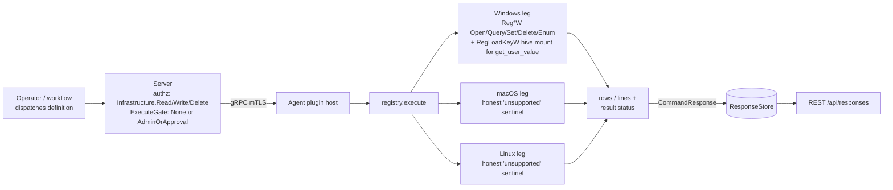

# registry

<!-- BEGIN GENERATED: plugin-doc-gen header -->
| | |
|---|---|
| **What it does** | Windows Registry — get, set, delete, enumerate keys and values |
| **Version** | 1.0.0 |
| **Kind** | Action · mutating · on-demand |
| **Platforms** | Windows ✅ · macOS ⛔ unsupported · Linux ⛔ unsupported |
| **Actions** | `delete_key` (definition `windows.registry.delete_key`) · `delete_value` (definition `windows.registry.delete_value`) · `enumerate_keys` (definition `windows.registry.enumerate_keys`) · `enumerate_values` (definition `windows.registry.enumerate_values`) · `get_user_value` (definition `windows.registry.get_user_value`) · `get_value` (definition `windows.registry.get_value`) · `key_exists` (definition `windows.registry.key_exists`) · `list_profiles` (definition `windows.registry.list_profiles`) · `set_value` (definition `windows.registry.set_value`) |
| **Security** | `get_value`: securable `Infrastructure` · operation Read · risk Low · dispatch ReadOnly · approval gate None; `set_value`: securable `Infrastructure` · operation Write · risk Medium · dispatch Mutating · approval gate AdminOrApproval; `delete_value`: securable `Infrastructure` · operation Delete · risk High · dispatch Destructive · approval gate AdminOrApproval; `delete_key`: securable `Infrastructure` · operation Delete · risk Critical · dispatch Destructive · approval gate AdminOrApproval; `key_exists`: securable `Infrastructure` · operation Read · risk Low · dispatch ReadOnly · approval gate None; `enumerate_keys`: securable `Infrastructure` · operation Read · risk Low · dispatch ReadOnly · approval gate None; `enumerate_values`: securable `Infrastructure` · operation Read · risk Low · dispatch ReadOnly · approval gate None; `get_user_value`: securable `Infrastructure` · operation Read · risk Medium · dispatch ReadOnly · approval gate AdminOrApproval; `list_profiles`: securable `Infrastructure` · operation Read · risk Low · dispatch ReadOnly · approval gate None |
| **Roles** | execute: endpoint-admin, endpoint-operator · author: content-author |
<!-- END GENERATED -->

## How it works

All nine actions are direct, synchronous Win32 registry calls — there is no scheduled gather. `get_value`/`key_exists`/`enumerate_keys`/`enumerate_values` open a key read-only and read or list it; `set_value` opens the key with `KEY_WRITE` (creating it if absent); `delete_value`/`delete_key` open with `KEY_SET_VALUE` or call `RegDeleteKeyW` directly. Every one of these six validates `hive`+`key` through one shared `parse_params` helper, which also logs (never blocks) access to a small set of sensitive `HKLM` subtrees (`...CurrentVersion\Run*`, `...Services`) via `spdlog::info` — an audit trail, not a policy gate.

`get_user_value` is the odd one out: it resolves the target profile through the same `ProfileList` walk `list_profiles` exposes as its own action, reads the live `HKEY_USERS\<SID>` hive if the user is logged in, and only falls back to an offline `RegLoadKeyW` mount of that profile's `NTUSER.DAT` — under `SeBackup`/`SeRestore` privilege and a process-wide mutex serialising the whole offline arm — when the user is logged out. `list_profiles` is the discovery step the other per-user action needs: SID, resolved name, path, and live hive-load state, with the three well-known system SIDs filtered out.

The plugin deliberately does **not** decode `REG_MULTI_SZ`/`REG_LINK` *values* on `get_value`/`enumerate_values` — both are left hex-encoded there, unlike `get_user_value`, which decodes both; closing that gap would change `get_value`'s output shape for existing callers and is out of scope for this plugin as it stands. On macOS/Linux every action honestly reports `registry|unsupported|...` — reads return rc 0 (an honest "unsupported" read is itself a successful read) and the three mutators return rc 1 (a state-changing action that touched nothing must never report SUCCESS).



## OS capability

<!-- BEGIN GENERATED: plugin-doc-gen capability -->
| Action | Windows | macOS | Linux |
|---|---|---|---|
| `delete_key` | ✅ supported · rung 1 · win32_registry | ⛔ unsupported | ⛔ unsupported |
| `delete_value` | ✅ supported · rung 1 · win32_registry | ⛔ unsupported | ⛔ unsupported |
| `enumerate_keys` | ✅ supported · rung 1 · win32_registry | ⛔ unsupported | ⛔ unsupported |
| `enumerate_values` | ✅ supported · rung 1 · win32_registry | ⛔ unsupported | ⛔ unsupported |
| `get_user_value` | ✅ supported · rung 1 · win32_registry+hive_mount | ⛔ unsupported | ⛔ unsupported |
| `get_value` | ✅ supported · rung 1 · win32_registry | ⛔ unsupported | ⛔ unsupported |
| `key_exists` | ✅ supported · rung 1 · win32_registry | ⛔ unsupported | ⛔ unsupported |
| `list_profiles` | ✅ supported · rung 1 · win32_registry | ⛔ unsupported | ⛔ unsupported |
| `set_value` | ✅ supported · rung 1 · win32_registry | ⛔ unsupported | ⛔ unsupported |
<!-- END GENERATED -->

## Privileges and prerequisites

| OS | Runs as | Extra grant needed | Measured | If the read is refused |
|---|---|---|---|---|
| Windows | agent service account (LocalSystem today, #1442) | `set_value`/`delete_value`/`delete_key` against `HKLM\*` need the service account in `Administrators`; `HKCU\*` needs no elevation. `get_user_value`'s offline-hive fallback needs `SeBackupPrivilege`+`SeRestorePrivilege`, already granted to the service account — no new grant; its live-hive path and `list_profiles` need no elevated privilege at all. | 2026-09-07, bare-metal, as `SYSTEM` | `error\|key not found` / `error\|value not found` (reads); `error\|failed to open/create key` / `error\|failed to delete key` (writes/deletes) — Win32 does not distinguish "access denied" from "does not exist" in these two messages |
| macOS | n/a — plugin loads but every action is the honest `unsupported` leg | n/a | 2026-09-07, bare-metal, euid 501 (alex) | always `registry\|unsupported\|Windows registry has no macOS equivalent; use defaults/plists`, rc 0 (reads) / rc 1 (mutators) |
| Linux | n/a — plugin loads but every action is the honest `unsupported` leg | n/a | 2026-09-07, container, euid 0 | always `registry\|unsupported\|Windows registry is not available on this platform`, rc 0 (reads) / rc 1 (mutators) |

No external binaries, no subprocesses, no network access — every call is an in-process Win32 `Reg*W`/`AdjustTokenPrivileges` call (`registry_plugin.cpp`, `agents/shared/win_profiles.hpp`, `agents/shared/win_reg_handle.hpp`).

**`HKCU` is a per-process alias, not a real hive.** `parse_hive` maps `"HKCU"` straight to the predefined handle `HKEY_CURRENT_USER` (`registry_plugin.cpp:78`), which Win32 resolves against the calling process's own token rather than any hive path the plugin names. The agent runs as `SYSTEM`/LocalSystem with no interactively logged-on user context, so every `hive=HKCU` call in this plugin resolves to `HKEY_USERS\.DEFAULT` — the Windows sample's `Software\YuzuCaptureTmp` scratch key (`set_value`/`delete_value`/`delete_key`, above) lived under `.DEFAULT`, not any real user's profile. An operator who needs a specific user's hive must use `get_user_value` (or `list_profiles` + an explicit `sid`), never `hive=HKCU`.

## Data contract

### Inputs

<!-- BEGIN GENERATED: plugin-doc-gen inputs -->
| Definition | Parameter | Type | Required | Default | Constraints | Description |
|---|---|---|---|---|---|---|
| `windows.registry.delete_key` | `hive` | string | yes | - | enum: HKLM, HKCU, HKCR, HKU | Registry hive containing the key, e.g. "HKCU". |
| `windows.registry.delete_key` | `key` | string | yes | - | - | Registry key path to delete, relative to the hive root. |
| `windows.registry.delete_value` | `hive` | string | yes | - | enum: HKLM, HKCU, HKCR, HKU | Registry hive containing the value, e.g. "HKCU". |
| `windows.registry.delete_value` | `key` | string | yes | - | - | Registry key path containing the value, relative to the hive root. |
| `windows.registry.delete_value` | `name` | string | yes | - | - | The value name to delete. |
| `windows.registry.enumerate_keys` | `hive` | string | yes | - | enum: HKLM, HKCU, HKCR, HKU | Registry hive to enumerate, e.g. "HKLM". |
| `windows.registry.enumerate_keys` | `key` | string | yes | - | - | Registry key path relative to the hive root, e.g. "SOFTWARE\\Microsoft\\Windows NT\\CurrentVersion". |
| `windows.registry.enumerate_values` | `hive` | string | yes | - | enum: HKLM, HKCU, HKCR, HKU | Registry hive to enumerate, e.g. "HKLM". |
| `windows.registry.enumerate_values` | `key` | string | yes | - | - | Registry key path relative to the hive root. |
| `windows.registry.get_user_value` | `username` | string | no | - | maxLength 256 | Windows profile folder name to resolve via ProfileList (see list_profiles), matched case-insensitively. This is not always the same as the account name (renamed accounts, domain profiles). Either username or sid is required; sid takes precedence if both are given. |
| `windows.registry.get_user_value` | `sid` | string | no | - | maxLength 256 | Windows security identifier (e.g., "S-1-5-21-...-1001") of the target profile, as an alternative to username. Must match one of the profiles list_profiles would report; a sid not found there is rejected. Either username or sid is required. |
| `windows.registry.get_user_value` | `key` | string | yes | - | maxLength 1024 | Registry key path relative to the resolved user's hive root (e.g., "Software\\Microsoft\\Windows\\CurrentVersion\\Explorer"). |
| `windows.registry.get_user_value` | `name` | string | no | - | maxLength 256 | The registry value name to read. |
| `windows.registry.get_value` | `hive` | string | yes | - | enum: HKLM, HKCU, HKCR, HKU | Registry hive to read from, e.g. "HKLM". |
| `windows.registry.get_value` | `key` | string | yes | - | - | Registry key path relative to the hive root, e.g. "SOFTWARE\\Microsoft\\Windows NT\\CurrentVersion". |
| `windows.registry.get_value` | `name` | string | yes | - | - | The value name to read, e.g. "ProductName". |
| `windows.registry.key_exists` | `hive` | string | yes | - | enum: HKLM, HKCU, HKCR, HKU | Registry hive to check, e.g. "HKLM". |
| `windows.registry.key_exists` | `key` | string | yes | - | - | Registry key path relative to the hive root. |
| `windows.registry.set_value` | `hive` | string | yes | - | enum: HKLM, HKCU, HKCR, HKU | Registry hive to write to, e.g. "HKCU". |
| `windows.registry.set_value` | `key` | string | yes | - | - | Registry key path relative to the hive root; created if it does not already exist, e.g. "Software\\MyApp". |
| `windows.registry.set_value` | `name` | string | yes | - | - | The value name to write, e.g. "InstallPath". |
| `windows.registry.set_value` | `value` | string | yes | - | - | The value data to write, as text; interpreted per `type` (decimal digits for REG_DWORD, literal text for REG_SZ). |
| `windows.registry.set_value` | `type` | string | no | - | enum: REG_SZ, REG_DWORD | Registry value type to write. Defaults to REG_SZ when omitted. |
<!-- END GENERATED -->

### Outputs

This plugin does not emit a uniform pipe-joined "row"; each action has its own shape. `get_value`, `get_user_value`, `key_exists`, `set_value`, `delete_value` and `delete_key` each write one self-describing `field_name|value` line per field, on success only — a failure instead writes an `error|...` line and returns rc 1, so `-` is never used as an absence placeholder anywhere in this plugin. `enumerate_keys` writes one `subkey|<name>` line per subkey; a genuinely empty key emits zero lines with rc 0 (a key that cannot be opened at all instead reports `error|key not found`, rc 1). `enumerate_values` writes one line per value shaped `value|<name>|<type>` — the leading `value` is a fixed literal tag, not one of the two documented columns (`name`, `type`); see Caveats. `list_profiles` writes one true pipe-joined row per profile (`<sid>|<name>|<path>|<state>`, no discriminator prefix) and zero rows is a structural success, not an error, when the host has no non-system profiles.

<!-- BEGIN GENERATED: plugin-doc-gen outputs -->
**`windows.registry.delete_key` — `status`**

| Field | Type | Values | Available | Example | Description |
|---|---|---|---|---|---|
| `status` | string | - | Windows | `ok` | Confirms the delete succeeded; only ever emitted on success — a failure is reported as an `error\|` line and a non-zero exit instead of this column. Values: ok. |

**`windows.registry.delete_value` — `status`**

| Field | Type | Values | Available | Example | Description |
|---|---|---|---|---|---|
| `status` | string | - | Windows | `ok` | Confirms the delete succeeded; only ever emitted on success — a failure is reported as an `error\|` line and a non-zero exit instead of this column. Values: ok. |

**`windows.registry.enumerate_keys` — `subkey`**

| Field | Type | Values | Available | Example | Description |
|---|---|---|---|---|---|
| `subkey` | string | - | Windows | `ProfileList` | One immediate subkey name under the given key; zero rows means the key has no subkeys. Values: free text. |

**`windows.registry.enumerate_values` — `name|type`**

| Field | Type | Values | Available | Example | Description |
|---|---|---|---|---|---|
| `name` | string | - | Windows | `ProductName` | The value's name; zero rows means the key has no values. Values: free text. |
| `type` | string | - | Windows | `REG_SZ` | The value's registry type, named via the shared type table shared with get_value and get_user_value. Values: REG_SZ, REG_EXPAND_SZ, REG_DWORD, REG_QWORD, REG_BINARY, REG_MULTI_SZ, REG_NONE, REG_LINK, REG_DWORD_BIG_ENDIAN, REG_UNKNOWN. |

**`windows.registry.get_user_value` — `username|value|type`**

| Field | Type | Values | Available | Example | Description |
|---|---|---|---|---|---|
| `username` | string | - | Windows | `alex` | The resolved profile display name the value was read from — falls back to the caller's own username/sid input, then the resolved sid, but is never fabricated and never empty (ADR-0024 D11). Values: free text. |
| `value` | string | - | Windows | `1` | The value's data, decoded the same way get_value decodes it, plus REG_MULTI_SZ (records semicolon-joined) and REG_LINK (target string) — the two types get_value leaves hex-encoded — both sanitised against '\|'/CR/LF so a value cannot forge a column or row. Values: free text. |
| `type` | string | - | Windows | `REG_DWORD` | The registry value type, named via the shared type table. Values: REG_SZ, REG_EXPAND_SZ, REG_DWORD, REG_QWORD, REG_BINARY, REG_MULTI_SZ, REG_NONE, REG_LINK, REG_DWORD_BIG_ENDIAN, REG_UNKNOWN. |

**`windows.registry.get_value` — `value|type`**

| Field | Type | Values | Available | Example | Description |
|---|---|---|---|---|---|
| `value` | string | - | Windows | `Windows 10 Pro` | The value's data, decoded to a display string. Never truncated or fabricated; a value over the registry's own limits fails the action rather than returning a partial string. Values: free text. |
| `type` | string | - | Windows | `REG_SZ` | The registry value type, named via the shared type table shared with get_user_value and enumerate_values. Values: REG_SZ, REG_EXPAND_SZ, REG_DWORD, REG_QWORD, REG_BINARY, REG_MULTI_SZ, REG_NONE, REG_LINK, REG_DWORD_BIG_ENDIAN, REG_UNKNOWN. |

**`windows.registry.key_exists` — `exists`**

| Field | Type | Values | Available | Example | Description |
|---|---|---|---|---|---|
| `exists` | bool | - | Windows | `true` | Whether the key could be opened for read. Values: true, false. |

**`windows.registry.list_profiles` — `sid|profile_name|profile_path|hive_state`**

| Field | Type | Values | Available | Example | Description |
|---|---|---|---|---|---|
| `sid` | string | - | Windows | `S-1-5-21-571721511-16201247-3531262703-1001` | The profile's Windows security identifier. Values: free text (a Windows SID string). |
| `profile_name` | string | - | Windows | `Alex` | The resolved profile folder name (the last path component of ProfileImagePath); rendered "-" when it cannot be resolved — never falls back to the sid (ADR-0024 D11). Values: free text or "-". |
| `profile_path` | string | - | Windows | `C:\Users\Alex` | The profile's ProfileImagePath, environment-expanded; rendered "-" when it is absent or unreadable. Values: free text or "-". |
| `hive_state` | string | - | Windows | `loaded` | Whether the profile's registry hive is reachable right now. Values: loaded, loaded_classes_only, not_loaded. |

**`windows.registry.set_value` — `status`**

| Field | Type | Values | Available | Example | Description |
|---|---|---|---|---|---|
| `status` | string | - | Windows | `ok` | Confirms the write succeeded; only ever emitted on success — a failure is reported as an `error\|` line and a non-zero exit instead of this column. Values: ok. |
<!-- END GENERATED -->

### Result status

This plugin does not set a typed result status; the agent records `UNDECLARED` and every sample shows `UNDECLARED / UNKNOWN /`.

### Where the data goes

- **Instruction result only.** Rows/lines travel over the agent's mTLS gRPC channel as the command response and land in the ResponseStore, queryable at `/api/responses/{id}`.
- **Not consumed by** daily-sync inventory, the TAR warehouse, DEX, or metrics — nothing here runs on a schedule; the plugin executes only when an operator or workflow dispatches one of its nine definitions.
- **Sensitivity.** `get_value`/`enumerate_values`/`get_user_value` can return arbitrary registry data — the real captures above include `ProductName`/`CurrentVersion`/`BuildLab` (installed-software/OS-version identification) and `RegisteredOwner`/`DigitalProductId` (a person's name and a device-specific product-key hash) among the readable values; `get_user_value`'s `username` field and `list_profiles`' `profile_name`/`profile_path` (e.g. `Alex`/`C:\Users\Alex`) directly identify a specific person and their home directory.
- **Siblings:** none. Guardian's own real-time registry-key watch (`guard_type: "registry"`, `spark_fleet_tags.hpp:112`) is an unrelated detection mechanism, not this plugin — this plugin is on-demand CRUD only, with no watch/trigger surface.
- **MCP / REST.** Discover: `discover_plugins` (summary) → `yuzu://plugin-docs` (this page as data) → `discover_instructions` / `get_definition("windows.registry.get_value")`. Run: `execute_instruction {definition_id, parameters}`. Read: `/api/responses/{id}`.

## Sample output

<!-- BEGIN GENERATED: plugin-doc-gen samples -->
**Windows** — captured: windows Microsoft Windows NT 10.0.26200.0 x64 · bare-metal · 2026-09-07 · SYSTEM · leg-hash 6255117edeb8

```
== action=get_value hive=HKLM key="SOFTWARE\Microsoft\Windows NT\CurrentVersion" name=ProductName
value|Windows 10 Pro
type|REG_SZ
[result_status] UNDECLARED / UNKNOWN

== action=set_value hive=HKCU key=Software\YuzuCaptureTmp name=probe value=1
status|ok
[result_status] UNDECLARED / UNKNOWN

== action=delete_value hive=HKCU key=Software\YuzuCaptureTmp name=probe
status|ok
[result_status] UNDECLARED / UNKNOWN

== action=delete_key hive=HKCU key=Software\YuzuCaptureTmp
status|ok
[result_status] UNDECLARED / UNKNOWN

== action=key_exists hive=HKLM key="SOFTWARE\Microsoft\Windows NT\CurrentVersion"
exists|true
[result_status] UNDECLARED / UNKNOWN

== action=enumerate_keys hive=HKLM key="SOFTWARE\Microsoft\Windows NT\CurrentVersion"
subkey|Accessibility
subkey|AdaptiveDisplayBrightness
subkey|AeDebug
subkey|AppCompatFlags
subkey|ASR
subkey|Audit
subkey|BackgroundModel
subkey|ClipSVC
subkey|Compatibility32
subkey|Console
subkey|Containers
subkey|CorruptedFileRecovery
… 12 of 99 rows shown
[result_status] UNDECLARED / UNKNOWN

== action=enumerate_values hive=HKLM key="SOFTWARE\Microsoft\Windows NT\CurrentVersion"
value|SystemRoot|REG_SZ
value|BaseBuildRevisionNumber|REG_DWORD
value|BuildBranch|REG_SZ
value|BuildGUID|REG_SZ
value|BuildLab|REG_SZ
value|BuildLabEx|REG_SZ
value|CompositionEditionID|REG_SZ
value|CurrentBuild|REG_SZ
value|CurrentBuildNumber|REG_SZ
value|CurrentMajorVersionNumber|REG_DWORD
value|CurrentMinorVersionNumber|REG_DWORD
value|CurrentType|REG_SZ
… 12 of 32 rows shown
[result_status] UNDECLARED / UNKNOWN

== action=get_user_value username=alex key=Software\Microsoft\Windows\CurrentVersion\Explorer\Advanced name=Hidden
username|alex
value|1
type|REG_DWORD
[result_status] UNDECLARED / UNKNOWN

== action=list_profiles
S-1-5-21-571721511-16201247-3531262703-1001|Alex|C:\Users\Alex|loaded
[result_status] UNDECLARED / UNKNOWN
```

**macOS** — captured: macos macOS 26.6.2 arm64 · bare-metal · 2026-09-07 · euid 501 (alex) · leg-hash 6255117edeb8

```
== action=get_value hive=HKLM key="SOFTWARE\Microsoft\Windows NT\CurrentVersion" name=ProductName
registry|unsupported|Windows registry has no macOS equivalent; use defaults/plists
[result_status] UNDECLARED / UNKNOWN

== action=set_value hive=HKCU key=Software\YuzuCaptureTmp name=probe value=1
registry|unsupported|Windows registry has no macOS equivalent; use defaults/plists
[result_status] UNDECLARED / UNKNOWN
[rc] 1

== action=delete_value hive=HKCU key=Software\YuzuCaptureTmp name=probe
registry|unsupported|Windows registry has no macOS equivalent; use defaults/plists
[result_status] UNDECLARED / UNKNOWN
[rc] 1

== action=delete_key hive=HKCU key=Software\YuzuCaptureTmp
registry|unsupported|Windows registry has no macOS equivalent; use defaults/plists
[result_status] UNDECLARED / UNKNOWN
[rc] 1

== action=key_exists hive=HKLM key="SOFTWARE\Microsoft\Windows NT\CurrentVersion"
registry|unsupported|Windows registry has no macOS equivalent; use defaults/plists
[result_status] UNDECLARED / UNKNOWN

== action=enumerate_keys hive=HKLM key="SOFTWARE\Microsoft\Windows NT\CurrentVersion"
registry|unsupported|Windows registry has no macOS equivalent; use defaults/plists
[result_status] UNDECLARED / UNKNOWN

== action=enumerate_values hive=HKLM key="SOFTWARE\Microsoft\Windows NT\CurrentVersion"
registry|unsupported|Windows registry has no macOS equivalent; use defaults/plists
[result_status] UNDECLARED / UNKNOWN

== action=get_user_value username=alex key=Software\Microsoft\Windows\CurrentVersion\Explorer\Advanced name=Hidden
registry|unsupported|Windows registry has no macOS equivalent; use defaults/plists
[result_status] UNDECLARED / UNKNOWN

== action=list_profiles
registry|unsupported|Windows registry has no macOS equivalent; use defaults/plists
[result_status] UNDECLARED / UNKNOWN
```

**Linux** — captured: linux Debian GNU/Linux 13 (trixie) aarch64 · container · 2026-09-07 · euid 0 · leg-hash 6255117edeb8

```
== action=get_value hive=HKLM key="SOFTWARE\Microsoft\Windows NT\CurrentVersion" name=ProductName
registry|unsupported|Windows registry is not available on this platform
[result_status] UNDECLARED / UNKNOWN

== action=set_value hive=HKCU key=Software\YuzuCaptureTmp name=probe value=1
registry|unsupported|Windows registry is not available on this platform
[result_status] UNDECLARED / UNKNOWN
[rc] 1

== action=delete_value hive=HKCU key=Software\YuzuCaptureTmp name=probe
registry|unsupported|Windows registry is not available on this platform
[result_status] UNDECLARED / UNKNOWN
[rc] 1

== action=delete_key hive=HKCU key=Software\YuzuCaptureTmp
registry|unsupported|Windows registry is not available on this platform
[result_status] UNDECLARED / UNKNOWN
[rc] 1

== action=key_exists hive=HKLM key="SOFTWARE\Microsoft\Windows NT\CurrentVersion"
registry|unsupported|Windows registry is not available on this platform
[result_status] UNDECLARED / UNKNOWN

== action=enumerate_keys hive=HKLM key="SOFTWARE\Microsoft\Windows NT\CurrentVersion"
registry|unsupported|Windows registry is not available on this platform
[result_status] UNDECLARED / UNKNOWN

== action=enumerate_values hive=HKLM key="SOFTWARE\Microsoft\Windows NT\CurrentVersion"
registry|unsupported|Windows registry is not available on this platform
[result_status] UNDECLARED / UNKNOWN

== action=get_user_value username=alex key=Software\Microsoft\Windows\CurrentVersion\Explorer\Advanced name=Hidden
registry|unsupported|Windows registry is not available on this platform
[result_status] UNDECLARED / UNKNOWN

== action=list_profiles
registry|unsupported|Windows registry is not available on this platform
[result_status] UNDECLARED / UNKNOWN
```
<!-- END GENERATED -->

## Caveats and known gaps

1. **`enumerate_values`'s wire format carries an undocumented literal tag.** Each line is `value|<name>|<type>` (`registry_plugin.cpp:383`), but the definition's `result.columns` lists only `name` and `type` — the leading `value` segment is a fixed literal, not a third data column, and a naive "split on the declared column count" parser will misread every row by one field.
2. **`get_value`/`enumerate_values` do not decode `REG_MULTI_SZ`/`REG_LINK` values; `get_user_value` does.** Both fall to the hex-dump default branch on the first two actions (`registry_plugin.cpp:277-280`) but are decoded (semicolon-joined records / sanitised target string) on the third via the shared `read_reg_value` (`agents/shared/win_profiles.hpp:660-742`). This is a declared, deliberate inconsistency (`catalog.md`'s value-type notes) — closing it changes `get_value`'s output for existing callers and is out of scope here.
3. **`set_value`/`delete_value`/`delete_key` cannot distinguish "access denied" from "does not exist" in their error text.** `do_set_value`'s `RegCreateKeyExW` failure always reports `error|failed to open/create key` (`registry_plugin.cpp:296-299`) and `do_delete_value`'s `RegOpenKeyExW` failure always reports `error|key not found` (`registry_plugin.cpp:324-326`) regardless of the underlying `LSTATUS` — unlike `get_user_value`'s ladder, which does separate `key_access_denied` from `key_not_found` (`agents/shared/user_profile_model.hpp:266-278`).
4. **`PrivilegeScope`'s `AdjustTokenPrivileges` call must keep its `ReturnLength` argument.** A prior version omitted it and the call failed with `ERROR_NOACCESS` on every invocation, so the offline per-user hive fallback silently never enabled `SeBackup`/`SeRestore` from the plugin's initial ship until #2771 (`agents/shared/win_profiles.hpp:358-371`, `changelog.d/2771-privilegescope-token-adjust-bug.fixed.md`) — do not "simplify" that call signature.
5. **The `get_user_value` capture exercised the live-hive path, not the offline mount.** `list_profiles` in the same Windows capture reports the target SID's `hive_state` as `loaded`, so `with_user_hive`'s first `RegOpenKeyExW(HKEY_USERS, <sid>, ...)` succeeded and the offline `RegLoadKeyW`/`SeBackup`+`SeRestore` fallback (`win_profiles.hpp:495-534`) was never reached — this sample does not exercise that branch, the unload-warning line, or the `mount_failed`/`privilege_missing` error text.

## Source and tests

<!-- BEGIN GENERATED: plugin-doc-gen source -->
- Plugin: `agents/plugins/registry/src/registry_plugin.cpp`
- Definitions: `content/definitions/registry.yaml`
- Capability rows: `server/core/src/capability_decls/plugin_action_catalogue_a.hpp`
- Tests: `tests/unit/test_registry_local_dispatcher.cpp`
- Privilege row: `docs/agent-privilege-model.md`
- Changelog: `changelog.d/1.9-command-capability-registry.added.md` · `changelog.d/1328-update-registry-postgres.changed.md` · `changelog.d/20260803-registry-list-profiles.added.md` · `changelog.d/20260803-registry-user-hive-fix.fixed.md` · `changelog.d/20260818-wave3-antivirus-native-wmi-registry.changed.md` · `changelog.d/2204-descriptor-seam-and-registry-sections.added.md` · `changelog.d/3386-spark-legacy-delta-registry.added.md`
<!-- END GENERATED -->
