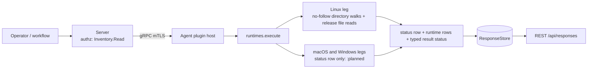

# runtimes

<!-- BEGIN GENERATED: plugin-doc-gen header -->
| | |
|---|---|
| **What it does** | Installed .NET and JVM runtime inventory |
| **Version** | 1.0.0 |
| **Kind** | Collector · read-only · gathered (crossplatform.runtimes.dotnet, crossplatform.runtimes.jvm) |
| **Platforms** | Windows 🟡 planned · macOS 🟡 planned · Linux ✅ |
| **Actions** | `dotnet` (definition `crossplatform.runtimes.dotnet`) · `jvm` (definition `crossplatform.runtimes.jvm`) |
| **Security** | securable `Inventory` · operation Read · risk Low · dispatch ReadOnly · approval gate None |
| **Roles** | execute: endpoint-admin, endpoint-operator · author: content-author |
<!-- END GENERATED -->

## How it works

`dotnet` and `jvm` each answer one software-inventory question: which language runtimes are installed on this host. The Linux leg walks the standard install roots with no-follow directory opens and reads metadata files only: `dotnet` lists `shared/<framework>/<version>` and `sdk/<version>` directory names under `/usr/share/dotnet`, `/usr/lib/dotnet` and `/usr/lib64/dotnet`; `jvm` reads the `release` file of every home under `/usr/lib/jvm` and `/opt/java`. The plugin is zero-subprocess: no `java` or `dotnet` process is ever run, and every fact is a directory name or a file the runtime's installer laid down. Every action writes one `status` row first, then zero or more runtime rows, so an empty list is never inferred from silence. The plugin is read-only and is a different view from `installed_apps`: a .NET runtime and a JDK are not discrete packaged-application entries.

Two drivers stand behind the plugin, quoted from the repository's own decision records. ADR-0028 (agent component inventory), Decision 1(b): *"Embedded-runtime (Electron/Chromium/Node) detection... This is the single largest silent-false-negative class on a corporate fleet (Slack, Teams, Discord, VS Code) — the parent app's own version reflects none of the embedded runtime's CVE surface."* ADR-0024 (software licensing and entitlements), independently: *"runtimes — vendor/distribution/version, Oracle JDK vs the OpenJDK builds..."* Read plainly: this plugin inventories installed .NET and JVM runtimes; it does not detect Electron, Chromium or Node runtimes embedded inside applications, which is the ADR-0028 case that shares its ancestry. The `vendor` field of `jvm` is the licensing-audit fact.



## OS capability

<!-- BEGIN GENERATED: plugin-doc-gen capability -->
| Action | Windows | macOS | Linux |
|---|---|---|---|
| `dotnet` | 🟡 planned · rung 1 · NDP release-key table + dotnet InstalledVersions + Program Files walk | 🟡 planned · rung 1 · /usr/local/share/dotnet/shared walk | ✅ supported · rung 1 · /usr/share/dotnet, /usr/lib/dotnet, /usr/lib64/dotnet shared/<framework>/<version> and sdk/<version> directory walk |
| `jvm` | 🟡 planned · rung 1 · JavaSoft keys + Program Files\\Java walk | 🟡 planned · rung 1 · /Library/Java/JavaVirtualMachines/*/Contents/Info.plist JavaVM dict + Contents/Home/release | ✅ supported · rung 1 · /usr/lib/jvm/*/release + /opt/java/*/release file reads |

**Declared limits per leg** (descriptor fallback text, verbatim):

- **`dotnet` / Windows** — follows as its own PR (peripherals PR9.1a2 precedent)
- **`dotnet` / macOS** — follows as its own PR (peripherals PR9.1a2 precedent)
- **`jvm` / Windows** — follows as its own PR (peripherals PR9.1a2 precedent)
- **`jvm` / macOS** — follows as its own PR (peripherals PR9.1a2 precedent)
<!-- END GENERATED -->

## Privileges and prerequisites

| OS | Runs as | Extra grant needed | Measured | If the read is refused |
|---|---|---|---|---|
| Windows | n/a — the leg reads nothing (caveat 1) | n/a | n/a | `status\|<action>\|unsupported\|windows:planned`, result status `UNAVAILABLE` |
| macOS | n/a — the leg reads nothing (caveat 1) | n/a | n/a | `status\|<action>\|unsupported\|macos:planned`, result status `UNAVAILABLE` |
| Linux | agent daemon, dedicated unprivileged account (`yuzu`), never root by design (`docs/agent-privilege-model.md:12`) | None expected — stock install trees under `/usr` and `/opt` are world-readable (0755 directories, 0644 `release` files); not measured as `yuzu` (see Measured) | fixture captures of the walked trees (`tests/unit/fixtures/wave10/runtimes/linux/provenance.txt`); the live-agent capture `docs/samples/linux.txt` ran as `euid 0` in a container, so the unprivileged read is asserted from file modes, not observed | `status\|<action>\|constrained\|linux:runtimes:permission_denied`; rows read before the refusal are still returned, and a later readable root never hides it |

No external binaries, no subprocesses, no shell-out, no network use: the plugin opens directories and reads files only. Every directory is opened `O_NOFOLLOW` hop by hop and enumerated with a per-directory entry cap; the `release` read is bounded to 64 KiB.

## Data contract

### Inputs

<!-- BEGIN GENERATED: plugin-doc-gen inputs -->
Neither action takes parameters.
<!-- END GENERATED -->

### Outputs

Every row is pipe-delimited. The first row is always `status|<action>|<level>|<reason>` (`level` is `supported`, `constrained` or `unsupported`; `reason` is comma-joined tokens, or `-`). Runtime rows follow as `<action>|<flavour>|<version>|<install_path>|<vendor>`, one per runtime found; the leading action name is the row discriminator and is not a column below. `supported` with zero runtime rows means the runtime family is genuinely absent from the host; `constrained` means a read failed and the rows may be incomplete, so failure never reads as absent. A field the host did not supply is `-`, and every flavour mapper has a named `unmodelled` value distinct from no data. Free-text fields (`version`, `install_path`, `vendor`) go through `yuzu::util::safe_output_field`, so a value containing a pipe or ending in a backslash cannot shift the field count on the server's escape-aware decoder. `runtimes` is not in the server's `kKeyValuePlugins` set (`server/core/src/result_parsing.hpp`), so its rows are not decoded as two-cell key and value rows.

<!-- BEGIN GENERATED: plugin-doc-gen outputs -->
**`crossplatform.runtimes.dotnet` — `row_kind|flavour|version|install_path|vendor`**

| Field | Type | Values | Available | Example | Description |
|---|---|---|---|---|---|
| `row_kind` | string | `status` `dotnet` | Linux | `dotnet` | Row shape discriminator (the wire row's leading tag). Values: status (exactly one per result, always first), dotnet (one per runtime found). |
| `flavour` | string | `core` `sdk` `unmodelled` | Linux | `core` | Runtime kind. Values: core (a Microsoft.NETCore.App, Microsoft.AspNetCore.App or Microsoft.WindowsDesktop.App shared framework), sdk (an SDK install), unmodelled (any other shared-framework name — reported, never dropped). Status rows: the action name. |
| `version` | string | - | Linux | `8.0.31` | Version taken from the install directory name (e.g. 8.0.31, or a preview build such as 9.0.100-preview.1.24101.2). Status rows: the level (supported, constrained or unsupported). |
| `install_path` | string | - | Linux | `/usr/share/dotnet/shared/Microsoft.NETCore.App/8.0.31` | Absolute path of the framework or SDK version directory the version was read from. Status rows: the comma-joined failure tokens, or -. |
| `vendor` | string | - | Linux | `-` | Always "-" for dotnet: the install tree carries no vendor field. |

**`crossplatform.runtimes.jvm` — `row_kind|flavour|version|install_path|vendor`**

| Field | Type | Values | Available | Example | Description |
|---|---|---|---|---|---|
| `row_kind` | string | `status` `jvm` | Linux | `jvm` | Row shape discriminator (the wire row's leading tag). Values: status (exactly one per result, always first), jvm (one per runtime found). |
| `flavour` | string | `jdk` `jre` `unmodelled` | Linux | `jdk` | Image kind from the IMAGE_TYPE key of the release file. Values: jdk, jre, unmodelled (the file does not say — the Debian OpenJDK release file has no IMAGE_TYPE — and the path gives no hint; never guessed). Status rows: the action name. |
| `version` | string | - | Linux | `17.0.20` | JAVA_VERSION from the release file, falling back to JAVA_RUNTIME_VERSION; "-" when neither is present. Status rows: the level (supported, constrained or unsupported). |
| `install_path` | string | - | Linux | `/opt/java/openjdk` | Absolute path of the JVM home directory (the directory holding the release file). Status rows: the comma-joined failure tokens, or -. |
| `vendor` | string | - | Linux | `Eclipse Adoptium` | IMPLEMENTOR from the release file (e.g. Eclipse Adoptium, Debian), or "-" when the key is absent. |
<!-- END GENERATED -->

### Result status

Every read sets a typed result status; a degraded read is `CONSTRAINED`, never an empty `OK`.

| Status | Completeness | Provenance | When |
|---|---|---|---|
| `OK` | full | (empty) | Linux: the read finished with no failure, populated or genuinely absent (`status\|<action>\|supported\|-`, zero rows when the family is not installed) |
| `CONSTRAINED` | partial | `linux:runtimes:permission_denied` / `linux:runtimes:symlink_refused` / `linux:runtimes:not_a_directory` / `linux:runtimes:dir_open_failed` / `linux:runtimes:stat_failed` / `linux:runtimes:read_failed` / `linux:runtimes:truncated` / `linux:runtimes:not_a_regular_file` / `linux:runtimes:release_oversize` / `linux:runtimes:release_unparsable` / `internal_error` | Linux: one or more reads failed, was refused, or hit a cap, and the rows returned may be incomplete; the tokens of every root are accumulated and comma-joined in the status row. `internal_error` is a caught exception on any leg and never crosses the plugin boundary |
| `UNAVAILABLE` | partial | `macos:planned` / `windows:planned` | macOS and Windows: the leg is not shipped; the action answers `status\|<action>\|unsupported\|<os>:planned` and nothing else |

### Where the data goes

- **Instruction result.** Every row is server instruction-result data — the standard retention policy, served over REST `/api/responses`. Nothing here is a durable server-side table of its own.
- **Not consumed by** daily-sync, TAR, DEX, or metrics — the plugin runs only on an explicit instruction dispatch and there is no agent daily-sync source for runtimes.
- **Sensitivity.** Rows name installed runtimes with their exact version, install path and vendor, which is a patch-level and licensing-relevant software inventory for the device. The Linux leg reads only fixed system roots (`/usr`, `/opt`), so no user-profile path or account name appears in a row.
- **Siblings:** `crossplatform.runtimes.dotnet`, `crossplatform.runtimes.jvm`.

## Sample output

<!-- BEGIN GENERATED: plugin-doc-gen samples -->
**Linux** — captured: linux Debian GNU/Linux 13 (trixie) aarch64 · container · 2026-09-21 · euid 0 · leg-hash cb47e7132f69

```
== action=dotnet
status|dotnet|supported|-
[result_status] OK / FULL

== action=jvm
status|jvm|supported|-
[result_status] OK / FULL
```
<!-- END GENERATED -->

## Caveats and known gaps

1. **macOS and Windows legs are planned.** Only the Linux leg ships; on macOS and Windows every action reads nothing and answers `status|<action>|unsupported|<os>:planned`. .NET Framework (the Windows registry family) arrives with the Windows leg, and the flavour vocabulary above is the Linux subset until then.
2. **Runtimes reachable only through an alias entry are not listed.** A framework, version or JVM home entry that is itself a symlink (Debian `default-java`, Fedora `java`) is skipped silently because its real directory is a sibling entry; a runtime reachable only through such a link is missed. A symlink at a candidate root that is not a same-action alias is a `symlink_refused` constraint, not a skip.
3. **Only standard locations are walked.** A runtime installed elsewhere (a version manager under a home directory, a tarball unpacked to a custom prefix) is not found, by design: the plugin does not search user profiles.

## Source and tests

<!-- BEGIN GENERATED: plugin-doc-gen source -->
- Plugin: `agents/plugins/runtimes/src/runtimes_legs.hpp` · `agents/plugins/runtimes/src/runtimes_linux.cpp` · `agents/plugins/runtimes/src/runtimes_linux_parsers.hpp` · `agents/plugins/runtimes/src/runtimes_macos.cpp` · `agents/plugins/runtimes/src/runtimes_parsers.hpp` · `agents/plugins/runtimes/src/runtimes_plugin.cpp` · `agents/plugins/runtimes/src/runtimes_win.cpp`
- Definitions: `content/definitions/runtimes.yaml`
- Capability rows: `server/core/src/capability_decls/plugin_action_catalogue_runtimes.hpp`
- Tests: `tests/unit/test_runtimes_linux_parsers.cpp` · `tests/unit/test_runtimes_local_dispatcher.cpp` · `tests/unit/test_runtimes_parsers.cpp`
- Privilege row: `docs/agent-privilege-model.md`
- Changelog: `changelog.d/wave10-pr10.1b-runtimes.added.md`
<!-- END GENERATED -->
