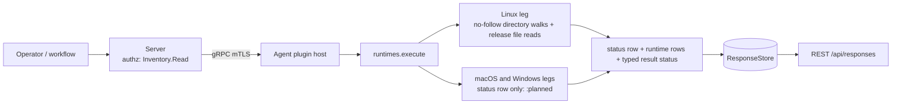

# runtimes

<!-- BEGIN GENERATED: plugin-doc-gen header -->
| | |
|---|---|
| **What it does** | Installed .NET and JVM runtime inventory |
| **Version** | 1.0.0 |
| **Kind** | Collector · read-only · gathered (crossplatform.runtimes.dotnet, crossplatform.runtimes.jvm) |
| **Platforms** | Windows 🟡 planned · macOS 🟡 planned · Linux ✅ |
| **Actions** | `dotnet` (definition `crossplatform.runtimes.dotnet`) · `jvm` (definition `crossplatform.runtimes.jvm`) |
| **Security** | securable `Inventory` · operation Read · risk Low · dispatch ReadOnly · approval gate None |
| **Roles** | execute: endpoint-admin, endpoint-operator · author: content-author |
<!-- END GENERATED -->

## How it works

`dotnet` and `jvm` each answer one software-inventory question: which language runtimes are installed on this host. The Linux leg walks the standard install roots with no-follow directory opens and reads metadata files only: `dotnet` lists `shared/<framework>/<version>` and `sdk/<version>` directory names under `/usr/share/dotnet`, `/usr/lib/dotnet` and `/usr/lib64/dotnet`; `jvm` reads the `release` file of every home under `/usr/lib/jvm`, `/opt/java`, `/usr/lib64/jvm` (openSUSE, SLES) and `/var/opt/java` (rpm-ostree hosts, where `/opt` links there), and reports a home that has a java binary but no `release` file (some distro OpenJDK 8 packages) with version `-` (its `install_path` names the major, for example `java-8-openjdk-amd64`). A candidate root on, under or containing a network mount is not opened (caveat 5). The plugin is zero-subprocess: no `java` or `dotnet` process is ever run, and every fact is a directory name or a file the runtime's installer laid down. Every action writes one `status` row first, then zero or more runtime rows, so an empty list is never inferred from silence. The plugin is read-only and complements `installed_apps`: it reads the runtime's own install tree, so under those roots it also sees runtimes no package manager owns, and it does no vulnerability matching (a row is presence and the upstream version at read time, not an assessment).

Two decision records sit next to this plugin; it closes neither. ADR-0028 (agent component inventory), Decision 1(b), targets *"Embedded-runtime (Electron/Chromium/Node) detection... This is the single largest silent-false-negative class on a corporate fleet (Slack, Teams, Discord, VS Code) — the parent app's own version reflects none of the embedded runtime's CVE surface."* This plugin inventories installed .NET and JVM runtimes and does not detect embedded ones, and ADR-0028 is itself recorded as accepted but deferred. ADR-0024 (software licensing and entitlements) lists *"Java runtimes — vendor/distribution/version, Oracle JDK vs the OpenJDK builds..."* as a `license_scan` probe tracked by #2112, which stays open. The `vendor` field of `jvm` is the build's self-reported `IMPLEMENTOR` string: an input to a licensing audit, not proof of the licence.



## OS capability

<!-- BEGIN GENERATED: plugin-doc-gen capability -->
| Action | Windows | macOS | Linux |
|---|---|---|---|
| `dotnet` | 🟡 planned · rung 1 · NDP release-key table + dotnet InstalledVersions + Program Files walk | 🟡 planned · rung 1 · /usr/local/share/dotnet/shared walk | ✅ supported · rung 1 · /usr/share/dotnet, /usr/lib/dotnet, /usr/lib64/dotnet shared/<framework>/<version> and sdk/<version> directory walk; network mounts skipped via /proc/self/mountinfo |
| `jvm` | 🟡 planned · rung 1 · JavaSoft keys + Program Files\\Java walk | 🟡 planned · rung 1 · /Library/Java/JavaVirtualMachines/*/Contents/Info.plist JavaVM dict + Contents/Home/release | ✅ supported · rung 1 · <home>/release file reads under /usr/lib/jvm, /opt/java, /usr/lib64/jvm, /var/opt/java (bin/java probe when a home has no release); network mounts skipped via /proc/self/mountinfo |

**Declared limits per leg** (descriptor fallback text, verbatim):

- **`dotnet` / Windows** — planned; the action answers a single unsupported status row on this OS
- **`dotnet` / macOS** — planned; the action answers a single unsupported status row on this OS
- **`jvm` / Windows** — planned; the action answers a single unsupported status row on this OS
- **`jvm` / macOS** — planned; the action answers a single unsupported status row on this OS
<!-- END GENERATED -->

## Privileges and prerequisites

| OS | Runs as | Extra grant needed | Measured | If the read is refused |
|---|---|---|---|---|
| Windows | n/a — the leg reads nothing (caveat 1) | n/a | n/a | `status\|<action>\|unsupported\|windows:planned`, result status `UNAVAILABLE` |
| macOS | n/a — the leg reads nothing (caveat 1) | n/a | n/a | `status\|<action>\|unsupported\|macos:planned`, result status `UNAVAILABLE` |
| Linux | agent daemon, dedicated unprivileged account (`yuzu`), never root by design (`docs/agent-privilege-model.md:12`) | None expected — stock install trees under `/usr`, `/opt` and `/var/opt/java` are world-readable (0755 directories, 0644 `release` files); not measured as `yuzu` (see Measured) | real-capture fixtures of the walked trees (`tests/unit/fixtures/wave10/runtimes/linux/provenance.txt`); the live-agent capture `docs/samples/linux.txt` ran as `euid 0` in a container. The unprivileged read rests on the stock file modes (0755 directories, 0644 `release`, observed on the stock images) and on a probe of the production walk as uid 65534 that returned the same rows as root over stock-mode trees (recorded in this PR's governance ledger, `governance.d/4794-runtimes-plugin.*.jsonl`; not a committed test) | `status\|<action>\|constrained\|linux:runtimes:permission_denied`; rows read before the refusal are still returned, and a later readable root never hides it |

No external binaries, no subprocesses, no shell-out, no network use: the plugin opens directories and reads files only. Every directory is opened `O_NOFOLLOW` hop by hop and enumerated with a per-directory entry cap (16,384); the `release` read is bounded to 64 KiB and each recognised value to 256 bytes; one action's whole walk is bounded to 4,096 rows, 1 MiB of row text and 65,536 directory entries visited (`row_cap`). A candidate root on, under or containing a network mount (by filesystem type, from `/proc/self/mountinfo` read once per dispatch) is not opened and records `network_fs_skipped`: an open on a hard mount whose server is down can block for minutes and pins one of the agent's shared command workers (caveat 5 lists what the guard cannot see).

## Data contract

### Inputs

<!-- BEGIN GENERATED: plugin-doc-gen inputs -->
Neither action takes parameters.
<!-- END GENERATED -->

### Outputs

Every row is pipe-delimited. The first row is always `status|<action>|<level>|<reason>` (`level` is `supported`, `constrained` or `unsupported`; `reason` is comma-joined tokens, or `-`). Runtime rows follow as `<action>|<flavour>|<version>|<install_path>|<vendor>`, one per runtime found; the first field is `row_kind` (`status`, or the action name) and is the first column below. `supported` with zero runtime rows means none was found at the standard roots (caveat 3 lists what is not walked); `constrained` means a read failed or was skipped and the rows may be incomplete, so failure never reads as absent. A field the host did not supply is `-`, and every flavour mapper has a named `unmodelled` value distinct from no data. Free-text fields (`version`, `install_path`, `vendor`) go through `yuzu::util::safe_output_field`, so a value containing a pipe or ending in a backslash cannot shift the field count on the server's escape-aware decoder. `runtimes` is not in the server's `kKeyValuePlugins` set (`server/core/src/result_parsing.hpp`), so its rows are not decoded as two-cell key and value rows.

<!-- BEGIN GENERATED: plugin-doc-gen outputs -->
**`crossplatform.runtimes.dotnet` — `row_kind|flavour|version|install_path|vendor`**

| Field | Type | Values | Available | Example | Description |
|---|---|---|---|---|---|
| `row_kind` | string | `status` `dotnet` | Linux | `dotnet` | Row shape discriminator (the wire row's leading tag). Values: status (exactly one per result, always first), dotnet (one per runtime found). |
| `flavour` | string | `core` `sdk` `unmodelled` | Linux | `core` | Runtime kind. Values: core (a Microsoft.NETCore.App, Microsoft.AspNetCore.App or Microsoft.WindowsDesktop.App shared framework), sdk (an SDK install), unmodelled (any other shared-framework name — reported, never dropped). The three core frameworks all read core at the same version; the install path tells them apart. Status rows: the action name. |
| `version` | string | - | Linux | `8.0.31` | Version taken from the install directory name (e.g. 8.0.31, or a preview build such as 9.0.100-preview.1.24101.2). Status rows: the level (supported, constrained or unsupported). |
| `install_path` | string | - | Linux | `/usr/share/dotnet/shared/Microsoft.NETCore.App/8.0.31` | Absolute path of the framework or SDK version directory the version was read from. Status rows: the comma-joined failure tokens, or -. |
| `vendor` | string | - | Linux | `-` | Always "-" for dotnet: the install tree carries no vendor field. |

**`crossplatform.runtimes.jvm` — `row_kind|flavour|version|install_path|vendor`**

| Field | Type | Values | Available | Example | Description |
|---|---|---|---|---|---|
| `row_kind` | string | `status` `jvm` | Linux | `jvm` | Row shape discriminator (the wire row's leading tag). Values: status (exactly one per result, always first), jvm (one per runtime found). |
| `flavour` | string | `jdk` `jre` `unmodelled` | Linux | `jdk` | Image kind from the IMAGE_TYPE key of the release file. Values: jdk, jre, unmodelled (the file does not say — Debian and SUSE OpenJDK release files have no IMAGE_TYPE, and a release-less home has no file at all; never guessed from the path). Status rows: the action name. |
| `version` | string | - | Linux | `17.0.20` | JAVA_VERSION from the release file, falling back to JAVA_RUNTIME_VERSION. A release file with neither key yields no row and a release_unparsable constraint; a home with a java binary but no release file yields - and a release_missing constraint. Status rows: the level (supported, constrained or unsupported). |
| `install_path` | string | - | Linux | `/opt/java/openjdk` | Absolute path of the JVM home directory. Status rows: the comma-joined failure tokens, or -. |
| `vendor` | string | - | Linux | `Eclipse Adoptium` | IMPLEMENTOR from the release file (e.g. Eclipse Adoptium, Debian), self-reported by the build and not verified, or "-" when the key is absent (or the home has no release file). |
<!-- END GENERATED -->

### Result status

Every read sets a typed result status; a degraded read is `CONSTRAINED`, never an empty `OK`.

| Status | Completeness | Provenance | When |
|---|---|---|---|
| `OK` | full | (empty) | Linux: the read finished with no failure, populated, or none found at the standard roots (`status\|<action>\|supported\|-` with zero rows) |
| `CONSTRAINED` | partial | `linux:runtimes:permission_denied` / `linux:runtimes:symlink_refused` / `linux:runtimes:not_a_directory` / `linux:runtimes:open_failed` / `linux:runtimes:stat_failed` / `linux:runtimes:read_failed` / `linux:runtimes:row_cap` / `linux:runtimes:not_regular` / `linux:runtimes:oversized` / `linux:runtimes:field_oversized` / `linux:runtimes:release_unparsable` / `linux:runtimes:release_missing` / `linux:runtimes:network_fs_skipped` / `linux:runtimes:mountinfo_unreadable` / `internal_error` | Linux: one or more reads failed, were refused or skipped (a network mount), or hit a cap, and the rows returned may be incomplete; the tokens of every root are accumulated and comma-joined in the status row. `internal_error` is a caught exception on any leg: it never crosses the plugin boundary and the command returns 1 (a failed command) |
| `UNAVAILABLE` | partial | `macos:planned` / `windows:planned` | macOS and Windows: the leg is not shipped; the action answers `status\|<action>\|unsupported\|<os>:planned` and nothing else |

### Where the data goes

- **Instruction result.** Every row is server instruction-result data — the standard retention policy, served over REST `/api/responses`. Nothing here is a durable server-side table of its own.
- **Not consumed by** daily-sync, TAR, DEX, or metrics — the plugin runs only on an explicit instruction dispatch and there is no agent daily-sync source for runtimes.
- **Sensitivity.** Rows name installed runtimes with their exact version, install path and vendor, which is a patch-level and licensing-relevant software inventory for the device. The Linux leg reads only fixed machine-scope roots (`/usr`, `/opt`, `/var/opt/java`) and the mount table `/proc/self/mountinfo` (used only to decide what to skip, never emitted), so no user-profile root is walked; `install_path` and `vendor` echo directory and file text as found, so a name planted under those roots reaches a row after the UTF-8 and pipe scrub (`yuzu::util::sanitize_utf8` replaces invalid lead and continuation bytes but still passes overlong, surrogate and out-of-range sequences that protobuf rejects: #4864).
- **Siblings:** `crossplatform.runtimes.dotnet`, `crossplatform.runtimes.jvm`.

## Sample output

<!-- BEGIN GENERATED: plugin-doc-gen samples -->
**Linux** — captured: linux Debian GNU/Linux 13 (trixie) aarch64 · container · 2026-09-24 · euid 0 · leg-hash 5cadaa03e74e

```
== action=dotnet
status|dotnet|supported|-
[result_status] OK / FULL

== action=jvm
status|jvm|supported|-
[result_status] OK / FULL
```
<!-- END GENERATED -->

## Caveats and known gaps

1. **macOS and Windows legs are planned.** Only the Linux leg ships; on macOS and Windows every action reads nothing and answers `status|<action>|unsupported|<os>:planned`. .NET Framework (the Windows registry family) arrives with the Windows leg, and the flavour vocabulary above is the Linux subset until then.
2. **Runtimes reachable only through an alias entry are not listed.** A framework, version or JVM home entry that is itself a symlink (Debian `default-java`, Fedora `java`) is skipped silently because its real directory is a sibling entry; a runtime reachable only through such a link is missed. A symlink at a candidate root that is not a same-action alias is a `symlink_refused` constraint, not a skip.
3. **Only standard locations are walked.** `dotnet`: `/usr/share/dotnet`, `/usr/lib/dotnet`, `/usr/lib64/dotnet`; `jvm`: `/usr/lib/jvm`, `/opt/java`, `/usr/lib64/jvm`, `/var/opt/java`. A runtime installed elsewhere (an Oracle-RPM `/usr/java`, a version manager under a home directory, a tarball unpacked to a custom prefix) is not found, by design: the plugin does not search user profiles. So `supported` with zero rows means none found at these roots, not that none is installed.
4. **Some OpenJDK 8 packages ship no `release` file.** Measured: Ubuntu 22.04 `openjdk-8-jre-headless`, Rocky 9 `java-1.8.0-openjdk-headless` and Alpine 3.20 `openjdk8-jre-base` ship none; other packages may ship one. A home with `bin/java` or `jre/bin/java` but no `release` file is reported with version `-`, flavour `unmodelled` and a `release_missing` constraint, so such a host reads `constrained` for as long as it is installed; the `install_path` names the major. A `java` that is not a regular file or a symlink is not a JVM, and a symlinked `bin` or `jre` with no binary found through the other route records `symlink_refused`. Reading the version would need the package manager or `java -version`, which this plugin never uses.
5. **Network mounts are skipped by filesystem type, from a dispatch-start snapshot.** A candidate root on, under or containing a mount of a listed network type (`yuzu::shared::is_network_fstype`: `nfs`, `nfs3`, `nfs4`, `cifs`, `smb3`, `9p`, `virtiofs`, `gpfs`, `vmhgfs`, `autofs`, network `fuse.*`, ...) is never opened and records `network_fs_skipped`, so a healthy network-mounted JDK is skipped too, and a host whose `/` is a network or virtiofs mount skips every candidate. `/proc/self/mountinfo` is read once per dispatch and streamed (an unreadable file or a table over 256 MiB records `mountinfo_unreadable` and the walk is then guarded only by the mounts read; a single line over 64 KiB may be skipped (one over 128 KiB always is), which records the same token and does not stop the scan). The guard cannot see a mount that appears after the snapshot, a stacked filesystem (an `overlay`, `ecryptfs` or loop device over a dead network mount reports its own local type), a network or FUSE type the list does not name (a bare `fuse` mount among them), or a hang on a local block device: each can pin one of the agent's shared command workers until the kernel returns, and closing that class needs a bounded-call seam in agent core (#4875).

## Source and tests

<!-- BEGIN GENERATED: plugin-doc-gen source -->
- Plugin: `agents/plugins/runtimes/src/runtimes_legs.hpp` · `agents/plugins/runtimes/src/runtimes_linux.cpp` · `agents/plugins/runtimes/src/runtimes_linux_parsers.hpp` · `agents/plugins/runtimes/src/runtimes_macos.cpp` · `agents/plugins/runtimes/src/runtimes_parsers.hpp` · `agents/plugins/runtimes/src/runtimes_plugin.cpp` · `agents/plugins/runtimes/src/runtimes_win.cpp`
- Definitions: `content/definitions/runtimes.yaml`
- Capability rows: `server/core/src/capability_decls/plugin_action_catalogue_runtimes.hpp`
- Tests: `tests/test_runtimes_definition.py` · `tests/unit/test_runtimes_linux_parsers.cpp` · `tests/unit/test_runtimes_local_dispatcher.cpp` · `tests/unit/test_runtimes_parsers.cpp`
- Privilege row: `docs/agent-privilege-model.md`
- Changelog: `changelog.d/wave10-pr10.1b-runtimes.added.md`
<!-- END GENERATED -->
