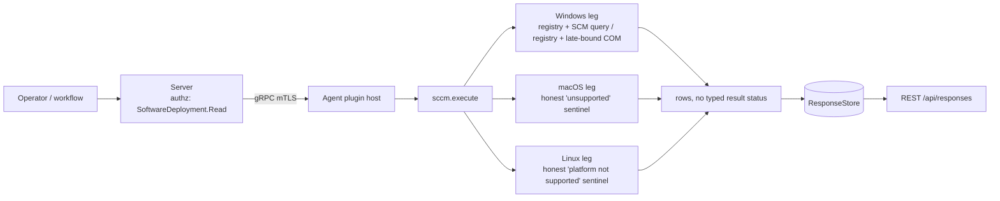

# sccm

<!-- BEGIN GENERATED: plugin-doc-gen header -->
| | |
|---|---|
| **What it does** | Reports SCCM/ConfigMgr client status, version, and site assignment |
| **Version** | 1.0.0 |
| **Kind** | Collector · read-only · gathered (security.sccm.client_version, security.sccm.site) |
| **Platforms** | Windows ✅ · macOS ⛔ unsupported · Linux ⛔ unsupported |
| **Actions** | `client_version` (definition `security.sccm.client_version`) · `site` (definition `security.sccm.site`) |
| **Security** | securable `SoftwareDeployment` · operation Read · risk Low · dispatch ReadOnly · approval gate None |
| **Roles** | execute: endpoint-admin, endpoint-operator, security-admin · author: content-author |
<!-- END GENERATED -->

## How it works

`client_version` checks `HKLM\SOFTWARE\Microsoft\SMS\Mobile Client\ProductVersion` for the installed SCCM client version, then queries the `ccmexec` service through the SCM (`OpenSCManagerW` → `OpenServiceW` → `QueryServiceStatusEx`) for its run state. `site` reads the assigned site code from the registry (`SMS\Mobile Client\AssignedSiteCode`, falling back to `CCM\AssignedSiteCode`), then the management point (`CCM\Authority`, falling back to enumerating `CCM\Authority\SMS:<code>` subkeys). If either registry path comes up empty, `site` lazily initializes a COM apartment and calls the late-bound `Microsoft.SMS.Client` IDispatch object (`GetAssignedSite` / `GetCurrentManagementPoint`) as a fallback. Both actions are pure reads: neither installs, repairs, nor reconfigures the SCCM client.

The plugin is Windows-only by design — SCCM/ConfigMgr has no macOS or Linux client — and deliberately returns an honest sentinel rather than an empty or fabricated result on those platforms.



## OS capability

<!-- BEGIN GENERATED: plugin-doc-gen capability -->
| Action | Windows | macOS | Linux |
|---|---|---|---|
| `client_version` | ✅ supported · rung 1 · registry+scm | ⛔ unsupported | ⛔ unsupported |
| `site` | ✅ supported · rung 1 · registry+com_dispatch | ⛔ unsupported | ⛔ unsupported |
<!-- END GENERATED -->

## Privileges and prerequisites

| OS | Runs as | Extra grant needed | Measured | If the read is refused |
|---|---|---|---|---|
| Windows | agent service account (LocalSystem today, #1442) | **None.** Registry reads use `KEY_READ`; the SCM query uses `SC_MANAGER_CONNECT` / `SERVICE_QUERY_STATUS`; the COM call opens no elevated interface. | 2026-09-07, bare-metal, SYSTEM | `client_version.version` reports `-`/`installed\|false`; `service_status` reports `unavailable`; `site.site_code` reports `not_configured` |
| macOS | agent daemon, unprivileged | n/a — action returns the honest-unsupported sentinel unconditionally | 2026-09-07, bare-metal, euid 501 (alex) | n/a — no read is attempted |
| Linux | agent daemon, unprivileged | n/a — action returns the honest-unsupported sentinel unconditionally | 2026-09-06, container, euid 0 | n/a — no read is attempted |

No subprocesses and no network access. `site` opens an in-process COM apartment (`CoInitializeEx`/`CoCreateInstance` against `Microsoft.SMS.Client`) as a fallback only when the registry lookup is empty; nothing is spawned. The plugin previously shelled out to `sc query ccmexec` and two PowerShell ComObject calls — all three sites were retired in Wave 3 PR33d (`docs/agent-spawn-sink-manifest.md:326`); zero spawn sites remain.

## Data contract

### Inputs

<!-- BEGIN GENERATED: plugin-doc-gen inputs -->
Neither action takes parameters.
<!-- END GENERATED -->

### Outputs

Pipe-delimited `key|value` rows, one per fact, written via `write_output()`. On Windows a missing value is reported through an explicit sentinel word (`false`, `-`, `not_found`, `not_configured`, `unknown`) chosen per field, never a blank or omitted row. On macOS and Linux each action emits one or two sentinel rows instead of the normal key/value set, naming the reason the platform has no client.

<!-- BEGIN GENERATED: plugin-doc-gen outputs -->
**`security.sccm.client_version` — `installed|version|service_status`**

| Field | Type | Values | Available | Example | Description |
|---|---|---|---|---|---|
| `installed` | bool | - | Windows, Linux | `false` | Whether the registry reports a ProductVersion for the SCCM client (Windows only; always false off-Windows). Values: true, false. |
| `version` | string | - | Windows | `-` | The installed SCCM client version from HKLM\SOFTWARE\Microsoft\SMS\Mobile Client\ProductVersion, or "-" if not present. Values: free text or "-". |
| `service_status` | string | - | Windows | `not_found` | The ccmexec Windows service state from a live SCM query (OpenSCManagerW/OpenServiceW/QueryServiceStatusEx). Values: running, stopped, exists, not_found, unavailable. |

**`security.sccm.site` — `site_code|management_point`**

| Field | Type | Values | Available | Example | Description |
|---|---|---|---|---|---|
| `site_code` | string | - | Windows | `not_configured` | The assigned SCCM site code, from the registry, the enumerated CCM\Authority subkey, or the Microsoft.SMS.Client COM fallback; "not_configured" if none resolve. Values: free text or not_configured. |
| `management_point` | string | - | Windows | `unknown` | The current SCCM management point hostname, from the registry, the enumerated CCM\Authority subkey, or the Microsoft.SMS.Client COM fallback; "unknown" if none resolve. Values: free text or unknown. |
<!-- END GENERATED -->

### Result status

This plugin does not set a typed result status; the agent records `UNDECLARED` and the sample shows `UNDECLARED / UNKNOWN /`.

### Where the data goes

- **Instruction result only.** Rows travel over the agent's mTLS gRPC channel as the command response and land in the ResponseStore (`response_retention_days`, default 90 days), rendered via `result_parsing.hpp`'s key-value schema (`Agent · Key · Value`) and queryable at `/api/responses/{id}`.
- **Not consumed by** daily-sync inventory, the TAR warehouse, DEX, or metrics. Nothing runs on a schedule; each definition's `gather.ttlSeconds: 60` only caps how often a repeat dispatch is served from cache, it does not trigger one.
- **Sensitivity.** `client_version`'s `version` names the installed SCCM client software version; `site`'s `site_code`/`management_point` identify the device's organizational deployment grouping — no serial number, MAC, hostname, or username appears in any field.
- **Siblings:** `msi_packages` (general software inventory), `agent_actions.info` (agent build/identity), `windows_updates` (patch state) — none join with `sccm`'s output.
- **MCP / REST.** Discover: `discover_plugins` (summary) → `yuzu://plugin-docs` (this page as data) → `discover_instructions` / `get_definition("security.sccm.client_version")`. Run: `execute_instruction {definition_id, parameters}`. Read: `/api/responses/{id}`.

## Sample output

<!-- BEGIN GENERATED: plugin-doc-gen samples -->
**Windows** — captured: windows Microsoft Windows NT 10.0.26200.0 x64 · bare-metal · 2026-09-07 · SYSTEM · leg-hash 820bfb5e0176

```
== action=client_version
installed|false
version|-
service_status|not_found
[result_status] UNDECLARED / UNKNOWN

== action=site
site_code|not_configured
management_point|unknown
[result_status] UNDECLARED / UNKNOWN
```

**macOS** — captured: macos macOS 26.6.2 arm64 · bare-metal · 2026-09-07 · euid 501 (alex) · leg-hash 820bfb5e0176

```
== action=client_version
sccm|unsupported|Windows SCCM/ConfigMgr client has no macOS equivalent; use Jamf/MDM for macOS device management
[result_status] UNDECLARED / UNKNOWN

== action=site
sccm|unsupported|Windows SCCM/ConfigMgr client has no macOS equivalent; use Jamf/MDM for macOS device management
[result_status] UNDECLARED / UNKNOWN
```

**Linux** — captured: linux Debian GNU/Linux 13 (trixie) aarch64 · container · 2026-09-06 · euid 0 · leg-hash 820bfb5e0176

```
== action=client_version
installed|false
error|platform not supported
[result_status] UNDECLARED / UNKNOWN

== action=site
error|platform not supported
[result_status] UNDECLARED / UNKNOWN
```
<!-- END GENERATED -->

## Caveats and known gaps

1. **Windows samples show the absent-client path only.** No host reachable for this capture (dev machine or the-rig) has a real SCCM client installed, so `not_found`/`not_configured`/`unknown` are the only Windows values ever observed; `test_sccm_win_actions.cpp` pins exactly these values for the same reason. The plugin's own source comment above `call_sms_client_method` (`sccm_plugin.cpp:238`) records the live-client COM success path as an unverified code path.
2. **Do not reintroduce the shell-outs.** `client_version` and `site` previously ran `sc query ccmexec` and two PowerShell `Microsoft.SMS.Client` ComObject calls; all three were retired for native Win32/COM calls in Wave 3 PR33d (`docs/agent-spawn-sink-manifest.md:326`), and zero spawn sites remain.
3. **The Authority-subkey fallback was previously dead code.** Before this migration, `site`'s management-point fallback matched a literal, never-substituted `"SMS:{}"` string and so never found a subkey; it now genuinely enumerates `HKLM\SOFTWARE\Microsoft\CCM\Authority` and prefers the subkey matching the resolved site code (`sccm_parsers.hpp:40`).
4. **No result status is set on any leg.** All three samples show `UNDECLARED / UNKNOWN /`; a caller cannot distinguish "clean absent-client read" from "read failed" via `plugin_result_status` today — only the per-field sentinel values (`not_found`, `unavailable`, `not_configured`) carry that signal.
5. **`classify_service_status` is a maintained mirror, not shared code.** It stays inside the plugin's `#ifdef _WIN32` block (Windows-typed `DWORD`/`SERVICE_*`) and is duplicated with plain types in `test_sccm_parsers.cpp`; a change to one must be mirrored in the other by hand (`sccm_plugin.cpp:85-95`).

## Source and tests

<!-- BEGIN GENERATED: plugin-doc-gen source -->
- Plugin: `agents/plugins/sccm/src/sccm_parsers.hpp` · `agents/plugins/sccm/src/sccm_plugin.cpp`
- Definitions: `content/definitions/sccm.yaml`
- Capability rows: `server/core/src/capability_decls/plugin_action_catalogue_d.hpp`
- Tests: `tests/unit/test_sccm_parsers.cpp` · `tests/unit/test_sccm_win_actions.cpp`
- Privilege row: `docs/agent-privilege-model.md` (no row yet)
- Changelog: `changelog.d/wave3-pr33d-windows-updates-sccm-native.changed.md`
<!-- END GENERATED -->
