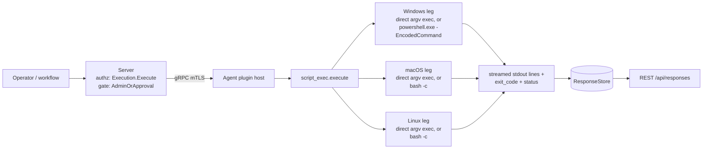

# script_exec

<!-- BEGIN GENERATED: plugin-doc-gen header -->
| | |
|---|---|
| **What it does** | Executes commands and scripts with streaming output (admin-only) |
| **Version** | 1.1.0 |
| **Kind** | Action · mutating · gathered (device.script_exec.exec, device.script_exec.powershell, device.script_exec.bash) |
| **Platforms** | Windows ✅ · macOS ✅ · Linux ✅ |
| **Actions** | `bash` (definition `device.script_exec.bash`) · `exec` (definition `device.script_exec.exec`) · `powershell` (definition `device.script_exec.powershell`) |
| **Security** | securable `Execution` · operation Execute · risk Critical · dispatch Destructive · approval gate AdminOrApproval |
| **Roles** | execute: endpoint-admin · author: content-author |
<!-- END GENERATED -->

## How it works

All three actions resolve to one shared runner call. `exec` resolves `command` to an absolute path (an already-absolute or path-like value passes through; a bare name is searched — on Windows, the app directory, then the resolved system directory, then PATH; on POSIX, PATH only) and splits `args` with the OS-appropriate quoting grammar, then hands `{resolved_cmd, ...args}` straight to the runner with no shell interpretation at all. `bash` and `powershell` instead build a fixed two/five-element argv (`/bin/bash -c <script>`, or `<powershell.exe> -NoProfile -NonInteractive -EncodedCommand <base64 UTF-16LE>`) and let that interpreter parse the caller's script text. Every mode routes through the shared `yuzu::agent::run_bounded_subprocess` (ADR-3002) rather than a plugin-local spawn path; the plugin's own code is a thin argv-assembly and result-formatting shell around it (script_exec_plugin.cpp:22-31). Output streams back line-by-line as it is produced (`stdout|<line>`), followed by a terminal `exit_code|<N>` and `status|ok|error|timeout` (script_exec_plugin.cpp:17-20, 419, 458-459). The plugin deliberately does not interpret, sanitize, or rewrite the child's output, and does not itself request or check any file/process permission beyond what launching the child requires — a program that fails for its own permission reasons simply reports that failure through its own exit code and stderr text, like any other subprocess result.



## OS capability

<!-- BEGIN GENERATED: plugin-doc-gen capability -->
| Action | Windows | macOS | Linux |
|---|---|---|---|
| `bash` | ⛔ unsupported | ✅ supported · rung 3 · subprocess_runner:bash_c | ✅ supported · rung 3 · subprocess_runner:bash_c |
| `exec` | ✅ supported · rung 2 · subprocess_runner:direct_argv | ✅ supported · rung 2 · subprocess_runner:direct_argv | ✅ supported · rung 2 · subprocess_runner:direct_argv |
| `powershell` | ✅ supported · rung 3 · subprocess_runner:powershell_encodedcommand | ⛔ unsupported | ⛔ unsupported |
<!-- END GENERATED -->

## Privileges and prerequisites

| OS | Runs as | Extra grant needed | Measured | If the read is refused |
|---|---|---|---|---|
| Windows | agent service account — **LocalSystem today** (#1442); design target is `YuzuAgent`/`NT SERVICE\YuzuAgent` (docs/agent-privilege-model.md TL;DR, row 119) | None — the row lists "no extra privilege" for `script_exec.{exec,bash,powershell}` (docs/agent-privilege-model.md:119) | 2026-09-07, bare-metal, captured as `SYSTEM` (docs/samples/windows.txt:1) | not a distinct denial path — an unresolvable/unrunnable command returns `status\|error` / `exit_code\|-1` (script_exec_plugin.cpp:559-560) before the runner is ever called |
| macOS | agent daemon — **root today** (LaunchDaemon has no `UserName` key; TL;DR "macOS is the current exception"); the privilege-model row lists the unprivileged `_yuzu` design target (docs/agent-privilege-model.md:119) | None either way | 2026-09-07, bare-metal, captured unprivileged at euid 501 (docs/samples/macos.txt:1) — not the root identity the deployed daemon normally runs as | a spawn failure surfaces as `status\|error` with `exit_code\|-1` via the runner's `spawn_error` path (script_exec_plugin.cpp:448-451); the invoked program's own permission failure surfaces in its captured stdout/stderr text, not as a script_exec-level status |
| Linux | `yuzu` (unprivileged; TL;DR: "the agent's own process never runs as root"), no sudo (docs/agent-privilege-model.md:119) | None | 2026-09-07, container, captured as euid 0 (root) — a container-root capture, not the unprivileged `yuzu` identity the doc describes (docs/samples/linux.txt:1) | same `spawn_error` → `status\|error` / `exit_code\|-1` path as above |

Subprocesses: yes — the entire plugin exists to spawn one. `exec` launches an operator-named program; `bash` launches `/bin/bash` (script_exec_parsers.hpp:408); `powershell` launches `<system dir>\WindowsPowerShell\v1.0\powershell.exe` (script_exec_plugin.cpp:615), resolved at runtime via `GetSystemDirectoryW`, never a hard-coded path (script_exec_plugin.cpp:596-604). No direct network calls by the plugin itself; whatever the launched command or script does is outside its scope.

## Data contract

### Inputs

<!-- BEGIN GENERATED: plugin-doc-gen inputs -->
| Definition | Parameter | Type | Required | Default | Constraints | Description |
|---|---|---|---|---|---|---|
| `device.script_exec.bash` | `script` | string | yes | - | maxLength 65536 | The bash script body to execute. Passed to /bin/bash -c. Example: "echo yuzu-capture". |
| `device.script_exec.bash` | `timeout` | int32 | no | 300 | minimum 1 · maximum 3600 | Maximum execution time in seconds. Range: 1-3600. Example: 600. |
| `device.script_exec.exec` | `command` | string | yes | - | maxLength 4096 | Full path or name of the program to execute. A path-like value (contains '/', or on Windows '\' or a drive prefix) must already be absolute, or is resolved against a fixed safe directory; a bare name is searched across the app directory, the Windows system directory, then PATH (Windows), or PATH alone (POSIX). Example: "/usr/bin/id" or "notepad.exe". |
| `device.script_exec.exec` | `args` | string | no | - | maxLength 8192 | Space-separated arguments passed to the command. On Linux/macOS, single or double quotes delimit an argument containing spaces (quote characters stripped, no escaping). On Windows, only double quotes are meaningful, with CRT/CommandLineToArgvW backslash-escaping rules — a single quote has no special meaning there. Example: "-la /tmp" or "\"two words\" --flag". |
| `device.script_exec.exec` | `timeout` | int32 | no | 300 | minimum 1 · maximum 3600 | Maximum execution time in seconds. Process is terminated if this threshold is exceeded. Range: 1-3600. Example: 600. |
| `device.script_exec.powershell` | `script` | string | yes | - | maxLength 65536 | The PowerShell script body to execute. Automatically encoded as UTF-16LE Base64 for safe transport. Example: "Get-Service \| Where-Object Status -eq 'Running'". |
| `device.script_exec.powershell` | `timeout` | int32 | no | 300 | minimum 1 · maximum 3600 | Maximum execution time in seconds. Range: 1-3600. Example: 600. |
<!-- END GENERATED -->

### Outputs

Each action streams one line per output event via `ctx.write_output()`; every line is exactly two pipe-delimited fields (script_exec_plugin.cpp:17-20). `stream` is the discriminator (`stdout`, `exit_code`, `status`, or the pre-execution-only `error`); `content` is that line's value. A stdout line is emitted verbatim as captured — stdout and stderr are merged into the same stream (`opts.merge_stderr = true`, script_exec_plugin.cpp:335), and a fully blank completed line still emits its own `stdout|` record (script_exec_plugin.cpp:385-390). There is no placeholder/empty-result row: a run that produces zero output still ends with its `exit_code|`/`status|` pair.

<!-- BEGIN GENERATED: plugin-doc-gen outputs -->
**`device.script_exec.bash` — `stream|content|exit_code|status`**

| Field | Type | Values | Available | Example | Description |
|---|---|---|---|---|---|
| `stream` | string | - | Linux, macOS | `stdout` | Which output line this row represents: stdout for a captured output line, exit_code for the final numeric exit code, status for the final ok/error/timeout verdict, or error for an early, pre-execution failure. Values: stdout, exit_code, status, error. |
| `content` | string | - | Linux, macOS | `yuzu-capture` | The value paired with stream: the captured line text for stdout, the numeric exit code as a string for exit_code, the verdict string for status, or a human-readable failure message for error. Stdout and stderr are merged into this same stream. Values: free text. |
| `exit_code` | int32 | - | Linux, macOS | `0` | The process exit code, present on the row where stream is exit_code; -1 when the runner reports a spawn error. Values: any int32; -1 = spawn/resolve failure. |
| `status` | string | - | Linux, macOS | `ok` | The terminal verdict, present on the row where stream is status: ok (exit code 0), error (nonzero exit or spawn error), or timeout (the runner's deadline or a cancellation fired). Values: ok, error, timeout. |

**`device.script_exec.exec` — `stream|content|exit_code|status`**

| Field | Type | Values | Available | Example | Description |
|---|---|---|---|---|---|
| `stream` | string | - | Windows, Linux, macOS | `stdout` | Which output line this row represents: stdout for a captured output line, exit_code for the final numeric exit code, status for the final ok/error/timeout verdict, or error for an early, pre-execution failure. Values: stdout, exit_code, status, error. |
| `content` | string | - | Windows, Linux, macOS | `yuzu-capture` | The value paired with stream: the captured line text for stdout, the numeric exit code as a string for exit_code, the verdict string for status, or a human-readable failure message for error. Stdout and stderr are merged into this same stream. Values: free text. |
| `exit_code` | int32 | - | Windows, Linux, macOS | `0` | The process exit code, present on the row where stream is exit_code; -1 when the runner reports a spawn error or the command could not be resolved. Values: any int32; -1 = spawn/resolve failure. |
| `status` | string | - | Windows, Linux, macOS | `ok` | The terminal verdict, present on the row where stream is status: ok (exit code 0), error (nonzero exit, spawn error, or an early parameter/resolution failure), or timeout (the runner's deadline or a cancellation fired). Values: ok, error, timeout. |

**`device.script_exec.powershell` — `stream|content|exit_code|status`**

| Field | Type | Values | Available | Example | Description |
|---|---|---|---|---|---|
| `stream` | string | - | Windows | `stdout` | Which output line this row represents: stdout for a captured output line (including PowerShell's own progress-stream CLIXML text on a headless run), exit_code for the final numeric exit code, status for the final ok/error/timeout verdict, or error for an early, pre-execution failure. Values: stdout, exit_code, status, error. |
| `content` | string | - | Windows | `yuzu-capture` | The value paired with stream: the captured line text for stdout, the numeric exit code as a string for exit_code, the verdict string for status, or a human-readable failure message for error. Stdout and stderr are merged into this same stream. Values: free text. |
| `exit_code` | int32 | - | Windows | `0` | The process exit code, present on the row where stream is exit_code; -1 when the runner reports a spawn error or the Windows system directory could not be resolved. Values: any int32; -1 = spawn/resolve failure. |
| `status` | string | - | Windows | `ok` | The terminal verdict, present on the row where stream is status: ok (exit code 0), error (nonzero exit, spawn error, or an early resolution failure), or timeout (the runner's deadline or a cancellation fired). Values: ok, error, timeout. |
<!-- END GENERATED -->

### Result status

| Status | Completeness | Provenance | When |
|---|---|---|---|
| `UNDECLARED` (agent default) | — | — | every clean exit (`status\|ok` or `status\|error` from the child's own nonzero exit) — `forward_runner_failure` only reacts to a non-clean `TerminationReason` (script_exec_plugin.cpp:434, comment 423-433) |
| `UNAVAILABLE` / `PARTIAL` | partial | `subprocess_runner:spawn_error` | the runner could not spawn the child process at all (script_exec_plugin.cpp:434, 438-456) — not exercised by any of the three captured samples, all of which exited cleanly |
| `CONSTRAINED` / `PARTIAL` | partial | `subprocess_runner:deadline` | the runner's `timeout` elapsed while the child was still running, and it was killed |
| `CONSTRAINED` / `PARTIAL` | partial | `subprocess_runner:cancelled` | the run was cancelled before the child finished |
| `CONSTRAINED` / `PARTIAL` | partial | `subprocess_runner:signaled` | the child was killed by a signal rather than exiting cleanly |
| `OK` / `PARTIAL` | partial | `subprocess_runner:line_limit` | the runner capped streamed output at its line limit and killed the still-producing child — a deliberate bounded stop, not a failure |

None of the captured samples hit this path, so every sample line reads `[result_status] UNDECLARED / UNKNOWN /` (docs/samples/{windows,macos,linux}.txt) — including the two `[rc] 1` lines, which are the plugin's own early "wrong OS for this action" refusal (script_exec_plugin.cpp:576-577, 634-635), never a runner-level failure.

### Where the data goes

- **Instruction result only.** Rows travel over the agent's mTLS gRPC channel as the command response and land in the ResponseStore (90-day retention per the `core.crossplatform.scripting` instruction set default, content/definitions/scripting_set.yaml:27), queryable at `/api/responses/{id}`. The server renders `script_exec` results with the generic key-value (`Agent`/`Key`/`Value`) display shape, not a plugin-specific column layout (server/core/src/result_parsing.hpp:61-68).
- **Not consumed by** daily-sync inventory, the TAR warehouse, DEX, or metrics — no reference to `script_exec` or any `device.script_exec.*` definition id was found outside the plugin's own files, the capability catalogue, the dispatch-gate/execution-tracker comments, and `scripting_set.yaml`. Nothing runs on a schedule; `gather.ttlSeconds: 3600` in the definition YAML is a response-cache TTL, not a poll schedule (content/definitions/script_exec.yaml:75-76, 150-151, 225-226).
- **Not consumed by** an early dispatch-time gate either: `Execution`/`AdminOrApproval` is enforced at the shared dispatch chokepoint for every caller including MCP, not duplicated by an earlier check (server/core/src/dispatch_destructive_gate.hpp:53-58).
- **Sensitivity.** `content` is opaque, operator-chosen free text — the plugin forwards the launched
  command's/script's stdout (and merged stderr) verbatim, so what it carries depends entirely on what
  the caller ran. It can trivially include device identifiers (hostnames, IPs), person identifiers
  (usernames, logged-in account names), and installed-software details (whatever the command chooses
  to print) — the plugin itself never names or filters any of these, it just streams whatever the
  child process writes.
- **Siblings:** `content_dist.execute_staged` — the only other plugin sharing the same `Destructive` + `AdminOrApproval` combination (server/core/src/dispatch_destructive_gate.hpp:54). All three `script_exec` definitions are bundled together in the `core.crossplatform.scripting` instruction set (content/definitions/scripting_set.yaml:19-23).
- **MCP / REST.** Discover: `discover_plugins` (summary) → `yuzu://plugin-docs` (this page as data) → `discover_instructions` / `get_definition("device.script_exec.exec")`. Run: `execute_instruction {definition_id, parameters}`. Read: `/api/responses/{id}`.

## Sample output

<!-- BEGIN GENERATED: plugin-doc-gen samples -->
**Windows** — captured: windows Microsoft Windows NT 10.0.26200.0 x64 · bare-metal · 2026-09-07 · SYSTEM · leg-hash a6cac34c1781

```
== action=exec command=cmd args="/c echo yuzu-capture"
stdout|yuzu-capture
exit_code|0
status|ok
[result_status] UNDECLARED / UNKNOWN

== action=powershell script="Write-Output yuzu-capture"
stdout|#< CLIXML
stdout|yuzu-capture
stdout|<Objs Version="1.1.0.1" xmlns="http://schemas.microsoft.com/powershell/2004/04"><Obj S="progress" RefId="0"><TN RefId="0"><T>System.Management.Automation.PSCustomObject</T><T>System.Object</T></TN><MS><I64 N="SourceId">1</I64><PR N="Record"><AV>Preparing modules for first use.</AV><AI>0</AI><Nil /><PI>-1</PI><PC>-1</PC><T>Completed</T><SR>-1</SR><SD> </SD></PR></MS></Obj></Objs>
exit_code|0
status|ok
[result_status] UNDECLARED / UNKNOWN

== action=bash script="echo yuzu-capture"
error|bash action is not available on Windows
status|error
[result_status] UNDECLARED / UNKNOWN
[rc] 1
```

**macOS** — captured: macos macOS 26.6.2 arm64 · bare-metal · 2026-09-07 · euid 501 (jsmith) · leg-hash a6cac34c1781

```
== action=exec command=echo args=yuzu-capture
stdout|yuzu-capture
exit_code|0
status|ok
[result_status] UNDECLARED / UNKNOWN

== action=powershell script="Write-Output yuzu-capture"
error|powershell action is Windows-only
status|error
[result_status] UNDECLARED / UNKNOWN
[rc] 1

== action=bash script="echo yuzu-capture"
stdout|yuzu-capture
exit_code|0
status|ok
[result_status] UNDECLARED / UNKNOWN
```

**Linux** — captured: linux Debian GNU/Linux 13 (trixie) aarch64 · container · 2026-09-07 · euid 0 · leg-hash a6cac34c1781

```
== action=exec command=echo args=yuzu-capture
stdout|yuzu-capture
exit_code|0
status|ok
[result_status] UNDECLARED / UNKNOWN

== action=powershell script="Write-Output yuzu-capture"
error|powershell action is Windows-only
status|error
[result_status] UNDECLARED / UNKNOWN
[rc] 1

== action=bash script="echo yuzu-capture"
stdout|yuzu-capture
exit_code|0
status|ok
[result_status] UNDECLARED / UNKNOWN
```
<!-- END GENERATED -->

## Caveats and known gaps

1. **The Windows `powershell` sample's CLIXML noise is expected, not an error.** `-NoProfile -NonInteractive` (script_exec_parsers.hpp:381-382, 410) plus `no_window=true` (script_exec_parsers.hpp:424-426, applied unconditionally at script_exec_plugin.cpp:378-382) means the child has no console to render a progress bar on; PowerShell instead serializes the record as a `#< CLIXML`-prefixed blob. `merge_stderr = true` (script_exec_plugin.cpp:335) captures it through the same `on_line` callback as real stdout (script_exec_plugin.cpp:408-419), so it is forwarded verbatim as an ordinary `stdout|` line — the plugin does not filter or special-case it. `exit_code|0` / `status|ok` in the sample confirm it is cosmetic.
2. **The soft-terminate grace is silently zero on Windows.** `opts.soft_terminate_grace` is set to 10s for every mutating run (script_exec_plugin.cpp:331) but forced back to 0 whenever `no_window` is true, which it always is on Windows (script_exec_plugin.cpp:363-382, "BR-006 KNOWN LIMITATION"): a console-less child can never receive `GenerateConsoleCtrlEvent`, so a deadline/cancel goes straight to the hard kill. This is a documented, in-scope trade-off, not a bug to "fix" by removing the zeroing.
3. **A relative `command` no longer resolves against the agent daemon's own working directory.** It resolves against a fixed sentinel instead — `/` on POSIX, the runtime-resolved Windows system directory on Windows (script_exec_plugin.cpp:123-159, BR-009) — a deliberate ADR-3002 A6 hardening. An instruction that relied on the old daemon-cwd-relative resolution needs an absolute `command` path (changelog.d/5.1-script-exec-runner-convergence.changed.md).
4. **Do not narrow the Windows environment to the POSIX seven-name allow-list.** The deleted Windows spawn path passed a null environment block, so children inherited the *full* parent environment — broader than POSIX's seven-name `PATH`/`HOME`/`USER`/`LANG`/`LC_ALL`/`TERM`/`TZ` list. An earlier draft narrowed Windows to match POSIX; it was reversed (script_exec_plugin.cpp:50-68, "Alex ruled AGAINST narrowing"). `inherit_parent_env=true` now carries an injection-class strip (`LD_*`/`DYLD_*`/`IFS`/`BASH_ENV`/`ENV`/`GCONV_PATH`/`NLSPATH`/`LOCPATH`) on top (changelog.d/wave5-pr51-windows-inherit-env-filter.security.md).
5. **The Linux capture ran as container root (euid 0), not the documented `yuzu` identity.** `docs/agent-privilege-model.md`'s TL;DR states the agent process never runs as root on Linux; the sample stamp (docs/samples/linux.txt:1) shows `euid 0`, a property of the capture container rather than of a deployed, unprivileged agent install.

## Source and tests

<!-- BEGIN GENERATED: plugin-doc-gen source -->
- Plugin: `agents/plugins/script_exec/src/script_exec_parsers.hpp` · `agents/plugins/script_exec/src/script_exec_plugin.cpp`
- Definitions: `content/definitions/script_exec.yaml`
- Capability rows: `server/core/src/capability_decls/plugin_action_catalogue_d.hpp`
- Tests: `tests/unit/test_script_exec_actions.cpp` · `tests/unit/test_script_exec_parsers.cpp` · `tests/unit/test_script_exec_win_actions.cpp`
- Privilege row: `docs/agent-privilege-model.md`
<!-- END GENERATED -->
