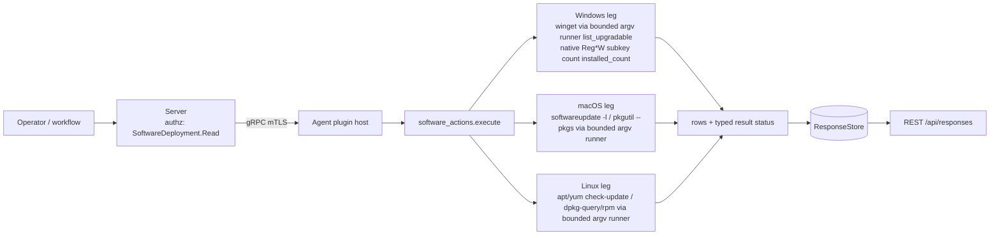

# software_actions

<!-- BEGIN GENERATED: plugin-doc-gen header -->
| | |
|---|---|
| **What it does** | Lists upgradable packages and counts installed software |
| **Version** | 1.1.0 |
| **Kind** | Collector · read-only · gathered (device.software_actions.list_upgradable, device.software_actions.installed_count) |
| **Platforms** | Windows ✅ · macOS ✅ · Linux ✅ |
| **Actions** | `installed_count` (definition `device.software_actions.installed_count`) · `list_upgradable` (definition `device.software_actions.list_upgradable`) |
| **Security** | securable `SoftwareDeployment` · operation Read · risk Low · dispatch ReadOnly · approval gate None |
| **Roles** | execute: endpoint-admin, endpoint-operator · author: content-author |
<!-- END GENERATED -->

## How it works

`list_upgradable` asks the platform's own package manager what has an update pending: `winget upgrade` on Windows, `apt list --upgradable` then `yum`/`dnf check-update` on Linux, `softwareupdate -l` on macOS. `installed_count` asks the same class of tool for a raw record count, except on Windows, where it counts subkeys of the Uninstall registry key natively (no subprocess at all). Every acquisition goes through the shared bounded argv runner or a native OS read — never a shell, never `popen` (ADR-3002). A tool that ran but returned an ambiguous or truncated capture degrades the result rather than reporting it as clean, and a query that never ran (tool absent, spawn failed) reports `UNAVAILABLE`/`CONSTRAINED` with no `count|`/`upgradable|` data line that could be misread as a real answer — a `count|0` or "System is up to date" line is reserved for a tool that ran clean and genuinely found nothing.

Neither action is a general software inventory: there is no publisher, install date, or per-user breakdown here, and Windows' `installed_count` deliberately reads only the default (64-bit) registry view, undercounting 32-bit apps under WOW6432Node rather than changing the reported number for every host. That inventory depth is `installed_apps`' job.



## OS capability

<!-- BEGIN GENERATED: plugin-doc-gen capability -->
| Action | Windows | macOS | Linux |
|---|---|---|---|
| `installed_count` | ✅ supported · rung 1 · native Reg*W subkey count of the Uninstall key | ✅ supported · rung 2 · pkgutil --pkgs via bounded argv runner | ✅ supported · rung 2 · dpkg-query/rpm via bounded argv runner |
| `list_upgradable` | 🟡 constrained · rung 2 · winget via bounded argv runner | ✅ supported · rung 2 · softwareupdate -l via bounded argv runner | ✅ supported · rung 2 · apt/yum check-update via bounded argv runner |

**Declared limits per leg** (descriptor fallback text, verbatim):

- **`installed_count` / Windows** — reads only the default (64-bit) registry view, matching the powershell payload it replaced; 32-bit applications registered under WOW6432Node are not counted
- **`list_upgradable` / Windows** — winget is a PER-USER App Execution Alias under %LOCALAPPDATA%; under the shipped LocalSystem service account that path does not exist, so this leg resolves only when the agent runs in a user-session context. An unresolvable winget reports UNAVAILABLE, never a clean empty result
<!-- END GENERATED -->

## Privileges and prerequisites

| OS | Runs as | Extra grant needed | Measured | If the read is refused |
|---|---|---|---|---|
| Windows | agent service identity — sample captured under `SYSTEM` (no row in `docs/agent-privilege-model.md` for this plugin) | `list_upgradable` needs a resolvable `%LOCALAPPDATA%` and a user-session context for the winget alias to exist; `installed_count`'s registry read needs no extra grant | 2026-09-07 on bare metal, `SYSTEM` | `list_upgradable`: `UNAVAILABLE`/PARTIAL, e.g. `subprocess_runner:spawn_error` or `software_actions:localappdata_unset`; `installed_count`: `UNAVAILABLE`/PARTIAL/`software_actions:registry_query_failed` |
| macOS | agent daemon — sample captured at `euid 501 (alex)`, unprivileged | None measured; both tools run unprivileged | 2026-09-07 on macOS 26.6.2, euid 501 | `UNAVAILABLE`/PARTIAL/`software_actions:softwareupdate_not_present` or `:softwareupdate_failed`; `installed_count`: `:pkgutil_not_present` or `:pkgutil_query_failed` |
| Linux | agent daemon — sample captured at `euid 0` (container) | None measured; apt/yum/dpkg-query/rpm are read-only queries | 2026-09-06 in a container, euid 0 | `list_upgradable`: `UNAVAILABLE`/PARTIAL/`software_actions:no_supported_package_manager`, `:apt_list_upgradable_failed`, or `:yum_check_update_failed`; `installed_count`: `:dpkg_query_failed`, `:rpm_query_failed`, or `:no_supported_package_manager` |

Subprocesses: `winget.exe` (Windows, `list_upgradable` only), `apt`/`yum`/`dnf` (Linux, `list_upgradable`), `dpkg-query`/`rpm` (Linux, `installed_count`), `softwareupdate` (macOS, `list_upgradable`), `pkgutil` (macOS, `installed_count`) — all via the bounded argv runner, no shell. `installed_count` on Windows spawns nothing (native `RegOpenKeyExW`/`RegQueryInfoKeyW`). Network: `winget upgrade` and `softwareupdate -l` reach their configured update source/catalog over the network; every other leg is a local read.

## Data contract

### Inputs

<!-- BEGIN GENERATED: plugin-doc-gen inputs -->
Neither action takes parameters.
<!-- END GENERATED -->

### Outputs

Pipe-delimited rows, one literal-discriminator field followed by the action's own fields. `list_upgradable` writes one `upgradable|...` line per upgradable package, or a single sentinel row when the query ran clean and nothing is pending; `installed_count` writes exactly one `count|N` line, or none at all on a degraded read — a `count|0` line is never emitted for a failed or absent query.

<!-- BEGIN GENERATED: plugin-doc-gen outputs -->
**`device.software_actions.installed_count` — `count`**

| Field | Type | Values | Available | Example | Description |
|---|---|---|---|---|---|
| `count` | int32 | - | Windows, Linux, macOS | `124` | Non-negative count of installed packages or applications; the line is omitted entirely (never emitted as 0) when the underlying query failed. Values: non-negative integer. |

**`device.software_actions.list_upgradable` — `package_name|current_version|available_version`**

| Field | Type | Values | Available | Example | Description |
|---|---|---|---|---|---|
| `package_name` | string | - | Windows, Linux, macOS | `none` | The package or application name; the literal 'none' on the clean-scan sentinel row when nothing is upgradable. Values: free text, or the literal `none`. |
| `current_version` | string | - | Windows, Linux, macOS | `System is up to date` | The currently installed version, or '-' when not read; on the up-to-date sentinel row this field carries the literal sentence 'System is up to date' instead of a version. Values: free text, or `-`, or the literal `System is up to date`. |
| `available_version` | string | - | Windows, Linux, macOS | `-` | The version available to upgrade to, or '-' when not applicable or not read. Values: free text, or `-`. |
<!-- END GENERATED -->

### Result status

| Status | Completeness | Provenance | When |
|---|---|---|---|
| `UNDECLARED` (sample shows `UNDECLARED / UNKNOWN /`) | — | — | clean run: rows/count emitted, no `set_result_status` call — every captured sample except the Windows `list_upgradable` failure |
| `UNAVAILABLE` | PARTIAL | `software_actions:localappdata_unset` | Windows `list_upgradable`: no `%LOCALAPPDATA%` in the token's environment |
| `UNAVAILABLE` | PARTIAL | `subprocess_runner:spawn_error` (forwarded via `forward_runner_failure`) or `software_actions:winget_failed` / `:softwareupdate_failed` / `:apt_list_upgradable_failed` / `:yum_check_update_failed` | the child process could not be spawned at all, or (the plugin fallback) a tool ran but its capture was otherwise unusable — timeout, truncation, or a failing exit with no rows parsed |
| `CONSTRAINED` | PARTIAL | `subprocess_runner:deadline` / `subprocess_runner:cancelled` / `subprocess_runner:signaled` (forwarded via `forward_runner_failure`) | the runner's deadline elapsed and the child was killed still running, the run was cancelled before finishing, or the child was killed by a signal rather than a clean exit |
| `OK` | PARTIAL | `subprocess_runner:line_limit` (forwarded via `forward_runner_failure`) | a deliberate bounded stop: the runner capped output at N lines and killed a still-producing child — not a failure, but incomplete |
| `UNAVAILABLE` | PARTIAL | `software_actions:softwareupdate_not_present` / `software_actions:no_supported_package_manager` | the queried tool (or any supported package manager) is not present on this host |
| `UNAVAILABLE` | PARTIAL | `software_actions:registry_query_failed` / `software_actions:dpkg_query_failed` / `software_actions:rpm_query_failed` / `software_actions:pkgutil_query_failed` / `software_actions:pkgutil_not_present` | `installed_count`: the native registry read or the package-manager query failed, or (`pkgutil_not_present`) `pkgutil` itself is absent on this host |
| `CONSTRAINED` | PARTIAL | `software_actions:winget_header_unrecognized` / `software_actions:winget_rows_unmapped` / `software_actions:winget_partial_exit` / `software_actions:winget_no_table` | winget's table was found but partially unparseable, every matched row was dropped as unmapped, winget exited nonzero but real rows still parsed, or no recognisable table was found at all |
| `CONSTRAINED` | PARTIAL | `software_actions:softwareupdate_partial_exit` | `softwareupdate -l` exited nonzero but real labels still parsed |
| `CONSTRAINED` | PARTIAL | `software_actions:apt_list_upgradable_failed` | Linux: apt failed but yum/dnf still found rows — real data returned, apt's own failure flagged |

### Where the data goes

- **Instruction result only.** Rows travel over the agent's mTLS gRPC channel as the command response and land in the ResponseStore (90-day default retention, `kDefaultResponseRetentionDays`), queryable at `/api/responses/{id}`.
- **Not consumed by** daily-sync inventory, the TAR warehouse, DEX, or metrics — no grep hit for either definition id outside the plugin/definition/capability files themselves. Nothing runs on a schedule; each definition's `gather.ttlSeconds` (300 for `list_upgradable`, 120 for `installed_count`) only bounds result freshness for a dispatch, it does not trigger one.
- **Sensitivity.** `list_upgradable` rows name specific installed software and its current/available
  versions (`package_name`/`current_version`/`available_version`) — an installed-software inventory
  by another route; `installed_count` carries only a record count, nothing identifying.
- **Siblings:** `installed_apps` (`list`/`query`/`list_per_user`/`list_inventory`) is the general software inventory — name, version, publisher, install date, per-user breakdown, and the daily-sync `list_inventory` collector; `software_actions` answers only "what needs upgrading" and "roughly how much software is here," with no publisher/version/date detail and no daily-sync leg of its own.
- **MCP / REST.** Discover: `discover_plugins` (summary) → `yuzu://plugin-docs` (this page as data) → `discover_instructions` / `get_definition("device.software_actions.list_upgradable")`. Run: `execute_instruction {definition_id, parameters}`. Read: `/api/responses/{id}`.

## Sample output

<!-- BEGIN GENERATED: plugin-doc-gen samples -->
**Windows** — captured: windows Microsoft Windows NT 10.0.26200.0 x64 · bare-metal · 2026-09-07 · SYSTEM · leg-hash c95c61957b6f

```
== action=list_upgradable
[result_status] UNAVAILABLE / PARTIAL / subprocess_runner:spawn_error
[rc] 1

== action=installed_count
count|124
[result_status] UNDECLARED / UNKNOWN
```

**macOS** — captured: macos macOS 26.6.2 arm64 · bare-metal · 2026-09-07 · euid 501 (alex) · leg-hash c95c61957b6f

```
== action=list_upgradable
upgradable|none|System is up to date|-
[result_status] UNDECLARED / UNKNOWN

== action=installed_count
count|68
[result_status] UNDECLARED / UNKNOWN
```

**Linux** — captured: linux Debian GNU/Linux 13 (trixie) aarch64 · container · 2026-09-06 · euid 0 · leg-hash c95c61957b6f

```
== action=list_upgradable
upgradable|none|System is up to date|-
[result_status] UNDECLARED / UNKNOWN

== action=installed_count
count|206
[result_status] UNDECLARED / UNKNOWN
```
<!-- END GENERATED -->

## Caveats and known gaps

1. **The Windows sample shows the real failure mode, not a synthetic one.** Captured under `SYSTEM`, `list_upgradable` fails with `subprocess_runner:spawn_error` — exactly the "winget alias unresolvable under the service account" case the descriptor's fallback text declares. Re-running this action under a user-session agent, per the matrix's `CONSTRAINED` note, is expected to succeed.
2. **The up-to-date sentinel abuses the `current_version` field.** `upgradable|none|System is up to date|-` puts the human sentence "System is up to date" in the `current_version` slot rather than a version string or `-`; a consumer parsing that field as a version must special-case the literal `none` name.
3. **`count|0` and a bare "up to date" line are reserved, never a default.** Every degrade path emits a typed `UNAVAILABLE`/`CONSTRAINED` status with no data line instead — do not reintroduce a fallback `count|0` or `upgradable|none|System is up to date|-` on a failed query; `installed_apps`' `exclusion_count|0`-style false-clean bug is the shape this guards against (`software_actions_plugin.cpp:430-436`, `:477-480`).
4. **Linux `installed_count` counts held packages, not just installed ones.** `hi` (held) counts alongside `ii` (installed) since Wave 4 PR4.3b, matching `installed_apps`/`vuln_scan`'s presence filter — a genuine value change from the pre-migration `dpkg --list | grep '^ii'` behaviour, not a silent contract break.
5. **`list_upgradable` is deliberately never dispatched from a unit test.** `softwareupdate -l` hits Apple's catalog over the network and can take tens of seconds; only `installed_count` is exercised end-to-end via `LocalDispatcher` (`tests/unit/test_software_actions_actions.cpp:10-16`).

## Source and tests

<!-- BEGIN GENERATED: plugin-doc-gen source -->
- Plugin: `agents/plugins/software_actions/src/software_actions_parsers.hpp` · `agents/plugins/software_actions/src/software_actions_plugin.cpp`
- Definitions: `content/definitions/software_actions.yaml`
- Capability rows: `server/core/src/capability_decls/plugin_action_catalogue_d.hpp`
- Tests: `tests/unit/test_software_actions_actions.cpp` · `tests/unit/test_software_actions_parsers.cpp`
- Privilege row: `docs/agent-privilege-model.md` (no row yet)
<!-- END GENERATED -->
