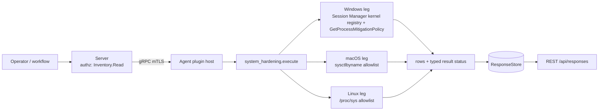

# system_hardening

<!-- BEGIN GENERATED: plugin-doc-gen header -->
| | |
|---|---|
| **What it does** | Exploit-mitigation and kernel-hardening posture (read-only) |
| **Version** | 1.0.0 |
| **Kind** | Collector · read-only · gathered (crossplatform.system_hardening.posture) |
| **Platforms** | Windows ✅ · macOS ✅ · Linux ✅ |
| **Actions** | `posture` (definition `crossplatform.system_hardening.posture`) |
| **Security** | securable `Inventory` · operation Read · risk Low · dispatch ReadOnly · approval gate None |
| **Roles** | execute: endpoint-admin, endpoint-operator · author: content-author |
<!-- END GENERATED -->

## How it works

One action, `posture` (`system_hardening_plugin.cpp`), reads a fixed allowlist of exploit-mitigation and kernel-hardening keys and writes one row per key: `posture|<os>|<key>|<raw>|<state>`. The action takes no parameters, so no request text ever reaches a path or a registry name. Every leg is rung 1 and never spawns a process. The allowlists are:

- **Linux** (`/proc/sys`, opened read-only with `open`/`read`, one table of key to path, no directory walk): `kernel.randomize_va_space`, `kernel.kptr_restrict`, `kernel.yama.ptrace_scope`, `kernel.dmesg_restrict`, `kernel.unprivileged_bpf_disabled`, `kernel.sysrq`, `fs.protected_hardlinks`, `fs.protected_symlinks`, `fs.protected_fifos`, `fs.protected_regular`, `fs.suid_dumpable`.
- **macOS** (`sysctlbyname`): `kern.securelevel`, `kern.coredump`, `kern.sugid_coredump`, `kern.bootargs`. `kern.nx` is deliberately not read: it is an unknown oid on Apple Silicon.
- **Windows** (registry plus one API): the `MitigationOptions` and `MitigationAuditOptions` values under `HKLM\SYSTEM\CurrentControlSet\Control\Session Manager\kernel`, decoded per policy into `mitigation.<policy>` and `mitigation_audit.<policy>` rows (DEP, SEHOP, force-relocate, bottom-up and high-entropy ASLR, CFG and the other fields of the kernel's system-wide mitigation option map, one two-bit nibble per policy), and `GetProcessMitigationPolicy` on the agent's own process for the `self.*` rows (DEP, ASLR, CFG). Only the agent's own process is queried; no other process is enumerated.

Every key reads as exactly one of three things: a **value** (with a state), **`absent`** (the key does not exist on this host), or **`unreadable`** (the read failed). A failed read never reads as absent: the errno (Linux, macOS) or Win32 error (Windows) decides, and each cause carries its own reason token. On Linux and macOS the state is `enabled`, `disabled` or `partial`, describing the hardening rather than the raw number (`kernel.sysrq=0` is `enabled`, `kern.coredump=1` is `disabled`); `unmodelled` means a value was read that the table has no interpretation for. Windows uses `on`, `off` and `default` instead, because a system-wide mitigation nibble is a tri-state override (not set, always on, always off) and not a hardening level. An empty macOS `kern.bootargs` is a successful read of an empty string, not a failure.

**Why this plugin exists (stated plainly, not inflated).** Zero documented driver: no capability-map, enterprise-parity, SOC 2 or `docs/roadmap.md` entry names this plugin; the nearest adjacent doc idea (`docs/roadmap.md` Issue 18.2 "Compliance Reporting Templates," CIS-benchmark-shaped) is a reporting/templating layer over rules that would already have to exist elsewhere, not a justification for this collection plugin itself, and is itself only "Proposed." This is pure capability-gap reasoning, not evidenced demand.



## OS capability

<!-- BEGIN GENERATED: plugin-doc-gen capability -->
| Action | Windows | macOS | Linux |
|---|---|---|---|
| `posture` | ✅ supported · rung 1 · HKLM\\SYSTEM\\CurrentControlSet\\Control\\Session Manager\\kernel mitigation registry + GetProcessMitigationPolicy (agent process) | ✅ supported · rung 1 · allowlisted sysctlbyname reads (kern.securelevel/coredump/sugid_coredump/bootargs) | ✅ supported · rung 1 · allowlisted /proc/sys reads (open/read, errno-classified absent/unreadable) |
<!-- END GENERATED -->

## Privileges and prerequisites

| OS | Runs as | Extra grant needed | Measured | If the read is refused |
|---|---|---|---|---|
| Windows | agent service account (LocalSystem today, #1442) | None documented for this plugin (`docs/agent-privilege-model.md`) | PENDING: the-rig capture as `NT AUTHORITY\SYSTEM` (`docs/samples/windows.txt`, and the probe text in the `system_hardening_win.cpp` banner) | An `ERROR_ACCESS_DENIED` on a registry value reports that row `unreadable` with reason `<name>:access_denied` and the action reports `PERMISSION_DENIED`/`PARTIAL`; any other Win32 error reports `<name>:win32_<n>` |
| macOS | agent daemon, root today (LaunchDaemon carries no `UserName` key — `docs/agent-privilege-model.md` TL;DR); this plugin's reads need no elevation beyond that default | None — `sysctlbyname` reads of these keys are unprivileged | 2026-09-21, bare-metal, this Mac (`braga`), unprivileged (euid 501) — real capture (`docs/samples/macos.txt`); no root-privileged run has been captured, so the root identity above is the documented production default, not a measured one | `EPERM` reports the key `unreadable` with reason `<key>:eacces`; an unknown oid (`ENOENT`) reports it `absent` with reason `<key>:enoent`; either downgrades the result to `CONSTRAINED`/`PARTIAL` |
| Linux | agent daemon, default | None — the allowlisted `/proc/sys` files are world-readable by default | container (Docker VM on this Mac), root (`euid 0`) — a real live capture of the built `.so` (`docs/samples/linux.txt`) | `EACCES`/`EPERM` reports the key `unreadable` with reason `<key>:eacces`; a missing file (for example `kernel.yama.ptrace_scope` with Yama not built in) reports it `absent` with reason `<key>:enoent`; any other errno reports `<key>:errno_<n>` |

Binaries/subprocesses: none — every leg is an in-process read (`/proc/sys`, `sysctlbyname`, the Windows registry API and `GetProcessMitigationPolicy`); no `sysctl`, `reg` or PowerShell binary is ever run. Network: none.

## Data contract

### Inputs

<!-- BEGIN GENERATED: plugin-doc-gen inputs -->
The action takes no parameters.
<!-- END GENERATED -->

### Outputs

Pipe-delimited rows, one per allowlisted key, in allowlist order, written via `write_output()`. The first field is the fixed literal `posture`, then `<os>`, `<key>`, `<raw>` and `<state>`. `<raw>` is `-` when nothing was read (`absent` or `unreadable`); a raw value that WAS read passes through the shared untrusted-output escaper. Windows rows can outnumber the allowlist: one registry value decodes into one row per policy field, and a blob longer than the documented table adds `unmodelled` rows rather than being dropped. The action returns 0 for every data-level outcome (a missing or unreadable key is a degraded result, never a failed command); only an internal exception on Windows returns 1, with the single row `constrained|internal_error`.

<!-- BEGIN GENERATED: plugin-doc-gen outputs -->
**`crossplatform.system_hardening.posture` — `os|key|raw|state`**

| Field | Type | Values | Available | Example | Description |
|---|---|---|---|---|---|
| `os` | string | `linux` `macos` `windows` | Windows, Linux, macOS | `linux` | The leg that produced the row. |
| `key` | string | - | Windows, Linux, macOS | `kernel.randomize_va_space` | Allowlisted key: a sysctl name (Linux, macOS) or a policy name (Windows: mitigation.<policy> and mitigation_audit.<policy> from the registry, self.<policy> from the agent process, or the value name itself for a failed read). |
| `raw` | string | - | Windows, Linux, macOS | `2` | The raw value read (integer, string, or 0x-prefixed hex on Windows); "-" when nothing was read (absent or unreadable). An empty macOS kern.bootargs is a successful read and an empty column. |
| `state` | string | `enabled` `disabled` `partial` `True` `False` `default` `unmodelled` `absent` `unreadable` | Windows, Linux, macOS | `enabled` | Linux and macOS: enabled/disabled/partial describe the hardening (enabled = protection on, partial = on at a weaker level), not the sysctl value. Windows: on/off/default, because a system-wide mitigation nibble is a tri-state override (not set / always on / always off), not a hardening level. unmodelled = a value was read that this table has no interpretation for. absent = the key does not exist here. unreadable = the read failed. |
<!-- END GENERATED -->

### Result status

| Status | Completeness | Provenance | When |
|---|---|---|---|
| `OK` | `FULL` | — | Every allowlisted key was read. Because an absent key adds a reason token, a host that lacks an optional key (for example Yama not built into the Linux kernel) never reports `OK`. |
| `CONSTRAINED` | `PARTIAL` | `<key>:enoent`, `<key>:eacces`, `<key>:errno_<n>`, `<name>:not_found`, `<name>:win32_<n>`, `<name>:type_<n>`, `<name>:oversized`, `<name>:unsupported` | At least one key was `absent` or `unreadable`; the status reason lists one `<key>:<cause>` token per failed key, and the matching row carries the same state. Windows decoder failures (`empty_blob`, `odd_length`, `not_qword_aligned`, `oversized`, `no_hex_digits`, `odd_hex_digits`, `bad_hex`) appear as `<name>:<token>`. |
| `CONSTRAINED` | `PARTIAL` | `internal_error` | Windows only: an unexpected exception was caught; the action returns 1 with the row `constrained\|internal_error`. |
| `PERMISSION_DENIED` | `PARTIAL` | `<name>:access_denied` | Windows only: a registry read was refused with `ERROR_ACCESS_DENIED`. |

### Where the data goes

- **Instruction result.** Rows travel over the agent's mTLS gRPC channel as the command response and land in the ResponseStore, queryable at `/api/responses/{id}`. `posture` is also a gathered definition (`crossplatform.system_hardening.posture`, 300s TTL).
- **Not consumed by** daily-sync, TAR, DEX, or metrics.
- **Sensitivity.** Rows carry kernel and mitigation settings only: no username, path, process name or installed-software name. The values are a security-posture baseline of the host (for example ASLR off, ptrace unrestricted, core dumps enabled), which is useful to an attacker choosing an exploit, so the rows warrant the same handling as other `Inventory` data. `kern.bootargs`, where non-empty, echoes the host's boot arguments verbatim.
- **Siblings:** `vuln_scan` (its configuration checks read two of the same Linux keys, `kernel.randomize_va_space` and `fs.suid_dumpable`, as pass/fail findings; this plugin reports the raw value and state) and `bitlocker` (disk encryption posture).

## Sample output

<!-- BEGIN GENERATED: plugin-doc-gen samples -->
**macOS** — captured: macos macOS 26.6.2 arm64 · bare-metal · 2026-09-21 · euid 501 · leg-hash 280e3355d168

```
== action=posture
posture|macos|kern.securelevel|0|disabled
posture|macos|kern.coredump|1|disabled
posture|macos|kern.sugid_coredump|0|enabled
posture|macos|kern.bootargs||enabled
[result_status] OK / FULL
```
<!-- END GENERATED -->

## Caveats and known gaps

1. **No documented business driver.** The priority for this plugin is asserted from a capability-gap reading, not evidenced by any tracked demand (see "How it works"); there is no named customer, SOC 2 control or CVE behind it.
2. **Two state vocabularies.** Linux and macOS report `enabled`/`disabled`/`partial`; Windows reports `on`/`off`/`default` because a system-wide mitigation nibble is a tri-state override, not a hardening level. Consumers key on the `<os>` column. The three failure and unknown tokens (`unmodelled`, `absent`, `unreadable`) are the same on every OS.
3. **An absent optional key downgrades the run.** By design every `absent` key adds a reason token, so a host without Yama or without `kernel.unprivileged_bpf_disabled` reports `CONSTRAINED`/`PARTIAL` even though every key that exists was read.
4. **The Windows self rows describe the agent process only.** The `self.*` rows come from `GetProcessMitigationPolicy`, called on the agent's own process, so those rows are the agent's effective DEP/ASLR/CFG policy, not a statement about other processes; the system-wide policy is the registry value (`mitigation.*`). A host where `MitigationOptions` has never been written reads `absent` for that value.
5. **Fixed allowlists, no discovery.** The plugin reads only the keys listed above; it does not walk `/proc/sys` or the registry, and it does not report Linux LSM state (SELinux, AppArmor) or macOS SIP and Gatekeeper posture.

## Source and tests

<!-- BEGIN GENERATED: plugin-doc-gen source -->
- Plugin: `agents/plugins/system_hardening/src/system_hardening_legs.hpp` · `agents/plugins/system_hardening/src/system_hardening_linux.cpp` · `agents/plugins/system_hardening/src/system_hardening_macos.cpp` · `agents/plugins/system_hardening/src/system_hardening_parsers.hpp` · `agents/plugins/system_hardening/src/system_hardening_plugin.cpp` · `agents/plugins/system_hardening/src/system_hardening_win.cpp` · `agents/plugins/system_hardening/src/system_hardening_win_parsers.hpp`
- Definitions: `content/definitions/system_hardening.yaml`
- Capability rows: `server/core/src/capability_decls/plugin_action_catalogue_system_hardening.hpp`
- Tests: `tests/unit/test_system_hardening_local_dispatcher.cpp` · `tests/unit/test_system_hardening_parsers.cpp` · `tests/unit/test_system_hardening_win_parsers.cpp`
- Privilege row: `docs/agent-privilege-model.md`
<!-- END GENERATED -->
