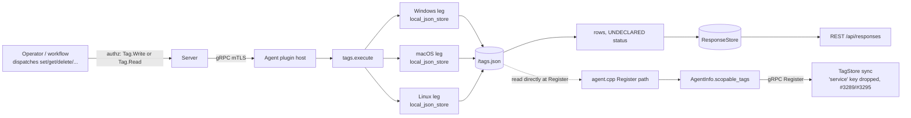

# tags

<!-- BEGIN GENERATED: plugin-doc-gen header -->
| | |
|---|---|
| **What it does** | Device tagging — set, get, delete, list tags for scope evaluation |
| **Version** | 0.1.0 |
| **Kind** | Action · mutating · gathered (device.tags.set, device.tags.get, device.tags.get_all, device.tags.delete, device.tags.check, device.tags.clear, device.tags.count) |
| **Platforms** | Windows ✅ · macOS ✅ · Linux ✅ |
| **Actions** | `check` (definition `device.tags.check`) · `clear` (definition `device.tags.clear`) · `count` (definition `device.tags.count`) · `delete` (definition `device.tags.delete`) · `get` (definition `device.tags.get`) · `get_all` (definition `device.tags.get_all`) · `set` (definition `device.tags.set`) |
| **Security** | `set`: securable `Tag` · operation Write · risk Medium · dispatch Mutating · approval gate None; `get`: securable `Tag` · operation Read · risk Low · dispatch ReadOnly · approval gate None; `get_all`: securable `Tag` · operation Read · risk Low · dispatch ReadOnly · approval gate None; `delete`: securable `Tag` · operation Delete · risk High · dispatch Mutating · approval gate None; `check`: securable `Tag` · operation Read · risk Low · dispatch ReadOnly · approval gate None; `clear`: securable `Tag` · operation Delete · risk High · dispatch Destructive · approval gate AdminOrApproval; `count`: securable `Tag` · operation Read · risk Low · dispatch ReadOnly · approval gate None |
| **Roles** | execute: endpoint-admin, endpoint-operator · author: content-author |
<!-- END GENERATED -->

## How it works

All 7 actions are pure in-process reads/writes of a flat `<data_dir>/tags.json` object (tags_plugin.cpp:13,80-104); `load_tags()`/`save_tags()` re-serialize the whole file on every mutating call (tags_plugin.cpp:36-76). `set` validates the key (≤64 chars, `^[a-zA-Z0-9_.:\-]+$` by convention) and value (≤448 bytes) before writing (tags_plugin.cpp:166-189); `get`/`check`/`delete` look a single key up in the in-memory map, and `get_all`/`count` walk the whole map (tags_plugin.cpp:191-251). `clear` wipes every tag in one call and is classified Destructive/Irreversible (capdecls `plugin_action_catalogue_d.hpp:107-120`) rather than the Mutating/Reversible tier `set`/`delete` carry, and is the only action gated `AdminOrApproval` and restricted to `endpoint-admin` (`tags.yaml` `device.tags.clear`).

It is deliberately not the channel that reaches the server. `tags.json` is separately read verbatim by the agent's Register RPC path (`agent.cpp:1701-1725`), independent of this plugin's own load path, and the server drops any self-reported `service` key at ingest (`agent_registry.cpp:56-67`, #3295) before persisting the rest to the Postgres-backed TagStore (`tag_store.cpp` `sync_agent_tags:345-433`). It is also not the structured 4-category tag store — that role belongs to the sibling `asset_tags` plugin (see Siblings below).



## OS capability

<!-- BEGIN GENERATED: plugin-doc-gen capability -->
| Action | Windows | macOS | Linux |
|---|---|---|---|
| `check` | ✅ supported · rung 1 · local_json_store | ✅ supported · rung 1 · local_json_store | ✅ supported · rung 1 · local_json_store |
| `clear` | ✅ supported · rung 1 · local_json_store | ✅ supported · rung 1 · local_json_store | ✅ supported · rung 1 · local_json_store |
| `count` | ✅ supported · rung 1 · local_json_store | ✅ supported · rung 1 · local_json_store | ✅ supported · rung 1 · local_json_store |
| `delete` | ✅ supported · rung 1 · local_json_store | ✅ supported · rung 1 · local_json_store | ✅ supported · rung 1 · local_json_store |
| `get` | ✅ supported · rung 1 · local_json_store | ✅ supported · rung 1 · local_json_store | ✅ supported · rung 1 · local_json_store |
| `get_all` | ✅ supported · rung 1 · local_json_store | ✅ supported · rung 1 · local_json_store | ✅ supported · rung 1 · local_json_store |
| `set` | ✅ supported · rung 1 · local_json_store | ✅ supported · rung 1 · local_json_store | ✅ supported · rung 1 · local_json_store |
<!-- END GENERATED -->

## Privileges and prerequisites

| OS | Runs as | Extra grant needed | Measured | If the read is refused |
|---|---|---|---|---|
| Windows | agent service account — LocalSystem today, not yet the intended `NT SERVICE\YuzuAgent` (#1442; `docs/agent-privilege-model.md:12`) | None — plain file I/O under `<data_dir>`, no OS API, no elevated right | 2026-09-07 on bare metal as SYSTEM | No refusal path exists; a failed `save_tags()` write is silently swallowed (see below) |
| macOS | agent daemon, root — the shipped LaunchDaemon has no `UserName` key (`docs/agent-privilege-model.md:14`) | None | 2026-09-07 on bare metal at euid 501 (alex) — unprivileged, not the production root daemon | Same as Windows |
| Linux | dedicated unprivileged account (`_yuzu`/`yuzu`; `docs/agent-privilege-model.md:12`) | None | 2026-09-06 in a container at euid 0 — more privileged than the production account | Same as Windows |

No external binaries, no subprocesses, no network access — every action is an in-process read/write of a local JSON file (`tags_plugin.cpp`; a grep for `popen`/`CreateProcess`/socket calls over this file returns nothing).

## Data contract

### Inputs

<!-- BEGIN GENERATED: plugin-doc-gen inputs -->
| Definition | Parameter | Type | Required | Default | Constraints | Description |
|---|---|---|---|---|---|---|
| `device.tags.check` | `key` | string | yes | - | maxLength 64 | The tag key to check for existence. |
| `device.tags.delete` | `key` | string | yes | - | maxLength 64 | The tag key to delete. |
| `device.tags.get` | `key` | string | yes | - | maxLength 64 | The tag key to look up. |
| `device.tags.set` | `key` | string | yes | - | pattern: ^[a-zA-Z0-9_.:\-]+$ · maxLength 64 | The tag key. Max 64 characters, alphanumeric plus _-.: |
| `device.tags.set` | `value` | string | no | - | maxLength 448 | The tag value. Max 448 bytes. |
<!-- END GENERATED -->

### Outputs

Every action writes one or more pipe-delimited lines via `ctx.write_output`; there is no shared discriminator across actions — each uses its own literal prefix (`tag_set`, `tag`, `tag_deleted`, `tag_exists`, `tags_cleared`, `count`) rather than the field names declared below. A missing/unset value reports as an empty string (a trailing empty field), never a `-` placeholder (`tags_plugin.cpp:200`; see the macOS sample's `get`). A validation failure returns `rc=1` and a distinct `error|<message>` line instead of the success row (`tags_plugin.cpp:169-172,180-183,193-196,217-220,230-233`).

<!-- BEGIN GENERATED: plugin-doc-gen outputs -->
**`device.tags.check` — `key|exists`**

| Field | Type | Values | Available | Example | Description |
|---|---|---|---|---|---|
| `key` | string | - | Windows, Linux, macOS | `yuzu_capture_tmp` | The tag key that was checked, echoed back from the request. Values: free text. |
| `exists` | bool | - | Windows, Linux, macOS | `false` | Whether the key currently exists. Values: true, false. |

**`device.tags.clear` — `cleared_count`**

| Field | Type | Values | Available | Example | Description |
|---|---|---|---|---|---|
| `cleared_count` | int32 | - | Windows, Linux, macOS | `-` | Number of tags that were removed by this call — the store's size immediately before clearing. Values: integer >= 0. |

**`device.tags.count` — `count`**

| Field | Type | Values | Available | Example | Description |
|---|---|---|---|---|---|
| `count` | int32 | - | Windows, Linux, macOS | `0` | Total number of tags currently stored. Values: integer >= 0. |

**`device.tags.delete` — `key|found`**

| Field | Type | Values | Available | Example | Description |
|---|---|---|---|---|---|
| `key` | string | - | Windows, Linux, macOS | `yuzu_capture_tmp` | The tag key that was deleted, echoed back from the request. Values: free text. |
| `found` | bool | - | Windows, Linux, macOS | `false` | Whether the key existed before this call. Values: true, false. |

**`device.tags.get` — `key|value`**

| Field | Type | Values | Available | Example | Description |
|---|---|---|---|---|---|
| `key` | string | - | Windows, Linux, macOS | `yuzu_capture_tmp` | The tag key that was looked up, echoed back from the request. Values: free text. |
| `value` | string | - | Windows, Linux, macOS | - | The tag's current value, or an empty string when the key is not set. Values: free text, empty when unset. |

**`device.tags.get_all` — `key|value|count`**

| Field | Type | Values | Available | Example | Description |
|---|---|---|---|---|---|
| `key` | string | - | Windows, Linux, macOS | `yuzu_capture_tmp` | One stored tag's key. One row per tag currently in the store. Values: free text. |
| `value` | string | - | Windows, Linux, macOS | `1` | That tag's value. Values: free text. |
| `count` | int32 | - | Windows, Linux, macOS | `0` | Total number of tags currently stored, on a trailing line after the tag rows. Values: integer >= 0. |

**`device.tags.set` — `key|value`**

| Field | Type | Values | Available | Example | Description |
|---|---|---|---|---|---|
| `key` | string | - | Windows, Linux, macOS | `yuzu_capture_tmp` | The tag key that was written, echoed back from the request. Values: free text. |
| `value` | string | - | Windows, Linux, macOS | `1` | The tag value that was written, echoed back from the request. Values: free text. |
<!-- END GENERATED -->

### Result status

This plugin does not set a typed result status; the agent records `UNDECLARED` and every sample shows `UNDECLARED / UNKNOWN /` (no `set_result_status`/`yuzu_ctx_set_result_status` call anywhere in `tags_plugin.cpp`).

### Where the data goes

- **Instruction result only** for row data — reaches the ResponseStore via the standard command-response path, queryable at `/api/responses/{id}`.
- **`tags.json` is also read independently of this plugin, at agent Register time** (`agent.cpp:1701-1725`), populating `AgentInfo.scopable_tags` on the gRPC `Register` call; the server's handler syncs it into the Postgres-backed TagStore (`agent_service_impl.cpp:577-585` → `tag_store.cpp` `sync_agent_tags:345-433`) after dropping any self-reported `service` key (`agent_registry.cpp:56-67`, `tag_store.cpp:374-379`, #3289/#3295) — this happens whether or not an operator ever dispatches a `tags.*` action.
- Every other key reaches `tag:<key>` scope-DSL evaluation via the store-first resolver (#3295) and management-group targeting.
- `clear`'s dashboard dispatch is additionally subject to the Destructive-class targeting rule — no fleet broadcast, an explicit in-scope target is required (`changelog.d/3885-dashboard-destructive-targeting.security.md`, which names `tags.clear` directly).
- **Not consumed by** daily-sync inventory, the TAR warehouse, or DEX.
- **Sensitivity.** `key`/`value` rows are free-form text chosen entirely by the caller (bounded only by the length limits in Inputs) — whether a given tag identifies a device, a person, or installed software depends on what was set, not on anything the plugin itself constrains. The `count`/`found`/`exists` fields carry nothing beyond the device id.
- **Siblings:** `asset_tags` — the narrower, server-authoritative 4-category (`role`/`environment`/`location`/`service`) tag sync, which only reacts to a server-pushed `sync`; `tags` is the general-purpose, agent-authoritative free-form key/value store, and the only one of the two an agent can write to unprompted.
- **MCP / REST.** Discover: `discover_plugins` (summary) → `yuzu://plugin-docs` (this page as data) → `discover_instructions` / `get_definition("device.tags.get_all")`. Run: `execute_instruction {definition_id, parameters}`. Read: `/api/responses/{id}`.

## Sample output

<!-- BEGIN GENERATED: plugin-doc-gen samples -->
**Windows** — captured: windows Microsoft Windows NT 10.0.26200.0 x64 · bare-metal · 2026-09-07 · SYSTEM · leg-hash d55c173b7ddd

```
== action=set key=yuzu_capture_tmp value=1
tag_set|yuzu_capture_tmp|1
[result_status] UNDECLARED / UNKNOWN

== action=get key=yuzu_capture_tmp
tag|yuzu_capture_tmp|
[result_status] UNDECLARED / UNKNOWN

== action=get_all
count|0
[result_status] UNDECLARED / UNKNOWN

== action=delete key=yuzu_capture_tmp
tag_deleted|yuzu_capture_tmp|false
[result_status] UNDECLARED / UNKNOWN

== action=check key=yuzu_capture_tmp
tag_exists|yuzu_capture_tmp|false
[result_status] UNDECLARED / UNKNOWN

== action=clear
[not captured] Destructive/Irreversible: not executed on a live host

== action=count
count|0
[result_status] UNDECLARED / UNKNOWN
```

**macOS** — captured: macos macOS 26.6.2 arm64 · bare-metal · 2026-09-07 · euid 501 (alex) · leg-hash d55c173b7ddd

```
== action=set key=yuzu_capture_tmp value=1
tag_set|yuzu_capture_tmp|1
[result_status] UNDECLARED / UNKNOWN

== action=get key=yuzu_capture_tmp
tag|yuzu_capture_tmp|
[result_status] UNDECLARED / UNKNOWN

== action=get_all
count|0
[result_status] UNDECLARED / UNKNOWN

== action=delete key=yuzu_capture_tmp
tag_deleted|yuzu_capture_tmp|false
[result_status] UNDECLARED / UNKNOWN

== action=check key=yuzu_capture_tmp
tag_exists|yuzu_capture_tmp|false
[result_status] UNDECLARED / UNKNOWN

== action=clear
[not captured] Destructive/Irreversible: not executed on a live host

== action=count
count|0
[result_status] UNDECLARED / UNKNOWN
```

**Linux** — captured: linux Debian GNU/Linux 13 (trixie) aarch64 · container · 2026-09-06 · euid 0 · leg-hash d55c173b7ddd

```
== action=set key=yuzu_capture_tmp value=1
tag_set|yuzu_capture_tmp|1
[result_status] UNDECLARED / UNKNOWN

== action=get key=yuzu_capture_tmp
tag|yuzu_capture_tmp|
[result_status] UNDECLARED / UNKNOWN

== action=get_all
count|0
[result_status] UNDECLARED / UNKNOWN

== action=delete key=yuzu_capture_tmp
tag_deleted|yuzu_capture_tmp|false
[result_status] UNDECLARED / UNKNOWN

== action=check key=yuzu_capture_tmp
tag_exists|yuzu_capture_tmp|false
[result_status] UNDECLARED / UNKNOWN

== action=clear
[not captured] Destructive/Irreversible: not executed on a live host

== action=count
count|0
[result_status] UNDECLARED / UNKNOWN
```
<!-- END GENERATED -->

## Caveats and known gaps

1. **The capture harness never calls `init()`, so every sample reflects a fresh, path-less store.** `load_tags()`/`save_tags()` both no-op when `g_tags_path` is empty (`tags_plugin.cpp:38-39,62-63`), and only `init()` sets that path from `agent.data_dir` (`tags_plugin.cpp:132-137`) — the plugin-capture driver's `PluginHandle::load` + `LocalDispatcher::run` path never calls it (confirmed against `agent.cpp:971-982`, which calls `init()` only from the agent's own boot loop). `set`'s `tag_set` line is a real in-memory write, but nothing lands on disk, so the very next `get`/`check`/`get_all`/`count` in the same sample sees an empty store. This is a harness artifact, not evidence that `set` fails to persist in production.
2. **A persistence failure is silent.** `save_tags()`'s `ofstream` open and write are unchecked (`tags_plugin.cpp:72-75`); an unwritable `data_dir` or a full disk drops the write with no error returned to the caller or the operator.
3. **`clear` was never executed on a live host.** All three samples show `[not captured]` for `clear` — the mutator capture policy withholds Destructive/Irreversible actions. It is also the one action in this plugin whose dashboard dispatch now requires an explicit, in-scope target rather than a fleet broadcast (#3885).
4. **The `tests/unit` files matching "tags" are not this plugin's tests.** `test_guardian_health_fleet_tags.cpp`, `test_guardian_journal_fleet_tags.cpp`, and `test_spark_fleet_tags.cpp` bind Prometheus heartbeat *label* keys for Guardian/Spark telemetry — none load `TagsPlugin` or reference `tags_plugin.cpp`. No dedicated unit test exercises this plugin's `execute()`.
5. **`service` is the one key this plugin can set locally that the server will never honor.** A `tags.json` `service` entry is dropped both at Register ingest (`agent_registry.cpp:56-67`) and at TagStore sync (`tag_store.cpp:374-379`) — see #3289/#3295. Every other key set here reaches `tag:<key>` scope-DSL evaluation normally.

## Source and tests

<!-- BEGIN GENERATED: plugin-doc-gen source -->
- Plugin: `agents/plugins/tags/src/tags_plugin.cpp`
- Definitions: `content/definitions/tags.yaml`
- Capability rows: `server/core/src/capability_decls/plugin_action_catalogue_d.hpp`
- Tests: none found by name
- Privilege row: `docs/agent-privilege-model.md` (no row yet)
- Changelog: `changelog.d/3216-svc-scope-gate-primitives-tagstore.fixed.md`
<!-- END GENERATED -->
