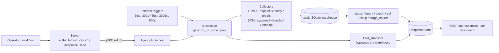

# tar

<!-- BEGIN GENERATED: plugin-doc-gen header -->
| | |
|---|---|
| **What it does** | Timeline Activity Record -- continuous system state change tracking |
| **Version** | 1.0.0 |
| **Kind** | Action · mutating · gathered (crossplatform.tar.status, crossplatform.tar.query, crossplatform.tar.snapshot, crossplatform.tar.export, crossplatform.tar.configure, crossplatform.tar.collect_fast, crossplatform.tar.collect_slow, crossplatform.tar.compatibility, crossplatform.tar.fleet_snapshot, crossplatform.tar.sql, crossplatform.tar.recent_processes, crossplatform.tar.tcp_by_process, crossplatform.tar.listening_ports, crossplatform.tar.hourly_process_summary, crossplatform.tar.service_state_changes, crossplatform.tar.connections_to_ip, crossplatform.tar.daily_connection_summary, crossplatform.tar.user_sessions, crossplatform.tar.process_tree, crossplatform.tar.daily_process_summary, crossplatform.tar.recent_processes_iso, crossplatform.tar.rollup, crossplatform.tar.recent_arp, crossplatform.tar.recent_dns, crossplatform.tar.recent_mapdrive) |
| **Platforms** | Windows ✅ · macOS ✅ · Linux ✅ |
| **Actions** | `collect_fast` (definition `crossplatform.tar.collect_fast`) · `collect_perf` · `collect_slow` (definition `crossplatform.tar.collect_slow`) · `collect_software` · `compatibility` (definition `crossplatform.tar.compatibility`) · `configure` (definition `crossplatform.tar.configure`) · `export` (definition `crossplatform.tar.export`) · `fleet_snapshot` (definition `crossplatform.tar.fleet_snapshot`) · `purge_source` · `query` (definition `crossplatform.tar.query`) · `rollup` (definition `crossplatform.tar.rollup`) · `snapshot` (definition `crossplatform.tar.snapshot`) · `sql` (definition `crossplatform.tar.connections_to_ip`, `crossplatform.tar.daily_connection_summary`, `crossplatform.tar.daily_process_summary`, `crossplatform.tar.hourly_process_summary`, `crossplatform.tar.listening_ports`, `crossplatform.tar.process_tree`, `crossplatform.tar.recent_arp`, `crossplatform.tar.recent_dns`, `crossplatform.tar.recent_mapdrive`, `crossplatform.tar.recent_processes`, `crossplatform.tar.recent_processes_iso`, `crossplatform.tar.service_state_changes`, `crossplatform.tar.sql`, `crossplatform.tar.tcp_by_process`, `crossplatform.tar.user_sessions`) · `status` (definition `crossplatform.tar.status`) |
| **Security** | `fleet_snapshot`: securable `Response` · operation Read · risk Low · dispatch ReadOnly · approval gate None; `status`: securable `Infrastructure` · operation Read · risk Low · dispatch ReadOnly · approval gate None; `query`: securable `Infrastructure` · operation Read · risk Medium · dispatch ReadOnly · approval gate None; `snapshot`: securable `Infrastructure` · operation Read · risk Low · dispatch ReadOnly · approval gate None; `export`: securable `Infrastructure` · operation Read · risk Medium · dispatch ReadOnly · approval gate None; `configure`: securable `Infrastructure` · operation Write · risk Medium · dispatch Mutating · approval gate AdminOrApproval; `collect_fast`: securable `Infrastructure` · operation Read · risk Low · dispatch ReadOnly · approval gate None; `collect_slow`: securable `Infrastructure` · operation Read · risk Low · dispatch ReadOnly · approval gate None; `collect_perf`: securable `Infrastructure` · operation Read · risk Low · dispatch ReadOnly · approval gate None; `collect_software`: securable `Infrastructure` · operation Read · risk Low · dispatch ReadOnly · approval gate None; `rollup`: securable `Infrastructure` · operation Delete · risk High · dispatch Destructive · approval gate None; `sql`: securable `Infrastructure` · operation Read · risk Medium · dispatch ReadOnly · approval gate None; `compatibility`: securable `Infrastructure` · operation Read · risk Low · dispatch ReadOnly · approval gate None; `purge_source`: securable `Infrastructure` · operation Delete · risk High · dispatch Destructive · approval gate None |
| **Roles** | execute: endpoint-admin, endpoint-operator · author: content-author |
<!-- END GENERATED -->

## How it works

TAR is the agent's local telemetry warehouse. Four scheduled collectors diff each cycle's OS
snapshot against the previous baseline and append change events to a local SQLite database
(`tar.db`): `collect_fast` (process + network, default 60s), `collect_slow` (service + user
session, default 300s), `collect_perf` (device CPU/memory/disk/network counters, default 30s) and
`collect_software` (installed-software inventory, default hourly) — all four triggers are
registered in `init()` (`tar_plugin.cpp:601-644`). `collect_slow` also drives a generic cursor-model
loop (`tar_plugin.cpp:2122-2130`) over the sources `make_cursor_sources()` constructs
(`tar_cursor_sources.cpp:30-35`): `power` (sleep/wake/AC-power transitions — Windows
`PowerRegisterSuspendResumeNotification`/`WM_POWERBROADCAST`, Linux `systemd-logind`
PrepareForSleep + power-supply sysfs/udev, macOS `pmset -g log` replay) and `removable`
(removable-media attach/detach plus exec-from-removable correlation — Windows `EvtQuery` over the
Partition/Diagnostic and Kernel-PnP channels, Linux a udev netlink monitor, macOS DiskArbitration
`DADiskAppeared`/`Disappeared`; `tar_removable_diskarb.mm`). Both are the first
works-council-class sources shipped **on by default** (`tar_schema_registry.cpp:976-992`,
"ALEX RULING 2026-09-04") — every other opt-in source added since 1.5 (procperf, netqual, module,
software, arp, dns, netconn, mapdrive) still defaults off; the plugin now has 15 registered
capture sources, 7 on by default (the five always-on machine-scope sources plus `power` and
`removable`) and 8 opt-in. `rollup` runs every 15 minutes: it always
aggregates live rows into hourly/daily/monthly tiers first, then unconditionally enforces
retention on every tier, deleting aged rows (`tar_plugin.cpp:3619-3627`) — the ordering is
load-bearing and the reason the capability declaration marks this action Destructive/Irreversible.
Reads go through `status` (health + the retention clock-guard counters), `query`/`export` (the
core process/network/service/user/software union, or one type behind an explicit filter — arp,
dns and mapdrive are opt-in PII sources reachable only that way, never the default feed) and `sql`
(an arbitrary `SELECT` against `$`-prefixed warehouse tables, validated SELECT-only and translated
to real table names — `tar_sql_executor.cpp:205-244`). `snapshot` forces an out-of-cycle full
collection across all four collectors and reports `complete` or `partial|<sources>` if any source
retained a stale baseline instead. `fleet_snapshot` is a separate on-demand full re-enumeration
that bypasses the warehouse entirely, feeding the 3D fleet-topology view. `configure` rewrites
around 25 collection knobs (retention, intervals, per-source enable flags, redaction patterns).
`purge_source` deletes every warehouse row for one named source, but only once that source is
already disabled — closing the scan-then-purge race a still-collecting source would otherwise hit
(`tar_plugin.cpp:2987-3031`).

Deliberately not: TAR does not stream events to the server in real time — everything lands in the
local warehouse first and is pulled on `query`/`export`/`sql`/`status`. It does not replay history
from zero when a cursor-model source's log position is lost or wraps — it re-baselines forward and
records a `capture_gap` (`tar_cursor.hpp:25-75`). It never fabricates OS support: a leg without a
bound mechanism reports `planned`, not a guessed read.



## OS capability

<!-- BEGIN GENERATED: plugin-doc-gen capability -->
| Action | Windows | macOS | Linux |
|---|---|---|---|
| `collect_fast` | ✅ supported · rung 1 · etw+iphlpapi | 🟡 constrained · rung 1 · endpoint_security+nstat+route_sysctl | 🟡 constrained · rung 1 · procfs |
| `collect_perf` | ✅ supported · rung 1 · ntcounters | 🟡 planned · rung 1 · host_statistics | ✅ supported · rung 1 · procfs |
| `collect_slow` | ✅ supported · rung 1 · scm+wts+wnet+wevtapi | 🟡 constrained · rung 2 · launchctl+utmpx+getfsstat | 🟡 constrained · rung 2 · systemctl+utmp |
| `collect_software` | ✅ supported · rung 1 · registry | 🟡 planned · rung 2 · pkgutil | 🟡 planned · rung 2 · dpkg_rpm |
| `compatibility` | ✅ supported · rung 1 · sqlite | ✅ supported · rung 1 · sqlite | ✅ supported · rung 1 · sqlite |
| `configure` | ✅ supported · rung 1 · sqlite | ✅ supported · rung 1 · sqlite | ✅ supported · rung 1 · sqlite |
| `export` | ✅ supported · rung 1 · sqlite | ✅ supported · rung 1 · sqlite | ✅ supported · rung 1 · sqlite |
| `fleet_snapshot` | ✅ supported · rung 1 · iphlpapi+win32_process_enum | 🟡 constrained · rung 1 · libproc(proc_pidfdinfo) | ✅ supported · rung 1 · procfs |
| `purge_source` | ✅ supported · rung 1 · sqlite | ✅ supported · rung 1 · sqlite | ✅ supported · rung 1 · sqlite |
| `query` | ✅ supported · rung 1 · sqlite | ✅ supported · rung 1 · sqlite | ✅ supported · rung 1 · sqlite |
| `rollup` | ✅ supported · rung 1 · sqlite | ✅ supported · rung 1 · sqlite | ✅ supported · rung 1 · sqlite |
| `snapshot` | ✅ supported · rung 1 · etw+iphlpapi+scm+wts+wnet+wevtapi+registry | 🟡 constrained · rung 2 · endpoint_security+nstat+launchctl+getfsstat+pkgutil(planned) | 🟡 constrained · rung 2 · procfs+systemctl+dpkg_rpm(planned) |
| `sql` | ✅ supported · rung 1 · sqlite | ✅ supported · rung 1 · sqlite | ✅ supported · rung 1 · sqlite |
| `status` | ✅ supported · rung 1 · sqlite | ✅ supported · rung 1 · sqlite | ✅ supported · rung 1 · sqlite |

**Declared limits per leg** (descriptor fallback text, verbatim):

- **`collect_fast` / macOS** — process/tcp fall back to a KERN_PROC_ALL/proc_pidfdinfo poll without the Endpoint Security entitlement or nstat root privilege; dns opt-in sub-source is PLANNED (no-op) on macOS; arp opt-in sub-source is native but constrained (route_sysctl, entry_type always 'unknown')
- **`collect_fast` / Linux** — dns opt-in sub-source is PLANNED (no-op) on Linux; arp opt-in sub-source is native (procfs, /proc/net/arp); core process/network/netqual collection is native
- **`collect_slow` / macOS** — service enumeration runs bounded argv (rung 2) via the shared subprocess runner; no startup_type; mapdrive opt-in source is wired but outbound-live-only (getfsstat, no username, no inbound, no history); netconn opt-in source is PLANNED (no-op) on macOS
- **`collect_slow` / Linux** — service enumeration runs bounded argv (rung 2) via the shared subprocess runner; startup_type reads 'unknown'; netconn opt-in source is PLANNED (no-op) on Linux
- **`fleet_snapshot` / macOS** — inherent TOCTOU between pid enumeration and per-fd query; short-lived sockets may be missed
- **`snapshot` / macOS** — software collection is PLANNED on macOS; mapdrive is wired but outbound-live-only (getfsstat, no username, no inbound, no history); service enumeration runs bounded argv (rung 2) via the shared subprocess runner; process/tcp fall back to a poll without the Endpoint Security entitlement or nstat root privilege
- **`snapshot` / Linux** — software inventory collection is PLANNED (dpkg/rpm not yet wired) on Linux; service enumeration runs bounded argv (rung 2) via the shared subprocess runner
<!-- END GENERATED -->

## Privileges and prerequisites

| OS | Runs as | Extra grant needed | Measured | If the read is refused |
|---|---|---|---|---|
| Windows | Agent service account, granted `SeBackupPrivilege` (read regardless of DACL) and `Performance Log Users` group membership (`docs/agent-privilege-model.md:94`) | **None beyond install-time grants.** `SeBackupPrivilege` and the ETW-enabling group membership are already provisioned; the `software` source needs no extra privilege beyond the account's existing registry-read access. | 2026-09-07, bare-metal, captured as `SYSTEM` — broader privilege than the deployed service account; no OS-level read was reached in this capture (see Caveats) | Not observed in this capture. The Windows legs never fall back to a poll (they are all `supported`, not `constrained`) — a refused read would surface as an `error\|` line from the underlying Win32 call, not a degrade. |
| macOS | **root** (LaunchDaemon, no `UserName` — `docs/agent-privilege-model.md:94`) | Endpoint Security process capture needs root **and** the `com.apple.developer.endpoint-security.client` entitlement; without both, `es_new_client`/`es_subscribe` fails and the process/tcp legs self-heal to the `KERN_PROC_ALL`/`proc_pidfdinfo` poll (`tar_proc_es.cpp:118-121,327-328`). | 2026-09-07, bare-metal, captured at **euid 501 (alex)** — unprivileged; the root LaunchDaemon path was not exercised by this capture. | A missing entitlement/privilege never blocks the leg outright — it logs a warning and falls back to the poll (`tar_proc_es.cpp:327-328`). |
| Linux | Agent account with `cap_dac_read_search` set on the binary (`docs/agent-privilege-model.md:94`); not root | None beyond the binary capability. Service enumeration (`systemctl`) runs as bounded argv under the agent account, not elevated. | 2026-09-06, container, captured at **euid 0 (root)** — broader than the deployed `cap_dac_read_search` account. | Not observed in this capture. |

Binaries/subprocesses/network: `systemctl list-units --type=service --all --plain --no-pager --no-legend` and
`launchctl list` (both via the shared bounded-argv runner `yuzu::agent::run_bounded_subprocess`,
never a shell string — `tar_service_collector.cpp:244-247,277,305-306,329`; the same runner
executes `smbstatus` for the mapdrive collector, `tar_mapdrive_collector.cpp:1110,1165,1233`); a
Windows ETW session on provider `Microsoft-Windows-Kernel-Process`
(`tar_proc_etw.cpp:48-49,337,349,370,383,397`) and a second ETW session for module-load capture
(`tar_module_etw.cpp:458-498`); an in-process macOS Endpoint Security client
(`tar_proc_es.cpp:313-314,327`); raw sockets — `PF_SYSTEM`/`SYSPROTO_CONTROL` for the macOS nstat
client (`tar_netqual_nstat.cpp:906,938`) and `AF_NETLINK`/`NETLINK_SOCK_DIAG` on Linux
(`tar_network_collector.cpp:529`). No `popen`, `CreateProcess`, or `posix_spawn` call exists
anywhere in the plugin's 48 source files.

## Data contract

### Inputs

<!-- BEGIN GENERATED: plugin-doc-gen inputs -->
| Definition | Parameter | Type | Required | Default | Constraints | Description |
|---|---|---|---|---|---|---|
| `crossplatform.tar.configure` | `retention_days` | string | no | - | pattern: ^[0-9]+$ | Number of days to retain TAR events before automatic purging. Valid range: 1-365. Default: 7. |
| `crossplatform.tar.configure` | `fast_interval` | string | no | - | pattern: ^[0-9]+$ | Interval in seconds for process and network collection. Valid range: 10-3600. Default: 60. |
| `crossplatform.tar.configure` | `slow_interval` | string | no | - | pattern: ^[0-9]+$ | Interval in seconds for service and user session collection. Valid range: 30-7200. Default: 300. |
| `crossplatform.tar.configure` | `redaction_patterns` | string | no | - | - | JSON array of case-insensitive SUBSTRING patterns (not glob) for command-line redaction. Leading/trailing `*` are stripped; `?` and `[abc]` are literals. Any process command line containing a pattern has its cmdline replaced with "[REDACTED by TAR]". At most 256 elements of at most 256 characters each; over-cap elements are dropped at load. Default patterns: ["*password*", "*secret*", "*token*", "*api_key*", "*credential*"]. These defaults are ALWAYS MERGED IN — your patterns are ADDED to them, never replace them, so an empty or all-invalid array cannot disable the baseline redaction. |
| `crossplatform.tar.configure` | `process_enabled` | string | no | - | pattern: ^(true\|false)$ | Enable or disable the process collector on this agent. "true" (default) keeps the collector active; "false" short-circuits the process branch of every collect_fast cycle. Existing rows remain queryable until they age out by retention. Requires agent v0.12.0+; older agents silently ignore. Valid: "true" \| "false". |
| `crossplatform.tar.configure` | `tcp_enabled` | string | no | - | pattern: ^(true\|false)$ | Enable or disable the TCP/network collector on this agent. See process_enabled for semantics. Requires agent v0.12.0+; older agents silently ignore. Valid: "true" \| "false". |
| `crossplatform.tar.configure` | `service_enabled` | string | no | - | pattern: ^(true\|false)$ | Enable or disable the service collector on this agent. See process_enabled for semantics. Requires agent v0.12.0+; older agents silently ignore. Valid: "true" \| "false". |
| `crossplatform.tar.configure` | `user_enabled` | string | no | - | pattern: ^(true\|false)$ | Enable or disable the user-session collector on this agent. See process_enabled for semantics. Requires agent v0.12.0+; older agents silently ignore. Valid: "true" \| "false". |
| `crossplatform.tar.configure` | `perf_enabled` | string | no | - | pattern: ^(true\|false)$ | Enable or disable the device performance sampler (CPU / memory / disk / network rates → $Perf_*) on this agent. "true" (default) keeps it active. Device-level perf carries no per-application identity. See process_enabled for the disable semantics. Requires agent v0.12.0+; older agents silently ignore. Valid: "true" \| "false". |
| `crossplatform.tar.configure` | `procperf_enabled` | string | no | - | pattern: ^(true\|false)$ | Enable or disable the per-application top-N CPU/working-set sampler (procperf source → $ProcPerf_*). **Off by default** — per-application resource usage reveals which applications run on a device, which is usage-class telemetry under the works-council posture; independent of perf_enabled. Image names only — never command lines. **Enabling this also sends per-app names + versions OFF-DEVICE**: the top-N is synced daily to the central app_perf store (the B1 per-device and B2 fleet views), so it is not local-triage-only. To keep the device fully local, leave this off, or suppress the upload with --inventory-disable / YUZU_AGENT_INVENTORY_DISABLE. Set to "true" to opt in. Requires agent v0.12.0+; older agents silently ignore. Valid: "true" \| "false". |
| `crossplatform.tar.configure` | `netqual_enabled` | string | no | - | pattern: ^(true\|false)$ | Enable or disable the per-connection TCP-quality sampler (netqual source → $NetQual_Live, plus the per-boot retrospective baseline $NetQual_Boot). **Off by default** — per-connection quality is usage-class telemetry under the works-council posture; only a coarse destination class (loopback/private/public) is stored, raw remote addresses are dropped at the edge. Linux (netlink INET_DIAG) and Windows (TCP ESTATS — ADR-0020); **Windows requires an elevated agent** (non-elevated records nothing and tar.status reports netqual_capture_method=none). macOS is planned. Independent of tcp_enabled. Queried via tar.sql only ($NetQual_Live / $NetQual_Boot); the legacy tar.query / tar.export actions do not surface netqual. Set to "true" to opt in. Requires agent v0.12.0+; older agents silently ignore. Valid: "true" \| "false". |
| `crossplatform.tar.configure` | `netconn_enabled` | string | no | - | pattern: ^(true\|false)$ | Enable or disable the connectivity-transition source (netconn → $NetConn_Live, ADR-0020). **Off by default** — opt-in usage-class telemetry. Windows reads the OS-retained NetworkProfile / NCSI / WLAN-AutoConfig event logs, so the FIRST read backfills connectivity history from BEFORE the source was enabled (bounded by netconn_lookback_seconds; set that to 0 for forward-only). Only closed enum tokens + numeric reason codes are stored — NO SSID, BSSID, profile name, interface GUID, or MAC. Windows-only collector today (Linux journald / macOS oslog planned; the table is queryable-empty there). Queried via tar.sql only ($NetConn_Live); the legacy tar.query / tar.export actions do not surface netconn. Requires agent v0.12.0+; older agents silently ignore. Valid: "true" \| "false". |
| `crossplatform.tar.configure` | `netconn_lookback_seconds` | string | no | - | pattern: ^[0-9]+$ | How far BEFORE enablement the netconn backfill reads OS-retained connectivity history (ADR-0020 privacy note). Because the timing of network / Wi-Fi connect/disconnect events is a presence / working-hours proxy — behavioral data even with SSIDs stripped — enabling netconn retroactively ingests a window that predates any monitoring disclosure. Set to "0" to DISABLE the pre-enablement read entirely (the source then records only forward connectivity from the moment it is enabled) for jurisdictions or works-council agreements where retrospective collection is not permitted. Clamped to 0-7776000 (0 - 90 days); default 604800 (7 days). Applies to the first read after enablement (and after a late enable); once caught up the source reads only forward. Requires agent v0.12.0+. |
| `crossplatform.tar.configure` | `module_enabled` | string | no | - | pattern: ^(true\|false)$ | Enable or disable the image-load / module-stream capture source (module source → $Module_*). **Off by default** — module-load capture is high-volume usage-class telemetry (every library and driver load per process, with a code-signing verdict) under the works-council posture; no command line is ever captured. No data is recorded until a collector for the host's OS ships ($Module_* tables are queryable-empty until then). Set to "true" to opt in. Requires agent v0.12.0+; older agents silently ignore. Valid: "true" \| "false". |
| `crossplatform.tar.configure` | `software_enabled` | string | no | - | pattern: ^(true\|false)$ | Enable or disable the software install/uninstall source (software → $Software_*) on this agent. **Off by default** — turn it on per host to record machine-wide installed-software inventory (HKLM Uninstall), which is device asset-management and vulnerability-relevance data and carries NO user identity (machine scope only — no per-user / profile-name data). Names, versions, and publisher only. See process_enabled for the disable semantics (atomic, existing rows remain queryable, clean re-baseline on re-enable). Requires agent v0.12.0+; older agents silently ignore. Valid: "true" \| "false". |
| `crossplatform.tar.configure` | `software_interval` | string | no | - | pattern: ^[0-9]+$ | Interval in seconds for the software install/uninstall sampler (tar.software trigger). "0" disables the trigger entirely; any other value must be 300-86400 (5 minutes - 1 day). Default: 3600 (hourly). Installs are rare, so this runs on its own slower trigger. Requires agent v0.12.0+. |
| `crossplatform.tar.configure` | `arp_enabled` | string | no | - | pattern: ^(true\|false)$ | Enable or disable the ARP / neighbour-table capture source (ADR-0015). Opt-in: "false" by default. See process_enabled for semantics. Native on every OS today: GetIpNetTable2 on Windows, /proc/net/arp on Linux, and a route_sysctl dump on macOS (constrained there -- entry_type always reports "unknown"). Requires agent v0.12.0+; older agents silently ignore. Valid: "true" \| "false". |
| `crossplatform.tar.configure` | `dns_enabled` | string | no | - | pattern: ^(true\|false)$ | Enable or disable the DNS resolver-cache capture source (ADR-0015). Opt-in: "false" by default — the DNS cache reveals visited domains (usage-class telemetry under the works-council posture; enabling is audited). Windows-only collector today (Linux/macOS planned). Requires agent v0.12.0+; older agents silently ignore. Valid: "true" \| "false". |
| `crossplatform.tar.configure` | `mapdrive_enabled` | string | no | - | pattern: ^(true\|false)$ | Enable or disable the mapped-drive capture source (capability-map §3.8, mapdrive → $MapDrive_*). Records network-share mappings in BOTH directions — outbound (drives this host maps to remote shares) and inbound (remote hosts mapping this host's shares, the lateral-movement signal). Opt-in: "false" by default — rows expose usernames and remote share paths (identity/usage-class telemetry under the works-council posture; enabling is audited). Windows + Linux (macOS planned); inbound needs local-admin / Server-Operator on Windows and Samba on Linux and degrades to empty otherwise. NOTE: the one-time HISTORICAL backfill (all PREVIOUSLY mapped drives, from the registry / fstab / event logs) is seeded at agent init, so it materializes on the first agent restart AFTER you enable this. See software_enabled for disable semantics (same opt-in posture; disabling leaves existing rows queryable). Requires agent v0.12.0+; older agents silently ignore. Valid: "true" \| "false". |
| `crossplatform.tar.configure` | `power_enabled` | string | no | - | pattern: ^(true\|false)$ | Enable or disable the sleep/wake/AC-power transition source (power → $Power_Live, cursor-model seam). **ON by default ("true")** — the first works-council-class source to ship enabled. Note this is NOT the product's first default-on source: process, tcp, service, user and perf have always been on as machine-scope operational telemetry. Of the eight sources added since 1.5 under the works-council opt-in posture (procperf, netqual, module, software, arp, dns, netconn, mapdrive) every one defaults OFF, and power is the first of THAT class to diverge. The divergence is deliberate, but it does NOT mean the data is low-sensitivity: the SOC 2 data inventory classifies $Power_Live as usage-class / behavioral-adjacent, because the TIMING of sleep/wake and AC events is a presence and working-hours proxy. Treat it as co-determination-relevant and use power_lookback_seconds=0 where a retrospective read is not lawful. The source WILL use a durable log-position cursor (not a snapshot diff), so a restart will resume from where it left off rather than re-scanning; a lost/invalid cursor or a wrapped OS event log will re-baseline forward and record a capture_gap rather than replaying from the beginning. Set to "false" to opt out. Requires agent v0.12.0+; older agents silently ignore. Valid: "true" \| "false". |
| `crossplatform.tar.configure` | `power_lookback_seconds` | string | no | - | pattern: ^[0-9]+$ | How far BEFORE enablement the power source's first read may reach into OS-retained sleep/wake/AC-power history (same shape as netconn_lookback_seconds, ADR-0020). Set to "0" to disable the pre-enablement read entirely (forward-only from the moment it is enabled). Clamped to 0-7776000 (0 - 90 days); default 604800 (7 days). Applies to the first read after enablement (and after a late enable); once caught up the source reads only forward. Effective on macOS only — Windows and Linux have no power-history API, so their first read is always forward-only regardless of this value. Requires agent v0.12.0+. |
| `crossplatform.tar.configure` | `removable_enabled` | string | no | - | pattern: ^(true\|false)$ | Enable or disable the removable-media attach/detach source (removable → $Removable_Live, cursor-model seam), including exec_from_removable correlation (a process observed running from a removable volume). **ON by default ("true")** — the first works-council-class source to ship enabled, alongside power. This is NOT the product's first default-on source: process, tcp, service, user and perf have always been on as machine-scope operational telemetry. Of the eight sources added since 1.5 under the works-council opt-in posture every one defaults OFF, and removable is one of the first two of THAT class to diverge. The divergence is deliberate and it does NOT mean the data is low-sensitivity — this is the MORE sensitive of the two. The SOC 2 data inventory classifies $Removable_Live as usage/identity-class: it records device vendor, product and SERIAL, plus the executed binary path and pid of any process running from a removable volume. Treat it as co-determination-relevant and set removable_lookback_seconds=0 where a retrospective read of OS-retained removable history is not lawful. The source WILL use the same durable log-position cursor model as power (see power_enabled) — a lost/invalid cursor will re-baseline forward and record a capture_gap rather than replaying history. Queried via tar.sql only ($Removable_Live); the legacy tar.query / tar.export actions do not surface removable. Set to "false" to opt out. Requires agent v0.12.0+; older agents silently ignore. Valid: "true" \| "false". |
| `crossplatform.tar.configure` | `removable_lookback_seconds` | string | no | - | pattern: ^[0-9]+$ | How far BEFORE enablement the removable source's first read may reach into OS-retained device-attach history (same shape as netconn_lookback_seconds / power_lookback_seconds above). Set to "0" to disable the pre-enablement read entirely (forward-only from the moment it is enabled). Clamped to 0-7776000 (0 - 90 days); default 604800 (7 days). Applies to the first read after enablement (and after a late enable); once caught up the source reads only forward. Requires agent v0.12.0+. |
| `crossplatform.tar.configure` | `network_capture_method` | string | no | - | - | TCP capture mechanism. "polling" (always accepted) drives the collector via the platform polling API at fast_interval cadence and is the only mechanism wired today. Validation is OS-AWARE and scoped to the NETWORK (tcp) source: besides "polling", only the tcp-source method valid on the RUNNING host's OS is accepted — iphlpapi on Windows, procfs on Linux, proc_pidfdinfo on macOS (run the `compatibility` action for the live list). Process-source methods such as "etw" / "endpoint_security" are NOT network_capture_method values and are rejected even on their own OS. A method belonging to a DIFFERENT OS is also rejected, so a Linux agent can no longer store "iphlpapi". A host-valid future method is accepted for pre-staging; the agent emits a warn line and continues polling until that collector lands. The mechanism actually in force is observable via network_capture_method_effective in the status action (always polling today). Requires agent v0.12.0+. |
| `crossplatform.tar.configure` | `process_stabilization_exclusions` | string | no | - | - | JSON array of case-insensitive substring patterns matched against the process name. Any process whose name contains a pattern is dropped before the diff so noisy short-lived helpers do not dwarf real activity. Trade-off: forensic completeness — anything matching is invisible to TAR. Leading and trailing `*` are stripped (so `*-helper*` is the same as `-helper`). NOT real glob — `?` and `[abc]` are treated as literals. At most 256 elements of at most 256 characters each, and the EFFECTIVE substring (after stripping `*`) must be at least 3 characters — a shorter core like "a" or "*a*" would match almost every process and is rejected at configure AND dropped at load. Requires agent v0.12.0+. Example: '["chrome-helper","ms-edge-helper"]'. |
| `crossplatform.tar.connections_to_ip` | `sql` | string | yes | SELECT ts, process_name, pid, remote_port, proto FROM $TCP_Live WHERE remote_addr = '10.0.0.1' ORDER BY ts DESC LIMIT 500 | - | Query with target IP. Edit the IP address in the WHERE clause. |
| `crossplatform.tar.daily_connection_summary` | `sql` | string | yes | SELECT day_ts, remote_addr, process_name, connect_count FROM $TCP_Daily ORDER BY day_ts DESC, connect_count DESC LIMIT 500 | - | The preset SQL text this canned query runs. Hidden from the operator UI (not editable via the dashboard); see metadata.description for what it returns. Edit this file to change the query. |
| `crossplatform.tar.daily_process_summary` | `sql` | string | yes | SELECT datetime(day_ts, 'unixepoch') AS day, name, user, start_count, stop_count FROM $Process_Daily WHERE day_ts > strftime('%s', 'now', '-30 days') ORDER BY day_ts DESC, start_count DESC LIMIT 1000 | - | The preset SQL text this canned query runs. Hidden from the operator UI (not editable via the dashboard); see metadata.description for what it returns. Edit this file to change the query. |
| `crossplatform.tar.export` | `from` | string | no | - | - | Start of export range as Unix epoch seconds. |
| `crossplatform.tar.export` | `to` | string | no | - | - | End of export range as Unix epoch seconds. |
| `crossplatform.tar.export` | `type` | string | no | - | - | Filter by event type (process, network, service, user, software, arp, dns, mapdrive). |
| `crossplatform.tar.export` | `limit` | string | no | - | - | Maximum events to export. Default 1000, max 10000. |
| `crossplatform.tar.hourly_process_summary` | `sql` | string | yes | SELECT hour_ts, name, start_count FROM $Process_Hourly ORDER BY hour_ts DESC LIMIT 168 | - | The preset SQL text this canned query runs. Hidden from the operator UI (not editable via the dashboard); see metadata.description for what it returns. Edit this file to change the query. |
| `crossplatform.tar.listening_ports` | `sql` | string | yes | SELECT local_port, proto, pid, process_name FROM $TCP_Live WHERE state = 'LISTEN' ORDER BY local_port | - | The preset SQL text this canned query runs. Hidden from the operator UI (not editable via the dashboard); see metadata.description for what it returns. Edit this file to change the query. |
| `crossplatform.tar.process_tree` | `sql` | string | yes | SELECT pid, ppid, name, user, ts FROM $Process_Live WHERE action = 'started' AND ts > strftime('%s','now','-1 hours') ORDER BY ts | - | The preset SQL text this canned query runs. Hidden from the operator UI (not editable via the dashboard); see metadata.description for what it returns. Edit this file to change the query. |
| `crossplatform.tar.query` | `from` | string | no | - | - | Start of the query time range as Unix epoch seconds. Defaults to 0 (beginning of time). |
| `crossplatform.tar.query` | `to` | string | no | - | - | End of the query time range as Unix epoch seconds. Defaults to the current time. |
| `crossplatform.tar.query` | `type` | string | no | - | enum: process, network, service, user, software, arp, dns, mapdrive,  | Filter results by event type. Valid values: process, network, service, user, software, arp, dns, mapdrive. software joins the default feed once enabled (its collection is off by default — see software_enabled); arp/dns/mapdrive are opt-in device-state / PII sources reached only by an explicit filter — they are excluded from the default (empty-filter) feed. mapdrive (§3.8) returns network-share mappings in both directions, including historical (action='historical') rows. Leave empty to return the core process/network/service/user/software types. |
| `crossplatform.tar.query` | `limit` | string | no | - | pattern: ^[0-9]+$ | Maximum number of events to return. Default 1000, max 10000. |
| `crossplatform.tar.recent_arp` | `sql` | string | yes | SELECT interface, ip_address, mac_address, entry_type, action, ts FROM $ARP_Live ORDER BY ts DESC LIMIT 500 | - | The preset SQL text this canned query runs. Hidden from the operator UI (not editable via the dashboard); see metadata.description for what it returns. Edit this file to change the query. |
| `crossplatform.tar.recent_dns` | `sql` | string | yes | SELECT name, record_type, data, ttl_remaining_s, source, action, ts FROM $DNS_Live ORDER BY ts DESC LIMIT 500 | - | The preset SQL text this canned query runs. Hidden from the operator UI (not editable via the dashboard); see metadata.description for what it returns. Edit this file to change the query. |
| `crossplatform.tar.recent_mapdrive` | `sql` | string | yes | SELECT direction, local_mount, remote_path, remote_host, username, provider, origin, action, ts FROM $MapDrive_Live ORDER BY ts DESC LIMIT 500 | - | The preset SQL text this canned query runs. Hidden from the operator UI (not editable via the dashboard); see metadata.description for what it returns. Edit this file to change the query. |
| `crossplatform.tar.recent_processes` | `sql` | string | yes | SELECT name, pid, cmdline, user, ts FROM $Process_Live WHERE ts > strftime('%s','now','-24 hours') ORDER BY ts DESC LIMIT 500 | - | The preset SQL text this canned query runs. Hidden from the operator UI (not editable via the dashboard); see metadata.description for what it returns. Edit this file to change the query. |
| `crossplatform.tar.recent_processes_iso` | `sql` | string | yes | SELECT datetime(ts, 'unixepoch') AS event_time, action, name, pid, user FROM $Process_Live WHERE ts > strftime('%s', 'now', '-24 hours') ORDER BY ts DESC LIMIT 500 | - | The preset SQL text this canned query runs. Hidden from the operator UI (not editable via the dashboard); see metadata.description for what it returns. Edit this file to change the query. |
| `crossplatform.tar.service_state_changes` | `sql` | string | yes | SELECT ts, name, action, status, prev_status FROM $Service_Live WHERE action = 'state_changed' ORDER BY ts DESC LIMIT 200 | - | The preset SQL text this canned query runs. Hidden from the operator UI (not editable via the dashboard); see metadata.description for what it returns. Edit this file to change the query. |
| `crossplatform.tar.sql` | `sql` | string | yes | - | - | A SELECT query using $-prefixed table names. Available tables include $Process_Live, $Process_Hourly, $Process_Daily, $Process_Monthly, $TCP_Live, $TCP_Hourly, $TCP_Daily, $TCP_Monthly, $Service_Live, $Service_Hourly, $User_Live, $User_Daily, and the opt-in $ARP_Live/$ARP_Hourly and $DNS_Live/$DNS_Hourly (ADR-0015; require arp_enabled=true / dns_enabled=true, Windows-only today — empty elsewhere). |
| `crossplatform.tar.tcp_by_process` | `sql` | string | yes | SELECT process_name, remote_addr, remote_port, proto, COUNT(*) as conn_count FROM $TCP_Live GROUP BY process_name, remote_addr, remote_port, proto ORDER BY conn_count DESC LIMIT 200 | - | The preset SQL text this canned query runs. Hidden from the operator UI (not editable via the dashboard); see metadata.description for what it returns. Edit this file to change the query. |
| `crossplatform.tar.user_sessions` | `sql` | string | yes | SELECT ts, user, domain, logon_type, action FROM $User_Live ORDER BY ts DESC LIMIT 200 | - | The preset SQL text this canned query runs. Hidden from the operator UI (not editable via the dashboard); see metadata.description for what it returns. Edit this file to change the query. |
<!-- END GENERATED -->

### Outputs

Every action writes its response as a sequence of independent lines (one `ctx.write_output` call
per line); most, but not all, actions follow the plugin-wide `discriminator\|field\|field...`
pipe-delimited convention (`tar_status_format.hpp:3-20`, `tar_collectors.hpp:39-57`). The four
collection actions share one line shape, `tar\|collect_<leg>\|<events_recorded>\|<token>`, where
`<token>` is one of `source_disabled`, `unsupported_platform`, `baseline`, `sample_recorded`,
`apps_recorded`, `cursor_advanced`, `cursor_lost`, `capture_incomplete` (`tar_collectors.hpp:47-66`).
`status`'s wire format is line-oriented `key\|value` pairs (`storage_state\|ok`,
`record_count\|<n>`, `config\|<key>\|<value>`, ...), not one positional row — the five YAML columns
below correspond to five of those lines; the rest (`config\|*`, `retention_guard\|*`,
`retention_guard_failed\|*`) are operational fields the YAML schema does not model. `query`'s rows
match its five columns exactly, followed by an un-modelled `total\|<n>` summary line. `sql` (and
every canned query in `tar_warehouse.yaml`) emits a leading `__schema__\|<col>\|<col>...` line,
then one pipe-joined data line per row, then a trailing `__total__\|<n>` line — all three land in
the single declared `output` column. `snapshot`'s and `rollup`'s actual lines do not decompose into
their declared columns at all; see Caveats.

<!-- BEGIN GENERATED: plugin-doc-gen outputs -->
**`crossplatform.tar.collect_fast` — `events_recorded`**

| Field | Type | Values | Available | Example | Description |
|---|---|---|---|---|---|
| `events_recorded` | int32 | - | Windows, Linux, macOS | `-` | Count of change events this tick appended to the warehouse. Carried as the third field of the actual response line `tar\|collect_fast\|<events_recorded>\|<token>`, where <token> is one of source_disabled / unsupported_platform / baseline / sample_recorded / cursor_advanced / cursor_lost / capture_incomplete. Values: non-negative integer. |

**`crossplatform.tar.collect_slow` — `events_recorded`**

| Field | Type | Values | Available | Example | Description |
|---|---|---|---|---|---|
| `events_recorded` | int32 | - | Windows, Linux, macOS | `-` | Count of change events this tick appended to the warehouse. Carried as the third field of the actual response line `tar\|collect_slow\|<events_recorded>\|<token>` (same token vocabulary as collect_fast). Values: non-negative integer. |

**`crossplatform.tar.compatibility` — `output`**

| Field | Type | Values | Available | Example | Description |
|---|---|---|---|---|---|
| `output` | clob | - | Windows, Linux, macOS | `-` | One `header\|source\|os\|status\|capture_method\|notes` line, then one `row\|<source>\|<os>\|<status>\|<capture_method>\|<notes>` line per registered capture source x OS combination (every OS, not only the host's own). Values: header\|... or row\|... lines; status is supported, constrained, planned, or unsupported. |

**`crossplatform.tar.configure` — `key|value`**

| Field | Type | Values | Available | Example | Description |
|---|---|---|---|---|---|
| `key` | string | - | Windows, Linux, macOS | `-` | Name of one configuration setting that was changed by this call (e.g. retention_days, arp_enabled); one row is emitted per persisted key — unchanged keys emit nothing. Values: one of the parameter names listed under Inputs. |
| `value` | string | - | Windows, Linux, macOS | `-` | The new value that was persisted for that key, as a string (post-clamp / post-validation where the parameter defines one). Values: free text, mirrors the parameter's own type/values. |

**`crossplatform.tar.connections_to_ip` — `output`**

| Field | Type | Values | Available | Example | Description |
|---|---|---|---|---|---|
| `output` | clob | - | Windows, Linux, macOS | `-` | One line per row of the underlying query result (pipe-delimited field values, as produced by `sql`'s row loop). The base `sql` action additionally emits a leading `__schema__\|<col>\|<col>...` line and a trailing `__total__\|<n>` line; this canned query executes through that same action and inherits the identical wire shape. Values: pipe-delimited row text, or the __schema__/__total__ marker lines. |

**`crossplatform.tar.daily_connection_summary` — `output`**

| Field | Type | Values | Available | Example | Description |
|---|---|---|---|---|---|
| `output` | clob | - | Windows, Linux, macOS | `-` | One line per row of the underlying query result (pipe-delimited field values, as produced by `sql`'s row loop). The base `sql` action additionally emits a leading `__schema__\|<col>\|<col>...` line and a trailing `__total__\|<n>` line; this canned query executes through that same action and inherits the identical wire shape. Values: pipe-delimited row text, or the __schema__/__total__ marker lines. |

**`crossplatform.tar.daily_process_summary` — `output`**

| Field | Type | Values | Available | Example | Description |
|---|---|---|---|---|---|
| `output` | clob | - | Windows, Linux, macOS | `-` | One line per row of the underlying query result (pipe-delimited field values, as produced by `sql`'s row loop). The base `sql` action additionally emits a leading `__schema__\|<col>\|<col>...` line and a trailing `__total__\|<n>` line; this canned query executes through that same action and inherits the identical wire shape. Values: pipe-delimited row text, or the __schema__/__total__ marker lines. |

**`crossplatform.tar.export` — `json_output`**

| Field | Type | Values | Available | Example | Description |
|---|---|---|---|---|---|
| `json_output` | clob | - | Windows, Linux, macOS | `-` | A JSON array of event objects; each carries id, timestamp, event_type, event_action, snapshot_id and a nested detail object with type-specific fields. |

**`crossplatform.tar.fleet_snapshot` — `json_output`**

| Field | Type | Values | Available | Example | Description |
|---|---|---|---|---|---|
| `json_output` | clob | - | Windows, Linux, macOS | `-` | A single fleet_snapshot.v1 JSON document: hostname, timestamp, local IPs, up to 4096 processes and 4096 TCP connections (each list truncated with a truncated_processes / truncated_connections flag), and source_paused.* markers when process or tcp capture is paused. Values: JSON object (fleet_snapshot.v1). |

**`crossplatform.tar.hourly_process_summary` — `output`**

| Field | Type | Values | Available | Example | Description |
|---|---|---|---|---|---|
| `output` | clob | - | Windows, Linux, macOS | `-` | One line per row of the underlying query result (pipe-delimited field values, as produced by `sql`'s row loop). The base `sql` action additionally emits a leading `__schema__\|<col>\|<col>...` line and a trailing `__total__\|<n>` line; this canned query executes through that same action and inherits the identical wire shape. Values: pipe-delimited row text, or the __schema__/__total__ marker lines. |

**`crossplatform.tar.listening_ports` — `output`**

| Field | Type | Values | Available | Example | Description |
|---|---|---|---|---|---|
| `output` | clob | - | Windows, Linux, macOS | `-` | One line per row of the underlying query result (pipe-delimited field values, as produced by `sql`'s row loop). The base `sql` action additionally emits a leading `__schema__\|<col>\|<col>...` line and a trailing `__total__\|<n>` line; this canned query executes through that same action and inherits the identical wire shape. Values: pipe-delimited row text, or the __schema__/__total__ marker lines. |

**`crossplatform.tar.process_tree` — `output`**

| Field | Type | Values | Available | Example | Description |
|---|---|---|---|---|---|
| `output` | clob | - | Windows, Linux, macOS | `-` | One line per row of the underlying query result (pipe-delimited field values, as produced by `sql`'s row loop). The base `sql` action additionally emits a leading `__schema__\|<col>\|<col>...` line and a trailing `__total__\|<n>` line; this canned query executes through that same action and inherits the identical wire shape. Values: pipe-delimited row text, or the __schema__/__total__ marker lines. |

**`crossplatform.tar.query` — `timestamp|event_type|event_action|snapshot_id|detail_json`**

| Field | Type | Values | Available | Example | Description |
|---|---|---|---|---|---|
| `timestamp` | int64 | - | Windows, Linux, macOS | `-` | Unix epoch seconds the event was recorded. |
| `event_type` | string | - | Windows, Linux, macOS | `-` | Which capture source the row came from. Values: process, network, service, user, software, arp, dns, mapdrive. |
| `event_action` | string | - | Windows, Linux, macOS | `-` | The lifecycle verb for this event (e.g. started/stopped, appeared/removed, opened/closed); the vocabulary is source-specific. Values: free text, source-dependent verb. |
| `snapshot_id` | int64 | - | Windows, Linux, macOS | `-` | Internal id of the collection cycle that produced this row, used to correlate rows from the same tick. Values: integer. |
| `detail_json` | clob | - | Windows, Linux, macOS | `-` | JSON object with type-specific fields (see metadata.description for the per-type shape); empty string on the default (no type filter) union branches, which project only ts/event_type/action/snapshot_id. Values: JSON object, or empty string. |

**`crossplatform.tar.recent_arp` — `output`**

| Field | Type | Values | Available | Example | Description |
|---|---|---|---|---|---|
| `output` | clob | - | Windows | `-` | One line per row of the underlying query result (pipe-delimited field values, as produced by `sql`'s row loop). The base `sql` action additionally emits a leading `__schema__\|<col>\|<col>...` line and a trailing `__total__\|<n>` line; this canned query executes through that same action and inherits the identical wire shape. Values: pipe-delimited row text, or the __schema__/__total__ marker lines. |

**`crossplatform.tar.recent_dns` — `output`**

| Field | Type | Values | Available | Example | Description |
|---|---|---|---|---|---|
| `output` | clob | - | Windows | `-` | One line per row of the underlying query result (pipe-delimited field values, as produced by `sql`'s row loop). The base `sql` action additionally emits a leading `__schema__\|<col>\|<col>...` line and a trailing `__total__\|<n>` line; this canned query executes through that same action and inherits the identical wire shape. Values: pipe-delimited row text, or the __schema__/__total__ marker lines. |

**`crossplatform.tar.recent_mapdrive` — `output`**

| Field | Type | Values | Available | Example | Description |
|---|---|---|---|---|---|
| `output` | clob | - | Windows, Linux | `-` | One line per row of the underlying query result (pipe-delimited field values, as produced by `sql`'s row loop). The base `sql` action additionally emits a leading `__schema__\|<col>\|<col>...` line and a trailing `__total__\|<n>` line; this canned query executes through that same action and inherits the identical wire shape. Values: pipe-delimited row text, or the __schema__/__total__ marker lines. |

**`crossplatform.tar.recent_processes` — `output`**

| Field | Type | Values | Available | Example | Description |
|---|---|---|---|---|---|
| `output` | clob | - | Windows, Linux, macOS | `-` | One line per row of the underlying query result (pipe-delimited field values, as produced by `sql`'s row loop). The base `sql` action additionally emits a leading `__schema__\|<col>\|<col>...` line and a trailing `__total__\|<n>` line; this canned query executes through that same action and inherits the identical wire shape. Values: pipe-delimited row text, or the __schema__/__total__ marker lines. |

**`crossplatform.tar.recent_processes_iso` — `output`**

| Field | Type | Values | Available | Example | Description |
|---|---|---|---|---|---|
| `output` | clob | - | Windows, Linux, macOS | `-` | One line per row of the underlying query result (pipe-delimited field values, as produced by `sql`'s row loop). The base `sql` action additionally emits a leading `__schema__\|<col>\|<col>...` line and a trailing `__total__\|<n>` line; this canned query executes through that same action and inherits the identical wire shape. Values: pipe-delimited row text, or the __schema__/__total__ marker lines. |

**`crossplatform.tar.rollup` — `status|rows_aggregated`**

| Field | Type | Values | Available | Example | Description |
|---|---|---|---|---|---|
| `status` | string | - | all | `-` | Declared as a literal status token; the plugin's actual response line is `tar\|rollup\|<n>\|rows_aggregated` (a single positional line, not a status/rows_aggregated pair), so this column is not populated by the current wire format — see Caveats and known gaps. Values: not emitted by the current wire format. |
| `rows_aggregated` | int32 | - | Windows, Linux, macOS | `-` | Number of rows the aggregation pass moved into the hourly/daily/monthly tiers this cycle (run_aggregation's return value); carried as the third field of the `tar\|rollup\|<n>\|rows_aggregated` line rather than a named column. Values: non-negative integer. |

**`crossplatform.tar.service_state_changes` — `output`**

| Field | Type | Values | Available | Example | Description |
|---|---|---|---|---|---|
| `output` | clob | - | Windows, Linux, macOS | `-` | One line per row of the underlying query result (pipe-delimited field values, as produced by `sql`'s row loop). The base `sql` action additionally emits a leading `__schema__\|<col>\|<col>...` line and a trailing `__total__\|<n>` line; this canned query executes through that same action and inherits the identical wire shape. Values: pipe-delimited row text, or the __schema__/__total__ marker lines. |

**`crossplatform.tar.snapshot` — `status|events_recorded`**

| Field | Type | Values | Available | Example | Description |
|---|---|---|---|---|---|
| `status` | string | - | Windows, Linux, macOS | `-` | Outcome token for the forced snapshot. The actual response line is `tar\|snapshot\|complete` when every enabled source collected cleanly, or `tar\|snapshot\|partial\|<comma-joined source names>` when one or more sources threw an incomplete-capture error and retained their previous baseline instead of collecting. Values: complete, partial. |
| `events_recorded` | int32 | - | all | `-` | Declared as a count of events the forced snapshot recorded; the current wire format (tar\|snapshot\|complete or \|partial\|<sources>) does not carry a numeric count, so this column is not populated — see Caveats and known gaps. Values: not emitted by the current wire format. |

**`crossplatform.tar.sql` — `output`**

| Field | Type | Values | Available | Example | Description |
|---|---|---|---|---|---|
| `output` | clob | - | Windows, Linux, macOS | `-` | One line per row of the underlying query result (pipe-delimited field values, as produced by `sql`'s row loop). The base `sql` action additionally emits a leading `__schema__\|<col>\|<col>...` line and a trailing `__total__\|<n>` line; this canned query executes through that same action and inherits the identical wire shape. Values: pipe-delimited row text, or the __schema__/__total__ marker lines. |

**`crossplatform.tar.status` — `record_count|oldest_timestamp|newest_timestamp|db_size_bytes|retention_days`**

| Field | Type | Values | Available | Example | Description |
|---|---|---|---|---|---|
| `record_count` | int64 | - | Windows, Linux, macOS | `-` | Total number of TAR event rows currently stored across all warehouse tables. Values: non-negative integer. |
| `oldest_timestamp` | int64 | - | Windows, Linux, macOS | `-` | Unix epoch seconds of the oldest event row still retained, or 0 when the warehouse is empty. Values: epoch seconds, or 0. |
| `newest_timestamp` | int64 | - | Windows, Linux, macOS | `-` | Unix epoch seconds of the newest event row, or 0 when the warehouse is empty. Values: epoch seconds, or 0. |
| `db_size_bytes` | int64 | - | Windows, Linux, macOS | `-` | Size in bytes of tar.db on disk. Values: non-negative integer. |
| `retention_days` | int32 | - | Windows, Linux, macOS | `-` | Currently configured retention window in days (see configure.retention_days). Values: 1-365. |

**`crossplatform.tar.tcp_by_process` — `output`**

| Field | Type | Values | Available | Example | Description |
|---|---|---|---|---|---|
| `output` | clob | - | Windows, Linux, macOS | `-` | One line per row of the underlying query result (pipe-delimited field values, as produced by `sql`'s row loop). The base `sql` action additionally emits a leading `__schema__\|<col>\|<col>...` line and a trailing `__total__\|<n>` line; this canned query executes through that same action and inherits the identical wire shape. Values: pipe-delimited row text, or the __schema__/__total__ marker lines. |

**`crossplatform.tar.user_sessions` — `output`**

| Field | Type | Values | Available | Example | Description |
|---|---|---|---|---|---|
| `output` | clob | - | Windows, Linux, macOS | `-` | One line per row of the underlying query result (pipe-delimited field values, as produced by `sql`'s row loop). The base `sql` action additionally emits a leading `__schema__\|<col>\|<col>...` line and a trailing `__total__\|<n>` line; this canned query executes through that same action and inherits the identical wire shape. Values: pipe-delimited row text, or the __schema__/__total__ marker lines. |
<!-- END GENERATED -->

**Actions without a definition.** `collect_perf` writes `tar\|collect_perf\|<n>\|<token>`, the same
shape as `collect_fast`/`collect_slow` (`tar_plugin.cpp:1822-1826`). `collect_software` follows the
same convention. `purge_source` writes a single JSON line,
`{"source":"<name>","rows_deleted":<n>,"status":"purged"}` (`tar_plugin.cpp:3037-3038`), or an
`error|` line if the named source is unknown or still enabled.

**Empty-result / not-yet-collected convention.** `module` (image-load capture) ships its schema and
config key with no collector registered yet — the `$Module_*` tables stay queryable and empty,
which means "not yet collecting," never "nothing happened" (`tar.yaml` `module_enabled`
description). `power` and `removable` were in this state until PRs #4017/#4023 landed real
collectors for all three OSes on both (`tar_schema_registry.cpp:969-1094`); see How it works.

### Result status

TAR sets a typed `plugin_result_status` in exactly one place in the whole plugin: `do_snapshot`
calls `ctx.set_result_status(YUZU_RESULT_STATUS_CONSTRAINED, YUZU_RESULT_COMPLETENESS_PARTIAL,
"tar:snapshot_skipped_sources")` when any capture source retained a stale baseline instead of
collecting during a forced snapshot (`tar_plugin.cpp:2889-2894`). No other action — including
`status`, `query`, `sql`, `rollup`, `collect_fast`/`collect_slow`, and the early `db_` guard that
every action shares — ever calls the setter, so the agent records the default `UNDECLARED` /
`UNKNOWN` for everything else, exactly as every sample below shows.

| Status | Completeness | Provenance | When |
|---|---|---|---|
| `CONSTRAINED` | `PARTIAL` | `tar:snapshot_skipped_sources` | `snapshot` only, when `collect_or_retain` skipped at least one enabled source this pass. |
| `UNDECLARED` (default) | `UNKNOWN` | *(empty)* | Every other action and every early-return path, including the `db_`-not-open guard. |
| *(not a `set_result_status` call)* | *(n/a)* | `linux:netlink:remove:` | Not an action-level result status — the literal prefix of the per-row `evidence` column the Linux `removable` cursor-source writes on a normal `detached` device event (udev netlink), followed by the device name; the event itself is a successful capture, not a degraded read (`tar_removable_collector.cpp:898`). |
| *(not a `set_result_status` call)* | *(n/a)* | `macos:diskarbitration:` | Same, on macOS: the literal prefix of `evidence` the DiskArbitration `removable` cursor-source writes on a normal `attached`/`detached` device event, followed by the BSD device name (`tar_removable_collector.cpp:477`). |

### Where the data goes

- **Instruction result, primarily.** `status`/`query`/`export`/`sql`/`compatibility` rows travel
  over the agent's mTLS gRPC channel as the command response and land in the ResponseStore,
  queryable at `/api/responses/{id}` and rendered by the `/tar` dashboard
  (`docs/tar-dashboard.md`, `docs/tar-implementer.md`).
- **`fleet_snapshot`** feeds the server-side `FleetTopologyStore` on a cache miss, assembling the
  3D `/viz/fleet` topology view (`tar.yaml:900-901`); it is not itself a warehouse read.
- **`rollup`/`purge_source`** mutate `tar.db` directly (aggregation, retention, source purge) — their
  effect is visible through later `status`/`query`/`sql` reads, not a separate sink.
- **Not consumed by** daily-sync inventory, DEX, or metrics — TAR has no `/metrics` endpoint;
  `status`'s retention-guard counters are the plugin's only fleet-readable health signal
  (`tar_plugin.cpp:2424-2431`).
- **Sensitivity.** `user` events name the logged-in account; `process` events carry the invoking
  user and full command line (redacted only against the configured `*password*`-style substring
  patterns); `network`/opt-in `arp` events carry remote IP/MAC addresses (device identifiers) and
  the owning `process_name`; the opt-in `software` source is an installed-software inventory
  (name/publisher/version) reachable via `query type=software`/`sql`; opt-in `dns`/`mapdrive` add
  resolved hostnames and mapped-drive usernames/remote hosts; `removable` events name an
  attached device's vendor/product/serial and its BSD/udev device name.
- **Siblings:** `crossplatform.tar.*` (this plugin) is standalone; the `installed_software`
  daily-sync source (ADR-0016) is a separate, machine-scope inventory feed, distinct from TAR's
  opt-in `software` capture source.
- **MCP / REST.** Discover: `discover_plugins` (summary) → `yuzu://plugin-docs` (this page as data)
  → `discover_instructions` / `get_definition("crossplatform.tar.status")`. Run:
  `execute_instruction {definition_id, parameters}`. Read: `/api/responses/{id}`, and
  `/viz/fleet` for `fleet_snapshot`.

## Sample output

<!-- BEGIN GENERATED: plugin-doc-gen samples -->
**Windows** — captured: windows Microsoft Windows NT 10.0.26200.0 x64 · bare-metal · 2026-09-07 · SYSTEM · leg-hash 3094b2651318

```
== action=status
error|TAR database not initialized
[result_status] UNDECLARED / UNKNOWN
[rc] 1

== action=query
error|TAR database not initialized
[result_status] UNDECLARED / UNKNOWN
[rc] 1

== action=snapshot
error|TAR database not initialized
[result_status] UNDECLARED / UNKNOWN
[rc] 1

== action=export
error|TAR database not initialized
[result_status] UNDECLARED / UNKNOWN
[rc] 1

== action=configure
[not captured] Mutating/Reversible: not executed on a live host

== action=collect_fast
error|TAR database not initialized
[result_status] UNDECLARED / UNKNOWN
[rc] 1

== action=collect_slow
error|TAR database not initialized
[result_status] UNDECLARED / UNKNOWN
[rc] 1

== action=collect_perf
error|TAR database not initialized
[result_status] UNDECLARED / UNKNOWN
[rc] 1

== action=collect_software
error|TAR database not initialized
[result_status] UNDECLARED / UNKNOWN
[rc] 1

== action=rollup
[not captured] Destructive/Irreversible: not executed on a live host

== action=sql sql="SELECT 1"
error|TAR database not initialized
[result_status] UNDECLARED / UNKNOWN
[rc] 1

== action=compatibility
error|TAR database not initialized
[result_status] UNDECLARED / UNKNOWN
[rc] 1

== action=fleet_snapshot
error|TAR database not initialized
[result_status] UNDECLARED / UNKNOWN
[rc] 1

== action=purge_source
[not captured] Destructive/Irreversible: not executed on a live host
```

**macOS** — captured: macos macOS 26.6.2 arm64 · bare-metal · 2026-09-07 · euid 501 (alex) · leg-hash 3094b2651318

```
== action=status
error|TAR database not initialized
[result_status] UNDECLARED / UNKNOWN
[rc] 1

== action=query
error|TAR database not initialized
[result_status] UNDECLARED / UNKNOWN
[rc] 1

== action=snapshot
error|TAR database not initialized
[result_status] UNDECLARED / UNKNOWN
[rc] 1

== action=export
error|TAR database not initialized
[result_status] UNDECLARED / UNKNOWN
[rc] 1

== action=configure
[not captured] Mutating/Reversible: not executed on a live host

== action=collect_fast
error|TAR database not initialized
[result_status] UNDECLARED / UNKNOWN
[rc] 1

== action=collect_slow
error|TAR database not initialized
[result_status] UNDECLARED / UNKNOWN
[rc] 1

== action=collect_perf
error|TAR database not initialized
[result_status] UNDECLARED / UNKNOWN
[rc] 1

== action=collect_software
error|TAR database not initialized
[result_status] UNDECLARED / UNKNOWN
[rc] 1

== action=rollup
[not captured] Destructive/Irreversible: not executed on a live host

== action=sql sql="SELECT 1"
error|TAR database not initialized
[result_status] UNDECLARED / UNKNOWN
[rc] 1

== action=compatibility
error|TAR database not initialized
[result_status] UNDECLARED / UNKNOWN
[rc] 1

== action=fleet_snapshot
error|TAR database not initialized
[result_status] UNDECLARED / UNKNOWN
[rc] 1

== action=purge_source
[not captured] Destructive/Irreversible: not executed on a live host
```

**Linux** — captured: linux Debian GNU/Linux 13 (trixie) aarch64 · container · 2026-09-06 · euid 0 · leg-hash 3094b2651318

```
== action=status
error|TAR database not initialized
[result_status] UNDECLARED / UNKNOWN
[rc] 1

== action=query
error|TAR database not initialized
[result_status] UNDECLARED / UNKNOWN
[rc] 1

== action=snapshot
error|TAR database not initialized
[result_status] UNDECLARED / UNKNOWN
[rc] 1

== action=export
error|TAR database not initialized
[result_status] UNDECLARED / UNKNOWN
[rc] 1

== action=configure
[not captured] Mutating/Reversible: not executed on a live host

== action=collect_fast
error|TAR database not initialized
[result_status] UNDECLARED / UNKNOWN
[rc] 1

== action=collect_slow
error|TAR database not initialized
[result_status] UNDECLARED / UNKNOWN
[rc] 1

== action=collect_perf
error|TAR database not initialized
[result_status] UNDECLARED / UNKNOWN
[rc] 1

== action=collect_software
error|TAR database not initialized
[result_status] UNDECLARED / UNKNOWN
[rc] 1

== action=rollup
[not captured] Destructive/Irreversible: not executed on a live host

== action=sql sql="SELECT 1"
error|TAR database not initialized
[result_status] UNDECLARED / UNKNOWN
[rc] 1

== action=compatibility
error|TAR database not initialized
[result_status] UNDECLARED / UNKNOWN
[rc] 1

== action=fleet_snapshot
error|TAR database not initialized
[result_status] UNDECLARED / UNKNOWN
[rc] 1

== action=purge_source
[not captured] Destructive/Irreversible: not executed on a live host
```
<!-- END GENERATED -->

Every read-capable action on every OS returns the identical `error|TAR database not initialized` /
`rc=1` pair, including `sql` (invoked with `sql="SELECT 1"`) and `compatibility` (a static-metadata
action that touches neither the database nor the filesystem per its own description). This is not
three broken legs; it is one chokepoint. See Caveats item 1.

## Caveats and known gaps

1. **One `db_` chokepoint gates all 14 actions, and the capture driver never opens it.**
   `execute()` returns `error|TAR database not initialized` / rc 1 before the 14-way action dispatch
   whenever the member `db_` is null (`tar_plugin.cpp:1037-1041`); `db_` is populated only inside
   `init()`, which opens `tar.db` via `TarDatabase::open` (`tar_plugin.cpp:580-586`). The
   `plugin-capture` driver loads the plugin through `PluginHandle::load` + `LocalDispatcher::run`
   without calling `init()`, so every action in the samples above — including `compatibility`,
   which needs no database at all — fails identically at the same guard rather than exercising its
   own OS leg.
2. **`rollup` is Destructive/Irreversible, and its wire format does not match its declared
   columns.** `do_rollup` always runs `run_aggregation()` before unconditionally calling
   `run_retention()`, which permanently deletes aged rows (`tar_plugin.cpp:3619-3627`) — the basis
   for its `Destructive`/`Irreversible` capability declaration. Its actual response line is
   `tar|rollup|<n>|rows_aggregated`, a single positional line; the declared `status` column is
   never populated. `snapshot`'s declared `events_recorded` column has the same gap — its line is
   `tar|snapshot|complete`/`partial|<sources>` with no numeric count (`tar_capture_status.hpp:210-220`).
3. **`purge_source` refuses to run while its source is enabled.** It requires the named source to
   already be disabled, holding `collect_mu_` (and `software_collect_mu_` for `software`) across
   both the enabled-check and the delete to close the scan-then-purge race a concurrent re-enable
   would otherwise open (`tar_plugin.cpp:3013-3031`).
4. **Several legs are declared but not implemented.** `collect_perf` on macOS (`host_statistics`)
   and `collect_software` on Linux/macOS (`dpkg_rpm`/`pkgutil`) are `planned`, not `constrained` —
   no macOS code path exists in `tar_perf.cpp` or `tar_proc_perf.cpp` at all
   (confirmed absent by direct read, not merely unused), and the non-Windows branch of
   `tar_software_collector.cpp` is a stub returning empty. `netconn` and `dns` are likewise
   `planned` (no-op) on Linux and macOS. A `planned` leg's table is queryable and empty, which
   means "not yet collecting," never "nothing happened."
5. **Cursor-model sources never silently replay or wipe.** `power` and `removable` are the first
   two live `CursorSource` instances (`tar_cursor_sources.cpp:30-35`); a lost/invalid cursor or a
   wrapped log emits a `capture_gap` event and re-baselines forward at the log's current end rather
   than replaying from zero (`tar_cursor.hpp:25-75`); a transient read failure throws
   `IncompleteCaptureError` and retains the cursor instead. The same discipline applies to bulk
   deletes: `run_retention`'s clock guard *declines* a pass that looks like a wall-clock jump
   (counted in `retention_guard_declines_total`) rather than deleting on an implausible reading,
   and separately counts read/delete failures (`retention_guard_failures_total`) so a silently
   unretained table is still visible on `status` (`tar_aggregator.hpp:147-252`).

## Source and tests

<!-- BEGIN GENERATED: plugin-doc-gen source -->
- Plugin: `agents/plugins/tar/src/tar_aggregator.cpp` · `agents/plugins/tar/src/tar_aggregator.hpp` · `agents/plugins/tar/src/tar_arp_collector.cpp` · `agents/plugins/tar/src/tar_arp_parsers.hpp` · `agents/plugins/tar/src/tar_capture_status.hpp` · `agents/plugins/tar/src/tar_collectors.hpp` · `agents/plugins/tar/src/tar_cursor.hpp` · `agents/plugins/tar/src/tar_cursor_sources.cpp` · `agents/plugins/tar/src/tar_db.cpp` · `agents/plugins/tar/src/tar_db.hpp` · `agents/plugins/tar/src/tar_diff.cpp` · `agents/plugins/tar/src/tar_dns_collector.cpp` · `agents/plugins/tar/src/tar_fleet_snapshot.cpp` · `agents/plugins/tar/src/tar_fleet_snapshot.hpp` · `agents/plugins/tar/src/tar_mapdrive_collector.cpp` · `agents/plugins/tar/src/tar_mapdrive_macos_parsers.hpp` · `agents/plugins/tar/src/tar_module_etw.cpp` · `agents/plugins/tar/src/tar_module_etw.hpp` · `agents/plugins/tar/src/tar_module_stream.cpp` · `agents/plugins/tar/src/tar_module_stream.hpp` · `agents/plugins/tar/src/tar_netconn.hpp` · `agents/plugins/tar/src/tar_netconn_win.cpp` · `agents/plugins/tar/src/tar_netqual.hpp` · `agents/plugins/tar/src/tar_netqual_boot.cpp` · `agents/plugins/tar/src/tar_netqual_boot.hpp` · `agents/plugins/tar/src/tar_netqual_nstat.cpp` · `agents/plugins/tar/src/tar_netqual_nstat.hpp` · `agents/plugins/tar/src/tar_network_collector.cpp` · `agents/plugins/tar/src/tar_perf.cpp` · `agents/plugins/tar/src/tar_perf.hpp` · `agents/plugins/tar/src/tar_plugin.cpp` · `agents/plugins/tar/src/tar_power_collector.cpp` · `agents/plugins/tar/src/tar_power_parsers.hpp` · `agents/plugins/tar/src/tar_proc_es.cpp` · `agents/plugins/tar/src/tar_proc_es.hpp` · `agents/plugins/tar/src/tar_proc_etw.cpp` · `agents/plugins/tar/src/tar_proc_etw.hpp` · `agents/plugins/tar/src/tar_proc_perf.cpp` · `agents/plugins/tar/src/tar_proc_perf.hpp` · `agents/plugins/tar/src/tar_proc_stream.cpp` · `agents/plugins/tar/src/tar_proc_stream.hpp` · `agents/plugins/tar/src/tar_removable_collector.cpp` · `agents/plugins/tar/src/tar_removable_diskarb.mm` · `agents/plugins/tar/src/tar_removable_parsers.hpp` · `agents/plugins/tar/src/tar_schema_registry.cpp` · `agents/plugins/tar/src/tar_schema_registry.hpp` · `agents/plugins/tar/src/tar_service_collector.cpp` · `agents/plugins/tar/src/tar_service_parsers.hpp` · `agents/plugins/tar/src/tar_software_collector.cpp` · `agents/plugins/tar/src/tar_software_core.cpp` · `agents/plugins/tar/src/tar_software_core.hpp` · `agents/plugins/tar/src/tar_sql_executor.cpp` · `agents/plugins/tar/src/tar_sql_executor.hpp` · `agents/plugins/tar/src/tar_status_format.hpp` · `agents/plugins/tar/src/tar_user_collector.cpp` · `agents/plugins/tar/src/tar_version.hpp` · `agents/plugins/tar/src/tar_win_raii_guards.hpp`
- Definitions: `content/definitions/tar.yaml` · `content/definitions/tar_warehouse.yaml`
- Capability rows: `server/core/src/capability_decls/core_dispatch_capabilities.hpp` · `server/core/src/capability_decls/plugin_action_catalogue_a.hpp`
- Tests: `tests/unit/server/test_tar_process_tree.cpp` · `tests/unit/server/test_tar_tree_routes.cpp` · `tests/unit/test_tar_aggregator.cpp` · `tests/unit/test_tar_arp.cpp` · `tests/unit/test_tar_capability_table.cpp` · `tests/unit/test_tar_capture_status.cpp` · `tests/unit/test_tar_cursor.cpp` · `tests/unit/test_tar_diff.cpp` · `tests/unit/test_tar_mapdrive.cpp` · `tests/unit/test_tar_module_etw.cpp` · `tests/unit/test_tar_module_stream.cpp` · `tests/unit/test_tar_netconn.cpp` · `tests/unit/test_tar_netqual_nstat.cpp` · `tests/unit/test_tar_perf.cpp` · `tests/unit/test_tar_power.cpp` · `tests/unit/test_tar_proc_es.cpp` · `tests/unit/test_tar_proc_etw.cpp` · `tests/unit/test_tar_proc_perf.cpp` · `tests/unit/test_tar_removable.cpp` · `tests/unit/test_tar_schema_registry.cpp` · `tests/unit/test_tar_service.cpp` · `tests/unit/test_tar_software.cpp` · `tests/unit/test_tar_store.cpp` · `tests/unit/test_tar_warehouse.cpp` · `tests/unit/test_tar_win_raii_guards.cpp`
- Privilege row: `docs/agent-privilege-model.md`
- Changelog: `changelog.d/1986-getting-started-import-examples.fixed.md` · `changelog.d/20260825-offload-target-store-postgres.changed.md` · `changelog.d/2093-tar-db-ddl-one-transaction.changed.md` · `changelog.d/2093-tar-events-resurrected-on-reopen.fixed.md` · `changelog.d/2361-tar-retention-clock-guard.fixed.md` · `changelog.d/2437-mcp-targeting-safety.security.md` · `changelog.d/2500-rest-targeting-widening.security.md` · `changelog.d/2573-tar-clockguard-factset.fixed.md` · `changelog.d/2854-restart-loop-alert.added.md` · `changelog.d/2f-pr3a-mcp-terminal-starvation.fixed.md` · `changelog.d/3885-dashboard-destructive-targeting.security.md` · `changelog.d/5.2-tar-arp-posix.added.md` · `changelog.d/5.2-tar-mapdrive-macos.added.md` · `changelog.d/5.2-tar-popen-rehome.changed.md` · `changelog.d/6.2b-tar-cursor-seam.added.md` · `changelog.d/6.2b-tar-power-source.added.md` · `changelog.d/6.3-tar-removable-source.added.md`
<!-- END GENERATED -->
