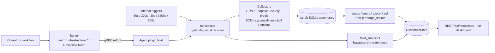

# tar

<!-- BEGIN GENERATED: plugin-doc-gen header -->
| | |
|---|---|
| **What it does** | Timeline Activity Record -- continuous system state change tracking |
| **Version** | 1.0.0 |
| **Kind** | Collector + Action · read-only (11 actions) / mutating (`configure`) / destructive (`rollup`, `purge_source`) · scheduled (`collect_fast` 60s, `collect_slow` 300s, `collect_perf` 30s, `collect_software` 3600s, `rollup` 900s -- internal triggers) + on-demand (`status`, `query`, `export`, `snapshot`, `sql`, `compatibility`, `fleet_snapshot`, `configure`, `purge_source`) |
| **Platforms** | Windows ✅ · macOS 🟡 constrained · Linux 🟡 constrained |
| **Actions** | `status` (definition `crossplatform.tar.status`) · `query` (`crossplatform.tar.query`) · `snapshot` (`crossplatform.tar.snapshot`) · `export` (`crossplatform.tar.export`) · `configure` (`crossplatform.tar.configure`) · `collect_fast` (`crossplatform.tar.collect_fast`) · `collect_slow` (`crossplatform.tar.collect_slow`) · `collect_perf` (no definition) · `collect_software` (no definition) · `rollup` (`crossplatform.tar.rollup`) · `sql` (`crossplatform.tar.sql`, plus 14 canned-query definitions in `tar_warehouse.yaml` that fan into the same action) · `compatibility` (`crossplatform.tar.compatibility`) · `fleet_snapshot` (`crossplatform.tar.fleet_snapshot`) · `purge_source` (no definition) |
| **Security** | securable `Infrastructure` (`Response`, system-reserved, for `fleet_snapshot`) · operation Read (10 actions) / Write (`configure`) / Delete (`rollup`, `purge_source`) · risk Low (8) / Medium (`query`, `export`, `configure`, `sql`) / High (`rollup`, `purge_source`) · dispatch ReadOnly (11) / Mutating (`configure`) / Destructive (`rollup`, `purge_source`) · approval gate `AdminOrApproval` on `configure` only, `None` elsewhere |
| **Roles** | execute: endpoint-admin (every action) + endpoint-operator (`status`, `query`, `export`, `sql` and its 14 canned queries, `compatibility`, `fleet_snapshot`) -- `snapshot`, `configure`, `collect_fast`, `collect_slow`, `rollup` are endpoint-admin only · author: content-author |
<!-- END GENERATED -->

## How it works

TAR is the agent's local telemetry warehouse. Four scheduled collectors diff each cycle's OS
snapshot against the previous baseline and append change events to a local SQLite database
(`tar.db`): `collect_fast` (process + network, default 60s), `collect_slow` (service + user
session, default 300s), `collect_perf` (device CPU/memory/disk/network counters, default 30s) and
`collect_software` (installed-software inventory, default hourly) — all four triggers are
registered in `init()` (`tar_plugin.cpp:601-644`). `rollup` runs every 15 minutes: it always
aggregates live rows into hourly/daily/monthly tiers first, then unconditionally enforces
retention on every tier, deleting aged rows (`tar_plugin.cpp:3619-3627`) — the ordering is
load-bearing and the reason the capability declaration marks this action Destructive/Irreversible.
Reads go through `status` (health + the retention clock-guard counters), `query`/`export` (the
core process/network/service/user/software union, or one type behind an explicit filter — arp,
dns and mapdrive are opt-in PII sources reachable only that way, never the default feed) and `sql`
(an arbitrary `SELECT` against `$`-prefixed warehouse tables, validated SELECT-only and translated
to real table names — `tar_sql_executor.cpp:205-244`). `snapshot` forces an out-of-cycle full
collection across all four collectors and reports `complete` or `partial|<sources>` if any source
retained a stale baseline instead. `fleet_snapshot` is a separate on-demand full re-enumeration
that bypasses the warehouse entirely, feeding the 3D fleet-topology view. `configure` rewrites
around 25 collection knobs (retention, intervals, per-source enable flags, redaction patterns).
`purge_source` deletes every warehouse row for one named source, but only once that source is
already disabled — closing the scan-then-purge race a still-collecting source would otherwise hit
(`tar_plugin.cpp:2987-3031`).

Deliberately not: TAR does not stream events to the server in real time — everything lands in the
local warehouse first and is pulled on `query`/`export`/`sql`/`status`. It does not replay history
from zero when a cursor-model source's log position is lost or wraps — it re-baselines forward and
records a `capture_gap` (`tar_cursor.hpp:25-75`). It never fabricates OS support: a leg without a
bound mechanism reports `planned`, not a guessed read.



## OS capability

<!-- BEGIN GENERATED: plugin-doc-gen capability -->
| Action | Windows | macOS | Linux |
|---|---|---|---|
| `status` | ✅ supported · rung 1 · sqlite | ✅ supported · rung 1 · sqlite | ✅ supported · rung 1 · sqlite |
| `query` | ✅ supported · rung 1 · sqlite | ✅ supported · rung 1 · sqlite | ✅ supported · rung 1 · sqlite |
| `snapshot` | ✅ supported · rung 1 · etw+iphlpapi+scm+wts+wnet+wevtapi+registry | 🟡 constrained · rung 2 · endpoint_security+nstat+launchctl+getfsstat+pkgutil(planned) | 🟡 constrained · rung 2 · procfs+systemctl+dpkg_rpm(planned) |
| `export` | ✅ supported · rung 1 · sqlite | ✅ supported · rung 1 · sqlite | ✅ supported · rung 1 · sqlite |
| `configure` | ✅ supported · rung 1 · sqlite | ✅ supported · rung 1 · sqlite | ✅ supported · rung 1 · sqlite |
| `collect_fast` | ✅ supported · rung 1 · etw+iphlpapi | 🟡 constrained · rung 1 · endpoint_security+nstat+route_sysctl | 🟡 constrained · rung 1 · procfs |
| `collect_slow` | ✅ supported · rung 1 · scm+wts+wnet+wevtapi | 🟡 constrained · rung 2 · launchctl+utmpx+getfsstat | 🟡 constrained · rung 2 · systemctl+utmp |
| `collect_perf` | ✅ supported · rung 1 · ntcounters | ⛔ planned · rung 1 · host_statistics | ✅ supported · rung 1 · procfs |
| `collect_software` | ✅ supported · rung 1 · registry | ⛔ planned · rung 2 · pkgutil | ⛔ planned · rung 2 · dpkg_rpm |
| `rollup` | ✅ supported · rung 1 · sqlite | ✅ supported · rung 1 · sqlite | ✅ supported · rung 1 · sqlite |
| `sql` | ✅ supported · rung 1 · sqlite | ✅ supported · rung 1 · sqlite | ✅ supported · rung 1 · sqlite |
| `compatibility` | ✅ supported · rung 1 · sqlite | ✅ supported · rung 1 · sqlite | ✅ supported · rung 1 · sqlite |
| `fleet_snapshot` | ✅ supported · rung 1 · iphlpapi+win32_process_enum | 🟡 constrained · rung 1 · libproc(proc_pidfdinfo) | ✅ supported · rung 1 · procfs |
| `purge_source` | ✅ supported · rung 1 · sqlite | ✅ supported · rung 1 · sqlite | ✅ supported · rung 1 · sqlite |

**Declared limits per leg** (the descriptor's fallback text, verbatim):

- **`snapshot` / Linux** — software inventory collection is PLANNED (dpkg/rpm not yet wired) on Linux; service enumeration runs bounded argv (rung 2) via the shared subprocess runner.
- **`snapshot` / macOS** — software collection is PLANNED on macOS; mapdrive is wired but outbound-live-only (getfsstat, no username, no inbound, no history); service enumeration runs bounded argv (rung 2) via the shared subprocess runner; process/tcp fall back to a poll without the Endpoint Security entitlement or nstat root privilege.
- **`collect_fast` / Linux** — dns opt-in sub-source is PLANNED (no-op) on Linux; arp opt-in sub-source is native (procfs, /proc/net/arp); core process/network/netqual collection is native.
- **`collect_fast` / macOS** — process/tcp fall back to a KERN_PROC_ALL/proc_pidfdinfo poll without the Endpoint Security entitlement or nstat root privilege; dns opt-in sub-source is PLANNED (no-op) on macOS; arp opt-in sub-source is native but constrained (route_sysctl, entry_type always 'unknown').
- **`collect_slow` / Linux** — service enumeration runs bounded argv (rung 2) via the shared subprocess runner; startup_type reads 'unknown'; netconn opt-in source is PLANNED (no-op) on Linux.
- **`collect_slow` / macOS** — service enumeration runs bounded argv (rung 2) via the shared subprocess runner; no startup_type; mapdrive opt-in source is wired but outbound-live-only (getfsstat, no username, no inbound, no history); netconn opt-in source is PLANNED (no-op) on macOS.
- **`fleet_snapshot` / macOS** — inherent TOCTOU between pid enumeration and per-fd query; short-lived sockets may be missed.
<!-- END GENERATED -->

## Privileges and prerequisites

| OS | Runs as | Extra grant needed | Measured | If the read is refused |
|---|---|---|---|---|
| Windows | Agent service account, granted `SeBackupPrivilege` (read regardless of DACL) and `Performance Log Users` group membership (`docs/agent-privilege-model.md:94`) | **None beyond install-time grants.** `SeBackupPrivilege` and the ETW-enabling group membership are already provisioned; the `software` source needs no extra privilege beyond the account's existing registry-read access. | 2026-09-07, bare-metal, captured as `SYSTEM` — broader privilege than the deployed service account; no OS-level read was reached in this capture (see Caveats) | Not observed in this capture. The Windows legs never fall back to a poll (they are all `supported`, not `constrained`) — a refused read would surface as an `error\|` line from the underlying Win32 call, not a degrade. |
| macOS | **root** (LaunchDaemon, no `UserName` — `docs/agent-privilege-model.md:94`) | Endpoint Security process capture needs root **and** the `com.apple.developer.endpoint-security.client` entitlement; without both, `es_new_client`/`es_subscribe` fails and the process/tcp legs self-heal to the `KERN_PROC_ALL`/`proc_pidfdinfo` poll (`tar_proc_es.cpp:118-121,327-328`). | 2026-09-07, bare-metal, captured at **euid 501 (alex)** — unprivileged; the root LaunchDaemon path was not exercised by this capture. | A missing entitlement/privilege never blocks the leg outright — it logs a warning and falls back to the poll (`tar_proc_es.cpp:327-328`). |
| Linux | Agent account with `cap_dac_read_search` set on the binary (`docs/agent-privilege-model.md:94`); not root | None beyond the binary capability. Service enumeration (`systemctl`) runs as bounded argv under the agent account, not elevated. | 2026-09-06, container, captured at **euid 0 (root)** — broader than the deployed `cap_dac_read_search` account. | Not observed in this capture. |

Binaries/subprocesses/network: `systemctl list-units --type=service --all --plain --no-pager --no-legend` and
`launchctl list` (both via the shared bounded-argv runner `yuzu::agent::run_bounded_subprocess`,
never a shell string — `tar_service_collector.cpp:244-247,277,305-306,329`; the same runner
executes `smbstatus` for the mapdrive collector, `tar_mapdrive_collector.cpp:1110,1165,1233`); a
Windows ETW session on provider `Microsoft-Windows-Kernel-Process`
(`tar_proc_etw.cpp:48-49,337,349,370,383,397`) and a second ETW session for module-load capture
(`tar_module_etw.cpp:458-498`); an in-process macOS Endpoint Security client
(`tar_proc_es.cpp:313-314,327`); raw sockets — `PF_SYSTEM`/`SYSPROTO_CONTROL` for the macOS nstat
client (`tar_netqual_nstat.cpp:906,938`) and `AF_NETLINK`/`NETLINK_SOCK_DIAG` on Linux
(`tar_network_collector.cpp:529`). No `popen`, `CreateProcess`, or `posix_spawn` call exists
anywhere in the plugin's 48 source files.

## Data contract

### Inputs

<!-- BEGIN GENERATED: plugin-doc-gen inputs -->
**`content/definitions/tar.yaml`**

| Definition | Parameter | Type | Required | Default | Values | Description |
|---|---|---|---|---|---|---|
| `crossplatform.tar.status` | *(none)* | | | | | `status` takes no parameters. |
| `crossplatform.tar.query` | `from` | string | no | `0` | epoch seconds | Start of the query time range as Unix epoch seconds. |
| `crossplatform.tar.query` | `to` | string | no | current time | epoch seconds | End of the query time range as Unix epoch seconds. |
| `crossplatform.tar.query` | `type` | string | no | (empty = core feed) | `process, network, service, user, software, arp, dns, mapdrive` (or empty) | Filter by event type; `software` joins the default feed once enabled; `arp`/`dns`/`mapdrive` are opt-in PII sources reachable only via this filter. |
| `crossplatform.tar.query` | `limit` | string | no | `1000` | `^[0-9]+$`, max 10000 | Maximum number of events to return. |
| `crossplatform.tar.snapshot` | *(none)* | | | | | `snapshot` takes no parameters. |
| `crossplatform.tar.export` | `from` | string | no | (unset → 0) | epoch seconds | Start of export range as Unix epoch seconds. |
| `crossplatform.tar.export` | `to` | string | no | (unset → now) | epoch seconds | End of export range as Unix epoch seconds. |
| `crossplatform.tar.export` | `type` | string | no | (unset → core feed) | `process, network, service, user, software, arp, dns, mapdrive` | Filter by event type. |
| `crossplatform.tar.export` | `limit` | string | no | `1000` | max 10000 | Maximum events to export. |
| `crossplatform.tar.configure` | `retention_days` | string | no | `7` | `1-365` | Days to retain TAR events before automatic purging. |
| `crossplatform.tar.configure` | `fast_interval` | string | no | `60` | `10-3600` | Interval in seconds for process and network collection. |
| `crossplatform.tar.configure` | `slow_interval` | string | no | `300` | `30-7200` | Interval in seconds for service and user session collection. |
| `crossplatform.tar.configure` | `redaction_patterns` | string | no | `["*password*","*secret*","*token*","*api_key*","*credential*"]` (always merged in) | JSON array, ≤256 elements ≤256 chars | Case-insensitive substring patterns for command-line redaction; supplied patterns are ADDED to the defaults, never replace them. |
| `crossplatform.tar.configure` | `process_enabled` | string | no | `true` | `true \| false` | Enable/disable the process collector. |
| `crossplatform.tar.configure` | `tcp_enabled` | string | no | `true` | `true \| false` | Enable/disable the TCP/network collector. |
| `crossplatform.tar.configure` | `service_enabled` | string | no | `true` | `true \| false` | Enable/disable the service collector. |
| `crossplatform.tar.configure` | `user_enabled` | string | no | `true` | `true \| false` | Enable/disable the user-session collector. |
| `crossplatform.tar.configure` | `perf_enabled` | string | no | `true` | `true \| false` | Enable/disable the device performance sampler (`$Perf_*`). |
| `crossplatform.tar.configure` | `procperf_enabled` | string | no | `false` | `true \| false` | Enable/disable the per-application top-N CPU/working-set sampler (`$ProcPerf_*`); enabling also syncs per-app names+versions off-device daily. |
| `crossplatform.tar.configure` | `netqual_enabled` | string | no | `false` | `true \| false` | Enable/disable the per-connection TCP-quality sampler; Linux (netlink INET_DIAG) and Windows (TCP ESTATS, requires an elevated agent); macOS planned. |
| `crossplatform.tar.configure` | `netconn_enabled` | string | no | `false` | `true \| false` | Enable/disable the connectivity-transition source (`$NetConn_Live`); Windows-only collector today. |
| `crossplatform.tar.configure` | `netconn_lookback_seconds` | string | no | `604800` (7 days) | `0-7776000` | How far before enablement the netconn backfill reads OS-retained history; `0` disables the pre-enablement read. |
| `crossplatform.tar.configure` | `module_enabled` | string | no | `false` | `true \| false` | Enable/disable the image-load/module-stream capture source (`$Module_*`); no collector ships for any OS yet. |
| `crossplatform.tar.configure` | `software_enabled` | string | no | `false` | `true \| false` | Enable/disable the software install/uninstall source (`$Software_*`); Windows HKLM Uninstall only today. |
| `crossplatform.tar.configure` | `software_interval` | string | no | `3600` | `0` (disables) or `300-86400` | Interval in seconds for the software sampler's own trigger. |
| `crossplatform.tar.configure` | `arp_enabled` | string | no | `false` | `true \| false` | Enable/disable the ARP/neighbour-table capture source; native on every OS (see OS capability). |
| `crossplatform.tar.configure` | `dns_enabled` | string | no | `false` | `true \| false` | Enable/disable the DNS resolver-cache capture source; Windows-only collector today. |
| `crossplatform.tar.configure` | `mapdrive_enabled` | string | no | `false` | `true \| false` | Enable/disable the mapped-drive capture source (`$MapDrive_*`); Windows + Linux; macOS planned. |
| `crossplatform.tar.configure` | `power_enabled` | string | no | `true` | `true \| false` | Enable/disable the sleep/wake/AC-power transition source (`$Power_Live`); **no collector is registered in this release** — the table stays queryable-empty. |
| `crossplatform.tar.configure` | `power_lookback_seconds` | string | no | `604800` | `0-7776000` | Pre-enablement lookback for the power source. |
| `crossplatform.tar.configure` | `removable_enabled` | string | no | `true` | `true \| false` | Enable/disable the removable-media attach/detach source (`$Removable_Live`); no collector is registered yet. |
| `crossplatform.tar.configure` | `removable_lookback_seconds` | string | no | `604800` | `0-7776000` | Pre-enablement lookback for the removable source. |
| `crossplatform.tar.configure` | `network_capture_method` | string | no | `polling` | `polling`, or a host-valid future method | TCP capture mechanism; only `polling` is wired today regardless of the configured value. |
| `crossplatform.tar.configure` | `process_stabilization_exclusions` | string | no | (empty) | JSON array, ≤256 elements ≤256 chars, effective substring ≥3 chars | Case-insensitive substring patterns matched against the process name; matches are dropped before the diff. |
| `crossplatform.tar.collect_fast` | *(none)* | | | | | `collect_fast` takes no parameters. |
| `crossplatform.tar.collect_slow` | *(none)* | | | | | `collect_slow` takes no parameters. |
| `crossplatform.tar.compatibility` | *(none)* | | | | | `compatibility` takes no parameters. |
| `crossplatform.tar.fleet_snapshot` | *(none)* | | | | | `fleet_snapshot` takes no parameters. |

**`content/definitions/tar_warehouse.yaml`** — every definition below executes through the `sql`
action and takes a single `sql` string parameter.

| Definition | Parameter | Type | Required | Default | Values | Description |
|---|---|---|---|---|---|---|
| `crossplatform.tar.sql` | `sql` | string | yes | *(none — operator-supplied)* | free-text `SELECT` | A `SELECT` query using `$`-prefixed table names, e.g. `$Process_Live`, `$TCP_Hourly`, the opt-in `$ARP_Live`/`$DNS_Live`. |
| `crossplatform.tar.recent_processes` | `sql` | string | yes | `SELECT name, pid, cmdline, user, ts FROM $Process_Live WHERE ts > strftime('%s','now','-24 hours') ORDER BY ts DESC LIMIT 500` | fixed (hidden) | Processes that started or stopped in the last 24 hours. |
| `crossplatform.tar.tcp_by_process` | `sql` | string | yes | `SELECT process_name, remote_addr, remote_port, proto, COUNT(*) as conn_count FROM $TCP_Live GROUP BY process_name, remote_addr, remote_port, proto ORDER BY conn_count DESC LIMIT 200` | fixed (hidden) | TCP connections aggregated by process and remote endpoint. |
| `crossplatform.tar.listening_ports` | `sql` | string | yes | `SELECT local_port, proto, pid, process_name FROM $TCP_Live WHERE state = 'LISTEN' ORDER BY local_port` | fixed (hidden) | Listening TCP ports with owning process. |
| `crossplatform.tar.hourly_process_summary` | `sql` | string | yes | `SELECT hour_ts, name, start_count FROM $Process_Hourly ORDER BY hour_ts DESC LIMIT 168` | fixed (hidden) | Hourly process start counts for the last 7 days. |
| `crossplatform.tar.service_state_changes` | `sql` | string | yes | `SELECT ts, name, action, status, prev_status FROM $Service_Live WHERE action = 'state_changed' ORDER BY ts DESC LIMIT 200` | fixed (hidden) | Recent service state-change events. |
| `crossplatform.tar.connections_to_ip` | `sql` | string | yes | `SELECT ts, process_name, pid, remote_port, proto FROM $TCP_Live WHERE remote_addr = '10.0.0.1' ORDER BY ts DESC LIMIT 500` | editable (visible) | TCP connections to a specific remote IP; operator edits the IP in the WHERE clause. |
| `crossplatform.tar.daily_connection_summary` | `sql` | string | yes | `SELECT day_ts, remote_addr, process_name, connect_count FROM $TCP_Daily ORDER BY day_ts DESC, connect_count DESC LIMIT 500` | fixed (hidden) | Daily aggregated TCP connection counts. |
| `crossplatform.tar.user_sessions` | `sql` | string | yes | `SELECT ts, user, domain, logon_type, action FROM $User_Live ORDER BY ts DESC LIMIT 200` | fixed (hidden) | Recent user login/logout events. |
| `crossplatform.tar.process_tree` | `sql` | string | yes | `SELECT pid, ppid, name, user, ts FROM $Process_Live WHERE action = 'started' AND ts > strftime('%s','now','-1 hours') ORDER BY ts` | fixed (hidden) | Recently started processes with parent-child relationships. |
| `crossplatform.tar.daily_process_summary` | `sql` | string | yes | `SELECT datetime(day_ts, 'unixepoch') AS day, name, user, start_count, stop_count FROM $Process_Daily WHERE day_ts > strftime('%s', 'now', '-30 days') ORDER BY day_ts DESC, start_count DESC LIMIT 1000` | fixed (hidden) | Per-day process activity for the last 30 days. |
| `crossplatform.tar.recent_processes_iso` | `sql` | string | yes | `SELECT datetime(ts, 'unixepoch') AS event_time, action, name, pid, user FROM $Process_Live WHERE ts > strftime('%s', 'now', '-24 hours') ORDER BY ts DESC LIMIT 500` | fixed (hidden) | Same as `recent_processes` with ISO-8601 timestamps. |
| `crossplatform.tar.rollup` | *(none)* | | | | | `rollup` (the `crossplatform.tar.rollup` definition) takes no parameters — see `rollup` below; it executes the `rollup` action, not `sql`. |
| `crossplatform.tar.recent_arp` | `sql` | string | yes | `SELECT interface, ip_address, mac_address, entry_type, action, ts FROM $ARP_Live ORDER BY ts DESC LIMIT 500` | fixed (hidden) | Recent ARP/neighbour-table activity. `spec.platforms: [windows]` — the definition is Windows-only even though the ARP leg itself now also runs on Linux/macOS. |
| `crossplatform.tar.recent_dns` | `sql` | string | yes | `SELECT name, record_type, data, ttl_remaining_s, source, action, ts FROM $DNS_Live ORDER BY ts DESC LIMIT 500` | fixed (hidden) | Recent DNS resolver-cache state. `spec.platforms: [windows]`. |
| `crossplatform.tar.recent_mapdrive` | `sql` | string | yes | `SELECT direction, local_mount, remote_path, remote_host, username, provider, origin, action, ts FROM $MapDrive_Live ORDER BY ts DESC LIMIT 500` | fixed (hidden) | Mapped-drive activity, both directions. `spec.platforms: [windows, linux]`. |
<!-- END GENERATED -->

### Outputs

Every action writes its response as a sequence of independent lines (one `ctx.write_output` call
per line); most, but not all, actions follow the plugin-wide `discriminator\|field\|field...`
pipe-delimited convention (`tar_status_format.hpp:3-20`, `tar_collectors.hpp:39-57`). The four
collection actions share one line shape, `tar\|collect_<leg>\|<events_recorded>\|<token>`, where
`<token>` is one of `source_disabled`, `unsupported_platform`, `baseline`, `sample_recorded`,
`apps_recorded`, `cursor_advanced`, `cursor_lost`, `capture_incomplete` (`tar_collectors.hpp:47-66`).
`status`'s wire format is line-oriented `key\|value` pairs (`storage_state\|ok`,
`record_count\|<n>`, `config\|<key>\|<value>`, ...), not one positional row — the five YAML columns
below correspond to five of those lines; the rest (`config\|*`, `retention_guard\|*`,
`retention_guard_failed\|*`) are operational fields the YAML schema does not model. `query`'s rows
match its five columns exactly, followed by an un-modelled `total\|<n>` summary line. `sql` (and
every canned query in `tar_warehouse.yaml`) emits a leading `__schema__\|<col>\|<col>...` line,
then one pipe-joined data line per row, then a trailing `__total__\|<n>` line — all three land in
the single declared `output` column. `snapshot`'s and `rollup`'s actual lines do not decompose into
their declared columns at all; see Caveats.

<!-- BEGIN GENERATED: plugin-doc-gen outputs -->
**`status` — `storage_state\|ok` then `record_count\|value`, `oldest_timestamp\|value`, `newest_timestamp\|value`, `db_size_bytes\|value`, `retention_days\|value` (each its own `key\|value` line)**

| Field | Type | Values | Available | Example |
|---|---|---|---|---|
| `record_count` | int64 | non-negative integer | W, M, L | `-` |
| `oldest_timestamp` | int64 | epoch seconds, or 0 | W, M, L | `-` |
| `newest_timestamp` | int64 | epoch seconds, or 0 | W, M, L | `-` |
| `db_size_bytes` | int64 | non-negative integer | W, M, L | `-` |
| `retention_days` | int32 | 1-365 | W, M, L | `-` |

**`query` — `timestamp\|event_type\|event_action\|snapshot_id\|detail_json`**

| Field | Type | Values | Available | Example |
|---|---|---|---|---|
| `timestamp` | int64 | epoch seconds | W, M, L | `-` |
| `event_type` | string | `process, network, service, user, software, arp, dns, mapdrive` | W, M, L | `-` |
| `event_action` | string | free text, source-dependent verb | W, M, L | `-` |
| `snapshot_id` | int64 | integer | W, M, L | `-` |
| `detail_json` | clob | JSON object, or empty string on the default union branches | W, M, L | `-` |

**`snapshot` — `tar\|snapshot\|complete` or `tar\|snapshot\|partial\|<sources>`**

| Field | Type | Values | Available | Example |
|---|---|---|---|---|
| `status` | string | `complete, partial` | W, M, L | `-` |
| `events_recorded` | int32 | not emitted by the current wire format | *(none)* | `-` |

**`export` — `json_output`**

| Field | Type | Values | Available | Example |
|---|---|---|---|---|
| `json_output` | clob | JSON array of `{id, timestamp, event_type, event_action, snapshot_id, detail}` | W, M, L | `-` |

**`configure` — `config\|key\|value` (one line per changed setting)**

| Field | Type | Values | Available | Example |
|---|---|---|---|---|
| `key` | string | one of the parameter names in Inputs | W, M, L | `-` |
| `value` | string | free text, mirrors the parameter's own type/values | W, M, L | `-` |

**`collect_fast` / `collect_slow` — `tar\|collect_fast\|events_recorded\|token` (or `collect_slow`)**

| Field | Type | Values | Available | Example |
|---|---|---|---|---|
| `events_recorded` | int32 | non-negative integer | W, M, L | `-` |

**`compatibility` — `output` (a `header\|...` line, then one `row\|...` line per source × OS)**

| Field | Type | Values | Available | Example |
|---|---|---|---|---|
| `output` | clob | `header\|source\|os\|status\|capture_method\|notes` or `row\|...` lines; status is `supported, constrained, planned, unsupported` | W, M, L | `-` |

**`fleet_snapshot` — `json_output`**

| Field | Type | Values | Available | Example |
|---|---|---|---|---|
| `json_output` | clob | `fleet_snapshot.v1` JSON object (processes/connections capped at 4096 each) | W, M, L | `-` |

**`rollup` — `tar\|rollup\|<rows_aggregated>\|rows_aggregated`**

| Field | Type | Values | Available | Example |
|---|---|---|---|---|
| `status` | string | not emitted by the current wire format | *(none)* | `-` |
| `rows_aggregated` | int32 | non-negative integer | W, M, L | `-` |

**`sql` and its 14 canned queries — `output` (`__schema__\|...` header, data rows, `__total__\|n` footer)**

| Field | Type | Values | Available | Example |
|---|---|---|---|---|
| `output` | clob | pipe-delimited row text, or the `__schema__`/`__total__` marker lines | W, M, L (`recent_arp`/`recent_dns` W only; `recent_mapdrive` W+L) | `-` |
<!-- END GENERATED -->

**Actions without a definition.** `collect_perf` writes `tar\|collect_perf\|<n>\|<token>`, the same
shape as `collect_fast`/`collect_slow` (`tar_plugin.cpp:1822-1826`). `collect_software` follows the
same convention. `purge_source` writes a single JSON line,
`{"source":"<name>","rows_deleted":<n>,"status":"purged"}` (`tar_plugin.cpp:3037-3038`), or an
`error|` line if the named source is unknown or still enabled.

**Empty-result / not-yet-collected convention.** Several `configure` sources (`power`, `removable`)
ship their schema and config key now with no collector registered yet — their tables stay
queryable and empty, which means "not yet collecting," never "nothing happened"
(`tar.yaml:588-592,638-642`).

### Result status

TAR sets a typed `plugin_result_status` in exactly one place in the whole plugin: `do_snapshot`
calls `ctx.set_result_status(YUZU_RESULT_STATUS_CONSTRAINED, YUZU_RESULT_COMPLETENESS_PARTIAL,
"tar:snapshot_skipped_sources")` when any capture source retained a stale baseline instead of
collecting during a forced snapshot (`tar_plugin.cpp:2889-2894`). No other action — including
`status`, `query`, `sql`, `rollup`, `collect_fast`/`collect_slow`, and the early `db_` guard that
every action shares — ever calls the setter, so the agent records the default `UNDECLARED` /
`UNKNOWN` for everything else, exactly as every sample below shows.

| Status | Completeness | Provenance | When |
|---|---|---|---|
| `CONSTRAINED` | `PARTIAL` | `tar:snapshot_skipped_sources` | `snapshot` only, when `collect_or_retain` skipped at least one enabled source this pass. |
| `UNDECLARED` (default) | `UNKNOWN` | *(empty)* | Every other action and every early-return path, including the `db_`-not-open guard. |

### Where the data goes

- **Instruction result, primarily.** `status`/`query`/`export`/`sql`/`compatibility` rows travel
  over the agent's mTLS gRPC channel as the command response and land in the ResponseStore,
  queryable at `/api/responses/{id}` and rendered by the `/tar` dashboard
  (`docs/tar-dashboard.md`, `docs/tar-implementer.md`).
- **`fleet_snapshot`** feeds the server-side `FleetTopologyStore` on a cache miss, assembling the
  3D `/viz/fleet` topology view (`tar.yaml:900-901`); it is not itself a warehouse read.
- **`rollup`/`purge_source`** mutate `tar.db` directly (aggregation, retention, source purge) — their
  effect is visible through later `status`/`query`/`sql` reads, not a separate sink.
- **Not consumed by** daily-sync inventory, DEX, or metrics — TAR has no `/metrics` endpoint;
  `status`'s retention-guard counters are the plugin's only fleet-readable health signal
  (`tar_plugin.cpp:2424-2431`).
- **Siblings:** `crossplatform.tar.*` (this plugin) is standalone; the `installed_software`
  daily-sync source (ADR-0016) is a separate, machine-scope inventory feed, distinct from TAR's
  opt-in `software` capture source.
- **MCP / REST.** Discover: `discover_plugins` (summary) → `yuzu://plugin-docs` (this page as data)
  → `discover_instructions` / `get_definition("crossplatform.tar.status")`. Run:
  `execute_instruction {definition_id, parameters}`. Read: `/api/responses/{id}`, and
  `/viz/fleet` for `fleet_snapshot`.

## Sample output

<!-- BEGIN GENERATED: plugin-doc-gen samples -->
**Windows** — captured: windows Microsoft Windows NT 10.0.26200.0 x64 · bare-metal · 2026-09-07 · SYSTEM · leg-hash pending

```
== action=status
error|TAR database not initialized
[result_status] UNDECLARED / UNKNOWN / 
[rc] 1

== action=query
error|TAR database not initialized
[result_status] UNDECLARED / UNKNOWN / 
[rc] 1

== action=snapshot
error|TAR database not initialized
[result_status] UNDECLARED / UNKNOWN / 
[rc] 1

== action=export
error|TAR database not initialized
[result_status] UNDECLARED / UNKNOWN / 
[rc] 1

== action=configure
[not captured] Mutating/Reversible: not executed on a live host

== action=collect_fast
error|TAR database not initialized
[result_status] UNDECLARED / UNKNOWN / 
[rc] 1

== action=collect_slow
error|TAR database not initialized
[result_status] UNDECLARED / UNKNOWN / 
[rc] 1

== action=collect_perf
error|TAR database not initialized
[result_status] UNDECLARED / UNKNOWN / 
[rc] 1

== action=collect_software
error|TAR database not initialized
[result_status] UNDECLARED / UNKNOWN / 
[rc] 1

== action=rollup
[not captured] Destructive/Irreversible: not executed on a live host

== action=sql sql="SELECT 1"
error|TAR database not initialized
[result_status] UNDECLARED / UNKNOWN / 
[rc] 1

== action=compatibility
error|TAR database not initialized
[result_status] UNDECLARED / UNKNOWN / 
[rc] 1

== action=fleet_snapshot
error|TAR database not initialized
[result_status] UNDECLARED / UNKNOWN / 
[rc] 1

== action=purge_source
[not captured] Destructive/Irreversible: not executed on a live host
```

**macOS** — captured: macos macOS 26.6.2 arm64 · bare-metal · 2026-09-07 · euid 501 (alex) · leg-hash pending

```
== action=status
error|TAR database not initialized
[result_status] UNDECLARED / UNKNOWN / 
[rc] 1

== action=query
error|TAR database not initialized
[result_status] UNDECLARED / UNKNOWN / 
[rc] 1

== action=snapshot
error|TAR database not initialized
[result_status] UNDECLARED / UNKNOWN / 
[rc] 1

== action=export
error|TAR database not initialized
[result_status] UNDECLARED / UNKNOWN / 
[rc] 1

== action=configure
[not captured] Mutating/Reversible: not executed on a live host

== action=collect_fast
error|TAR database not initialized
[result_status] UNDECLARED / UNKNOWN / 
[rc] 1

== action=collect_slow
error|TAR database not initialized
[result_status] UNDECLARED / UNKNOWN / 
[rc] 1

== action=collect_perf
error|TAR database not initialized
[result_status] UNDECLARED / UNKNOWN / 
[rc] 1

== action=collect_software
error|TAR database not initialized
[result_status] UNDECLARED / UNKNOWN / 
[rc] 1

== action=rollup
[not captured] Destructive/Irreversible: not executed on a live host

== action=sql sql="SELECT 1"
error|TAR database not initialized
[result_status] UNDECLARED / UNKNOWN / 
[rc] 1

== action=compatibility
error|TAR database not initialized
[result_status] UNDECLARED / UNKNOWN / 
[rc] 1

== action=fleet_snapshot
error|TAR database not initialized
[result_status] UNDECLARED / UNKNOWN / 
[rc] 1

== action=purge_source
[not captured] Destructive/Irreversible: not executed on a live host
```

**Linux** — captured: linux Debian GNU/Linux 13 (trixie) aarch64 · container · 2026-09-06 · euid 0 · leg-hash pending

```
== action=status
error|TAR database not initialized
[result_status] UNDECLARED / UNKNOWN / 
[rc] 1

== action=query
error|TAR database not initialized
[result_status] UNDECLARED / UNKNOWN / 
[rc] 1

== action=snapshot
error|TAR database not initialized
[result_status] UNDECLARED / UNKNOWN / 
[rc] 1

== action=export
error|TAR database not initialized
[result_status] UNDECLARED / UNKNOWN / 
[rc] 1

== action=configure
[not captured] Mutating/Reversible: not executed on a live host

== action=collect_fast
error|TAR database not initialized
[result_status] UNDECLARED / UNKNOWN / 
[rc] 1

== action=collect_slow
error|TAR database not initialized
[result_status] UNDECLARED / UNKNOWN / 
[rc] 1

== action=collect_perf
error|TAR database not initialized
[result_status] UNDECLARED / UNKNOWN / 
[rc] 1

== action=collect_software
error|TAR database not initialized
[result_status] UNDECLARED / UNKNOWN / 
[rc] 1

== action=rollup
[not captured] Destructive/Irreversible: not executed on a live host

== action=sql sql="SELECT 1"
error|TAR database not initialized
[result_status] UNDECLARED / UNKNOWN / 
[rc] 1

== action=compatibility
error|TAR database not initialized
[result_status] UNDECLARED / UNKNOWN / 
[rc] 1

== action=fleet_snapshot
error|TAR database not initialized
[result_status] UNDECLARED / UNKNOWN / 
[rc] 1

== action=purge_source
[not captured] Destructive/Irreversible: not executed on a live host
```
<!-- END GENERATED -->

Every read-capable action on every OS returns the identical `error|TAR database not initialized` /
`rc=1` pair, including `sql` (invoked with `sql="SELECT 1"`) and `compatibility` (a static-metadata
action that touches neither the database nor the filesystem per its own description). This is not
three broken legs; it is one chokepoint. See Caveats item 1.

## Caveats and known gaps

1. **One `db_` chokepoint gates all 14 actions, and the capture driver never opens it.**
   `execute()` returns `error|TAR database not initialized` / rc 1 before the 14-way action dispatch
   whenever the member `db_` is null (`tar_plugin.cpp:1037-1041`); `db_` is populated only inside
   `init()`, which opens `tar.db` via `TarDatabase::open` (`tar_plugin.cpp:580-586`). The
   `plugin-capture` driver loads the plugin through `PluginHandle::load` + `LocalDispatcher::run`
   without calling `init()`, so every action in the samples above — including `compatibility`,
   which needs no database at all — fails identically at the same guard rather than exercising its
   own OS leg.
2. **`rollup` is Destructive/Irreversible, and its wire format does not match its declared
   columns.** `do_rollup` always runs `run_aggregation()` before unconditionally calling
   `run_retention()`, which permanently deletes aged rows (`tar_plugin.cpp:3619-3627`) — the basis
   for its `Destructive`/`Irreversible` capability declaration. Its actual response line is
   `tar|rollup|<n>|rows_aggregated`, a single positional line; the declared `status` column is
   never populated. `snapshot`'s declared `events_recorded` column has the same gap — its line is
   `tar|snapshot|complete`/`partial|<sources>` with no numeric count (`tar_capture_status.hpp:210-220`).
3. **`purge_source` refuses to run while its source is enabled.** It requires the named source to
   already be disabled, holding `collect_mu_` (and `software_collect_mu_` for `software`) across
   both the enabled-check and the delete to close the scan-then-purge race a concurrent re-enable
   would otherwise open (`tar_plugin.cpp:3013-3031`).
4. **Several legs are declared but not implemented.** `collect_perf` on macOS (`host_statistics`)
   and `collect_software` on Linux/macOS (`dpkg_rpm`/`pkgutil`) are `planned`, not `constrained` —
   no macOS code path exists in `tar_perf.cpp` or `tar_proc_perf.cpp` at all
   (confirmed absent by direct read, not merely unused), and the non-Windows branch of
   `tar_software_collector.cpp` is a stub returning empty. `netconn` and `dns` are likewise
   `planned` (no-op) on Linux and macOS. A `planned` leg's table is queryable and empty, which
   means "not yet collecting," never "nothing happened."
5. **Cursor-model sources never silently replay or wipe.** A lost/invalid cursor or a wrapped log
   emits a `capture_gap` event and re-baselines forward at the log's current end rather than
   replaying from zero (`tar_cursor.hpp:25-75`); a transient read failure throws
   `IncompleteCaptureError` and retains the cursor instead. The same discipline applies to bulk
   deletes: `run_retention`'s clock guard *declines* a pass that looks like a wall-clock jump
   (counted in `retention_guard_declines_total`) rather than deleting on an implausible reading,
   and separately counts read/delete failures (`retention_guard_failures_total`) so a silently
   unretained table is still visible on `status` (`tar_aggregator.hpp:147-252`).

## Source and tests

<!-- BEGIN GENERATED: plugin-doc-gen source -->
- Plugin: `agents/plugins/tar/src/tar_plugin.cpp` (descriptor, dispatch, all 14 `do_*` handlers) ·
  `tar_db.{hpp,cpp}` (SQLite warehouse, open/quarantine/purge) ·
  `tar_sql_executor.{hpp,cpp}` (SELECT-only validation + `$`-name translation) ·
  `tar_aggregator.{hpp,cpp}` (rollup aggregation + clock-guarded retention) ·
  `tar_schema_registry.{hpp,cpp}` (capture-source registry, `$`-table map) ·
  `tar_diff.cpp` (snapshot diffing, redaction) ·
  `tar_cursor.hpp` / `tar_cursor_sources.cpp` (cursor-model sources) ·
  `tar_fleet_snapshot.{hpp,cpp}` (fleet-topology JSON) ·
  `tar_collectors.hpp` / `tar_capture_status.hpp` / `tar_status_format.hpp` (shared row-format
  contracts) · `tar_proc_etw.{hpp,cpp}` / `tar_module_etw.{hpp,cpp}` (Windows ETW) ·
  `tar_proc_es.{hpp,cpp}` (macOS Endpoint Security) · `tar_network_collector.cpp` /
  `tar_netconn_win.cpp` / `tar_netqual_nstat.{hpp,cpp}` / `tar_netqual_boot.{hpp,cpp}` (network) ·
  `tar_arp_collector.cpp` / `tar_arp_parsers.hpp` · `tar_dns_collector.cpp` ·
  `tar_mapdrive_collector.cpp` / `tar_mapdrive_macos_parsers.hpp` ·
  `tar_service_collector.cpp` / `tar_service_parsers.hpp` ·
  `tar_software_collector.cpp` / `tar_software_core.{hpp,cpp}` · `tar_user_collector.cpp` ·
  `tar_perf.{hpp,cpp}` / `tar_proc_perf.{hpp,cpp}` · `tar_win_raii_guards.hpp` · `tar_version.hpp` ·
  `meson.build`
- Definitions: `content/definitions/tar.yaml` (status, query, snapshot, export, configure,
  collect_fast, collect_slow, compatibility, fleet_snapshot) · `content/definitions/tar_warehouse.yaml`
  (sql, rollup, and 14 canned warehouse queries)
- Capability rows: `server/core/src/capability_decls/core_dispatch_capabilities.hpp` (`fleet_snapshot`)
  · `server/core/src/capability_decls/plugin_action_catalogue_a.hpp` (the other 13 actions)
- Tests: `tests/unit/test_tar_aggregator.cpp` · `test_tar_arp.cpp` · `test_tar_capability_table.cpp`
  · `test_tar_capture_status.cpp` · `test_tar_cursor.cpp` · `test_tar_diff.cpp` ·
  `test_tar_mapdrive.cpp` · `test_tar_module_etw.cpp` · `test_tar_module_stream.cpp` ·
  `test_tar_netconn.cpp` · `test_tar_netqual_nstat.cpp` · `test_tar_perf.cpp` ·
  `test_tar_proc_es.cpp` · `test_tar_proc_etw.cpp` · `test_tar_proc_perf.cpp` ·
  `test_tar_schema_registry.cpp` · `test_tar_service.cpp` · `test_tar_software.cpp` ·
  `test_tar_store.cpp` · `test_tar_warehouse.cpp` · `test_tar_win_raii_guards.cpp` ·
  `tests/unit/server/test_dashboard_tar_fragments.cpp` · `test_dashboard_tar_retention.cpp` ·
  `test_dispatch_target_shape.cpp` · `test_offload_target_store.cpp` ·
  `test_offload_target_store_pg_helper.hpp` · `test_rest_offload_targets.cpp` ·
  `test_rest_tar_purge.cpp` · `test_tar_process_tree.cpp` · `test_tar_tree_routes.cpp`
- Privilege row: `docs/agent-privilege-model.md` (the `tar.*` row)
- Changelog: `changelog.d/1.9-command-capability-registry.added.md` ·
  `1.9-dispatch-chokepoint.security.md` · `1788-command-per-device-visibility.security.md` ·
  `1788-dashboard-empty-scope.changed.md` · `1986-getting-started-import-examples.fixed.md` ·
  `2026-08-24-linux-test-suite-isolation.fixed.md` ·
  `20260825-offload-target-store-postgres.changed.md` · `2093-tar-db-ddl-one-transaction.changed.md`
  · `2093-tar-events-resurrected-on-reopen.fixed.md` · `2204-declarations-group-a.added.md` ·
  `2361-tar-retention-clock-guard.fixed.md` · `2437-mcp-targeting-safety.security.md` ·
  `2500-rest-targeting-widening.security.md` · `2500-result-set-parent-widening.security.md` ·
  `2573-tar-clockguard-factset.fixed.md` · `2691-response-store-postgres.changed.md` ·
  `2771-per-user-hive-ladder-consolidation.changed.md` ·
  `2771-privilegescope-token-adjust-bug.fixed.md` · `2854-restart-loop-alert.added.md` ·
  `2f-pr3a-mcp-terminal-starvation.fixed.md` · `3156-guardian-confinement.security.md` ·
  `3424-3511-dispatch-plugin-presence.security.md` · `3685-destructive-dispatch-gate.security.md`
  · `3885-dashboard-destructive-targeting.security.md` · `5.2-tar-arp-posix.added.md` ·
  `5.2-tar-mapdrive-macos.added.md` · `5.2-tar-popen-rehome.changed.md` ·
  `6.2b-tar-cursor-seam.added.md`
<!-- END GENERATED -->
