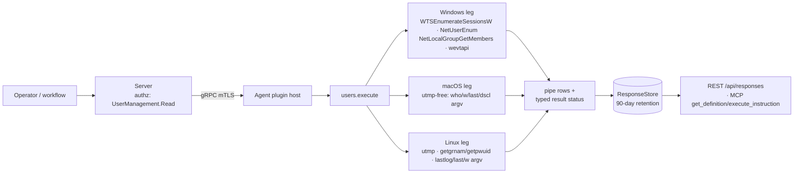

# users

<!-- BEGIN GENERATED: plugin-doc-gen header -->
| | |
|---|---|
| **What it does** | Reports logged-on users, sessions, local accounts, admin group members, group membership, primary user, and session history |
| **Version** | 1.0.0 |
| **Kind** | Collector · read-only · on-demand |
| **Platforms** | Windows 🟡 (session_history constrained) · macOS ✅ · Linux ✅ |
| **Actions** | `logged_on` (definition `device.users.logged_on`) · `sessions` (definition `device.users.sessions`) · `local_users` (definition `device.users.local_users`) · `local_admins` (definition `device.users.local_admins`) · `group_members` (definition `device.users.group_members`) · `primary_user` (definition `device.users.primary_user`) · `session_history` (definition `device.users.session_history`) |
| **Security** | securable `UserManagement` · operation Read · risk Low · dispatch ReadOnly · approval gate none |
| **Roles** | execute: endpoint-admin, endpoint-operator · author: content-author |
<!-- END GENERATED -->

## How it works

All seven actions are reads (`Mutability::None` on every leg); nothing in this plugin creates, deletes, or modifies an account, session, or group. `logged_on`/`sessions` answer "who is on this box right now" from the OS's live session table (utmp, WTS, or `who`/`w`). `local_users`/`local_admins`/`group_members` enumerate account and group membership from the OS's own directory (passwd/group, Directory Services, or the Windows Net APIs) — `group_members` takes an arbitrary group name as a parameter, `local_admins` is a fixed lookup of the built-in admin group. `primary_user` and `session_history` both mine login history — the Security event log on Windows, `last` on Linux/macOS — the former reducing it to one answer (the most-frequent account), the latter returning it as time-ordered rows. On Linux/macOS every OS-tool invocation goes through a bounded, no-shell argv runner (`run_tool`, ADR-3002 rung 2) with a 10s deadline; a tool that fails to spawn, times out, or is killed reports itself through the ABI4 result-status seam rather than surfacing as a silent empty list.



## OS capability

<!-- BEGIN GENERATED: plugin-doc-gen capability -->
| Action | Windows | macOS | Linux |
|---|---|---|---|
| `logged_on` | ✅ supported · rung 1 · `WTSEnumerateSessionsW` + `WTSQuerySessionInformationW` | ✅ supported · rung 2 · runner argv `who` | ✅ supported · rung 1 · utmp (`setutent`/`getutent`) |
| `sessions` | ✅ supported · rung 1 · `WTSEnumerateSessionsW` + `WTSQuerySessionInformationW` | ✅ supported · rung 2 · runner argv `w -h` | ✅ supported · rung 2 · runner argv `w -h` |
| `local_users` | ✅ supported · rung 1 · `NetUserEnum` | ✅ supported · rung 2 · runner argv `dscl . -list/-read UserShell/RealName` + `last -y -1 <user>` per account | ✅ supported · rung 2 · `/etc/passwd` read + runner argv `lastlog -u <user>` per account |
| `local_admins` | ✅ supported · rung 1 · `NetLocalGroupGetMembers` | ✅ supported · rung 2 · runner argv `dscl . -read /Groups/admin GroupMembership` | ✅ supported · rung 1 · `getgrnam(sudo/wheel)` + `getpwuid(0)` |
| `group_members` | ✅ supported · rung 1 · `NetLocalGroupGetMembers` | ✅ supported · rung 2 · runner argv `dscl . -read /Groups/<name> GroupMembership` | ✅ supported · rung 1 · `getgrnam` + `/etc/passwd` primary-group scan |
| `primary_user` | ✅ supported · rung 1 · wevtapi (`EvtQuery`/`EvtRender`, Security 4624) | ✅ supported · rung 2 · runner argv `last` (max_lines=200 cap) | ✅ supported · rung 2 · runner argv `last -F` (max_lines=200 cap) |
| `session_history` | 🟡 constrained · rung 1 · wevtapi (`EvtQuery`/`EvtRender`, Security 4624/4634) | ✅ supported · rung 2 · runner argv `last -n <count>` | ✅ supported · rung 2 · runner argv `last -F -n <count>` |

**Declared limits per leg** (the descriptor's fallback text, verbatim):

- **`primary_user` / Windows** — falls back to a native ProfileList registry enumeration (no login count) when the Security channel is inaccessible.
- **`session_history` / Windows** — requires an elevated token to read the Security channel; reports an error otherwise.
<!-- END GENERATED -->

## Privileges and prerequisites

| OS | Runs as | Extra grant needed | Measured | If the read is refused |
|---|---|---|---|---|
| Windows | agent service account (LocalSystem today, #1442) | **None** for the other six actions (WTS/NetAPI calls succeed under the daemon's own account). `session_history` (and `primary_user`'s Security-log path) needs an elevated token to read the Security channel — an unelevated read reports `PERMISSION_DENIED`/`CONSTRAINED`/`UNAVAILABLE` depending on the failure (`users_plugin.cpp:234-253`) and `primary_user` still answers via the ProfileList fallback. | 2026-09-07, bare-metal, SYSTEM | `session_history`/`primary_user` set a typed result status (see Result status below) and emit an `error`-prefixed row naming the cause |
| macOS | agent daemon, unprivileged | **None.** Every leg is either an IOKit-free `dscl`/`who`/`w`/`last` argv call or the shared `SCDynamicStoreCopyConsoleUser` console-user read — no elevated open. | 2026-09-07, bare-metal, euid 501 (alex) | a spawn/timeout is forwarded via `forward_runner_failure` as `UNAVAILABLE`/`CONSTRAINED`; the action falls back to its own "unknown"/error row text |
| Linux | agent daemon (no row in `docs/agent-privilege-model.md`) | **None** for the native legs (utmp, `getgrnam`, `getpwuid`). `local_users`/`primary_user`/`session_history` also shell out to `lastlog`/`last`, which need to be present on `$PATH` — the 2026-09-06 container capture had neither installed, and both actions degraded to `UNAVAILABLE`/`PARTIAL`. | 2026-09-06, container, euid 0 | a missing/failed tool is forwarded via `forward_runner_failure` as `UNAVAILABLE`/`CONSTRAINED`; native legs (`logged_on`, `local_admins`, `group_members`) are unaffected |

Binaries/subprocesses: Linux — `w`, `lastlog`, `last` (probed via `probe_tool_path`, direct argv, no shell). macOS — `who`, `w`, `last`, `dscl`, and `/usr/bin/env` (used only to pin `LC_ALL=C` ahead of `last -y`, still a plain exec, not a shell). Windows — none; every leg is a native Win32/WTS/NetAPI/wevtapi call. No network access on any OS.

## Data contract

### Inputs

<!-- BEGIN GENERATED: plugin-doc-gen inputs -->
| Definition | Parameter | Type | Required | Default | Values | Description |
|---|---|---|---|---|---|---|
| `device.users.group_members` | `group` | string | yes | — | minLength 1 · maxLength 256 | Name of the local group to enumerate members for (e.g. `Administrators`, `Remote Desktop Users`, `sudo`). |
| `device.users.session_history` | `count` | string | no | `"50"` | pattern `^[0-9]+$` | Maximum number of session records to return; the plugin clamps any parsed value outside 1–500 back to 50 (`users_plugin.cpp:1253-1259`). |

`logged_on`, `sessions`, `local_users`, `local_admins`, and `primary_user` take no parameters.
<!-- END GENERATED -->

### Outputs

Pipe-delimited rows, one per record, discriminated by a literal first field (`user`, `session`, `local_user`, `admin`, `group_member`, `primary_user`, or `session_history`). Unlike some collector plugins, `logged_on`/`sessions`/`group_members` emit **zero rows**, not a placeholder, when there is nothing to report (an empty Windows/Linux `logged_on` and `sessions` capture is exactly this case — see Sample output) — the empty result is legitimate on its own and is not itself a failure signal; only the typed result status (below) tells a genuinely degraded read apart from a clean empty one. A query-level problem (missing/invalid parameter, tool not found, group not found) instead emits a single `<action>|error|<message>` row. `local_users` additionally varies its own field count by OS: Linux and Windows rows carry 4 data fields, macOS rows carry 5 (`console_state` is appended, not padded in with a placeholder) — `users_plugin.cpp:800-806`.

<!-- BEGIN GENERATED: plugin-doc-gen outputs -->
**`logged_on` — `user|username|domain|logon_type|session_id`**

| Field | Type | Values | Available | Example |
|---|---|---|---|---|
| `username` | string | free text | W, M, L | `alex` |
| `domain` | string | hostname/domain, or the literal `local` when none | W, M, L | `local` |
| `logon_type` | enum | `console` `remote` `RDP` (Windows only) | W, M, L | `console` |
| `session_id` | string | utmp line (L) · tty (M) · numeric WTS session ID (W) | W, M, L | `console` |

**`sessions` — `session|session_id|username|state|client|idle`**

| Field | Type | Values | Available | Example |
|---|---|---|---|---|
| `session_id` | string | controlling tty (L, M) or numeric WTS session ID (W) | W, M, L | `console` |
| `username` | string | free text | W, M, L | `alex` |
| `state` | enum | `Active` (L, M — always) · W: `Active` `Connected` `Disconnected` `Idle` `Listen` `Other` | W, M, L | `Active` |
| `client` | string | remote host from `w`'s FROM column (L, M) or RDP client name (W); `-` when none | W, M, L | `-` |
| `idle` | string | `w`'s idle text (L, M, e.g. `13:35`); always `0` on Windows (idle decode not implemented, `users_plugin.cpp:514-525`) | W, M, L | `13:35` |

**`local_users` — `local_user|username|enabled|last_logon|description[|console_state]`**

| Field | Type | Values | Available | Example |
|---|---|---|---|---|
| `username` | string | free text | W, M, L | `Alex` |
| `enabled` | bool | `true` `false` | W, M, L | `true` |
| `last_logon` | string | `YYYY-MM-DD HH:MM:SS` · `Never` · `unknown` | W, M, L | `2026-09-07 11:08:37` |
| `description` | string | free text or `-` | W, M, L | `Built-in account for administering the computer/domain` |
| `console_state` | string | `true` `false` `unknown` — field is absent entirely on Linux/Windows, not emitted empty | M only | `true` |

**`local_admins` — `admin|member_name|member_type|domain_or_group`**

| Field | Type | Values | Available | Example |
|---|---|---|---|---|
| `member_name` | string | free text | W, M, L | `Alex` |
| `member_type` | enum | `user` (always on L, M) · W: `user` `group` `well_known_group` `alias` `unknown` | W, M, L | `user` |
| `domain_or_group` | string | Windows domain name · macOS literal `admin` · Linux `sudo`/`wheel`/`root` | W, M, L | `DESKTOP-04DNSIG` |

**`group_members` — `group_member|member_name|group_name|member_type`**

| Field | Type | Values | Available | Example |
|---|---|---|---|---|
| `member_name` | string | free text | W, M, L | `Alex` |
| `group_name` | string | echoes the `group` parameter | W, M, L | `Administrators` |
| `member_type` | enum | `user` `primary_group` (L only) · W: `user` `group` `well_known_group` `alias` | W, M, L | `user` |

**`primary_user` — `primary_user|username|login_count|source`**

| Field | Type | Values | Available | Example |
|---|---|---|---|---|
| `username` | string | free text or `unknown` | W, M, L | `Alex` |
| `login_count` | int32 | integer; `0` for the ProfileList fallback (no count available) | W, M, L | `118` |
| `source` | string | `last` (L, M) · `event_log_4624` `profile_list` (W) · free text on a query failure | W, M, L | `event_log_4624` |

**`session_history` — `session_history|username|event_type|logon_type|source|timestamp|detail`**

| Field | Type | Values | Available | Example |
|---|---|---|---|---|
| `username` | string | free text | W, M, L | `Alex` |
| `event_type` | string | W: `logon` `logoff`. L/M: actually the session's tty (positional mismatch — see Caveats) | W, M, L | `logoff` (W) · `console` (M) |
| `logon_type` | string | W: mapped LogonType name or raw code, `""` if absent. L/M: actually `last`'s host/source token (positional mismatch) | W, M, L | `network` (W) |
| `source` | string | W: IP address or `-`. L/M: actually `console`/`remote`/`system` (positional mismatch) | W, M, L | `-` (W) · `console` (M) |
| `timestamp` | string | W: full-precision UTC ISO-8601. L/M: actually `completed`/`active`/`crash` (positional mismatch) | W, M, L | `2026-09-07T10:08:37.8345208Z` (W) · `active` (M) |
| `detail` | string | W: the raw EventID (`4624`/`4634`). L/M: the rest of the `last` line verbatim (weekday, date, time, duration) | W, M, L | `4634` (W) · `Sep  6 21:20   still logged in` (M) |
<!-- END GENERATED -->

### Result status

`ctx.set_result_status` is called explicitly twice (both on Windows), and indirectly on every POSIX `run_tool()` call via `forward_runner_failure`/`classify_runner_failure` (`agents/core/include/yuzu/agent/runner_status.hpp:44-97`), which latches on the **first** non-`exited` runner outcome per call (`status_forwarded`, e.g. `users_plugin.cpp:340-347`).

| Status | Completeness | Provenance | When |
|---|---|---|---|
| `UNDECLARED` (no call made) | UNKNOWN | — | default; every OS tool/native call `exited` (any exit code) — this is the status on every clean or intentionally-empty read, e.g. every sample's `logged_on`/`sessions` |
| `OK` | PARTIAL | `subprocess_runner:line_limit` | a POSIX `run_tool()` call hits its `max_lines` cap (`primary_user`'s 200-line bound) before the tool finished — deliberate truncation, not a failure |
| `CONSTRAINED` | PARTIAL | `subprocess_runner:deadline` / `:cancelled` / `:signaled` | a POSIX tool exceeds the 10s `kUsersCmdDeadline` or is killed/signalled mid-run |
| `UNAVAILABLE` | PARTIAL | `subprocess_runner:spawn_error` | `probe_tool_path` found no binary, or the spawn itself failed — the 2026-09-06 Linux container sample (`lastlog`/`last` missing) |
| `PERMISSION_DENIED` | PARTIAL | `users_win_events:access_denied` | Windows Security-channel query denied (`session_history`, `primary_user`'s event-log path) |
| `UNAVAILABLE` | PARTIAL | `users_win_events:channel_not_found` | Windows Security channel missing/uninstalled |
| `CONSTRAINED` | PARTIAL | `users_win_events:evt_next_timeout` | Windows `EvtNext` timed out mid-query |
| `UNAVAILABLE` | PARTIAL | `users_win_events:evt_query_failed` | any other Windows `EvtQuery`/`EvtNext` error |

### Where the data goes

- **Instruction result only.** Rows travel the agent's mTLS gRPC channel as the command response and land in the `ResponseStore` (90-day default retention, `server/core/src/response_store.hpp:153`), queryable at `/api/responses/{id}`.
- **Not consumed by** daily-sync inventory, the TAR warehouse, DEX, or metrics — nothing in this plugin runs on a schedule; `gather.ttlSeconds` (60–300s per definition) is a repeat-query cache TTL, not a cron trigger.
- **Siblings:** `core.crossplatform.users` (`content/definitions/users_set.yaml`, "User Account Management") is the mutating counterpart in a separate plugin — this plugin never creates, deletes, disables, or reassigns an account.
- **MCP / REST.** Discover: `discover_plugins` (summary) → `yuzu://plugin-docs` (this page as data) → `discover_instructions` / `get_definition("device.users.session_history")`. Run: `execute_instruction {definition_id, parameters}`. Read: `/api/responses/{id}`.

## Sample output

<!-- BEGIN GENERATED: plugin-doc-gen samples -->
**Windows** — captured: windows Microsoft Windows NT 10.0.26200.0 x64 · bare-metal · 2026-09-07 · SYSTEM · leg-hash pending

```
== action=logged_on
[result_status] UNDECLARED / UNKNOWN / 

== action=sessions
[result_status] UNDECLARED / UNKNOWN / 

== action=local_users
local_user|Administrator|false|2021-10-14 11:15:58|Built-in account for administering the computer/domain
local_user|Alex|true|2026-09-07 11:08:37|-
local_user|CodexSandboxOffline|true|Never|-
local_user|CodexSandboxOnline|true|Never|-
local_user|DefaultAccount|false|Never|A user account managed by the system.
local_user|Guest|false|Never|Built-in account for guest access to the computer/domain
local_user|WDAGUtilityAccount|false|Never|A user account managed and used by the system for Windows Defender Application Guard scenarios.
[result_status] UNDECLARED / UNKNOWN / 

== action=local_admins
admin|Administrator|user|DESKTOP-04DNSIG
admin|Alex|user|DESKTOP-04DNSIG
[result_status] UNDECLARED / UNKNOWN / 

== action=group_members group=Administrators
group_member|Administrator|Administrators|user
group_member|Alex|Administrators|user
[result_status] UNDECLARED / UNKNOWN / 

== action=primary_user
primary_user|Alex|118|event_log_4624
[result_status] UNDECLARED / UNKNOWN / 

== action=session_history
session_history|Alex|logoff|network|-|2026-09-07T10:08:37.8345208Z|4634
session_history|sshd_6888|logoff|service|-|2026-09-07T10:08:37.8345130Z|4634
session_history|Alex|logon|network|-|2026-09-07T10:08:37.5888936Z|4624
session_history|Alex|logoff|network|-|2026-09-07T10:08:37.5439466Z|4634
session_history|Alex|logon|network|-|2026-09-07T10:08:37.5436517Z|4624
session_history|sshd_6888|logon|service|-|2026-09-07T10:08:37.4636668Z|4624
session_history|Alex|logoff|network|-|2026-09-07T10:08:06.3059890Z|4634
session_history|sshd_4452|logoff|service|-|2026-09-07T10:08:06.3059802Z|4634
session_history|Alex|logon|network|-|2026-09-07T10:08:06.0444630Z|4624
session_history|Alex|logoff|network|-|2026-09-07T10:08:05.9047716Z|4634
session_history|Alex|logon|network|-|2026-09-07T10:08:05.9044759Z|4624
session_history|sshd_4452|logon|service|-|2026-09-07T10:08:05.8249284Z|4624
session_history|Alex|logoff|network|-|2026-09-07T10:08:05.7835346Z|4634
session_history|sshd_11788|logoff|service|-|2026-09-07T10:08:05.7835247Z|4634
session_history|Alex|logon|network|-|2026-09-07T10:08:05.5583828Z|4624
session_history|Alex|logoff|network|-|2026-09-07T10:08:05.4512396Z|4634
session_history|Alex|logon|network|-|2026-09-07T10:08:05.4509261Z|4624
session_history|sshd_11788|logon|service|-|2026-09-07T10:08:05.3642841Z|4624
session_history|Alex|logoff|network|-|2026-09-07T10:08:05.3146636Z|4634
session_history|sshd_3088|logoff|service|-|2026-09-07T10:08:05.3146477Z|4634
session_history|Alex|logon|network|-|2026-09-07T10:08:05.0730626Z|4624
session_history|Alex|logoff|network|-|2026-09-07T10:08:04.9175391Z|4634
session_history|Alex|logon|network|-|2026-09-07T10:08:04.9172410Z|4624
session_history|sshd_3088|logon|service|-|2026-09-07T10:08:04.8335760Z|4624
session_history|Alex|logon|network|-|2026-09-07T10:08:02.2657272Z|4624
… 25 of 50 rows
[result_status] UNDECLARED / UNKNOWN / 
```

**macOS** — captured: macos macOS 26.6.2 arm64 · bare-metal · 2026-09-07 · euid 501 (alex) · leg-hash pending

```
== action=logged_on
user|alex|local|console|console
[result_status] UNDECLARED / UNKNOWN / 

== action=sessions
session|console|alex|Active|-|13:35
[result_status] UNDECLARED / UNKNOWN / 

== action=local_users
local_user|alex|true|2026-09-06 21:20:00|Alex Young|true
local_user|root|true|2026-09-06 21:15:00|System Administrator|false
[result_status] UNDECLARED / UNKNOWN / 

== action=local_admins
admin|root|user|admin
admin|alex|user|admin
admin|_mbsetupuser|user|admin
[result_status] UNDECLARED / UNKNOWN / 

== action=group_members group=admin
group_member|root|admin|user
group_member|alex|admin|user
group_member|_mbsetupuser|admin|user
[result_status] UNDECLARED / UNKNOWN / 

== action=primary_user
primary_user|alex|35|last
[result_status] UNDECLARED / UNKNOWN / 

== action=session_history
session_history|alex|console|Sun|console|active|Sep  6 21:20   still logged in
session_history|reboot|time|Sun|system|completed|Sep  6 21:19
session_history|shutdown|time|Sun|system|completed|Sep  6 21:15
session_history|root|console|Sun|console|completed|Sep  6 21:15 - shutdown  (00:00)
session_history|alex|ttys000|Sun|remote|completed|Sep  6 18:53 - 18:53  (00:00)
session_history|alex|ttys000|Sun|remote|completed|Sep  6 18:53 - 18:53  (00:00)
session_history|alex|ttys000|Mon|remote|completed|Aug 31 09:30 - 09:30  (00:00)
session_history|alex|console|Mon|console|completed|Aug 31 09:30 - 21:14 (6+11:44)
session_history|reboot|time|Mon|system|completed|Aug 31 09:29
session_history|alex|ttys000|Fri|remote|completed|Aug 28 09:51 - 09:51  (00:00)
session_history|alex|console|Fri|console|completed|Aug 28 09:51 - 22:26  (12:35)
session_history|reboot|time|Fri|system|completed|Aug 28 09:50
session_history|shutdown|time|Thu|system|completed|Aug 27 23:36
session_history|alex|ttys000|Thu|remote|completed|Aug 27 20:22 - 20:22  (00:00)
session_history|alex|console|Thu|console|completed|Aug 27 20:22 - 23:36  (03:14)
session_history|reboot|time|Thu|system|completed|Aug 27 20:21
session_history|shutdown|time|Thu|system|completed|Aug 27 18:58
session_history|alex|ttys000|Thu|remote|completed|Aug 27 09:16 - 09:16  (00:00)
session_history|alex|console|Thu|console|completed|Aug 27 09:16 - 18:58  (09:42)
session_history|reboot|time|Thu|system|completed|Aug 27 09:13
session_history|alex|ttys000|Mon|remote|completed|Aug 24 08:50 - 08:50  (00:00)
session_history|alex|console|Mon|console|completed|Aug 24 08:50 - 21:06 (2+12:15)
session_history|reboot|time|Mon|system|completed|Aug 24 08:49
session_history|shutdown|time|Sun|system|completed|Aug 23 21:02
session_history|alex|ttys001|Sun|remote|completed|Aug 23 20:16 - 20:16  (00:00)
… 25 of 50 rows
[result_status] UNDECLARED / UNKNOWN / 
```

**Linux** — captured: linux Debian GNU/Linux 13 (trixie) aarch64 · container · 2026-09-06 · euid 0 · leg-hash pending

```
== action=logged_on
[result_status] UNDECLARED / UNKNOWN / 

== action=sessions
[result_status] UNDECLARED / UNKNOWN / 

== action=local_users
local_user|root|true|unknown|root
local_user|nobody|false|unknown|nobody
[result_status] UNAVAILABLE / PARTIAL / subprocess_runner:spawn_error

== action=local_admins
admin|root|user|root
[result_status] UNDECLARED / UNKNOWN / 

== action=group_members group=sudo
[result_status] UNDECLARED / UNKNOWN / 

== action=primary_user
primary_user|unknown|0|last command failed
[result_status] UNAVAILABLE / PARTIAL / subprocess_runner:spawn_error

== action=session_history
session_history|error|last command failed
[result_status] UNAVAILABLE / PARTIAL / subprocess_runner:spawn_error
```
<!-- END GENERATED -->

## Caveats and known gaps

1. **`session_history`'s Linux/macOS fields do not line up with the declared schema.** The Windows leg (`users_win_events.hpp:329-333`) fills `event_type|logon_type|source|timestamp|detail` correctly, but the Linux/macOS leg (`users_plugin.cpp:1279-1305`, `:1328-1352`) does a raw `ls >> user >> tty >> source` against `last`'s columns and writes `(tty, source-token, derived-console/remote/system, completed/active/crash, free-text-remainder)` into those same five slots. The real timestamp only exists as unparsed free text inside `detail`. Do not consume this action's Linux/macOS output as if it matched the Windows/YAML field semantics.
2. **`sessions`' idle time is always `0` on Windows.** The code queries `WTSSessionInfo` but never decodes the returned `IdleTime`, explicitly "for simplicity" (`users_plugin.cpp:511-525`). Linux/macOS idle text (via `w`) is real.
3. **Windows-only exclusion filter.** `primary_user`/`session_history`'s Windows leg drops machine accounts (`...$`) and `SYSTEM` (`users_win_events.hpp:236-237`); the Linux/macOS `last`-based leg instead drops `reboot`/`shutdown`/`wtmp` boilerplate lines. A description that says "excludes machine accounts and SYSTEM" without an OS qualifier is describing the Windows leg only.
4. **`local_users`' Linux last-logon lookup is gated by `is_safe_identifier`.** A username outside `[A-Za-z0-9._-]` (most commonly an AD/Samba machine account ending `$`) skips the `lastlog -u` call and reports `last_logon=unknown`; the account row is still emitted (`users_plugin.cpp:590-606`).
5. **A minimal Linux image can be missing `lastlog`/`last` entirely.** The 2026-09-06 container capture had neither on `$PATH`: `local_users` degraded to `unknown` last-logons and `UNAVAILABLE`, and `primary_user`/`session_history` failed outright with the same status — while `logged_on` (utmp), `local_admins`/`group_members` (native `getgrnam`), and `sessions` (`w`, which was present) were unaffected. The same capture's `group_members group=sudo` returned zero rows and no `error` row: `getgrnam` only emits `group_member|error|Group not found: <name>` and returns 1 when the group doesn't exist (`users_plugin.cpp:971-975`); zero rows with rc 0 means the `sudo` group existed but had no explicit members and no `/etc/passwd` account with a matching primary GID (`users_plugin.cpp:976-1008`).

## Source and tests

<!-- BEGIN GENERATED: plugin-doc-gen source -->
- Plugin: `agents/plugins/users/src/users_plugin.cpp` (actions + descriptor legs) · `users_macos_last.hpp` (pure `last -y` weekday/timestamp parsers) · `users_win_events.hpp` (pure Security-channel XML parsers, primary-user selection, session-history row projection)
- Definitions: `content/definitions/users.yaml`
- Capability rows: `server/core/src/capability_decls/plugin_action_catalogue_b.hpp:152-229`
- Tests: `tests/unit/test_users_macos_last.cpp` (3 cases, pure parser) · `tests/unit/test_users_win_events.cpp` (27 cases, pure parser) · `tests/unit/test_users_posix_actions.cpp` (5 cases, loads the real built plugin via `PluginHandle::load` + `LocalDispatcher` on macOS/Linux)
- Privilege row: no row in `docs/agent-privilege-model.md`
- Changelog: `changelog.d/2204-declarations-group-b.added.md` · `changelog.d/2277-macos-plugin-parity.added.md` · `changelog.d/20260817-wave2-users-native-account-apis.changed.md` · `changelog.d/20260817-wave2-discovery-native-arp-icmp.changed.md`
<!-- END GENERATED -->
